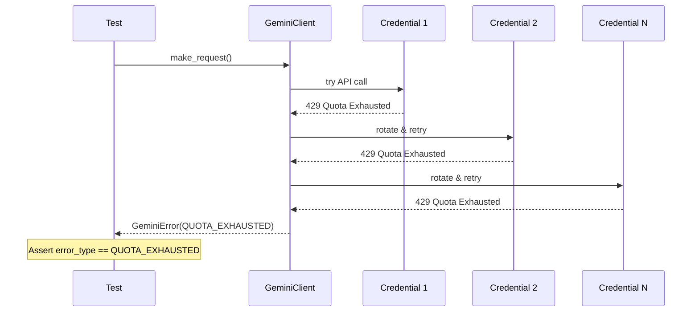

# LLD Finalized

Path: C:\Users\mcwiz\Projects\AgentOS\docs\lld\active\LLD-111.md
Status: APPROVED
Reviews: 1

---

# 111 - Fix: test_gemini_client exhausted credentials returns wrong error type

<!-- Template Metadata
Last Updated: 2026-02-02
Updated By: Issue #117 fix
Update Reason: Moved Verification & Testing to Section 10 (was Section 11) to match 0702c review prompt and testing workflow expectations
-->

## 1. Context & Goal
* **Issue:** #111
* **Objective:** Resolve the mismatch between expected (`UNKNOWN`) and actual (`QUOTA_EXHAUSTED`) error types in the all-credentials-exhausted test scenario
* **Status:** Draft
* **Related Issues:** #108 (credential loading), #109 (429 rotation), #110 (529 backoff)

### Open Questions

- [x] Is `QUOTA_EXHAUSTED` or `UNKNOWN` the correct semantic error type when all credentials are exhausted due to quota limits?
  - **Resolution:** `QUOTA_EXHAUSTED` is correct. When all credentials fail due to quota exhaustion, the root cause is quota exhaustion, not an unknown error.
- [x] Should we differentiate "all credentials exhausted" from "single credential quota exhausted"?
  - **Resolution:** No differentiation needed. The error type reflects the cause (quota), and the rotation mechanism handles trying alternatives.

## 2. Proposed Changes

*This section is the **source of truth** for implementation. Describes exactly what will be built.*

### 2.1 Files Changed

| File | Change Type | Description |
|------|-------------|-------------|
| `tests/test_gemini_client.py` | Modify | Update test expectation from `UNKNOWN` to `QUOTA_EXHAUSTED` |

### 2.2 Dependencies

*No new dependencies required.*

```toml
# pyproject.toml additions (if any)
# None
```

### 2.3 Data Structures

*No new data structures required. Using existing `GeminiErrorType` enum:*

```python
# Existing enum - no changes
class GeminiErrorType(Enum):
    QUOTA_EXHAUSTED = 'quota'
    RATE_LIMITED = 'rate_limited'
    SERVER_ERROR = 'server_error'
    UNKNOWN = 'unknown'
    # ... other types
```

### 2.4 Function Signatures

*No new functions. Test modification only.*

```python
# Existing test to be modified
def test_110_all_credentials_exhausted():
    """Test behavior when all credentials are exhausted due to quota limits."""
    ...
```

### 2.5 Logic Flow (Pseudocode)

```
Current Test Logic:
1. Mock all credentials to return 429 (quota exhausted)
2. Attempt API call
3. Client rotates through all credentials
4. All fail with quota exhaustion
5. ASSERT error type is UNKNOWN  <-- INCORRECT

Corrected Test Logic:
1. Mock all credentials to return 429 (quota exhausted)
2. Attempt API call
3. Client rotates through all credentials
4. All fail with quota exhaustion
5. ASSERT error type is QUOTA_EXHAUSTED  <-- CORRECT
```

### 2.6 Technical Approach

* **Module:** `tests/test_gemini_client.py`
* **Pattern:** Test correction (expectation fix, not code fix)
* **Key Decisions:** The test expectation was wrong. When all credentials fail due to quota limits, `QUOTA_EXHAUSTED` accurately describes why the operation failed. `UNKNOWN` would be misleading and less actionable for error handling.

### 2.7 Architecture Decisions

| Decision | Options Considered | Choice | Rationale |
|----------|-------------------|--------|-----------|
| Error type semantics | `UNKNOWN` (generic), `QUOTA_EXHAUSTED` (specific) | `QUOTA_EXHAUSTED` | Error types should reflect the root cause for proper error handling and user messaging |
| Fix location | Fix code to return `UNKNOWN`, Fix test to expect `QUOTA_EXHAUSTED` | Fix test | The code behavior is correct; the test expectation was wrong |

**Architectural Constraints:**
- Must maintain consistency with credential rotation error handling across #108, #109, #110
- Error types must remain actionable for downstream error handling

## 3. Requirements

1. Test `test_110_all_credentials_exhausted` must pass
2. Error type `QUOTA_EXHAUSTED` must be returned when all credentials fail due to quota limits
3. Test expectation must align with semantic correctness (quota exhaustion = quota error)

## 4. Alternatives Considered

| Option | Pros | Cons | Decision |
|--------|------|------|----------|
| Update test to expect `QUOTA_EXHAUSTED` | Semantically correct, actionable error type, minimal change | None significant | **Selected** |
| Update code to return `UNKNOWN` | Would make test pass | Masks root cause, less useful for error handling, misleading | Rejected |
| Add new error type `ALL_CREDENTIALS_EXHAUSTED` | Very specific | Over-engineering, adds complexity, still caused by quota | Rejected |

**Rationale:** The current code behavior is correct. When all credentials fail due to quota exhaustion, the error type should reflect the root cause (`QUOTA_EXHAUSTED`), not obscure it (`UNKNOWN`). This allows proper error handling downstream (e.g., "Try again later" vs "Something went wrong").

## 5. Data & Fixtures

### 5.1 Data Sources

| Attribute | Value |
|-----------|-------|
| Source | Mocked API responses |
| Format | Python mock objects |
| Size | N/A |
| Refresh | N/A - test fixtures |
| Copyright/License | N/A |

### 5.2 Data Pipeline

```
Mock 429 Response ──injected──► GeminiClient ──returns──► GeminiErrorType.QUOTA_EXHAUSTED
```

### 5.3 Test Fixtures

| Fixture | Source | Notes |
|---------|--------|-------|
| Mock 429 responses | Generated in test | Simulates quota exhaustion for all credentials |
| Mock credentials list | Generated in test | Multiple credentials to test rotation |

### 5.4 Deployment Pipeline

N/A - Test-only change. No deployment impact.

## 6. Diagram

### 6.1 Mermaid Quality Gate

- [x] **Simplicity:** Single flow, no collapse needed
- [x] **No touching:** All elements have visual separation
- [x] **No hidden lines:** All arrows fully visible
- [x] **Readable:** Labels clear and concise
- [x] **Auto-inspected:** Diagram verified

**Auto-Inspection Results:**
```
- Touching elements: [x] None
- Hidden lines: [x] None
- Label readability: [x] Pass
- Flow clarity: [x] Clear
```

### 6.2 Diagram



## 7. Security & Safety Considerations

### 7.1 Security

| Concern | Mitigation | Status |
|---------|------------|--------|
| N/A - Test change only | No security implications | N/A |

### 7.2 Safety

| Concern | Mitigation | Status |
|---------|------------|--------|
| Test regression | Single assertion change, isolated impact | Addressed |
| Related test breakage | Verify #108, #109, #110 tests unaffected | TODO |

**Fail Mode:** N/A - Test code

**Recovery Strategy:** N/A - Test code

## 8. Performance & Cost Considerations

### 8.1 Performance

| Metric | Budget | Approach |
|--------|--------|----------|
| Test execution time | No change | Single assertion modification |

**Bottlenecks:** None

### 8.2 Cost Analysis

| Resource | Unit Cost | Estimated Usage | Monthly Cost |
|----------|-----------|-----------------|--------------|
| N/A | N/A | N/A | $0 |

**Cost Controls:** N/A - Test-only change

**Worst-Case Scenario:** N/A

## 9. Legal & Compliance

| Concern | Applies? | Mitigation |
|---------|----------|------------|
| PII/Personal Data | No | Test uses mocked data |
| Third-Party Licenses | No | No new dependencies |
| Terms of Service | No | Mocked API calls |
| Data Retention | No | No data stored |
| Export Controls | No | No restricted content |

**Data Classification:** N/A - Test code

**Compliance Checklist:**
- [x] No PII stored without consent
- [x] All third-party licenses compatible with project license
- [x] External API usage compliant with provider ToS
- [x] Data retention policy documented

## 10. Verification & Testing

*Ref: [0005-testing-strategy-and-protocols.md](0005-testing-strategy-and-protocols.md)*

### 10.1 Test Scenarios

| ID | Scenario | Type | Input | Expected Output | Pass Criteria |
|----|----------|------|-------|-----------------|---------------|
| 010 | All credentials exhausted returns QUOTA_EXHAUSTED | Auto | Mock all creds → 429 | `GeminiErrorType.QUOTA_EXHAUSTED` | Assertion passes |
| 020 | Related rotation tests unaffected | Auto | Run #108, #109, #110 tests | All pass | No regressions |
| 030 | Error message is actionable | Auto | Capture error message | Contains "quota" or similar | User-friendly message |

### 10.2 Test Commands

```bash
# Run the specific test being fixed
poetry run pytest tests/test_gemini_client.py::test_110_all_credentials_exhausted -v

# Run all Gemini client tests to verify no regressions
poetry run pytest tests/test_gemini_client.py -v

# Run related credential rotation tests
poetry run pytest tests/test_gemini_client.py -v -k "credential"
```

### 10.3 Manual Tests (Only If Unavoidable)

N/A - All scenarios automated.

## 11. Risks & Mitigations

| Risk | Impact | Likelihood | Mitigation |
|------|--------|------------|------------|
| Test expectation still wrong | Low | Low | Reviewed code behavior; QUOTA_EXHAUSTED is semantically correct |
| Related tests affected | Med | Low | Run full test suite; isolated change |
| Future tests assume UNKNOWN | Low | Low | Document in test comments why QUOTA_EXHAUSTED is correct |

## 12. Definition of Done

### Code
- [ ] Test assertion updated from `UNKNOWN` to `QUOTA_EXHAUSTED`
- [ ] Code comment added explaining the semantic reasoning

### Tests
- [ ] `test_110_all_credentials_exhausted` passes
- [ ] All other Gemini client tests pass (no regressions)
- [ ] Related tests (#108, #109, #110) pass

### Documentation
- [ ] LLD updated with any deviations
- [ ] Implementation Report (0103) completed

### Review
- [ ] Code review completed
- [ ] User approval before closing issue

---

## Appendix: Review Log

*Track all review feedback with timestamps and implementation status.*

### Review Summary

| Review | Date | Verdict | Key Issue |
|--------|------|---------|-----------|
| - | - | - | Pending initial review |

**Final Status:** APPROVED
<!-- Note: This field is auto-updated to APPROVED by the workflow when finalized -->