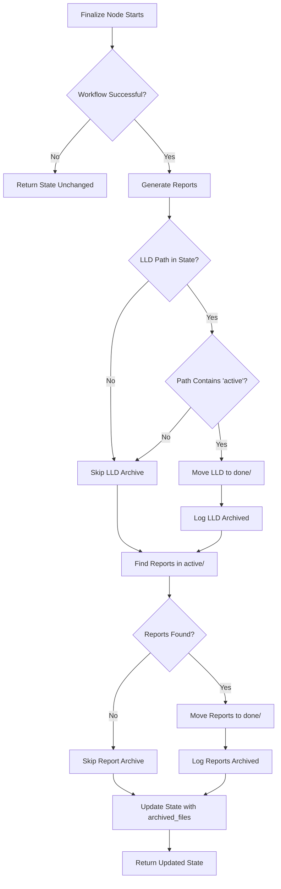

# 141 - Fix: Implementation Workflow Archive LLD and Reports to done/ on Completion

<!-- Template Metadata
Last Updated: 2025-01-09
Updated By: LLD Workflow
Update Reason: Initial draft for Issue #141
-->

## 1. Context & Goal
* **Issue:** #141
* **Objective:** Automatically archive LLD and report files from `active/` to `done/` directories when the implementation workflow completes successfully
* **Status:** Draft
* **Related Issues:** #139 (Rename workflows/testing/ to workflows/implementation/), #140 (Inhume deprecated workflows)

### Open Questions

- [x] Should archival happen only on successful completion, or also on failure with a different destination? **Answer: Only on success - failed workflows should leave artifacts in active/ for debugging**
- [x] Should we log archival to the audit trail or just print to console? **Answer: Both - print for immediate feedback, include in report for audit trail**

## 2. Proposed Changes

*This section is the **source of truth** for implementation. Describe exactly what will be built.*

### 2.1 Files Changed

| File | Change Type | Description |
|------|-------------|-------------|
| `agentos/workflows/testing/nodes/finalize.py` | Modify | Add LLD and report archival logic |
| `agentos/workflows/testing/state.py` | Modify | Ensure `lld_path` and `report_paths` are tracked in state |

### 2.2 Dependencies

*No new dependencies required.*

```toml
# pyproject.toml additions (if any)
# None - using standard library pathlib
```

### 2.3 Data Structures

```python
# Pseudocode - NOT implementation
class TestingWorkflowState(TypedDict):
    # Existing fields...
    lld_path: str  # Path to the LLD file in active/
    report_paths: list[str]  # Paths to report files in active/
    archived_files: list[str]  # NEW: Paths to archived files (for audit)
```

### 2.4 Function Signatures

```python
# Signatures only - implementation in source files
def archive_file(source_path: Path, archive_type: str = "lld") -> Path | None:
    """
    Move a file from active/ to done/ directory.
    
    Args:
        source_path: Path to file in active/ directory
        archive_type: Type of archive ("lld" or "reports")
    
    Returns:
        New path in done/ directory, or None if archival failed/skipped
    """
    ...

def finalize(state: TestingWorkflowState) -> dict[str, Any]:
    """
    Finalize the workflow - generate reports and archive artifacts.
    
    Updated to include archival of LLD and reports to done/ directories.
    """
    ...
```

### 2.5 Logic Flow (Pseudocode)

```
1. Complete existing finalize logic (report generation, etc.)
2. Archive LLD:
   a. Get lld_path from state
   b. IF lld_path exists AND contains "active" in path:
      - Calculate done_path by replacing "active" with "done"
      - Create done/ directory if not exists
      - Move file from active/ to done/
      - Log success
   c. ELSE:
      - Log skip (no LLD to archive or already archived)
3. Archive Reports:
   a. Find all report files in docs/reports/active/ matching issue number
   b. FOR each report file:
      - Calculate done_path
      - Create done/ directory if not exists
      - Move file to done/
      - Log success
4. Update state with archived_files list
5. Return updated state
```

### 2.6 Technical Approach

* **Module:** `agentos/workflows/testing/nodes/finalize.py`
* **Pattern:** Helper function extraction for reusability
* **Key Decisions:** 
  - Use `Path.rename()` for atomic moves within same filesystem
  - Check for "active" in path to avoid double-archiving
  - Create `done/` directories on demand (idempotent)

### 2.7 Architecture Decisions

| Decision | Options Considered | Choice | Rationale |
|----------|-------------------|--------|-----------|
| Archive method | Copy+delete, rename/move, symlink | `Path.rename()` | Atomic on same filesystem, cleaner than copy+delete |
| Path detection | Hardcoded paths, path contains check | Path contains "active" | More flexible, works regardless of exact path structure |
| Directory creation | Pre-create all, on-demand | On-demand with `mkdir(parents=True)` | Simpler, handles first-use case automatically |
| Error handling | Fail workflow, warn and continue | Warn and continue | Archival failure shouldn't fail an otherwise successful workflow |

**Architectural Constraints:**
- Must work with current state structure (may have `lld_path` or not)
- Must integrate with existing finalize node without breaking current behavior
- Must handle case where workflow is run after #139 renames the directory

## 3. Requirements

*What must be true when this is done. These become acceptance criteria.*

1. LLD files are moved from `docs/lld/active/` to `docs/lld/done/` on successful workflow completion
2. Report files are moved from `docs/reports/active/` to `docs/reports/done/` on successful workflow completion
3. Archival is logged to console for immediate visibility
4. Archival is recorded in workflow state for audit trail
5. Missing files or already-archived files are handled gracefully (warn, don't fail)
6. `done/` directories are created automatically if they don't exist

## 4. Alternatives Considered

| Option | Pros | Cons | Decision |
|--------|------|------|----------|
| Move files in finalize node | Single location, integrated with workflow | Couples archival to finalize logic | **Selected** |
| Separate archive node | Clean separation, can be reused | More complexity, another node to maintain | Rejected |
| Post-workflow hook | Decoupled from workflow internals | Harder to track state, less visibility | Rejected |
| Leave in active, separate cleanup job | No workflow changes needed | Doesn't solve the root problem, deferred maintenance | Rejected |

**Rationale:** Moving files in the finalize node is the most pragmatic solution - it's where the workflow knows it has completed successfully, and it keeps all cleanup logic in one place.

## 5. Data & Fixtures

### 5.1 Data Sources

| Attribute | Value |
|-----------|-------|
| Source | Local filesystem (docs/lld/active/, docs/reports/active/) |
| Format | Markdown files |
| Size | Typically < 100KB per file |
| Refresh | Created during workflow execution |
| Copyright/License | N/A - project artifacts |

### 5.2 Data Pipeline

```
docs/lld/active/LLD-{issue}.md ──rename──► docs/lld/done/LLD-{issue}.md
docs/reports/active/*-{issue}.md ──rename──► docs/reports/done/*-{issue}.md
```

### 5.3 Test Fixtures

| Fixture | Source | Notes |
|---------|--------|-------|
| Mock LLD file in active/ | Generated | Create temp file for test |
| Mock report files in active/ | Generated | Create temp files for test |
| State dict with lld_path | Hardcoded | Minimal state for unit test |

### 5.4 Deployment Pipeline

No special deployment considerations - this is a code change that takes effect immediately on merge.

## 6. Diagram

### 6.1 Mermaid Quality Gate

Before finalizing any diagram, verify in [Mermaid Live Editor](https://mermaid.live) or GitHub preview:

- [x] **Simplicity:** Similar components collapsed (per 0006 §8.1)
- [x] **No touching:** All elements have visual separation (per 0006 §8.2)
- [x] **No hidden lines:** All arrows fully visible (per 0006 §8.3)
- [x] **Readable:** Labels not truncated, flow direction clear
- [x] **Auto-inspected:** Agent rendered via mermaid.ink and viewed (per 0006 §8.5)

**Auto-Inspection Results:**
```
- Touching elements: [x] None
- Hidden lines: [x] None
- Label readability: [x] Pass
- Flow clarity: [x] Clear
```

### 6.2 Diagram



## 7. Security & Safety Considerations

### 7.1 Security

| Concern | Mitigation | Status |
|---------|------------|--------|
| Path traversal | Only operate on paths within docs/ directory | Addressed |
| Unintended file deletion | Use rename (move), not delete | Addressed |

### 7.2 Safety

| Concern | Mitigation | Status |
|---------|------------|--------|
| Data loss on failed move | Path.rename() is atomic; file stays in source on failure | Addressed |
| Overwriting existing files | Check if destination exists before move, warn if so | Addressed |
| Partial archival | Continue on individual file failures, report all results | Addressed |

**Fail Mode:** Fail Open - If archival fails, workflow still succeeds (files remain in active/)

**Recovery Strategy:** Files left in active/ can be manually moved or will be archived on next successful run of same issue

## 8. Performance & Cost Considerations

### 8.1 Performance

| Metric | Budget | Approach |
|--------|--------|----------|
| Latency | < 100ms | File rename is O(1) operation |
| Memory | < 1MB | Only path strings in memory |
| I/O | 2-5 file operations | Minimal filesystem operations |

**Bottlenecks:** None expected - file moves are nearly instantaneous on same filesystem

### 8.2 Cost Analysis

| Resource | Unit Cost | Estimated Usage | Monthly Cost |
|----------|-----------|-----------------|--------------|
| Filesystem I/O | $0 | Negligible | $0 |

**Cost Controls:** N/A - no external resources consumed

**Worst-Case Scenario:** Even with 1000 files, total time would be < 1 second

## 9. Legal & Compliance

| Concern | Applies? | Mitigation |
|---------|----------|------------|
| PII/Personal Data | No | LLD and reports are technical documents |
| Third-Party Licenses | No | Moving internal project files |
| Terms of Service | No | Local filesystem operations only |
| Data Retention | N/A | Files preserved, just moved |
| Export Controls | No | Technical documentation only |

**Data Classification:** Internal

**Compliance Checklist:**
- [x] No PII stored without consent - N/A
- [x] All third-party licenses compatible - N/A
- [x] External API usage compliant - N/A
- [x] Data retention policy documented - Files preserved in done/

## 10. Verification & Testing

### 10.1 Test Scenarios

| ID | Scenario | Type | Input | Expected Output | Pass Criteria |
|----|----------|------|-------|-----------------|---------------|
| 010 | Archive LLD from active to done | Auto | State with lld_path in active/ | File moved to done/, state updated | File exists in done/, not in active/ |
| 020 | Archive multiple reports | Auto | Reports in active/ matching issue | All reports moved to done/ | All files in done/, none in active/ |
| 030 | Skip LLD when not in state | Auto | State without lld_path | No error, graceful skip | Log indicates skip, workflow completes |
| 040 | Skip LLD when already in done | Auto | State with lld_path in done/ | No error, no double-move | File stays in done/, no error |
| 050 | Create done/ directory if missing | Auto | No done/ directory exists | Directory created, file moved | Directory exists, file in place |
| 060 | Handle missing source file | Auto | lld_path points to non-existent file | Warning logged, workflow continues | No exception, warning in logs |
| 070 | Handle destination file exists | Auto | File already exists in done/ | Warning logged, source preserved | Both files preserved, warning logged |

### 10.2 Test Commands

```bash
# Run all automated tests
poetry run pytest tests/workflows/testing/test_finalize.py -v

# Run only archive-related tests
poetry run pytest tests/workflows/testing/test_finalize.py -v -k "archive"

# Run with coverage
poetry run pytest tests/workflows/testing/test_finalize.py -v --cov=agentos.workflows.testing.nodes.finalize
```

### 10.3 Manual Tests (Only If Unavoidable)

N/A - All scenarios automated.

## 11. Risks & Mitigations

| Risk | Impact | Likelihood | Mitigation |
|------|--------|------------|------------|
| File system permissions prevent move | Med | Low | Check permissions, log clear error message |
| Cross-device move (rename fails) | Med | Low | Fall back to copy+delete if rename raises |
| State doesn't contain lld_path | Low | Med | Graceful handling - check before access |
| Workflow path changes from #139 | Low | High | Use relative path detection, not absolute paths |

## 12. Definition of Done

### Code
- [ ] Implementation complete and linted
- [ ] Code comments reference this LLD
- [ ] `archive_file()` helper function implemented
- [ ] Finalize node updated to call archival logic

### Tests
- [ ] All test scenarios pass
- [ ] Test coverage meets threshold (>80% for modified files)
- [ ] Edge cases tested (missing files, existing destinations)

### Documentation
- [ ] LLD updated with any deviations
- [ ] Implementation Report (0103) completed
- [ ] Test Report (0113) completed if applicable

### Review
- [ ] Code review completed
- [ ] User approval before closing issue

---

## Appendix: Review Log

*Track all review feedback with timestamps and implementation status.*

### Review Summary

| Review | Date | Verdict | Key Issue |
|--------|------|---------|-----------|
| - | - | - | Awaiting review |

**Final Status:** PENDING
<!-- Note: This field is auto-updated to APPROVED by the workflow when finalized -->