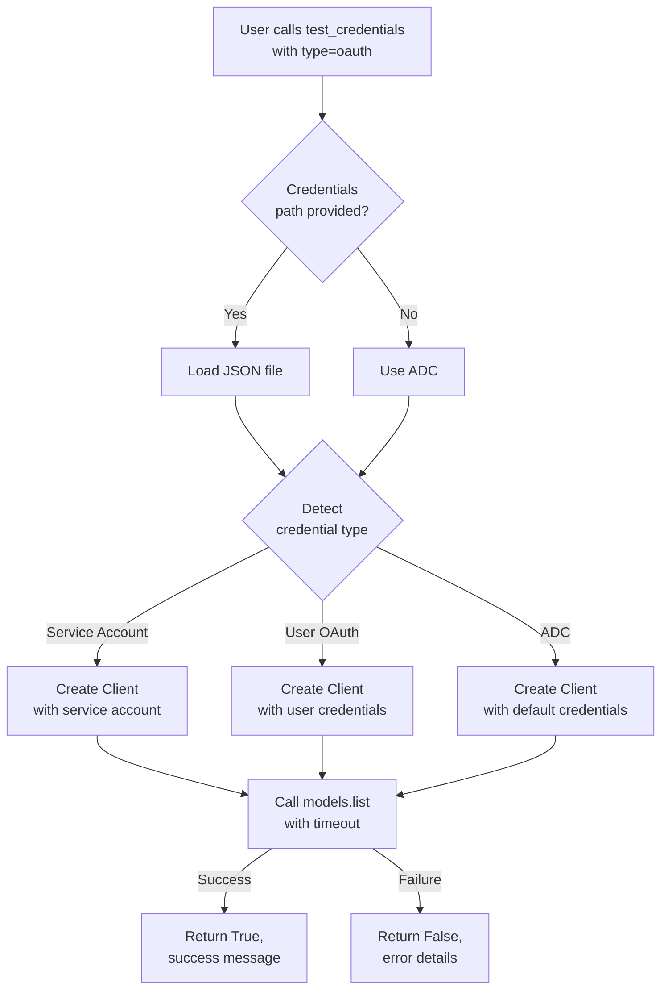

# 0150 - Fix: OAuth Test Not Implemented in gemini-test-credentials-v2.py

<!-- Template Metadata
Last Updated: 2025-01-XX
Updated By: LLD creation for Issue #150
Update Reason: Initial LLD for OAuth testing implementation - Revision 1 addressing Gemini Review #1
-->

## 1. Context & Goal
* **Issue:** #150
* **Objective:** Implement actual OAuth credential testing for the google-genai SDK in gemini-test-credentials-v2.py
* **Status:** Draft
* **Related Issues:** None identified

### Open Questions
*Questions that need clarification before or during implementation. Remove when resolved.*

- [ ] What OAuth flow does the existing system use? (Application Default Credentials, Service Account, User OAuth?)
- [ ] Are there existing OAuth credentials in the codebase we can reference for the expected format?
- [ ] Should we support multiple OAuth credential types or focus on the most common use case?

## 2. Proposed Changes

*This section is the **source of truth** for implementation. Describe exactly what will be built.*

### 2.1 Files Changed

| File | Change Type | Description |
|------|-------------|-------------|
| `tools/gemini-test-credentials-v2.py` | Modify | Replace hardcoded OAuth failure with actual OAuth testing implementation |

### 2.2 Dependencies

*New packages, APIs, or services required.*

```toml
# pyproject.toml additions (if any)
# google-genai should already include OAuth support
# No additional dependencies expected
```

### 2.3 Data Structures

```python
# Pseudocode - NOT implementation
class OAuthCredentialResult(TypedDict):
    success: bool           # Whether OAuth test passed
    message: str            # Human-readable status message
    credential_type: str    # Specific OAuth type detected (ADC, service_account, user)
    scopes: list[str]       # OAuth scopes available (if retrievable)
```

### 2.4 Function Signatures

```python
# Signatures only - implementation in source files
def test_oauth_credentials(credentials_path: str | None = None) -> tuple[bool, str]:
    """
    Test OAuth credentials using the google-genai SDK.
    
    Args:
        credentials_path: Optional path to credentials JSON file.
                         If None, uses Application Default Credentials.
                         Supports both service account JSON and user OAuth
                         (refresh token) JSON formats.
    
    Returns:
        Tuple of (success: bool, message: str)
    """
    ...

def _detect_oauth_type(credentials_path: str | None) -> str:
    """
    Detect the type of OAuth credentials being used.
    
    Returns:
        One of: 'adc', 'service_account', 'user_oauth', 'unknown'
    """
    ...

def _validate_oauth_with_api_call(client: genai.Client, timeout: float = 30.0) -> tuple[bool, str]:
    """
    Validate OAuth credentials by making a minimal API call.
    
    Args:
        client: Configured genai.Client instance
        timeout: Maximum seconds to wait for API response (default: 30.0)
    
    Returns:
        Tuple of (success: bool, message: str)
    """
    ...
```

### 2.5 Logic Flow (Pseudocode)

```
1. Receive OAuth credential test request
2. Determine credential source:
   IF credentials_path provided THEN
     - Validate file exists
     - Parse JSON to detect type (service_account vs user_oauth)
   ELSE
     - Attempt to use Application Default Credentials (ADC)
3. Create google-genai Client with OAuth credentials:
   - Use appropriate credential configuration based on detected type
4. Validate credentials with minimal API call:
   - Call models.list() with timeout as lightweight validation
   - This confirms authentication works without token consumption
5. IF API call succeeds THEN
   - Return (True, "OAuth credentials valid: {credential_type}")
   ELSE
   - Parse error for helpful message
   - Return (False, "OAuth validation failed: {error_details}")
6. Handle exceptions gracefully:
   - FileNotFoundError: Credentials file not found
   - JSONDecodeError: Invalid credentials format
   - google.auth exceptions: Authentication failures
   - Network errors: Connectivity issues
   - TimeoutError: Connection timeout
```

### 2.6 Technical Approach

* **Module:** `tools/gemini-test-credentials-v2.py`
* **Pattern:** Strategy pattern for different OAuth types
* **Key Decisions:** 
  - Use `models.list()` as validation call (lightweight, no token cost)
  - Support both explicit credentials file and ADC
  - Support service account and user OAuth (refresh token) credentials
  - Match existing code style and error handling patterns
  - Include configurable timeout to prevent hanging

### 2.7 Architecture Decisions

| Decision | Options Considered | Choice | Rationale |
|----------|-------------------|--------|-----------|
| Validation method | Token introspection, API call, Offline validation | API call (models.list) | Only reliable way to confirm credentials work end-to-end |
| Credential detection | Manual parsing, google-auth library | google-auth library | More robust, handles edge cases |
| ADC support | Require explicit path, Support ADC | Support both | Aligns with Google's recommended credential patterns |
| Timeout handling | No timeout, Fixed timeout, Configurable timeout | Configurable timeout (default 30s) | Prevents hanging while allowing flexibility |

**Architectural Constraints:**
- Must integrate with existing credential testing framework in the file
- Cannot introduce external dependencies beyond what google-genai provides
- Must maintain consistent return type with existing `test_api_key_credentials()` function

## 3. Requirements

*What must be true when this is done. These become acceptance criteria.*

1. OAuth credential testing returns accurate success/failure based on actual credential validation
2. Support for Application Default Credentials (ADC) when no explicit path provided
3. Support for service account JSON credentials
4. Support for user OAuth credentials (refresh token based)
5. Clear, actionable error messages for common failure modes
6. Consistent behavior with existing API key testing in the same file

## 4. Alternatives Considered

| Option | Pros | Cons | Decision |
|--------|------|------|----------|
| Implement full OAuth testing | Complete feature parity, users can verify OAuth setup | More complex, requires understanding OAuth flows | **Selected** |
| Remove OAuth option entirely | Simple, no maintenance burden | Reduces tool utility, breaks user workflows | Rejected |
| Stub with "use other tool" message | Quick fix, directs users elsewhere | Unhelpful, tool should be self-contained | Rejected |
| Support only ADC | Simplest implementation | Doesn't cover all credential types | Rejected |

**Rationale:** The tool's purpose is credential testing - having a non-functional OAuth option defeats this purpose. Full implementation provides value and consistency.

## 5. Data & Fixtures

### 5.1 Data Sources

| Attribute | Value |
|-----------|-------|
| Source | Local credentials files or environment (ADC) |
| Format | JSON (service account or user OAuth refresh token) or gcloud auth state |
| Size | ~2-5 KB per credentials file |
| Refresh | N/A - credentials managed externally |
| Copyright/License | N/A - user's own credentials |

### 5.2 Data Pipeline

```
Credentials File/ADC ──parse──► google-auth Credentials ──configure──► genai.Client ──validate──► API Response
```

### 5.3 Test Fixtures

| Fixture | Source | Notes |
|---------|--------|-------|
| Mock service account JSON | Generated | Synthetic credentials for structure validation |
| Mock user OAuth JSON | Generated | Synthetic refresh token credentials for structure validation |
| Mock ADC environment | Mocked | Simulate ADC discovery |
| API response mocks | Generated | Mock successful/failed API responses |

### 5.4 Deployment Pipeline

No deployment - this is a CLI tool run locally. Changes are available immediately upon code update.

**If data source is external:** N/A - credentials are user-provided

## 6. Diagram

### 6.1 Mermaid Quality Gate

Before finalizing any diagram, verify in [Mermaid Live Editor](https://mermaid.live) or GitHub preview:

- [x] **Simplicity:** Similar components collapsed (per 0006 §8.1)
- [x] **No touching:** All elements have visual separation (per 0006 §8.2)
- [x] **No hidden lines:** All arrows fully visible (per 0006 §8.3)
- [x] **Readable:** Labels not truncated, flow direction clear
- [ ] **Auto-inspected:** Agent rendered via mermaid.ink and viewed (per 0006 §8.5)

**Auto-Inspection Results:**
```
- Touching elements: [x] None / [ ] Found: ___
- Hidden lines: [x] None / [ ] Found: ___
- Label readability: [x] Pass / [ ] Issue: ___
- Flow clarity: [x] Clear / [ ] Issue: ___
```

### 6.2 Diagram



## 7. Security & Safety Considerations

### 7.1 Security

| Concern | Mitigation | Status |
|---------|------------|--------|
| Credential exposure in logs | Never log credential content, only metadata | Addressed |
| Path traversal in credentials_path | Validate path, use pathlib | Addressed |
| Credential file permissions | Warn if file has overly permissive permissions | TODO |

### 7.2 Safety

| Concern | Mitigation | Status |
|---------|------------|--------|
| Invalid credentials causing lockout | Only make read-only API calls | Addressed |
| Network timeout hanging tool | Set configurable timeout on API calls (default 30s) | Addressed |
| Corrupted credentials file | Graceful JSON parsing with clear error | Addressed |

**Fail Mode:** Fail Closed - Any error returns failure with descriptive message

**Recovery Strategy:** Tool is stateless; re-run with corrected credentials

## 8. Performance & Cost Considerations

### 8.1 Performance

| Metric | Budget | Approach |
|--------|--------|----------|
| Latency | < 5 seconds (typical), < 30 seconds (max) | Single lightweight API call with timeout |
| Memory | < 50MB | Minimal object creation |
| API Calls | 1 per test | Only models.list() for validation |

**Bottlenecks:** Network latency to Google API

### 8.2 Cost Analysis

| Resource | Unit Cost | Estimated Usage | Monthly Cost |
|----------|-----------|-----------------|--------------|
| Gemini API (models.list) | $0 | N/A (free endpoint) | $0 |

**Cost Controls:**
- [x] Using free API endpoint for validation
- [x] No token generation during testing
- [x] Single API call per test run

**Worst-Case Scenario:** No cost impact - models.list is free

## 9. Legal & Compliance

| Concern | Applies? | Mitigation |
|---------|----------|------------|
| PII/Personal Data | No | Tool tests credentials, doesn't handle user data |
| Third-Party Licenses | No | Using Google's official SDK |
| Terms of Service | Yes | API calls comply with Google Cloud ToS |
| Data Retention | No | No data stored by this tool |
| Export Controls | N/A | N/A |

**Data Classification:** Internal (credentials are sensitive but not stored)

**Compliance Checklist:**
- [x] No PII stored without consent
- [x] All third-party licenses compatible with project license
- [x] External API usage compliant with provider ToS
- [x] Data retention policy documented

## 10. Verification & Testing

### 10.1 Test Scenarios

| ID | Scenario | Type | Input | Expected Output | Pass Criteria |
|----|----------|------|-------|-----------------|---------------|
| 010 | Valid service account credentials | Auto-Live | Valid SA JSON | (True, "OAuth credentials valid: service_account") | Returns success tuple with correct type |
| 015 | Valid user OAuth credentials | Auto-Live | Valid user OAuth JSON with refresh token | (True, "OAuth credentials valid: user_oauth") | Returns success tuple with correct type |
| 020 | Valid ADC environment | Auto-Live | ADC configured | (True, "OAuth credentials valid: adc") | Returns success tuple with correct type |
| 030 | Invalid credentials file path | Auto | Non-existent path | (False, "File not found...") | Returns failure with path error |
| 040 | Malformed JSON credentials | Auto | Invalid JSON | (False, "Invalid credentials format") | Returns failure with format error |
| 050 | Valid format, invalid credentials | Auto-Live | Expired/revoked creds | (False, "Authentication failed...") | Returns failure with auth error |
| 060 | Missing OAuth scopes | Auto-Live | Limited scope creds | (False, "Insufficient permissions...") | Returns failure with scope error |
| 070 | Network timeout | Auto | Mocked timeout | (False, "Connection timeout...") | Returns failure with timeout error |
| 080 | Empty credentials path | Auto | "" | (False, "Invalid path") | Validates empty string handling |
| 090 | Detect service account type | Auto | SA JSON structure | 'service_account' | _detect_oauth_type returns correct type |
| 100 | Detect user OAuth type | Auto | User OAuth JSON structure | 'user_oauth' | _detect_oauth_type returns correct type |

### 10.2 Test Commands

```bash
# Run all automated tests
poetry run pytest tests/test_gemini_test_credentials_v2.py -v

# Run only fast/mocked tests (exclude live)
poetry run pytest tests/test_gemini_test_credentials_v2.py -v -m "not live"

# Run live integration tests (requires valid credentials)
poetry run pytest tests/test_gemini_test_credentials_v2.py -v -m live

# Run specific OAuth tests
poetry run pytest tests/test_gemini_test_credentials_v2.py -v -k "oauth"
```

### 10.3 Manual Tests (Only If Unavoidable)

**N/A - All scenarios automated.**

Live tests (Auto-Live) require valid credentials in CI environment or local testing, but execution is still automated.

## 11. Risks & Mitigations

| Risk | Impact | Likelihood | Mitigation |
|------|--------|------------|------------|
| google-genai SDK changes OAuth handling | Med | Low | Pin SDK version, monitor changelogs |
| ADC behavior varies by environment | Low | Med | Clear documentation, environment detection |
| Rate limiting on models.list | Low | Low | Single call per test, add retry with backoff |
| Credentials file format variations | Med | Med | Support common formats, clear error for unsupported |

## 12. Definition of Done

### Code
- [ ] Implementation complete and linted
- [ ] Code comments reference this LLD
- [ ] Removed hardcoded failure stub
- [ ] Added proper OAuth testing logic

### Tests
- [ ] All test scenarios pass
- [ ] Test coverage meets threshold
- [ ] Both mocked and live tests implemented

### Documentation
- [ ] LLD updated with any deviations
- [ ] Implementation Report (0103) completed
- [ ] Tool help text updated to document support for both SA and user OAuth JSON formats

### Review
- [ ] Code review completed
- [ ] User approval before closing issue

---

## Appendix: Review Log

*Track all review feedback with timestamps and implementation status.*

### Gemini Review #1 (REVISE)

**Timestamp:** 2025-01-XX
**Reviewer:** Gemini 3 Pro
**Verdict:** REVISE

#### Comments

| ID | Comment | Implemented? |
|----|---------|--------------|
| G1.1 | "Requirement Coverage Gap: Requirement 4 states 'Support for user OAuth credentials (refresh token based)'. However, Section 10.1 (Test Scenarios) only lists scenarios for Service Account (010) and ADC (020). There is no specific test case for User OAuth credentials." | YES - Added scenario 015 for user OAuth, plus scenarios 090 and 100 for type detection |
| G1.2 | "Consider adding a timeout parameter to the models.list() call to prevent the tool from hanging indefinitely on network issues" | YES - Added timeout parameter to _validate_oauth_with_api_call signature (Section 2.4), updated Architecture Decisions (Section 2.7), updated diagram (Section 6.2), updated Safety table (Section 7.2), updated Performance table (Section 8.1) |
| G1.3 | "Ensure the help text for the tool is updated to reflect that credentials_path supports both SA and User OAuth JSON formats" | YES - Added to Definition of Done (Section 12, Documentation) |

### Review Summary

| Review | Date | Verdict | Key Issue |
|--------|------|---------|-----------|
| Gemini #1 | 2025-01-XX | REVISE | Missing test scenario for User OAuth credentials |

**Final Status:** PENDING
<!-- Note: This field is auto-updated to APPROVED by the workflow when finalized -->