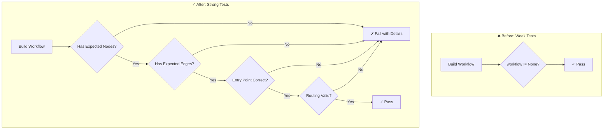

# LLD Finalized

Path: C:\Users\mcwiz\Projects\AgentOS\docs\lld\active\LLD-153.md
Status: APPROVED
Reviews: 1

---

# 153 - Fix: Weak Tests Only Check Object Existence, Not Behavior

<!-- Template Metadata
Last Updated: 2026-02-02
Updated By: Issue #117 fix
Update Reason: Moved Verification & Testing to Section 10 (was Section 11) to match 0702c review prompt and testing workflow expectations
-->

## 1. Context & Goal
* **Issue:** #153
* **Objective:** Replace weak existence-only test assertions with comprehensive behavioral verification that validates workflow structure, nodes, edges, and routing logic.
* **Status:** Draft
* **Related Issues:** N/A

### Open Questions
*Questions that need clarification before or during implementation. Remove when resolved.*

- [ ] Should we add integration tests that actually execute workflows with mock data, or limit scope to structural validation?
- [ ] Are there additional workflow files beyond the three identified that need similar improvements?

## 2. Proposed Changes

*This section is the **source of truth** for implementation. Describe exactly what will be built.*

### 2.1 Files Changed

| File | Change Type | Description |
|------|-------------|-------------|
| `tests/test_issue_workflow.py` | Modify | Replace line 532 existence check with structural and behavioral assertions |
| `tests/test_testing_workflow.py` | Modify | Replace line 440 existence check with structural and behavioral assertions |
| `tests/test_lld_workflow.py` | Modify | Replace line 295 existence check with structural and behavioral assertions |
| `tests/unit/test_requirements_graph.py` | Modify | Replace lines 21, 32, 40 existence checks with graph structure validation |
| `tests/conftest.py` | Modify | Add shared fixtures for workflow testing utilities |

### 2.2 Dependencies

*No new packages required. Uses existing pytest and workflow testing infrastructure.*

```toml
# No additions needed
```

### 2.3 Data Structures

```python
# Pseudocode - NOT implementation
class WorkflowTestSpec(TypedDict):
    """Specification for validating a workflow's structure."""
    expected_nodes: list[str]  # Node names that must exist
    expected_edges: list[tuple[str, str]]  # (source, target) edges
    entry_point: str  # Expected entry node
    terminal_nodes: list[str]  # Expected end states

class GraphTestSpec(TypedDict):
    """Specification for validating a requirements graph."""
    expected_nodes: list[str]  # Node names that must exist
    expected_edges: list[tuple[str, str]]  # Directed edges
    must_compile: bool  # Whether graph should compile successfully
```

### 2.4 Function Signatures

```python
# Signatures only - implementation in source files

def assert_workflow_has_nodes(workflow: CompiledGraph, nodes: list[str]) -> None:
    """Assert that workflow contains all expected nodes."""
    ...

def assert_workflow_has_edges(workflow: CompiledGraph, edges: list[tuple[str, str]]) -> None:
    """Assert that workflow contains all expected edges."""
    ...

def assert_workflow_entry_point(workflow: CompiledGraph, entry: str) -> None:
    """Assert that workflow has the expected entry point."""
    ...

def assert_graph_structure(graph: StateGraph, spec: GraphTestSpec) -> None:
    """Comprehensive assertion helper for graph validation."""
    ...

def get_workflow_node_names(workflow: CompiledGraph) -> set[str]:
    """Extract node names from a compiled workflow for testing."""
    ...

def get_workflow_edges(workflow: CompiledGraph) -> set[tuple[str, str]]:
    """Extract edges from a compiled workflow for testing."""
    ...
```

### 2.5 Logic Flow (Pseudocode)

```
1. For each weak test identified:
   a. Identify the workflow builder function being tested
   b. Determine expected structure from workflow definition
   c. Replace `assert X is not None` with:
      - Node existence assertions
      - Edge connectivity assertions  
      - Entry point validation
      - Conditional routing verification (where applicable)
      
2. For graph tests:
   a. Assert node presence
   b. Assert compilation succeeds
   c. Verify compiled graph has expected structure
   d. Test edge connectivity

3. Add negative tests:
   - Invalid inputs should fail gracefully
   - Missing nodes should be detectable
```

### 2.6 Technical Approach

* **Module:** `tests/` (test files only)
* **Pattern:** Arrange-Act-Assert with comprehensive structural validation
* **Key Decisions:** 
  - Create reusable assertion helpers in conftest.py to avoid duplication
  - Focus on structural validation first, with behavioral tests as follow-up
  - Use workflow introspection to extract nodes/edges rather than hardcoding

### 2.7 Architecture Decisions

| Decision | Options Considered | Choice | Rationale |
|----------|-------------------|--------|-----------|
| Test helper location | Inline in each test file, Shared in conftest.py, Separate test_utils module | conftest.py | Standard pytest pattern, auto-discovered, minimal import overhead |
| Validation approach | Hardcoded expected values, Dynamic introspection, Schema validation | Hybrid (hardcoded expected + introspection for actual) | Hardcoded expectations catch unintended changes; introspection verifies reality |
| Edge verification | Check specific edges, Check edge count only, Check graph connectivity | Check specific critical edges + count | Balance between rigidity and maintainability |

**Architectural Constraints:**
- Must not modify any production code - tests only
- Must remain compatible with existing CI pipeline
- Must not significantly increase test execution time

## 3. Requirements

*What must be true when this is done. These become acceptance criteria.*

1. All identified weak tests (`assert X is not None`) are replaced with meaningful structural assertions
2. Tests fail if workflow nodes are missing or renamed
3. Tests fail if workflow edges are disconnected or misconfigured
4. Tests verify entry points are correctly set
5. Test helpers are reusable across all workflow tests
6. Existing test suite continues to pass (no regressions)
7. Test coverage for workflow structure increases measurably

## 4. Alternatives Considered

| Option | Pros | Cons | Decision |
|--------|------|------|----------|
| Structural assertions only | Simple, fast, catches renames | Doesn't verify behavior | **Selected** for Phase 1 |
| Full behavioral tests with mocks | Complete coverage | Complex, slower, higher maintenance | Rejected (future enhancement) |
| Property-based testing | Exhaustive edge cases | Overkill for structure tests | Rejected |
| Snapshot testing | Easy to create | Brittle, unclear failures | Rejected |

**Rationale:** Structural assertions provide immediate value by catching common errors (missing nodes, broken edges) without the complexity of behavioral mocking. Behavioral tests can be added as a follow-up enhancement.

## 5. Data & Fixtures

### 5.1 Data Sources

| Attribute | Value |
|-----------|-------|
| Source | Workflow builder functions in production code |
| Format | CompiledGraph / StateGraph objects |
| Size | Small (typically 5-15 nodes per workflow) |
| Refresh | N/A - built fresh each test |
| Copyright/License | N/A - internal code |

### 5.2 Data Pipeline

```
build_*_workflow() ──invocation──► CompiledGraph ──introspection──► Test Assertions
```

### 5.3 Test Fixtures

| Fixture | Source | Notes |
|---------|--------|-------|
| `issue_workflow` | `build_issue_workflow()` | Fresh instance per test |
| `testing_workflow` | `build_testing_workflow()` | Fresh instance per test |
| `lld_workflow` | `build_lld_workflow()` | Fresh instance per test |
| `sample_requirements_graph` | Generated in test | Minimal valid graph for testing |

### 5.4 Deployment Pipeline

Tests run locally via `poetry run pytest` and in CI on PR submission. No external data dependencies.

**If data source is external:** N/A - all data is generated by the code under test.

## 6. Diagram

### 6.1 Mermaid Quality Gate

- [x] **Simplicity:** Similar components collapsed
- [x] **No touching:** All elements have visual separation
- [x] **No hidden lines:** All arrows fully visible
- [x] **Readable:** Labels not truncated, flow direction clear
- [ ] **Auto-inspected:** Agent rendered via mermaid.ink and viewed

**Auto-Inspection Results:**
```
- Touching elements: [ ] None / [ ] Found: ___
- Hidden lines: [ ] None / [ ] Found: ___
- Label readability: [ ] Pass / [ ] Issue: ___
- Flow clarity: [ ] Clear / [ ] Issue: ___
```

### 6.2 Diagram



## 7. Security & Safety Considerations

### 7.1 Security

| Concern | Mitigation | Status |
|---------|------------|--------|
| Test code injection | Tests only read workflow structure, no execution of arbitrary code | Addressed |
| Credential exposure | No credentials used in structural tests | N/A |

### 7.2 Safety

| Concern | Mitigation | Status |
|---------|------------|--------|
| False positives | Tests validate specific expectations, not arbitrary constraints | Addressed |
| Test brittleness | Balance between specificity and flexibility in assertions | Addressed |
| CI pipeline impact | Tests are fast (<1s each), no resource exhaustion risk | Addressed |

**Fail Mode:** Fail Closed - Tests fail loudly when structure doesn't match expectations

**Recovery Strategy:** Clear error messages indicate which nodes/edges are missing or unexpected

## 8. Performance & Cost Considerations

### 8.1 Performance

| Metric | Budget | Approach |
|--------|--------|----------|
| Test execution time | < 100ms per test | No I/O, pure in-memory assertions |
| Memory | < 10MB | Workflow graphs are small |
| CI time impact | < 5 seconds total | Structural checks are O(n) |

**Bottlenecks:** None expected - structural validation is fast

### 8.2 Cost Analysis

| Resource | Unit Cost | Estimated Usage | Monthly Cost |
|----------|-----------|-----------------|--------------|
| CI compute | ~$0.008/min | +1 min/run | ~$5 |

**Cost Controls:**
- [x] Tests are lightweight and fast
- [x] No external API calls
- [x] No significant CI time increase

**Worst-Case Scenario:** Even 100x more tests would add negligible CI time (<2 minutes)

## 9. Legal & Compliance

| Concern | Applies? | Mitigation |
|---------|----------|------------|
| PII/Personal Data | No | Tests use no personal data |
| Third-Party Licenses | No | No new dependencies |
| Terms of Service | No | No external services |
| Data Retention | No | No data stored |
| Export Controls | No | No restricted algorithms |

**Data Classification:** Internal (test code only)

**Compliance Checklist:**
- [x] No PII stored without consent
- [x] All third-party licenses compatible with project license
- [x] External API usage compliant with provider ToS
- [x] Data retention policy documented

## 10. Verification & Testing

### 10.1 Test Scenarios

| ID | Scenario | Type | Input | Expected Output | Pass Criteria |
|----|----------|------|-------|-----------------|---------------|
| 010 | Issue workflow has all expected nodes | Auto | `build_issue_workflow()` | Workflow with N0-N5 nodes | All node names present |
| 020 | Issue workflow has correct entry point | Auto | `build_issue_workflow()` | Entry = "N0_load_input" | Entry point matches |
| 030 | Issue workflow edges are connected | Auto | `build_issue_workflow()` | All expected edges exist | No orphan nodes |
| 040 | Testing workflow has all expected nodes | Auto | `build_testing_workflow()` | Workflow with expected nodes | All node names present |
| 050 | Testing workflow entry point correct | Auto | `build_testing_workflow()` | Expected entry point | Entry point matches |
| 060 | LLD workflow structure valid | Auto | `build_lld_workflow()` | Complete graph structure | Nodes and edges valid |
| 070 | Requirements graph compiles | Auto | `RequirementsGraph()` | Compiled graph | Compilation succeeds |
| 080 | Requirements graph has expected nodes | Auto | Compiled graph | All nodes present | Node count and names match |
| 090 | Requirements graph has expected edges | Auto | Compiled graph | All edges present | Edge connectivity valid |
| 100 | Missing node detection | Auto | Modified workflow | AssertionError | Clear error message |
| 110 | Missing edge detection | Auto | Modified workflow | AssertionError | Clear error message |

### 10.2 Test Commands

```bash
# Run all automated tests for affected files
poetry run pytest tests/test_issue_workflow.py tests/test_testing_workflow.py tests/test_lld_workflow.py tests/unit/test_requirements_graph.py -v

# Run only structure validation tests
poetry run pytest -v -k "structure or nodes or edges"

# Run with coverage
poetry run pytest tests/ -v --cov=tests --cov-report=term-missing
```

### 10.3 Manual Tests (Only If Unavoidable)

N/A - All scenarios automated.

## 11. Risks & Mitigations

| Risk | Impact | Likelihood | Mitigation |
|------|--------|------------|------------|
| Tests become too rigid | Med | Med | Use flexible assertions that allow node additions |
| Workflow API changes break tests | Med | Low | Abstract introspection into helper functions |
| Missing nodes in expected list | Low | Med | Document expected nodes from workflow definitions |
| Tests pass but behavior still broken | Med | Low | Follow up with behavioral tests in future issue |

## 12. Definition of Done

### Code
- [ ] All weak existence tests replaced with structural assertions
- [ ] Test helpers added to conftest.py
- [ ] Code comments reference Issue #153

### Tests
- [ ] All new test scenarios pass
- [ ] Existing test suite continues to pass
- [ ] No decrease in coverage

### Documentation
- [ ] LLD updated with any deviations
- [ ] Implementation Report (0103) completed

### Review
- [ ] Code review completed
- [ ] User approval before closing issue

---

## Appendix: Review Log

*Track all review feedback with timestamps and implementation status.*

### Review Summary

| Review | Date | Verdict | Key Issue |
|--------|------|---------|-----------|
| - | - | - | Awaiting initial review |

**Final Status:** APPROVED
<!-- Note: This field is auto-updated to APPROVED by the workflow when finalized -->