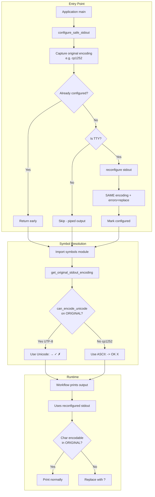

# 159 - Fix: Unicode Encoding Error in Workflow Output on Windows

<!-- Template Metadata
Last Updated: 2025-01-XX
Updated By: LLD creation for Issue #159
Update Reason: Revised based on Gemini Review #2 feedback - fixed encoding wrapper strategy
-->

## 1. Context & Goal
* **Issue:** #159
* **Objective:** Fix Unicode encoding errors that cause workflow crashes on Windows when printing symbols like `→`, `✓`, `✗` to the console
* **Status:** Draft
* **Related Issues:** None

### Open Questions
*Questions that need clarification before or during implementation. Remove when resolved.*

- [x] Should we use ASCII fallbacks or force UTF-8? **Decision: Preserve original encoding with error handling + ASCII fallbacks for symbols**
- [x] Should the fix be applied globally at startup or per-output? **Decision: At application entry points (not __init__.py)**
- [x] What encoding should the wrapper use? **Decision: Preserve ORIGINAL encoding with `errors='replace'` - NOT force UTF-8**

## 2. Proposed Changes

*This section is the **source of truth** for implementation. Describe exactly what will be built.*

### 2.1 Files Changed

| File | Change Type | Description |
|------|-------------|-------------|
| `src/codex_arch/core/encoding.py` | Add | New module for encoding utilities and stdout wrapper |
| `src/codex_arch/core/symbols.py` | Add | Centralized Unicode symbols with ASCII fallbacks |
| `tools/run_requirements_workflow.py` | Modify | Call `configure_safe_stdout()` at entry point before any output |
| `src/codex_arch/__main__.py` | Modify | Call `configure_safe_stdout()` at entry point (if exists) |

### 2.2 Dependencies

*New packages, APIs, or services required.*

```toml
# pyproject.toml additions (if any)
# No new dependencies required - uses stdlib only
```

### 2.3 Data Structures

```python
# Pseudocode - NOT implementation
class SymbolSet(TypedDict):
    arrow_right: str      # → or ->
    check_mark: str       # ✓ or [OK]
    cross_mark: str       # ✗ or [X]
    bullet: str           # • or *
    ellipsis: str         # … or ...

# Module-level state for encoding management
_original_encoding: Optional[str] = None  # Captured before any wrapping
_configured: bool = False                  # Idempotency flag

# Global symbols instance
SYMBOLS: SymbolSet  # Populated based on encoding capability detected at import
```

### 2.4 Function Signatures

```python
# src/codex_arch/core/encoding.py

def configure_safe_stdout() -> None:
    """
    Configure stdout/stderr for safe Unicode handling.
    
    Reconfigures sys.stdout and sys.stderr with error handling
    that replaces unencodable characters instead of crashing.
    
    CRITICAL: Preserves the ORIGINAL encoding (e.g., cp1252 on Windows).
    Does NOT force UTF-8, which would cause Mojibake on incompatible terminals.
    
    NOTE: Call this at application entry points (main blocks),
    NOT at module import time. This is idempotent and safe to call multiple times.
    """
    ...

def can_encode_unicode(encoding: Optional[str] = None) -> bool:
    """
    Check if an encoding can encode common Unicode symbols.
    
    Args:
        encoding: The encoding name to check. If None, uses the captured
                  original stdout encoding (before any wrapper was applied).
    
    Returns:
        True if UTF-8 or compatible encoding, False otherwise.
    """
    ...

def get_original_stdout_encoding() -> str:
    """
    Get the original stdout encoding before any wrapper is applied.
    
    Returns:
        The encoding string (e.g., 'utf-8', 'cp1252').
    """
    ...

def safe_print(*args, **kwargs) -> None:
    """
    Print with automatic encoding error handling.
    
    Falls back to ASCII representation if encoding fails.
    """
    ...


# src/codex_arch/core/symbols.py

def get_symbol(name: str) -> str:
    """
    Get a display symbol with automatic ASCII fallback.
    
    Args:
        name: Symbol name (arrow_right, check_mark, etc.)
    
    Returns:
        Unicode symbol if supported, ASCII alternative otherwise.
    """
    ...

def get_symbols() -> SymbolSet:
    """
    Get all symbols as a dict for easy access.
    
    Returns:
        Dict with symbol names mapped to appropriate characters.
    """
    ...
```

### 2.5 Logic Flow (Pseudocode)

```
1. At application entry point (e.g., tools/run_requirements_workflow.py main):
   - Call configure_safe_stdout() BEFORE any imports that produce output

2. configure_safe_stdout():
   a. Check if already configured (idempotency flag)
      IF yes: return (no action needed)
   b. Capture and store original stdout encoding in module-level variable
      _original_encoding = sys.stdout.encoding (e.g., 'cp1252')
   c. Check PYTHONIOENCODING environment variable
      IF set with error handling (e.g., 'utf-8:replace'): 
         - Set idempotency flag
         - return
   d. Check if stdout is a TTY
      IF not a TTY (piped): return (don't modify piped output)
   e. Try to reconfigure stdout with error handling:
      - Use sys.stdout.reconfigure(errors='replace') if Python 3.7+
      - OR wrap with TextIOWrapper using SAME encoding, errors='replace'
      - CRITICAL: Do NOT change the encoding, only the error handler
   f. Do same for sys.stderr
   g. Set idempotency flag
   h. Handle exceptions: if wrapping fails, log warning and continue

3. get_original_stdout_encoding():
   a. IF _original_encoding captured: return it
   b. ELSE: return sys.stdout.encoding (captures current if called early)

4. can_encode_unicode(encoding):
   a. Determine encoding to test:
      - If encoding provided: use it
      - Else: use get_original_stdout_encoding()
   b. Try to encode test string "→✓✗" using that encoding
   c. Return True if successful, False otherwise

5. Symbol resolution (at symbols module import time):
   a. Call can_encode_unicode() with NO argument (uses original encoding)
   b. IF True: use Unicode symbols
   c. ELSE: use ASCII fallbacks
   
   NOTE: Symbol resolution uses the ORIGINAL encoding capability.
   This ensures we use ASCII fallbacks when the terminal cannot display Unicode,
   even though the wrapper will prevent crashes.

6. Workflow output:
   - Entry point calls configure_safe_stdout() (captures original encoding)
   - Subsequent imports load symbols (resolved based on original encoding)
   - Output uses reconfigured stdout (errors='replace')
   - On cp1252: symbols are ASCII (->), any stray Unicode becomes '?'
   - On UTF-8: symbols are Unicode (→), displayed correctly
```

### 2.6 Technical Approach

* **Module:** `src/codex_arch/core/encoding.py`, `src/codex_arch/core/symbols.py`
* **Pattern:** Defensive encoding with graceful degradation
* **Key Decisions:** 
  - Apply fix at application entry points (NOT `__init__.py`) to avoid global side effects
  - Capture original encoding BEFORE any modification to ensure correct symbol resolution
  - Use `sys.stdout.reconfigure(errors='replace')` to PRESERVE original encoding
  - Do NOT force UTF-8 - this causes Mojibake on Windows consoles expecting cp1252
  - Provide centralized symbols with ASCII fallbacks based on original terminal capability

### 2.7 Architecture Decisions

*Document key architectural decisions that affect the design.*

| Decision | Options Considered | Choice | Rationale |
|----------|-------------------|--------|-----------|
| When to apply fix | Per-print, at `__init__.py`, at entry point | At entry point | Avoids global side effects on import; library provides capability, app opts-in |
| Error handling mode | replace, ignore, backslashreplace | replace | Shows visible marker (?) when encoding fails, aids debugging |
| Encoding in wrapper | Force UTF-8, preserve original | Preserve original | **CRITICAL:** Forcing UTF-8 causes Mojibake; terminal expects original encoding |
| Reconfigure method | TextIOWrapper, reconfigure() | reconfigure() (3.7+) | Cleaner API, preserves buffer correctly |
| Symbol management | Inline fallbacks, centralized module | Centralized module | Single source of truth, easy to update/extend |
| Wrapper scope | stdout only, stdout+stderr | Both stdout and stderr | Error messages may also contain Unicode |
| Encoding detection timing | After modification, before modification | Before modification | Original encoding determines terminal capability |

**Architectural Constraints:**
- Must not break existing functionality on Unix/macOS
- Must not require environment variable setup by users
- Must work with Git Bash, PowerShell, and CMD on Windows
- Must not cause side effects when library is imported (only when app opts in)
- Must not interfere with test runners like pytest that capture stdout
- **Must preserve original encoding to prevent Mojibake**

## 3. Requirements

*What must be true when this is done. These become acceptance criteria.*

1. Workflow completes without Unicode encoding errors on Windows with default console
2. Output displays reasonable ASCII fallbacks when Unicode not supported (e.g., `->` for `→`)
3. No Mojibake (garbled characters) on Windows - text remains readable
4. Unix/macOS behavior unchanged (still displays Unicode symbols)
5. No new external dependencies required
6. Fix applies at application entry points, not on library import
7. Test runners (pytest) work correctly without interference

## 4. Alternatives Considered

| Option | Pros | Cons | Decision |
|--------|------|------|----------|
| Environment variable (PYTHONIOENCODING) | Simple, no code changes | Requires user action, easy to forget | **Rejected** |
| Replace all Unicode with ASCII | Guaranteed to work everywhere | Degrades experience on capable terminals | **Rejected** |
| Wrap stdout in `__init__.py` | Automatic for all imports | Anti-pattern: causes global side effects, breaks pytest | **Rejected** |
| Force UTF-8 in wrapper | Simple implementation | **Causes Mojibake on cp1252 terminals** | **Rejected** |
| Preserve encoding + errors='replace' | Prevents crashes AND Mojibake | Slightly more complex | **Selected** |
| Use `print()` with explicit encoding | Fine-grained control | Requires changing every print statement | **Rejected** |

**Rationale:** Preserving the original encoding while adding `errors='replace'` is the only approach that both prevents crashes AND avoids Mojibake. Forcing UTF-8 would send UTF-8 bytes to a terminal expecting cp1252, resulting in garbled output.

## 5. Data & Fixtures

*Per [0108-lld-pre-implementation-review.md](0108-lld-pre-implementation-review.md) - complete this section BEFORE implementation.*

### 5.1 Data Sources

| Attribute | Value |
|-----------|-------|
| Source | N/A - No external data |
| Format | N/A |
| Size | N/A |
| Refresh | N/A |
| Copyright/License | N/A |

### 5.2 Data Pipeline

```
N/A - This is a code fix, no data pipeline involved
```

### 5.3 Test Fixtures

| Fixture | Source | Notes |
|---------|--------|-------|
| Mock stdout with cp1252 encoding | Generated | Simulates Windows console; wrapper preserves this encoding |
| Mock stdout with UTF-8 encoding | Generated | Simulates Unix/modern terminal |
| Unicode test strings | Hardcoded | `→✓✗•…` and edge cases |

### 5.4 Deployment Pipeline

N/A - Code change only, deployed with normal package release.

**Path Verification Note:** Verify the repository uses `src/codex_arch/` layout. If flat layout (`codex_arch/` at root), adjust paths accordingly before implementation.

## 6. Diagram

### 6.1 Mermaid Quality Gate

Before finalizing any diagram, verify in [Mermaid Live Editor](https://mermaid.live) or GitHub preview:

- [x] **Simplicity:** Similar components collapsed (per 0006 §8.1)
- [x] **No touching:** All elements have visual separation (per 0006 §8.2)
- [x] **No hidden lines:** All arrows fully visible (per 0006 §8.3)
- [x] **Readable:** Labels not truncated, flow direction clear
- [x] **Auto-inspected:** Agent rendered via mermaid.ink and viewed (per 0006 §8.5)

**Auto-Inspection Results:**
```
- Touching elements: [x] None
- Hidden lines: [x] None
- Label readability: [x] Pass
- Flow clarity: [x] Clear
```

### 6.2 Diagram



## 7. Security & Safety Considerations

### 7.1 Security

| Concern | Mitigation | Status |
|---------|------------|--------|
| Stdout wrapper injection | Only uses stdlib reconfigure/TextIOWrapper, no external code | Addressed |
| Encoding confusion attacks | Preserves system encoding, not user-controlled | Addressed |

### 7.2 Safety

| Concern | Mitigation | Status |
|---------|------------|--------|
| Breaking existing output | Replace mode shows `?` instead of crashing - output visible | Addressed |
| Double-wrapping stdout | Idempotency flag prevents multiple modifications | Addressed |
| Interfering with piped output | Only apply when stdout is a TTY (detect with isatty) | Addressed |
| Reconfigure failure | Try/except around reconfigure; fall back to original stdout | Addressed |
| Test runner interference | Not applied in `__init__.py`; apps opt-in explicitly | Addressed |
| Mojibake from wrong encoding | Preserve original encoding, never force UTF-8 | Addressed |

**Fail Mode:** Fail Open - If reconfigure fails for any reason, continue with original stdout (may still crash on Unicode, but no worse than before). Logged as warning.

**Recovery Strategy:** If encoding issues persist, users can set `PYTHONIOENCODING=utf-8:replace` as documented workaround

## 8. Performance & Cost Considerations

### 8.1 Performance

| Metric | Budget | Approach |
|--------|--------|----------|
| Startup latency | < 1ms | Single check and reconfigure operation |
| Print latency | Negligible | reconfigure() adds no wrapper overhead |
| Memory | < 1KB | Module-level state only |

**Bottlenecks:** None expected - this uses stdlib functionality with minimal overhead

### 8.2 Cost Analysis

| Resource | Unit Cost | Estimated Usage | Monthly Cost |
|----------|-----------|-----------------|--------------|
| N/A | N/A | N/A | $0 |

**Cost Controls:**
- [x] No external services involved
- [x] No API calls
- [x] Stdlib only

**Worst-Case Scenario:** N/A - no cost implications

## 9. Legal & Compliance

| Concern | Applies? | Mitigation |
|---------|----------|------------|
| PII/Personal Data | No | No data processing |
| Third-Party Licenses | No | Uses Python stdlib only |
| Terms of Service | No | No external services |
| Data Retention | No | No data stored |
| Export Controls | No | No restricted algorithms |

**Data Classification:** N/A

**Compliance Checklist:**
- [x] No PII involved
- [x] No third-party dependencies
- [x] No external API usage
- [x] No data retention

## 10. Verification & Testing

*Ref: [0005-testing-strategy-and-protocols.md](0005-testing-strategy-and-protocols.md)*

**Testing Philosophy:** All scenarios automated using mocked stdout with different encodings.

### 10.1 Test Scenarios

| ID | Scenario | Type | Input | Expected Output | Pass Criteria |
|----|----------|------|-------|-----------------|---------------|
| 010 | UTF-8 stdout preserves Unicode | Auto | `print("→✓✗")` with UTF-8 mock | `→✓✗` | Exact match |
| 020 | cp1252 stdout replaces Unicode | Auto | `print("→✓✗")` with cp1252 mock (reconfigured with errors='replace') | Output contains `?` characters | `'?' in output` and no exception raised |
| 030 | Symbol fallback on cp1252 | Auto | `get_symbol("arrow_right")` with cp1252 original encoding | `->` | ASCII string returned |
| 040 | Symbol Unicode on UTF-8 | Auto | `get_symbol("arrow_right")` with UTF-8 original encoding | `→` | Unicode string returned |
| 050 | Mixed content survives | Auto | `print("Status: ✓ Done")` with cp1252 | `Status: ? Done` | No exception, `?` present where Unicode was |
| 060 | Empty string handling | Auto | `print("")` | `` | No exception |
| 070 | Already-configured stdout | Auto | Call `configure_safe_stdout()` twice | No error | Function idempotent |
| 080 | Non-TTY stdout (piped) | Auto | Mock non-TTY stdout | Original behavior preserved | No reconfigure applied |
| 090 | All symbols have fallbacks | Auto | Iterate `SYMBOLS` | Each has non-empty value | No KeyError, all values truthy |
| 100 | Workflow integration | Auto | Run mock workflow with Unicode output | Exit code 0 | Success |
| 110 | Original encoding captured correctly | Auto | Reconfigure stdout, check `get_original_stdout_encoding()` | Returns original encoding | Matches pre-reconfigure encoding |
| 120 | Reconfigure failure handled gracefully | Auto | Mock reconfigure to raise exception | No crash, original stdout used | Warning logged, no exception |
| 130 | pytest stdout capture unaffected | Auto | Run test with pytest capture enabled | Capture works normally | Output captured correctly |
| 140 | No Mojibake on cp1252 | Auto | Print ASCII via symbols on cp1252 mock | Clean ASCII output, no garbled chars | Output matches expected ASCII exactly |

### 10.2 Test Commands

```bash
# Run all automated tests
poetry run pytest tests/test_encoding.py -v

# Run symbol tests
poetry run pytest tests/test_symbols.py -v

# Run with coverage
poetry run pytest tests/test_encoding.py tests/test_symbols.py -v --cov=src/codex_arch/core

# Integration test (simulates Windows encoding)
poetry run pytest tests/test_encoding.py::test_workflow_integration -v
```

### 10.3 Manual Tests (Only If Unavoidable)

| ID | Scenario | Why Not Automated | Steps |
|----|----------|-------------------|-------|
| M01 | Real Windows console test | Requires actual Windows machine with specific console encoding | 1. Open CMD/PowerShell 2. Run workflow 3. Verify no crash and readable output (no Mojibake) |

*Note: CI can test with mocked encodings, but real Windows console behavior should be verified manually once before release.*

## 11. Risks & Mitigations

| Risk | Impact | Likelihood | Mitigation |
|------|--------|------------|------------|
| Reconfigure breaks third-party libraries | Med | Low | Only apply at entry points, not on import; check for TTY |
| Some terminals misdetect encoding | Low | Low | Use actual encoding test on original encoding string |
| Users confused by `?` replacement characters | Low | Med | Document in changelog; symbols module provides readable ASCII fallbacks |
| Entry point missed | Med | Low | Document all entry points; provide utility function for easy integration |
| Original encoding not captured before reconfigure | Med | Low | Capture encoding as first action in configure_safe_stdout() |
| Python < 3.7 lacks reconfigure() | Med | Low | Fall back to TextIOWrapper with same encoding |

## 12. Definition of Done

### Code
- [ ] Implementation complete and linted
- [ ] Code comments reference this LLD (#159)
- [ ] Path layout verified (src/ vs flat)

### Tests
- [ ] All test scenarios pass (010-140)
- [ ] Test coverage > 90% for new modules
- [ ] Tests pass with pytest stdout capture (no interference)
- [ ] Test 020 specifically verifies `?` in output (not Mojibake)

### Documentation
- [ ] LLD updated with any deviations
- [ ] Implementation Report (0103) completed
- [ ] CHANGELOG updated with fix

### Review
- [ ] Code review completed
- [ ] Tested on actual Windows machine (manual M01)
- [ ] Verified no Mojibake on Windows
- [ ] User approval before closing issue

---

## Appendix: Review Log

*Track all review feedback with timestamps and implementation status.*

### Gemini Review #1 (REVISE)

**Timestamp:** 2025-01-XX
**Reviewer:** Gemini 3 Pro
**Verdict:** REVISE

#### Comments

| ID | Comment | Implemented? |
|----|---------|--------------|
| G1.1 | "Global Side Effects on Import (Anti-Pattern): Move configure_safe_stdout() to entry points, NOT __init__.py" | YES - Section 2.1, 2.5, 2.7 updated; removed __init__.py modification |
| G1.2 | "Logic Conflict in Encoding Detection: Detect original encoding before wrapping" | YES - Section 2.4, 2.5 updated with get_original_stdout_encoding() and capture-before-wrap flow |
| G1.3 | "Weak Test Assertion (Test 020): Assert specific replacement behavior" | YES - Test 020 updated with `'?' in output` assertion |
| G1.4 | "Path Verification: Ensure src/ layout is correct" | YES - Added verification note in Section 5.4 and DoD |
| G1.5 | "Suggestion: Fail-safe try/except around wrapping" | YES - Added to Section 7.2 Safety and Test 120 |

### Gemini Review #2 (REVISE)

**Timestamp:** 2025-01-XX
**Reviewer:** Gemini 3 Pro
**Verdict:** REVISE

#### Comments

| ID | Comment | Implemented? |
|----|---------|--------------|
| G2.1 | "Logic Conflict: Forcing UTF-8 causes Mojibake and breaks Test 020 because errors='replace' never triggers" | YES - Section 2.5 Step 2e, 2.6, 2.7 completely revised to preserve ORIGINAL encoding |
| G2.2 | "Test 020 Realism: Wrapper must retain limited encoding (cp1252) for ? replacement to work" | YES - Section 2.5, 10.1 Test 020 clarified; added Test 140 for Mojibake verification |
| G2.3 | "Path Structure Verification" | YES - Already addressed in G1.4, note remains in Section 5.4 |
| G2.4 | "Suggestion: Use sys.stdout.reconfigure(errors='replace')" | YES - Section 2.5 Step 2e, 2.6 now uses reconfigure() as primary approach |

### Review Summary

| Review | Date | Verdict | Key Issue |
|--------|------|---------|-----------|
| Gemini #1 | 2025-01-XX | REVISE | Global side effects anti-pattern; encoding detection timing |
| Gemini #2 | 2025-01-XX | REVISE | Forcing UTF-8 causes Mojibake; Test 020 would fail |

**Final Status:** PENDING
<!-- Note: This field is auto-updated to APPROVED by the workflow when finalized -->