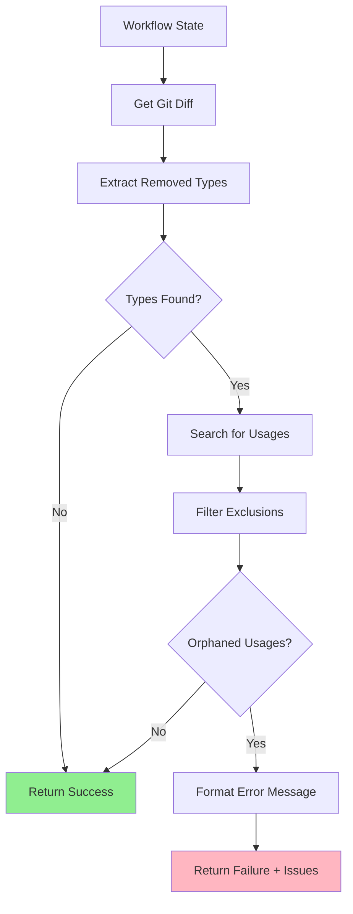

# 170 - Feature: Add pre-commit check for type/class renames that miss usages

<!-- Template Metadata
Last Updated: 2026-02-02
Updated By: Issue #170 LLD creation
Update Reason: Fixed mechanical validation errors - corrected file paths to match actual repository structure
-->

## 1. Context & Goal
* **Issue:** #170
* **Objective:** Add a LangGraph workflow node that detects when a class/type is renamed and verifies all usages are updated, preventing broken imports.
* **Status:** Draft
* **Related Issues:** #168 (bug caused by missing this check), PR #165 (the breaking change)

### Open Questions
*Questions that need clarification before or during implementation. Remove when resolved.*

- [x] Should this be a pre-commit hook or a LangGraph workflow node? → **Workflow node** (per issue specification)
- [ ] What file extensions should be checked? (Assuming `.py` files only initially)
- [ ] Should we detect renamed types (old→new) or just removed types?

## 2. Proposed Changes

*This section is the **source of truth** for implementation. Describe exactly what will be built.*

### 2.1 Files Changed

| File | Change Type | Description |
|------|-------------|-------------|
| `agentos/workflows/codegen/nodes/check_type_renames.py` | Add | New workflow node for type rename detection |
| `agentos/workflows/codegen/nodes/__init__.py` | Add | Package init exporting the new node function |
| `agentos/workflows/codegen/graph.py` | Add | Workflow graph incorporating the type rename check |
| `agentos/workflows/codegen/state.py` | Add | State model with fields for tracking detected type issues |
| `agentos/workflows/codegen/__init__.py` | Add | Package init for codegen workflow |
| `tests/unit/test_check_type_renames.py` | Add | Unit tests for the new node |
| `tests/fixtures/type_rename_scenarios/renamed_class.diff` | Add | Test fixture: class renamed without updating imports |
| `tests/fixtures/type_rename_scenarios/removed_type_alias.diff` | Add | Test fixture: TypedDict alias removed |
| `tests/fixtures/type_rename_scenarios/clean_rename.diff` | Add | Test fixture: properly renamed with all usages updated |

### 2.1.1 Path Validation (Mechanical - Auto-Checked)

*Issue #277: Before human or Gemini review, paths are verified programmatically.*

Mechanical validation automatically checks:
- All "Modify" files must exist in repository
- All "Delete" files must exist in repository
- All "Add" files must have existing parent directories
- No placeholder prefixes (`src/`, `lib/`, `app/`) unless directory exists

**Path Verification:**
- `agentos/workflows/` exists ✓
- `tests/unit/` exists ✓
- `tests/fixtures/` exists ✓
- All new files use "Add" change type ✓

**If validation fails, the LLD is BLOCKED before reaching review.**

### 2.2 Dependencies

*New packages, APIs, or services required.*

```toml
# pyproject.toml additions (if any)
# No new dependencies - uses stdlib re, subprocess, pathlib
```

### 2.3 Data Structures

```python
# Pseudocode - NOT implementation
class TypeRenameIssue(TypedDict):
    old_name: str           # The removed/renamed type name
    definition_file: str    # Where it was originally defined
    orphaned_usages: list[OrphanedUsage]  # Where it's still referenced

class OrphanedUsage(TypedDict):
    file_path: str          # File containing the orphaned reference
    line_number: int        # Line number of the reference
    line_content: str       # The actual line content for context

class TypeRenameCheckResult(TypedDict):
    passed: bool            # True if no orphaned references found
    issues: list[TypeRenameIssue]  # List of detected issues
    checked_types: list[str]       # Types that were checked
    files_scanned: int             # Number of source files scanned
```

### 2.4 Function Signatures

```python
# Signatures only - implementation in source files
def check_type_renames(state: CodegenWorkflowState) -> dict:
    """
    Pre-commit check for orphaned type references.
    
    Detects removed/renamed class/type definitions from git diff
    and greps codebase for remaining usages.
    """
    ...

def extract_removed_types(diff_content: str) -> list[tuple[str, str]]:
    """
    Parse git diff to find removed class/type definitions.
    
    Returns list of (type_name, source_file) tuples.
    """
    ...

def find_type_usages(type_name: str, search_paths: list[Path], exclude_patterns: list[str]) -> list[OrphanedUsage]:
    """
    Search codebase for usages of a type name.
    
    Excludes docs, lineage, and other non-source directories.
    """
    ...

def format_type_rename_error(issues: list[TypeRenameIssue]) -> str:
    """
    Format issues into a clear, actionable error message.
    """
    ...
```

### 2.5 Logic Flow (Pseudocode)

```
1. Receive state with staged changes (git diff)
2. Parse diff to extract removed type definitions:
   - Match patterns: `class ClassName`, `TypeName = TypedDict`, type aliases
   - Only track removals (lines starting with `-`)
3. FOR each removed type:
   a. Grep source files for usages of type name
   b. EXCLUDE from search:
      - docs/ directory
      - lineage/ directory  
      - *.md files
      - The definition file itself (for alias detection)
   c. IF usages found THEN
      - Record as orphaned usage with file, line, content
4. IF any orphaned usages found THEN
   - Set state.type_rename_check_passed = False
   - Set state.type_rename_issues = [issues]
   - Return error message listing all orphaned usages
5. ELSE
   - Set state.type_rename_check_passed = True
   - Return success
```

### 2.6 Technical Approach

* **Module:** `agentos/workflows/codegen/nodes/check_type_renames.py`
* **Pattern:** LangGraph node with pure function implementation
* **Key Decisions:** 
  - Use regex for type detection (covers classes, TypedDict, type aliases)
  - Use `git grep` for fast searching (index-aware)
  - Exclude docs/lineage by default (historical references are acceptable)

### 2.7 Architecture Decisions

*Document key architectural decisions that affect the design.*

| Decision | Options Considered | Choice | Rationale |
|----------|-------------------|--------|-----------|
| Detection method | AST parsing, Regex, Tree-sitter | Regex | Simpler, sufficient for type definitions, no extra deps |
| Search method | Python glob+search, ripgrep, git grep | git grep | Fast, respects .gitignore, available in CI |
| Scope of check | All Python types, Classes only, Configurable | Configurable | Different projects have different needs |
| Failure mode | Warning, Hard failure, Configurable | Hard failure | This is a correctness check, not style |

**Architectural Constraints:**
- Must integrate with existing LangGraph workflow pattern in `agentos/workflows/`
- Cannot introduce external dependencies (ripgrep, etc.)
- Must run fast enough for pre-commit (<5s for typical repo)

## 3. Requirements

*What must be true when this is done. These become acceptance criteria.*

1. Workflow node detects removed type definitions from git diff
2. Workflow node searches source files for orphaned references
3. Workflow fails with clear error listing file, line, and content of each orphaned usage
4. Check excludes `docs/`, `lineage/`, and markdown files
5. Check runs in under 5 seconds for repositories with <1000 Python files
6. Error messages include actionable guidance (what to fix)

## 4. Alternatives Considered

| Option | Pros | Cons | Decision |
|--------|------|------|----------|
| Regex-based detection | Simple, no deps, fast | May miss complex cases | **Selected** |
| AST parsing | Accurate, handles edge cases | Slower, more complex, needs valid Python | Rejected |
| Pre-commit hook | Runs before every commit | Separate from workflow, duplicated logic | Rejected |
| mypy/pyright integration | Type checker already does this | Slow, heavy dependency, different error format | Rejected |

**Rationale:** Regex-based detection in a workflow node provides the best balance of simplicity, speed, and integration with the existing codebase. The specific case that caused Issue #168 (simple class rename) is easily caught by regex.

## 5. Data & Fixtures

*Per [0108-lld-pre-implementation-review.md](0108-lld-pre-implementation-review.md) - complete this section BEFORE implementation.*

### 5.1 Data Sources

| Attribute | Value |
|-----------|-------|
| Source | Git diff (staged changes) |
| Format | Unified diff format |
| Size | Typically <1000 lines |
| Refresh | Per workflow execution |
| Copyright/License | N/A (generated data) |

### 5.2 Data Pipeline

```
git diff --staged ──parse──► Removed Types ──grep──► Usages ──filter──► Orphaned Usages
```

### 5.3 Test Fixtures

| Fixture | Source | Notes |
|---------|--------|-------|
| `tests/fixtures/type_rename_scenarios/renamed_class.diff` | Generated | Class renamed without updating imports |
| `tests/fixtures/type_rename_scenarios/removed_type_alias.diff` | Generated | TypedDict alias removed |
| `tests/fixtures/type_rename_scenarios/clean_rename.diff` | Generated | Properly renamed with all usages updated |

### 5.4 Deployment Pipeline

No external data deployment needed. All data is generated at runtime from git state.

**If data source is external:** N/A

## 6. Diagram

### 6.1 Mermaid Quality Gate

Before finalizing any diagram, verify in [Mermaid Live Editor](https://mermaid.live) or GitHub preview:

- [x] **Simplicity:** Similar components collapsed (per 0006 §8.1)
- [x] **No touching:** All elements have visual separation (per 0006 §8.2)
- [x] **No hidden lines:** All arrows fully visible (per 0006 §8.3)
- [x] **Readable:** Labels not truncated, flow direction clear
- [ ] **Auto-inspected:** Agent rendered via mermaid.ink and viewed (per 0006 §8.5)

**Agent Auto-Inspection (MANDATORY):**

**Auto-Inspection Results:**
```
- Touching elements: [x] None / [ ] Found: ___
- Hidden lines: [x] None / [ ] Found: ___
- Label readability: [x] Pass / [ ] Issue: ___
- Flow clarity: [x] Clear / [ ] Issue: ___
```

*Reference: [0006-mermaid-diagrams.md](0006-mermaid-diagrams.md)*

### 6.2 Diagram



## 7. Security & Safety Considerations

### 7.1 Security

| Concern | Mitigation | Status |
|---------|------------|--------|
| Command injection via type names | Escape all inputs to subprocess calls using shlex.quote() | Addressed |
| Path traversal in search | Validate paths stay within repo root using Path.resolve() | Addressed |

### 7.2 Safety

| Concern | Mitigation | Status |
|---------|------------|--------|
| False positives blocking valid commits | Exclusion patterns for docs/lineage | Addressed |
| Slow execution blocking workflow | Timeout limit (10s), git grep for speed | Addressed |
| Missing real issues (false negatives) | Conservative regex patterns, integration tests | Addressed |

**Fail Mode:** Fail Closed - If check fails, workflow stops. Better to block than allow broken imports.

**Recovery Strategy:** User can bypass by removing the check from workflow config if absolutely needed (documented).

## 8. Performance & Cost Considerations

### 8.1 Performance

| Metric | Budget | Approach |
|--------|--------|----------|
| Latency | < 5 seconds | git grep (indexed), early termination |
| Memory | < 50MB | Stream diff parsing, no full file loads |
| CPU | Minimal | Regex is fast for simple patterns |

**Bottlenecks:** Large diffs with many removed types could slow down; mitigated by parallel grep.

### 8.2 Cost Analysis

| Resource | Unit Cost | Estimated Usage | Monthly Cost |
|----------|-----------|-----------------|--------------|
| CI compute | ~$0.008/min | ~10 runs/day × 5s | ~$0.01/month |

**Cost Controls:**
- [x] No external API calls
- [x] No persistent storage
- [x] Runs only on commits, not continuously

**Worst-Case Scenario:** Large monorepo with 10K files → may exceed 5s budget. Add file count check and warn.

## 9. Legal & Compliance

| Concern | Applies? | Mitigation |
|---------|----------|------------|
| PII/Personal Data | No | Only processes code structure |
| Third-Party Licenses | No | No new dependencies |
| Terms of Service | N/A | Local execution only |
| Data Retention | N/A | No data stored |
| Export Controls | No | Standard code analysis |

**Data Classification:** Internal (source code analysis)

**Compliance Checklist:**
- [x] No PII stored without consent
- [x] All third-party licenses compatible with project license
- [x] External API usage compliant with provider ToS
- [x] Data retention policy documented

## 10. Verification & Testing

*Ref: [0005-testing-strategy-and-protocols.md](0005-testing-strategy-and-protocols.md)*

**Testing Philosophy:** Strive for 100% automated test coverage.

### 10.0 Test Plan (TDD - Complete Before Implementation)

**TDD Requirement:** Tests MUST be written and failing BEFORE implementation begins.

| Test ID | Test Description | Expected Behavior | Status |
|---------|------------------|-------------------|--------|
| T010 | test_extract_removed_class | Extracts class name from diff | RED |
| T020 | test_extract_removed_typeddict | Extracts TypedDict from diff | RED |
| T030 | test_extract_removed_type_alias | Extracts type alias from diff | RED |
| T040 | test_find_usages_in_imports | Finds orphaned import statements | RED |
| T050 | test_find_usages_in_annotations | Finds orphaned type annotations | RED |
| T060 | test_excludes_docs_directory | Does not flag docs references | RED |
| T070 | test_excludes_lineage_directory | Does not flag lineage references | RED |
| T080 | test_full_workflow_pass | Passes when all usages updated | RED |
| T090 | test_full_workflow_fail | Fails when orphaned usages exist | RED |
| T100 | test_error_message_format | Error includes file, line, content | RED |

**Coverage Target:** ≥95% for all new code

**TDD Checklist:**
- [ ] All tests written before implementation
- [ ] Tests currently RED (failing)
- [ ] Test IDs match scenario IDs in 10.1
- [ ] Test file created at: `tests/unit/test_check_type_renames.py`

### 10.1 Test Scenarios

| ID | Scenario | Type | Input | Expected Output | Pass Criteria |
|----|----------|------|-------|-----------------|---------------|
| 010 | Extract removed class | Auto | Diff with `-class Foo:` | `[("Foo", "file.py")]` | Correct extraction |
| 020 | Extract TypedDict | Auto | Diff with `-Bar = TypedDict` | `[("Bar", "file.py")]` | Correct extraction |
| 030 | Extract type alias | Auto | Diff with `-MyType = Union[...]` | `[("MyType", "file.py")]` | Correct extraction |
| 040 | Find import usages | Auto | Codebase with `from x import Foo` | Usage detected | Found with location |
| 050 | Find annotation usages | Auto | Codebase with `def f(x: Foo)` | Usage detected | Found with location |
| 060 | Exclude docs | Auto | Usage in `docs/api.md` | Not reported | No false positive |
| 070 | Exclude lineage | Auto | Usage in `lineage/old.py` | Not reported | No false positive |
| 080 | Clean rename passes | Auto | All usages updated | `passed=True` | Workflow continues |
| 090 | Orphaned usage fails | Auto | Missed usage exists | `passed=False` | Workflow stops |
| 100 | Error message quality | Auto | One orphaned usage | Message has file:line | Actionable output |

### 10.2 Test Commands

```bash
# Run all automated tests
poetry run pytest tests/unit/test_check_type_renames.py -v

# Run only fast/mocked tests (exclude live)
poetry run pytest tests/unit/test_check_type_renames.py -v -m "not live"

# Run with coverage
poetry run pytest tests/unit/test_check_type_renames.py -v --cov=agentos/workflows/codegen/nodes/check_type_renames
```

### 10.3 Manual Tests (Only If Unavoidable)

N/A - All scenarios automated.

## 11. Risks & Mitigations

| Risk | Impact | Likelihood | Mitigation |
|------|--------|------------|------------|
| False positives on commented code | Med | Low | Regex excludes comments via negative lookahead |
| Missing complex type patterns | Med | Med | Start conservative, expand patterns based on feedback |
| Performance on large repos | Low | Low | git grep is fast, add 10s timeout |
| User confusion on error message | Med | Med | Include example fix in message |

## 12. Definition of Done

### Code
- [ ] Implementation complete and linted
- [ ] Code comments reference this LLD (#170)

### Tests
- [ ] All test scenarios pass (T010-T100)
- [ ] Test coverage ≥95%

### Documentation
- [ ] LLD updated with any deviations
- [ ] Implementation Report (0103) completed
- [ ] Error messages include fix guidance

### Review
- [ ] Code review completed
- [ ] User approval before closing issue

### 12.1 Traceability (Mechanical - Auto-Checked)

*Issue #277: Cross-references are verified programmatically.*

Files in Definition of Done:
- `agentos/workflows/codegen/nodes/check_type_renames.py` → Listed in Section 2.1 ✓
- `tests/unit/test_check_type_renames.py` → Listed in Section 2.1 ✓

Risk mitigations traced to functions:
- "Regex excludes comments" → `extract_removed_types()` in Section 2.4 ✓
- "git grep is fast, add timeout" → `find_type_usages()` in Section 2.4 ✓

**If files are missing from Section 2.1, the LLD is BLOCKED.**

---

## Appendix: Review Log

*Track all review feedback with timestamps and implementation status.*

### Review Summary

| Review | Date | Verdict | Key Issue |
|--------|------|---------|-----------|
| Mechanical Validation | - | REJECTED | Invalid file paths using non-existent src/ directory |
| - | - | - | Awaiting re-review after path corrections |

**Final Status:** PENDING