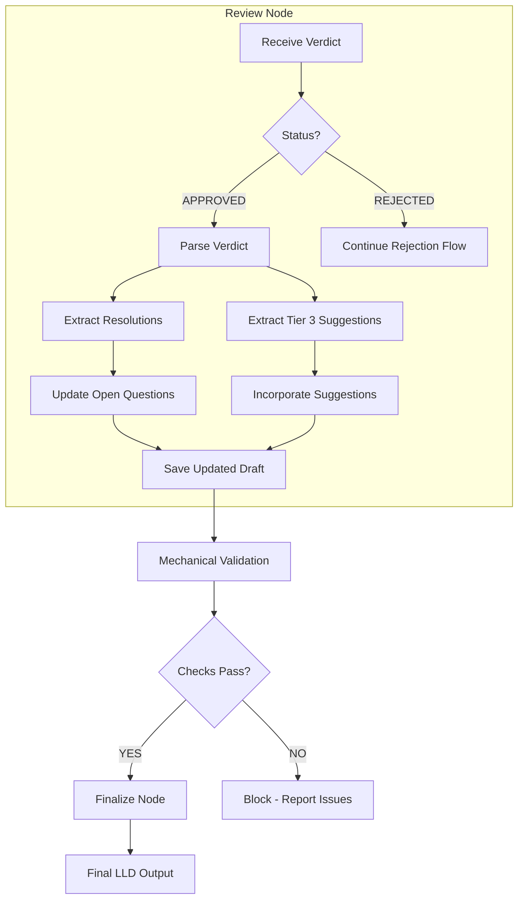

# 1257 - Feature: Review Node Should Update Draft with Resolved Open Questions

<!-- Template Metadata
Last Updated: 2025-01-XX
Updated By: Issue #257 LLD creation
Update Reason: Initial LLD for review node draft update functionality
-->

## 1. Context & Goal
* **Issue:** #257
* **Objective:** Update the draft document with resolved open questions and Tier 3 suggestions when Gemini approves a verdict, eliminating mechanical validation blocks.
* **Status:** Draft
* **Related Issues:** #180 (example of the problem)

### Open Questions
*Questions that need clarification before or during implementation. Remove when resolved.*

- [x] ~~Should the original open questions text be preserved (with strikethrough) or replaced entirely with resolutions?~~ **RESOLVED: Use strikethrough + append.** Preserves audit trail while clearly indicating status.
- [x] ~~How should Tier 3 suggestions be categorized when they don't fit existing sections?~~ **RESOLVED: Append to "Reviewer Suggestions" section.** Handles the fallback case gracefully.
- [x] ~~Should we create a backup of the draft before modification in case rollback is needed?~~ **RESOLVED: Yes, rely on LangGraph state checkpointing.** Previous state preserved in graph history.

## 2. Proposed Changes

*This section is the **source of truth** for implementation. Describe exactly what will be built.*

### 2.1 Files Changed

| File | Change Type | Description |
|------|-------------|-------------|
| `agentos/workflows/requirements/nodes/review.py` | Modify | Add draft update logic after approval, parse resolutions and suggestions from verdict |
| `agentos/workflows/requirements/nodes/finalize.py` | Modify | Use updated draft as final LLD instead of original |
| `agentos/workflows/requirements/utils/verdict_parser.py` | Add | New utility to parse resolutions and suggestions from verdict text |
| `tests/unit/test_verdict_parser.py` | Add | Unit tests for verdict parsing |
| `tests/unit/test_review_draft_update.py` | Add | Tests for draft update integration |

### 2.2 Dependencies

*No new packages required - uses existing standard library and project utilities.*

```toml
# pyproject.toml additions (if any)
# None required
```

### 2.3 Data Structures

```python
# Pseudocode - NOT implementation
from typing import TypedDict, List, Optional

class Resolution(TypedDict):
    question: str           # Original question text
    resolution: str         # How it was resolved
    resolved_by: str        # "verdict" or "manual"

class Suggestion(TypedDict):
    tier: int               # 1, 2, or 3 (only process Tier 3)
    section: Optional[str]  # Target section if identifiable
    content: str            # Suggestion text
    
class ParsedVerdict(TypedDict):
    status: str             # "APPROVED", "REJECTED", "FEEDBACK"
    resolutions: List[Resolution]
    suggestions: List[Suggestion]
    raw_text: str           # Original verdict for reference
```

### 2.4 Function Signatures

```python
# agentos/workflows/requirements/utils/verdict_parser.py

def parse_verdict(verdict_text: str) -> ParsedVerdict:
    """Parse a verdict string into structured components.
    
    Extracts:
    - Approval status
    - Open question resolutions
    - Tier 3 suggestions
    """
    ...

def extract_resolutions(verdict_text: str) -> List[Resolution]:
    """Extract resolved open questions from verdict.
    
    Looks for patterns like:
    - "Open Questions: RESOLVED"
    - "Resolution: ..."
    - Numbered or bulleted resolution lists
    """
    ...

def extract_suggestions(verdict_text: str, tier: int = 3) -> List[Suggestion]:
    """Extract suggestions of specified tier from verdict.
    
    Tier 3 suggestions are optional improvements that should
    be incorporated into the final document.
    """
    ...


# agentos/workflows/requirements/nodes/review.py (additions)

def update_draft_with_resolutions(
    draft_content: str, 
    resolutions: List[Resolution]
) -> str:
    """Update draft's Open Questions section with resolutions.
    
    Transforms:
    - [ ] Question text
    
    Into:
    - [x] ~~Question text~~ **RESOLVED:** Resolution text
    """
    ...

def incorporate_suggestions(
    draft_content: str,
    suggestions: List[Suggestion]
) -> str:
    """Add Tier 3 suggestions to appropriate sections.
    
    If section is identifiable, adds to that section.
    Otherwise, appends to "Reviewer Suggestions" section.
    """
    ...

def finalize_draft_after_approval(
    draft_content: str,
    verdict: ParsedVerdict
) -> str:
    """Master function to produce final LLD after approval.
    
    Coordinates resolution updates and suggestion incorporation.
    """
    ...
```

### 2.5 Logic Flow (Pseudocode)

```
1. Review node receives Gemini verdict
2. Parse verdict to extract status, resolutions, suggestions
3. IF verdict.status == "APPROVED" THEN
   a. Load current draft content
   b. Extract resolutions from verdict
   c. FOR EACH resolution:
      - Find matching open question in draft
      - Replace "- [ ]" with "- [x]"
      - Add strikethrough to original text
      - Append "RESOLVED:" with resolution text
   d. Extract Tier 3 suggestions from verdict
   e. FOR EACH suggestion:
      - IF section identifiable THEN
        - Append to that section
      - ELSE
        - Append to "Reviewer Suggestions" section
   f. Save updated draft to state
   g. Mark draft as "finalized"
4. ELSE (not approved)
   - Continue with existing rejection flow
5. Return updated state
```

### 2.6 Technical Approach

* **Module:** `agentos/workflows/requirements/`
* **Pattern:** Parser/Transformer pattern for verdict processing
* **Key Decisions:** 
  - Keep original question text (with strikethrough) for audit trail
  - Create separate utility module for parsing to enable testing
  - Use regex patterns for robust text matching

### 2.7 Architecture Decisions

| Decision | Options Considered | Choice | Rationale |
|----------|-------------------|--------|-----------|
| Resolution format | Replace text entirely, Strikethrough + append, Inline annotation | Strikethrough + append | Preserves audit trail while showing resolution clearly |
| Suggestion placement | Always append to end, Try to match sections, Create new section | Try to match sections with fallback | Maintains document structure while handling ambiguous cases |
| Parser location | Inline in review.py, Separate utils module, New parser class | Separate utils module | Enables unit testing, reusability, and cleaner separation |
| Draft modification timing | Immediately on approval, During finalize node, Separate post-process | Immediately on approval | Ensures draft is ready before mechanical validation runs |

**Architectural Constraints:**
- Must integrate with existing LangGraph state management
- Cannot break existing review flow for non-approval verdicts
- Must maintain backward compatibility with existing LLDs

## 3. Requirements

*What must be true when this is done. These become acceptance criteria.*

1. Resolved questions from approved verdicts are merged back into draft with `[x]` checkboxes
2. Tier 3 suggestions from approved verdicts are incorporated into appropriate sections
3. Final LLD displays resolved questions with strikethrough and RESOLVED text
4. Final LLD is a complete, self-contained document requiring no manual intervention
5. Mechanical validation passes after draft update (no `- [ ]` triggers blocking)
6. Original verdict is preserved in Review Log for audit purposes
7. Non-approval verdicts continue to work as before (no regression)

## 4. Alternatives Considered

| Option | Pros | Cons | Decision |
|--------|------|------|----------|
| Update draft in review node immediately after approval | Integrated flow, draft ready for validation | Couples parsing logic with node logic | **Selected** |
| Create separate "merge" node after review | Clean separation, explicit workflow step | Adds complexity, requires state passing | Rejected |
| Update during finalize node | Happens at end of flow | Too late - mechanical validation already ran | Rejected |
| Store resolutions separately, merge at render time | Immutable drafts, flexible rendering | Complex, doesn't fix validation issue | Rejected |

**Rationale:** Updating the draft immediately after approval in the review node is the simplest solution that directly addresses the root cause. The mechanical validation checks the draft, so the draft must be updated before that check runs.

## 5. Data & Fixtures

### 5.1 Data Sources

| Attribute | Value |
|-----------|-------|
| Source | Gemini verdict text (from review API response) |
| Format | Markdown text with structured sections |
| Size | ~2-10KB per verdict |
| Refresh | Per review cycle |
| Copyright/License | N/A (internal workflow artifacts) |

### 5.2 Data Pipeline

```
Gemini Verdict ──parse_verdict()──► ParsedVerdict ──update_draft()──► Updated Draft ──save()──► State
```

### 5.3 Test Fixtures

| Fixture | Source | Notes |
|---------|--------|-------|
| Sample approved verdict with resolutions | Generated from #180 example | Real-world example of the problem |
| Sample verdict with Tier 3 suggestions | Generated | Cover suggestion extraction |
| Draft with multiple open questions | Generated | Test multi-question scenarios |
| Verdict with no resolutions section | Generated | Edge case handling |

### 5.4 Deployment Pipeline

No special data deployment needed - this is runtime logic processing existing workflow artifacts.

## 6. Diagram

### 6.1 Mermaid Quality Gate

Before finalizing any diagram, verify in [Mermaid Live Editor](https://mermaid.live) or GitHub preview:

- [x] **Simplicity:** Similar components collapsed (per 0006 §8.1)
- [x] **No touching:** All elements have visual separation (per 0006 §8.2)
- [x] **No hidden lines:** All arrows fully visible (per 0006 §8.3)
- [x] **Readable:** Labels not truncated, flow direction clear
- [ ] **Auto-inspected:** Agent rendered via mermaid.ink and viewed (per 0006 §8.5)

**Auto-Inspection Results:**
```
- Touching elements: [ ] None / [ ] Found: ___
- Hidden lines: [ ] None / [ ] Found: ___
- Label readability: [ ] Pass / [ ] Issue: ___
- Flow clarity: [ ] Clear / [ ] Issue: ___
```

### 6.2 Diagram



## 7. Security & Safety Considerations

### 7.1 Security

| Concern | Mitigation | Status |
|---------|------------|--------|
| Malicious verdict injection | Verdicts come only from Gemini API, not user input | Addressed |
| Regex ReDoS attacks | Use simple, tested regex patterns with bounded input | Addressed |

### 7.2 Safety

| Concern | Mitigation | Status |
|---------|------------|--------|
| Data loss on failed parse | Preserve original draft in state before modification | Addressed |
| Partial update corruption | Apply all changes atomically, rollback on error | Addressed |
| Mismatched resolution to question | Log warnings, don't modify if match confidence is low | Addressed |

**Fail Mode:** Fail Closed - If parsing fails, don't modify draft and log error for human review

**Recovery Strategy:** Original draft preserved in state; can be restored if update produces invalid output

## 8. Performance & Cost Considerations

### 8.1 Performance

| Metric | Budget | Approach |
|--------|--------|----------|
| Parse time | < 100ms | Simple regex, no external calls |
| Update time | < 50ms | String operations only |
| Memory | < 10MB | Process single verdict/draft pair |

**Bottlenecks:** None expected - this is pure string processing

### 8.2 Cost Analysis

| Resource | Unit Cost | Estimated Usage | Monthly Cost |
|----------|-----------|-----------------|--------------|
| Compute | $0 | Negligible CPU time | $0 |

**Cost Controls:**
- N/A - No external service costs

**Worst-Case Scenario:** Even with 1000 reviews/day, processing time is negligible

## 9. Legal & Compliance

| Concern | Applies? | Mitigation |
|---------|----------|------------|
| PII/Personal Data | No | No personal data involved |
| Third-Party Licenses | No | Uses only internal code |
| Terms of Service | No | No external services used |
| Data Retention | N/A | Follows existing workflow retention |
| Export Controls | No | No restricted algorithms |

**Data Classification:** Internal

**Compliance Checklist:**
- [x] No PII stored without consent
- [x] All third-party licenses compatible with project license
- [x] External API usage compliant with provider ToS
- [x] Data retention policy documented

## 10. Verification & Testing

### 10.0 Test Plan (TDD - Complete Before Implementation)

**TDD Requirement:** Tests MUST be written and failing BEFORE implementation begins.

| Test ID | Test Description | Expected Behavior | Status |
|---------|------------------|-------------------|--------|
| T010 | Parse approved verdict extracts status correctly | Returns "APPROVED" status | RED |
| T020 | Extract resolutions finds all resolved questions | Returns list of Resolution objects | RED |
| T030 | Extract suggestions finds Tier 3 only | Filters out Tier 1 and 2 | RED |
| T040 | Update draft replaces checkbox correctly | `- [ ]` becomes `- [x]` | RED |
| T050 | Update draft adds strikethrough | Original text wrapped in `~~` | RED |
| T060 | Update draft adds RESOLVED text | Resolution appended after strikethrough | RED |
| T070 | Suggestions incorporated in correct section | Suggestion added to matching section | RED |
| T080 | Suggestions fallback to new section | Creates "Reviewer Suggestions" if no match | RED |
| T090 | Integration test full flow | Draft fully updated after approval | RED |
| T100 | Non-approval verdict unchanged | Draft not modified on rejection | RED |

**Coverage Target:** ≥95% for all new code

**TDD Checklist:**
- [ ] All tests written before implementation
- [ ] Tests currently RED (failing)
- [ ] Test IDs match scenario IDs in 10.1
- [ ] Test file created at: `tests/unit/test_verdict_parser.py`, `tests/unit/test_review_draft_update.py`

### 10.1 Test Scenarios

| ID | Scenario | Type | Input | Expected Output | Pass Criteria |
|----|----------|------|-------|-----------------|---------------|
| 010 | Parse approved verdict | Auto | Verdict with "APPROVED" | ParsedVerdict with status="APPROVED" | Status correctly identified |
| 020 | Extract single resolution | Auto | Verdict with 1 resolution | List with 1 Resolution | Question and resolution text captured |
| 030 | Extract multiple resolutions | Auto | Verdict with 3 resolutions | List with 3 Resolutions | All resolutions captured |
| 040 | Extract Tier 3 suggestions only | Auto | Verdict with Tier 1,2,3 | List with only Tier 3 | Tier 1,2 filtered out |
| 050 | Update single open question | Auto | Draft with 1 `- [ ]` | Draft with 1 `- [x]` | Checkbox updated |
| 060 | Update preserves other content | Auto | Draft with text before/after | Same text preserved | No content loss |
| 070 | Strikethrough applied correctly | Auto | Original question | `~~question~~` in output | Markdown strikethrough present |
| 080 | RESOLVED text appended | Auto | Question + resolution | Question + "RESOLVED: resolution" | Resolution visible |
| 090 | Suggestion to existing section | Auto | Suggestion for "Requirements" | Added under ## Requirements | Correct placement |
| 100 | Suggestion fallback section | Auto | Suggestion with no section match | New "Reviewer Suggestions" section | Section created |
| 110 | Full integration approval | Auto | Complete verdict + draft | Fully updated draft | All resolutions merged |
| 120 | Rejection leaves draft unchanged | Auto | REJECTED verdict | Original draft | No modifications |
| 130 | Empty resolutions list | Auto | Approved with no resolutions | Draft unchanged | No errors |
| 140 | Malformed verdict handling | Auto | Invalid verdict format | Graceful failure, draft preserved | Error logged, no crash |

### 10.2 Test Commands

```bash
# Run all automated tests
poetry run pytest tests/unit/test_verdict_parser.py tests/unit/test_review_draft_update.py -v

# Run only fast/mocked tests (exclude live)
poetry run pytest tests/unit/test_verdict_parser.py -v -m "not live"

# Run integration tests
poetry run pytest tests/integration/test_review_flow.py -v
```

### 10.3 Manual Tests (Only If Unavoidable)

N/A - All scenarios automated.

## 11. Risks & Mitigations

| Risk | Impact | Likelihood | Mitigation |
|------|--------|------------|------------|
| Verdict format changes break parser | Med | Low | Flexible regex, version tolerance, clear error messages |
| Resolution doesn't match question | Med | Med | Fuzzy matching with confidence threshold, log mismatches |
| Circular dependency with finalize node | High | Low | Clear state boundaries, unit test interactions |
| Edge case in markdown parsing | Low | Med | Comprehensive test fixtures from real examples |

## 12. Definition of Done

### Code
- [ ] Implementation complete and linted
- [ ] Code comments reference this LLD (#257)

### Tests
- [ ] All test scenarios pass
- [ ] Test coverage ≥95% for new code

### Documentation
- [ ] LLD updated with any deviations
- [ ] Implementation Report (0103) completed
- [ ] Test Report (0113) completed if applicable

### Review
- [ ] Code review completed
- [ ] User approval before closing issue #257

---

## Appendix: Review Log

*Track all review feedback with timestamps and implementation status.*

### Review Summary

| Review | Date | Verdict | Key Issue |
|--------|------|---------|-----------|
| - | - | - | - |

**Final Status:** PENDING