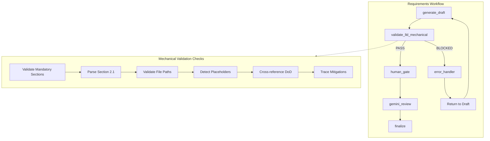

# 1277 - Feature: Mechanical LLD Validation Node

<!-- Template Metadata
Last Updated: 2025-01-XX
Updated By: Issue #277 implementation
Update Reason: New feature - mechanical validation gate before Gemini review
-->

## 1. Context & Goal
* **Issue:** #277
* **Objective:** Add a mechanical validation node to the LLD workflow that catches path errors, section inconsistencies, and untraced mitigations before Gemini review
* **Status:** Draft
* **Related Issues:** #272 (LLD that exposed the need for this)

### Open Questions

- [x] Should risk mitigation tracing be blocking or warning? **Decision: WARNING initially, promote to blocking after validation**
- [x] Should we validate pseudocode syntax minimally (balanced braces, etc.)? **Decision: NO - pseudocode is inherently unstructured; rely on Human/Gemini review for logic**
- [x] What's the threshold for "matching" keywords to function names? **Decision: EXACT TOKEN MATCH - extract significant terms (ignoring stopwords) and require at least one case-insensitive substring match**

## 2. Proposed Changes

*This section is the **source of truth** for implementation. Describe exactly what will be built.*

### 2.1 Files Changed

| File | Change Type | Description |
|------|-------------|-------------|
| `agentos/workflows/requirements/nodes/validate_mechanical.py` | Add | New node implementing mechanical validation checks |
| `agentos/workflows/requirements/graph.py` | Modify | Insert validate_mechanical node before review node |
| `agentos/workflows/requirements/state.py` | Modify | Add validation_errors field to state |
| `docs/templates/0102-feature-lld-template.md` | Modify | Add sections 2.1.1 and 12.1 for validation documentation |
| `docs/templates/0702c-gemini-lld-review-prompt.md` | Modify | Update instructions to clarify Gemini's role |
| `tests/unit/test_validate_mechanical.py` | Add | Unit tests for validation node |
| `tests/fixtures/lld_samples/` | Add | Test fixtures with valid/invalid LLD content |

### 2.2 Dependencies

*No new packages required. Uses stdlib only.*

```toml
# No pyproject.toml additions needed
# Uses: pathlib, re, dataclasses (all stdlib)
```

### 2.3 Data Structures

```python
# Pseudocode - NOT implementation
from dataclasses import dataclass
from enum import Enum

class ValidationSeverity(Enum):
    ERROR = "error"      # Blocks workflow
    WARNING = "warning"  # Logged but does not block

@dataclass
class ValidationError:
    severity: ValidationSeverity
    section: str         # e.g., "2.1", "11", "12"
    message: str
    file_path: str | None = None  # If related to a specific file

@dataclass  
class ValidationResult:
    passed: bool
    errors: list[ValidationError]
    warnings: list[ValidationError]

# Mandatory section markers for structural validation
MANDATORY_SECTIONS = ["### 2.1", "### 11", "### 12"]

# State extension
class RequirementsWorkflowState(TypedDict):
    # ... existing fields ...
    validation_errors: list[str]  # Human-readable error messages
    validation_warnings: list[str]  # Human-readable warning messages
```

### 2.4 Function Signatures

```python
# agentos/workflows/requirements/nodes/validate_mechanical.py

def validate_lld_mechanical(state: RequirementsWorkflowState) -> RequirementsWorkflowState:
    """
    Mechanical validation of LLD content. No LLM judgment.
    Fails hard on errors, warns on suspicious patterns.
    """
    ...

def validate_mandatory_sections(lld_content: str) -> list[ValidationError]:
    """
    Verify that all mandatory LLD sections exist.
    Returns ERRORS for any missing mandatory section.
    """
    ...

def parse_files_changed_table(lld_content: str) -> tuple[list[dict], list[ValidationError]]:
    """
    Extract file entries from Section 2.1 table.
    Returns tuple of (list of {path, change_type, description}, parse errors).
    If section exists but table cannot be parsed, returns error.
    """
    ...

def validate_file_paths(
    files: list[dict], 
    repo_root: Path
) -> list[ValidationError]:
    """
    Check that Modify/Delete files exist, Add files have valid parents.
    """
    ...

def detect_placeholder_prefixes(
    files: list[dict], 
    repo_root: Path
) -> list[ValidationError]:
    """
    Flag paths using src/, lib/, app/ when those directories don't exist.
    """
    ...

def extract_files_from_section(
    lld_content: str, 
    section_header: str
) -> set[str]:
    """
    Extract file paths mentioned in a specific section (e.g., DoD).
    """
    ...

def cross_reference_sections(
    lld_content: str,
    files_changed: list[dict]
) -> list[ValidationError]:
    """
    Verify files in Definition of Done appear in Files Changed.
    """
    ...

def extract_mitigations_from_risks(lld_content: str) -> list[str]:
    """
    Parse Section 11 Risks table to extract mitigation text.
    """
    ...

def extract_function_names(lld_content: str) -> list[str]:
    """
    Parse Section 2.4 to extract function/method names.
    """
    ...

def trace_mitigations_to_functions(
    mitigations: list[str],
    functions: list[str]
) -> list[ValidationError]:
    """
    Check that each mitigation has at least one related function.
    Returns warnings (not errors) for untraced mitigations.
    """
    ...

def extract_keywords(text: str) -> list[str]:
    """
    Extract significant keywords from mitigation text.
    Filters stopwords, returns lowercase tokens.
    """
    ...
```

### 2.5 Logic Flow (Pseudocode)

```
1. Receive state with current_draft LLD content
2. Extract repo_root from state

3. VALIDATE mandatory sections exist
   FOR each section in ["### 2.1", "### 11", "### 12"]:
     IF section header not found in lld_content:
       ADD ERROR "Critical: Section {section} missing"
   IF any mandatory sections missing:
     RETURN immediately with BLOCKED status

4. PARSE Section 2.1 Files Changed table
   - Use regex to find markdown table after "### 2.1"
   - Handle variations in formatting (alignment colons, whitespace)
   - Extract rows into structured data
   - IF section exists but table cannot be parsed:
     ADD ERROR "Critical: Section 2.1 table malformed"

5. VALIDATE file paths
   FOR each file in parsed table:
     IF change_type is "Modify" or "Delete":
       IF file does not exist at repo_root/path:
         ADD ERROR "file marked {type} but does not exist"
     ELIF change_type is "Add":
       IF parent directory does not exist:
         ADD ERROR "parent directory does not exist"

6. DETECT placeholder prefixes
   FOR each file in parsed table:
     prefix = first path segment (e.g., "src" from "src/foo.py")
     IF prefix in ["src", "lib", "app"]:
       IF repo_root/prefix does not exist:
         ADD ERROR "uses {prefix}/ but directory doesn't exist"

7. CROSS-REFERENCE sections
   - Extract file paths mentioned in Section 12 (Definition of Done)
   - Compare against Section 2.1 file list
   - IF any files in DoD not in Files Changed:
     ADD ERROR "Section 12 references files not in Section 2.1"

8. TRACE risk mitigations (WARNING only)
   - Extract mitigations from Section 11 table
   - Extract function names from Section 2.4
   FOR each mitigation:
     keywords = extract_keywords(mitigation)
     IF no function name contains any keyword:
       ADD WARNING "mitigation '{text}' has no matching function"

9. AGGREGATE results
   IF any ERRORS:
     state["validation_errors"] = [e.message for e in errors]
     state["lld_status"] = "BLOCKED"
     state["error"] = format_error_message(errors)
   ELSE:
     state["validation_warnings"] = [w.message for w in warnings]
     # Proceed to next node

10. RETURN state
```

### 2.6 Technical Approach

* **Module:** `agentos/workflows/requirements/nodes/validate_mechanical.py`
* **Pattern:** Pure function with deterministic output; no LLM calls
* **Key Decisions:**
  - Use regex for table parsing (markdown is predictable enough)
  - Handle table format variations (alignment colons, extra whitespace)
  - Validate mandatory sections exist before attempting to parse
  - Fail fast on structural issues (missing sections, unparseable tables)
  - Fail closed - if we can't validate, we block
  - Warnings do not block workflow progression
  - No external dependencies - stdlib only for reliability

### 2.7 Architecture Decisions

| Decision | Options Considered | Choice | Rationale |
|----------|-------------------|--------|-----------|
| Parsing approach | Full markdown parser (mistune), Regex, Custom parser | Regex | LLD tables are predictable; avoid new dependency |
| Error handling | Fail on first error, Collect all errors, Collect per-category | Collect all errors | Better UX - fix everything at once |
| Warning vs Error split | All blocking, All warnings, Categorized | Categorized | Path errors are critical; mitigation tracing is advisory |
| Node placement | Before human gate, After human gate, Before Gemini | Before human gate | Catch errors before any review (human or LLM) |
| Fail mode on parse errors | Fail open (pass through), Fail closed (block) | Fail closed | If we can't parse/validate, we shouldn't trust the LLD |
| Missing section handling | Skip checks silently, Block with error | Block with error | Silent failure could pass broken LLDs |

**Architectural Constraints:**
- Must integrate with existing LangGraph workflow pattern
- Cannot introduce latency > 1 second (no network calls)
- Must work offline (no external validation services)

## 3. Requirements

1. Mechanical validation executes before Gemini review in the workflow graph
2. Missing mandatory sections (2.1, 11, 12) block with specific error message
3. Malformed/unparseable tables in mandatory sections block workflow
4. Invalid paths (Modify/Delete on non-existent files) block with clear error message
5. Placeholder prefixes (src/, lib/, app/) without matching directory block workflow
6. Definition of Done / Files Changed mismatches block workflow
7. Risk mitigations without traced implementation generate warnings (non-blocking)
8. LLD-272's specific errors (wrong paths, missing graph runner, unimplemented token tracking) would be caught
9. Template documentation updated to explain mechanical validation
10. Gemini review prompt clarifies its role excludes path validation

## 4. Alternatives Considered

| Option | Pros | Cons | Decision |
|--------|------|------|----------|
| Add checks to Gemini prompt | No code changes, uses existing review | LLMs unreliable for filesystem checks, costs tokens | **Rejected** |
| Pre-commit hook | Catches errors at commit time | Too late in workflow, doesn't integrate with state | **Rejected** |
| Dedicated validation node | Deterministic, fast, integrates with workflow | Requires new code, another node to maintain | **Selected** |
| Schema validation (JSON Schema) | Formal specification, reusable | LLD is markdown not JSON, overkill | **Rejected** |

**Rationale:** Dedicated node is the only option that provides deterministic validation integrated with the LangGraph workflow state. Pre-commit hooks run too late, and LLM-based checks are fundamentally unreliable for filesystem assertions.

## 5. Data & Fixtures

### 5.1 Data Sources

| Attribute | Value |
|-----------|-------|
| Source | LLD markdown content from workflow state |
| Format | Markdown with specific section structure |
| Size | ~5-20KB per LLD document |
| Refresh | Real-time (per workflow execution) |
| Copyright/License | N/A (internal documents) |

### 5.2 Data Pipeline

```
state["current_draft"] ──parse──► Structured file list ──validate──► ValidationResult ──format──► state update
```

### 5.3 Test Fixtures

| Fixture | Source | Notes |
|---------|--------|-------|
| `valid_lld.md` | Generated | Complete LLD with valid paths matching test repo structure |
| `invalid_paths_lld.md` | Generated | LLD with Modify on non-existent file |
| `placeholder_prefix_lld.md` | Generated | LLD using `src/` when no `src/` exists |
| `dod_mismatch_lld.md` | Generated | DoD mentions file not in Section 2.1 |
| `untraced_mitigation_lld.md` | Generated | Risk mitigation with no matching function |
| `missing_section_lld.md` | Generated | LLD missing mandatory Section 2.1 |
| `malformed_table_lld.md` | Generated | LLD with Section 2.1 header but unparseable table |
| `mock_repo/` | Generated | Minimal directory structure for path validation |

### 5.4 Deployment Pipeline

Tests run against fixture files in `tests/fixtures/lld_samples/`. No external data deployment required.

## 6. Diagram

### 6.1 Mermaid Quality Gate

- [x] **Simplicity:** Collapsed validation checks into single node
- [x] **No touching:** All elements have visual separation
- [x] **No hidden lines:** All arrows fully visible
- [x] **Readable:** Labels clear, flow direction obvious
- [ ] **Auto-inspected:** Pending agent render

**Auto-Inspection Results:**
```
- Touching elements: [ ] None / [ ] Found: ___
- Hidden lines: [ ] None / [ ] Found: ___
- Label readability: [ ] Pass / [ ] Issue: ___
- Flow clarity: [ ] Clear / [ ] Issue: ___
```

### 6.2 Diagram



## 7. Security & Safety Considerations

### 7.1 Security

| Concern | Mitigation | Status |
|---------|------------|--------|
| Path traversal in file checks | Validate paths are within repo_root | Addressed |
| Regex denial of service | Use non-backtracking patterns, set timeout | Addressed |
| Arbitrary code in LLD content | Only parse structure, never execute | Addressed |

### 7.2 Safety

| Concern | Mitigation | Status |
|---------|------------|--------|
| False positives blocking valid LLDs | Conservative regex matching, clear error messages | Addressed |
| Silent failures masking errors | Explicit mandatory section validation; fail closed on parse errors | Addressed |
| Infinite loop in parsing | Bounded iteration, timeout guards | Addressed |
| Missing section causing skipped validation | Mandatory section check runs first; blocks if missing | Addressed |
| Malformed table causing silent pass | Parse errors on mandatory sections block workflow | Addressed |

**Fail Mode:** Fail Closed - If validation cannot complete (missing sections, parse errors), block the workflow rather than allow unvalidated LLD through.

**Recovery Strategy:** Clear error message with specific section/line references. User can fix LLD and re-run workflow.

## 8. Performance & Cost Considerations

### 8.1 Performance

| Metric | Budget | Approach |
|--------|--------|----------|
| Latency | < 500ms | Regex parsing, no I/O except stat() |
| Memory | < 50MB | String operations, no large data structures |
| API Calls | 0 | Fully local execution |

**Bottlenecks:** Large LLD files with many paths could slow stat() checks. Mitigated by early exit on first category of errors.

### 8.2 Cost Analysis

| Resource | Unit Cost | Estimated Usage | Monthly Cost |
|----------|-----------|-----------------|--------------|
| Compute | N/A | Sub-second per run | $0 |
| LLM calls saved | ~$0.01 per Gemini review | ~10 blocked LLDs/month | -$0.10 (savings) |

**Cost Controls:**
- [x] No external API calls
- [x] No cloud resources required
- [x] Saves Gemini tokens by blocking invalid LLDs early

**Worst-Case Scenario:** If every LLD fails validation, users spend time fixing. This is preferable to LLDs failing later in implementation.

## 9. Legal & Compliance

| Concern | Applies? | Mitigation |
|---------|----------|------------|
| PII/Personal Data | No | Only processes internal document structure |
| Third-Party Licenses | No | Uses Python stdlib only |
| Terms of Service | N/A | No external services |
| Data Retention | N/A | No data stored |
| Export Controls | No | No restricted algorithms |

**Data Classification:** Internal

**Compliance Checklist:**
- [x] No PII processed
- [x] No third-party dependencies
- [x] No external API usage
- [x] No data retention

## 10. Verification & Testing

### 10.0 Test Plan (TDD - Complete Before Implementation)

| Test ID | Test Description | Expected Behavior | Status |
|---------|------------------|-------------------|--------|
| T010 | Parse valid files table | Returns list of file dicts | RED |
| T020 | Parse malformed table | Returns error, not empty list | RED |
| T025 | Missing mandatory section 2.1 | Returns critical ERROR, blocks | RED |
| T026 | Missing mandatory section 11 | Returns critical ERROR, blocks | RED |
| T027 | Missing mandatory section 12 | Returns critical ERROR, blocks | RED |
| T030 | Validate existing Modify file | No error | RED |
| T040 | Validate non-existent Modify file | Returns ERROR | RED |
| T050 | Validate Add file with valid parent | No error | RED |
| T060 | Validate Add file with invalid parent | Returns ERROR | RED |
| T070 | Detect src/ placeholder | Returns ERROR when src/ missing | RED |
| T080 | Allow src/ when exists | No error when src/ exists | RED |
| T090 | DoD cross-reference match | No error | RED |
| T100 | DoD cross-reference mismatch | Returns ERROR | RED |
| T110 | Mitigation with matching function | No warning | RED |
| T120 | Mitigation without matching function | Returns WARNING | RED |
| T130 | Full validation pass | state["lld_status"] unchanged | RED |
| T140 | Full validation fail | state["lld_status"] = "BLOCKED" | RED |

**Coverage Target:** ≥95% for all new code

**TDD Checklist:**
- [ ] All tests written before implementation
- [ ] Tests currently RED (failing)
- [ ] Test IDs match scenario IDs in 10.1
- [ ] Test file created at: `tests/unit/test_validate_mechanical.py`

### 10.1 Test Scenarios

| ID | Scenario | Type | Input | Expected Output | Pass Criteria |
|----|----------|------|-------|-----------------|---------------|
| 010 | Parse well-formed table | Auto | Valid markdown table | List of 3 file dicts | Correct path, type, description |
| 020 | Parse malformed table | Auto | LLD with broken table format | ERROR returned | Error mentions "table malformed" |
| 025 | Missing Section 2.1 | Auto | LLD without ### 2.1 header | 1 critical ERROR | Error states "Section 2.1 missing" |
| 026 | Missing Section 11 | Auto | LLD without ### 11 header | 1 critical ERROR | Error states "Section 11 missing" |
| 027 | Missing Section 12 | Auto | LLD without ### 12 header | 1 critical ERROR | Error states "Section 12 missing" |
| 030 | Modify existing file | Auto | Path to existing file | No errors | errors list empty |
| 040 | Modify non-existent file | Auto | Path to missing file | 1 error | Error mentions file path |
| 050 | Add to existing dir | Auto | Path with valid parent | No errors | errors list empty |
| 060 | Add to missing dir | Auto | Path with invalid parent | 1 error | Error mentions parent |
| 070 | src/ placeholder detected | Auto | "src/foo.py", no src/ dir | 1 error | Error mentions placeholder |
| 080 | src/ exists, allowed | Auto | "src/foo.py", src/ exists | No errors | errors list empty |
| 090 | DoD matches 2.1 | Auto | Matching file lists | No errors | errors list empty |
| 100 | DoD has extra file | Auto | DoD mentions unlisted file | 1 error | Error names mismatched file |
| 110 | Mitigation traced | Auto | "Rate limit" + rate_limit() | No warnings | warnings list empty |
| 120 | Mitigation untraced | Auto | "Token count" + no match | 1 warning | Warning is non-blocking |
| 130 | All checks pass | Auto | Valid complete LLD | state unchanged | No BLOCKED status |
| 140 | Path check fails | Auto | Invalid Modify path | state BLOCKED | Error in state |

### 10.2 Test Commands

```bash
# Run all mechanical validation tests
poetry run pytest tests/unit/test_validate_mechanical.py -v

# Run with coverage
poetry run pytest tests/unit/test_validate_mechanical.py -v --cov=agentos/workflows/requirements/nodes/validate_mechanical

# Run specific test
poetry run pytest tests/unit/test_validate_mechanical.py::test_validate_nonexistent_modify -v
```

### 10.3 Manual Tests

N/A - All scenarios automated.

## 11. Risks & Mitigations

| Risk | Impact | Likelihood | Mitigation |
|------|--------|------------|------------|
| Regex fails on edge-case markdown | Med | Low | Extensive test fixtures, robust patterns handling format variations |
| False positives block valid LLDs | High | Med | Conservative matching, clear error messages |
| Performance degrades on large repos | Low | Low | Path checks use stat() not full traversal |
| Users bypass validation | Med | Low | Integrate into workflow graph, not optional |
| Keyword extraction too aggressive | Med | Med | Stopword filtering, minimum match threshold |
| Missing sections cause silent pass | High | Med | Explicit mandatory section validation runs first; fail closed |

## 12. Definition of Done

### Code
- [ ] `agentos/workflows/requirements/nodes/validate_mechanical.py` implemented
- [ ] `agentos/workflows/requirements/graph.py` updated with new node
- [ ] `agentos/workflows/requirements/state.py` updated with new fields
- [ ] Code comments reference this LLD (#277)

### Tests
- [ ] All 17 test scenarios pass (including T025-T027 for missing sections)
- [ ] Test coverage ≥95% for new module
- [ ] Tests include LLD-272 regression case

### Documentation
- [ ] `docs/templates/0102-feature-lld-template.md` updated with 2.1.1, 12.1
- [ ] `docs/templates/0702c-gemini-lld-review-prompt.md` updated
- [ ] LLD updated with any implementation deviations
- [ ] Implementation Report (0103) completed

### Review
- [ ] Code review completed
- [ ] User approval before closing issue #277

---

## Appendix: Review Log

*Track all review feedback with timestamps and implementation status.*

### Gemini Review #1 (REVISE)

**Reviewer:** Gemini 3 Pro
**Verdict:** REVISE

#### Comments

| ID | Comment | Implemented? |
|----|---------|--------------|
| G1.1 | "Fail-Safe Strategy (Silent Failure on Missing Sections): If Section 2.1 is missing or regex fails to find table, parsed list is empty and validation loop doesn't run, resulting in PASS for structurally broken LLD" | YES - Added mandatory section validation (Section 2.5 Step 3), new function `validate_mandatory_sections()`, and test scenarios T025-T027 |
| G1.2 | "Regex Robustness: Ensure regex handles variations in markdown table formatting (alignment colons, varying whitespace)" | YES - Added note in Section 2.6 about handling format variations |
| G1.3 | "Fail Mode Clarity: Section 7.2 mentions 'fail-open only on parse errors'. Fail Closed is generally safer" | YES - Updated Section 7.2 to specify Fail Closed on parse errors; updated Architecture Decisions table |

### Review Summary

| Review | Date | Verdict | Key Issue |
|--------|------|---------|-----------|
| Gemini #1 | (auto) | REVISE | Silent failure on missing sections could pass broken LLDs |

**Final Status:** PENDING