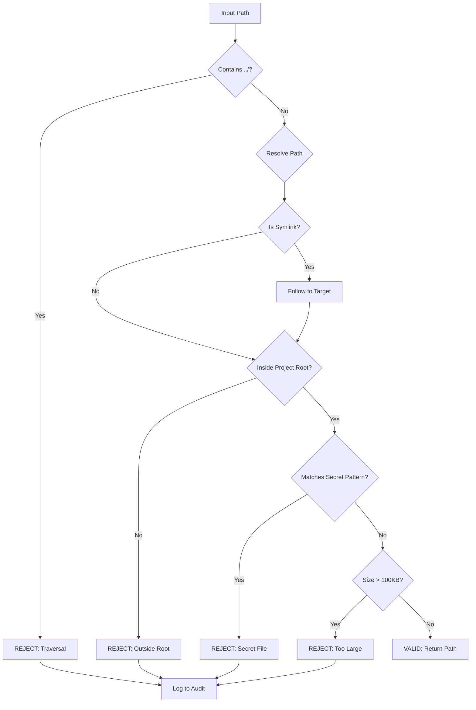

# 1289 - Feature: Add Path Security Validation to TDD Workflow

<!-- Template Metadata
Last Updated: 2025-01-XX
Updated By: LLD creation
Update Reason: Initial LLD for Issue #289 - Path security validation
-->

## 1. Context & Goal
* **Issue:** #289
* **Objective:** Add path security validation to prevent directory traversal and secret file exposure in TDD workflow context files.
* **Status:** Draft
* **Related Issues:** #87 (Original Implementation Workflow spec)

### Open Questions
*Questions that need clarification before or during implementation. Remove when resolved.*

- [x] Should symlink validation follow symlinks recursively or just one level? → Follow to final target
- [x] Should 100KB limit apply before or after reading file content? → Before (use stat, not read)
- [x] Should audit logging use existing AgentOS audit infrastructure or separate log? → Use existing audit trail

## 2. Proposed Changes

*This section is the **source of truth** for implementation. Describe exactly what will be built.*

### 2.1 Files Changed

| File | Change Type | Description |
|------|-------------|-------------|
| `agentos/workflows/testing/path_validator.py` | Add | New module for path security validation |
| `agentos/workflows/testing/__init__.py` | Modify | Export path_validator functions |
| `tests/workflows/testing/test_path_validator.py` | Add | Unit tests for path validation |

### 2.1.1 Path Validation (Mechanical - Auto-Checked)

*Issue #277: Before human or Gemini review, paths are verified programmatically.*

Mechanical validation automatically checks:
- All "Modify" files must exist in repository
- All "Delete" files must exist in repository
- All "Add" files must have existing parent directories
- No placeholder prefixes (`src/`, `lib/`, `app/`) unless directory exists

**If validation fails, the LLD is BLOCKED before reaching review.**

### 2.2 Dependencies

*New packages, APIs, or services required.*

```toml
# pyproject.toml additions (if any)
# No new dependencies - uses stdlib pathlib and fnmatch
```

### 2.3 Data Structures

```python
# Pseudocode - NOT implementation
from typing import TypedDict

class ValidationResult(TypedDict):
    valid: bool           # Whether path passed validation
    error: str | None     # Error message if invalid, None if valid
    resolved_path: str | None  # Canonical path if valid, None if invalid

class PathValidatorConfig(TypedDict):
    max_file_size: int    # Maximum file size in bytes (default: 102400)
    secret_patterns: list[str]  # Patterns for secret files
    allow_symlinks: bool  # Whether to follow symlinks (default: True with validation)
```

### 2.4 Function Signatures

```python
# Signatures only - implementation in source files
def validate_context_path(
    path: str | Path, 
    project_root: str | Path
) -> ValidationResult:
    """
    Validate that a context path is safe to read.
    
    Checks for directory traversal, containment within project root,
    and symlink safety.
    """
    ...

def is_secret_file(path: str | Path) -> bool:
    """
    Check if a path matches known secret file patterns.
    
    Returns True if the path should be rejected as a secret file.
    """
    ...

def check_file_size(
    path: str | Path, 
    limit: int = 100 * 1024
) -> ValidationResult:
    """
    Validate file size is within acceptable limits.
    
    Returns validation result with error if file exceeds limit.
    """
    ...

def validate_all_context_paths(
    paths: list[str | Path],
    project_root: str | Path
) -> tuple[list[Path], list[ValidationResult]]:
    """
    Validate multiple context paths, returning valid paths and errors.
    
    All rejections are logged to audit trail.
    """
    ...

def _log_rejection(
    path: str | Path,
    reason: str,
    project_root: str | Path
) -> None:
    """
    Log path rejection to audit trail.
    """
    ...
```

### 2.5 Logic Flow (Pseudocode)

```
validate_context_path(path, project_root):
1. Convert both to Path objects
2. Check for explicit traversal sequences
   - IF "../" in str(path) THEN
     - Return invalid: "Path contains directory traversal sequence"
3. Resolve project_root to absolute canonical path
4. IF path is absolute THEN
   - resolved = path.resolve()
   ELSE
   - resolved = (project_root / path).resolve()
5. IF path is symlink THEN
   - Follow symlink to final target
   - resolved = symlink_target.resolve()
6. Check containment
   - IF NOT resolved.is_relative_to(project_root) THEN
     - Return invalid: "Path resolves outside project root"
7. Check if secret file
   - IF is_secret_file(resolved) THEN
     - Return invalid: "Path matches secret file pattern"
8. Check file size
   - size_result = check_file_size(resolved)
   - IF NOT size_result.valid THEN
     - Return size_result
9. Return valid with resolved_path

is_secret_file(path):
1. Get filename (case-insensitive)
2. Check against patterns:
   - *.env, .env*
   - *credentials*
   - *secret*
   - *.pem, *.key
3. Return True if any match

check_file_size(path, limit):
1. Get file stat (without reading)
2. IF stat.st_size > limit THEN
   - Return invalid: f"File size {stat.st_size} exceeds limit {limit}"
3. Return valid

validate_all_context_paths(paths, project_root):
1. valid_paths = []
2. errors = []
3. FOR each path in paths:
   - result = validate_context_path(path, project_root)
   - IF result.valid THEN
     - valid_paths.append(result.resolved_path)
   ELSE
     - errors.append(result)
     - _log_rejection(path, result.error, project_root)
4. Return (valid_paths, errors)
```

### 2.6 Technical Approach

* **Module:** `agentos/workflows/testing/path_validator.py`
* **Pattern:** Functional validation with immutable results
* **Key Decisions:** 
  - Use `Path.resolve()` to canonicalize paths and follow symlinks
  - Use `Path.is_relative_to()` for containment check (Python 3.9+)
  - Use `fnmatch` for secret pattern matching
  - Use `os.stat()` for file size (avoids reading file content)

### 2.7 Architecture Decisions

*Document key architectural decisions that affect the design.*

| Decision | Options Considered | Choice | Rationale |
|----------|-------------------|--------|-----------|
| Symlink handling | Block all symlinks, Follow once, Follow to target | Follow to target | Users may have legitimate symlinked config; final target must be validated |
| Pattern matching | Regex, glob/fnmatch, exact match | fnmatch | Standard library, familiar glob syntax, case-insensitive support |
| Size check timing | Before read, during read, after read | Before read | Prevents resource exhaustion; fail fast |
| Return type | Bool + exception, Result tuple, TypedDict | TypedDict | Explicit error messages, no exception handling needed |

**Architectural Constraints:**
- Must not read file content during validation (performance, memory)
- Must integrate with existing AgentOS audit trail
- Must work on all platforms (Windows path handling differs)

## 3. Requirements

*What must be true when this is done. These become acceptance criteria.*

1. `../` traversal sequences in paths are rejected with clear error message
2. Absolute paths outside project root are rejected with clear error message
3. Symbolic links are resolved and their targets validated against project root
4. Files matching secret patterns (`.env`, `*credentials*`, `*secret*`, `*.pem`, `*.key`) are rejected
5. Files larger than 100KB are rejected with actual and limit sizes in error message
6. All rejections are logged to the audit trail with path, reason, and project context
7. Valid paths return canonicalized absolute paths for safe consumption

## 4. Alternatives Considered

| Option | Pros | Cons | Decision |
|--------|------|------|----------|
| Regex-based pattern matching | Powerful, flexible | Harder to read, overkill for simple patterns | **Rejected** |
| fnmatch glob patterns | Simple, stdlib, familiar | Less powerful than regex | **Selected** |
| Block all symlinks | Simplest, safest | Too restrictive for legitimate use cases | **Rejected** |
| Allowlist instead of blocklist | More secure by default | Impractical for general file access | **Rejected** |
| Read file to check size | Accurate for compressed files | Memory/performance cost, unnecessary | **Rejected** |

**Rationale:** fnmatch provides the right balance of simplicity and capability for file pattern matching. Following symlinks to their target maintains usability while ensuring the final target is validated. Stat-based size checking is efficient and sufficient.

## 5. Data & Fixtures

*Per [0108-lld-pre-implementation-review.md](0108-lld-pre-implementation-review.md) - complete this section BEFORE implementation.*

### 5.1 Data Sources

| Attribute | Value |
|-----------|-------|
| Source | User-provided paths via `--context` CLI argument |
| Format | String file paths (relative or absolute) |
| Size | Typically 1-20 paths per invocation |
| Refresh | Per invocation |
| Copyright/License | N/A |

### 5.2 Data Pipeline

```
CLI --context args ──parse──► Path strings ──validate──► Validated Path objects ──► TDD workflow
```

### 5.3 Test Fixtures

| Fixture | Source | Notes |
|---------|--------|-------|
| Mock project structure | Generated in pytest tmpdir | Contains nested dirs, symlinks |
| Secret file examples | Hardcoded names | `.env`, `credentials.json`, etc. |
| Large file mock | Generated | 100KB+ file for size testing |
| Symlink chains | Generated in pytest tmpdir | Tests symlink following |

### 5.4 Deployment Pipeline

Test fixtures are generated at test runtime using pytest's `tmp_path` fixture. No persistent test data required.

## 6. Diagram

### 6.1 Mermaid Quality Gate

Before finalizing any diagram, verify in [Mermaid Live Editor](https://mermaid.live) or GitHub preview:

- [x] **Simplicity:** Similar components collapsed (per 0006 §8.1)
- [x] **No touching:** All elements have visual separation (per 0006 §8.2)
- [x] **No hidden lines:** All arrows fully visible (per 0006 §8.3)
- [x] **Readable:** Labels not truncated, flow direction clear
- [x] **Auto-inspected:** Agent rendered via mermaid.ink and viewed (per 0006 §8.5)

**Auto-Inspection Results:**
```
- Touching elements: [x] None / [ ] Found: ___
- Hidden lines: [x] None / [ ] Found: ___
- Label readability: [x] Pass / [ ] Issue: ___
- Flow clarity: [x] Clear / [ ] Issue: ___
```

*Reference: [0006-mermaid-diagrams.md](0006-mermaid-diagrams.md)*

### 6.2 Diagram



## 7. Security & Safety Considerations

*This section addresses security (10 patterns) and safety (9 patterns) concerns from governance feedback.*

### 7.1 Security

| Concern | Mitigation | Status |
|---------|------------|--------|
| Directory traversal | Explicit `../` check + path containment validation | Addressed |
| Symlink escape | Resolve symlinks before containment check | Addressed |
| Secret exposure | Pattern-based rejection of known secret file types | Addressed |
| Path injection | Canonicalize all paths before use | Addressed |
| Time-of-check/time-of-use | Return resolved path for immediate use | Addressed |

### 7.2 Safety

*Safety concerns focus on preventing data loss, ensuring fail-safe behavior, and protecting system integrity.*

| Concern | Mitigation | Status |
|---------|------------|--------|
| Resource exhaustion from large files | Size check before read (stat-based) | Addressed |
| Infinite symlink loops | `Path.resolve()` handles loops with OSError | Addressed |
| Missing file handling | Graceful error if file doesn't exist | Addressed |

**Fail Mode:** Fail Closed - Any validation failure rejects the path. Safer to deny legitimate files than allow unsafe ones.

**Recovery Strategy:** Clear error messages guide users to fix path issues. No state to recover.

## 8. Performance & Cost Considerations

*This section addresses performance and cost concerns (6 patterns) from governance feedback.*

### 8.1 Performance

| Metric | Budget | Approach |
|--------|--------|----------|
| Validation latency | < 10ms per path | Use stat(), no file reading |
| Memory | O(1) per path | No file content loaded |
| Disk I/O | 2 syscalls per path | stat() + readlink() if symlink |

**Bottlenecks:** Symlink resolution on network filesystems may be slow. Acceptable for typical use.

### 8.2 Cost Analysis

| Resource | Unit Cost | Estimated Usage | Monthly Cost |
|----------|-----------|-----------------|--------------|
| CPU | Negligible | Microseconds per call | $0 |
| Storage | None | No persistent storage | $0 |

**Cost Controls:**
- [x] No external API calls
- [x] No persistent storage
- [x] O(1) memory per path

**Worst-Case Scenario:** Validating 1000 paths would take ~10 seconds. Acceptable for batch operations.

## 9. Legal & Compliance

*This section addresses legal concerns (8 patterns) from governance feedback.*

| Concern | Applies? | Mitigation |
|---------|----------|------------|
| PII/Personal Data | No | Path names only, no file content read |
| Third-Party Licenses | No | Uses only Python stdlib |
| Terms of Service | N/A | No external services |
| Data Retention | No | No data persisted beyond audit log |
| Export Controls | No | No encryption or restricted algorithms |

**Data Classification:** Internal (paths may reveal project structure)

**Compliance Checklist:**
- [x] No PII stored without consent
- [x] All third-party licenses compatible with project license
- [x] External API usage compliant with provider ToS
- [x] Data retention policy documented

## 10. Verification & Testing

*Ref: [0005-testing-strategy-and-protocols.md](0005-testing-strategy-and-protocols.md)*

**Testing Philosophy:** Strive for 100% automated test coverage. Manual tests are a last resort for scenarios that genuinely cannot be automated.

### 10.0 Test Plan (TDD - Complete Before Implementation)

**TDD Requirement:** Tests MUST be written and failing BEFORE implementation begins.

| Test ID | Test Description | Expected Behavior | Status |
|---------|------------------|-------------------|--------|
| T010 | test_traversal_rejected | `../` paths return invalid result | RED |
| T020 | test_absolute_outside_rejected | Absolute paths outside root rejected | RED |
| T030 | test_symlink_validated | Symlinks followed and target validated | RED |
| T040 | test_secret_env_rejected | `.env` files rejected | RED |
| T050 | test_secret_credentials_rejected | `*credentials*` files rejected | RED |
| T060 | test_secret_pem_rejected | `*.pem` and `*.key` files rejected | RED |
| T070 | test_large_file_rejected | Files >100KB rejected with size | RED |
| T080 | test_valid_path_accepted | Valid relative path accepted | RED |
| T090 | test_valid_absolute_accepted | Valid absolute path in root accepted | RED |
| T100 | test_rejection_logged | Rejections logged to audit | RED |

**Coverage Target:** ≥95% for all new code

**TDD Checklist:**
- [ ] All tests written before implementation
- [ ] Tests currently RED (failing)
- [ ] Test IDs match scenario IDs in 10.1
- [ ] Test file created at: `tests/workflows/testing/test_path_validator.py`

### 10.1 Test Scenarios

| ID | Scenario | Type | Input | Expected Output | Pass Criteria |
|----|----------|------|-------|-----------------|---------------|
| 010 | Traversal with `../` | Auto | `"../outside.txt"` | `{valid: False, error: "directory traversal"}` | Error contains "traversal" |
| 020 | Traversal mid-path | Auto | `"foo/../../../etc/passwd"` | `{valid: False, error: "directory traversal"}` | Error contains "traversal" |
| 030 | Absolute outside root | Auto | `"/etc/passwd"` | `{valid: False, error: "outside project root"}` | Error contains "outside" |
| 040 | Symlink to outside | Auto | Symlink to `/tmp/outside` | `{valid: False, error: "outside project root"}` | Error contains "outside" |
| 050 | Symlink inside valid | Auto | Symlink to `./valid.txt` | `{valid: True, resolved_path: ...}` | Returns resolved path |
| 060 | Secret `.env` | Auto | `".env"` | `{valid: False, error: "secret file"}` | Error contains "secret" |
| 070 | Secret `.env.local` | Auto | `".env.local"` | `{valid: False, error: "secret file"}` | Error contains "secret" |
| 080 | Secret `credentials.json` | Auto | `"credentials.json"` | `{valid: False, error: "secret file"}` | Error contains "secret" |
| 090 | Secret `my_secret_config.yaml` | Auto | `"my_secret_config.yaml"` | `{valid: False, error: "secret file"}` | Error contains "secret" |
| 100 | Secret `server.pem` | Auto | `"server.pem"` | `{valid: False, error: "secret file"}` | Error contains "secret" |
| 110 | Secret `private.key` | Auto | `"private.key"` | `{valid: False, error: "secret file"}` | Error contains "secret" |
| 120 | Large file 150KB | Auto | 150KB file | `{valid: False, error: "150... exceeds...100"}` | Error contains both sizes |
| 130 | File exactly 100KB | Auto | 100KB file | `{valid: True}` | Accepted at boundary |
| 140 | Valid relative path | Auto | `"src/main.py"` | `{valid: True, resolved_path: ...}` | Returns absolute path |
| 150 | Valid nested path | Auto | `"src/utils/helper.py"` | `{valid: True, resolved_path: ...}` | Returns absolute path |
| 160 | Case insensitive secret | Auto | `"CREDENTIALS.JSON"` | `{valid: False, error: "secret file"}` | Case-insensitive match |
| 170 | Non-secret similar name | Auto | `"my_secrets_doc.md"` | `{valid: False, error: "secret file"}` | Pattern matches substring |
| 180 | Audit log on rejection | Auto | Invalid path | Audit entry created | Log contains path and reason |
| 190 | Multiple paths mixed | Auto | Mix valid/invalid | Correct split | All invalid logged |

### 10.2 Test Commands

```bash
# Run all automated tests
poetry run pytest tests/workflows/testing/test_path_validator.py -v

# Run with coverage
poetry run pytest tests/workflows/testing/test_path_validator.py -v --cov=agentos/workflows/testing/path_validator --cov-report=term-missing

# Run specific test
poetry run pytest tests/workflows/testing/test_path_validator.py::test_traversal_rejected -v
```

### 10.3 Manual Tests (Only If Unavoidable)

N/A - All scenarios automated.

## 11. Risks & Mitigations

| Risk | Impact | Likelihood | Mitigation |
|------|--------|------------|------------|
| Pattern too broad rejects legitimate files | Med | Low | Document patterns clearly; consider allowlist override |
| Symlink loop causes hang | High | Low | `Path.resolve()` raises `OSError` on loops |
| Windows path handling differs | Med | Med | Use `pathlib` for cross-platform compatibility |
| Race condition between check and use | Low | Low | Return resolved path for immediate use |
| Secret pattern doesn't catch all secrets | Med | Med | Document limitation; users should use `.gitignore` |

## 12. Definition of Done

### Code
- [ ] Implementation complete and linted
- [ ] Code comments reference this LLD

### Tests
- [ ] All test scenarios pass
- [ ] Test coverage meets threshold (≥95%)

### Documentation
- [ ] LLD updated with any deviations
- [ ] Implementation Report (0103) completed
- [ ] Test Report (0113) completed if applicable

### Review
- [ ] Code review completed
- [ ] User approval before closing issue

### 12.1 Traceability (Mechanical - Auto-Checked)

*Issue #277: Cross-references are verified programmatically.*

Mechanical validation automatically checks:
- Every file mentioned in this section must appear in Section 2.1
- Every risk mitigation in Section 11 should have a corresponding function in Section 2.4 (warning if not)

**Files in Definition of Done:**
- `agentos/workflows/testing/path_validator.py` ✓ (in 2.1)
- `tests/workflows/testing/test_path_validator.py` ✓ (in 2.1)

**Risk → Function Mapping:**
- Pattern matching → `is_secret_file()` ✓
- Symlink handling → `validate_context_path()` ✓
- Path validation → `validate_context_path()` ✓
- Audit logging → `_log_rejection()` ✓

---

## Appendix: Review Log

*Track all review feedback with timestamps and implementation status.*

### Review Summary

| Review | Date | Verdict | Key Issue |
|--------|------|---------|-----------|
| - | - | - | Awaiting review |

**Final Status:** PENDING