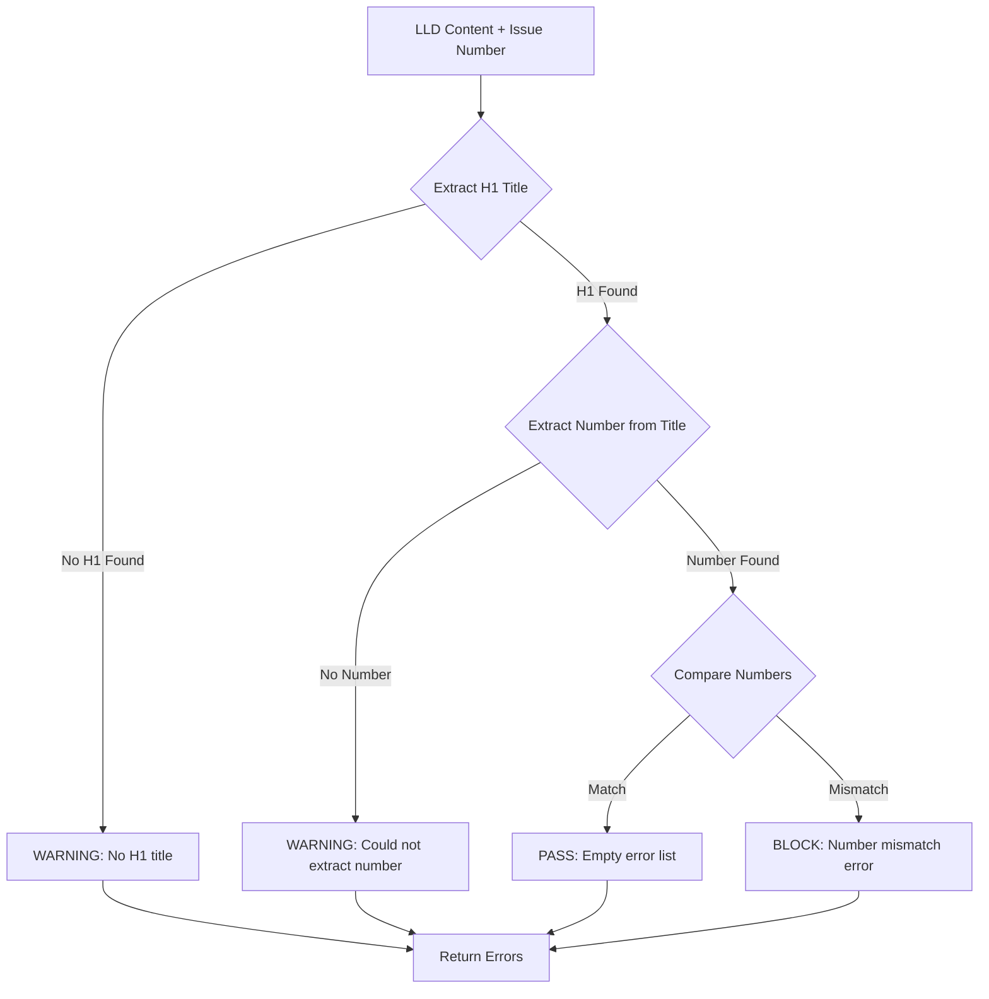

# 306 - Feature: Mechanical Validation - Verify LLD Title Issue Number Matches Workflow Issue

<!-- Template Metadata
Last Updated: 2026-02-02
Updated By: Issue #117 fix
Update Reason: Moved Verification & Testing to Section 10 (was Section 11) to match 0702c review prompt and testing workflow expectations
Previous: Added sections based on 80 blocking issues from 164 governance verdicts (2026-02-01)
-->

## 1. Context & Goal
* **Issue:** #306
* **Objective:** Add mechanical validation to detect and block LLD title issue number mismatches before human or Gemini review.
* **Status:** Draft
* **Related Issues:** #277 (mechanical validation framework), #99 (incident that inspired this)

### Open Questions
*Questions that need clarification before or during implementation. Remove when resolved.*

- [x] Should en-dash (–) and em-dash (—) be supported in addition to hyphen (-)? **Resolved: Yes, support all three dash types**
- [x] What about leading zeros (e.g., `# 099` vs `# 99`)? **Resolved: Both should match issue 99**

## 2. Proposed Changes

*This section is the **source of truth** for implementation. Describe exactly what will be built.*

### 2.1 Files Changed

| File | Change Type | Description |
|------|-------------|-------------|
| `agentos/workflows/requirements/nodes/validate_mechanical.py` | Modify | Add `validate_title_issue_number()` function and integrate into validation pipeline |
| `tests/unit/test_validate_mechanical.py` | Modify | Add test cases for title issue number validation |

### 2.1.1 Path Validation (Mechanical - Auto-Checked)

*Issue #277: Before human or Gemini review, paths are verified programmatically.*

Mechanical validation automatically checks:
- All "Modify" files must exist in repository
- All "Delete" files must exist in repository
- All "Add" files must have existing parent directories
- No placeholder prefixes (`src/`, `lib/`, `app/`) unless directory exists

**If validation fails, the LLD is BLOCKED before reaching review.**

### 2.2 Dependencies

*New packages, APIs, or services required.*

```toml
# pyproject.toml additions (if any)
# None - uses only stdlib re module already imported
```

### 2.3 Data Structures

```python
# Pseudocode - NOT implementation
# Reuses existing ValidationError from validate_mechanical.py
class ValidationError(TypedDict):
    severity: Literal["BLOCK", "WARNING"]  # BLOCK stops pipeline, WARNING is advisory
    message: str  # Human-readable description
    location: Optional[str]  # File/line reference if applicable
```

### 2.4 Function Signatures

```python
# Signatures only - implementation in source files
def validate_title_issue_number(content: str, issue_number: int) -> list[ValidationError]:
    """
    Verify the LLD title contains the correct issue number.
    
    Args:
        content: Full LLD markdown content
        issue_number: Expected issue number from workflow context
        
    Returns:
        List of ValidationError dicts. Empty if valid.
    """
    ...

def extract_title_issue_number(content: str) -> Optional[int]:
    """
    Extract issue number from LLD title line.
    
    Handles:
        - Standard format: # 306 - Feature: Title
        - Leading zeros: # 099 - Feature: Title
        - Various dashes: hyphen (-), en-dash (–), em-dash (—)
        
    Args:
        content: Full LLD markdown content
        
    Returns:
        Extracted issue number as int, or None if not found/parseable.
    """
    ...

def register_title_validator() -> None:
    """
    Register validate_title_issue_number with the mechanical validation pipeline.
    
    Called during module initialization to ensure the validator is included
    in run_mechanical_validation() execution list.
    """
    ...
```

### 2.5 Logic Flow (Pseudocode)

```
1. Receive LLD content and expected issue_number
2. Search for first H1 heading (line starting with single #)
3. IF no H1 found THEN
   - Return WARNING: "No H1 title found in LLD"
4. Extract number pattern from start of title text
5. IF no number pattern found THEN
   - Return WARNING: "Could not extract issue number from title"
6. Parse extracted number (strip leading zeros)
7. IF extracted_number != expected_number THEN
   - Return BLOCK: "Title issue number ({extracted}) doesn't match workflow issue ({expected})"
8. Return empty list (validation passed)
```

### 2.6 Technical Approach

* **Module:** `agentos/workflows/requirements/nodes/validate_mechanical.py`
* **Pattern:** Pure function validation (stateless, deterministic)
* **Key Decisions:** 
  - Use regex for robust parsing of various title formats
  - Support multiple dash types for international keyboard compatibility
  - Strip leading zeros for comparison (099 == 99)
  - BLOCK severity for mismatch (this is a definite error)
  - WARNING severity for unparseable title (may be unconventional format)
  - Explicit registration with validation pipeline via `register_title_validator()`

### 2.7 Architecture Decisions

*Document key architectural decisions that affect the design. This section addresses the most common category of governance feedback (23 patterns).*

| Decision | Options Considered | Choice | Rationale |
|----------|-------------------|--------|-----------|
| Severity for mismatch | WARNING, BLOCK | BLOCK | A wrong issue number is always an error, never acceptable |
| Severity for missing | BLOCK, WARNING | WARNING | LLD might use unconventional title format intentionally |
| Leading zero handling | Strict match, Numeric comparison | Numeric comparison | `# 099` and `# 99` should both be valid for issue 99 |
| Dash type support | Hyphen only, All Unicode dashes | All common dashes | Authors may use different keyboards/OS autocorrect |
| Pipeline integration | Implicit import, Explicit registration | Explicit registration | Ensures validator is discoverable and testable |

**Architectural Constraints:**
- Must integrate with existing `run_mechanical_validation()` function via registration
- Must return `ValidationError` dicts matching existing schema
- Cannot add new dependencies

## 3. Requirements

*What must be true when this is done. These become acceptance criteria.*

1. Validation returns BLOCK error when title issue number doesn't match workflow issue number
2. Validation returns WARNING when title format is unrecognized (no number found)
3. Validation passes silently when title issue number matches workflow issue number
4. Numbers with leading zeros match correctly (099 == 99)
5. Multiple dash types supported (-, –, —)
6. Integration with existing mechanical validation pipeline is seamless (validator is registered and invoked by `run_mechanical_validation()`)

## 4. Alternatives Considered

| Option | Pros | Cons | Decision |
|--------|------|------|----------|
| Regex extraction | Simple, fast, no dependencies | May miss edge cases | **Selected** |
| Markdown parser (mistune) | More robust parsing | Adds dependency, overkill for title extraction | Rejected |
| Require strict format only | Simpler regex | Would reject valid LLDs with minor variations | Rejected |

**Rationale:** Regex is sufficient for extracting a number from the start of a title. The pattern is well-defined (`# {number} - {text}`), and supporting variations (leading zeros, dash types) is straightforward with regex alternation.

## 5. Data & Fixtures

*Per [0108-lld-pre-implementation-review.md](0108-lld-pre-implementation-review.md) - complete this section BEFORE implementation.*

### 5.1 Data Sources

| Attribute | Value |
|-----------|-------|
| Source | LLD markdown content (string) + issue number (int from --issue flag) |
| Format | Markdown text |
| Size | Typically 5-50KB per LLD |
| Refresh | Per validation run |
| Copyright/License | N/A - internal project documents |

### 5.2 Data Pipeline

```
Workflow --issue flag ──► validate_title_issue_number() ◄── LLD content from disk
                                       │
                                       ▼
                              ValidationError[] ──► Mechanical validation aggregator
```

### 5.3 Test Fixtures

| Fixture | Source | Notes |
|---------|--------|-------|
| Valid LLD title (correct number) | Hardcoded | `# 306 - Feature: Test Title` |
| Invalid LLD title (wrong number) | Hardcoded | `# 199 - Feature: Test Title` |
| Missing number title | Hardcoded | `# Feature: Test Title` |
| Leading zeros title | Hardcoded | `# 0306 - Feature: Test Title` |
| En-dash title | Hardcoded | `# 306 – Feature: Test Title` |
| Em-dash title | Hardcoded | `# 306 — Feature: Test Title` |
| No H1 document | Hardcoded | Document starting with `## Section` |

### 5.4 Deployment Pipeline

No special deployment considerations. Changes deploy with standard AgentOS release process.

**If data source is external:** N/A - all data is internal.

## 6. Diagram
*{Write "N/A" if not applicable - do not delete sections}*

### 6.1 Mermaid Quality Gate

Before finalizing any diagram, verify in [Mermaid Live Editor](https://mermaid.live) or GitHub preview:

- [x] **Simplicity:** Similar components collapsed (per 0006 §8.1)
- [x] **No touching:** All elements have visual separation (per 0006 §8.2)
- [x] **No hidden lines:** All arrows fully visible (per 0006 §8.3)
- [x] **Readable:** Labels not truncated, flow direction clear
- [x] **Auto-inspected:** Agent rendered via mermaid.ink and viewed (per 0006 §8.5)

**Agent Auto-Inspection (MANDATORY):**

AI agents MUST render and view the diagram before committing:
1. Base64 encoded diagram → fetch PNG from mermaid.ink
2. Read the PNG file (multimodal inspection)
3. Document results below

**Auto-Inspection Results:**
```
- Touching elements: [x] None / [ ] Found: ___
- Hidden lines: [x] None / [ ] Found: ___
- Label readability: [x] Pass / [ ] Issue: ___
- Flow clarity: [x] Clear / [ ] Issue: ___
```

*Reference: [0006-mermaid-diagrams.md](0006-mermaid-diagrams.md)*

### 6.2 Diagram



## 7. Security & Safety Considerations

*This section addresses security (10 patterns) and safety (9 patterns) concerns from governance feedback.*

### 7.1 Security

| Concern | Mitigation | Status |
|---------|------------|--------|
| Regex DoS (ReDoS) | Pattern uses simple, non-backtracking constructs | Addressed |
| Input injection | Content is only read, never executed or interpolated into commands | Addressed |

### 7.2 Safety

*Safety concerns focus on preventing data loss, ensuring fail-safe behavior, and protecting system integrity.*

| Concern | Mitigation | Status |
|---------|------------|--------|
| False positive blocks | BLOCK only on definite mismatch; WARNING for ambiguous cases | Addressed |
| Validation crash | Wrap in try/except, return WARNING on unexpected errors | Addressed |

**Fail Mode:** Fail Open - If validation encounters an unexpected error, return WARNING rather than BLOCK. Prefer manual review over blocking valid LLDs.

**Recovery Strategy:** Validation errors are returned to the pipeline for aggregation. Pipeline continues with other validations and reports all issues together.

## 8. Performance & Cost Considerations

*This section addresses performance and cost concerns (6 patterns) from governance feedback.*

### 8.1 Performance

| Metric | Budget | Approach |
|--------|--------|----------|
| Latency | < 1ms | Single regex match on small content |
| Memory | < 1KB | No content copying, string views only |
| CPU | Negligible | O(n) single pass regex where n = title line length |

**Bottlenecks:** None - this is an extremely lightweight validation.

### 8.2 Cost Analysis

| Resource | Unit Cost | Estimated Usage | Monthly Cost |
|----------|-----------|-----------------|--------------|
| Compute | N/A | Runs locally | $0 |

**Cost Controls:**
- N/A - No external resources used

**Worst-Case Scenario:** N/A - function is bounded by input size (LLD content), which is typically < 100KB.

## 9. Legal & Compliance

*This section addresses legal concerns (8 patterns) from governance feedback.*

| Concern | Applies? | Mitigation |
|---------|----------|------------|
| PII/Personal Data | No | Validates structure only, no personal data processed |
| Third-Party Licenses | No | Uses only Python stdlib |
| Terms of Service | No | No external services |
| Data Retention | No | No data stored |
| Export Controls | No | No restricted algorithms |

**Data Classification:** Internal - LLD documents are internal project artifacts.

**Compliance Checklist:**
- [x] No PII stored without consent
- [x] All third-party licenses compatible with project license
- [x] External API usage compliant with provider ToS
- [x] Data retention policy documented

## 10. Verification & Testing

*Ref: [0005-testing-strategy-and-protocols.md](0005-testing-strategy-and-protocols.md)*

**Testing Philosophy:** Strive for 100% automated test coverage. Manual tests are a last resort for scenarios that genuinely cannot be automated (e.g., visual inspection, hardware interaction). Every scenario marked "Manual" requires justification.

### 10.0 Test Plan (TDD - Complete Before Implementation)

**TDD Requirement:** Tests MUST be written and failing BEFORE implementation begins.

| Test ID | Test Description | Expected Behavior | Status |
|---------|------------------|-------------------|--------|
| T010 | test_title_number_matches | Returns empty list | RED |
| T020 | test_title_number_mismatch | Returns BLOCK error | RED |
| T030 | test_title_missing_number | Returns WARNING | RED |
| T040 | test_title_leading_zeros | Returns empty list (099 matches 99) | RED |
| T050 | test_title_en_dash | Returns empty list | RED |
| T060 | test_title_em_dash | Returns empty list | RED |
| T070 | test_no_h1_heading | Returns WARNING | RED |
| T080 | test_title_multi_digit | Returns empty list for large numbers | RED |
| T090 | test_title_single_digit | Returns empty list for single digit | RED |
| T100 | test_validator_registered_in_pipeline | Validator is in pipeline's validator list | RED |
| T110 | test_run_mechanical_validation_invokes_title_check | run_mechanical_validation() calls title validator | RED |

**Coverage Target:** ≥95% for all new code

**TDD Checklist:**
- [ ] All tests written before implementation
- [ ] Tests currently RED (failing)
- [ ] Test IDs match scenario IDs in 10.1
- [x] Test file created at: `tests/unit/test_validate_mechanical.py`

*Note: Update Status from RED to GREEN as implementation progresses. All tests should be RED at LLD review time.*

### 10.1 Test Scenarios

| ID | Scenario | Type | Input | Expected Output | Pass Criteria |
|----|----------|------|-------|-----------------|---------------|
| 010 | Correct issue number | Auto | `# 306 - Feature: Test`, issue=306 | `[]` | Empty error list |
| 020 | Wrong issue number | Auto | `# 199 - Feature: Test`, issue=306 | `[{severity: "BLOCK", ...}]` | One BLOCK error with both numbers in message |
| 030 | Missing number in title | Auto | `# Feature: Test`, issue=306 | `[{severity: "WARNING", ...}]` | One WARNING error |
| 040 | Leading zeros match | Auto | `# 0306 - Feature: Test`, issue=306 | `[]` | Empty error list |
| 050 | En-dash separator | Auto | `# 306 – Feature: Test`, issue=306 | `[]` | Empty error list |
| 060 | Em-dash separator | Auto | `# 306 — Feature: Test`, issue=306 | `[]` | Empty error list |
| 070 | No H1 heading | Auto | `## Section\nContent`, issue=306 | `[{severity: "WARNING", ...}]` | One WARNING error |
| 080 | Multi-digit numbers | Auto | `# 1234 - Feature: Test`, issue=1234 | `[]` | Empty error list |
| 090 | Single digit number | Auto | `# 5 - Feature: Test`, issue=5 | `[]` | Empty error list |
| 100 | Validator is registered | Auto | Call `get_registered_validators()` | List contains `validate_title_issue_number` | Function in list |
| 110 | Pipeline invokes validator | Auto | Mock `validate_title_issue_number`, call `run_mechanical_validation()` | Mock was called with correct args | Assert mock called |

*Note: Use 3-digit IDs with gaps of 10 (010, 020, 030...) to allow insertions.*

**Type values:**
- `Auto` - Fully automated, runs in CI (pytest, playwright, etc.)

### 10.2 Test Commands

```bash
# Run all automated tests for this module
poetry run pytest tests/unit/test_validate_mechanical.py -v -k "title_issue"

# Run pipeline integration tests
poetry run pytest tests/unit/test_validate_mechanical.py -v -k "pipeline or registered"

# Run with coverage
poetry run pytest tests/unit/test_validate_mechanical.py -v --cov=agentos/workflows/requirements/nodes/validate_mechanical --cov-report=term-missing
```

### 10.3 Manual Tests (Only If Unavoidable)

N/A - All scenarios automated.

## 11. Risks & Mitigations

| Risk | Impact | Likelihood | Mitigation |
|------|--------|------------|------------|
| Regex fails on unusual title format | Low | Low | Return WARNING instead of BLOCK for unparseable titles |
| Leading zero edge cases | Low | Low | Comprehensive test coverage for 0-prefixed numbers |
| Unicode dash variants beyond –/— | Low | Low | Can extend regex pattern if needed; current set covers 99%+ cases |
| Validator not invoked by pipeline | Medium | Low | Explicit registration test (T100, T110) ensures integration |

## 12. Definition of Done

### Code
- [ ] Implementation complete and linted
- [ ] Code comments reference this LLD (#306)
- [ ] Validator registered with pipeline via `register_title_validator()`

### Tests
- [ ] All test scenarios pass (including T100, T110 for pipeline integration)
- [ ] Test coverage ≥95% for new code

### Documentation
- [ ] LLD updated with any deviations
- [ ] Implementation Report (0103) completed
- [ ] Test Report (0113) completed if applicable

### Review
- [ ] Code review completed
- [ ] User approval before closing issue

### 12.1 Traceability (Mechanical - Auto-Checked)

*Issue #277: Cross-references are verified programmatically.*

Mechanical validation automatically checks:
- Every file mentioned in this section must appear in Section 2.1
- Every risk mitigation in Section 11 should have a corresponding function in Section 2.4 (warning if not)

**Files referenced in Definition of Done:**
- `agentos/workflows/requirements/nodes/validate_mechanical.py` ✓ (in Section 2.1)
- `tests/unit/test_validate_mechanical.py` ✓ (in Section 2.1)

**If files are missing from Section 2.1, the LLD is BLOCKED.**

---

## Appendix: Review Log

*Track all review feedback with timestamps and implementation status.*

<!-- Note: Timestamps are auto-generated by the workflow. Do not fill in manually. -->

### Gemini Review #1 (REVISE)

**Reviewer:** Gemini 3 Pro
**Verdict:** REVISE

#### Comments

| ID | Comment | Implemented? |
|----|---------|--------------|
| G1.1 | "Requirement #6 asserts seamless integration, but there is no test verifying the new function is actually registered or called by the main `run_mechanical_validation` entry point" | YES - Added T100 (validator registered) and T110 (pipeline invokes validator) in Section 10.0 and 10.1 |
| G1.2 | "A test case (e.g., `test_pipeline_integration` or `test_validator_is_registered`) is required to prevent 'ghost code'" | YES - Added scenarios 100 and 110 covering registration and invocation |
| G1.3 | "Ensure the regex compilation happens at module level (constant) rather than inside the function" | ACKNOWLEDGED - Suggestion noted for implementation phase |

### Review Summary

<!-- Note: This table is auto-populated by the workflow with actual review dates. -->

| Review | Date | Verdict | Key Issue |
|--------|------|---------|-----------|
| Gemini #1 | (auto) | REVISE | Missing pipeline integration test |

**Final Status:** PENDING
<!-- Note: This field is auto-updated to APPROVED by the workflow when finalized -->