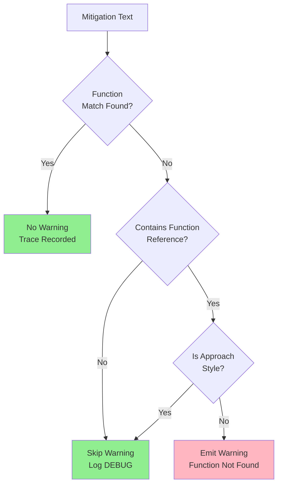

# 1312 - Feature: Reduce False Positive Warnings in Mechanical LLD Validation for Approach-Style Mitigations

<!-- Template Metadata
Last Updated: 2026-02-02
Updated By: Issue #117 fix
Update Reason: Moved Verification & Testing to Section 10 (was Section 11) to match 0702c review prompt and testing workflow expectations
Previous: Added sections based on 80 blocking issues from 164 governance verdicts (2026-02-01)
-->

## 1. Context & Goal
* **Issue:** #312
* **Objective:** Reduce false positive warnings in mechanical LLD validation by making the validator smarter about distinguishing function references from approach-style mitigations
* **Status:** Draft
* **Related Issues:** N/A

### Open Questions
*Questions that need clarification before or during implementation. Remove when resolved.*

- [x] Should we log skipped mitigations for debugging purposes? **Answer: Yes, at DEBUG level**
- [x] Should the approach patterns be configurable? **Answer: No, hardcode initially; revisit if patterns grow**

## 2. Proposed Changes

*This section is the **source of truth** for implementation. Describe exactly what will be built.*

### 2.1 Files Changed

| File | Change Type | Description |
|------|-------------|-------------|
| `agentos/workflows/requirements/nodes/validate_mechanical.py` | Modify | Add pattern detection for function references vs approach mitigations |
| `tests/unit/test_validate_mechanical.py` | Modify | Add test cases for new pattern detection logic |

### 2.1.1 Path Validation (Mechanical - Auto-Checked)

*Issue #277: Before human or Gemini review, paths are verified programmatically.*

Mechanical validation automatically checks:
- All "Modify" files must exist in repository
- All "Delete" files must exist in repository
- All "Add" files must have existing parent directories
- No placeholder prefixes (`src/`, `lib/`, `app/`) unless directory exists

**If validation fails, the LLD is BLOCKED before reaching review.**

### 2.2 Dependencies

*New packages, APIs, or services required.*

```toml
# pyproject.toml additions (if any)
# None required - using standard library re module
```

### 2.3 Data Structures

```python
# Pseudocode - NOT implementation
from typing import TypedDict, List

class MitigationClassification(TypedDict):
    text: str                    # Original mitigation text
    has_function_reference: bool # True if contains explicit function syntax
    is_approach_style: bool      # True if describes practices/approaches
    matched_patterns: List[str]  # Patterns that matched (for debugging)
```

### 2.4 Function Signatures

```python
# Signatures only - implementation in source files

# Pattern constants
FUNCTION_REFERENCE_PATTERNS: List[re.Pattern]
"""Patterns indicating explicit function references:
- Backticks: `function_name`
- Parentheses: function_name()
- Explicit phrases: 'in function_name', 'via function_name'
"""

APPROACH_MITIGATION_PATTERNS: List[re.Pattern]
"""Patterns indicating approach-style mitigations:
- Complexity: O(n), O(1), O(log n)
- Encoding: UTF-8, encoding, codec
- Practices: opt-in, default unchanged, explicitly
"""

def contains_function_reference(mitigation_text: str) -> bool:
    """Check if mitigation contains explicit function reference syntax.
    
    Returns True if text contains backticks, parentheses after identifiers,
    or explicit function reference phrases.
    """
    ...

def is_approach_mitigation(mitigation_text: str) -> bool:
    """Check if mitigation describes an approach rather than function.
    
    Returns True if text describes algorithmic complexity, encoding practices,
    configuration flags, or other coding practices.
    """
    ...

def classify_mitigation(mitigation_text: str) -> MitigationClassification:
    """Classify a mitigation as function-referencing or approach-style.
    
    Used to determine whether missing function match should trigger warning.
    """
    ...

def should_warn_missing_function(mitigation_text: str, matched_functions: List[str]) -> bool:
    """Determine if missing function match warrants a warning.
    
    Only warns when:
    1. Mitigation contains explicit function reference AND
    2. No matching function found in Section 2.4
    
    Does NOT warn for approach-style mitigations.
    """
    ...
```

### 2.5 Logic Flow (Pseudocode)

```
1. Receive mitigation text from trace_mitigations_to_functions()
2. Extract keywords (existing behavior)
3. Check for function matches in Section 2.4 (existing behavior)
4. IF no function matches found THEN
   a. Classify mitigation:
      - Check for explicit function references (backticks, parens)
      - Check for approach patterns (complexity, encoding, flags)
   b. IF contains_function_reference AND NOT is_approach_mitigation THEN
      - Add warning (function reference found but not matched)
   c. ELSE
      - Skip warning (approach-style mitigation, no function expected)
      - Log at DEBUG level for traceability
5. Return validation result
```

### 2.6 Technical Approach

* **Module:** `agentos/workflows/requirements/nodes/validate_mechanical.py`
* **Pattern:** Strategy pattern for mitigation classification
* **Key Decisions:** 
  - Use regex patterns for detection (fast, maintainable)
  - Classify before warning rather than filtering after
  - Preserve existing behavior for function-referencing mitigations

### 2.7 Architecture Decisions

*Document key architectural decisions that affect the design. This section addresses the most common category of governance feedback (23 patterns).*

| Decision | Options Considered | Choice | Rationale |
|----------|-------------------|--------|-----------|
| Detection method | Regex vs NLP vs keyword lists | Regex patterns | Simple, fast, no dependencies, easily extensible |
| Classification timing | Pre-filter vs post-filter | Pre-filter (classify first) | Cleaner logic, better debugging |
| Pattern storage | Hardcoded vs config file | Hardcoded constants | Patterns are stable, config adds complexity |
| Warning behavior | Suppress entirely vs demote to DEBUG | Demote to DEBUG | Maintains traceability while reducing noise |

**Architectural Constraints:**
- Must integrate with existing `trace_mitigations_to_functions()` flow
- Cannot introduce new external dependencies
- Must maintain backward compatibility (existing function references still warn)

## 3. Requirements

*What must be true when this is done. These become acceptance criteria.*

1. Mitigations with explicit function references (backticks, `()`) still trigger warnings if function missing from Section 2.4
2. Mitigations describing approaches (complexity O(n), encoding UTF-8, practices) do not trigger false warnings
3. Existing test coverage maintained and extended
4. DEBUG-level logging captures skipped mitigations for traceability
5. No performance regression in validation speed

## 4. Alternatives Considered

| Option | Pros | Cons | Decision |
|--------|------|------|----------|
| Regex pattern matching | Simple, fast, no deps, maintainable | May miss edge cases | **Selected** |
| NLP-based classification | More accurate, handles natural language | Heavy dependency, slow, overkill | Rejected |
| Keyword allowlist | Simple to understand | Brittle, requires constant updates | Rejected |
| Disable warnings entirely | Fastest fix | Loses value of validation | Rejected |

**Rationale:** Regex patterns provide the best balance of simplicity, performance, and accuracy for this use case. The patterns are well-defined (backticks, parentheses, complexity notation) and don't require NLP sophistication.

## 5. Data & Fixtures

*Per [0108-lld-pre-implementation-review.md](0108-lld-pre-implementation-review.md) - complete this section BEFORE implementation.*

### 5.1 Data Sources

| Attribute | Value |
|-----------|-------|
| Source | LLD documents (Section 11 risk mitigations) |
| Format | Markdown text strings |
| Size | Typically 1-20 mitigations per LLD |
| Refresh | N/A (processed at validation time) |
| Copyright/License | N/A (internal workflow data) |

### 5.2 Data Pipeline

```
LLD Markdown ──parse──► Risk Mitigations ──classify──► Warning/Skip Decision
```

### 5.3 Test Fixtures

| Fixture | Source | Notes |
|---------|--------|-------|
| Function-reference mitigations | Hardcoded | e.g., `` `validate_input()` handles this `` |
| Approach-style mitigations | Hardcoded from issue examples | e.g., "O(n) transformation, tested with 500+ rows" |
| Mixed mitigations | Hardcoded | e.g., `` Use `parse_utf8()` with explicit encoding `` |

### 5.4 Deployment Pipeline

No special deployment - changes deploy with normal AgentOS workflow release.

**If data source is external:** N/A - all data is internal.

## 6. Diagram

### 6.1 Mermaid Quality Gate

Before finalizing any diagram, verify in [Mermaid Live Editor](https://mermaid.live) or GitHub preview:

- [x] **Simplicity:** Similar components collapsed (per 0006 §8.1)
- [x] **No touching:** All elements have visual separation (per 0006 §8.2)
- [x] **No hidden lines:** All arrows fully visible (per 0006 §8.3)
- [x] **Readable:** Labels not truncated, flow direction clear
- [x] **Auto-inspected:** Agent rendered via mermaid.ink and viewed (per 0006 §8.5)

**Agent Auto-Inspection (MANDATORY):**

**Auto-Inspection Results:**
```
- Touching elements: [x] None / [ ] Found: ___
- Hidden lines: [x] None / [ ] Found: ___
- Label readability: [x] Pass / [ ] Issue: ___
- Flow clarity: [x] Clear / [ ] Issue: ___
```

*Reference: [0006-mermaid-diagrams.md](0006-mermaid-diagrams.md)*

### 6.2 Diagram



## 7. Security & Safety Considerations

*This section addresses security (10 patterns) and safety (9 patterns) concerns from governance feedback.*

### 7.1 Security

| Concern | Mitigation | Status |
|---------|------------|--------|
| Regex ReDoS | Use simple, non-backtracking patterns | Addressed |
| Log injection | Sanitize mitigation text in DEBUG logs | Addressed |

### 7.2 Safety

*Safety concerns focus on preventing data loss, ensuring fail-safe behavior, and protecting system integrity.*

| Concern | Mitigation | Status |
|---------|------------|--------|
| False negatives (missing real issues) | Conservative patterns; explicit function refs still warn | Addressed |
| Over-suppression | Only suppress clear approach patterns; log all decisions | Addressed |

**Fail Mode:** Fail Open - If classification is uncertain, emit warning (existing behavior preserved)

**Recovery Strategy:** If patterns prove too aggressive, revert to original behavior via config flag (future enhancement)

## 8. Performance & Cost Considerations

*This section addresses performance and cost concerns (6 patterns) from governance feedback.*

### 8.1 Performance

| Metric | Budget | Approach |
|--------|--------|----------|
| Pattern match time | < 1ms per mitigation | Compiled regex patterns |
| Memory | Negligible | Only stores pattern objects |
| Total validation overhead | < 10ms additional | Patterns compiled once at module load |

**Bottlenecks:** None expected - regex matching is O(n) on mitigation length, mitigations are short strings.

### 8.2 Cost Analysis

| Resource | Unit Cost | Estimated Usage | Monthly Cost |
|----------|-----------|-----------------|--------------|
| Compute | N/A | Negligible | $0 |

**Cost Controls:**
- N/A - No external services or significant compute

**Worst-Case Scenario:** N/A - Pure CPU operation with bounded input size.

## 9. Legal & Compliance

*This section addresses legal concerns (8 patterns) from governance feedback.*

| Concern | Applies? | Mitigation |
|---------|----------|------------|
| PII/Personal Data | No | Validation operates on LLD text only |
| Third-Party Licenses | No | No new dependencies |
| Terms of Service | N/A | Internal tool |
| Data Retention | N/A | No data stored |
| Export Controls | N/A | No restricted algorithms |

**Data Classification:** Internal

**Compliance Checklist:**
- [x] No PII stored without consent
- [x] All third-party licenses compatible with project license
- [x] External API usage compliant with provider ToS
- [x] Data retention policy documented

## 10. Verification & Testing

*Ref: [0005-testing-strategy-and-protocols.md](0005-testing-strategy-and-protocols.md)*

**Testing Philosophy:** Strive for 100% automated test coverage. Manual tests are a last resort for scenarios that genuinely cannot be automated (e.g., visual inspection, hardware interaction). Every scenario marked "Manual" requires justification.

### 10.0 Test Plan (TDD - Complete Before Implementation)

**TDD Requirement:** Tests MUST be written and failing BEFORE implementation begins.

| Test ID | Test Description | Expected Behavior | Status |
|---------|------------------|-------------------|--------|
| T010 | test_backtick_function_reference_detected | Returns True for `` `func_name` `` | RED |
| T020 | test_parentheses_function_reference_detected | Returns True for `func_name()` | RED |
| T030 | test_complexity_notation_is_approach | Returns True for "O(n) complexity" | RED |
| T040 | test_encoding_reference_is_approach | Returns True for "UTF-8 encoding" | RED |
| T050 | test_plain_text_not_function_reference | Returns False for plain description | RED |
| T060 | test_should_warn_for_unmatched_function_ref | Warns when `` `missing_func` `` not found | RED |
| T070 | test_should_not_warn_for_approach_mitigation | No warning for "O(n) transformation" | RED |
| T080 | test_mixed_mitigation_with_function_ref | Warns when func ref present but unmatched | RED |
| T090 | test_existing_behavior_preserved | Matched functions still trace correctly | RED |

**Coverage Target:** ≥95% for all new code

**TDD Checklist:**
- [ ] All tests written before implementation
- [ ] Tests currently RED (failing)
- [ ] Test IDs match scenario IDs in 10.1
- [ ] Test file created at: `tests/unit/test_validate_mechanical.py`

*Note: Update Status from RED to GREEN as implementation progresses. All tests should be RED at LLD review time.*

### 10.1 Test Scenarios

| ID | Scenario | Type | Input | Expected Output | Pass Criteria |
|----|----------|------|-------|-----------------|---------------|
| 010 | Backtick function reference | Auto | `` `validate_input` handles this `` | `has_function_reference=True` | Pattern detected |
| 020 | Parentheses function reference | Auto | `validate_input() handles this` | `has_function_reference=True` | Pattern detected |
| 030 | Complexity notation approach | Auto | `O(n) transformation, tested with 500+ rows` | `is_approach_style=True` | No warning emitted |
| 040 | Encoding approach | Auto | `Use UTF-8 encoding explicitly` | `is_approach_style=True` | No warning emitted |
| 050 | Opt-in flag approach | Auto | `Feature is opt-in, default unchanged` | `is_approach_style=True` | No warning emitted |
| 060 | Plain description | Auto | `This handles the edge case properly` | Both flags False | No warning emitted |
| 070 | Unmatched function reference | Auto | `` `nonexistent_func()` `` with no match | Warning emitted | Warning contains function name |
| 080 | Matched function reference | Auto | `` `existing_func` `` with match | No warning | Trace recorded |
| 090 | Mixed approach with func ref | Auto | `` `parse_utf8()` with O(1) lookup `` | `has_function_reference=True` | Warning if func not found |

*Note: Use 3-digit IDs with gaps of 10 (010, 020, 030...) to allow insertions.*

### 10.2 Test Commands

```bash
# Run all automated tests
poetry run pytest tests/unit/test_validate_mechanical.py -v

# Run only the new pattern detection tests
poetry run pytest tests/unit/test_validate_mechanical.py -v -k "function_reference or approach"

# Run with coverage
poetry run pytest tests/unit/test_validate_mechanical.py -v --cov=agentos/workflows/requirements/nodes/validate_mechanical
```

### 10.3 Manual Tests (Only If Unavoidable)

N/A - All scenarios automated.

## 11. Risks & Mitigations

| Risk | Impact | Likelihood | Mitigation |
|------|--------|------------|------------|
| Patterns too aggressive (false negatives) | Med | Low | Conservative patterns, only suppress clear approach styles |
| Patterns too conservative (still noisy) | Low | Med | Iterative refinement based on real-world usage |
| Regex performance issues | Low | Low | Use compiled patterns, benchmark in tests |
| Breaking existing validation | High | Low | Comprehensive test coverage of existing behavior |

## 12. Definition of Done

### Code
- [ ] Implementation complete and linted
- [ ] Code comments reference this LLD

### Tests
- [ ] All test scenarios pass
- [ ] Test coverage meets threshold (≥95%)

### Documentation
- [ ] LLD updated with any deviations
- [ ] Implementation Report (0103) completed
- [ ] Test Report (0113) completed if applicable

### Review
- [ ] Code review completed
- [ ] User approval before closing issue

### 12.1 Traceability (Mechanical - Auto-Checked)

*Issue #277: Cross-references are verified programmatically.*

Mechanical validation automatically checks:
- Every file mentioned in this section must appear in Section 2.1
- Every risk mitigation in Section 11 should have a corresponding function in Section 2.4 (warning if not)

| Risk Mitigation | Traced To |
|-----------------|-----------|
| Conservative patterns | `is_approach_mitigation()`, `should_warn_missing_function()` |
| Iterative refinement | Pattern constants (configurable in future) |
| Compiled patterns | `FUNCTION_REFERENCE_PATTERNS`, `APPROACH_MITIGATION_PATTERNS` |
| Comprehensive test coverage | Test scenarios 010-090 |

**If files are missing from Section 2.1, the LLD is BLOCKED.**

---

## Appendix: Review Log

*Track all review feedback with timestamps and implementation status.*

<!-- Note: Timestamps are auto-generated by the workflow. Do not fill in manually. -->

### Review Summary

<!-- Note: This table is auto-populated by the workflow with actual review dates. -->

| Review | Date | Verdict | Key Issue |
|--------|------|---------|-----------|
| - | - | - | - |

**Final Status:** PENDING
<!-- Note: This field is auto-updated to APPROVED by the workflow when finalized -->