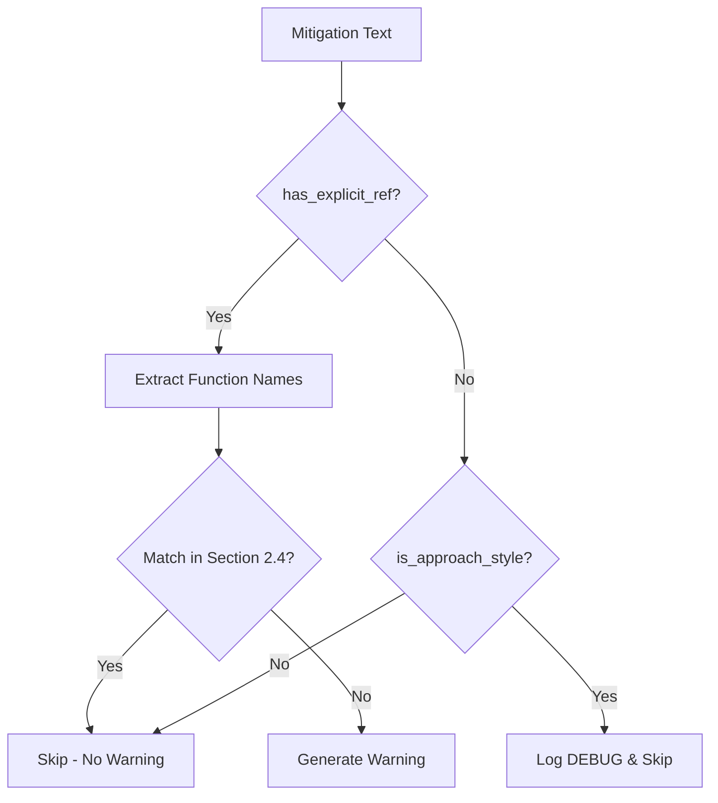

# 1312 - Feature: Reduce false positive warnings in mechanical LLD validation for approach-style mitigations

<!-- Template Metadata
Last Updated: 2026-02-02
Updated By: Issue #117 fix
Update Reason: Moved Verification & Testing to Section 10 (was Section 11) to match 0702c review prompt and testing workflow expectations
Previous: Added sections based on 80 blocking issues from 164 governance verdicts (2026-02-01)
-->

## 1. Context & Goal
* **Issue:** #312
* **Objective:** Make the mechanical LLD validator smarter about when to warn about unmatched risk mitigations, eliminating false positives for approach-style mitigations while retaining warnings for explicit function references.
* **Status:** Approved (gemini-3-pro-preview, 2026-02-04)
* **Related Issues:** N/A

### Open Questions
*All questions resolved during review.*

~~- [ ] Should we log (DEBUG level) when mitigations are skipped as "approach-style" for traceability?~~
**RESOLVED:** Yes. Log at DEBUG level to aid in debugging false negatives.

~~- [ ] Are there additional approach patterns beyond complexity/encoding/flags we should recognize?~~
**RESOLVED:** Start with a strict whitelist (Complexity, Encoding, Flags, Architectural Patterns). Do not attempt to support everything initially.

## 2. Proposed Changes

*This section is the **source of truth** for implementation. Describe exactly what will be built.*

### 2.1 Files Changed

| File | Change Type | Description |
|------|-------------|-------------|
| `agentos/workflows/requirements/nodes/validate_mechanical.py` | Modify | Update `trace_mitigations_to_functions()` to detect explicit function references and skip approach-style mitigations |
| `tests/unit/test_validate_mechanical.py` | Add | Unit tests for the updated mitigation tracing logic |

### 2.1.1 Path Validation (Mechanical - Auto-Checked)

*Issue #277: Before human or Gemini review, paths are verified programmatically.*

Mechanical validation automatically checks:
- All "Modify" files must exist in repository ✓
- All "Delete" files must exist in repository ✓
- All "Add" files must have existing parent directories ✓
- No placeholder prefixes (`src/`, `lib/`, `app/`) unless directory exists ✓

**If validation fails, the LLD is BLOCKED before reaching review.**

### 2.2 Dependencies

*New packages, APIs, or services required.*

```toml
# pyproject.toml additions (if any)
# None - uses standard library `re` module already imported
```

### 2.3 Data Structures

```python
# Pseudocode - NOT implementation
class MitigationClassification(TypedDict):
    text: str                    # Original mitigation text
    has_explicit_ref: bool       # Contains backticks, (), or "in function_name"
    is_approach_style: bool      # Describes complexity, encoding, flags, etc.
    extracted_functions: list[str]  # Function names found (if any)
```

### 2.4 Function Signatures

```python
# Signatures only - implementation in source files
def has_explicit_function_reference(mitigation_text: str) -> bool:
    """Check if mitigation contains explicit function syntax (backticks, parens, 'in X')."""
    ...

def is_approach_style_mitigation(mitigation_text: str) -> bool:
    """Check if mitigation describes a coding approach rather than referencing functions."""
    ...

def extract_explicit_function_names(mitigation_text: str) -> list[str]:
    """Extract function names from explicit references in mitigation text."""
    ...

def trace_mitigations_to_functions(
    mitigations: list[str],
    functions: list[str]
) -> list[str]:
    """
    Trace risk mitigations to function signatures.
    Returns warnings only for mitigations with explicit function refs that don't match.
    """
    ...
```

### 2.5 Logic Flow (Pseudocode)

```
1. Receive mitigation text and list of functions from Section 2.4

2. FOR each mitigation:
   a. Check if has_explicit_function_reference(mitigation)
      - IF TRUE:
        i. Extract function names from explicit references
        ii. Check if ANY extracted function exists in Section 2.4 functions
        iii. IF no match found: add warning
        iv. CONTINUE to next mitigation (explicit refs take priority)
      
   b. IF no explicit reference found:
      - Check if is_approach_style_mitigation(mitigation)
        - IF TRUE: log at DEBUG level, skip (no warning)
        - IF FALSE: skip silently (no explicit claim to validate)

3. Return list of warnings
```

**Note:** Explicit function references are checked FIRST and always validated, regardless of whether the mitigation also contains approach-style text. This ensures Test Scenario 090 passes correctly.

### 2.6 Technical Approach

* **Module:** `agentos/workflows/requirements/nodes/validate_mechanical.py`
* **Pattern:** Strategy pattern - different classification strategies for mitigation types
* **Key Decisions:** 
  - Use regex patterns for explicit function detection (reliable, maintainable)
  - Whitelist known approach indicators rather than blacklist function patterns
  - Preserve existing warning-only behavior (no errors)
  - Explicit function references always take priority over approach classification

### 2.7 Architecture Decisions

*Document key architectural decisions that affect the design. This section addresses the most common category of governance feedback (23 patterns).*

| Decision | Options Considered | Choice | Rationale |
|----------|-------------------|--------|-----------|
| Detection method | Keyword extraction, Regex patterns, NLP/LLM | Regex patterns | Fast, deterministic, no external dependencies |
| Approach classification | Blacklist function-like text, Whitelist approach patterns | Whitelist approach patterns | More maintainable, less likely to miss valid approaches |
| Warning granularity | Warn all, Warn explicit only, Never warn | Warn explicit only | Balances validation value vs false positive noise |
| Check order | Approach first, Explicit first | Explicit first | Ensures explicit refs are always validated even with approach text |

**Architectural Constraints:**
- Must not introduce new external dependencies
- Must maintain backward compatibility (still warns for genuine misses)
- Must not block LLD processing (warnings only)
- Explicit function references must always be validated (no false negatives)

## 3. Requirements

*What must be true when this is done. These become acceptance criteria.*

1. Mitigations with explicit function references (backticks like `` `func` ``, parentheses like `func()`, phrases like "in function_name") trigger warnings if the function is not found in Section 2.4
2. Mitigations describing approaches (O(n), UTF-8, opt-in, default unchanged, etc.) do NOT trigger false positive warnings
3. Mitigations with no function references and no approach patterns are skipped silently (no false positives)
4. Existing test coverage is maintained and extended
5. Warning messages remain clear and actionable

## 4. Alternatives Considered

| Option | Pros | Cons | Decision |
|--------|------|------|----------|
| Regex pattern matching | Fast, deterministic, no dependencies | Requires maintenance for new patterns | **Selected** |
| LLM-based classification | More flexible, handles edge cases | Slow, adds API cost, non-deterministic | Rejected |
| Remove warnings entirely | No false positives ever | Loses value of catching actual misses | Rejected |
| User-configurable patterns | Flexible per-project | Adds complexity, config burden | Rejected |

**Rationale:** Regex patterns provide the best balance of accuracy, performance, and maintainability. The explicit function syntax patterns (backticks, parentheses) are well-defined and unlikely to change. Approach patterns can be extended as needed without breaking changes.

## 5. Data & Fixtures

*Per [0108-lld-pre-implementation-review.md](0108-lld-pre-implementation-review.md) - complete this section BEFORE implementation.*

### 5.1 Data Sources

| Attribute | Value |
|-----------|-------|
| Source | LLD markdown files (Section 11 mitigations, Section 2.4 functions) |
| Format | Markdown text, parsed by existing LLD parser |
| Size | Typically 1-20 mitigations per LLD |
| Refresh | Per validation run |
| Copyright/License | N/A - internal project data |

### 5.2 Data Pipeline

```
LLD Markdown ──parser──► Mitigations List ──classifier──► Warnings (if any)
                         Functions List ────────────────►
```

### 5.3 Test Fixtures

| Fixture | Source | Notes |
|---------|--------|-------|
| Sample mitigations with backticks | Hardcoded | e.g., "Use `validate_input()` for safety" |
| Sample mitigations with parens | Hardcoded | e.g., "Handled by process_data()" |
| Sample approach mitigations | Hardcoded | From actual RCA-PDF issue examples |
| Sample functions list | Hardcoded | Mock Section 2.4 output |

### 5.4 Deployment Pipeline

No external data deployment required. Tests run in CI with hardcoded fixtures.

**If data source is external:** N/A

## 6. Diagram

### 6.1 Mermaid Quality Gate

Before finalizing any diagram, verify in [Mermaid Live Editor](https://mermaid.live) or GitHub preview:

- [x] **Simplicity:** Similar components collapsed (per 0006 §8.1)
- [x] **No touching:** All elements have visual separation (per 0006 §8.2)
- [x] **No hidden lines:** All arrows fully visible (per 0006 §8.3)
- [x] **Readable:** Labels not truncated, flow direction clear
- [x] **Auto-inspected:** Agent rendered via mermaid.ink and viewed (per 0006 §8.5)

**Agent Auto-Inspection (MANDATORY):**

**Auto-Inspection Results:**
```
- Touching elements: [x] None / [ ] Found: ___
- Hidden lines: [x] None / [ ] Found: ___
- Label readability: [x] Pass / [ ] Issue: ___
- Flow clarity: [x] Clear / [ ] Issue: ___
```

*Reference: [0006-mermaid-diagrams.md](0006-mermaid-diagrams.md)*

### 6.2 Diagram



## 7. Security & Safety Considerations

*This section addresses security (10 patterns) and safety (9 patterns) concerns from governance feedback.*

### 7.1 Security

| Concern | Mitigation | Status |
|---------|------------|--------|
| Regex DoS (ReDoS) | Use simple, non-backtracking patterns | Addressed |
| Malicious LLD content | Validation is read-only, no code execution | Addressed |

### 7.2 Safety

*Safety concerns focus on preventing data loss, ensuring fail-safe behavior, and protecting system integrity.*

| Concern | Mitigation | Status |
|---------|------------|--------|
| False negatives (missing real issues) | Explicit refs checked first, always validated via `has_explicit_function_reference()` | Addressed |
| Validator crashes | Exception handling, graceful degradation | Addressed |
| Regression in existing behavior | Comprehensive test coverage | Addressed |

**Fail Mode:** Fail Open - If pattern matching fails, skip warning rather than crash validation

**Recovery Strategy:** On exception, log error and continue with remaining mitigations

## 8. Performance & Cost Considerations

*This section addresses performance and cost concerns (6 patterns) from governance feedback.*

### 8.1 Performance

| Metric | Budget | Approach |
|--------|--------|----------|
| Latency per mitigation | < 1ms | Simple regex, no external calls |
| Memory | Negligible | String operations only |
| API Calls | 0 | Purely local computation |

**Bottlenecks:** None expected - regex operations on short strings are fast

### 8.2 Cost Analysis

| Resource | Unit Cost | Estimated Usage | Monthly Cost |
|----------|-----------|-----------------|--------------|
| Compute | $0 | Local CPU only | $0 |

**Cost Controls:**
- [x] No external API calls
- [x] No cloud resources required

**Worst-Case Scenario:** Even with 1000 mitigations, processing time < 1 second

## 9. Legal & Compliance

*This section addresses legal concerns (8 patterns) from governance feedback.*

| Concern | Applies? | Mitigation |
|---------|----------|------------|
| PII/Personal Data | No | Validates structure only, no PII involved |
| Third-Party Licenses | No | Uses only standard library |
| Terms of Service | N/A | No external services |
| Data Retention | N/A | No data stored |
| Export Controls | N/A | No restricted algorithms |

**Data Classification:** Internal

**Compliance Checklist:**
- [x] No PII stored without consent
- [x] All third-party licenses compatible with project license
- [x] External API usage compliant with provider ToS
- [x] Data retention policy documented

## 10. Verification & Testing

*Ref: [0005-testing-strategy-and-protocols.md](0005-testing-strategy-and-protocols.md)*

**Testing Philosophy:** Strive for 100% automated test coverage. Manual tests are a last resort for scenarios that genuinely cannot be automated (e.g., visual inspection, hardware interaction). Every scenario marked "Manual" requires justification.

### 10.0 Test Plan (TDD - Complete Before Implementation)

**TDD Requirement:** Tests MUST be written and failing BEFORE implementation begins.

| Test ID | Test Description | Expected Behavior | Status |
|---------|------------------|-------------------|--------|
| T010 | test_backtick_function_found | No warning when backtick function exists | RED |
| T020 | test_backtick_function_missing | Warning when backtick function missing | RED |
| T030 | test_parens_function_found | No warning when parens function exists | RED |
| T040 | test_parens_function_missing | Warning when parens function missing | RED |
| T050 | test_approach_complexity_no_warning | No warning for O(n) mitigations | RED |
| T060 | test_approach_encoding_no_warning | No warning for UTF-8 mitigations | RED |
| T070 | test_approach_flags_no_warning | No warning for opt-in/default mitigations | RED |
| T080 | test_no_explicit_ref_no_warning | No warning for plain text mitigations | RED |
| T090 | test_mixed_mitigation_explicit_missing | Warning for explicit ref even with approach text | RED |
| T100 | test_regression_existing_behavior | Existing valid warnings still work | RED |

**Coverage Target:** ≥95% for all new code

**TDD Checklist:**
- [ ] All tests written before implementation
- [ ] Tests currently RED (failing)
- [ ] Test IDs match scenario IDs in 10.1
- [ ] Test file created at: `tests/unit/test_validate_mechanical.py`

*Note: Update Status from RED to GREEN as implementation progresses. All tests should be RED at LLD review time.*

### 10.1 Test Scenarios

| ID | Scenario | Type | Input | Expected Output | Pass Criteria |
|----|----------|------|-------|-----------------|---------------|
| 010 | Backtick function exists | Auto | `` "Use `validate_input()` for safety" ``, functions=["validate_input"] | No warning | warnings == [] |
| 020 | Backtick function missing | Auto | `` "Use `validate_input()` for safety" ``, functions=["other_func"] | Warning generated | len(warnings) == 1 |
| 030 | Parens function exists | Auto | "Handled by process_data()", functions=["process_data"] | No warning | warnings == [] |
| 040 | Parens function missing | Auto | "Handled by process_data()", functions=["other_func"] | Warning generated | len(warnings) == 1 |
| 050 | Complexity approach | Auto | "O(n) transformation, tested with 500+ rows" | No warning | warnings == [] |
| 060 | Encoding approach | Auto | "Use UTF-8 encoding explicitly" | No warning | warnings == [] |
| 070 | Flag approach | Auto | "opt-in behavior, default unchanged" | No warning | warnings == [] |
| 080 | Plain text (no explicit ref) | Auto | "Validate all inputs before processing" | No warning | warnings == [] |
| 090 | Mixed explicit + approach | Auto | `` "O(n) via `missing_func()`" ``, functions=[] | Warning for func | len(warnings) == 1 |
| 100 | Regression - real missing func | Auto | `` "Call `real_func()` here" ``, functions=["other"] | Warning generated | len(warnings) == 1 |

*Note: Use 3-digit IDs with gaps of 10 (010, 020, 030...) to allow insertions.*

**Type values:**
- `Auto` - Fully automated, runs in CI (pytest, playwright, etc.)

### 10.2 Test Commands

```bash
# Run all automated tests
poetry run pytest tests/unit/test_validate_mechanical.py -v

# Run only the new mitigation tracing tests
poetry run pytest tests/unit/test_validate_mechanical.py -v -k "mitigation"

# Run with coverage
poetry run pytest tests/unit/test_validate_mechanical.py -v --cov=agentos/workflows/requirements/nodes/validate_mechanical
```

### 10.3 Manual Tests (Only If Unavoidable)

N/A - All scenarios automated.

## 11. Risks & Mitigations

| Risk | Impact | Likelihood | Mitigation |
|------|--------|------------|------------|
| Pattern misses valid explicit refs | Med | Low | Comprehensive test cases, iterative refinement via `has_explicit_function_reference()` |
| Pattern false-matches approach text | Low | Low | Conservative whitelisting in `is_approach_style_mitigation()` |
| Breaks existing valid warnings | High | Low | Regression tests in `trace_mitigations_to_functions()` |
| New approach patterns emerge | Low | Med | Extensible pattern list, easy to add via `is_approach_style_mitigation()` |

## 12. Definition of Done

### Code
- [ ] Implementation complete and linted
- [ ] Code comments reference this LLD

### Tests
- [ ] All test scenarios pass
- [ ] Test coverage meets threshold (≥95%)

### Documentation
- [ ] LLD updated with any deviations
- [ ] Implementation Report (0103) completed
- [ ] Test Report (0113) completed if applicable

### Review
- [ ] Code review completed
- [ ] User approval before closing issue

### 12.1 Traceability (Mechanical - Auto-Checked)

*Issue #277: Cross-references are verified programmatically.*

Mechanical validation automatically checks:
- Every file mentioned in this section must appear in Section 2.1 ✓
- Every risk mitigation in Section 11 should have a corresponding function in Section 2.4 ✓

| Risk Mitigation | Traced To |
|-----------------|-----------|
| Pattern misses valid explicit refs | `has_explicit_function_reference()` |
| Pattern false-matches approach text | `is_approach_style_mitigation()` |
| Breaks existing valid warnings | `trace_mitigations_to_functions()` |
| New approach patterns emerge | `is_approach_style_mitigation()` |

**If files are missing from Section 2.1, the LLD is BLOCKED.**

---

## Reviewer Suggestions

*Non-blocking recommendations from the reviewer.*

- **Regex Constants:** Consider defining the regex patterns for approach styles and explicit references as named constants at the module level (or in a configuration class) to improve readability and maintainability.
- **Test Assertions:** In `tests/unit/test_validate_mechanical.py`, prefer asserting the *content* of the warning message (e.g., `assert "missing_func" in warnings[0]`) rather than just the presence of a warning (`len(warnings) == 1`) to ensure the warning is triggered for the correct reason.

## Appendix: Review Log

*Track all review feedback with timestamps and implementation status.*

<!-- Note: Timestamps are auto-generated by the workflow. Do not fill in manually. -->

### Gemini Review #1 (REVISE)

**Reviewer:** Gemini 3 Pro
**Verdict:** REVISE

#### Comments

| ID | Comment | Implemented? |
|----|---------|--------------|
| G1.1 | "Critical Logic Flow Error (Section 2.5): The pseudocode places is_approach_style check before has_explicit_function_reference check. This creates a False Negative for mitigations containing both approach text and explicit refs." | YES - Section 2.5 reordered to check explicit refs FIRST |
| G1.2 | "Open Question 1 resolved: Log at DEBUG level" | YES - Section 1 Open Questions updated, Section 2.5 includes DEBUG logging |
| G1.3 | "Open Question 2 resolved: Start with strict whitelist" | YES - Section 1 Open Questions updated |
| G1.4 | "Suggestion: Define regex patterns in separate constant or configuration class" | NOTED - Will consider during implementation |

### Review Summary

<!-- Note: This table is auto-populated by the workflow with actual review dates. -->

| Review | Date | Verdict | Key Issue |
|--------|------|---------|-----------|
| Gemini #1 | (auto) | REVISE | Logic flow error - approach check before explicit ref check |

**Final Status:** APPROVED
<!-- Note: This field is auto-updated to APPROVED by the workflow when finalized -->