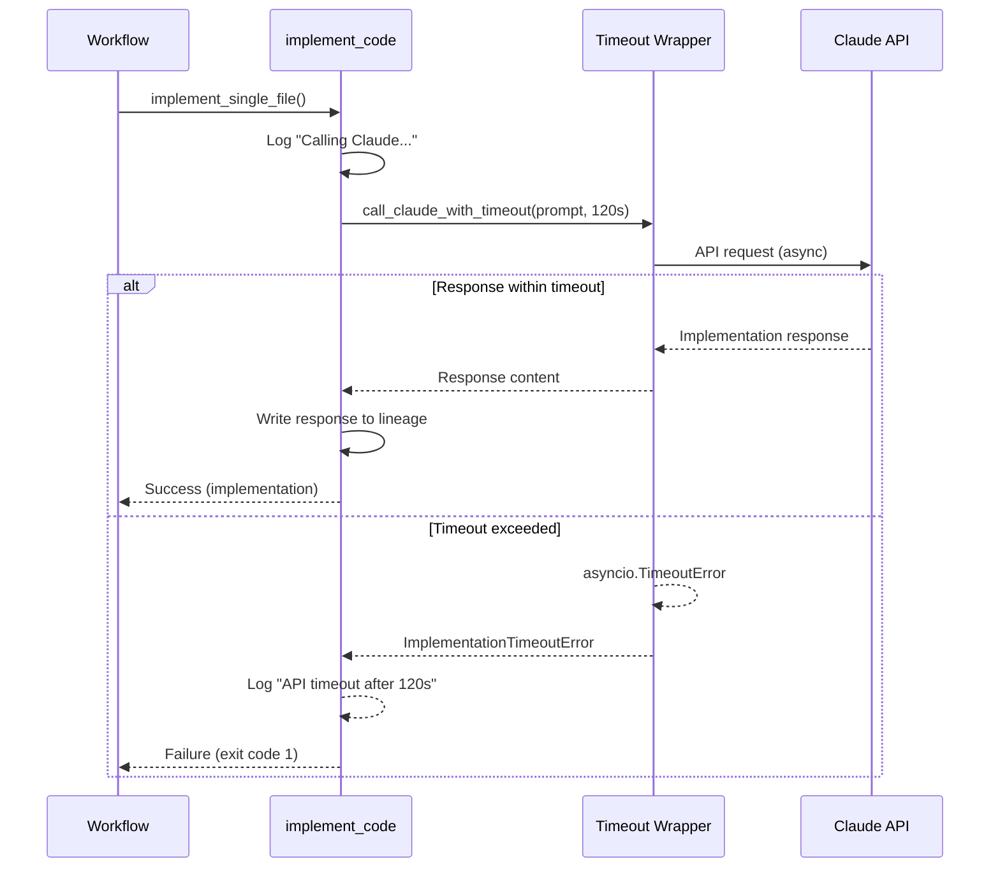

# 1321 - Bug: Implementation workflow silently exits on API timeout

<!-- Template Metadata
Last Updated: 2026-02-02
Updated By: Issue #321 LLD creation
Update Reason: Initial LLD for API timeout handling in implementation workflow
-->

## 1. Context & Goal
* **Issue:** #321
* **Objective:** Add proper timeout handling and error reporting when Claude API calls stall during implementation workflow
* **Status:** Draft
* **Related Issues:** #309 (Retry on validation failure), #267 (Progress feedback during wait)

### Open Questions
*Questions that need clarification before or during implementation. Remove when resolved.*

- [ ] What is the appropriate timeout value for implementation calls? (Proposed: 120s, but may need tuning based on typical response times)
- [ ] Should we implement exponential backoff retry before failing, or just fail fast?
- [ ] Should timeout be configurable via environment variable or settings file?

## 2. Proposed Changes

*This section is the **source of truth** for implementation. Describe exactly what will be built.*

### 2.1 Files Changed

| File | Change Type | Description |
|------|-------------|-------------|
| `agentos/workflows/testing/nodes/implement_code.py` | Modify | Add asyncio timeout wrapper around Claude API calls, proper error handling |
| `agentos/workflows/testing/graph.py` | Modify | Ensure timeout errors propagate as workflow failures with non-zero exit |
| `agentos/providers/claude_cli.py` | Modify | Add timeout parameter to CLI invocation if using subprocess |
| `agentos/exceptions.py` | Modify | Add `ImplementationTimeoutError` exception class |
| `agentos/config/constants.py` | Modify | Add `IMPLEMENTATION_TIMEOUT_SECONDS` constant |

### 2.1.1 Path Validation (Mechanical - Auto-Checked)

*Issue #277: Before human or Gemini review, paths are verified programmatically.*

Mechanical validation automatically checks:
- All "Modify" files must exist in repository
- All "Delete" files must exist in repository
- All "Add" files must have existing parent directories
- No placeholder prefixes (`src/`, `lib/`, `app/`) unless directory exists

**If validation fails, the LLD is BLOCKED before reaching review.**

### 2.2 Dependencies

*No new packages required - using built-in `asyncio` timeout functionality.*

```toml
# pyproject.toml additions (if any)
# None required
```

### 2.3 Data Structures

```python
# Pseudocode - NOT implementation
class ImplementationState(TypedDict):
    # Existing fields...
    timeout_seconds: int  # Configurable timeout for API calls
    attempt_count: int    # Number of retry attempts (if retry enabled)
    last_error: Optional[str]  # Last error message for debugging
```

### 2.4 Function Signatures

```python
# In agentos/exceptions.py
class ImplementationTimeoutError(Exception):
    """Raised when Claude API call exceeds configured timeout."""
    def __init__(self, timeout_seconds: int, file_path: str):
        """Initialize with timeout duration and file being implemented."""
        ...

# In agentos/workflows/testing/nodes/implement_code.py
async def call_claude_with_timeout(
    prompt: str,
    timeout_seconds: int = IMPLEMENTATION_TIMEOUT_SECONDS
) -> str:
    """Call Claude API with timeout protection.
    
    Raises:
        ImplementationTimeoutError: If API doesn't respond within timeout.
    """
    ...

async def implement_single_file(
    state: ImplementationState,
    file_spec: FileSpec
) -> ImplementationResult:
    """Implement a single file with proper timeout and error handling."""
    ...

# In agentos/workflows/testing/graph.py
def handle_implementation_error(
    error: Exception,
    state: WorkflowState
) -> WorkflowState:
    """Handle implementation errors, ensuring non-zero exit code."""
    ...
```

### 2.5 Logic Flow (Pseudocode)

```
1. Receive file implementation request with prompt
2. Log start: "Calling Claude for implementation of {file}..."
3. Start timeout timer (IMPLEMENTATION_TIMEOUT_SECONDS)
4. TRY:
   - Await Claude API response with asyncio.wait_for()
   - IF response received:
     - Write response file to lineage
     - Return success with implementation
5. EXCEPT TimeoutError:
   - Log error: "API timeout after {N}s waiting for {file}"
   - Raise ImplementationTimeoutError(timeout, file)
6. EXCEPT other API errors:
   - Log specific error
   - Re-raise as ImplementationError

In graph.py error handler:
1. Catch ImplementationTimeoutError
2. Set state.exit_code = 1
3. Set state.error_message = descriptive message
4. Log user-facing error
5. Return failed state (workflow exits with code 1)
```

### 2.6 Technical Approach

* **Module:** `agentos/workflows/testing/nodes/`
* **Pattern:** Timeout wrapper pattern with asyncio.wait_for()
* **Key Decisions:** 
  - Use asyncio native timeout rather than signals (more portable)
  - Fail fast on first timeout rather than retry (retry can be added later via #309)
  - Log both to lineage and stderr for visibility

### 2.7 Architecture Decisions

*Document key architectural decisions that affect the design.*

| Decision | Options Considered | Choice | Rationale |
|----------|-------------------|--------|-----------|
| Timeout mechanism | signal.alarm, threading.Timer, asyncio.wait_for | asyncio.wait_for | Native to async code, no thread overhead, portable |
| Error propagation | Return None, raise exception, set state flag | Raise exception | Clear control flow, can't be silently ignored |
| Exit code on timeout | 0 (current), 1, custom code | 1 | Standard Unix convention for failure |
| Timeout value | 60s, 120s, 300s, configurable | 120s (configurable) | Balance between allowing slow responses and failing fast |

**Architectural Constraints:**
- Must work with existing LangGraph workflow structure
- Cannot break streaming responses if currently used
- Must maintain backward compatibility with existing lineage file structure

## 3. Requirements

*What must be true when this is done. These become acceptance criteria.*

1. API timeout produces clear error message: "API timeout after {N} seconds waiting for implementation of {file}"
2. Workflow exits with non-zero code (1) on timeout
3. Timeout is configurable via `IMPLEMENTATION_TIMEOUT_SECONDS` constant
4. Partial state is preserved - prompt file still exists in lineage
5. Error is logged to both stderr and workflow log
6. No silent failures - every timeout is visible to the user

## 4. Alternatives Considered

| Option | Pros | Cons | Decision |
|--------|------|------|----------|
| asyncio.wait_for() wrapper | Native async, clean, portable | Requires async context | **Selected** |
| signal.alarm() | Simple, OS-level | Not portable (Unix only), not async-safe | Rejected |
| Threading timer | Works in sync code | Complex cleanup, race conditions | Rejected |
| No timeout, just logging | Simple to implement | Doesn't solve the core problem | Rejected |

**Rationale:** asyncio.wait_for() is the idiomatic solution for async Python code, is fully portable, and integrates cleanly with the existing async workflow structure.

## 5. Data & Fixtures

### 5.1 Data Sources

| Attribute | Value |
|-----------|-------|
| Source | Claude API responses |
| Format | String/streaming text |
| Size | Variable (typically 1KB-50KB per file) |
| Refresh | Per API call |
| Copyright/License | N/A (generated content) |

### 5.2 Data Pipeline

```
Prompt (lineage) ──API call──► Claude API ──response──► Implementation (lineage)
                                   │
                                   └──timeout──► ImplementationTimeoutError
```

### 5.3 Test Fixtures

| Fixture | Source | Notes |
|---------|--------|-------|
| Mock slow API response | Generated | Simulates delay beyond timeout |
| Mock successful response | Generated | Verifies normal path still works |
| Mock API error response | Generated | Verifies other errors still handled |

### 5.4 Deployment Pipeline

Standard code deployment - no data migration required.

## 6. Diagram

### 6.1 Mermaid Quality Gate

Before finalizing any diagram, verify in [Mermaid Live Editor](https://mermaid.live) or GitHub preview:

- [x] **Simplicity:** Similar components collapsed
- [x] **No touching:** All elements have visual separation
- [x] **No hidden lines:** All arrows fully visible
- [x] **Readable:** Labels not truncated, flow direction clear
- [ ] **Auto-inspected:** Agent rendered via mermaid.ink and viewed

**Auto-Inspection Results:**
```
- Touching elements: [ ] None / [ ] Found: ___
- Hidden lines: [ ] None / [ ] Found: ___
- Label readability: [ ] Pass / [ ] Issue: ___
- Flow clarity: [ ] Clear / [ ] Issue: ___
```

### 6.2 Diagram



## 7. Security & Safety Considerations

### 7.1 Security

| Concern | Mitigation | Status |
|---------|------------|--------|
| API key exposure in logs | Error messages don't include credentials | Addressed |
| Timeout manipulation | Timeout is server-side constant, not user-controlled | Addressed |

### 7.2 Safety

| Concern | Mitigation | Status |
|---------|------------|--------|
| Data loss on timeout | Prompt file already written before API call; preserved on failure | Addressed |
| Infinite retry loop | No automatic retry in this fix (fail fast) | Addressed |
| Resource exhaustion | Timeout ensures hung connections don't accumulate | Addressed |

**Fail Mode:** Fail Closed - Workflow exits with error rather than continuing with missing implementation

**Recovery Strategy:** User can re-run the implementation workflow after investigating timeout cause (API status, network, etc.)

## 8. Performance & Cost Considerations

### 8.1 Performance

| Metric | Budget | Approach |
|--------|--------|----------|
| Timeout overhead | < 1ms | asyncio.wait_for is near-zero overhead |
| Memory | No change | No additional allocations |
| API Calls | No change | Same number of calls, just with timeout |

**Bottlenecks:** None introduced; this fix addresses a bottleneck (hung API calls)

### 8.2 Cost Analysis

| Resource | Unit Cost | Estimated Usage | Monthly Cost |
|----------|-----------|-----------------|--------------|
| Claude API | Existing | No change | No change |

**Cost Controls:**
- [x] Timeout prevents runaway API call costs (hung calls can't accumulate)
- [x] Early failure saves compute time on downstream operations

**Worst-Case Scenario:** Repeated timeouts could indicate API issues; user should check API status rather than retry indefinitely.

## 9. Legal & Compliance

| Concern | Applies? | Mitigation |
|---------|----------|------------|
| PII/Personal Data | No | Error messages contain only file paths and timing |
| Third-Party Licenses | No | Using built-in Python libraries |
| Terms of Service | No | Standard API usage patterns |
| Data Retention | N/A | No new data stored |
| Export Controls | N/A | No restricted algorithms |

**Data Classification:** Internal

**Compliance Checklist:**
- [x] No PII stored without consent
- [x] All third-party licenses compatible with project license
- [x] External API usage compliant with provider ToS
- [x] Data retention policy documented

## 10. Verification & Testing

### 10.0 Test Plan (TDD - Complete Before Implementation)

**TDD Requirement:** Tests MUST be written and failing BEFORE implementation begins.

| Test ID | Test Description | Expected Behavior | Status |
|---------|------------------|-------------------|--------|
| T010 | test_timeout_raises_error | ImplementationTimeoutError raised after timeout | RED |
| T020 | test_successful_response_within_timeout | Normal response returns successfully | RED |
| T030 | test_workflow_exits_with_code_1_on_timeout | Workflow exit code is 1 on timeout | RED |
| T040 | test_error_message_includes_timeout_value | Error message contains timeout seconds | RED |
| T050 | test_error_message_includes_file_path | Error message contains file being implemented | RED |
| T060 | test_prompt_file_preserved_on_timeout | Lineage prompt file exists after timeout | RED |
| T070 | test_timeout_logged_to_stderr | Timeout error appears in stderr | RED |

**Coverage Target:** ≥95% for all new code

**TDD Checklist:**
- [ ] All tests written before implementation
- [ ] Tests currently RED (failing)
- [ ] Test IDs match scenario IDs in 10.1
- [ ] Test file created at: `tests/unit/test_implement_code_timeout.py`

### 10.1 Test Scenarios

| ID | Scenario | Type | Input | Expected Output | Pass Criteria |
|----|----------|------|-------|-----------------|---------------|
| 010 | API response within timeout | Auto | Mock response at 50ms | Implementation returned | Response content matches |
| 020 | API timeout exceeded | Auto | Mock delay of 200ms, timeout 100ms | ImplementationTimeoutError | Exception raised with correct message |
| 030 | Workflow exit code on timeout | Auto | Trigger timeout | Exit code 1 | Process exit code == 1 |
| 040 | Error message format | Auto | Timeout at 120s for file.py | Message contains "120" and "file.py" | Regex match on error |
| 050 | Lineage preservation | Auto | Timeout after prompt written | Prompt file exists | File exists in lineage dir |
| 060 | Other API errors still work | Auto | Mock API error (not timeout) | ImplementationError (not timeout) | Correct exception type |
| 070 | Configurable timeout | Auto | Custom timeout value | Timeout at custom value | Timeout matches configured value |

### 10.2 Test Commands

```bash
# Run all automated tests
poetry run pytest tests/unit/test_implement_code_timeout.py -v

# Run only fast/mocked tests (exclude live)
poetry run pytest tests/unit/test_implement_code_timeout.py -v -m "not live"

# Run with coverage
poetry run pytest tests/unit/test_implement_code_timeout.py -v --cov=agentos/workflows/testing/nodes/implement_code
```

### 10.3 Manual Tests (Only If Unavoidable)

**N/A - All scenarios automated.**

The actual API timeout can be simulated with mock delays, so no manual testing against real API timeouts is required.

## 11. Risks & Mitigations

| Risk | Impact | Likelihood | Mitigation |
|------|--------|------------|------------|
| Timeout too short for complex implementations | Med | Low | Default 120s is generous; make configurable |
| Timeout breaks streaming responses | High | Low | Test with streaming mock; wrap appropriately |
| Exception not caught by graph | High | Med | Add explicit handler in graph.py |
| Existing tests fail due to new exception | Med | Med | Update existing test mocks if needed |

## 12. Definition of Done

### Code
- [ ] Implementation complete and linted
- [ ] Code comments reference this LLD
- [ ] `ImplementationTimeoutError` exception added
- [ ] `call_claude_with_timeout()` wrapper implemented
- [ ] Graph error handler updated

### Tests
- [ ] All test scenarios pass
- [ ] Test coverage ≥95% for new code
- [ ] No regressions in existing tests

### Documentation
- [ ] LLD updated with any deviations
- [ ] Implementation Report (0103) completed
- [ ] Error message documented in troubleshooting guide

### Review
- [ ] Code review completed
- [ ] User approval before closing issue

### 12.1 Traceability (Mechanical - Auto-Checked)

*Issue #277: Cross-references are verified programmatically.*

Files in Definition of Done match Section 2.1:
- `agentos/exceptions.py` → ImplementationTimeoutError
- `agentos/workflows/testing/nodes/implement_code.py` → call_claude_with_timeout()
- `agentos/workflows/testing/graph.py` → Error handler

**If files are missing from Section 2.1, the LLD is BLOCKED.**

---

## Appendix: Review Log

*Track all review feedback with timestamps and implementation status.*

### Review Summary

| Review | Date | Verdict | Key Issue |
|--------|------|---------|-----------|
| - | - | - | Awaiting first review |

**Final Status:** PENDING