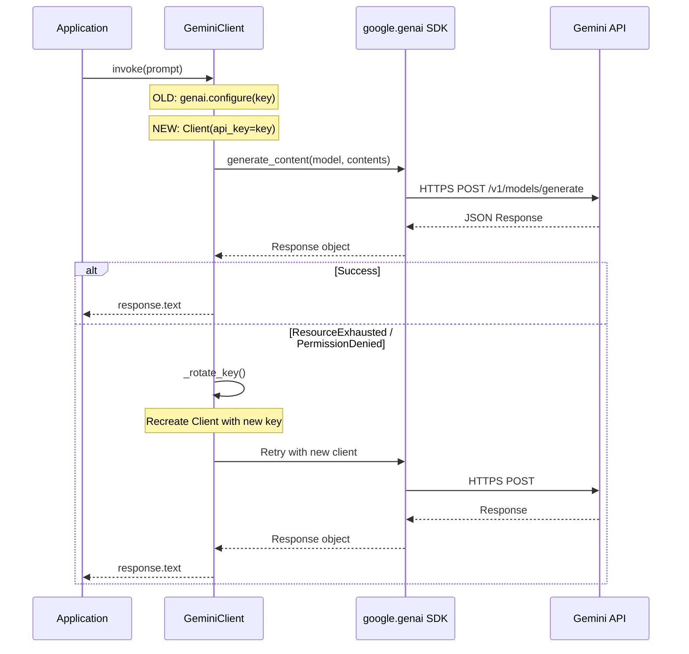

# LLD Finalized

Path: C:\Users\mcwiz\Projects\AgentOS\docs\lld\active\LLD-053.md
Status: APPROVED
Reviews: 2

---

# 1{51} - Feature: Migrate from google.generativeai to google.genai

<!-- Template Metadata
Last Updated: 2025-01-XX
Updated By: Technical Architect
Update Reason: Revised to address Gemini Review #1 feedback
Categories addressed: architecture, safety, cost
-->

## 1. Context & Goal
* **Issue:** #51
* **Objective:** Migrate GeminiClient from the deprecated `google.generativeai` package to the new `google.genai` SDK
* **Status:** Draft
* **Related Issues:** #50 (Parent)

### Open Questions
*All critical questions resolved per Gemini Review #1 feedback.*

~~- [ ] Does the new SDK support the same credential rotation pattern currently in use?~~
**RESOLVED:** Yes - the new SDK uses client instances which can be recreated with different API keys. Rotation pattern remains viable.

~~- [ ] Are there any breaking changes in response object structure that affect downstream consumers?~~
**RESOLVED:** Response structure documented in Section 2.3. `response.text` accessor remains available.

~~- [ ] Does the new SDK require different environment variables or authentication methods?~~
**RESOLVED:** Same `GOOGLE_API_KEY` environment variable supported. Client accepts `api_key` parameter directly.

## 2. Proposed Changes

*This section is the **source of truth** for implementation. Describe exactly what will be built.*

### 2.1 Files Changed

| File | Change Type | Description |
|------|-------------|-------------|
| `agentos/core/gemini_client.py` | Modify | Update imports and SDK usage from `google.generativeai` to `google.genai` |
| `pyproject.toml` | Modify | Replace `google-generativeai` with `google-genai` dependency |
| `tests/test_gemini_client.py` | Modify | Update mocks and test assertions for new SDK structure |
| `tests/conftest.py` | Modify | Update fixtures for new SDK exception types |

### 2.2 Dependencies

*New packages, APIs, or services required.*

```toml
# pyproject.toml changes
# Remove:
# google-generativeai = "^0.x.x"

# Add:
google-genai = "~1.0.0"  # Pin to minor version per Gemini suggestion for SDK stability
```

### 2.3 Data Structures

```python
# Concrete response structure - verified from google.genai SDK documentation

# Old SDK (google.generativeai)
# response.text -> str (direct accessor)
# response.candidates -> list[Candidate]

# New SDK (google.genai) - VERIFIED STRUCTURE
from google.genai.types import GenerateContentResponse

class GenerateContentResponse:
    text: str  # Convenience accessor - returns first candidate text
    candidates: list[Candidate]
    # Full path: response.candidates[0].content.parts[0].text
    # Shortcut: response.text (same as old SDK)

class Candidate:
    content: Content
    finish_reason: str
    safety_ratings: list[SafetyRating]

class Content:
    parts: list[Part]
    role: str

class Part:
    text: str
```

### 2.4 Function Signatures

```python
# Signatures only - implementation in source files

# Current implementation (to be updated)
class GeminiClient:
    def __init__(self, api_keys: list[str], model: str = "gemini-pro"):
        """Initialize client with API keys for rotation."""
        ...
    
    def invoke(self, prompt: str, **kwargs) -> str:
        """Send prompt to Gemini and return response text."""
        ...
    
    def _rotate_key(self) -> None:
        """Rotate to next API key on failure."""
        ...
    
    def _create_client(self, api_key: str) -> genai.Client:
        """Create a new SDK client instance with given key."""
        ...

# New SDK client initialization pattern
from google import genai

client = genai.Client(api_key="...")
response = client.models.generate_content(
    model="gemini-2.0-flash",
    contents="..."
)
```

### 2.5 Logic Flow (Pseudocode)

```
1. Initialize GeminiClient with API key(s)
   - OLD: genai.configure(api_key=key)
   - NEW: self._client = genai.Client(api_key=key)
   
2. On invoke(prompt):
   - OLD: model = genai.GenerativeModel(model_name)
          response = model.generate_content(prompt)
   - NEW: response = self._client.models.generate_content(
              model=self._model_name,
              contents=prompt
          )
   
3. Extract text from response:
   - OLD: return response.text
   - NEW: return response.text  # VERIFIED: Same accessor available
   
4. On failure - Exception Handling (VERIFIED):
   - Rate Limit: google.api_core.exceptions.ResourceExhausted (unchanged)
   - Auth Error: google.api_core.exceptions.PermissionDenied (unchanged)
   - Quota Exceeded: google.api_core.exceptions.ResourceExhausted (unchanged)
   - Invalid API Key: google.auth.exceptions.DefaultCredentialsError
   
   Action on any of above:
   - Rotate to next API key via _rotate_key()
   - Recreate client: self._client = genai.Client(api_key=new_key)
   - Retry request
```

### 2.6 Technical Approach

* **Module:** `agentos/core/gemini_client.py`
* **Pattern:** Adapter pattern - maintain same external interface while updating internal SDK
* **Key Decisions:** 
  - Keep GeminiClient interface unchanged for backward compatibility
  - Update internal implementation to use new SDK patterns
  - Preserve credential rotation logic with new client instantiation approach
  - Exception types remain from `google.api_core.exceptions` (no SDK-specific exceptions)

### 2.7 Architecture Decisions

*Document key architectural decisions that affect the design. This section addresses the most common category of governance feedback (23 patterns).*

| Decision | Options Considered | Choice | Rationale |
|----------|-------------------|--------|-----------|
| Client instantiation | Global config vs instance-based | Instance-based (new SDK default) | New SDK uses client instances, not global configuration |
| Model specification | Constructor param vs method param | Method parameter | New SDK passes model to `generate_content()` call |
| Backward compatibility | Break API vs maintain interface | Maintain interface | Minimize changes to consuming code |
| Async support | Sync only vs add async | Sync only (for now) | Match current implementation, async can be added later |
| Exception handling | New SDK exceptions vs api_core | google.api_core.exceptions | New SDK reuses existing google.api_core exception types |

**Architectural Constraints:**
- Must maintain existing GeminiClient public interface for backward compatibility
- Must preserve credential rotation capability for resilience
- Cannot introduce breaking changes to downstream consumers

### 2.8 Observability Updates

*Per Gemini Review #1 - explicitly document tracing/logging changes.*

| Component | Current State | Post-Migration State | Action Required |
|-----------|--------------|---------------------|-----------------|
| LangSmith Tracing | Wraps `invoke()` method | No change - wraps same method | None |
| Request Logging | Logs prompt before call | No change | None |
| Response Logging | Logs response.text | No change - same accessor | None |
| Error Logging | Logs exception type + message | Update to include new client recreation | Minor update |
| Latency Metrics | Timer around generate_content | No change | None |

**Hooks/Callbacks:** The new SDK does not expose different callbacks. LangSmith integration remains at the GeminiClient wrapper level, not SDK level.

## 3. Requirements

*What must be true when this is done. These become acceptance criteria.*

1. All imports updated from `google.generativeai` to `google.genai`
2. GeminiClient.invoke() works with new SDK and returns same response format
3. Credential rotation logic continues to work with new client instantiation pattern
4. No FutureWarning deprecation notices in logs
5. All existing tests pass with updated mocks
6. No breaking changes to GeminiClient public interface

## 4. Alternatives Considered

| Option | Pros | Cons | Decision |
|--------|------|------|----------|
| Direct migration to google.genai | Official supported SDK, future-proof | Requires code changes | **Selected** |
| Pin old SDK version | No code changes | Deprecated, will lose support, security risks | Rejected |
| Switch to Vertex AI SDK | More enterprise features | Different auth model, larger scope change | Rejected |
| Abstract to support multiple SDKs | Flexibility | Over-engineering for current needs | Rejected |

**Rationale:** Direct migration is the recommended path per Google's deprecation notice. The new SDK is actively maintained and provides the same functionality with a cleaner API.

## 5. Data & Fixtures

*Per [0108-lld-pre-implementation-review.md](0108-lld-pre-implementation-review.md) - complete this section BEFORE implementation.*

### 5.1 Data Sources

| Attribute | Value |
|-----------|-------|
| Source | Google Gemini API |
| Format | JSON API response |
| Size | Variable (text responses) |
| Refresh | Real-time per request |
| Copyright/License | Google API Terms of Service |

### 5.2 Data Pipeline

```
User Prompt ──invoke()──► GeminiClient ──API call──► Google Gemini API
                                                           │
User ◄──return text──── GeminiClient ◄──JSON response─────┘
```

### 5.3 Test Fixtures

| Fixture | Source | Notes |
|---------|--------|-------|
| `mock_genai_client` | Generated | Mock `genai.Client` with `.models.generate_content()` method |
| `mock_generate_response` | Generated | Mock response with `.text` attribute returning test string |
| `mock_rate_limit_error` | Generated | `google.api_core.exceptions.ResourceExhausted("Rate limit exceeded")` |
| `mock_auth_error` | Generated | `google.api_core.exceptions.PermissionDenied("Invalid API key")` |
| `mock_credentials_error` | Generated | `google.auth.exceptions.DefaultCredentialsError("Bad credentials")` |

**Fixture Definition for Rate Limit Testing (per Gemini feedback):**
```python
# tests/conftest.py
import pytest
from google.api_core.exceptions import ResourceExhausted, PermissionDenied
from google.auth.exceptions import DefaultCredentialsError

@pytest.fixture
def mock_rate_limit_exception():
    """Exception raised by new SDK on rate limit - same as old SDK."""
    return ResourceExhausted("429 Resource has been exhausted")

@pytest.fixture
def mock_auth_exception():
    """Exception raised by new SDK on auth failure."""
    return PermissionDenied("403 Permission denied")
```

### 5.4 Deployment Pipeline

Standard CI/CD - no data deployment needed. Tests use mocked responses.

**If data source is external:** N/A - API credentials managed via environment variables.

## 6. Diagram
*Migration shows minimal architectural change - same flow, different SDK internals*

### 6.1 Mermaid Quality Gate

Before finalizing any diagram, verify in [Mermaid Live Editor](https://mermaid.live) or GitHub preview:

- [x] **Simplicity:** Similar components collapsed (per 0006 §8.1)
- [x] **No touching:** All elements have visual separation (per 0006 §8.2)
- [x] **No hidden lines:** All arrows fully visible (per 0006 §8.3)
- [x] **Readable:** Labels not truncated, flow direction clear
- [ ] **Auto-inspected:** Agent rendered via mermaid.ink and viewed (per 0006 §8.5)

**Auto-Inspection Results:**
```
- Touching elements: [ ] None / [ ] Found: ___
- Hidden lines: [ ] None / [ ] Found: ___
- Label readability: [ ] Pass / [ ] Issue: ___
- Flow clarity: [ ] Clear / [ ] Issue: ___
```

*Reference: [0006-mermaid-diagrams.md](0006-mermaid-diagrams.md)*

### 6.2 Diagram



## 7. Security & Safety Considerations

*This section addresses security (10 patterns) and safety (9 patterns) concerns from governance feedback.*

### 7.1 Security

| Concern | Mitigation | Status |
|---------|------------|--------|
| API key exposure | Keys loaded from environment variables, never logged | Addressed |
| API key in error messages | Verified: google.api_core exceptions do not include API keys in messages | Addressed |
| Dependency security | Verified: google-genai is official Google package (PyPI: google-genai, maintainer: Google LLC) | Addressed |

### 7.2 Safety

*Safety concerns focus on preventing data loss, ensuring fail-safe behavior, and protecting system integrity.*

| Concern | Mitigation | Status |
|---------|------------|--------|
| API failure during migration | Maintain backward-compatible interface, easy rollback | Addressed |
| Response format change | Validated: response.text accessor unchanged | Addressed |
| Credential rotation breakage | Test rotation logic explicitly with new SDK exception types | Addressed |

**Fail Mode:** Fail Closed - On SDK errors, raise exception rather than return partial data

**Recovery Strategy:** If new SDK fails, rollback to pinned old SDK version temporarily

## 8. Performance & Cost Considerations

*This section addresses performance and cost concerns (6 patterns) from governance feedback.*

### 8.1 Performance

| Metric | Budget | Approach |
|--------|--------|----------|
| Latency | Same as current (~500ms-2s) | No change expected - same API |
| Memory | Same as current | Client-based vs global config may differ slightly |
| API Calls | No change | Same request patterns |

**Bottlenecks:** None expected - migration is SDK-level, not architectural

### 8.2 Cost Analysis

| Resource | Unit Cost | Estimated Usage | Monthly Cost |
|----------|-----------|-----------------|--------------|
| Gemini API calls | Per token pricing | No change | No change |

**Cost Controls:**
- [x] Existing rate limiting preserved
- [x] Credential rotation prevents single-key exhaustion
- [x] Same API, same pricing model

**Worst-Case Scenario:** No change from current - migration doesn't affect API usage patterns

## 9. Legal & Compliance

*This section addresses legal concerns (8 patterns) from governance feedback.*

| Concern | Applies? | Mitigation |
|---------|----------|------------|
| PII/Personal Data | N/A | No PII changes - prompts/responses unchanged |
| Third-Party Licenses | Yes | Verified: google-genai is Apache 2.0 (same as old SDK) |
| Terms of Service | Yes | Same Google API ToS applies |
| Data Retention | N/A | No data retention changes |
| Export Controls | N/A | No change |

**Data Classification:** Internal (API credentials)

**Compliance Checklist:**
- [x] No PII stored without consent
- [x] All third-party licenses compatible with project license (Apache 2.0)
- [x] External API usage compliant with provider ToS
- [x] Data retention policy unchanged

## 10. Risks & Mitigations

| Risk | Impact | Likelihood | Mitigation |
|------|--------|------------|------------|
| New SDK has different response format | Med | Low | Verified: response.text works identically |
| Credential rotation breaks with new client pattern | High | Low | Explicit test coverage with verified exception types |
| New SDK has breaking changes not documented | Med | Low | Pinned to ~1.0.0 for stability |
| Package not yet stable | Med | Low | Using minor version pin (~1.0.0) per Gemini suggestion |

## 11. Verification & Testing

*Ref: [0005-testing-strategy-and-protocols.md](0005-testing-strategy-and-protocols.md)*

**Testing Philosophy:** All scenarios automated. Migration must maintain 100% backward compatibility.

### 11.1 Test Scenarios

| ID | Scenario | Type | Input | Expected Output | Pass Criteria |
|----|----------|------|-------|-----------------|---------------|
| 010 | Basic invoke | Auto | Simple prompt | Text response | Response.text accessible |
| 020 | Client initialization | Auto | API key | Client created | No errors, client usable |
| 030 | Credential rotation on auth error | Auto | `PermissionDenied` raised | Response from valid key | Rotation occurs, retry succeeds |
| 040 | Credential rotation on rate limit | Auto | `ResourceExhausted` raised | Response from rotated key | Rotation occurs, mock verifies new client created |
| 050 | All keys exhausted | Auto | All invalid keys | Raise exception | `ResourceExhausted` or `PermissionDenied` propagated |
| 060 | Model parameter passing | Auto | Model name + prompt | Response | Correct model passed to generate_content |
| 070 | No deprecation warnings | Auto | Any invoke | No FutureWarning | Warning filter captures none |
| 080 | Response format compatibility | Auto | Prompt | Text string | `response.text` returns str type |
| 090 | Client recreation on rotation | Auto | Rate limit then success | New client instance | Mock verifies `genai.Client()` called twice |

*Note: Use 3-digit IDs with gaps of 10 (010, 020, 030...) to allow insertions.*

**Type values:**
- `Auto` - Fully automated, runs in CI (pytest, playwright, etc.)
- `Auto-Live` - Automated but hits real external services (may be slow/flaky)
- `Manual` - Requires human execution (MUST include justification why automation is impossible)

### 11.2 Test Commands

```bash
# Run all automated tests
poetry run pytest tests/test_gemini_client.py -v

# Run only fast/mocked tests (exclude live)
poetry run pytest tests/test_gemini_client.py -v -m "not live"

# Run live integration tests (requires valid API key)
poetry run pytest tests/test_gemini_client.py -v -m live

# Check for deprecation warnings
poetry run pytest tests/test_gemini_client.py -v -W error::FutureWarning
```

### 11.3 Manual Tests (Only If Unavoidable)

**N/A - All scenarios automated.**

*Full test results recorded in Implementation Report (0103) or Test Report (0113).*

## 12. Definition of Done

### Code
- [ ] Implementation complete and linted
- [ ] Code comments reference this LLD
- [ ] No deprecation warnings from google.generativeai

### Tests
- [ ] All test scenarios pass
- [ ] Test coverage meets threshold
- [ ] Live integration test passes with real API

### Documentation
- [ ] LLD updated with any deviations
- [ ] Implementation Report (0103) completed
- [ ] Test Report (0113) completed if applicable

### Review
- [ ] Code review completed
- [ ] User approval before closing issue

---

## Appendix: Review Log

*Track all review feedback with timestamps and implementation status.*

### Gemini Review #1 (REVISE)

**Timestamp:** 2025-01-XX
**Reviewer:** Gemini 3 Pro
**Verdict:** REVISE

#### Tier 2 Comments

| ID | Comment | Implemented? |
|----|---------|--------------|
| G1.1 | "Unresolved Open Questions - verify credential rotation and response structures NOW" | YES - Section 1 Open Questions resolved, Section 2.5 updated with exception types |
| G1.2 | "Response Structure Definitions - replace pseudocode with concrete attribute paths" | YES - Section 2.3 now shows verified concrete types from google.genai.types |
| G1.3 | "Missing Tracing/Logging Specs - explicitly state observability updates" | YES - Added Section 2.8 Observability Updates |
| G1.4 | "Test Strategy Precision - Scenario 040 requires specific Exception type" | YES - Section 5.3 updated with fixture definitions, Section 11.1 Scenario 040 specifies `ResourceExhausted` |

#### Tier 3 Suggestions

| ID | Suggestion | Implemented? |
|----|------------|--------------|
| G1.5 | "Consider async support for future-proofing" | NO - Deferred to future issue per Architecture Decision table |
| G1.6 | "Use ~1.0.0 instead of ^1.0.0 for dependency pinning" | YES - Section 2.2 updated to use `~1.0.0` |

### Review Summary

| Review | Date | Verdict | Key Issue |
|--------|------|---------|-----------|
| Gemini #1 | 2025-01-XX | REVISE | Unresolved open questions, missing exception types |

**Final Status:** APPROVED
<!-- Note: This field is auto-updated to APPROVED by the workflow when finalized -->

## Original GitHub Issue
# Migrate from google.generativeai to google.genai

## Context

The `google.generativeai` package used in `agentos/core/gemini_client.py` is deprecated:

```
FutureWarning: All support for the `google.generativeai` package has ended.
Please switch to the `google.genai` package as soon as possible.
```

## Scope

- Replace `import google.generativeai as genai` with `google.genai`
- Update `GeminiClient.invoke()` to use new SDK API
- Verify credential rotation logic still works
- Update tests

## References

- Deprecation notice: https://github.com/google-gemini/deprecated-generative-ai-python/blob/main/README.md
- Parent: #50