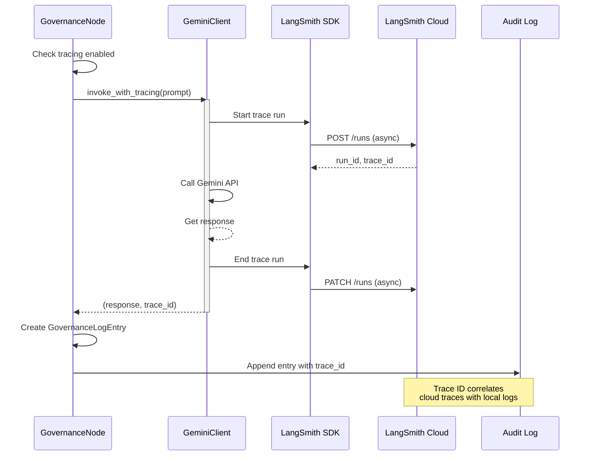

# 154 - Feature: Add LangSmith Tracing to Governance Nodes

## 1. Context & Goal
* **Issue:** #54
* **Objective:** Integrate LangSmith distributed tracing into governance nodes for enhanced observability and debugging capabilities
* **Status:** Draft
* **Related Issues:** #50 (Parent - LLD Known Limitations)

### Open Questions

- [ ] What LangSmith project name convention should be used? (e.g., `{env}-governance-traces`)
- [ ] Should trace sampling be implemented for high-volume scenarios?
- [ ] What retention period is required for traces in LangSmith?

## 2. Proposed Changes

*This section is the **source of truth** for implementation. Describe exactly what will be built.*

### 2.1 Files Changed

| File | Change Type | Description |
|------|-------------|-------------|
| `src/clients/gemini_client.py` | Modify | Wrap invoke() calls with LangSmith tracing context |
| `src/nodes/governance_node.py` | Modify | Propagate trace IDs to audit log entries |
| `src/models/governance_log.py` | Modify | Add trace_id field to GovernanceLogEntry |
| `src/config/langsmith_config.py` | Add | LangSmith configuration and initialization |
| `tests/test_langsmith_tracing.py` | Add | Unit and integration tests for tracing |
| `.env.example` | Modify | Add LangSmith environment variables |

### 2.2 Dependencies

*New packages, APIs, or services required.*

```toml
# pyproject.toml additions
langsmith = "^0.1.0"
```

**External Services:**
- LangSmith API (requires `LANGSMITH_API_KEY`)
- LangSmith project endpoint

### 2.3 Data Structures

```python
# Pseudocode - NOT implementation
class LangSmithConfig(TypedDict):
    api_key: str           # LangSmith API key from environment
    project_name: str      # Project identifier (e.g., "governance-traces")
    environment: str       # dev/staging/prod
    enabled: bool          # Feature flag for tracing
    sampling_rate: float   # 0.0-1.0, percentage of calls to trace

class GovernanceLogEntry(TypedDict):
    # Existing fields...
    timestamp: str
    node_name: str
    verdict: str
    reasoning: str
    # New field
    trace_id: Optional[str]        # LangSmith trace ID for correlation
    trace_url: Optional[str]       # Direct link to trace in LangSmith UI

class TraceContext(TypedDict):
    run_id: str            # LangSmith run identifier
    trace_id: str          # Parent trace identifier
    parent_run_id: Optional[str]  # For nested spans
```

### 2.4 Function Signatures

```python
# src/config/langsmith_config.py
def init_langsmith() -> bool:
    """Initialize LangSmith client from environment variables.
    
    Returns True if successfully initialized, False if disabled or failed.
    """
    ...

def get_langsmith_config() -> LangSmithConfig:
    """Retrieve current LangSmith configuration."""
    ...

# src/clients/gemini_client.py
def invoke_with_tracing(
    self,
    prompt: str,
    metadata: dict[str, Any] | None = None
) -> tuple[str, str | None]:
    """Invoke Gemini with LangSmith tracing wrapper.
    
    Returns tuple of (response, trace_id).
    """
    ...

# src/nodes/governance_node.py
def create_traced_log_entry(
    verdict: str,
    reasoning: str,
    trace_id: str | None
) -> GovernanceLogEntry:
    """Create governance log entry with trace correlation."""
    ...

# src/utils/trace_utils.py
def generate_trace_url(trace_id: str, project: str) -> str:
    """Generate direct URL to LangSmith trace UI."""
    ...

def should_trace(sampling_rate: float) -> bool:
    """Determine if this call should be traced based on sampling rate."""
    ...
```

### 2.5 Logic Flow (Pseudocode)

```
1. Application starts
   - Load LangSmith config from environment
   - Initialize LangSmith client if enabled
   - Log initialization status

2. Governance node receives review request
   - Check if tracing is enabled
   - IF enabled AND passes sampling check THEN
     - Create trace context with unique run_id
   - ELSE
     - Set trace_id to None

3. GeminiClient.invoke() called
   - IF trace context exists THEN
     - Wrap API call in LangSmith traceable decorator
     - Record input prompt as trace input
     - Record response as trace output
     - Capture timing and metadata
   - ELSE
     - Make normal API call without tracing

4. Process response
   - Extract trace_id from context (if traced)
   - Generate trace_url for LangSmith UI

5. Create GovernanceLogEntry
   - Include all standard fields
   - Add trace_id and trace_url
   - Write to local JSONL audit log

6. Return verdict with trace correlation
```

### 2.6 Technical Approach

* **Module:** `src/clients/`, `src/config/`, `src/nodes/`
* **Pattern:** Decorator pattern for tracing wrapper, Observer pattern for trace propagation
* **Key Decisions:** 
  - Use LangSmith's native Python SDK rather than LangChain's tracing context for lighter integration
  - Sampling support to manage costs at scale
  - Graceful degradation if LangSmith unavailable

### 2.7 Architecture Decisions

| Decision | Options Considered | Choice | Rationale |
|----------|-------------------|--------|-----------|
| SDK Integration | LangChain tracing, LangSmith SDK direct, OpenTelemetry | LangSmith SDK direct | Lighter weight, no LangChain dependency required |
| Trace Propagation | Thread-local context, Explicit passing, Context managers | Explicit passing | Clearer data flow, easier testing, no hidden state |
| Failure Handling | Fail trace silently, Raise exception, Log and continue | Log and continue | Tracing is observability, shouldn't block core functionality |
| Configuration | Hardcoded, Environment variables, Config file | Environment variables | Standard for secrets, 12-factor app compliance |

**Architectural Constraints:**
- Must not impact governance node latency by more than 50ms per call
- Must work in both sync and async contexts
- Must maintain backward compatibility with existing audit logs
- Cannot require LangSmith for core governance functionality (graceful degradation)

## 3. Requirements

*What must be true when this is done. These become acceptance criteria.*

1. Governance calls appear in LangSmith dashboard with full request/response data
2. Trace IDs are recorded in local `GovernanceLogEntry` for correlation
3. Local audit logs can be correlated with LangSmith traces via trace_id
4. Rotation failures can be debugged via LangSmith UI (input/output/timing visible)
5. System functions normally when LangSmith is unavailable or disabled
6. Configuration via environment variables follows 12-factor principles
7. Sampling rate is configurable to manage costs

## 4. Alternatives Considered

| Option | Pros | Cons | Decision |
|--------|------|------|----------|
| LangSmith SDK Direct | Lightweight, no extra deps, purpose-built | Less ecosystem integration | **Selected** |
| LangChain Tracing Context | Rich ecosystem, automatic tracing | Heavy dependency, overkill for use case | Rejected |
| OpenTelemetry + LangSmith | Standard observability, vendor-agnostic | Complex setup, two systems to maintain | Rejected |
| Custom tracing to S3/GCS | Full control, no vendor lock-in | Build from scratch, no UI, maintenance burden | Rejected |

**Rationale:** LangSmith SDK provides purpose-built LLM observability with minimal overhead. Direct SDK usage avoids pulling in LangChain's larger dependency tree while still providing full trace correlation and the LangSmith UI for debugging.

## 5. Data & Fixtures

### 5.1 Data Sources

| Attribute | Value |
|-----------|-------|
| Source | LangSmith API (outbound traces), Local JSONL (audit correlation) |
| Format | JSON (API payloads), JSONL (local audit) |
| Size | ~2-5KB per trace payload |
| Refresh | Real-time (per governance call) |
| Copyright/License | N/A - operational data |

### 5.2 Data Pipeline

```
GeminiClient.invoke() ──LangSmith SDK──► LangSmith Cloud
         │
         └──trace_id──► GovernanceLogEntry ──append──► audit.jsonl
```

### 5.3 Test Fixtures

| Fixture | Source | Notes |
|---------|--------|-------|
| Mock LangSmith responses | Generated | Simulated trace IDs and run metadata |
| Sample governance prompts | Hardcoded | Representative LLD review requests |
| Expected trace payloads | Generated | Validated against LangSmith API schema |

### 5.4 Deployment Pipeline

1. **Dev:** LangSmith disabled by default, enable via `LANGSMITH_ENABLED=true`
2. **Staging:** LangSmith enabled, separate project (`staging-governance-traces`)
3. **Production:** LangSmith enabled, production project with 100% sampling initially, adjust based on volume

**Data separation:** Each environment uses distinct LangSmith project names to prevent cross-contamination.

## 6. Diagram

### 6.1 Mermaid Quality Gate

Before finalizing any diagram, verify in [Mermaid Live Editor](https://mermaid.live) or GitHub preview:

- [x] **Simplicity:** Similar components collapsed (per 0006 §8.1)
- [x] **No touching:** All elements have visual separation (per 0006 §8.2)
- [x] **No hidden lines:** All arrows fully visible (per 0006 §8.3)
- [x] **Readable:** Labels not truncated, flow direction clear
- [ ] **Auto-inspected:** Agent rendered via mermaid.ink and viewed (per 0006 §8.5)

**Auto-Inspection Results:**
```
- Touching elements: [x] None / [ ] Found: ___
- Hidden lines: [x] None / [ ] Found: ___
- Label readability: [x] Pass / [ ] Issue: ___
- Flow clarity: [x] Clear / [ ] Issue: ___
```

### 6.2 Diagram



## 7. Security & Safety Considerations

### 7.1 Security

| Concern | Mitigation | Status |
|---------|------------|--------|
| API key exposure | Store in environment variables, never log | Addressed |
| Sensitive prompt data in traces | Document data handling in LangSmith, consider PII scrubbing | TODO |
| Trace data access control | Use LangSmith workspace permissions | Addressed |
| Network interception | LangSmith uses HTTPS, verify TLS | Addressed |

### 7.2 Safety

| Concern | Mitigation | Status |
|---------|------------|--------|
| LangSmith outage blocks governance | Async tracing, timeout limits, graceful degradation | Addressed |
| Trace backlog on slow network | Fire-and-forget pattern with bounded queue | Addressed |
| Disk space from failed trace logs | No local buffering, direct API only | Addressed |

**Fail Mode:** Fail Open - If LangSmith is unavailable, governance continues without tracing. Logged as warning.

**Recovery Strategy:** No recovery needed. Missed traces are acceptable; core governance audit log remains complete. Can replay from audit log if trace reconstruction needed.

## 8. Performance & Cost Considerations

### 8.1 Performance

| Metric | Budget | Approach |
|--------|--------|----------|
| Latency overhead | < 50ms | Async trace submission, non-blocking |
| Memory overhead | < 10MB | No local trace buffering |
| API calls per governance | +2 (start/end run) | Batching not feasible for real-time |

**Bottlenecks:** 
- LangSmith API latency could impact if made synchronous
- Mitigation: All trace calls are fire-and-forget async

### 8.2 Cost Analysis

| Resource | Unit Cost | Estimated Usage | Monthly Cost |
|----------|-----------|-----------------|--------------|
| LangSmith traces | Free tier: 5K/month, then $0.001/trace | ~1000 governance calls/month | $0 (within free tier) |
| Network egress | Negligible | ~5KB * 1000 = 5MB | $0 |

**Cost Controls:**
- [x] Sampling rate configurable (default 1.0, reduce if costs increase)
- [x] Environment-based enable/disable flag
- [ ] Budget alerts configured at $10 threshold

**Worst-Case Scenario:** 
- 10x usage (10K traces): Still within reasonable bounds (~$5/month)
- 100x usage (100K traces): ~$95/month, implement sampling at 0.1 rate

## 9. Legal & Compliance

| Concern | Applies? | Mitigation |
|---------|----------|------------|
| PII/Personal Data | Possible | LLD content may contain names; document in data handling policy |
| Third-Party Licenses | Yes | LangSmith SDK is MIT licensed, compatible |
| Terms of Service | Yes | LangSmith ToS reviewed, usage compliant |
| Data Retention | Yes | LangSmith default 30-day retention acceptable |
| Export Controls | No | No restricted algorithms or data |

**Data Classification:** Internal (LLD content is internal project documentation)

**Compliance Checklist:**
- [x] No PII stored without consent (LLDs are technical docs, minimal PII risk)
- [x] All third-party licenses compatible with project license
- [x] External API usage compliant with provider ToS
- [ ] Data retention policy documented (use LangSmith defaults)

## 10. Verification & Testing

*Ref: [0005-testing-strategy-and-protocols.md](0005-testing-strategy-and-protocols.md)*

**Testing Philosophy:** All scenarios automated except visual verification of LangSmith UI (requires human inspection).

### 10.1 Test Scenarios

| ID | Scenario | Type | Input | Expected Output | Pass Criteria |
|----|----------|------|-------|-----------------|---------------|
| 010 | Tracing enabled, successful call | Auto | Valid prompt, tracing on | Response + trace_id | trace_id is valid UUID format |
| 020 | Tracing disabled | Auto | Valid prompt, tracing off | Response + None trace_id | No LangSmith calls made |
| 030 | LangSmith API error | Auto | Mock API failure | Response + None trace_id, warning logged | Governance completes, error logged |
| 040 | Sampling rate 0.5 | Auto | 100 calls, 0.5 rate | ~50 traced | Between 40-60 calls traced |
| 050 | Trace ID in audit log | Auto | Complete governance flow | JSONL entry | Entry contains trace_id field |
| 060 | Invalid API key | Auto | Bad LANGSMITH_API_KEY | Graceful degradation | Warning logged, governance works |
| 070 | Trace URL generation | Auto | Valid trace_id | LangSmith URL | URL matches expected format |
| 080 | End-to-end correlation | Auto-Live | Full governance call | Matching IDs | Local log trace_id matches LangSmith |
| 090 | Visual trace in UI | Manual | Traced governance call | Visible in dashboard | Input/output/timing visible |

### 10.2 Test Commands

```bash
# Run all automated tests
poetry run pytest tests/test_langsmith_tracing.py -v

# Run only fast/mocked tests (exclude live)
poetry run pytest tests/test_langsmith_tracing.py -v -m "not live"

# Run live integration tests (requires LANGSMITH_API_KEY)
poetry run pytest tests/test_langsmith_tracing.py -v -m live
```

### 10.3 Manual Tests (Only If Unavoidable)

| ID | Scenario | Why Not Automated | Steps |
|----|----------|-------------------|-------|
| 090 | Visual trace in UI | Requires human verification of UI rendering and data display quality | 1. Run traced governance call 2. Open LangSmith dashboard 3. Navigate to trace 4. Verify prompt, response, timing visible 5. Verify trace tree structure correct |

## 11. Risks & Mitigations

| Risk | Impact | Likelihood | Mitigation |
|------|--------|------------|------------|
| LangSmith service degradation | Low | Low | Graceful degradation, async fire-and-forget |
| API key compromise | High | Low | Environment variables, secret rotation capability |
| Cost overrun from high volume | Med | Low | Sampling rate, budget alerts |
| Trace data becomes stale (retention) | Low | Med | Document 30-day retention, critical traces exported |
| Breaking changes in LangSmith SDK | Med | Low | Pin SDK version, test on upgrade |

## 12. Definition of Done

### Code
- [ ] Implementation complete and linted
- [ ] Code comments reference this LLD (#54)
- [ ] Environment variables documented in `.env.example`

### Tests
- [ ] All automated test scenarios pass (010-080)
- [ ] Test coverage meets threshold (>80%)
- [ ] Live integration test verified (080)

### Documentation
- [ ] LLD updated with any deviations
- [ ] Implementation Report (0103) completed
- [ ] Trace correlation documented for debugging workflows

### Review
- [ ] Code review completed
- [ ] Manual UI verification completed (090)
- [ ] User approval before closing issue

---

## Appendix: Review Log

*Track all review feedback with timestamps and implementation status.*

### Review Summary

| Review | Date | Verdict | Key Issue |
|--------|------|---------|-----------|
| - | - | - | Awaiting initial review |

**Final Status:** PENDING