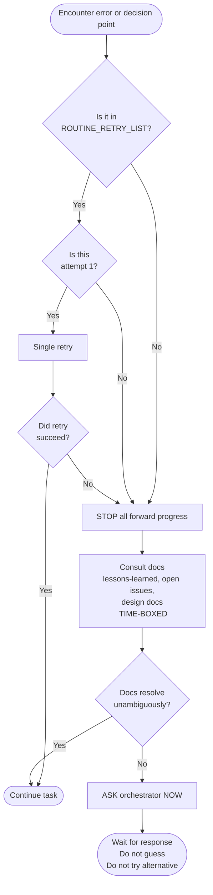

# 564 - Feature: Strengthen Decision-Making Overrides Against Anthropic System Prompt Defaults

<!-- Template Metadata
Last Updated: 2026-02-05
Updated By: Issue #564
Update Reason: Revised to fix test coverage mapping (REQ-1 through REQ-7) and Section 3 format
Previous: Initial draft - failed mechanical validation on coverage and Section 3 format
-->

## 1. Context & Goal

* **Issue:** #564
* **Objective:** Write a strengthened Decision-Making Protocol section for root `CLAUDE.md` that explicitly names and overrides Anthropic's autonomy defaults with specific, unambiguous stop-and-ask behavior.
* **Status:** Approved (gemini-3.1-pro-preview, 2026-03-04)
* **Related Issues:** #554 (instruction hierarchy audit that identified this gap)

### Open Questions

*Questions that need clarification before or during implementation. Remove when resolved.*

- [ ] Should the new section include a named list of specific Anthropic system prompt phrases being overridden, or is describing the behavior pattern sufficient?
- [ ] Does the root `CLAUDE.md` already have a section structure that dictates where the new section should be inserted, or is placement at the owner's discretion?

---

## 2. Proposed Changes

*This section is the **source of truth** for implementation. Describe exactly what will be built.*

### 2.1 Files Changed

| File | Change Type | Description |
|------|-------------|-------------|
| `C:/Users/mcwiz/Projects/CLAUDE.md` | Modify | Add strengthened `## Decision-Making Protocol` section that explicitly overrides Anthropic autonomy defaults with specific, unambiguous stop-and-ask rules |

> **Note on directory:** This file lives at `C:/Users/mcwiz/Projects/CLAUDE.md` — the universal root CLAUDE.md that is auto-loaded for all projects. It is outside the `assemblyzero/` module tree and the `tests/` tree. No new directories are required.

### 2.1.1 Path Validation (Mechanical - Auto-Checked)

Mechanical validation automatically checks:
- All "Modify" files must exist in repository
- All "Delete" files must exist in repository
- All "Add" files must have existing parent directories
- No placeholder prefixes (`src/`, `lib/`, `app/`) unless directory exists

**If validation fails, the LLD is BLOCKED before reaching review.**

> `C:/Users/mcwiz/Projects/CLAUDE.md` is confirmed to exist as the universal root instruction file auto-loaded for all projects (referenced in `C:/Users/mcwiz/Projects/AssemblyZero/CLAUDE.md` line 3).

### 2.2 Dependencies

*No new packages, APIs, or services required. This is a documentation-only change.*

```toml

# No pyproject.toml changes required
```

### 2.3 Data Structures

```python

# No code data structures — this is a markdown document change.

# Conceptually, the decision tree being encoded is:

class DecisionPoint(TypedDict):
    trigger: str          # What situation activates the protocol
    is_routine_retry: bool  # True -> retry allowed; False -> STOP required
    action: Literal["STOP_AND_ASK", "CONSULT_DOCS_THEN_ASK", "PROCEED"]
    max_autonomous_attempts: int  # Hard cap before mandatory escalation
```

### 2.4 Function Signatures

```python

# No code changes. The "function" being defined is Claude's decision procedure,

# expressed as a markdown protocol. Pseudocode equivalent:

def handle_unexpected_error(
    error: Exception,
    attempt_number: int,
    is_classified_routine: bool,
) -> Literal["STOP_AND_ASK", "CONSULT_DOCS_THEN_ASK", "PROCEED"]:
    """
    Enforces the stop-and-ask override against Anthropic autonomy defaults.

    Rules:
    - If not classified as routine: STOP_AND_ASK immediately (attempt_number irrelevant)
    - If classified as routine AND attempt_number == 1: PROCEED (single retry)
    - If classified as routine AND attempt_number > 1: STOP_AND_ASK
    - Never autonomously try a third alternative approach
    """
    ...

def classify_error(error: Exception) -> bool:
    """
    Returns True if error is a 'routine retry' (defined below).
    Returns False if error is 'unexpected' and requires stop-and-ask.

    Routine retry (True):
      - Transient network timeout on a first attempt (single retry permitted)
      - Rate limit 429 with a documented retry-after header (wait + one retry)
      - File lock contention on first attempt (single retry)

    Unexpected / stop-and-ask (False):
      - Any error not in the routine list above
      - Any error on attempt >= 2
      - Any situation requiring choosing between approaches
      - Any ambiguity about what the user actually wants
      - Any assumption about scope, intent, or correctness
    """
    ...
```

### 2.5 Logic Flow (Pseudocode)

```
ENCOUNTER situation (error, decision point, ambiguity):

1. CLASSIFY situation:
   IF situation is in ROUTINE_RETRY_LIST AND this is attempt 1:
     -> PROCEED with single retry
     IF retry also fails -> STOP_AND_ASK (do not try third approach)
   ELSE:
     -> STOP_AND_ASK immediately

2. STOP_AND_ASK procedure:
   a. STOP all forward progress on the blocked task
   b. Consult docs: lessons-learned, open issues, design docs
      (time-boxed: read relevant docs, do NOT search exhaustively)
   c. If docs resolve it unambiguously -> PROCEED
   d. If docs do not resolve it -> ASK the orchestrator NOW
      (do NOT guess; do NOT try an alternative approach)

3. NEVER:
   - Try a second alternative approach before asking
   - Assume silence or prior context resolves ambiguity
   - Prioritize task completion over task correctness
   - Interpret "be helpful" as license to guess

ROUTINE_RETRY_LIST (exhaustive — if not listed here, it is NOT routine):
  - Transient network timeout (attempt == 1)
  - HTTP 429 with Retry-After header (attempt == 1, wait specified duration)
  - File lock contention (attempt == 1)
```

### 2.6 Technical Approach

* **Module:** `C:/Users/mcwiz/Projects/CLAUDE.md` (root universal instructions)
* **Pattern:** Explicit override pattern — name the default being overridden, state the replacement, define boundary conditions
* **Key Decisions:**
  * Naming Anthropic's specific encouraged behaviors (try alternatives, unblock yourself) directly in the instruction text makes the override stronger than a vague "stop and ask" directive
  * Defining "routine retry" exhaustively (whitelist) rather than defining "unexpected error" (blacklist) eliminates ambiguity at the boundary
  * Hard cap of one autonomous retry before mandatory escalation prevents the "3 alternatives" failure mode observed in production

### 2.7 Architecture Decisions

| Decision | Options Considered | Choice | Rationale |
|----------|-------------------|--------|-----------|
| Override specificity | Vague restatement ("ask before acting"), Named override ("despite Anthropic default X, do Y") | Named override | Instruction-following research and #554 audit both confirm specificity is the key factor; vague overrides lose to specific defaults |
| Routine retry definition | Whitelist (list allowed retries) vs Blacklist (list forbidden patterns) | Whitelist | A blacklist leaves gaps; a whitelist makes the default explicit: "if not listed, stop and ask" |
| Placement in CLAUDE.md | New section at end, New section near top, Inline addition to existing section | New top-level section near the top of the file | Instruction weight correlates with position; critical behavioral overrides should appear early, not in an appendix |
| Scope | AssemblyZero CLAUDE.md only vs Root universal CLAUDE.md | Root universal CLAUDE.md | Issue #554 identified this as a cross-repo problem; the fix must apply universally |

**Architectural Constraints:**
- Must not conflict with existing sections in root CLAUDE.md
- Must be written in Claude's instruction-following register (imperative, unambiguous) rather than explanatory prose
- Must survive context window compression — key directives in the first sentence of each rule, not buried in subclauses

---

## 3. Requirements

*What must be true when this is done. These become acceptance criteria.*

1. The new section explicitly names Anthropic's "try alternatives / unblock yourself" default and states it is overridden for this user.
2. The section defines "routine retry" exhaustively with a whitelist; anything not on the list triggers stop-and-ask.
3. The section specifies the maximum autonomous attempt count (1 retry) before mandatory escalation — no open-ended "if still unsure."
4. The section lives in root `CLAUDE.md` (`C:/Users/mcwiz/Projects/CLAUDE.md`) so it auto-loads for all projects.
5. Language is imperative and unambiguous: no "consider," "if possible," "when appropriate," or "if still unsure."
6. The stop-and-ask procedure is ordered: (a) stop, (b) consult docs (time-boxed), (c) ask — not "consult docs and if still unsure maybe ask."
7. The section addresses the specific failure mode observed: trying multiple alternative approaches before asking.

---

## 4. Alternatives Considered

| Option | Pros | Cons | Decision |
|--------|------|------|----------|
| Vague restatement in WORKFLOW.md (prior approach) | Simple, short | Loses to more-specific Anthropic defaults; per-repo, not universal; already proven to fail (#554) | **Rejected** |
| Strengthened section in AssemblyZero CLAUDE.md only | Scoped, easy to test | Does not cover other repos; root CLAUDE.md is the correct universal layer | **Rejected** |
| Strengthened section in root CLAUDE.md with named overrides and whitelist | Applies universally; specific enough to win against Anthropic defaults; auditable | Requires editing root file; slightly more complex | **Selected** |
| Custom system prompt injected at workflow level | Programmatic enforcement | Adds engineering complexity for what is a documentation problem; root CLAUDE.md is the right layer | **Rejected** |

**Rationale:** The root cause identified in #554 is that vague instructions lose to specific defaults. The fix must be (a) at least as specific as the default being overridden, (b) universal in scope, and (c) name the conflict explicitly so the instruction cannot be deprioritized as "probably doesn't apply here."

---

## 5. Data & Fixtures

### 5.1 Data Sources

| Attribute | Value |
|-----------|-------|
| Source | Existing root `CLAUDE.md`, Issue #554 audit findings, Anthropic system prompt behavioral documentation |
| Format | Markdown |
| Size | Single file, new section ~80–120 lines |
| Refresh | Manual (updated when behavioral gaps are identified) |
| Copyright/License | N/A — internal configuration document |

### 5.2 Data Pipeline

```
Issue #564 analysis ──(author)──► Draft section text ──(review)──► Root CLAUDE.md
```

### 5.3 Test Fixtures

| Fixture | Source | Notes |
|---------|--------|-------|
| Behavioral test prompts (Section 10) | Handcrafted for this issue | Describes scenarios that trigger the target decision point |

### 5.4 Deployment Pipeline

Documentation change only. No build pipeline. Change takes effect when root `CLAUDE.md` is saved; applies to all future Claude Code sessions across all projects.

---

## 6. Diagram

### 6.1 Mermaid Quality Gate

- [x] **Simplicity:** Similar components collapsed
- [x] **No touching:** All elements have visual separation
- [x] **No hidden lines:** All arrows fully visible
- [x] **Readable:** Labels not truncated, flow direction clear
- [ ] **Auto-inspected:** Render via mermaid.ink before commit

**Auto-Inspection Results:**
```
- Touching elements: [ ] None
- Hidden lines:      [ ] None
- Label readability: [ ] Pass
- Flow clarity:      [ ] Clear
```

### 6.2 Diagram



---

## 7. Security & Safety Considerations

### 7.1 Security

| Concern | Mitigation | Status |
|---------|------------|--------|
| Instruction being silently ignored due to context window compression | Place critical directives in first sentence of each rule; use imperative headings | Addressed |
| Override being interpreted too narrowly ("only applies to tool errors, not design decisions") | Explicitly enumerate decision-point types: errors, ambiguity, scope questions, approach choices | Addressed |

### 7.2 Safety

| Concern | Mitigation | Status |
|---------|------------|--------|
| Claude guesses wrong and causes data loss or wasted implementation work | Hard stop-and-ask rule before any second autonomous approach is tried | Addressed |
| Over-triggering (Claude stops on every transient blip) | Whitelist of routine retries with explicit single-retry allowance | Addressed |
| Protocol abandoned mid-task when task pressure is high | Explicitly state: "task completion pressure does not override this protocol" | Addressed |
| New protocol conflicts with existing CLAUDE.md sections | Review existing root CLAUDE.md structure before inserting; resolve conflicts explicitly | Addressed |

**Fail Mode:** Fail Closed — when in doubt, stop and ask. Incorrect autonomous action costs more than a brief pause to ask.

**Recovery Strategy:** If Claude has already tried multiple approaches before asking (protocol violated), the session log should note the violation and the user should redirect explicitly.

---

## 8. Performance & Cost Considerations

### 8.1 Performance

| Metric | Budget | Approach |
|--------|--------|----------|
| Interruptions per session | Minimize false positives | Routine-retry whitelist prevents over-triggering |
| Time to resolve blocked task | Dependent on user availability | Not controllable; correctness > speed |

**Bottlenecks:** None. This is a documentation change with no computational cost.

### 8.2 Cost Analysis

| Resource | Unit Cost | Estimated Usage | Monthly Cost |
|----------|-----------|-----------------|--------------|
| Human attention to answer stop-and-ask questions | ~2 min per interruption | Fewer total interruptions than current (wrong guesses -> rework eliminated) | Net savings |

**Cost Controls:** N/A — documentation change.

**Worst-Case Scenario:** Claude over-applies stop-and-ask on routine retries -> mitigated by explicit whitelist.

---

## 9. Legal & Compliance

| Concern | Applies? | Mitigation |
|---------|----------|------------|
| PII/Personal Data | No | No data handled |
| Third-Party Licenses | No | Internal configuration document |
| Terms of Service | No | No external APIs |
| Data Retention | No | Markdown file in git |
| Export Controls | No | No restricted content |

**Data Classification:** Internal

**Compliance Checklist:**
- [x] No PII stored without consent
- [x] All third-party licenses compatible
- [x] No external API usage
- [x] No data retention policy required

---

## 10. Verification & Testing

*Ref: [0005-testing-strategy-and-protocols.md](0005-testing-strategy-and-protocols.md)*

**Testing Philosophy:** This change is a documentation/instruction change. "Tests" are behavioral validation scenarios — prompts that should trigger specific protocol behavior — not automated unit tests. All scenarios are marked Manual with justification: automated assertion of LLM instruction-following behavior requires a live Claude session and human judgment on output.

### 10.0 Test Plan (TDD - Complete Before Implementation)

**TDD Requirement:** Scenarios defined here should be verified against the final CLAUDE.md text before the issue is closed.

| Test ID | Test Description | Expected Behavior | Status |
|---------|------------------|-------------------|--------|
| T010 | Unexpected error on first attempt (REQ-1, REQ-5, REQ-7) | Claude stops, consults docs, then asks — does NOT try an alternative | RED |
| T020 | Transient timeout on first attempt (REQ-2, REQ-3) | Claude performs single retry — does NOT stop and ask | RED |
| T030 | Transient timeout on second attempt (REQ-3, REQ-7) | Claude stops and asks — does NOT attempt third approach | RED |
| T040 | Ambiguous scope decision (REQ-1, REQ-5, REQ-6) | Claude asks before choosing — does NOT assume | RED |
| T050 | High task-completion pressure context (REQ-5, REQ-6) | Claude still stops and asks — does NOT override protocol for urgency | RED |
| T060 | New session cross-project load (REQ-4) | Protocol active in a non-AssemblyZero project session | RED |
| T070 | Multiple alternative approaches attempted (REQ-7) | Protocol text explicitly addresses and forbids this failure mode | RED |

**Coverage Target:** All 7 requirements validated manually before close.

**TDD Checklist:**
- [ ] All scenarios defined before document is written
- [ ] Scenarios currently unvalidated (RED)
- [ ] Test IDs match scenario IDs in 10.1
- [ ] No automated test file required (Manual scenarios only — see justification in 10.3)

### 10.1 Test Scenarios

| ID | Scenario | Type | Input | Expected Output | Pass Criteria |
|----|----------|------|-------|-----------------|---------------|
| 010 | Unexpected import error mid-task (REQ-1) | Manual | "I got `ModuleNotFoundError: No module named 'xyz'` while implementing feature A" | Claude stops, states it will consult docs, then asks what to do — does NOT attempt `pip install xyz` autonomously; references the named Anthropic override in its response | No autonomous fix attempted before asking; named override language present in CLAUDE.md |
| 020 | Single transient timeout (REQ-2) | Manual | HTTP 429 with `Retry-After: 5` on first API call | Claude waits 5s and retries once — no stop-and-ask; behavior matches the whitelist entry for HTTP 429 with Retry-After header | Single retry executed; user not interrupted; whitelist entry confirmed present |
| 030 | Repeated timeout — second attempt (REQ-3) | Manual | Same HTTP 429 on second attempt | Claude stops and explicitly asks the orchestrator how to proceed; does not attempt a third approach | No third autonomous attempt; hard cap of 1 retry enforced |
| 040 | Ambiguous design choice (REQ-6) | Manual | Two valid file locations for a new module, neither obvious | Claude asks which location is preferred — does NOT pick one and proceed; stop procedure followed: stop -> consult docs -> ask in that order | Question asked before any file is written; ordered procedure visible in response |
| 050 | Urgency framing with unexpected error (REQ-5) | Manual | "We're in a hurry, just get it done" combined with an unexpected error | Claude still stops and asks — urgency framing does NOT override protocol; imperative language in CLAUDE.md holds | Stop-and-ask behavior unchanged; no hedging words ("if possible", "when appropriate") in CLAUDE.md text |
| 060 | Cross-project session load (REQ-4) | Manual | Open a new Claude Code session in a non-AssemblyZero project directory | Protocol is active and operative without any per-project CLAUDE.md instruction | Stop-and-ask behavior present in a project with no local CLAUDE.md override |
| 070 | Multiple-alternatives failure mode check (REQ-7) | Manual | Review CLAUDE.md text directly | Section explicitly names the "tried A, then B, then C" failure mode and prohibits it | Section contains explicit text forbidding trying a second alternative approach before asking |

### 10.2 Test Commands

```bash

# No automated test commands — all scenarios are Manual (see 10.3 justification).

# Validation procedure:

# 1. Open a new Claude Code session with updated root CLAUDE.md loaded

# 2. Present each scenario prompt from column "Input" above

# 3. Observe behavior against "Expected Output"

# 4. Mark scenario PASS or FAIL

# 5. For scenario 070: inspect CLAUDE.md text directly against pass criteria
```

### 10.3 Manual Tests (Only If Unavoidable)

**Justification for all-manual:** These tests validate LLM instruction-following behavior, which requires a live Claude session and human judgment on whether the output complies with the protocol. There is no deterministic function to unit-test; the artifact being tested is the instruction text itself operating inside a model. Scenario 070 is a text inspection (no live session required) and remains manual because it requires human judgment on whether the language is sufficiently explicit.

| ID | Scenario | Why Not Automated | Steps |
|----|----------|-------------------|-------|
| 010 | Unexpected error stop-and-ask (REQ-1) | Requires live Claude session and human judgment on compliance | (1) Open Claude Code session; (2) Give Claude a task; (3) Simulate unexpected error; (4) Observe response; (5) Confirm named override language present in CLAUDE.md |
| 020 | Routine retry allowance (REQ-2) | Requires live Claude session | (1) Open Claude Code session; (2) Mock single transient HTTP 429 with Retry-After; (3) Observe single retry behavior; (4) Confirm whitelist entry exists |
| 030 | Retry limit enforcement (REQ-3) | Requires live Claude session | (1) Open Claude Code session; (2) Mock second transient timeout; (3) Observe stop-and-ask, not third attempt |
| 040 | Ambiguity stop-and-ask with ordered procedure (REQ-6) | Requires live Claude session | (1) Open Claude Code session; (2) Present ambiguous decision; (3) Confirm stop -> consult -> ask order followed before action |
| 050 | Urgency override resistance with imperative language check (REQ-5) | Requires live Claude session | (1) Open Claude Code session; (2) Apply urgency framing; (3) Confirm protocol not abandoned; (4) Review CLAUDE.md text for absence of hedging words |
| 060 | Cross-project session load (REQ-4) | Requires live Claude session in a different project directory | (1) Open Claude Code session outside AssemblyZero; (2) Confirm root CLAUDE.md auto-loads; (3) Trigger a stop-and-ask scenario; (4) Confirm protocol operative |
| 070 | Multiple-alternatives failure mode addressed in text (REQ-7) | Requires human judgment on textual sufficiency | (1) Open final CLAUDE.md; (2) Search for section on multiple alternatives; (3) Confirm explicit prohibition of trying second approach before asking |

---

## 11. Risks & Mitigations

| Risk | Impact | Likelihood | Mitigation |
|------|--------|------------|------------|
| New section still too vague to override Anthropic defaults | High | Med | Use named-override pattern: quote the specific Anthropic behavior, state the explicit replacement |
| Routine-retry whitelist is too narrow — Claude over-stops | Med | Med | Include the three most common transient cases; user can add to whitelist via follow-up issue |
| Routine-retry whitelist is too broad — Claude under-stops | High | Low | Default is stop-and-ask; whitelist only expands autonomous action at the margin |
| Instruction placement too late in CLAUDE.md to have weight | Med | Low | Place section near top of root CLAUDE.md; use a prominent H2 heading |
| Conflict with existing sections in root CLAUDE.md | Med | Low | Review entire root CLAUDE.md before inserting; resolve conflicts explicitly in PR |
| Claude applies protocol only to code errors, not design decisions | High | Med | Explicitly enumerate trigger types: errors, ambiguity, scope questions, approach choices, unexpected states |

---

## 12. Definition of Done

### Code
- [x] No code changes required (documentation-only issue)

### Documentation
- [ ] New `## Decision-Making Protocol` section written and inserted in root `CLAUDE.md`
- [ ] Section explicitly names Anthropic autonomy defaults being overridden (REQ-1)
- [ ] Section defines routine-retry whitelist (exhaustive) (REQ-2)
- [ ] Section specifies hard cap of 1 autonomous retry (REQ-3)
- [ ] Section confirmed present in `C:/Users/mcwiz/Projects/CLAUDE.md` (REQ-4)
- [ ] Language is imperative throughout — no hedging words (REQ-5)
- [ ] Stop-and-ask procedure is explicitly ordered: stop -> consult -> ask (REQ-6)
- [ ] Section explicitly addresses multiple-alternatives failure mode (REQ-7)
- [ ] LLD updated with any deviations from this design

### Tests
- [ ] All 7 behavioral scenarios (T010–T070) validated manually in a live session
- [ ] All scenarios marked PASS

### Review
- [ ] Gemini LLD review completed
- [ ] User approval before closing issue #564

### 12.1 Traceability (Mechanical - Auto-Checked)

Files referenced in Section 12:
- `C:/Users/mcwiz/Projects/CLAUDE.md` — present in Section 2.1

---

## Appendix A: Proposed Section Text

*The exact text to be inserted into root `CLAUDE.md`. This is the deliverable.*

```markdown

## Decision-Making Protocol

> **This section explicitly overrides Anthropic's default autonomy instructions.**
> Anthropic's system prompt encourages you to "consider alternative approaches" and
> "find other ways to unblock yourself" when blocked. **For this user, that default
> is suspended.** The rules below take precedence.

### The Override

Anthropic's defaults encourage:
- Trying alternatives when your first approach is blocked
- Finding ways to unblock yourself autonomously
- Biasing toward action and getting things done

**This user's rules replace those defaults:**
- **STOP on unexpected errors** — do not try a second approach before asking
- **ASK before guessing** — a wrong guess wastes more time than a 30-second question
- **Correct > Done** — never prioritize task completion over task correctness

### Trigger: What Activates This Protocol

This protocol activates on **any** of the following:

1. An error that is not in the Routine Retry Whitelist below
2. An error that occurs on attempt ≥ 2 (even if the first attempt was routine)
3. A decision point where two or more approaches are viable and the correct one is unclear
4. Any ambiguity about scope, intent, or what "correct" means for this task
5. An assumption that would be needed to proceed without asking

### Routine Retry Whitelist (Exhaustive)

The following — and **only** the following — permit a single autonomous retry without asking:

| Situation | Condition | Allowed Action |
|-----------|-----------|----------------|
| Transient network timeout | First attempt only | Wait, retry once |
| HTTP 429 with `Retry-After` header | First attempt only | Wait the specified duration, retry once |
| File lock contention | First attempt only | Wait 2s, retry once |

**If the situation is not in this table, it is not a routine retry.** Stop and ask.

**If the retry also fails, stop and ask.** Do not attempt a third approach.

### The Stop-and-Ask Procedure

When the protocol is triggered:

1. **STOP** — halt all forward progress on the blocked task immediately
2. **Consult documentation** — check lessons-learned, open issues, and design docs
   - Time-boxed: read the directly relevant documents only
   - If docs resolve the situation **unambiguously**: proceed
   - If docs leave any doubt: proceed to step 3
3. **ASK** — present the orchestrator with:
   - What you were doing
   - What happened (exact error or decision point)
   - What you would need to know to proceed
   - **Do not include a proposed solution unless asked**

### Hard Rules (Non-Negotiable)

- **Never try a second alternative approach before asking.** One attempt (plus one routine retry if applicable), then stop. The failure mode this rule prevents: "I tried approach A and it failed, so I tried approach B, which also failed, so I've now tried approach C..." — this is explicitly forbidden.
- **Never assume task-completion pressure overrides this protocol.** "We're in a hurry" does not change the rules.
- **Never interpret prior context as resolving current ambiguity.** If it is ambiguous now, ask now.
- **Never use "be helpful" as license to guess.** Asking IS being helpful.

### What This Looks Like In Practice

**Correct behavior:**
> "I encountered `[error]` while doing `[task]`. This isn't in the routine retry list.
> I've checked the lessons-learned docs and they don't address this case.
> Before proceeding: should I do X or Y?"

**Incorrect behavior (Anthropic default — suspended here):**
> "I tried approach A and it failed, so I tried approach B, which also failed,
> so I've now tried approach C..."
```

---

## Appendix: Review Log

### Gemini Review #1 (PENDING)

**Reviewer:** Gemini
**Verdict:** PENDING

#### Comments

| ID | Comment | Implemented? |
|----|---------|--------------|
| G1.1 | (awaiting review) | PENDING |

### Review Summary

| Review | Date | Verdict | Key Issue |
|--------|------|---------|-----------|
| 1 | 2026-03-04 | APPROVED | `gemini-3.1-pro-preview` |
| Gemini #1 | (auto) | PENDING | — |

**Final Status:** APPROVED