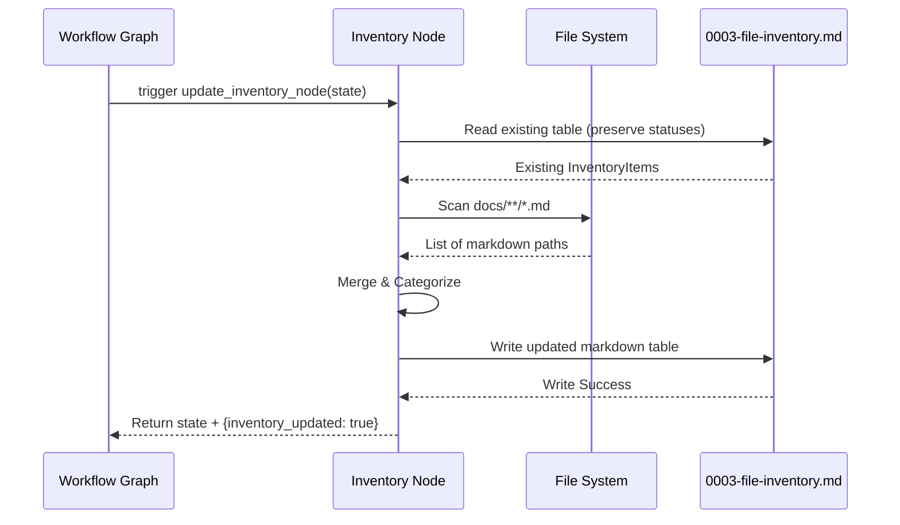

# 599 - Feature: Inventory-as-Code Node

<!-- Template Metadata
Last Updated: 2026-02-25
Updated By: Issue #599
Update Reason: Initial LLD generation for automated Inventory-as-Code Node
Previous: N/A
-->

## 1. Context & Goal
* **Issue:** #599
* **Objective:** Automate the "Inventory Rule" by adding a mechanical node that scans `docs/`, categorizes `.md` files, and updates `0003-file-inventory.md` at the end of every workflow.
* **Status:** Approved (gemini-3.1-pro-preview, 2026-03-06)
* **Related Issues:** #206 (Sync Architecture)

### Open Questions
*Questions that need clarification before or during implementation. Remove when resolved.*

- [ ] Does `0003-file-inventory.md` already contain bounding HTML comments (e.g., `<!-- INVENTORY_START -->`) to safely inject the table, or do we need to inject them during the first run?
- [ ] Should the node fail the workflow if the inventory file is locked/unwritable, or just log a warning and continue?

## 2. Proposed Changes

*This section is the **source of truth** for implementation. Describe exactly what will be built.*

### 2.1 Files Changed

| File | Change Type | Description |
|------|-------------|-------------|
| `assemblyzero/nodes/inventory.py` | Add | LangGraph node for scanning docs, categorizing, and updating the inventory markdown file. |
| `assemblyzero/utils/markdown_inventory.py` | Add | Utilities for parsing and writing markdown tables within bounding tags. |
| `tests/unit/test_inventory_node.py` | Add | Unit tests for the inventory scanning and parsing logic. |
| `tests/fixtures/mock_repo/docs/0003-file-inventory.md` | Add | Mock inventory file for testing updates. |

### 2.1.1 Path Validation (Mechanical - Auto-Checked)

*Issue #277: Before human or Gemini review, paths are verified programmatically.*

Mechanical validation automatically checks:
- All "Modify" files must exist in repository
- All "Delete" files must exist in repository
- All "Add" files must have existing parent directories
- No placeholder prefixes (`src/`, `lib/`, `app/`) unless directory exists

**If validation fails, the LLD is BLOCKED before reaching review.**

### 2.2 Dependencies

*New packages, APIs, or services required.*

```toml

# pyproject.toml additions (if any)

# No new dependencies. Standard library pathlib and re will be used.
```

### 2.3 Data Structures

```python
from typing import TypedDict, List
from pathlib import Path

class InventoryItem(TypedDict):
    path: str
    filename: str
    category: str
    status: str

class InventoryState(TypedDict):
    # Standard LangGraph state fields plus optional inventory logs
    inventory_updated: bool
    inventory_entries_added: int
    errors: List[str]
```

### 2.4 Function Signatures

```python

# assemblyzero/utils/markdown_inventory.py
def extract_existing_inventory(filepath: Path) -> list[InventoryItem]:
    """Parses the existing markdown table to retain human-edited statuses."""
    ...

def inject_inventory_table(filepath: Path, items: list[InventoryItem]) -> bool:
    """Writes the updated table back to the file between bounding tags."""
    ...

def categorize_file(filepath: Path) -> str:
    """Categorizes a file based on its directory path (e.g. LLD, ADR, Standard)."""
    ...

# assemblyzero/nodes/inventory.py
def scan_docs_directory(docs_dir: Path) -> list[Path]:
    """Returns a list of all .md files in the docs directory."""
    ...

def update_inventory_node(state: dict) -> dict:
    """LangGraph node execution: orchestrates the scan, diff, and update process."""
    ...
```

### 2.5 Logic Flow (Pseudocode)

```
1. Receive state in `update_inventory_node`
2. Define target `docs/` dir and `0003-file-inventory.md` path
3. IF `0003-file-inventory.md` does not exist:
   - Create it with default header and bounding tags
4. Extract existing inventory items (to preserve manually set "Status" fields)
5. Scan `docs/` for all `**/*.md` files
6. For each file found:
   - IF file in existing inventory:
     - Keep existing status
   - ELSE:
     - Determine Category using `categorize_file(path)`
     - Add to list with Status = "Active" (default)
7. Sort items by Category, then Filename
8. Generate markdown table
9. Inject table into `0003-file-inventory.md` between `<!-- INVENTORY_START -->` and `<!-- INVENTORY_END -->`
10. Return updated state (append log message)
```

### 2.6 Technical Approach

* **Module:** `assemblyzero/nodes/inventory.py`
* **Pattern:** LangGraph Node (Stateless transformation/Side-effect)
* **Key Decisions:**
  - **Regex + Bounding Comments:** We will use `<!-- INVENTORY_START -->` and `<!-- INVENTORY_END -->` markers in the markdown file. This prevents the bot from overwriting human-written contextual text outside the table.
  - **Status Preservation:** The system must read the existing table first. If a human changed a file's status to "Legacy", the bot must not overwrite it back to "Active".

### 2.7 Architecture Decisions

| Decision | Options Considered | Choice | Rationale |
|----------|-------------------|--------|-----------|
| State management | Pass full state, return full state vs return dict update | Return dict update | Standard LangGraph paradigm. Only injects `inventory_updated` flag to state. |
| Data flow pattern | Sync vs Async | Sync | File I/O for a single local markdown file and `docs/` directory is trivially fast. Async overhead is unnecessary. |
| AST vs Regex parsing | AST (markdown-it), Regex | Regex | We only need to parse a single table bounded by specific HTML comments. Introducing a full Markdown AST parser is overkill for this strict, controlled format. |

**Architectural Constraints:**
- Must operate entirely locally (no API calls needed for file discovery).
- Cannot break the workflow if the file update fails (Fail Open).

## 3. Requirements

1. Automatically detect all new `.md` files within the `docs/` directory hierarchy.
2. Categorize files accurately (e.g., `/docs/lld/` -> LLD, `/docs/adrs/` -> ADR, `/docs/standards/` -> Standard).
3. Programmatically insert/update entries in `0003-file-inventory.md` without deleting manual status edits (e.g. "Legacy").
4. The node must not fail the primary agent workflow if it encounters a file-locking or permission error (Fail Open).

## 4. Alternatives Considered

| Option | Pros | Cons | Decision |
|--------|------|------|----------|
| **LangGraph Node (End of Workflow)** | Guaranteed execution at completion. Clean integration with state machine. | Requires attaching to every graph definition. | **Selected** |
| **Git Pre-commit Hook** | Happens automatically on user commit. | Harder to orchestrate across agent-driven worktrees. Might interrupt standard `gh` flows. | **Rejected** |
| **LLM-driven Update Node** | Flexible parsing. | Slow, costs API tokens, prone to hallucinating table formats. | **Rejected** |

**Rationale:** A deterministic Python node attached to the LangGraph execution guarantees structured updates without token cost, and it aligns perfectly with the AssemblyZero architectural pattern of programmatic governance.

## 5. Data & Fixtures

### 5.1 Data Sources

| Attribute | Value |
|-----------|-------|
| Source | Local File System (`docs/` directory) |
| Format | Markdown (`.md`) |
| Size | Typically < 200 files |
| Refresh | End of every LangGraph workflow execution |
| Copyright/License | N/A |

### 5.2 Data Pipeline

```
Local File System (docs/**/*.md) ──os.walk──► List[Path] ──Categorize──► InventoryItem ──Markdown Format──► 0003-file-inventory.md
```

### 5.3 Test Fixtures

| Fixture | Source | Notes |
|---------|--------|-------|
| `mock_repo/docs/0003-file-inventory.md` | Hardcoded | Contains standard bounding tags and 2 existing entries |
| `mock_repo/docs/lld/active/123-test.md` | Hardcoded | Dummy file to trigger discovery |

### 5.4 Deployment Pipeline

Executes natively as part of the LangGraph runtime. Tested via pytest in CI.

## 6. Diagram

### 6.1 Mermaid Quality Gate

**Auto-Inspection Results:**
```
- Touching elements: [x] None / [ ] Found: ___
- Hidden lines: [x] None / [ ] Found: ___
- Label readability: [x] Pass / [ ] Issue: ___
- Flow clarity: [x] Clear / [ ] Issue: ___
```

### 6.2 Diagram



## 7. Security & Safety Considerations

### 7.1 Security

| Concern | Mitigation | Status |
|---------|------------|--------|
| Path Traversal | Restrict file scanning explicitly to `Path("docs").resolve()` boundary | Addressed |
| Malicious File Names | Sanitize filenames before injecting into markdown table to prevent Markdown/HTML injection | Addressed |

### 7.2 Safety

| Concern | Mitigation | Status |
|---------|------------|--------|
| Corrupting `0003-file-inventory.md` | Write to temporary file first, then atomic rename/replace (if OS supports) or strict regex bounding replacement | Addressed |
| Node crashes workflow | Wrap entire node in `try/except Exception`. Return state with `errors` logged. | Addressed |

**Fail Mode:** Fail Open - If the inventory cannot be updated, the overarching LangGraph workflow (e.g., LLD creation, PR review) MUST still succeed. We do not block a feature branch because a documentation table failed to format.

**Recovery Strategy:** Next successful workflow run will automatically pick up and correct the missing inventory items.

## 8. Performance & Cost Considerations

### 8.1 Performance

| Metric | Budget | Approach |
|--------|--------|----------|
| Latency | < 500ms | Native python `pathlib.rglob` is virtually instant for <10,000 files. |
| Memory | < 50MB | Streaming parsing of the single inventory file; paths kept in minimal memory structures. |
| API Calls | 0 | Entirely local file-system operations. |

**Bottlenecks:** None anticipated given the typical size of the `docs/` repository constraint.

### 8.2 Cost Analysis

| Resource | Unit Cost | Estimated Usage | Monthly Cost |
|----------|-----------|-----------------|--------------|
| LLM API calls | $0 | 0 calls (deterministic code) | $0 |
| Compute | N/A | Local developer machine | $0 |

**Cost Controls:**
- [x] Deterministic execution (No LLMs used for this node)

**Worst-Case Scenario:** Repository scales to 100,000 docs files. `rglob` takes ~2 seconds. Acceptable for an end-of-workflow step.

## 9. Legal & Compliance

| Concern | Applies? | Mitigation |
|---------|----------|------------|
| PII/Personal Data | No | Operating purely on technical file paths |
| Third-Party Licenses | No | Only standard library used |
| Terms of Service | No | Local execution only |
| Data Retention | No | N/A |
| Export Controls | No | N/A |

**Data Classification:** Internal

**Compliance Checklist:**
- [x] No PII stored without consent
- [x] All third-party licenses compatible with project license
- [x] External API usage compliant with provider ToS
- [x] Data retention policy documented

## 10. Verification & Testing

**Testing Philosophy:** Strive for 100% automated test coverage.

### 10.0 Test Plan (TDD - Complete Before Implementation)

| Test ID | Test Description | Expected Behavior | Status |
|---------|------------------|-------------------|--------|
| T010 | Parse existing table | Correctly extracts items and manual statuses | RED |
| T020 | Scan directory | Correctly discovers only `.md` files in subtree | RED |
| T030 | Categorize files | Maps `docs/lld/` -> "LLD", `docs/adrs/` -> "ADR", etc. | RED |
| T040 | Merge items | Merges new discovered files with existing statuses without overriding | RED |
| T050 | Inject table | Safely replaces text between HTML boundary comments | RED |
| T060 | Graceful failure | Missing directory or locked file returns cleanly, does not throw exception | RED |

**Coverage Target:** ≥95% for `assemblyzero/nodes/inventory.py` and `assemblyzero/utils/markdown_inventory.py`

### 10.1 Test Scenarios

| ID | Scenario | Type | Input | Expected Output | Pass Criteria |
|----|----------|------|-------|-----------------|---------------|
| 010 | Scan directory for new files (REQ-1) | Auto | Directory with nested `.md` and non-md files | Discovers only `.md` files | Returns complete list of expected `.md` paths |
| 020 | Unrecognized path categorization (REQ-2) | Auto | `docs/weird_folder/test.md` | Category defaults to "Uncategorized" | Entry added successfully and properly categorized |
| 030 | Existing file update (REQ-3) | Auto | File with 1 existing entry, 1 new file in dir | File with 2 entries, original status preserved | Bounding tags intact, both items present |
| 040 | No existing file auto-create (REQ-3) | Auto | Empty repo, `0003...` does not exist | Creates file, adds header, tags, and new files | New file generated correctly with initial structure |
| 050 | Graceful failure on missing docs (REQ-4) | Auto | Non-existent or unreadable docs directory | Returns state with `errors` logged, workflow continues | Exception caught, no graph crash |

### 10.2 Test Commands

```bash

# Run all automated tests for the inventory node
poetry run pytest tests/unit/test_inventory_node.py -v
```

### 10.3 Manual Tests (Only If Unavoidable)

N/A - All scenarios automated. Local filesystem interactions can be fully simulated with `tmp_path` pytest fixtures.

## 11. Risks & Mitigations

| Risk | Impact | Likelihood | Mitigation |
|------|--------|------------|------------|
| Bounding tags accidentally removed by human | Low | Med | Node will append them to the end of the file if not found (`inject_inventory_table`), ensuring data is not lost. |
| Malformed existing Markdown table | Low | Low | Regex extraction (`extract_existing_inventory`) relies on standard pipe `|` structure. If parsing fails, fall back to regenerating table cleanly. |

## 12. Definition of Done

### Code
- [ ] `assemblyzero/nodes/inventory.py` implemented
- [ ] `assemblyzero/utils/markdown_inventory.py` implemented
- [ ] Node integrated into primary workflow graphs

### Tests
- [ ] Pytest fixtures created for mock filesystem
- [ ] All test scenarios pass (T010-T060)
- [ ] Test coverage ≥ 95% for new modules

### Documentation
- [ ] `docs/0003-file-inventory.md` seeded with bounding tags

### Review
- [ ] Code review completed
- [ ] Validated automatically at end of next LLD generation

### 12.1 Traceability (Mechanical - Auto-Checked)

*Issue #277: Cross-references are verified programmatically.*

Mechanical validation automatically checks:
- Every file mentioned in this section must appear in Section 2.1
- Every risk mitigation in Section 11 should have a corresponding function in Section 2.4 (warning if not)

---

## Appendix: Review Log

<!-- Note: Timestamps are auto-generated by the workflow. Do not fill in manually. -->

### Review Summary

<!-- Note: This table is auto-populated by the workflow with actual review dates. -->

| Review | Date | Verdict | Key Issue |
|--------|------|---------|-----------|
| Pending | (auto) | PENDING | N/A |

**Final Status:** APPROVED