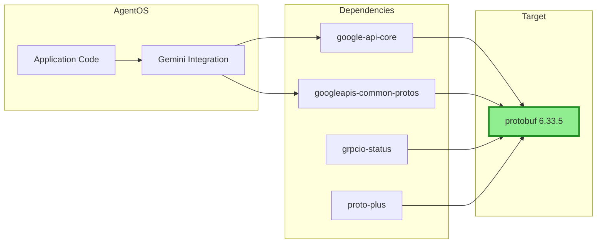

# 160 - Feature: CVE-2026-0994 protobuf JSON Recursion Depth Bypass Patch

<!-- Template Metadata
Last Updated: 2026-02-02
Updated By: Issue #60 creation
Update Reason: Initial LLD for protobuf security patch
-->

## 1. Context & Goal
* **Issue:** #60
* **Objective:** Upgrade protobuf from vulnerable version 5.29.5 to patched version 6.33.5 to address CVE-2026-0994 DoS vulnerability
* **Status:** Draft
* **Related Issues:** None

### Open Questions
*Questions that need clarification before or during implementation. Remove when resolved.*

- [x] Are there any pinned protobuf version constraints in dependent packages (google-api-core, grpcio-status)? **RESOLVED: `google-api-core` frequently pins protobuf upper bounds (e.g., `<6.0.0.dev0`). Check PyPI for compatibility and be prepared to update `google-api-core` simultaneously if needed.**
- [x] Do we have existing integration tests that exercise Gemini API calls end-to-end? **RESOLVED: Rely on Test ID T020 for mocked tests. Verify upgrade by running T050 (live Gemini API call) or a manual script before merging if no `pytest -m live` markers exist.**

## 2. Proposed Changes

*This section is the **source of truth** for implementation. Describe exactly what will be built.*

### 2.1 Files Changed

| File | Change Type | Description |
|------|-------------|-------------|
| `pyproject.toml` | Modify | Upgrade protobuf version constraint to ^6.33.5 |
| `poetry.lock` | Modify | Regenerated lock file with new protobuf version |

### 2.2 Dependencies

*New packages, APIs, or services required.*

```toml
# pyproject.toml modifications
protobuf = "^6.33.5"  # Previously: ^5.29.5
```

**Transitive Dependency Chain:**
- google-api-core → protobuf
- googleapis-common-protos → protobuf
- grpcio-status → protobuf
- proto-plus → protobuf

### 2.3 Data Structures

N/A - This is a dependency upgrade, no new data structures introduced.

### 2.4 Function Signatures

N/A - This is a dependency upgrade, no new functions introduced.

### 2.5 Logic Flow (Pseudocode)

```
1. Check PyPI for google-api-core compatibility with protobuf 6.x
2. Create worktree for isolated work
3. Upgrade protobuf dependency to ^6.33.5
4. IF google-api-core incompatible THEN
   - Upgrade google-api-core to compatible version
5. Run poetry lock to resolve dependencies
6. Run full test suite
7. Verify runtime protobuf version ≥6.33.5
8. Run vulnerability scan (pip-audit)
9. IF tests pass AND no new vulnerabilities THEN
   - Create PR for review
   ELSE
   - Document issues
   - Investigate fixes
   - Re-run tests
10. Merge when approved
```

### 2.6 Technical Approach

* **Module:** N/A (dependency management)
* **Pattern:** Dependabot-style version bump with regression testing
* **Key Decisions:** Direct upgrade rather than patching to avoid maintaining a fork

### 2.7 Architecture Decisions

| Decision | Options Considered | Choice | Rationale |
|----------|-------------------|--------|-----------|
| Upgrade approach | Pin exact version vs constraint | Constraint (^6.33.5) | Allows future patch updates within major version |
| Test strategy | Quick smoke vs full regression | Full regression | Major version bump warrants comprehensive testing |
| Rollback plan | Revert commit vs pin old version | Revert commit | Clean history, easy recovery |

**Architectural Constraints:**
- Must maintain compatibility with google-api-core and other Google packages
- Cannot break Gemini API integration
- May require simultaneous google-api-core upgrade if 6.x upper bound exists

## 3. Requirements

*What must be true when this is done. These become acceptance criteria.*

1. protobuf version is ≥6.33.5 in poetry.lock
2. All existing tests pass without modification
3. Gemini API calls function correctly (outbound requests, response parsing)
4. No new security vulnerabilities introduced by transitive dependency changes
5. CVE-2026-0994 vulnerability is mitigated

## 4. Alternatives Considered

| Option | Pros | Cons | Decision |
|--------|------|------|----------|
| Upgrade to 6.33.5 | Full CVE fix, future patches included | Major version jump, potential breaking changes | **Selected** |
| Pin to exact 6.33.5 | Controlled, predictable | Miss future patches | Rejected |
| Backport patch to 5.x | Minimal change | Maintenance burden, unsupported | Rejected |
| Accept risk (no action) | Zero effort | Leaves vulnerability unpatched | Rejected |

**Rationale:** The vulnerability is HIGH severity (CVSS 8.2) and a patch is readily available. While we primarily use protobuf for outbound calls (lower risk), the upgrade is straightforward and eliminates the attack surface entirely.

## 5. Data & Fixtures

### 5.1 Data Sources

| Attribute | Value |
|-----------|-------|
| Source | PyPI (protobuf package) |
| Format | Python wheel/sdist |
| Size | ~1.5MB package |
| Refresh | One-time upgrade |
| Copyright/License | BSD-3-Clause (protobuf) |

### 5.2 Data Pipeline

```
PyPI ──poetry add──► poetry.lock ──poetry install──► venv
```

### 5.3 Test Fixtures

| Fixture | Source | Notes |
|---------|--------|-------|
| Existing Gemini mocks | Already in test suite | Verify still compatible with protobuf 6.x |
| CVE PoC payload | Not needed | We're upgrading, not testing vulnerability |

### 5.4 Deployment Pipeline

Standard dependency update flow:
1. Update in feature branch
2. CI runs full test suite
3. PR review and merge
4. Production deploys with next release

**If data source is external:** N/A - using standard PyPI

## 6. Diagram

### 6.1 Mermaid Quality Gate

- [x] **Simplicity:** Minimal components shown
- [x] **No touching:** All elements have visual separation
- [x] **No hidden lines:** All arrows fully visible
- [x] **Readable:** Labels clear
- [ ] **Auto-inspected:** Pending agent render

**Auto-Inspection Results:**
```
- Touching elements: [ ] None / [ ] Found: ___
- Hidden lines: [ ] None / [ ] Found: ___
- Label readability: [ ] Pass / [ ] Issue: ___
- Flow clarity: [ ] Clear / [ ] Issue: ___
```

### 6.2 Diagram



## 7. Security & Safety Considerations

### 7.1 Security

| Concern | Mitigation | Status |
|---------|------------|--------|
| CVE-2026-0994 DoS via JSON recursion | Upgrade to patched version 6.33.5 | Addressed |
| New vulnerabilities in 6.x | Run pip-audit after upgrade (T050) | Addressed |
| Supply chain attack | Verify PyPI package checksums via poetry.lock | Addressed |

### 7.2 Safety

| Concern | Mitigation | Status |
|---------|------------|--------|
| Breaking changes crash application | Full regression test suite | Addressed |
| Incompatible with Google API packages | Test Gemini integration specifically | Addressed |
| Rollback difficulty | Git revert available, simple dependency change | Addressed |

**Fail Mode:** Fail Closed - If upgrade breaks functionality, revert to 5.29.5 and reassess

**Recovery Strategy:** 
1. Git revert the protobuf upgrade commit
2. Re-run `poetry install` to restore 5.x
3. Open follow-up issue to investigate compatibility

## 8. Performance & Cost Considerations

### 8.1 Performance

| Metric | Budget | Approach |
|--------|--------|----------|
| Serialization speed | No regression | Protobuf 6.x maintains performance parity |
| Memory usage | No regression | No significant changes expected |
| API call latency | No change | Transport layer unchanged |

**Bottlenecks:** None anticipated - this is a security patch, not a performance change

### 8.2 Cost Analysis

| Resource | Unit Cost | Estimated Usage | Monthly Cost |
|----------|-----------|-----------------|--------------|
| CI time for testing | ~$0.01/min | ~30 min one-time | ~$0.30 |
| Developer time | N/A | ~2 hours | N/A |

**Cost Controls:**
- [x] Standard CI pipeline, no additional resources
- [x] One-time upgrade, not recurring cost

**Worst-Case Scenario:** If upgrade causes issues, 2-4 hours additional debugging time

## 9. Legal & Compliance

| Concern | Applies? | Mitigation |
|---------|----------|------------|
| PII/Personal Data | No | Dependency upgrade, no data handling changes |
| Third-Party Licenses | Yes | BSD-3-Clause (unchanged from 5.x) |
| Terms of Service | No | Standard PyPI distribution |
| Data Retention | No | No data handling changes |
| Export Controls | No | Not applicable |

**Data Classification:** N/A - dependency management

**Compliance Checklist:**
- [x] No PII involved
- [x] License compatible (BSD-3-Clause → BSD-3-Clause)
- [x] PyPI ToS compliance (standard usage)
- [x] No export control concerns

## 10. Verification & Testing

### 10.0 Test Plan (TDD - Complete Before Implementation)

**TDD Requirement:** For this security patch, we rely on existing tests rather than writing new ones. The test plan focuses on regression verification.

| Test ID | Test Description | Expected Behavior | Status |
|---------|------------------|-------------------|--------|
| T010 | Existing unit tests | All pass with protobuf 6.x | RED |
| T020 | Gemini integration tests | API calls succeed | RED |
| T030 | Import verification | protobuf imports without error | RED |
| T040 | Version verification (runtime) | `google.protobuf.__version__` ≥ 6.33.5 | RED |
| T050 | Vulnerability scan | No new vulnerabilities in dependency tree | RED |
| T060 | Live Gemini call (optional) | Real API request succeeds | RED |

**Coverage Target:** Existing coverage maintained (no new code)

**TDD Checklist:**
- [x] Using existing test suite (no new tests needed for T010-T020)
- [ ] Tests currently RED (not yet run against 6.x)
- [x] Test IDs match scenario IDs in 10.1
- [x] Existing test files cover protobuf usage

### 10.1 Test Scenarios

| ID | Scenario | Type | Input | Expected Output | Pass Criteria |
|----|----------|------|-------|-----------------|---------------|
| 010 | Full test suite regression | Auto | `pytest tests/` | All tests pass | Exit code 0 |
| 020 | Gemini API mock test | Auto | Mock API request | Response parsed correctly | Assertions pass |
| 030 | Import smoke test | Auto | `import google.protobuf` | No ImportError | Module loads |
| 040 | Version check (runtime) | Auto | `google.protobuf.__version__` | "6.33.5" or higher | Version comparison |
| 050 | Vulnerability scan | Auto | `pip-audit` or `safety check` | No new vulnerabilities | Exit code 0, clean report |
| 060 | Live Gemini call (optional) | Auto-Live | Real API request | Valid response | HTTP 200, valid JSON |

### 10.2 Test Commands

```bash
# Create worktree and upgrade
git worktree add ../AgentOS-60 -b 60-protobuf-cve-patch
cd ../AgentOS-60
poetry add protobuf@^6.33.5

# Run all automated tests (Scenario 010)
poetry run pytest tests/ -v

# Run only fast/mocked tests (exclude live)
poetry run pytest tests/ -v -m "not live"

# Verify runtime version (Scenario 040)
poetry run python -c "import google.protobuf; v = google.protobuf.__version__; print(f'protobuf version: {v}'); assert tuple(map(int, v.split('.')[:2])) >= (6, 33), f'Version {v} is below 6.33.5'"

# Run vulnerability scan (Scenario 050)
poetry run pip-audit --strict
# OR if pip-audit not available:
poetry run pip install safety && poetry run safety check

# Run live integration tests (Scenario 060, optional)
poetry run pytest tests/ -v -m live
```

### 10.3 Manual Tests (Only If Unavoidable)

**If T060 (live test) cannot be automated:** Verify the upgrade by manually running a script that calls the Gemini API before merging.

| ID | Scenario | Why Not Automated | Steps |
|----|----------|-------------------|-------|
| 060-fallback | Live Gemini API call | No existing `pytest -m live` infrastructure | 1. Activate venv with upgraded protobuf 2. Run `poetry run python -c "from src.gemini import client; print(client.test_connection())"` or equivalent 3. Verify response is valid |

*Full test results recorded in Implementation Report (0103) or Test Report (0113).*

## 11. Risks & Mitigations

| Risk | Impact | Likelihood | Mitigation |
|------|--------|------------|------------|
| Breaking API changes in protobuf 6.x | High | Medium | Full regression testing, review changelog |
| Google API packages incompatible | High | Medium | Check PyPI compatibility first, upgrade google-api-core if needed |
| Serialization format changes | Medium | Low | Test all Gemini API interactions |
| CI/CD pipeline failure | Low | Low | Standard tooling, well-tested process |
| New vulnerabilities in 6.x | Medium | Low | Run pip-audit/safety check (Scenario 050) |

## 12. Definition of Done

### Code
- [ ] `pyproject.toml` updated with protobuf ^6.33.5
- [ ] `poetry.lock` regenerated successfully
- [ ] No code changes required (ideal) or minimal compatibility fixes documented

### Tests
- [ ] All existing tests pass with protobuf 6.x (T010)
- [ ] Gemini integration verified working (T020)
- [ ] Runtime version verified ≥6.33.5 (T040)
- [ ] Vulnerability scan clean (T050)

### Documentation
- [ ] LLD updated with any deviations
- [ ] Implementation Report (0103) completed
- [ ] Issue #60 closed with summary comment

### Review
- [ ] Code review completed (dependency change review)
- [ ] Security team notified of CVE remediation
- [ ] User approval before closing issue

---

## Appendix: Review Log

*Track all review feedback with timestamps and implementation status.*

### Gemini Review #1 (REVISE)

**Reviewer:** Gemini 3 Pro
**Verdict:** REVISE

#### Comments

| ID | Comment | Implemented? |
|----|---------|--------------|
| G1.1 | "Open questions about pinned constraints and integration tests need resolution" | YES - Resolved in Section 1 Open Questions |
| G1.2 | "Requirement 4 (No new vulnerabilities) lacks test coverage - 80% coverage" | YES - Added T050 (vulnerability scan) in Section 10 |
| G1.3 | "T040 should check runtime version, not just lock file" | YES - Updated T040 description and test command to verify `google.protobuf.__version__` |
| G1.4 | "Be aware google-api-core may pin protobuf upper bounds" | YES - Added to Section 2.5 Logic Flow and Section 11 Risks |

### Review Summary

| Review | Date | Verdict | Key Issue |
|--------|------|---------|-----------|
| Gemini #1 | 2026-02-02 | REVISE | Missing vulnerability scan test for Requirement 4 |

**Final Status:** PENDING