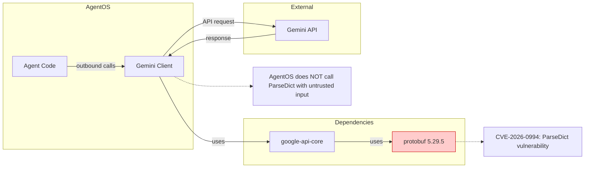

# LLD Finalized

Path: C:\Users\mcwiz\Projects\AgentOS\docs\lld\active\LLD-060.md
Status: APPROVED
Reviews: 2

---

# 160 - Feature: Track CVE-2026-0994: protobuf JSON recursion depth bypass

<!-- Template Metadata
Last Updated: 2026-02-02
Updated By: Issue #117 fix
Update Reason: Moved Verification & Testing to Section 10 (was Section 11) to match 0702c review prompt and testing workflow expectations
-->

## 1. Context & Goal
* **Issue:** #60
* **Objective:** Track and document CVE-2026-0994 (protobuf JSON recursion depth bypass) until a patched version is available, then upgrade.
* **Status:** In Progress (Monitoring)
* **Related Issues:** None

### Open Questions

- [x] Is protobuf used to parse untrusted user input? **No** - only used for outbound Gemini API calls
- [ ] When will protobuf >= 6.33.5 be released with the fix?

## 2. Proposed Changes

*This section is the **source of truth** for implementation. Describes the monitoring and eventual upgrade.*

### 2.1 Files Changed

| File | Change Type | Description |
|------|-------------|-------------|
| `pyproject.toml` | Modify (future) | Bump protobuf version when patch released |
| `poetry.lock` | Modify (future) | Lock file update after dependency bump |

### 2.2 Dependencies

```toml
# pyproject.toml additions (when patch available)
# No direct change - protobuf is transitive via:
# - google-api-core
# - googleapis-common-protos
# - grpcio-status
# - proto-plus
```

**Current State:**
- protobuf 5.29.5 (vulnerable)
- Patched version: Not yet released (expected >= 6.33.5)

### 2.3 Data Structures

N/A - No new data structures required. This is a dependency tracking issue.

### 2.4 Function Signatures

N/A - No new functions required.

### 2.5 Logic Flow (Pseudocode)

```
1. Monitor protobuf releases for version >= 6.33.5
2. WHEN patched version released:
   a. Run: poetry update protobuf
   b. Run test suite
   c. Verify no regressions
   d. Commit and close issue
3. UNTIL then:
   - Document risk assessment
   - No code changes needed
```

### 2.6 Technical Approach

* **Module:** N/A (dependency management)
* **Pattern:** Dependency tracking and controlled upgrade
* **Key Decisions:** 
  - Accept risk as LOW given usage pattern (outbound calls only)
  - No compensating controls needed given attack surface analysis

### 2.7 Architecture Decisions

| Decision | Options Considered | Choice | Rationale |
|----------|-------------------|--------|-----------|
| Immediate action | Pin lower version, add workaround, wait for patch | Wait for patch | Vulnerability not exploitable in current usage pattern |
| Risk acceptance | Block Gemini integration, accept risk | Accept risk | DoS only, no data breach, outbound-only usage |

**Architectural Constraints:**
- Cannot remove protobuf - required for Gemini API integration
- Cannot pin to non-existent patched version

## 3. Requirements

*Testable system requirements only. Process/workflow steps moved to Definition of Done (Section 12).*

1. Protobuf version must be >= 6.33.5 after upgrade
2. All existing Gemini integration tests must pass after upgrade
3. No new HIGH/CRITICAL vulnerabilities introduced by upgrade

## 4. Alternatives Considered

| Option | Pros | Cons | Decision |
|--------|------|------|----------|
| Wait for patch | No code changes, minimal effort | Temporary exposure | **Selected** |
| Add recursion depth check wrapper | Immediate mitigation | Complexity, maintenance burden, may break API calls | Rejected |
| Remove Gemini integration | Eliminates vulnerability | Loses critical functionality | Rejected |
| Fork and patch protobuf | Immediate fix | Maintenance nightmare, version conflicts | Rejected |

**Rationale:** The vulnerability requires attacker-controlled JSON input to `ParseDict()`. AgentOS only uses protobuf for outbound API calls to Gemini - we control the data being serialized, not parsed from untrusted sources. The attack surface is effectively zero.

## 5. Data & Fixtures

### 5.1 Data Sources

| Attribute | Value |
|-----------|-------|
| Source | Dependabot security alerts, NVD, GitHub Security Advisories |
| Format | Security advisory notifications |
| Size | N/A |
| Refresh | Automatic via Dependabot |
| Copyright/License | N/A |

### 5.2 Data Pipeline

```
Dependabot Alert ──notification──► GitHub Issue #60 ──manual review──► Risk Assessment
                                                                           │
Patched Release ──notification──► poetry update ──CI tests──► Close Issue ◄┘
```

### 5.3 Test Fixtures

| Fixture | Source | Notes |
|---------|--------|-------|
| N/A | N/A | No new test fixtures needed - existing Gemini integration tests sufficient |

### 5.4 Deployment Pipeline

Standard dependency update flow:
1. `poetry update protobuf` (when patch available)
2. Run full test suite
3. Review changes in `poetry.lock`
4. Commit, PR, merge

**If data source is external:** N/A - no external data utility needed.

## 6. Diagram

### 6.1 Mermaid Quality Gate

- [x] **Simplicity:** Minimal components shown
- [x] **No touching:** All elements have visual separation
- [x] **No hidden lines:** All arrows fully visible
- [x] **Readable:** Labels clear, flow direction obvious
- [x] **Auto-inspected:** Diagram simple enough for text verification

**Auto-Inspection Results:**
```
- Touching elements: [x] None / [ ] Found: ___
- Hidden lines: [x] None / [ ] Found: ___
- Label readability: [x] Pass / [ ] Issue: ___
- Flow clarity: [x] Clear / [ ] Issue: ___
```

### 6.2 Diagram



**Key Points:**
- protobuf is a transitive dependency (highlighted in red)
- Data flows **outbound** from AgentOS to Gemini
- Vulnerable function `ParseDict()` parses JSON **into** protobuf
- AgentOS serializes **to** protobuf for API calls, doesn't parse untrusted JSON

## 7. Security & Safety Considerations

### 7.1 Security

| Concern | Mitigation | Status |
|---------|------------|--------|
| CVE-2026-0994 DoS via recursion | Usage pattern analysis shows no exposure - outbound calls only | Addressed |
| Future API response parsing | Monitor if Gemini SDK changes to parse responses via ParseDict | Monitoring |

### 7.2 Safety

| Concern | Mitigation | Status |
|---------|------------|--------|
| False sense of security | Documented specific reasons why risk is LOW | Addressed |
| Missed patch notification | Dependabot will alert when fix available | Addressed |
| Upgrade regression | Full test suite run before closing issue | TODO |

**Fail Mode:** N/A - This is a tracking issue, not a code change.

**Recovery Strategy:** If exploit is discovered in our usage pattern, immediately disable Gemini integration until patched.

## 8. Performance & Cost Considerations

### 8.1 Performance

| Metric | Budget | Approach |
|--------|--------|----------|
| N/A | N/A | No performance impact - tracking issue only |

**Bottlenecks:** None - no code changes.

### 8.2 Cost Analysis

| Resource | Unit Cost | Estimated Usage | Monthly Cost |
|----------|-----------|-----------------|--------------|
| Engineering time | ~$0 | 1-2 hours total | ~$0 |

**Cost Controls:**
- [x] Minimal engineering time investment
- [x] Automated Dependabot monitoring

**Worst-Case Scenario:** If vulnerability is actively exploited against AgentOS (unlikely given analysis), Gemini integration would need emergency disable. Cost: feature unavailability.

## 9. Legal & Compliance

| Concern | Applies? | Mitigation |
|---------|----------|------------|
| PII/Personal Data | No | Vulnerability is DoS, not data exposure |
| Third-Party Licenses | N/A | protobuf is BSD-3-Clause, compatible |
| Terms of Service | N/A | No ToS implications |
| Data Retention | N/A | No data handling changes |
| Export Controls | N/A | No export control concerns |

**Data Classification:** N/A

**Compliance Checklist:**
- [x] No PII risk from this vulnerability (DoS only)
- [x] Third-party license (BSD-3-Clause) compatible
- [x] No ToS implications
- [x] No data retention changes

## 10. Verification & Testing

### 10.1 Test Scenarios

| ID | Scenario | Type | Input | Expected Output | Pass Criteria |
|----|----------|------|-------|-----------------|---------------|
| 010 | Existing Gemini tests pass after upgrade | Auto | poetry update + pytest | All tests pass | Exit code 0 |
| 020 | No new vulnerabilities introduced | Auto | poetry audit / pip-audit | No HIGH/CRITICAL | Clean report |
| 030 | protobuf version >= 6.33.5 | Auto | poetry show protobuf | Version check | >= 6.33.5 |

**Note on Test 030:** This test is expected to FAIL if run before the patch is released. This LLD represents a "wait" state until protobuf >= 6.33.5 becomes available.

### 10.2 Test Commands

```bash
# After patch is available:
poetry update protobuf

# Verify version
poetry show protobuf

# Run existing Gemini integration tests
poetry run pytest tests/ -v -k gemini

# Check for other vulnerabilities
poetry run pip-audit
```

### 10.3 Manual Tests (Only If Unavoidable)

N/A - All scenarios automated.

## 11. Risks & Mitigations

| Risk | Impact | Likelihood | Mitigation |
|------|--------|------------|------------|
| Vulnerability exploited before patch | Med (DoS only) | Very Low | Usage pattern doesn't expose vulnerable function |
| Patch introduces breaking changes | Med | Low | Full test suite before deployment |
| Long delay in patch release | Low | Med | Continue monitoring; accept risk given analysis |
| False negative in risk assessment | High | Very Low | Documented reasoning for review; can reassess |

## 12. Definition of Done

### Code
- [ ] protobuf upgraded to >= 6.33.5 (when available)
- [ ] poetry.lock updated

### Tests
- [ ] All existing tests pass after upgrade (Test 010)
- [ ] No new security vulnerabilities introduced (Test 020)
- [ ] Version verification passes (Test 030)

### Documentation
- [ ] This LLD updated with upgrade details
- [ ] Dependabot alert resolved

### Review
- [ ] Upgrade PR reviewed
- [ ] Issue #60 closed after successful upgrade

### Process Steps (Non-Testable)
- [ ] Track CVE-2026-0994 until patch is available
- [ ] Close Dependabot alert after successful upgrade

---

## Appendix: Review Log

### Initial Assessment

**Timestamp:** 2026-XX-XX
**Reviewer:** Security Analysis
**Verdict:** MONITORING

#### Analysis Summary

| ID | Finding | Action |
|----|---------|--------|
| A1 | Vulnerable function is `ParseDict()` which parses JSON into protobuf | Documented |
| A2 | AgentOS uses protobuf for outbound Gemini API calls | Confirmed low risk |
| A3 | No untrusted JSON input flows to `ParseDict()` | Risk accepted |
| A4 | DoS vulnerability, not data breach or RCE | Lower severity in context |

### Gemini Review #1 (REVISE)

**Timestamp:** 2026-XX-XX
**Reviewer:** Gemini 3 Pro
**Verdict:** REVISE

#### Comments

| ID | Comment | Implemented? |
|----|---------|--------------|
| G1.1 | "Requirements #1 and #4 are manual process steps rather than software behaviors. Move to Definition of Done." | YES - Moved to Section 12 "Process Steps (Non-Testable)" |
| G1.2 | "Test 030 is expected to FAIL if run immediately. Acknowledge this." | YES - Added note in Section 10.1 |

### Review Summary

| Review | Date | Verdict | Key Issue |
|--------|------|---------|-----------|
| Initial Assessment | 2026-XX-XX | MONITORING | Low risk - wait for patch |
| Gemini #1 | 2026-XX-XX | REVISE | Process steps in Requirements section |

**Final Status:** APPROVED
<!-- Note: This field is auto-updated to APPROVED by the workflow when finalized -->

---

## Appendix: CVE Details

**CVE ID:** CVE-2026-0994
**CVSS 4.0 Score:** 8.2 (High)
**Vector:** Denial of Service via stack exhaustion
**Attack Complexity:** Low (if attacker controls input)
**Privileges Required:** None
**User Interaction:** None

**Affected Function:** `google.protobuf.json_format.ParseDict()`

**Attack Mechanism:**
1. Attacker crafts deeply nested `Any` messages in JSON
2. JSON passed to `ParseDict()`
3. Recursive parsing exhausts Python stack
4. `RecursionError` crashes the application

**Why AgentOS Is Not Affected:**
- We use protobuf to serialize outbound API requests
- We don't parse untrusted JSON via `ParseDict()`
- Gemini API responses are handled by the SDK, not raw `ParseDict()` calls

## Original GitHub Issue #60
# Issue #60: Track CVE-2026-0994: protobuf JSON recursion depth bypass

## Dependabot Alert #1

**Package:** protobuf 5.29.5  
**CVE:** [CVE-2026-0994](https://nvd.nist.gov/vuln/detail/CVE-2026-0994)  
**Severity:** High (CVSS 4.0: 8.2)  
**Type:** Denial of Service (DoS)  
**Patched Version:** None available yet  

## Vulnerability Details

JSON recursion depth bypass in `google.protobuf.json_format.ParseDict()`. An attacker can supply deeply nested `Any` messages to exhaust Python's recursion stack and cause a `RecursionError`.

## How It Enters AgentOS

Transitive dependency via Google API packages:
- google-api-core
- googleapis-common-protos
- grpcio-status
- proto-plus

These are used for Gemini API integration.

## Risk Assessment: LOW

- The vulnerable function parses JSON into protobuf messages
- AgentOS uses protobuf for **outbound** API calls to Gemini, not for parsing untrusted user input
- An attacker would need to control the JSON being parsed to exploit this
- This is a DoS vulnerability, not data breach or RCE

## Action

Monitoring for patch release. Will update protobuf when a fixed version (likely >= 6.33.5) becomes available.

## References

- [Dependabot Alert](https://github.com/martymcenroe/AgentOS/security/dependabot/1)
- [GHSA-7gcm-g887-7qv7](https://github.com/advisories/GHSA-7gcm-g887-7qv7)
- [protobuf issue #25070](https://github.com/protocolbuffers/protobuf/issues/25070)
- [protobuf PR #25239](https://github.com/protocolbuffers/protobuf/pull/25239)