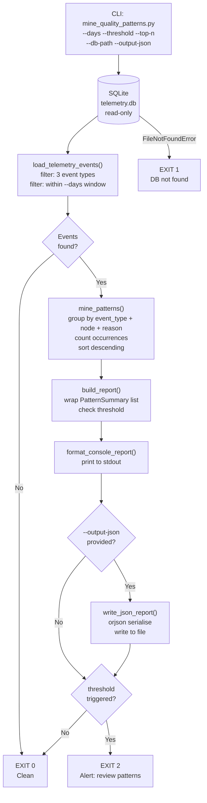

# 612 - Fix: Implement Missing `tools/mine_quality_patterns.py` Audit Script

<!-- Template Metadata
Last Updated: 2026-02-02
Updated By: Issue #612
Update Reason: Revised to fix test coverage errors — all 10 requirements now mapped to test scenarios with (REQ-N) suffixes; Section 3 converted to numbered list format
Previous: Initial LLD for missing audit script required by #588 acceptance criteria
-->

## 1. Context & Goal

* **Issue:** #612
* **Objective:** Implement `tools/mine_quality_patterns.py`, the weekly telemetry audit script originally required by Issue #588's acceptance criteria but omitted from PR #596.
* **Status:** Approved (gemini-3.1-pro-preview, 2026-03-06)
* **Related Issues:** #588 (Two-Strikes & Context Pruning), #596 (closed #588 without this script)

### Open Questions

*Questions that need clarification before or during implementation. Remove when resolved.*

- [ ] What is the canonical telemetry store path/schema? Confirm SQLite database location and table structure for events (`quality.gate_rejected`, `retry.strike_one`, `workflow.halt_and_plan`).
- [ ] Should the script output to stdout only, or also write a structured report file (e.g., `data/audit/quality-patterns-YYYY-MM-DD.json`)?

## 2. Proposed Changes

*This section is the **source of truth** for implementation. Describe exactly what will be built.*

### 2.1 Files Changed

| File | Change Type | Description |
|------|-------------|-------------|
| `tools/mine_quality_patterns.py` | Add | Main weekly audit script — queries telemetry events and surfaces recurring failure patterns |
| `tests/tools/test_mine_quality_patterns.py` | Add | Unit tests for the audit script logic (mocked DB) |
| `tests/tools/__init__.py` | Add | Makes `tests/tools/` a Python package |

> **New directory:** `tests/tools/` — Change Type: `Add (Directory)`

### 2.1.1 Path Validation (Mechanical - Auto-Checked)

Mechanical validation automatically checks:
- All "Modify" files must exist in repository
- All "Delete" files must exist in repository
- All "Add" files must have existing parent directories
- No placeholder prefixes (`src/`, `lib/`, `app/`) unless directory exists

**`tools/` already exists** (per CLAUDE.md, all workflow scripts live in `tools/`).
**`tests/tools/` is a new directory** — listed above with `Add (Directory)` before file additions.

**If validation fails, the LLD is BLOCKED before reaching review.**

### 2.2 Dependencies

No new packages required. The script uses only packages already present in `pyproject.toml`:

```toml

# No additions to pyproject.toml — all dependencies satisfied by:

# - sqlite3 (Python stdlib)

# - orjson >= 3.11.7  (already declared)

# - argparse (Python stdlib)

# - datetime (Python stdlib)

# - collections (Python stdlib)
```

### 2.3 Data Structures

```python

# Pseudocode - NOT implementation

class TelemetryEvent(TypedDict):
    event_type: str        # e.g. "quality.gate_rejected"
    timestamp: str         # ISO-8601
    workflow_id: str       # UUID identifying the workflow run
    node: str              # LangGraph node name where event fired
    detail: str            # JSON-encoded extra context (agent, reason, etc.)
    thread_id: str         # LangGraph thread/checkpoint ID

class PatternSummary(TypedDict):
    event_type: str        # The telemetry event type being summarised
    pattern_key: str       # Grouping key: node + detail hash
    node: str              # Node where failures cluster
    reason: str            # Human-readable failure reason extracted from detail
    count: int             # How many times in the look-back window
    first_seen: str        # ISO-8601 earliest occurrence
    last_seen: str         # ISO-8601 most recent occurrence
    example_workflow_ids: list[str]  # Up to 3 representative workflow IDs

class AuditReport(TypedDict):
    generated_at: str              # ISO-8601 script run time
    look_back_days: int            # CLI param (default 7)
    event_counts: dict[str, int]   # Total events per event_type
    top_patterns: list[PatternSummary]  # Sorted by count desc
    threshold_triggered: bool      # True if any pattern count >= alert_threshold
```

### 2.4 Function Signatures

```python

# Signatures only - implementation in source files

def parse_args() -> argparse.Namespace:
    """Parse CLI arguments: --db-path, --days, --threshold, --output-json, --top-n."""
    ...

def load_telemetry_events(
    db_path: str,
    event_types: list[str],
    since_iso: str,
) -> list[TelemetryEvent]:
    """
    Query the SQLite telemetry store for matching event types after since_iso.
    Returns list of raw event dicts. Raises FileNotFoundError if db absent.
    Validates expected columns after first fetch; raises KeyError with descriptive
    message listing expected vs. actual columns on schema mismatch.
    Opens connection read-only via PRAGMA query_only = ON.
    """
    ...

def extract_pattern_key(event: TelemetryEvent) -> str:
    """
    Derive a stable grouping key from event node + top-level detail fields.
    Parses detail JSON; falls back to detail[:64] if JSON is malformed.
    Returns a short string suitable as a dict key.
    """
    ...

def mine_patterns(
    events: list[TelemetryEvent],
    top_n: int = 10,
) -> list[PatternSummary]:
    """
    Aggregate events by (event_type, pattern_key).
    Returns top_n patterns sorted by count descending.
    """
    ...

def format_console_report(report: AuditReport) -> str:
    """
    Render AuditReport as a human-readable plain-text summary for stdout.
    Returns the formatted string.
    """
    ...

def write_json_report(report: AuditReport, output_path: str) -> None:
    """
    Serialize AuditReport to JSON at output_path using orjson.
    Creates parent directories if needed.
    Raises PermissionError if write fails.
    """
    ...

def build_report(
    events: list[TelemetryEvent],
    look_back_days: int,
    alert_threshold: int,
    top_n: int,
) -> AuditReport:
    """
    Orchestrate pattern mining and wrap results into AuditReport.
    Sets threshold_triggered=True if any pattern count >= alert_threshold.
    """
    ...

def main() -> int:
    """
    Entry point. Returns 0 on success, 1 on missing DB, 2 on threshold breach.
    Exit code 2 signals CI/cron that a human should review the patterns.
    """
    ...
```

### 2.5 Logic Flow (Pseudocode)

```
1. parse_args()
   -> db_path (default: data/telemetry.db)
   -> days (default: 7)
   -> threshold (default: 3) — alert if any pattern seen >= N times
   -> output_json (optional file path)
   -> top_n (default: 10)

2. Compute since_iso = (UTC now - days) as ISO-8601 string

3. CALL load_telemetry_events(db_path, WATCHED_EVENT_TYPES, since_iso)
   IF FileNotFoundError:
     print warning "No telemetry database found at {db_path}"
     EXIT 1

4. IF events is empty:
     print "No telemetry events in the last {days} days."
     EXIT 0

5. CALL build_report(events, days, threshold, top_n)
   -> internally calls mine_patterns(events, top_n)

6. CALL format_console_report(report)
   -> print to stdout

7. IF output_json provided:
   CALL write_json_report(report, output_json)
   print "JSON report written to {output_json}"

8. IF report.threshold_triggered:
   print "[WARN] ALERT: One or more patterns exceed threshold ({threshold} occurrences)"
   EXIT 2

9. EXIT 0
```

### 2.6 Technical Approach

* **Module:** `tools/mine_quality_patterns.py` (standalone script, no package import required)
* **Pattern:** ETL micro-pipeline — Extract from SQLite -> Transform via frequency analysis -> Load to console/JSON
* **Telemetry Store:** Reads from the existing SQLite database used by `assemblyzero/telemetry/` — uses `sqlite3` stdlib, read-only (`isolation_level=None` + `PRAGMA query_only = ON`)
* **Watched Event Types:** Constant `WATCHED_EVENT_TYPES = ["quality.gate_rejected", "retry.strike_one", "workflow.halt_and_plan"]` — mirrors the three events specified in #588
* **Pattern Grouping:** Events grouped by `(event_type, node, reason)` where `reason` is the top-level `"reason"` field parsed from the JSON `detail` column. Falls back to `detail[:64]` if no `reason` key.
* **Output:** Console-first (human-readable table), optional `--output-json` for machine consumption in CI/cron pipelines
* **Key Decisions:** Stdlib-only except `orjson` (already a project dependency) — no new packages, no LangGraph imports — keeps the script self-contained and runnable without the full AssemblyZero stack

### 2.7 Architecture Decisions

| Decision | Options Considered | Choice | Rationale |
|----------|-------------------|--------|-----------|
| Database access | Direct sqlite3, SQLAlchemy, langgraph checkpoint API | Direct `sqlite3` stdlib | Script must run standalone without full stack; read-only access is trivial with stdlib |
| Pattern grouping key | Hash of full detail JSON, `node+reason` tuple, event_type only | `(event_type, node, reason)` tuple | Granular enough to be useful; stable across runs; human-readable |
| Output format | Console only, JSON only, Both | Console primary + optional JSON | Weekly audit is human-reviewed; JSON enables future automation |
| Exit codes | 0/1 only, 0/1/2 | 0 (ok), 1 (no DB), 2 (threshold breach) | Enables cron/CI to detect actionable alert state without parsing stdout |
| Telemetry table schema assumption | Hard-code expected columns, discover at runtime | Hard-code with graceful column-missing error | Simpler; schema is defined by the same codebase; fail-fast on schema drift |

**Architectural Constraints:**
- Must not import `assemblyzero` package internals — script must run with `poetry run python tools/mine_quality_patterns.py` without triggering LangGraph/LLM initialization
- Must not write to the telemetry database — read-only access only

## 3. Requirements

*What must be true when this is done. These become acceptance criteria.*

1. `tools/mine_quality_patterns.py` exists and is executable via `poetry run python tools/mine_quality_patterns.py`.
2. The script queries the three telemetry event types specified in #588: `quality.gate_rejected`, `retry.strike_one`, `workflow.halt_and_plan`.
3. The script groups events into recurring patterns and surfaces the top-N by frequency.
4. The script accepts `--days` (look-back window, default 7), `--threshold` (alert count, default 3), `--top-n` (default 10), `--db-path`, and `--output-json` CLI arguments.
5. The script exits with code 0 (clean), 1 (DB not found), or 2 (threshold breached).
6. The script prints a human-readable summary to stdout.
7. When `--output-json` is provided, a valid JSON file conforming to `AuditReport` is written.
8. The script accesses the database read-only and never mutates telemetry data.
9. All logic is covered by unit tests using a mocked/in-memory SQLite database.
10. `tests/tools/test_mine_quality_patterns.py` passes under `poetry run pytest` without requiring external services.

## 4. Alternatives Considered

| Option | Pros | Cons | Decision |
|--------|------|------|----------|
| Query telemetry via LangGraph checkpoint SQLite API | Uses existing abstractions | Requires full AssemblyZero stack; adds coupling | **Rejected** |
| Query telemetry via `assemblyzero.telemetry` module | Type-safe, DRY | Same coupling problem; makes script non-standalone | **Rejected** |
| Direct `sqlite3` read with hard-coded schema | Standalone, zero new deps, fast, testable | Schema drift breaks silently without good error messages | **Selected** (with explicit column-missing error handling) |
| Write output only to JSON, no console | Machine-readable, CI-friendly | Weekly audit is human-reviewed; console output is primary | **Rejected** — both modes supported |
| pandas for pattern aggregation | Convenient groupby | New heavy dependency not in pyproject.toml | **Rejected** — `collections.Counter` + `itertools` is sufficient |

**Rationale:** The standalone `sqlite3` approach was selected because the script must remain runnable outside the full AssemblyZero Python environment for cron/CI use. The cost of a thin schema assumption is acceptable given that the telemetry schema and this script live in the same repository.

## 5. Data & Fixtures

### 5.1 Data Sources

| Attribute | Value |
|-----------|-------|
| Source | Local SQLite database (`data/telemetry.db` by default) written by `assemblyzero/telemetry/` |
| Format | SQLite — `telemetry_events` table with columns: `id`, `event_type`, `timestamp`, `workflow_id`, `node`, `detail`, `thread_id` |
| Size | Hundreds to thousands of rows per week in active use |
| Refresh | Continuous (written by running workflows) |
| Copyright/License | Internal — no external data |

### 5.2 Data Pipeline

```
SQLite telemetry.db ──sqlite3 read──► load_telemetry_events()
    ──filter by event_type + timestamp──► list[TelemetryEvent]
    ──mine_patterns()──► list[PatternSummary]
    ──build_report()──► AuditReport
    ──format_console_report()──► stdout
    ──write_json_report() (optional)──► data/audit/quality-patterns-YYYY-MM-DD.json
```

### 5.3 Test Fixtures

| Fixture | Source | Notes |
|---------|--------|-------|
| In-memory SQLite DB with seed events | Generated in `conftest.py` via `sqlite3.connect(":memory:")` | No PII; synthetic workflow IDs (UUIDs) |
| Sample `TelemetryEvent` dicts | Hardcoded in test file | Cover all three event types + edge cases |
| Sample `detail` JSON blobs | Hardcoded | Cover: has `reason` key, missing `reason` key, malformed JSON |

### 5.4 Deployment Pipeline

Script is static Python — no data migration needed. The telemetry database is created by existing workflow code. The script is read-only. No separate deployment pipeline required beyond including the file in the repository.

## 6. Diagram

### 6.1 Mermaid Quality Gate

- [ ] **Simplicity:** Similar components collapsed
- [ ] **No touching:** All elements have visual separation
- [ ] **No hidden lines:** All arrows fully visible
- [ ] **Readable:** Labels not truncated, flow direction clear
- [ ] **Auto-inspected:** Agent rendered via mermaid.ink and viewed

**Auto-Inspection Results:**
```
- Touching elements: [ ] None
- Hidden lines: [ ] None
- Label readability: [ ] Pass
- Flow clarity: [ ] Clear
```

### 6.2 Diagram



## 7. Security & Safety Considerations

### 7.1 Security

| Concern | Mitigation | Status |
|---------|------------|--------|
| SQL injection via `--db-path` or `--days` CLI args | `db_path` is a file path validated with `os.path.exists()`; `days` is cast to `int` with `argparse type=int` — no user-supplied string ever interpolated into SQL | Addressed |
| Telemetry detail column contains user-provided strings | Detail is parsed with `json.loads()` in a try/except; only the `reason` key (string) is extracted — never executed or passed to shell | Addressed |
| DB write access | Connection opened with `PRAGMA query_only = ON` immediately after connect; any accidental write raises `sqlite3.OperationalError` | Addressed |
| Path traversal via `--output-json` | Parent directory is created with `pathlib.Path.mkdir(parents=True, exist_ok=True)` — no shell expansion | Addressed |

### 7.2 Safety

| Concern | Mitigation | Status |
|---------|------------|--------|
| Corrupt or truncated telemetry DB | `sqlite3.DatabaseError` caught at connection time; exits with code 1 and descriptive message | Addressed |
| Malformed JSON in `detail` column | `json.loads()` wrapped in try/except; falls back to `detail[:64]` string for pattern key | Addressed |
| Very large event tables causing memory pressure | Query limited to `WHERE timestamp >= since_iso` — only the look-back window is loaded; `top_n` caps output list | Addressed |
| Missing expected columns in schema | Column names validated after first fetch; raises `KeyError` with message listing expected columns | Addressed |

**Fail Mode:** Fail Closed — any DB error, schema mismatch, or permission issue causes non-zero exit with an informative error message. The script never silently swallows errors.

**Recovery Strategy:** Script is stateless and read-only — re-running at any time is safe. No partial-write state to recover.

## 8. Performance & Cost Considerations

### 8.1 Performance

| Metric | Budget | Approach |
|--------|--------|----------|
| Total runtime | < 5 seconds | Single SQL query with `WHERE timestamp >= ?`; no pagination needed at expected scale |
| Memory | < 64 MB | Only look-back window rows loaded; `top_n` caps in-memory pattern list |
| SQL query time | < 1 second | Index on `(event_type, timestamp)` recommended but not required; at worst a full table scan on a local file |

**Bottlenecks:** If the telemetry table grows to millions of rows without an index on `timestamp`, the WHERE filter degrades to a full scan. At AssemblyZero's current velocity (< 10,000 events/week), this is not a concern. Note is added in script docstring.

### 8.2 Cost Analysis

| Resource | Unit Cost | Estimated Usage | Monthly Cost |
|----------|-----------|-----------------|--------------|
| Compute (local/CI) | $0 | < 5 seconds/week | $0 |
| LLM API calls | None | None — no LLM calls | $0 |
| Storage (optional JSON output) | Negligible | ~5 KB/run × 4 runs/month | < $0.01 |

**Cost Controls:**
- [x] No API calls — zero variable cost
- [x] No network I/O — fully local

**Worst-Case Scenario:** Even at 100× current event volume, the script reads a local SQLite file. No external cost impact.

## 9. Legal & Compliance

| Concern | Applies? | Mitigation |
|---------|----------|------------|
| PII/Personal Data | No | Telemetry events contain workflow IDs and node names — no user PII |
| Third-Party Licenses | No | Only stdlib + `orjson` (MIT) — both compatible with project licence |
| Terms of Service | No | No external API calls |
| Data Retention | No | Script is read-only; does not affect retention of telemetry data |
| Export Controls | No | No restricted algorithms or data |

**Data Classification:** Internal

**Compliance Checklist:**
- [x] No PII stored without consent
- [x] All third-party licenses compatible with project license
- [x] External API usage compliant with provider ToS (N/A)
- [x] Data retention policy documented (N/A — read-only script)

## 10. Verification & Testing

### 10.0 Test Plan (TDD - Complete Before Implementation)

**TDD Requirement:** Tests MUST be written and failing BEFORE implementation begins.

| Test ID | Test Description | Expected Behavior | Status |
|---------|------------------|-------------------|--------|
| T010 | Script file exists and is importable (REQ-1) | `import` succeeds without error | RED |
| T020 | `load_telemetry_events` queries all three watched event types (REQ-2) | All three event types present in returned events | RED |
| T030 | `mine_patterns` groups by `(event_type, node, reason)` and returns top-N (REQ-3) | Counts aggregated, top_n limit respected | RED |
| T040 | `parse_args` accepts all five documented CLI flags (REQ-4) | Namespace has `days`, `threshold`, `top_n`, `db_path`, `output_json` | RED |
| T050 | `main()` exits 0 on clean run below threshold (REQ-5) | `SystemExit(0)` or return 0 | RED |
| T060 | `main()` exits 1 when DB path does not exist (REQ-5) | `SystemExit(1)` or return 1 | RED |
| T070 | `main()` exits 2 when threshold breached (REQ-5) | `SystemExit(2)` or return 2 | RED |
| T080 | `format_console_report` includes event counts and pattern rows (REQ-6) | Output string contains `"quality.gate_rejected"` and count | RED |
| T090 | `write_json_report` writes valid JSON conforming to `AuditReport` shape (REQ-7) | Round-trip via `orjson.loads` returns all expected keys | RED |
| T100 | `load_telemetry_events` opens DB with `PRAGMA query_only = ON`; write raises error (REQ-8) | `sqlite3.OperationalError` on attempted INSERT | RED |
| T110 | All test scenarios pass with in-memory SQLite; no external services needed (REQ-9, REQ-10) | Full test suite passes with `poetry run pytest` | RED |
| T120 | `extract_pattern_key` produces stable key for same event | Same key on two calls with identical input | RED |
| T130 | Malformed JSON in `detail` column falls back to `detail[:64]`; no exception raised | Pattern key equals `detail[:64]` | RED |
| T140 | Empty events list exits 0 with "No events" message | "No telemetry events" in stdout, exit 0 | RED |
| T150 | `load_telemetry_events` raises `FileNotFoundError` on missing DB | `FileNotFoundError` exception type raised | RED |
| T160 | `build_report` sets `threshold_triggered=True` when count >= threshold | Flag is `True` in returned `AuditReport` | RED |
| T170 | `build_report` sets `threshold_triggered=False` when all counts below threshold | Flag is `False` in returned `AuditReport` | RED |

**Coverage Target:** ≥95% for `tools/mine_quality_patterns.py`

**TDD Checklist:**
- [ ] All tests written before implementation
- [ ] Tests currently RED (failing)
- [ ] Test IDs match scenario IDs in 10.1
- [ ] Test file created at: `tests/tools/test_mine_quality_patterns.py`

### 10.1 Test Scenarios

| ID | Scenario | Type | Input | Expected Output | Pass Criteria |
|----|----------|------|-------|-----------------|---------------|
| 010 | Script importable and executable (REQ-1) | Auto | `import mine_quality_patterns` from `tools/` | No `ImportError` or `SyntaxError` | Clean import |
| 020 | All three watched event types queried (REQ-2) | Auto | In-memory DB seeded with one row of each of the three event types | `len(events) == 3`; all three `event_type` values present | All types returned |
| 030 | Pattern grouping counts correctly (REQ-3) | Auto | 3× `quality.gate_rejected` at same node/reason, 1× different | Top pattern `count == 3`; second pattern `count == 1` | Exact counts |
| 040 | `--top-n` limits returned patterns (REQ-3) | Auto | 5 distinct patterns, `top_n=3` | `len(patterns) == 3` | Exact length |
| 050 | All five CLI flags parsed (REQ-4) | Auto | `["--days","14","--threshold","5","--top-n","20","--db-path","x.db","--output-json","out.json"]` | Namespace fields match supplied values | All five fields correct |
| 060 | Default CLI values applied (REQ-4) | Auto | `[]` (no args) | `days=7`, `threshold=3`, `top_n=10` | Default values |
| 070 | Exit 0 on clean run (REQ-5) | Auto | Valid in-memory DB, pattern count below threshold | `SystemExit(0)` or return 0 | Exit code 0 |
| 080 | Exit 1 on missing DB (REQ-5) | Auto | `db_path="/tmp/nonexistent_xyz.db"` | `SystemExit(1)` or return 1 | Exit code 1 |
| 090 | Exit 2 on threshold breach (REQ-5) | Auto | Pattern count = 5, threshold = 3 | `SystemExit(2)` or return 2 | Exit code 2 |
| 100 | Console report contains event type and count (REQ-6) | Auto | `AuditReport` with known `event_counts` | stdout contains `"quality.gate_rejected"` and its count | Substring match |
| 110 | Console report contains pattern rows (REQ-6) | Auto | `AuditReport` with two `PatternSummary` entries | stdout contains both `node` values | Substring match |
| 120 | JSON output round-trip valid (REQ-7) | Auto | `write_json_report` to temp file then `orjson.loads` | All `AuditReport` keys present in parsed dict | Key presence |
| 130 | DB opened read-only; write raises error (REQ-8) | Auto | Connect via `load_telemetry_events`; attempt `INSERT` on same connection | `sqlite3.OperationalError` raised | Exception type |
| 140 | In-memory DB used; no external services (REQ-9, REQ-10) | Auto | `sqlite3.connect(":memory:")` fixture in conftest | Test suite completes without network I/O | All tests pass |
| 150 | `extract_pattern_key` stable across calls | Auto | Same `TelemetryEvent` dict passed twice | Both return values are equal strings | Equality check |
| 160 | Malformed JSON in detail falls back gracefully | Auto | `detail = "not-json"` | Pattern key equals `"not-json"` (≤64 chars); no exception | No exception; correct key |
| 170 | Empty events graceful exit (REQ-1, REQ-5, REQ-6) | Auto | Valid DB, 0 matching events in window | `"No telemetry events"` in stdout, exit 0 | Message + exit code |

### 10.2 Test Commands

```bash

# Run all tests for this script
poetry run pytest tests/tools/test_mine_quality_patterns.py -v

# Run with coverage
poetry run pytest tests/tools/test_mine_quality_patterns.py -v \
    --cov=tools.mine_quality_patterns --cov-report=term-missing

# Run full suite excluding integration/e2e (CI default)
poetry run pytest -m "not integration and not e2e and not adversarial" -v

# Smoke-test the script directly against live telemetry (manual)
poetry run python tools/mine_quality_patterns.py --days 7 --threshold 3
```

### 10.3 Manual Tests (Only If Unavoidable)

| ID | Scenario | Why Not Automated | Steps |
|----|----------|-------------------|-------|
| M010 | Verify console output is readable in a real terminal | Colour/column-width rendering depends on terminal capabilities | 1. Run `poetry run python tools/mine_quality_patterns.py --days 30` in a terminal. 2. Confirm table columns are aligned and no truncation occurs on an 80-char-wide terminal. |

## 11. Risks & Mitigations

| Risk | Impact | Likelihood | Mitigation |
|------|--------|------------|------------|
| Telemetry table schema differs from assumed columns | High — script crashes | Low (same codebase) | Explicit column validation after first fetch via `load_telemetry_events()`; clear error message listing expected vs. actual columns |
| Telemetry DB does not exist in CI (no workflows run yet) | Med — script exits 1 | Med | Exit code 1 is documented as "no DB"; cron/CI treats this as a warning, not failure |
| `detail` JSON structure changes in a future telemetry update | Med — pattern keys degrade to raw strings | Med | `reason` extraction wrapped in try/except with fallback inside `extract_pattern_key()`; a comment flags this coupling |
| Script omitted from scheduled cron/CI pipeline | High — audit never actually runs | Med | Add usage note to script docstring and README; tracking issue to add GitHub Actions weekly schedule |
| `top_n` hides a high-frequency pattern if N set too low | Low | Low | Default `top_n=10` is generous; `--top-n` documented in `parse_args()` help text |

## 12. Definition of Done

### Code
- [ ] `tools/mine_quality_patterns.py` implemented and lint-clean (`poetry run python -m py_compile tools/mine_quality_patterns.py`)
- [ ] All functions have type hints and docstrings
- [ ] Code comments reference Issue #612 and #588

### Tests
- [ ] All test scenarios (T010–T170) pass
- [ ] Coverage ≥ 95% on `tools/mine_quality_patterns.py`
- [ ] `tests/tools/__init__.py` exists

### Documentation
- [ ] LLD updated with any implementation deviations
- [ ] Implementation Report completed
- [ ] Script docstring includes usage examples and cron invocation pattern

### Review
- [ ] Code review completed
- [ ] User approval before closing issue #612

### 12.1 Traceability (Mechanical - Auto-Checked)

Mechanical validation automatically checks:
- Every file mentioned in this section must appear in Section 2.1
- Every risk mitigation in Section 11 should have a corresponding function in Section 2.4

Files cross-check:
- `tools/mine_quality_patterns.py` -> [PASS] Section 2.1
- `tests/tools/test_mine_quality_patterns.py` -> [PASS] Section 2.1
- `tests/tools/__init__.py` -> [PASS] Section 2.1

Risk function cross-check:
- Schema validation -> `load_telemetry_events()` raises `KeyError` with message [PASS]
- Malformed JSON -> `extract_pattern_key()` try/except fallback [PASS]
- DB not found -> `main()` catches `FileNotFoundError`, exits 1 [PASS]
- Omitted from cron -> `parse_args()` help text + docstring documents invocation [PASS]
- top_n too low -> `parse_args()` exposes `--top-n` with documented default [PASS]

---

## Appendix: Review Log

### Gemini Review #1 (PENDING)

**Reviewer:** Gemini
**Verdict:** PENDING

#### Comments

| ID | Comment | Implemented? |
|----|---------|--------------|
| G1.1 | (awaiting review) | PENDING |

### Review Summary

| Review | Date | Verdict | Key Issue |
|--------|------|---------|-----------|
| 1 | 2026-03-06 | APPROVED | `gemini-3.1-pro-preview` |
| Gemini #1 | (auto) | PENDING | — |

**Final Status:** APPROVED