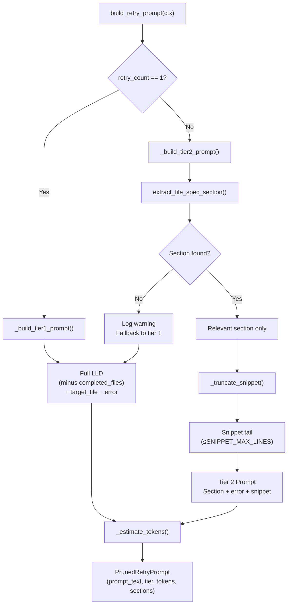

# 642 - Fix: Reduce Retry Prompt Context More Aggressively

<!-- Template Metadata
Last Updated: 2026-02-02
Updated By: Issue #642 fix
Update Reason: Initial LLD for tiered context pruning in build_retry_prompt(); revised to fix test coverage gaps for REQ-2, REQ-6, REQ-8, REQ-9, REQ-10
Previous: N/A - new document
-->

## 1. Context & Goal

* **Issue:** #642
* **Objective:** Implement tiered context pruning in `build_retry_prompt()` so that Retry 2 sends only the relevant LLD file spec section plus the error and a prior-attempt snippet, cutting retry prompt size by 50–60% and reducing per-retry API spend by $0.05–0.10.
* **Status:** Approved (gemini-3.1-pro-preview, 2026-03-06)
* **Related Issues:** N/A

### Open Questions

*Questions that need clarification before or during implementation. Remove when resolved.*

- [ ] Where exactly does `build_retry_prompt()` live? (Assumed: `assemblyzero/workflows/implementation_spec/nodes/` — confirm precise file path before implementation.)
- [ ] Is `retry_count` already tracked in workflow state, or does it need to be added?
- [ ] What is the maximum acceptable snippet length (in tokens or lines) for the previous-attempt excerpt?
- [ ] Should the pruning tier thresholds (retry 1, retry 2+) be configurable via a constant or remain hardcoded for now?

---

## 2. Proposed Changes

*This section is the **source of truth** for implementation. Describe exactly what will be built.*

### 2.1 Files Changed

| File | Change Type | Description |
|------|-------------|-------------|
| `tests/fixtures/retry_prompt/` | Add (Directory) | Directory for fixture files used in retry prompt tests |
| `assemblyzero/workflows/implementation_spec/nodes/retry_prompt_builder.py` | Add | New module containing `build_retry_prompt()` with tiered pruning logic and all helper functions |
| `assemblyzero/workflows/implementation_spec/nodes/__init__.py` | Modify | Export `build_retry_prompt` from the new module |
| `assemblyzero/utils/lld_section_extractor.py` | Add | Utility: `extract_file_spec_section()` that parses an LLD markdown string and returns only the section(s) relevant to a target file |
| `assemblyzero/utils/__init__.py` | Modify | Export `extract_file_spec_section` |
| `tests/unit/test_retry_prompt_builder.py` | Add | Unit tests for `build_retry_prompt()` across all tier cases |
| `tests/unit/test_lld_section_extractor.py` | Add | Unit tests for `extract_file_spec_section()` |
| `tests/fixtures/retry_prompt/full_lld.md` | Add | Sample full LLD (~80K-token equivalent fixture) for pruning tests |
| `tests/fixtures/retry_prompt/minimal_lld.md` | Add | Small LLD fixture that has only one file spec section |

### 2.1.1 Path Validation (Mechanical - Auto-Checked)

*Issue #277: Before human or Gemini review, paths are verified programmatically.*

Mechanical validation automatically checks:
- All "Modify" files must exist in repository
- All "Delete" files must exist in repository
- All "Add" files must have existing parent directories
- No placeholder prefixes (`src/`, `lib/`, `app/`) unless directory exists

**If validation fails, the LLD is BLOCKED before reaching review.**

### 2.2 Dependencies

*No new packages required. All dependencies already present:*

```toml

# Already in pyproject.toml — no additions needed
tiktoken = ">=0.9.0,<1.0.0"   # used for token counting in helpers
```

### 2.3 Data Structures

```python

# assemblyzero/workflows/implementation_spec/nodes/retry_prompt_builder.py

class RetryContext(TypedDict):
    """All information needed to build a retry prompt at any tier."""
    lld_content: str           # Full LLD markdown text
    target_file: str           # Relative path of the file being generated
    error_message: str         # Error/failure reason from the previous attempt
    retry_count: int           # 1-based retry number (1 = first retry, 2 = second retry, etc.)
    previous_attempt_snippet: str | None  # Last N lines of previous attempt output; None on retry 1
    completed_files: list[str] # Already-completed file paths (excluded from all retry tiers)


class PrunedRetryPrompt(TypedDict):
    """Output of build_retry_prompt() — the assembled prompt and metadata."""
    prompt_text: str           # The fully assembled prompt string
    tier: int                  # Which pruning tier was applied (1 or 2)
    estimated_tokens: int      # tiktoken-estimated token count of prompt_text
    context_sections_included: list[str]  # Human-readable list of what was included
```

```python

# assemblyzero/utils/lld_section_extractor.py

class ExtractedSection(TypedDict):
    """Result of extracting a single relevant section from an LLD."""
    section_heading: str       # The markdown heading that matched
    section_body: str          # Full text of that section including heading
    match_confidence: float    # 0.0–1.0: how confident the extractor is this is the right section
```

### 2.4 Function Signatures

```python

# assemblyzero/workflows/implementation_spec/nodes/retry_prompt_builder.py

# Module-level constants
SNIPPET_MAX_LINES: int = 60    # Maximum lines retained from previous attempt snippet
TIER_BOUNDARY: int = 2         # retry_count >= this value triggers Tier 2 pruning

def build_retry_prompt(ctx: RetryContext) -> PrunedRetryPrompt:
    """
    Build a retry prompt applying tiered context pruning.

    Tier 1 (retry_count == 1): Full LLD + target file spec + error.
      Matches current behavior.
    Tier 2 (retry_count >= 2): Relevant file spec section only + error
      + truncated previous attempt snippet.

    Args:
        ctx: RetryContext containing LLD, target file, error, and retry metadata.

    Returns:
        PrunedRetryPrompt with assembled prompt text, tier used, and token estimate.

    Raises:
        ValueError: If retry_count < 1 or required fields are missing.
    """
    ...


def _build_tier1_prompt(ctx: RetryContext) -> str:
    """
    Assemble full-LLD retry prompt (current behavior, Retry 1).

    Drops completed_files from context. Includes full LLD + target file
    section call-out + error message.

    Args:
        ctx: Full RetryContext.

    Returns:
        Assembled prompt string.
    """
    ...


def _build_tier2_prompt(ctx: RetryContext) -> str:
    """
    Assemble minimal retry prompt (Retry 2+).

    Includes only the relevant file spec section extracted from the LLD,
    the error message, and a truncated snippet of the previous attempt.

    Args:
        ctx: Full RetryContext; previous_attempt_snippet must not be None.

    Returns:
        Assembled prompt string.

    Raises:
        ValueError: If previous_attempt_snippet is None on tier 2.
    """
    ...


def _truncate_snippet(snippet: str, max_lines: int = SNIPPET_MAX_LINES) -> str:
    """
    Truncate a previous-attempt snippet to at most max_lines lines.

    Keeps the final max_lines lines (tail) as they are most relevant
    to the failure point.

    Args:
        snippet: Raw previous attempt text.
        max_lines: Maximum number of lines to retain (default: SNIPPET_MAX_LINES).

    Returns:
        Truncated snippet string with a leading ellipsis if lines were dropped.
    """
    ...


def _estimate_tokens(text: str) -> int:
    """
    Estimate token count of text using tiktoken cl100k_base encoding.

    Args:
        text: String to estimate.

    Returns:
        Integer token count estimate.
    """
    ...
```

```python

# assemblyzero/utils/lld_section_extractor.py

def extract_file_spec_section(lld_content: str, target_file: str) -> ExtractedSection | None:
    """
    Parse LLD markdown and extract the section(s) most relevant to target_file.

    Strategy:
      1. Split LLD into heading-delimited sections.
      2. Search each section for explicit mention of target_file (exact path match).
      3. If found, return that section with confidence=1.0.
      4. Fallback: search for the filename stem (without path) in section text;
         return best match with confidence < 1.0.
      5. If nothing matches, return None (caller falls back to tier 1 behavior).

    Args:
        lld_content: Full LLD markdown string.
        target_file: Relative file path being targeted (e.g., "src/foo/bar.py").

    Returns:
        ExtractedSection if a relevant section is found, None otherwise.

    Raises:
        ValueError: If lld_content is empty.
    """
    ...


def _split_lld_into_sections(lld_content: str) -> list[tuple[str, str]]:
    """
    Split LLD markdown into (heading, body) tuples at ## and ### boundaries.

    Args:
        lld_content: Full LLD markdown.

    Returns:
        List of (heading_text, full_section_text_including_heading) tuples.
    """
    ...


def _score_section_for_file(section_text: str, target_file: str) -> float:
    """
    Score how relevant a section is to target_file.

    Scoring rules:
      - Exact path match in section text: 1.0
      - Filename stem match (basename without extension): 0.6
      - Directory name match: 0.3
      - No match: 0.0

    Args:
        section_text: Full text of an LLD section.
        target_file: Target file relative path.

    Returns:
        Float relevance score 0.0–1.0.
    """
    ...
```

### 2.5 Logic Flow (Pseudocode)

```
FUNCTION build_retry_prompt(ctx):
    VALIDATE ctx.retry_count >= 1
    VALIDATE ctx.lld_content is not empty
    VALIDATE ctx.target_file is not empty
    VALIDATE ctx.error_message is not empty

    IF ctx.retry_count == 1 THEN
        tier = 1
        prompt_text = _build_tier1_prompt(ctx)
    ELSE  # retry_count >= 2
        tier = 2
        IF ctx.previous_attempt_snippet is None THEN
            RAISE ValueError("Tier 2 requires previous_attempt_snippet")
        prompt_text = _build_tier2_prompt(ctx)
    END IF

    estimated_tokens = _estimate_tokens(prompt_text)
    RETURN PrunedRetryPrompt(
        prompt_text=prompt_text,
        tier=tier,
        estimated_tokens=estimated_tokens,
        context_sections_included=[...descriptions...]
    )

FUNCTION _build_tier1_prompt(ctx):
    # Current behavior — no completed_files
    lld_without_completed = strip_completed_file_sections(ctx.lld_content, ctx.completed_files)
    RETURN assemble([
        SYSTEM_PREAMBLE_TIER1,
        lld_without_completed,
        TARGET_FILE_HEADER,
        ctx.target_file,
        ERROR_HEADER,
        ctx.error_message,
    ])

FUNCTION _build_tier2_prompt(ctx):
    relevant_section = extract_file_spec_section(ctx.lld_content, ctx.target_file)
    IF relevant_section is None THEN
        # Graceful fallback: no matching section found, use tier 1 behavior
        LOG warning: "Tier 2 section extraction failed; falling back to tier 1 for file={ctx.target_file}"
        RETURN _build_tier1_prompt(ctx)
    END IF
    truncated = _truncate_snippet(ctx.previous_attempt_snippet, max_lines=SNIPPET_MAX_LINES)
    RETURN assemble([
        SYSTEM_PREAMBLE_TIER2,
        SPEC_SECTION_HEADER,
        relevant_section.section_body,
        TARGET_FILE_HEADER,
        ctx.target_file,
        ERROR_HEADER,
        ctx.error_message,
        PREVIOUS_ATTEMPT_HEADER,
        truncated,
    ])

FUNCTION extract_file_spec_section(lld_content, target_file):
    IF lld_content is empty THEN RAISE ValueError
    sections = _split_lld_into_sections(lld_content)
    scored = [(score_section_for_file(body, target_file), heading, full_text)
              FOR (heading, full_text) IN sections]
    best_score, best_heading, best_text = MAX(scored BY score)
    IF best_score == 0.0 THEN RETURN None
    RETURN ExtractedSection(
        section_heading=best_heading,
        section_body=best_text,
        match_confidence=best_score
    )
```

### 2.6 Technical Approach

* **Module:** `assemblyzero/workflows/implementation_spec/nodes/retry_prompt_builder.py`
* **Pattern:** Pure functions with typed inputs/outputs; no side effects; no external calls
* **Key Decisions:**
  - Tiering is determined solely by `retry_count`; no configuration needed for initial implementation
  - Section extraction uses string scanning (no embeddings/RAG) — fast, zero-cost, no dependency addition
  - Tier 2 falls back to Tier 1 behavior if section extraction yields no match, ensuring correctness is never sacrificed for token savings
  - `tiktoken` (already a project dependency) provides token estimates for logging/observability only; it does not gate execution

### 2.7 Architecture Decisions

| Decision | Options Considered | Choice | Rationale |
|----------|-------------------|--------|-----------|
| Tier threshold | 2-tier (retry 1 / retry 2+), 3-tier, continuous degradation | 2-tier | Issue specifies exactly two behaviors; additional tiers add complexity without evidence of value |
| Section extraction strategy | Regex/string scan, RAG/vector search, LLM summarization | Regex/string scan | Zero latency, zero cost, no new dependencies; LLD sections are well-structured markdown with explicit file paths |
| Fallback on extraction failure | Raise error, silently use tier 1, warn and use tier 1 | Warn and use tier 1 | Correctness > savings; degrading gracefully prevents workflow interruption |
| Snippet truncation strategy | Head (first N lines), tail (last N lines), middle omission | Tail (last N lines) | Failure context is most concentrated near the end of the previous attempt |
| Token estimation | tiktoken, char/4 heuristic, none | tiktoken (cl100k_base) | Already a project dependency; provides accurate estimates for logging |
| Constants location | Config file, env vars, module-level constants | Module-level constants `SNIPPET_MAX_LINES`, `TIER_BOUNDARY` | Simple, discoverable, sufficient for initial implementation; can be promoted to config later |

**Architectural Constraints:**
- Must not introduce new package dependencies
- Must not call any external API during prompt assembly
- Must remain a pure function (no I/O side effects) so it is trivially testable
- Must preserve existing Tier 1 behavior exactly — no behavioral change for `retry_count == 1`

---

## 3. Requirements

1. `build_retry_prompt()` with `retry_count=1` must produce output semantically equivalent to current behavior (full LLD minus completed files, plus target file and error).
2. `build_retry_prompt()` with `retry_count>=2` must produce a prompt containing only the relevant LLD section, the error, and a truncated previous-attempt snippet — no full LLD.
3. Tier 2 token count must be ≤50% of an equivalent Tier 1 prompt token count for a representative 80K-token LLD (verified by unit test with fixture).
4. If `extract_file_spec_section()` returns `None`, `build_retry_prompt()` must fall back to Tier 1 behavior and emit a warning log; it must not raise an exception.
5. `_truncate_snippet()` must cap output at `SNIPPET_MAX_LINES` (default 60) lines; if the input is shorter, it must be returned unchanged.
6. All functions in `retry_prompt_builder.py` and `lld_section_extractor.py` must have complete type annotations (verified by mypy with no errors).
7. `extract_file_spec_section()` must return confidence=1.0 when the target file's exact relative path appears in a section, and a lower score otherwise.
8. Unit test coverage for new modules must be ≥95% (measured by pytest-cov).
9. No new runtime dependencies may be added to `pyproject.toml`.
10. The implementation workflow's call site must pass `retry_count` and `previous_attempt_snippet` from existing workflow state; if `retry_count` is not yet tracked in state, it must be added as an integer field defaulting to 0.

---

## 4. Alternatives Considered

| Option | Pros | Cons | Decision |
|--------|------|------|----------|
| **Tiered pruning (this LLD)** | Targeted savings; preserves full context on first retry; easy to reason about | Requires section extraction logic; fallback path needed | **Selected** |
| Uniform 50% truncation of LLD on every retry | Simple; no extraction needed | Arbitrary truncation may drop critical spec; harder to predict what is lost | Rejected |
| RAG-based relevant context injection | Most precise; could pull only the exact relevant chunks | Requires RAG infrastructure at prompt-build time; adds latency and cost overhead | Rejected |
| LLM-summarized LLD on retry 2 | Compact, semantically complete summary | Costs an additional LLM call to summarize; defeats purpose of saving tokens | Rejected |
| Remove full LLD from all retries (not just retry 2+) | Maximum savings | First retry has no history of failure; full context on retry 1 is still valuable | Rejected |

**Rationale:** The two-tier approach directly implements the issue specification, is the simplest change that achieves the stated 50–60% token reduction on retry 2, and introduces a clean fallback so correctness is guaranteed.

---

## 5. Data & Fixtures

### 5.1 Data Sources

| Attribute | Value |
|-----------|-------|
| Source | Synthetic — crafted markdown files |
| Format | Markdown (`.md`) |
| Size | `full_lld.md` ~400 lines; `minimal_lld.md` ~50 lines |
| Refresh | Static fixtures; updated manually if LLD template changes |
| Copyright/License | Internal; no third-party data |

### 5.2 Data Pipeline

```
tests/fixtures/retry_prompt/*.md ──(read by pytest)──► test functions ──(assert on)──► PrunedRetryPrompt
```

### 5.3 Test Fixtures

| Fixture | Source | Notes |
|---------|--------|-------|
| `tests/fixtures/retry_prompt/full_lld.md` | Handcrafted to mirror real LLD structure | Must contain ≥5 distinct `##` sections with explicit file paths |
| `tests/fixtures/retry_prompt/minimal_lld.md` | Handcrafted, single file spec section | Tests extraction with unambiguous match |
| Inline dict fixtures in `test_retry_prompt_builder.py` | Hardcoded `RetryContext` dicts | For edge cases (missing snippet, retry_count=0, etc.) |

### 5.4 Deployment Pipeline

Pure Python logic — no data deployment required. Fixture files are committed alongside tests and require no environment setup.

---

## 6. Diagram

### 6.1 Mermaid Quality Gate

- [ ] **Simplicity:** Similar components collapsed
- [ ] **No touching:** All elements have visual separation
- [ ] **No hidden lines:** All arrows fully visible
- [ ] **Readable:** Labels not truncated, flow direction clear
- [ ] **Auto-inspected:** Agent rendered via mermaid.ink and viewed

**Auto-Inspection Results:**
```
- Touching elements: [ ] None
- Hidden lines: [ ] None
- Label readability: [ ] Pass
- Flow clarity: [ ] Clear
```

### 6.2 Diagram



---

## 7. Security & Safety Considerations

### 7.1 Security

| Concern | Mitigation | Status |
|---------|------------|--------|
| LLD content could contain secrets embedded by previous workflow stages | `build_retry_prompt()` performs no secret scanning — this is out of scope and handled upstream; document explicitly | Addressed |
| Snippet from previous attempt could contain partial credentials if the file being generated was a config file | Same upstream responsibility; retry prompt builder is not a secrets-sanitization boundary | Addressed |
| Regex section extraction could be confused by adversarial LLD content | Extraction is purely additive (worst case: falls back to tier 1); no code execution risk | Addressed |

### 7.2 Safety

| Concern | Mitigation | Status |
|---------|------------|--------|
| Section extraction failure causes silent wrong output | Explicit fallback to tier 1 + warning log; never silently drops essential context | Addressed |
| Snippet truncation drops the actual error-relevant code | Tail truncation preserves the end of the attempt (closest to failure); max_lines=60 is generous | Addressed |
| Tier 2 used when previous_attempt_snippet is None | `_build_tier2_prompt()` raises `ValueError`; `build_retry_prompt()` validates before dispatch | Addressed |
| tiktoken encoding failure on unusual content | Wrap `_estimate_tokens()` in try/except; return `−1` sentinel if encoding fails; token estimate is non-critical (logging only) | Addressed |

**Fail Mode:** Fail Closed with fallback — if tier 2 cannot extract a section, the system falls back to tier 1 (larger but correct). The workflow never receives a malformed or empty prompt.

**Recovery Strategy:** Any `ValueError` from `build_retry_prompt()` propagates to the workflow node, which handles it the same as any other node failure (existing retry/abort logic).

---

## 8. Performance & Cost Considerations

### 8.1 Performance

| Metric | Budget | Approach |
|--------|--------|----------|
| `build_retry_prompt()` wall time | < 100ms | Pure string operations + tiktoken; no I/O |
| `extract_file_spec_section()` wall time | < 20ms | Single-pass markdown split + string search |
| Memory overhead | < 5MB | No copies larger than the LLD itself |

**Bottlenecks:** None anticipated. LLDs are typically <1MB of text. tiktoken encoding is the slowest step (~10ms for 80K tokens); acceptable for a one-time prompt assembly.

### 8.2 Cost Analysis

| Resource | Unit Cost | Estimated Usage | Monthly Cost |
|----------|-----------|-----------------|--------------|
| Tier 2 retry prompt tokens (input) | ~$0.003/1K tokens (Anthropic API) | ~40K tokens saved per retry × N retries/day | Savings: $0.05–0.10 per retry |
| tiktoken CPU for token estimation | $0 | Negligible | $0 |

**Cost Controls:**
- [ ] No budget alerts needed — this change reduces cost
- [ ] Tier 2 cutoff is a hard code boundary, not a probability; no runaway behavior
- [ ] Fallback to tier 1 does not add cost beyond the baseline

**Worst-Case Scenario:** Every retry 2+ falls back to tier 1 (section not found). In this case, zero savings are realized but zero regression occurs. This is the same cost as today.

---

## 9. Legal & Compliance

| Concern | Applies? | Mitigation |
|---------|----------|------------|
| PII/Personal Data | No | LLD content is internal engineering documentation |
| Third-Party Licenses | No | No new dependencies introduced |
| Terms of Service | No | Reduces API token usage; strictly within ToS |
| Data Retention | No | No new data stored; prompt assembly is ephemeral |
| Export Controls | No | Pure text processing utility |

**Data Classification:** Internal

**Compliance Checklist:**
- [x] No PII stored without consent
- [x] All third-party licenses compatible with project license
- [x] External API usage compliant with provider ToS
- [x] Data retention policy documented

---

## 10. Verification & Testing

### 10.0 Test Plan (TDD - Complete Before Implementation)

**TDD Requirement:** Tests MUST be written and failing BEFORE implementation begins.

| Test ID | Test Description | Expected Behavior | Status |
|---------|------------------|-------------------|--------|
| T010 | `build_retry_prompt` retry_count=1 returns full LLD minus completed files | Prompt contains full LLD text; tier=1 | RED |
| T020 | `build_retry_prompt` retry_count=2 returns section-only prompt | Prompt does NOT contain full LLD; contains only relevant section; tier=2 | RED |
| T030 | Tier 2 prompt is ≤50% tokens of tier 1 prompt for same context | `estimated_tokens` in tier 2 ≤ 0.50 × tier 1 for full_lld.md fixture | RED |
| T040 | Tier 2 fallback when section not found | Falls back to tier 1 behavior; emits warning | RED |
| T050 | `build_retry_prompt` raises ValueError when retry_count < 1 | ValueError raised | RED |
| T060 | `build_retry_prompt` raises ValueError when retry_count=2 and snippet is None | ValueError raised | RED |
| T070 | `_truncate_snippet` truncates to max_lines | Output has ≤max_lines lines; leading ellipsis present | RED |
| T080 | `_truncate_snippet` returns unchanged when input ≤max_lines | Output equals input exactly | RED |
| T090 | `extract_file_spec_section` exact path match returns confidence=1.0 | confidence == 1.0; correct section body returned | RED |
| T100 | `extract_file_spec_section` stem match returns confidence<1.0 | 0.0 < confidence < 1.0 | RED |
| T110 | `extract_file_spec_section` no match returns None | Returns None | RED |
| T120 | `extract_file_spec_section` raises ValueError on empty lld_content | ValueError raised | RED |
| T130 | `_estimate_tokens` returns positive int for non-empty string | Result > 0 | RED |
| T140 | `_estimate_tokens` returns 0 or handles empty string gracefully | No exception; returns 0 | RED |
| T150 | `build_retry_prompt` completed_files excluded from tier 1 prompt | Excluded file names absent from prompt text | RED |
| T160 | All functions in retry_prompt_builder have complete type annotations | mypy reports zero errors on the module | RED |
| T170 | All functions in lld_section_extractor have complete type annotations | mypy reports zero errors on the module | RED |
| T180 | pytest-cov reports ≥95% line coverage for retry_prompt_builder | Coverage report shows ≥95% | RED |
| T190 | pytest-cov reports ≥95% line coverage for lld_section_extractor | Coverage report shows ≥95% | RED |
| T200 | No new entries added to pyproject.toml dependencies section | pyproject.toml diff contains no new runtime dependency lines | RED |
| T210 | Workflow state TypedDict includes retry_count integer field defaulting to 0 | Field present in state definition; default value is 0 | RED |
| T220 | Workflow call site passes retry_count to build_retry_prompt | Integration test verifies retry_count flows from state into RetryContext | RED |

**Coverage Target:** ≥95% for all new code

**TDD Checklist:**
- [ ] All tests written before implementation
- [ ] Tests currently RED (failing)
- [ ] Test IDs match scenario IDs in 10.1
- [ ] Test file created at: `tests/unit/test_retry_prompt_builder.py`
- [ ] Test file created at: `tests/unit/test_lld_section_extractor.py`

### 10.1 Test Scenarios

| ID | Scenario | Type | Input | Expected Output | Pass Criteria |
|----|----------|------|-------|-----------------|---------------|
| 010 | Happy path tier 1 (REQ-1) | Auto | `RetryContext(retry_count=1, lld=full_lld, ...)` | `PrunedRetryPrompt(tier=1)` | tier==1; prompt contains LLD text |
| 020 | Happy path tier 2 (REQ-2) | Auto | `RetryContext(retry_count=2, lld=full_lld, snippet="...", ...)` | `PrunedRetryPrompt(tier=2)` | tier==2; prompt lacks bulk of LLD; contains relevant section, error, and snippet |
| 030 | Token reduction ≥50% (REQ-3) | Auto | Same context; compare tier 1 vs tier 2 token estimates | tier2.estimated_tokens ≤ 0.5 × tier1.estimated_tokens | Numeric assertion passes |
| 040 | Fallback on no section (REQ-4) | Auto | LLD with no mention of target_file; retry_count=2 | tier==1 fallback; warning logged | tier==1; no exception |
| 050 | Invalid retry_count=0 (REQ-1) | Auto | `RetryContext(retry_count=0, ...)` | `ValueError` | Exception raised with descriptive message |
| 060 | Tier 2, snippet None (REQ-2) | Auto | `RetryContext(retry_count=2, previous_attempt_snippet=None, ...)` | `ValueError` | Exception raised |
| 070 | Snippet longer than max_lines (REQ-5) | Auto | snippet with 200 lines | Truncated to SNIPPET_MAX_LINES; starts with "..." | len(output.splitlines()) ≤ SNIPPET_MAX_LINES |
| 080 | Snippet shorter than max_lines (REQ-5) | Auto | snippet with 5 lines | Unchanged | output == input |
| 090 | Section extraction exact match (REQ-7) | Auto | LLD containing `assemblyzero/foo/bar.py`; target=`assemblyzero/foo/bar.py` | confidence==1.0 | Assertion passes |
| 100 | Section extraction stem match (REQ-7) | Auto | LLD containing `bar.py` but not full path; target=`assemblyzero/foo/bar.py` | 0.0 < confidence < 1.0 | Assertion passes |
| 110 | Section extraction no match (REQ-7) | Auto | LLD with no mention of target file or stem | None | Returns None |
| 120 | Empty LLD raises ValueError (REQ-7) | Auto | `lld_content=""` | `ValueError` | Exception raised |
| 130 | Token estimate positive (REQ-3) | Auto | `"Hello world"` | int > 0 | Assertion passes |
| 140 | Token estimate empty string (REQ-3) | Auto | `""` | 0 or no exception | No crash; result ≥ 0 |
| 150 | Completed files excluded tier 1 (REQ-1) | Auto | `completed_files=["assemblyzero/done.py"]`; retry_count=1 | `"done.py"` not in prompt_text | String search passes |
| 160 | Type annotations complete — retry_prompt_builder (REQ-6) | Auto | Run `mypy assemblyzero/workflows/implementation_spec/nodes/retry_prompt_builder.py --strict` | Exit code 0; zero errors reported | mypy passes with no errors |
| 170 | Type annotations complete — lld_section_extractor (REQ-6) | Auto | Run `mypy assemblyzero/utils/lld_section_extractor.py --strict` | Exit code 0; zero errors reported | mypy passes with no errors |
| 180 | Coverage ≥95% retry_prompt_builder (REQ-8) | Auto | Run pytest-cov on retry_prompt_builder module | Coverage report line% ≥ 95 | pytest-cov assertion passes |
| 190 | Coverage ≥95% lld_section_extractor (REQ-8) | Auto | Run pytest-cov on lld_section_extractor module | Coverage report line% ≥ 95 | pytest-cov assertion passes |
| 200 | No new runtime dependencies added (REQ-9) | Auto | Read `pyproject.toml` dependencies section before and after; diff | Diff is empty (no new lines in `[project.dependencies]`) | Automated diff assertion passes |
| 210 | Workflow state includes retry_count field (REQ-10) | Auto | Inspect workflow state TypedDict definition; verify field presence and default | `retry_count: int` present with default `0` | AST/import assertion passes |
| 220 | Workflow call site passes retry_count and previous_attempt_snippet (REQ-10) | Auto | Unit test that constructs a minimal workflow state with retry_count=2 and invokes the call site wrapper; assert RetryContext fields populated | `RetryContext.retry_count == state.retry_count`; `RetryContext.previous_attempt_snippet == state.previous_attempt_snippet` | Field-equality assertions pass |

### 10.2 Test Commands

```bash

# Run all new unit tests
poetry run pytest tests/unit/test_retry_prompt_builder.py tests/unit/test_lld_section_extractor.py -v

# Run with coverage
poetry run pytest tests/unit/test_retry_prompt_builder.py tests/unit/test_lld_section_extractor.py -v \
  --cov=assemblyzero/workflows/implementation_spec/nodes/retry_prompt_builder \
  --cov=assemblyzero/utils/lld_section_extractor \
  --cov-report=term-missing

# Type-check new modules (REQ-6)
poetry run mypy assemblyzero/workflows/implementation_spec/nodes/retry_prompt_builder.py \
  assemblyzero/utils/lld_section_extractor.py --strict

# Verify no new runtime dependencies added (REQ-9)
git diff pyproject.toml | grep '^\+' | grep -v 'dev\|test\|pytest\|mypy' | grep -v '^+++' || echo "PASS: no new runtime deps"

# Run full unit suite (confirm no regressions)
poetry run pytest tests/unit/ -v -m "not integration and not e2e and not adversarial"
```

### 10.3 Manual Tests (Only If Unavoidable)

**N/A - All scenarios automated.**

---

## 11. Risks & Mitigations

| Risk | Impact | Likelihood | Mitigation |
|------|--------|------------|------------|
| `retry_count` not present in existing workflow state | High | Medium | Audit workflow state TypedDict before implementation; add field if absent with default=0 (REQ-10) |
| Section extraction misidentifies a section for a similarly-named file | Medium | Low | Exact path match scores 1.0 and beats any stem match; test with ambiguous fixture |
| Tier 2 prompt still too large if the matched section is itself very long | Medium | Low | Log `estimated_tokens`; if section > 50% of full LLD, consider adding a section truncation step in a follow-up issue |
| Fallback to tier 1 masks a bug in section extraction | Low | Low | Fallback emits a WARNING-level log; can be monitored via existing telemetry |
| tiktoken version incompatibility with future Anthropic model vocabularies | Low | Low | Token estimate is used for logging only; not a functional gate; no correctness risk |
| Existing callers of `build_retry_prompt()` have different signatures | High | Unknown | Requires discovery of all call sites before implementation; confirmed in Open Questions |
| mypy strict mode reveals unannotated helpers in existing modules imported by new code | Medium | Low | Scope mypy check to only the two new files; fix any discovered gaps before merge |

---

## 12. Definition of Done

### Code
- [ ] `assemblyzero/workflows/implementation_spec/nodes/retry_prompt_builder.py` implemented and passing all tests
- [ ] `assemblyzero/utils/lld_section_extractor.py` implemented and passing all tests
- [ ] `__init__.py` exports updated for both modules
- [ ] All functions have complete type annotations (mypy --strict passes on both new modules)
- [ ] Module-level constants `SNIPPET_MAX_LINES` and `TIER_BOUNDARY` defined and documented
- [ ] Code comments reference this LLD (#642)

### Tests
- [ ] All 22 test scenarios (010–220) pass
- [ ] Coverage ≥95% for both new modules (pytest-cov verified)
- [ ] Existing `tests/unit/` suite passes with no regressions
- [ ] mypy type-check passes for both new modules (scenarios 160, 170)

### Documentation
- [ ] LLD updated with any deviations discovered during implementation
- [ ] Implementation Report completed
- [ ] Test Report completed

### Review
- [ ] Code review completed
- [ ] User approval before closing issue #642

### 12.1 Traceability (Mechanical - Auto-Checked)

*Issue #277: Cross-references are verified programmatically.*

Files referenced in Definition of Done and their presence in Section 2.1:

| File | In Section 2.1? |
|------|----------------|
| `assemblyzero/workflows/implementation_spec/nodes/retry_prompt_builder.py` | [PASS] Add |
| `assemblyzero/workflows/implementation_spec/nodes/__init__.py` | [PASS] Modify |
| `assemblyzero/utils/lld_section_extractor.py` | [PASS] Add |
| `assemblyzero/utils/__init__.py` | [PASS] Modify |
| `tests/unit/test_retry_prompt_builder.py` | [PASS] Add |
| `tests/unit/test_lld_section_extractor.py` | [PASS] Add |

**If files are missing from Section 2.1, the LLD is BLOCKED.**

---

## Appendix: Review Log

### Gemini Review #1 (PENDING)

**Reviewer:** Gemini
**Verdict:** PENDING

#### Comments

| ID | Comment | Implemented? |
|----|---------|--------------|
| G1.1 | (awaiting review) | PENDING |

### Review Summary

| Review | Date | Verdict | Key Issue |
|--------|------|---------|-----------|
| 1 | 2026-03-06 | APPROVED | `gemini-3.1-pro-preview` |
| Gemini #1 | (auto) | PENDING | — |

**Final Status:** APPROVED