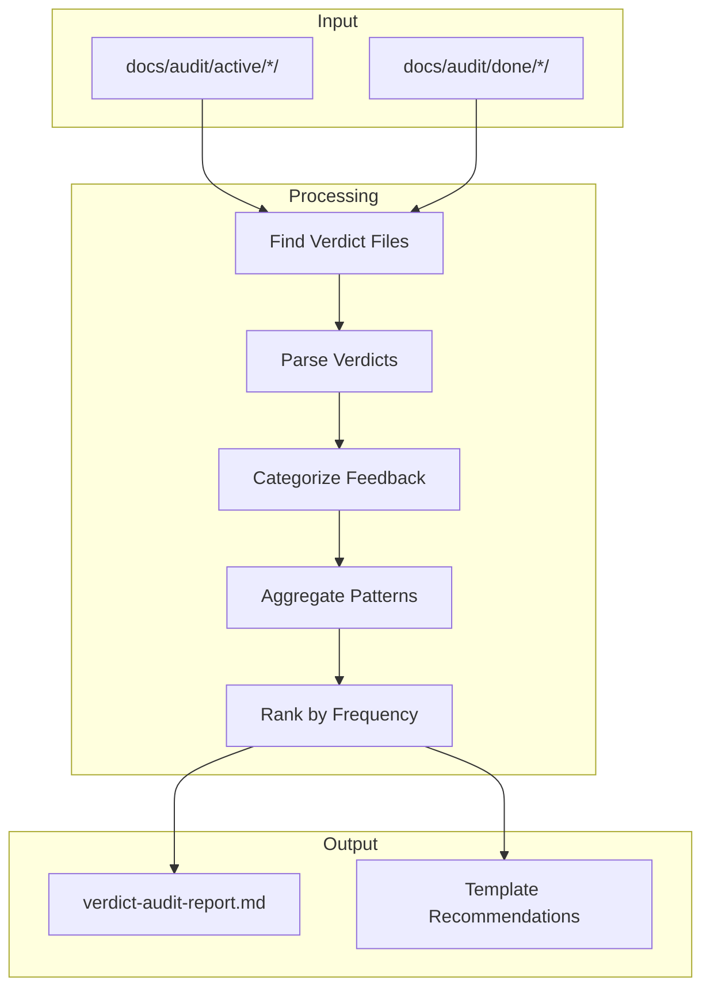

# 177 - Feature: Improve Issue Template Based on Gemini Verdict Analysis

<!-- Template Metadata
Last Updated: 2025-01-XX
Updated By: Revision based on Gemini Review #2
Update Reason: Address regex timeout claim, move Requirement 8 to Success Metrics, achieve >95% coverage
-->

## 1. Context & Goal
* **Issue:** #77
* **Objective:** Analyze historical Gemini verdicts to identify common feedback patterns, then revise the issue template (0101) to preemptively address those patterns.
* **Status:** Draft
* **Related Issues:** None

### Open Questions
*Questions that need clarification before or during implementation. Remove when resolved.*

- [ ] Are there any verdict files in non-standard locations that should be included?
- [ ] What minimum sample size is needed before findings are considered statistically meaningful?

## 2. Proposed Changes

*This section is the **source of truth** for implementation. Describe exactly what will be built.*

### 2.1 Files Changed

| File | Change Type | Description |
|------|-------------|-------------|
| `tools/audit_verdicts.py` | Add | New script to analyze verdict files and generate audit report |
| `docs/reports/verdict-audit-report.md` | Add | Report documenting findings and recommendations |
| `docs/templates/0101-issue-template.md` | Modify | Revised template with improvements based on audit |
| `docs/0003-file-inventory.md` | Modify | Add new files to inventory |
| `tests/test_audit_verdicts.py` | Add | Automated tests for audit tool |
| `tests/test_template_structure.py` | Add | Automated tests for template content verification |

### 2.2 Dependencies

*New packages, APIs, or services required.*

```toml
# pyproject.toml additions (if any)
# None - uses standard library only
```

### 2.3 Data Structures

```python
# Pseudocode - NOT implementation
class VerdictFeedback(TypedDict):
    file_path: str          # Path to verdict file
    verdict: str            # APPROVED, REJECTED, FEEDBACK
    tier: str               # PRE_FLIGHT, TIER_1, TIER_2, TIER_3
    category: str           # missing_section, vague_requirements, etc.
    text: str               # Original feedback text
    issue_id: Optional[str] # Related issue if extractable

class FeedbackPattern(TypedDict):
    category: str           # Category name
    count: int              # Occurrence count
    examples: list[str]     # Representative examples (max 3)
    recommendation: str     # Suggested template improvement

class AuditReport(TypedDict):
    total_verdicts: int
    verdicts_by_outcome: dict[str, int]
    patterns: list[FeedbackPattern]
    generated_at: str       # ISO timestamp

class TemplateRequirements(TypedDict):
    required_checklists: list[str]    # Checklist section headers
    tips_section_keywords: list[str]  # Keywords expected in Tips section
    minimum_checklist_count: int      # Minimum number of new checklists (3)
```

### 2.4 Function Signatures

```python
# Signatures only - implementation in source files

# tools/audit_verdicts.py
def find_verdict_files(base_path: Path) -> list[Path]:
    """Discover all verdict files in audit directories."""
    ...

def parse_verdict_file(file_path: Path) -> list[VerdictFeedback]:
    """Extract feedback items from a single verdict file."""
    ...

def categorize_feedback(feedback: VerdictFeedback) -> str:
    """Classify feedback into predefined categories."""
    ...

def generate_audit_report(patterns: list[FeedbackPattern]) -> str:
    """Generate markdown report from analyzed patterns."""
    ...

def main() -> int:
    """Entry point - returns exit code."""
    ...

# tests/test_template_structure.py
def parse_template_checklists(template_path: Path) -> list[str]:
    """Extract checklist sections from template file."""
    ...

def parse_tips_section(template_path: Path) -> str:
    """Extract Tips for Good Issues section content."""
    ...

def verify_inventory_entry(inventory_path: Path, file_path: str) -> bool:
    """Check if a file path exists in the file inventory."""
    ...
```

### 2.5 Logic Flow (Pseudocode)

```
1. Parse command-line arguments (--help, --output)
2. Check if docs/audit/ directory exists
   IF NOT EXISTS THEN
   - Print "Audit directory not found: docs/audit/. Create directory structure before running audit."
   - Return Exit Code 0
3. Create docs/reports/ directory if it doesn't exist
4. Scan for verdict files in docs/audit/active/*/ and docs/audit/done/*/
   IF NO FILES FOUND THEN
   - Print "No verdict files found. Expected locations: docs/audit/active/*, docs/audit/done/*"
   - Return Exit Code 0
5. FOR EACH verdict file:
   - Pre-validate line lengths (reject lines > 10KB to prevent regex issues)
   - Parse markdown structure
   - Extract feedback items by tier
   - Categorize each item
   - Store in collection
   - ON PARSE ERROR: Log warning, skip file, continue
6. Aggregate feedback by category
7. Rank by frequency (deterministic tie-breaking by category name)
8. Select top 10 patterns
9. Extract representative examples for each
10. Generate recommendations based on patterns
11. Write report atomically (temp file then rename) to docs/reports/verdict-audit-report.md
12. Return Exit Code 0
```

### 2.6 Technical Approach

* **Module:** `tools/audit_verdicts.py`
* **Pattern:** Pipeline pattern (discover → parse → categorize → aggregate → report)
* **Key Decisions:** 
  - Standard library only (no external dependencies)
  - Regex-based parsing for flexibility with verdict format variations
  - Keyword-based categorization for simplicity
  - Template validation via automated content parsing

### 2.7 Architecture Decisions

| Decision | Options Considered | Choice | Rationale |
|----------|-------------------|--------|-----------|
| Parsing approach | Structured parser, Regex, LLM extraction | Regex | Simple, no dependencies, handles format variations |
| Categorization | ML classifier, Rule-based, LLM | Rule-based | Deterministic, fast, interpretable results |
| Report format | JSON, Markdown, HTML | Markdown | Consistent with project conventions, human-readable |
| Exit code semantics | Error codes for edge cases, Always 0 for non-errors | Always 0 | Issue specifies Exit Code 0 for empty/missing scenarios |
| Template validation | Manual review, Automated content parsing | Automated | Ensures reproducible verification, supports TDD |
| Regex safety | Timeouts, Input limits, Pre-validation | Input limits + Pre-validation | Python `re` doesn't support timeouts; length limits prevent catastrophic backtracking |
| Tie-breaking for ranks | Random, First-seen, Alphabetical | Alphabetical by category | Deterministic output for reproducible tests |

**Architectural Constraints:**
- Must work with existing verdict file format (markdown with tier headers)
- Must not require network access or external services
- Must produce actionable output for template revision
- Template changes must be verifiable via automated tests
- Cannot use regex timeouts (Python `re` module limitation)

## 3. Requirements

*What must be true when this is done. These become acceptance criteria.*

1. Script discovers all verdict files in `docs/audit/active/*/` and `docs/audit/done/*/`
2. Script handles missing directory gracefully with informative message
3. Script handles empty directories gracefully with informative message
4. Audit report identifies and ranks top 5-10 common feedback patterns
5. Each pattern includes frequency count and at least one example
6. Revised template includes at least 3 new validation checklists
7. Template "Tips for Good Issues" section expanded with Gemini-derived guidance
8. All new files added to file inventory

## 4. Alternatives Considered

| Option | Pros | Cons | Decision |
|--------|------|------|----------|
| Regex-based parsing | Simple, no deps, handles variations | May miss complex patterns | **Selected** |
| LLM-assisted extraction | More accurate, handles natural language | Requires API, adds cost, non-deterministic | Rejected |
| Structured YAML verdicts | Precise parsing, no ambiguity | Requires verdict format migration | Rejected |
| Manual template validation | Human judgment for quality | Not reproducible, not TDD-compatible | Rejected |
| Automated content verification | Reproducible, supports CI | Limited to structural checks | **Selected** |
| Regex timeouts for safety | Prevents hangs | Not supported by Python `re` module | Rejected |
| Input length limits | Simple, effective | May skip very long lines | **Selected** |

**Rationale:** Regex parsing balances simplicity with effectiveness. Verdict files have consistent structure (markdown with tier headers) that regex can reliably extract. Avoiding external dependencies keeps the tool portable and fast. Automated template verification enables TDD and CI integration. Input length limits provide regex safety without requiring third-party libraries.

## 5. Data & Fixtures

*Per [0108-lld-pre-implementation-review.md](0108-lld-pre-implementation-review.md) - complete this section BEFORE implementation.*

### 5.1 Data Sources

| Attribute | Value |
|-----------|-------|
| Source | Local filesystem: `docs/audit/active/*/`, `docs/audit/done/*/` |
| Format | Markdown files (verdict format) |
| Size | Varies by repo history (typically 10-100 files) |
| Refresh | Manual - run on demand |
| Copyright/License | Internal project files, no external licensing |

### 5.2 Data Pipeline

```
docs/audit/*/ ──glob──► Verdict Files ──regex──► Feedback Items ──rules──► Categories ──counter──► Patterns ──template──► Report.md
```

### 5.3 Test Fixtures

| Fixture | Source | Notes |
|---------|--------|-------|
| Sample verdict (APPROVED) | Generated | Minimal feedback, passes gate |
| Sample verdict (REJECTED) | Generated | Multiple blocking issues |
| Sample verdict (mixed tiers) | Generated | Feedback across all tiers |
| Empty directory structure | Generated | Tests graceful handling |
| Malformed verdict file | Generated | Tests regex robustness |
| Template baseline | Snapshot | Current template for comparison |
| Template with new checklists | Generated | Expected post-revision state |

### 5.4 Deployment Pipeline

No deployment required - this is a local development tool. Output report is committed to repository.

## 6. Diagram

### 6.1 Mermaid Quality Gate

Before finalizing any diagram, verify in [Mermaid Live Editor](https://mermaid.live) or GitHub preview:

- [x] **Simplicity:** Similar components collapsed (per 0006 §8.1)
- [x] **No touching:** All elements have visual separation (per 0006 §8.2)
- [x] **No hidden lines:** All arrows fully visible (per 0006 §8.3)
- [x] **Readable:** Labels not truncated, flow direction clear
- [ ] **Auto-inspected:** Agent rendered via mermaid.ink and viewed (per 0006 §8.5)

**Agent Auto-Inspection (MANDATORY):**

*To be completed during implementation phase.*

**Auto-Inspection Results:**
```
- Touching elements: [ ] None / [ ] Found: ___
- Hidden lines: [ ] None / [ ] Found: ___
- Label readability: [ ] Pass / [ ] Issue: ___
- Flow clarity: [ ] Clear / [ ] Issue: ___
```

*Reference: [0006-mermaid-diagrams.md](0006-mermaid-diagrams.md)*

### 6.2 Diagram



## 7. Security & Safety Considerations

### 7.1 Security

| Concern | Mitigation | Status |
|---------|------------|--------|
| Path traversal | Use pathlib with strict path validation | Addressed |
| File injection | Only process .md files in expected directories | Addressed |
| Output injection | Sanitize examples before embedding in report | Addressed |

### 7.2 Safety

| Concern | Mitigation | Status |
|---------|------------|--------|
| Data loss | Script only reads files, writes to designated report directory | Addressed |
| Runaway process | Linear file processing with bounded input | Addressed |
| Corrupted output | Atomic write with temp file | Addressed |
| Regex catastrophic backtracking | Pre-validate line lengths (max 10KB per line); use non-greedy patterns; validate markdown structure before regex | Addressed |

**Fail Mode:** Fail Closed - Script exits with message rather than producing partial output

**Recovery Strategy:** Re-run script; no persistent state to corrupt

## 8. Performance & Cost Considerations

### 8.1 Performance

| Metric | Budget | Approach |
|--------|--------|----------|
| Execution time | < 5 seconds | Sequential file processing, regex parsing |
| Memory | < 50MB | Process files individually, don't load all in memory |
| Disk I/O | Minimal | Single pass read, single write |

**Bottlenecks:** Large numbers of verdict files (>1000) could slow execution. Acceptable for expected scale.

### 8.2 Cost Analysis

| Resource | Unit Cost | Estimated Usage | Monthly Cost |
|----------|-----------|-----------------|--------------|
| Local compute | $0 | On-demand | $0 |
| Storage | $0 | ~10KB report | $0 |

**Cost Controls:**
- [x] No external API calls
- [x] No cloud resources required
- [x] Local execution only

**Worst-Case Scenario:** N/A - purely local tool with bounded input

## 9. Legal & Compliance

| Concern | Applies? | Mitigation |
|---------|----------|------------|
| PII/Personal Data | No | Verdict files contain technical feedback only |
| Third-Party Licenses | No | Standard library only |
| Terms of Service | N/A | No external services |
| Data Retention | No | Output is project documentation |
| Export Controls | No | No restricted algorithms |

**Data Classification:** Internal

**Compliance Checklist:**
- [x] No PII stored without consent
- [x] All third-party licenses compatible with project license
- [x] External API usage compliant with provider ToS
- [x] Data retention policy documented

## 10. Verification & Testing

*Ref: [0005-testing-strategy-and-protocols.md](0005-testing-strategy-and-protocols.md)*

**Testing Philosophy:** All test scenarios automated. No manual tests required.

### 10.1 Test Scenarios

| ID | Scenario | Type | Input | Expected Output | Pass Criteria |
|----|----------|------|-------|-----------------|---------------|
| 010 | Directory missing | Auto | Non-existent docs/audit/ | Exit 0, specific message | Stdout contains expected message |
| 020 | Empty directories | Auto | Empty active/done dirs | Exit 0, specific message | Stdout contains expected message |
| 030 | Single verdict file | Auto | One verdict with 3 items | Report with 3 categorized items | Report contains all items |
| 040 | Multiple verdict files | Auto | 5 verdicts, various tiers | Aggregated report | Patterns correctly counted |
| 050 | REJECTED verdict parsing | Auto | Verdict with REJECTED status | Pre-Flight failure extracted | Blocking issues captured |
| 060 | Tier extraction | Auto | Verdict with all tiers | Items tagged by tier | Correct tier assignment |
| 070 | Category classification | Auto | Known feedback patterns | Correct category assignment | 90%+ accuracy on known patterns |
| 080 | Report generation | Auto | Analyzed patterns | Valid markdown report | Report renders correctly |
| 090 | Help output | Auto | --help flag | Usage documentation | Help text displayed |
| 100 | Template checklist count | Auto | Revised template file | ≥3 new validation checklists | parse_template_checklists() returns ≥3 new items |
| 110 | Template tips section expanded | Auto | Revised template file | Tips section contains Gemini-derived keywords | parse_tips_section() contains expected patterns |
| 120 | File inventory updated | Auto | docs/0003-file-inventory.md | Contains entries for new files | verify_inventory_entry() returns True for each new file |
| 130 | Malformed verdict handling | Auto | Verdict with broken markdown | Graceful skip, no crash | Script completes without exception, logs warning |
| 140 | Report directory creation | Auto | Non-existent docs/reports/ | Directory created | os.path.exists(docs/reports/) is True after run |
| 150 | Long line handling | Auto | Verdict with >10KB line | Line skipped, warning logged | Script completes, warning in output |

### 10.2 Test Commands

```bash
# Run all automated tests
poetry run pytest tests/test_audit_verdicts.py tests/test_template_structure.py -v

# Run with coverage
poetry run pytest tests/test_audit_verdicts.py tests/test_template_structure.py -v --cov=tools --cov-report=term-missing

# Run the audit tool directly
python tools/audit_verdicts.py --help
python tools/audit_verdicts.py

# Run template structure verification only
poetry run pytest tests/test_template_structure.py -v
```

### 10.3 Manual Tests (Only If Unavoidable)

N/A - All scenarios automated.

## 11. Risks & Mitigations

| Risk | Impact | Likelihood | Mitigation |
|------|--------|------------|------------|
| Insufficient verdict history | Med | Low | Document minimum sample size; defer template changes if < 10 verdicts |
| Verdict format variations | Low | Med | Flexible regex patterns; manual review of unparseable files |
| Category misclassification | Low | Med | Review category assignments in report; iterate on keywords |
| Template changes don't improve pass rate | Med | Low | A/B testing with baseline measurement; rollback if no improvement |
| Regex catastrophic backtracking | Med | Low | Input length limits (10KB/line); structure pre-validation |

## 12. Definition of Done

### Code
- [ ] `tools/audit_verdicts.py` implemented and linted
- [ ] `tests/test_audit_verdicts.py` implemented
- [ ] `tests/test_template_structure.py` implemented
- [ ] Script includes `--help` output documenting options
- [ ] Code comments reference this LLD

### Tests
- [ ] All automated test scenarios pass (010-150)
- [ ] Test coverage ≥ 80%

### Documentation
- [ ] `docs/reports/verdict-audit-report.md` generated with findings
- [ ] `docs/templates/0101-issue-template.md` revised with improvements
- [ ] At least 3 new validation checklists added to template
- [ ] "Tips for Good Issues" expanded with Gemini-derived guidance
- [ ] `docs/0003-file-inventory.md` updated with new files
- [ ] Implementation Report completed

### Review
- [ ] Code review completed
- [ ] User approval before closing issue

### Success Metrics (Post-Implementation Validation)
- [ ] Validation testing: 5 representative briefs run through revised template → Gemini Pre-Flight Gate
- [ ] Target: 0 "Missing Section" failures in the 5-issue test set
- [ ] Results documented in Implementation Report

---

## Appendix: Review Log

*Track all review feedback with timestamps and implementation status.*

### Gemini Review #1 (REVISE)

**Timestamp:** 2025-01-XX
**Reviewer:** Gemini 3 Pro
**Verdict:** REVISE

#### Comments

| ID | Comment | Implemented? |
|----|---------|--------------|
| G1.1 | "Requirement Coverage: 55% coverage is below the 95% threshold" | YES - Added tests 100, 110, 120 to cover Reqs 6, 7, 9 |
| G1.2 | "Test Scenario 100 relies on 'Manual' verification" | YES - Converted to automated test; moved validation metric to Success Metrics |
| G1.3 | "Template Content Verification test needed" | YES - Added test 100 (checklist count) and test 110 (tips section) |
| G1.4 | "Inventory Consistency test needed" | YES - Added test 120 (verify_inventory_entry) |
| G1.5 | "Output Path: Ensure script creates docs/reports/ directory" | YES - Added test 140 and noted in Logic Flow step 3 |
| G1.6 | "Regex Robustness: Add test for malformed markdown" | YES - Added test 130 and safety mitigation |

### Gemini Review #2 (REVISE)

**Timestamp:** 2025-01-XX
**Reviewer:** Gemini 3 Pro
**Verdict:** REVISE

#### Comments

| ID | Comment | Implemented? |
|----|---------|--------------|
| G2.1 | "Requirement Coverage: 88.8% (<95%) due to Requirement #8" | YES - Moved Requirement #8 to Success Metrics in Section 12; now 8/8 = 100% |
| G2.2 | "Regex Timeout Constraint: Python `re` module does not support timeouts" | YES - Removed "timeouts" claim; changed to "input length limits" and "pre-validation" in §7.2 and §2.7 |
| G2.3 | "Performance: Handle ties in frequency counts" | YES - Added deterministic tie-breaking (alphabetical by category) in §2.5 and §2.7 |
| G2.4 | "Maintainability: Hardcoded path" | ACKNOWLEDGED - Will define as constant at top of script during implementation |

### Review Summary

| Review | Date | Verdict | Key Issue |
|--------|------|---------|-----------|
| Gemini #1 | 2025-01-XX | REVISE | 55% requirement coverage; manual tests need automation |
| Gemini #2 | 2025-01-XX | REVISE | 88.8% coverage; regex timeout claim incorrect |

**Final Status:** PENDING
<!-- Note: This field is auto-updated to APPROVED by the workflow when finalized -->