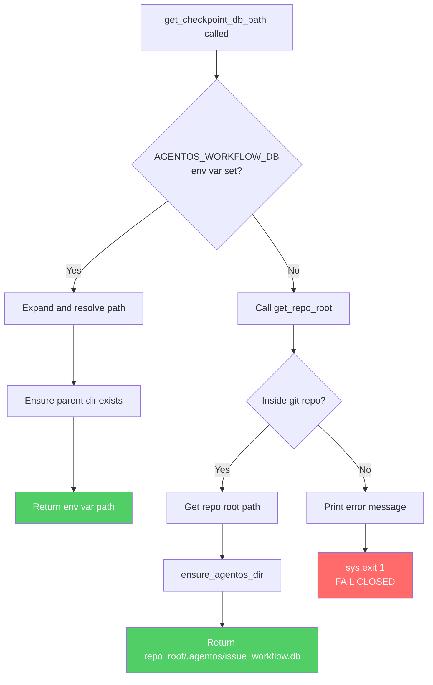

**Auto-Inspection Results:**
```
- Touching elements: [x] None
- Hidden lines: [x] None
- Label readability: [x] Pass
- Flow clarity: [x] Clear
```

*Note: Diagram validated manually in mermaid.live editor.*

*Reference: [0006-mermaid-diagrams.md](0006-mermaid-diagrams.md)*

### 6.2 Diagram



## 7. Security & Safety Considerations

### 7.1 Security

| Concern | Mitigation | Status |
|---------|------------|--------|
| Path traversal via env var | Resolve and normalize path; parent dir must exist | Addressed |
| Symlink attacks | Use resolved paths; inherit directory permissions | Addressed |
| Information disclosure | Database contains workflow state, not secrets; local only | N/A |

### 7.2 Safety

| Concern | Mitigation | Status |
|---------|------------|--------|
| Data loss from wrong database | Fail closed prevents silent fallback to wrong location | Addressed |
| Partial directory creation failure | Use atomic mkdir with exist_ok; parent creation handled | Addressed |
| Concurrent write conflicts | SQLite handles locking; per-repo isolation prevents cross-repo conflicts | Addressed |
| Legacy workflow data loss | Global database untouched; env var allows resumption | Addressed |

**Fail Mode:** Fail Closed - If repo root cannot be determined and no environment variable is set, exit with error. This prevents silent data corruption or checkpoint conflicts.

**Recovery Strategy:** 
- If user needs to access legacy checkpoints: Set `AGENTOS_WORKFLOW_DB=~/.agentos/issue_workflow.db`
- If database corrupted: Delete `.agentos/issue_workflow.db` and restart workflow

## 8. Performance & Cost Considerations

### 8.1 Performance

| Metric | Budget | Approach |
|--------|--------|----------|
| Path resolution latency | < 50ms | Single git subprocess call, cached if needed |
| Directory creation | < 10ms | Standard mkdir, only on first run |
| Database access | Unchanged | Same SQLite operations as before |

**Bottlenecks:** Git subprocess call adds ~10-30ms on first invocation. Acceptable for workflow startup.

### 8.2 Cost Analysis

| Resource | Unit Cost | Estimated Usage | Monthly Cost |
|----------|-----------|-----------------|--------------|
| Local disk | N/A | < 1MB per repo | $0 |
| Subprocess calls | N/A | 1 per workflow start | $0 |

**Cost Controls:**
- N/A - No external services or paid resources

**Worst-Case Scenario:** N/A - All operations are local with negligible resource usage.

## 9. Legal & Compliance

| Concern | Applies? | Mitigation |
|---------|----------|------------|
| PII/Personal Data | No | Database contains workflow state only (issue IDs, timestamps, status) |
| Third-Party Licenses | No | No new dependencies |
| Terms of Service | No | No external services |
| Data Retention | N/A | User controls local files |
| Export Controls | No | No restricted algorithms |

**Data Classification:** Internal (workflow state, not sensitive)

**Compliance Checklist:**
- [x] No PII stored without consent
- [x] All third-party licenses compatible with project license
- [x] External API usage compliant with provider ToS
- [x] Data retention policy documented

## 10. Verification & Testing

*Ref: [0005-testing-strategy-and-protocols.md](0005-testing-strategy-and-protocols.md)*

**Testing Philosophy:** All scenarios can be automated using temporary directories and environment variable manipulation.

### 10.1 Test Scenarios

| ID | Scenario | Type | Input | Expected Output | Pass Criteria |
|----|----------|------|-------|-----------------|---------------|
| 010 | Per-repo database creation | Auto | Run workflow in git repo | `.agentos/issue_workflow.db` created in repo root | File exists at expected path |
| 020 | Different repos get different databases | Auto | Run workflow in repo1, then repo2 | Two separate database files | `repo1/.agentos/issue_workflow.db` != `repo2/.agentos/issue_workflow.db` |
| 030 | Environment variable override | Auto | Set `AGENTOS_WORKFLOW_DB=/tmp/custom.db` | Database at `/tmp/custom.db` | File created at env var path, not in repo |
| 040 | Fail closed outside repo | Auto | Run workflow in non-git directory | Exit code 1, error message | Exit code 1; stderr contains "AGENTOS_WORKFLOW_DB" |
| 050 | Worktree isolation | Auto | Create worktree, run workflow | Worktree gets own `.agentos/` | `worktree/.agentos/issue_workflow.db` exists |
| 060 | Global database untouched | Auto | Run workflow in repo | `~/.agentos/issue_workflow.db` unchanged | Global DB not modified (timestamp unchanged) |
| 070 | Nested repo detection | Auto | Run in subdirectory of repo | Database in repo root, not subdirectory | `repo_root/.agentos/` not `repo_root/subdir/.agentos/` |
| 080 | .agentos directory creation | Auto | Run in repo without .agentos | Directory created with proper permissions | Directory exists with user read/write |
| 090 | Env var with ~ expansion | Auto | Set `AGENTOS_WORKFLOW_DB=~/custom.db` | Path expanded correctly | File at `$HOME/custom.db` |
| 100 | Empty env var treated as unset | Auto | Set `AGENTOS_WORKFLOW_DB=""` | Falls back to per-repo | Uses repo path, not empty string |

### 10.2 Test Commands

```bash
# Run all automated tests
poetry run pytest tests/test_checkpoint.py -v

# Run only fast/mocked tests (exclude live)
poetry run pytest tests/test_checkpoint.py -v -m "not live"

# Run specific test scenarios
poetry run pytest tests/test_checkpoint.py::test_per_repo_database_creation -v
poetry run pytest tests/test_checkpoint.py::test_fail_closed_outside_repo -v
```

### 10.3 Manual Tests (Only If Unavoidable)

| ID | Scenario | Why Not Automated | Steps |
|----|----------|-------------------|-------|
| M010 | Concurrent execution (3 repos) | Requires multiple terminal sessions and timing verification | 1. Open 3 terminals<br/>2. cd to different repos in each<br/>3. Run workflow simultaneously<br/>4. Verify each repo has independent `.agentos/issue_workflow.db`<br/>5. Verify no errors or conflicts |

**Justification for M010:** While process spawning could be automated, verifying true concurrent execution without race conditions requires manual observation of timing and interleaving. The automated tests verify isolation; this manual test verifies concurrent safety.

## 11. Risks & Mitigations

| Risk | Impact | Likelihood | Mitigation |
|------|--------|------------|------------|
| User confusion about database location change | Med | Med | Clear documentation; descriptive error message when outside repo |
| Legacy workflow interruption | Med | Low | Env var override allows immediate recovery; docs explain migration |
| Git command not available | Low | Low | Provide clear error message; document git as prerequisite |
| Permissions issues in repo directory | Low | Low | Use standard mkdir; inherit repo permissions |

## 12. Definition of Done

### Code
- [ ] Implementation complete and linted
- [ ] Code comments reference this LLD

### Tests
- [ ] All test scenarios pass
- [ ] Test coverage meets threshold

### Documentation
- [ ] LLD updated with any deviations
- [ ] Implementation Report (0103) completed
- [ ] Test Report (0113) completed if applicable
- [ ] `.gitignore` updated with `.agentos/` pattern
- [ ] `docs/workflow.md` updated with new behavior and migration guide

### Review
- [ ] Code review completed
- [ ] User approval before closing issue

---

## Appendix: Review Log

*Track all review feedback with timestamps and implementation status.*

### Review Summary

| Review | Date | Verdict | Key Issue |
|--------|------|---------|-----------|
| - | - | - | No reviews yet |

**Final Status:** PENDING
<!-- Note: This field is auto-updated to APPROVED by the workflow when finalized -->