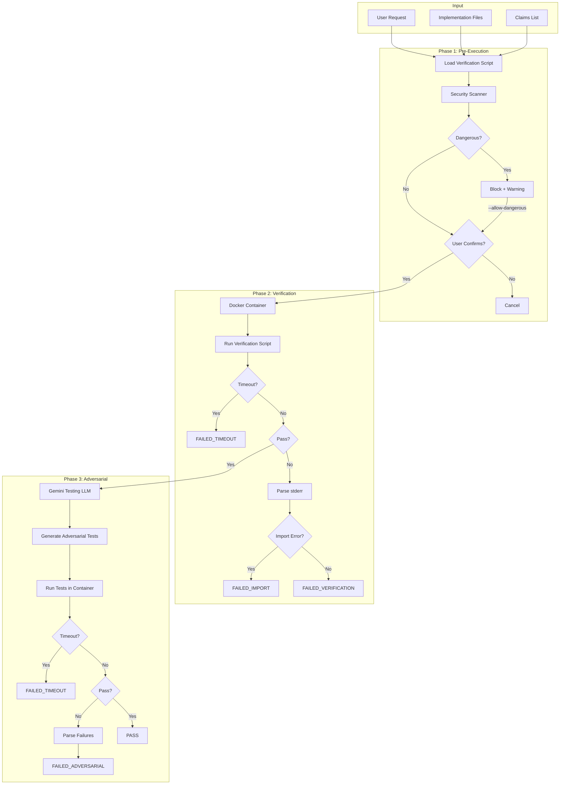

# 180 - Feature: Adversarial Testing Workflow

<!-- Template Metadata
Last Updated: 2026-01-27
Updated By: Initial LLD creation
Update Reason: Initial design for adversarial testing workflow with separation of implementation from verification
-->

## 1. Context & Goal
* **Issue:** #80
* **Objective:** Establish a workflow where implementation and verification are performed by separate, adversarial LLMs to catch bugs, import errors, and false claims before code ships to production.
* **Status:** Draft
* **Related Issues:** N/A

### Open Questions

- [ ] Should adversarial testing run on every commit or only before PR merge?
- [ ] What scoring mechanism should evaluate Testing LLM effectiveness?
- [ ] Should Testing LLM be allowed to suggest fixes, or remain purely adversarial?
- [ ] How to handle flaky tests that fail intermittently?

## 2. Proposed Changes

*This section is the **source of truth** for implementation. Describes exactly what will be built.*

### 2.1 Files Changed

| File | Change Type | Description |
|------|-------------|-------------|
| `tools/adversarial_test_workflow.py` | Add | Orchestrator script coordinating verification and adversarial testing |
| `tools/script_safety_scanner.py` | Add | Shell script and Python AST security scanner |
| `tools/templates/verify-template.sh` | Add | Template for verification scripts |
| `tools/templates/test_adversarial_template.py` | Add | Template for adversarial tests |
| `tools/docker/adversarial-sandbox.Dockerfile` | Add | Container definition for sandboxed execution |
| `tests/fixtures/adversarial/mock_gemini_responses.json` | Add | Mocked LLM responses for offline development |
| `tests/fixtures/adversarial/sample_claims.json` | Add | Sample claims for testing |
| `tests/fixtures/adversarial/dangerous_scripts/` | Add | Test fixtures for security scanner validation |
| `tests/test_adversarial_workflow.py` | Add | Unit tests for orchestrator |
| `tests/test_script_safety_scanner.py` | Add | Unit tests for security scanner |
| `docs/adr/0015-adversarial-testing-workflow.md` | Add | Architecture decision record |
| `docs/reports/adversarial-costs.csv` | Add | Cost tracking for adversarial testing runs |
| `tools/run_issue_workflow.py` | Modify | Add N2.5 adversarial testing gate |
| `docs/wiki/governance-workflow.md` | Modify | Document new gate |
| `CLAUDE.md` | Modify | Add adversarial testing prompts for Implementation LLM |
| `config/gemini.yaml` | Modify | Add enterprise and data_retention settings |

### 2.2 Dependencies

```toml
# pyproject.toml additions
docker = "^7.0.0"  # Docker SDK for Python (container management)
```

**External Dependencies:**
- Docker/Podman must be installed on host system
- Gemini Enterprise API access with Zero Data Retention (ZDR) policy

### 2.3 Data Structures

```python
# Pseudocode - NOT implementation

class WorkflowStatus(Enum):
    """Status codes for adversarial testing workflow."""
    PASS = "PASS"
    DRY_RUN = "DRY_RUN"
    CANCELLED = "CANCELLED"
    FAILED_VERIFICATION = "FAILED_VERIFICATION"
    FAILED_IMPORT = "FAILED_IMPORT"
    FAILED_ADVERSARIAL = "FAILED_ADVERSARIAL"
    FAILED_TIMEOUT = "FAILED_TIMEOUT"
    BLOCKED_DANGEROUS_SCRIPT = "BLOCKED_DANGEROUS_SCRIPT"
    BLOCKED_DANGEROUS_OPERATION = "BLOCKED_DANGEROUS_OPERATION"

class WorkflowResult(TypedDict):
    """Result of adversarial testing workflow."""
    status: WorkflowStatus
    message: str | None  # Human-readable status message
    stderr: str | None  # Captured stderr on failure
    failures: list[TestFailure] | None  # Detailed test failures
    patterns: list[DangerousPattern] | None  # Blocked dangerous patterns
    cost: float | None  # Estimated cost of LLM calls

class TestFailure(TypedDict):
    """Details of a failed test."""
    test_name: str
    claim_violated: str
    error_type: str
    error_message: str
    traceback: str | None

class DangerousPattern(TypedDict):
    """Detected dangerous pattern in script."""
    line_number: int
    pattern_type: str  # e.g., "network_access", "destructive", "privilege_escalation"
    code: str
    severity: str  # "critical", "high", "medium"

class ScanResult(TypedDict):
    """Result of security scanner."""
    is_safe: bool
    patterns: list[DangerousPattern]
    recommendations: list[str]

class ContainerConfig(TypedDict):
    """Configuration for sandboxed execution."""
    memory_limit: str  # e.g., "2g"
    cpu_limit: int  # e.g., 2
    network_enabled: bool
    timeout_seconds: int
    workspace_path: str
```

### 2.4 Function Signatures

```python
# tools/adversarial_test_workflow.py

def run_adversarial_testing(
    implementation_files: list[str],
    claims: list[str],
    dry_run: bool = False,
    auto_confirm: bool = False,
    timeout: int = 300,
    max_cost: float | None = None,
    allow_network: bool = False,
    allow_dangerous: bool = False,
    output_path: str | None = None,
) -> WorkflowResult:
    """
    Run adversarial testing workflow.
    
    1. Run verification script from Implementation LLM
    2. Invoke Testing LLM to generate adversarial tests
    3. Run adversarial tests
    4. Report results
    
    Note: output_path behavior - if file exists, it will be overwritten
    with a warning logged. Use dry_run=True to preview without overwriting.
    """
    ...

def run_in_container(
    script_path: str,
    config: ContainerConfig,
) -> subprocess.CompletedProcess:
    """Execute script in Docker container with resource limits."""
    ...

def invoke_testing_llm(
    implementation_files: list[str],
    claims: list[str],
) -> str:
    """Invoke Gemini to generate adversarial tests."""
    ...

def parse_test_failures(
    pytest_output: str,
    claims: list[str],
) -> list[TestFailure]:
    """Parse pytest output to extract failure details."""
    ...

def get_user_confirmation(prompt: str) -> bool:
    """Prompt user for confirmation before script execution."""
    ...

def estimate_cost(
    implementation_files: list[str],
    claims: list[str],
) -> float:
    """Estimate LLM API cost for adversarial test generation."""
    ...

def log_cost(
    cost: float,
    ticket_id: str,
    csv_path: str = "docs/reports/adversarial-costs.csv",
) -> None:
    """Log cost to tracking CSV."""
    ...

def check_docker_image_exists(image_name: str) -> bool:
    """Check if Docker image exists locally to avoid rebuilds."""
    ...
```

```python
# tools/script_safety_scanner.py

def scan_shell_script(script_path: str) -> ScanResult:
    """Scan shell script for dangerous patterns."""
    ...

def scan_python_script(script_path: str) -> ScanResult:
    """Scan Python script using AST analysis."""
    ...

def scan_for_network_access(content: str) -> list[DangerousPattern]:
    """Detect network access commands (curl, wget, nc, etc.)."""
    ...

def scan_for_destructive_commands(content: str) -> list[DangerousPattern]:
    """Detect destructive commands (rm -rf, shutil.rmtree, etc.)."""
    ...

def scan_for_privilege_escalation(content: str) -> list[DangerousPattern]:
    """Detect privilege escalation attempts (sudo, su, etc.)."""
    ...

def scan_python_ast(script_path: str) -> list[DangerousPattern]:
    """AST-based analysis for dangerous Python imports/calls."""
    ...
```

### 2.5 Logic Flow (Pseudocode)

```
MAIN WORKFLOW:
1. Parse CLI arguments (implementation_files, claims, flags)
2. IF dry_run THEN
   - Display verification script contents
   - Display what would be executed
   - RETURN DRY_RUN status

3. Load verification script
4. Run security scanner on verification script
5. IF dangerous patterns found THEN
   - Display warning with patterns
   - IF NOT allow_dangerous THEN
     - RETURN BLOCKED_DANGEROUS_SCRIPT status

6. IF NOT auto_confirm THEN
   - Display script preview
   - Prompt user for confirmation
   - IF user declines THEN
     - RETURN CANCELLED status

7. Check if Docker image exists locally (avoid rebuild if cached)
8. Build Docker container if not exists
9. Run verification script IN CONTAINER with timeout (5 min)
10. IF timeout exceeded THEN
    - RETURN FAILED_TIMEOUT status with stage="verification"
11. IF verification fails THEN
    - Parse stderr for ImportError/ModuleNotFoundError
    - IF import error THEN
      - RETURN FAILED_IMPORT status
    - ELSE
      - RETURN FAILED_VERIFICATION status

12. IF max_cost set THEN
    - Estimate cost for Testing LLM
    - IF cost > max_cost THEN
      - RETURN with cost warning

13. Invoke Testing LLM with implementation + claims
14. Receive adversarial tests from Testing LLM
15. Run adversarial tests IN CONTAINER with timeout (10 min)
16. IF timeout exceeded THEN
    - RETURN FAILED_TIMEOUT status with stage="adversarial"
17. IF tests fail THEN
    - Parse failures, map to claims violated
    - RETURN FAILED_ADVERSARIAL with failures

18. Log cost to CSV
19. RETURN PASS status
```

```
SECURITY SCANNER FLOW:
1. Read script content
2. FOR EACH dangerous pattern category:
   - Network access: curl, wget, nc to external IPs
   - Destructive: rm -rf, shutil.rmtree on system paths
   - Privilege: sudo, su, chmod +s
   - Exfiltration: env | curl, printenv to network
3. IF Python file THEN
   - Parse AST
   - Check for dangerous imports (os.system, subprocess shell=True)
   - Check for dangerous calls (shutil.rmtree on non-workspace)
4. Aggregate findings with line numbers
5. RETURN ScanResult with is_safe flag
```

### 2.6 Technical Approach

* **Module:** `tools/adversarial_test_workflow.py`
* **Pattern:** Pipeline pattern with staged gates
* **Key Decisions:**
  - Mandatory containerization prevents host system damage
  - Pre-execution scanning catches dangerous scripts before user confirmation
  - Two-tier timeout (5 min verification, 10 min adversarial) balances thoroughness with practicality
  - AST analysis for Python catches dangerous patterns that regex would miss
  - Docker image caching: Check if `adversarial-sandbox` image exists before build to optimize repeated runs

### 2.7 Architecture Decisions

| Decision | Options Considered | Choice | Rationale |
|----------|-------------------|--------|-----------|
| Execution environment | Host / Container / VM | Container (Docker) | Balance of isolation and performance; VMs too slow, host too dangerous |
| Script inspection | Regex only / AST only / Both | Both | Regex for shell, AST for Python; covers all cases |
| Testing LLM | Same Claude / Separate Claude / Gemini | Gemini | Different model ensures adversarial independence |
| Confirmation model | Always confirm / Auto-confirm option / Dry-run first | All three with hierarchy | Flexibility for different use cases (interactive, CI, preview) |
| Timeout enforcement | Per-script / Per-stage / Global | Per-stage | Different stages need different time budgets |

**Architectural Constraints:**
- Must integrate with existing governance workflow (N2.5 gate)
- Cannot require new cloud infrastructure (Docker available locally)
- Must work offline with mocked LLM responses for development
- Gemini API must use Enterprise endpoint with ZDR

## 3. Requirements

*What must be true when this is done. These become acceptance criteria.*

1. Orchestrator runs all verification scripts in mandatory Docker container
2. Orchestrator requires user confirmation before executing generated scripts
3. `--dry-run` mode shows script content without execution
4. Shell script inspection blocks dangerous commands before confirmation prompt
5. Verification scripts timeout after 5 minutes with clear error message
6. Adversarial test suites timeout after 10 minutes with clear error message
7. Testing LLM (Gemini Enterprise/ZDR) receives implementation code and generates adversarial tests
8. Adversarial tests execute without mocks for subprocess/external calls
9. Orchestrator parses stderr; if ImportError or ModuleNotFoundError detected, workflow halts with FAILED_IMPORT
10. Edge cases are tested (unicode, paths with spaces, missing commands)
11. False claims are exposed (mocked "integration tests" flagged)
12. N2.5 gate integrated into issue governance workflow
13. Clear failure reporting shows exact test output and claim violated
14. Cost per adversarial test run is logged to tracking CSV
15. Environment variables sanitized (PYTHONPATH, API keys cleared) before script execution

## 4. Alternatives Considered

| Option | Pros | Cons | Decision |
|--------|------|------|----------|
| Same LLM for implementation and testing | Simpler integration, no API costs | No adversarial pressure, conflict of interest | **Rejected** |
| VM-based sandboxing | Stronger isolation | Slow startup, heavy resource use | **Rejected** |
| No sandboxing (trust scripts) | Fastest execution | Security risk, host system damage | **Rejected** |
| Docker container sandbox | Good isolation, fast, portable | Requires Docker installation | **Selected** |
| Regex-only script scanning | Simple to implement | Misses sophisticated attacks | **Rejected** |
| AST + Regex scanning | Comprehensive coverage | More complex | **Selected** |
| Always require confirmation | Maximum safety | Blocks CI automation | **Rejected** |
| Tiered confirmation (manual/auto/dry-run) | Flexible for use cases | More complex UX | **Selected** |

**Rationale:** Docker containers provide the best balance of security, performance, and portability. The tiered confirmation model allows both interactive use and CI automation while maintaining safety defaults.

## 5. Data & Fixtures

### 5.1 Data Sources

| Attribute | Value |
|-----------|-------|
| Source | Implementation LLM (Claude), Testing LLM (Gemini), local filesystem |
| Format | Python source files, shell scripts, JSON claims, pytest output |
| Size | Typical implementation: 100-500 lines; adversarial tests: 50-200 lines |
| Refresh | Per-workflow execution |
| Copyright/License | Project code: project license; LLM outputs: work-for-hire |

### 5.2 Data Pipeline

```
Implementation Files ──parse──► Claims Extraction ──API──► Gemini (Testing LLM)
                                                              │
                                                              ▼
                                                    Adversarial Tests
                                                              │
Verification Script ──container──► Verification Result        │
                                          │                   │
                                          ▼                   ▼
                                    Pass/Fail ──────► Adversarial Execution
                                                              │
                                                              ▼
                                                    Final Verdict
```

### 5.3 Test Fixtures

| Fixture | Source | Notes |
|---------|--------|-------|
| `mock_gemini_responses.json` | Generated | Mocked adversarial test generation responses |
| `sample_claims.json` | Generated | Sample implementation claims for testing |
| `dangerous_scripts/curl_external.sh` | Generated | Tests network access detection |
| `dangerous_scripts/rm_rf_root.sh` | Generated | Tests destructive command detection |
| `dangerous_scripts/sudo_chmod.sh` | Generated | Tests privilege escalation detection |
| `dangerous_scripts/safe_script.sh` | Generated | Baseline safe script for comparison |

### 5.4 Deployment Pipeline

Development:
1. Run with `--dry-run` and mocked fixtures
2. Verify scanner detects dangerous patterns
3. Verify container execution works

Testing:
1. Run full workflow with real Gemini API (dev credentials)
2. Verify adversarial tests generated correctly
3. Verify timeout enforcement

Production:
1. Integrated into governance workflow at N2.5 gate
2. Uses Gemini Enterprise endpoint with ZDR
3. Costs logged to tracking CSV

## 6. Diagram

### 6.1 Mermaid Quality Gate

- [x] **Simplicity:** Components grouped by phase
- [x] **No touching:** All elements have visual separation
- [x] **No hidden lines:** All arrows fully visible
- [x] **Readable:** Labels clear, flow direction top-to-bottom
- [ ] **Auto-inspected:** Pending render

**Auto-Inspection Results:**
```
- Touching elements: [ ] None / [ ] Found: ___
- Hidden lines: [ ] None / [ ] Found: ___
- Label readability: [ ] Pass / [ ] Issue: ___
- Flow clarity: [ ] Clear / [ ] Issue: ___
```

### 6.2 Diagram



## 7. Security & Safety Considerations

### 7.1 Security

| Concern | Mitigation | Status |
|---------|------------|--------|
| Arbitrary code execution | Mandatory Docker containerization | Addressed |
| Network exfiltration | `--network=none` by default | Addressed |
| Filesystem damage | Workspace-only mount, system paths read-only/unmounted | Addressed |
| Privilege escalation | No `--privileged`, no capability additions | Addressed |
| API key exposure | Environment sanitization before execution | Addressed |
| Malicious script injection | Pre-execution security scanning | Addressed |
| Supply chain (LLM output) | User confirmation required before execution | Addressed |
| Data residency | Gemini Enterprise with ZDR policy | Addressed |

### 7.2 Safety

| Concern | Mitigation | Status |
|---------|------------|--------|
| Runaway process | 5-minute (verification) / 10-minute (adversarial) timeouts | Addressed |
| Resource exhaustion | Docker memory (2GB) and CPU (2 cores) limits | Addressed |
| Infinite loop | Timeout enforcement with process termination | Addressed |
| Lost work | Dry-run mode for preview before execution | Addressed |
| False positives (safe code blocked) | `--allow-dangerous` override with explicit confirmation | Addressed |
| Flaky network tests | `--allow-network` opt-in only | Addressed |

**Fail Mode:** Fail Closed - Any doubt results in blocking execution and requiring explicit override

**Recovery Strategy:** 
- Failed workflows preserve all intermediate outputs
- Logs capture full stdout/stderr for debugging
- User can re-run with adjusted parameters

## 8. Performance & Cost Considerations

### 8.1 Performance

| Metric | Budget | Approach |
|--------|--------|----------|
| Container startup | < 5s | Pre-built image, cached layers |
| Verification timeout | 5 min max | `subprocess.run(timeout=300)` |
| Adversarial timeout | 10 min max | `subprocess.run(timeout=600)` |
| Security scan | < 2s | Regex + single-pass AST |

**Bottlenecks:** 
- Gemini API latency (~2-5s for generation)
- Docker container startup on first run (~10-15s, subsequent <2s)

### 8.2 Cost Analysis

| Resource | Unit Cost | Estimated Usage | Monthly Cost |
|----------|-----------|-----------------|--------------|
| Gemini Flash | $0.075/1M input, $0.30/1M output | 50 tickets × 10K tokens | ~$2 |
| Gemini Pro | $1.25/1M input, $5.00/1M output | 10 tickets × 10K tokens | ~$1 |
| Docker compute | N/A (local) | - | $0 |

**Cost Controls:**
- [x] Tiered LLM selection (Flash default, Pro for complex)
- [x] `--max-cost` flag to skip if estimated cost exceeds threshold
- [x] Cost logging to CSV for tracking
- [x] Caching opportunity for unchanged implementations (future)

**Worst-Case Scenario:** 
- 100x spike: ~$300/month (still reasonable)
- Mitigation: Budget cap in config, automatic skip when exceeded

## 9. Legal & Compliance

| Concern | Applies? | Mitigation |
|---------|----------|------------|
| PII/Personal Data | No | Adversarial tests don't process user data |
| Third-Party Licenses | Yes | Docker images use permissive licenses |
| Terms of Service | Yes | Gemini Enterprise with ZDR complies |
| Data Retention | Yes | Gemini ZDR policy ensures no retention |
| Export Controls | No | No restricted algorithms |

**Data Classification:** Internal (code review context)

**Compliance Checklist:**
- [x] No PII processed in adversarial workflow
- [x] Docker base images use compatible licenses
- [x] Gemini Enterprise API with ZDR policy
- [x] All API calls logged locally for audit

## 10. Verification & Testing

### 10.1 Test Scenarios

| ID | Scenario | Type | Input | Expected Output | Pass Criteria |
|----|----------|------|-------|-----------------|---------------|
| 010 | Happy path - all tests pass | Auto | Valid implementation + passing verification | PASS status | Returns PASS, no failures |
| 020 | Verification script fails | Auto | Implementation with import error | FAILED_IMPORT status | Detects ImportError in stderr |
| 030 | Adversarial tests find bugs | Auto | Implementation with edge case bug | FAILED_ADVERSARIAL | Failure includes claim violated |
| 040 | False claim exposed | Auto | Mocked tests claiming integration | Flagged as false | Testing LLM generates unmocked test |
| 050 | Verification script timeout | Auto | Script with `sleep 600` | FAILED_TIMEOUT | Returns within 5 min + buffer, stage="verification" |
| 055 | Adversarial test suite timeout | Auto | Adversarial tests with `sleep 1200` | FAILED_TIMEOUT | Returns within 10 min + buffer, stage="adversarial" |
| 060 | Dry-run mode | Auto | Any implementation | DRY_RUN status | No subprocess execution, script shown |
| 070 | Dangerous script - curl | Auto | Script with `curl http://evil.com` | BLOCKED_DANGEROUS_SCRIPT | Blocked before confirmation |
| 080 | Dangerous script - rm -rf | Auto | Script with `rm -rf /` | BLOCKED_DANGEROUS_SCRIPT | Pattern identified |
| 090 | User cancels confirmation | Auto | Mock user input "n" | CANCELLED status | Clean exit, no execution |
| 100 | Auto-confirm in CI mode | Auto | `--auto-confirm --containerized` | Proceeds without prompt | No stdin read |
| 110 | Resource limit enforcement | Auto | Script allocating 4GB memory | Container OOM killed | Fails gracefully |
| 120 | Environment sanitization | Auto | Script printing PYTHONPATH | Empty or sanitized | No sensitive vars leaked |
| 130 | Cost tracking | Auto | Complete workflow run | CSV entry created | Entry matches expected format |
| 140 | Max cost exceeded | Auto | High-token implementation | Skipped with warning | No LLM API call made |
| 150 | ModuleNotFoundError detection | Auto | Script importing nonexistent module | FAILED_IMPORT | Correct error type detected |
| 160 | Orchestrator path robustness | Auto | Input file with spaces and unicode chars | Workflow completes or fails gracefully | No path-related crash |
| 170 | Governance integration - N2.5 gate | Auto | Mock `run_issue_workflow.py` invocation | N2.5 gate triggered | Adversarial workflow called with correct params |

### 10.2 Test Commands

```bash
# Run all automated tests
poetry run pytest tests/test_adversarial_workflow.py tests/test_script_safety_scanner.py -v

# Run only fast/mocked tests (exclude live)
poetry run pytest tests/test_adversarial_workflow.py -v -m "not live"

# Run live integration tests (requires Gemini API)
poetry run pytest tests/test_adversarial_workflow.py -v -m live

# Run security scanner tests
poetry run pytest tests/test_script_safety_scanner.py -v

# Run with coverage
poetry run pytest tests/test_adversarial_workflow.py --cov=tools/adversarial_test_workflow --cov-report=term-missing
```

### 10.3 Manual Tests (Only If Unavoidable)

N/A - All scenarios automated.

## 11. Risks & Mitigations

| Risk | Impact | Likelihood | Mitigation |
|------|--------|------------|------------|
| Docker not installed | High | Medium | Clear error message with installation instructions |
| Gemini API unavailable | High | Low | Offline mode with mocked fixtures for development |
| False positive security scan | Medium | Medium | `--allow-dangerous` override with logging |
| Testing LLM generates invalid tests | Medium | Low | Syntax validation before execution |
| Container escape vulnerability | High | Very Low | Keep Docker updated, use minimal base image |
| Cost overrun | Medium | Low | `--max-cost` flag, budget alerts, cost tracking |

## 12. Definition of Done

### Code
- [ ] `adversarial_test_workflow.py` orchestrator implemented
- [ ] `script_safety_scanner.py` security scanner implemented
- [ ] Mandatory Docker containerization implemented (no host execution path)
- [ ] Shell script inspection for dangerous patterns implemented
- [ ] AST-based Python validation implemented
- [ ] User confirmation prompt implemented for script execution
- [ ] `--dry-run` mode implemented
- [ ] Timeout handling (5 min verification, 10 min adversarial) implemented
- [ ] Resource constraint enforcement via Docker limits implemented
- [ ] Environment sanitization implemented
- [ ] Verification script template created
- [ ] Adversarial test template created
- [ ] N2.5 gate added to governance workflow
- [ ] Code comments reference this LLD

### Tests
- [ ] All test scenarios pass (010-170)
- [ ] Unit tests for orchestrator written and passing
- [ ] Unit tests for security scanner written and passing
- [ ] Mocked LLM response fixtures created for offline testing
- [ ] Self-destruct test added to security test suite
- [ ] Test coverage meets 80% threshold

### Documentation
- [ ] ADR documenting adversarial testing rationale
- [ ] Update governance workflow wiki
- [ ] Update CLAUDE.md with verification script requirements
- [ ] Add new files to `docs/0003-file-inventory.md`
- [ ] Implementation Report (0103) completed
- [ ] Test Report (0113) completed

### Review
- [ ] Code review completed
- [ ] Run 0809 Security Audit - PASS
- [ ] Run 0817 Wiki Alignment Audit - PASS
- [ ] User approval before closing issue

---

## Appendix: Review Log

*Track all review feedback with timestamps and implementation status.*

### Gemini Review #1 (REVISE)

**Timestamp:** 2026-01-27
**Reviewer:** Gemini 3 Pro
**Verdict:** REVISE

#### Comments

| ID | Comment | Implemented? |
|----|---------|--------------|
| G1.1 | "Missing test for 10-minute adversarial timeout (Req 6)" | YES - Added test 055 |
| G1.2 | "Missing test for orchestrator path robustness with unicode/spaces (Req 10)" | YES - Added test 160 |
| G1.3 | "Missing test for governance integration N2.5 gate (Req 12)" | YES - Added test 170 |
| G1.4 | "Docker image caching strategy not documented" | YES - Added `check_docker_image_exists` function and logic flow note |
| G1.5 | "Output path existing file handling not specified" | YES - Added note in function docstring |

### Review Summary

| Review | Date | Verdict | Key Issue |
|--------|------|---------|-----------|
| Gemini #1 | 2026-01-27 | REVISE | Requirement coverage at 80%, missing 3 test scenarios |

**Final Status:** PENDING