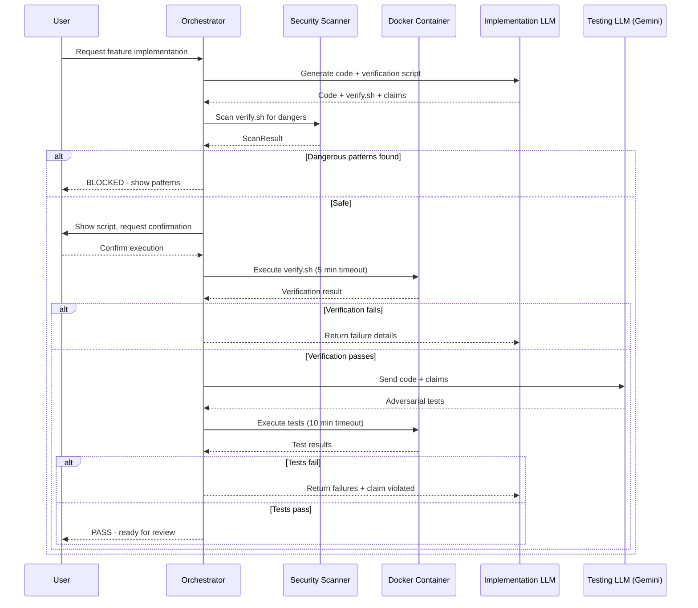

# 180 - Feature: Adversarial Testing Workflow

<!-- Template Metadata
Last Updated: 2025-01-27
Updated By: Issue #80 implementation
Update Reason: Initial LLD creation for adversarial testing workflow
Previous: N/A - New document
-->

## 1. Context & Goal
* **Issue:** #80
* **Objective:** Establish a workflow where implementation and verification are performed by separate, adversarial LLMs to catch bugs before code ships to production.
* **Status:** Draft
* **Related Issues:** N/A

### Open Questions

- [x] Which LLM for Testing? → Gemini Flash for standard tickets, Gemini Pro for complex/security-critical
- [ ] How adversarial should tests be? Recommend tiered approach: smoke tests + edge cases + fuzzing
- [ ] When to run adversarial tests? Recommend before PR (manual trigger) with option for on-demand
- [ ] Can Testing LLM fix bugs? Recommend report-only (orchestrator decides)
- [ ] How to score Testing LLM? Track bugs found vs false positives in metrics

## 2. Proposed Changes

*This section is the **source of truth** for implementation. Describe exactly what will be built.*

### 2.1 Files Changed

| File | Change Type | Description |
|------|-------------|-------------|
| `tools/adversarial_test_workflow.py` | Add | Main orchestrator script coordinating verification and adversarial testing |
| `tools/script_safety_scanner.py` | Add | Shell script and Python AST security scanner |
| `tools/templates/verify-template.sh` | Add | Template for verification scripts |
| `tools/templates/test_adversarial_template.py` | Add | Template for adversarial tests |
| `tools/docker/adversarial-sandbox.Dockerfile` | Add | Container definition for sandboxed execution |
| `tests/fixtures/adversarial/mock_gemini_responses.json` | Add | Mocked LLM responses for offline development |
| `tests/fixtures/adversarial/sample_claims.json` | Add | Sample claims for testing |
| `tests/fixtures/adversarial/dangerous_scripts/curl_external.sh` | Add | Test fixture for dangerous script detection |
| `tests/fixtures/adversarial/dangerous_scripts/rm_recursive.sh` | Add | Test fixture for destructive command detection |
| `tests/unit/test_adversarial_workflow.py` | Add | Unit tests for orchestrator |
| `tests/unit/test_script_safety_scanner.py` | Add | Unit tests for security scanner |
| `docs/adr/0015-adversarial-testing-workflow.md` | Add | Architecture decision record |
| `docs/reports/adversarial-costs.csv` | Add | Cost tracking for adversarial testing runs |
| `config/gemini.yaml` | Modify | Add `enterprise: true` and `data_retention: none` settings |
| `tools/run_issue_workflow.py` | Modify | Add N2.5 adversarial testing gate |
| `docs/wiki/governance-workflow.md` | Modify | Document new gate |
| `CLAUDE.md` | Modify | Add adversarial testing prompts for Implementation LLM |
| `docs/0003-file-inventory.md` | Modify | Add new files to inventory |

### 2.1.1 Path Validation (Mechanical - Auto-Checked)

*Issue #277: Before human or Gemini review, paths are verified programmatically.*

Mechanical validation automatically checks:
- All "Modify" files must exist in repository
- All "Delete" files must exist in repository
- All "Add" files must have existing parent directories
- No placeholder prefixes (`src/`, `lib/`, `app/`) unless directory exists

**If validation fails, the LLD is BLOCKED before reaching review.**

### 2.2 Dependencies

```toml
# pyproject.toml additions
docker = "^7.0.0"  # For container management
```

External dependencies:
- Docker or Podman (for containerized execution)
- Gemini Enterprise API access (existing)

### 2.3 Data Structures

```python
# Pseudocode - NOT implementation

class WorkflowStatus(Enum):
    """Status codes for adversarial testing workflow."""
    PASS = "PASS"
    DRY_RUN = "DRY_RUN"
    CANCELLED = "CANCELLED"
    FAILED_IMPORT = "FAILED_IMPORT"
    FAILED_VERIFICATION = "FAILED_VERIFICATION"
    FAILED_ADVERSARIAL = "FAILED_ADVERSARIAL"
    FAILED_TIMEOUT = "FAILED_TIMEOUT"
    BLOCKED_DANGEROUS_SCRIPT = "BLOCKED_DANGEROUS_SCRIPT"
    BLOCKED_DANGEROUS_OPERATION = "BLOCKED_DANGEROUS_OPERATION"

class WorkflowResult(TypedDict):
    """Result of adversarial testing workflow execution."""
    status: WorkflowStatus  # Final status of workflow
    message: str | None  # Human-readable message
    stderr: str | None  # Captured stderr on failure
    failures: list[TestFailure] | None  # List of test failures
    patterns: list[DangerousPattern] | None  # Detected dangerous patterns
    cost: float | None  # Estimated cost in USD

class TestFailure(TypedDict):
    """Details of a single test failure."""
    test_name: str  # Name of failing test
    claim_violated: str  # Which claim this test was verifying
    error_type: str  # Exception type
    error_message: str  # Full error message
    traceback: str | None  # Full traceback if available

class DangerousPattern(TypedDict):
    """A detected dangerous pattern in a script."""
    line_number: int  # Line where pattern was found
    pattern_type: str  # Category of danger (network, destructive, privilege)
    code: str  # The actual dangerous code
    description: str  # Human-readable explanation

class ScanResult(TypedDict):
    """Result of security scanning a script."""
    is_safe: bool  # True if no dangerous patterns found
    patterns: list[DangerousPattern]  # All detected patterns
    script_type: str  # "shell" or "python"

class AdversarialTestSpec(TypedDict):
    """Specification for generating adversarial tests."""
    implementation_files: list[str]  # Files to test
    claims: list[str]  # Claims made by implementation LLM
    testing_model: str  # "gemini-flash" or "gemini-pro"
    max_tests: int  # Maximum number of tests to generate
```

### 2.4 Function Signatures

```python
# tools/adversarial_test_workflow.py

def run_adversarial_testing(
    implementation_files: list[str],
    claims: list[str],
    dry_run: bool = False,
    auto_confirm: bool = False,
    containerized: bool = True,
    timeout_verification: int = 300,
    timeout_adversarial: int = 600,
    max_cost: float | None = None,
    allow_network: bool = False,
    allow_dangerous: bool = False,
) -> WorkflowResult:
    """
    Execute the full adversarial testing workflow.
    
    Runs verification script, then generates and executes adversarial tests.
    Returns detailed result with status and any failures.
    """
    ...

def execute_in_container(
    script_path: str,
    workspace: str,
    timeout: int = 300,
    memory_limit: str = "2g",
    cpu_limit: str = "2",
    network_enabled: bool = False,
) -> subprocess.CompletedProcess:
    """
    Execute a script inside a Docker container with resource limits.
    
    Raises TimeoutExpired if script exceeds timeout.
    """
    ...

def invoke_testing_llm(
    implementation_files: list[str],
    claims: list[str],
    model: str = "gemini-flash",
) -> str:
    """
    Invoke Testing LLM to generate adversarial tests.
    
    Returns generated test code as string.
    """
    ...

def parse_test_failures(pytest_output: str) -> list[TestFailure]:
    """
    Parse pytest output to extract structured failure information.
    """
    ...

def get_user_confirmation(prompt: str) -> bool:
    """
    Display prompt and get explicit user confirmation.
    
    Returns True if user confirms, False otherwise.
    """
    ...

def estimate_cost(
    implementation_files: list[str],
    model: str,
) -> float:
    """
    Estimate cost of adversarial test generation based on input size.
    
    Returns estimated cost in USD.
    """
    ...

def log_cost(
    ticket_id: str,
    model: str,
    actual_cost: float,
    tests_generated: int,
    bugs_found: int,
) -> None:
    """
    Log cost metrics to tracking CSV for analysis.
    """
    ...
```

```python
# tools/script_safety_scanner.py

def scan_shell_script(script_path: str) -> ScanResult:
    """
    Scan a shell script for dangerous patterns.
    
    Detects: network access, destructive commands, privilege escalation.
    """
    ...

def scan_python_script(script_path: str) -> ScanResult:
    """
    Scan a Python script using AST analysis for dangerous patterns.
    
    Detects: dangerous imports, shell=True, system path operations.
    """
    ...

def scan_script(script_path: str) -> ScanResult:
    """
    Auto-detect script type and scan for dangerous patterns.
    """
    ...

DANGEROUS_SHELL_PATTERNS: list[tuple[str, str, str]] = [
    # (regex_pattern, pattern_type, description)
    (r'curl\s+.*http[s]?://(?!localhost)', 'network', 'External HTTP request'),
    (r'wget\s+', 'network', 'External download'),
    (r'nc\s+', 'network', 'Netcat connection'),
    (r'rm\s+-rf\s+/', 'destructive', 'Recursive delete from root'),
    (r'sudo\s+', 'privilege', 'Privilege escalation'),
    (r'su\s+', 'privilege', 'Switch user'),
    (r'env\s*\|.*curl', 'exfiltration', 'Environment exfiltration'),
]

DANGEROUS_PYTHON_IMPORTS: set[str] = {
    'os.system',
    'subprocess.call',  # with shell=True
    'shutil.rmtree',  # on system paths
    'socket',  # direct network access
}
```

### 2.5 Logic Flow (Pseudocode)

```
MAIN WORKFLOW:
1. Receive implementation_files and claims
2. IF dry_run THEN
   - Display verification script contents
   - Display what commands WOULD be executed
   - Return DRY_RUN status
3. Scan verification script for dangerous patterns
4. IF dangerous patterns found AND NOT allow_dangerous THEN
   - Display warning with specific patterns
   - Return BLOCKED_DANGEROUS_SCRIPT status
5. IF NOT auto_confirm THEN
   - Prompt user for confirmation
   - IF user declines THEN return CANCELLED status
6. Execute verification script in container with timeout
7. IF verification times out THEN
   - Return FAILED_TIMEOUT status
8. IF verification fails THEN
   - Parse stderr for ImportError/ModuleNotFoundError
   - Return FAILED_IMPORT or FAILED_VERIFICATION status
9. Estimate cost for adversarial test generation
10. IF max_cost specified AND estimate > max_cost THEN
    - Return with cost warning
11. Invoke Testing LLM with implementation + claims
12. Save generated adversarial tests to temp file
13. Execute adversarial tests in container with timeout
14. IF adversarial tests timeout THEN
    - Return FAILED_TIMEOUT status
15. Parse test output for failures
16. Log cost metrics
17. Return PASS or FAILED_ADVERSARIAL with details

SECURITY SCAN (Shell):
1. Read script content
2. FOR each line in script:
   - FOR each dangerous pattern:
     - IF pattern matches line THEN
       - Record DangerousPattern
3. Return ScanResult with all findings

SECURITY SCAN (Python AST):
1. Parse script with ast.parse()
2. Walk AST nodes
3. FOR each Import/ImportFrom node:
   - Check against DANGEROUS_PYTHON_IMPORTS
4. FOR each Call node:
   - IF subprocess.run/call with shell=True:
     - Record dangerous pattern
   - IF shutil.rmtree on non-workspace path:
     - Record dangerous pattern
5. Return ScanResult

CONTAINER EXECUTION:
1. Build docker run command:
   - --rm (remove after execution)
   - --network=none (unless allow_network)
   - --memory={limit}
   - --cpus={limit}
   - -v {workspace}:/workspace:rw
   - Image: adversarial-sandbox
2. Execute with subprocess.run(timeout=timeout)
3. Return CompletedProcess
```

### 2.6 Technical Approach

* **Module:** `tools/adversarial_test_workflow.py`
* **Pattern:** Pipeline with gates (verification → adversarial)
* **Key Decisions:** 
  - Mandatory containerization for all generated scripts
  - Pre-execution security scanning before user confirmation
  - Tiered LLM selection (Flash for standard, Pro for complex)
  - User confirmation required by default (opt-out with explicit flags)

### 2.7 Architecture Decisions

| Decision | Options Considered | Choice | Rationale |
|----------|-------------------|--------|-----------|
| Execution environment | Host, VM, Container | Container (Docker) | Balance of isolation and usability |
| Security scanning | Runtime only, Static only, Both | Both (AST + runtime) | Defense in depth |
| Testing LLM | Same LLM, Different LLM | Different (Gemini) | True adversarial separation |
| Confirmation model | Always confirm, Auto by default | Always confirm | Security-first default |
| Timeout handling | Soft limits, Hard limits | Hard limits via subprocess | Prevents runaway execution |

**Architectural Constraints:**
- Must integrate with existing governance workflow (N2.5 gate)
- Cannot execute any code outside container without explicit override
- Must use Gemini Enterprise with ZDR for data compliance

## 3. Requirements

1. **Mandatory containerization:** All verification scripts MUST execute in Docker container
2. **User confirmation:** All script executions MUST require user confirmation (unless --auto-confirm with --containerized)
3. **Security scanning:** All scripts MUST be scanned for dangerous patterns before execution
4. **Timeout enforcement:** Verification scripts timeout at 5 minutes, adversarial tests at 10 minutes
5. **Separation of concerns:** Implementation LLM cannot declare code "tested" - only Testing LLM can verify claims
6. **Import error detection:** Orchestrator MUST detect and report ImportError/ModuleNotFoundError immediately
7. **Cost tracking:** Every adversarial test run MUST log cost to tracking CSV
8. **Dry-run mode:** Users MUST be able to preview scripts without execution
9. **Data compliance:** Gemini integration MUST use Enterprise endpoint with ZDR

## 4. Alternatives Considered

| Option | Pros | Cons | Decision |
|--------|------|------|----------|
| Same LLM for testing | Simpler, no external API | Conflict of interest, no adversarial pressure | **Rejected** |
| Separate Gemini for testing | True adversarial, catches more bugs | Additional cost, API dependency | **Selected** |
| Host execution with sandboxing | Faster, simpler setup | Security risk, environment leakage | **Rejected** |
| Container execution | Strong isolation, reproducible | Requires Docker, slower | **Selected** |
| No pre-execution scanning | Simpler, relies on container | Late detection, user sees dangerous scripts | **Rejected** |
| Pre-execution scanning | Early detection, informed consent | Additional complexity | **Selected** |

**Rationale:** Security and true adversarial separation justify the additional complexity and cost.

## 5. Data & Fixtures

### 5.1 Data Sources

| Attribute | Value |
|-----------|-------|
| Source | Gemini Enterprise API |
| Format | JSON API response |
| Size | ~1-10KB per response |
| Refresh | On-demand per test run |
| Copyright/License | Gemini Enterprise Agreement |

### 5.2 Data Pipeline

```
Implementation Files ──read──► Orchestrator ──API call──► Gemini ──response──► Adversarial Tests ──execute──► Results
```

### 5.3 Test Fixtures

| Fixture | Source | Notes |
|---------|--------|-------|
| `mock_gemini_responses.json` | Generated | Mocked API responses for offline testing |
| `sample_claims.json` | Hardcoded | Example claims for testing orchestrator |
| `dangerous_scripts/` | Generated | Test scripts with known dangerous patterns |

### 5.4 Deployment Pipeline

- Dev: Mocked Gemini responses via fixtures
- Test: Mocked responses + occasional live API for integration tests
- Production: Live Gemini Enterprise API

**External utility needed?** No - Gemini integration already exists.

## 6. Diagram

### 6.1 Mermaid Quality Gate

Before finalizing any diagram, verify in [Mermaid Live Editor](https://mermaid.live) or GitHub preview:

- [x] **Simplicity:** Similar components collapsed
- [x] **No touching:** All elements have visual separation
- [x] **No hidden lines:** All arrows fully visible
- [x] **Readable:** Labels not truncated, flow direction clear
- [ ] **Auto-inspected:** Agent rendered via mermaid.ink and viewed

**Auto-Inspection Results:**
```
- Touching elements: [ ] None / [ ] Found: ___
- Hidden lines: [ ] None / [ ] Found: ___
- Label readability: [ ] Pass / [ ] Issue: ___
- Flow clarity: [ ] Clear / [ ] Issue: ___
```

*Reference: [0006-mermaid-diagrams.md](0006-mermaid-diagrams.md)*

### 6.2 Diagram



## 7. Security & Safety Considerations

### 7.1 Security

| Concern | Mitigation | Status |
|---------|------------|--------|
| Arbitrary code execution | Mandatory Docker containerization | Addressed |
| Network exfiltration | `--network=none` default, require `--allow-network` | Addressed |
| Filesystem access | Mount only workspace, system paths read-only/unmounted | Addressed |
| Privilege escalation | Container runs as non-root, sudo blocked | Addressed |
| Environment leakage | Sanitize PYTHONPATH, API keys before execution | Addressed |
| Malicious script injection | Pre-execution AST and regex scanning | Addressed |
| Data residency | Gemini Enterprise with ZDR policy | Addressed |

### 7.2 Safety

| Concern | Mitigation | Status |
|---------|------------|--------|
| Runaway processes | Hard timeout (5/10 min) via subprocess | Addressed |
| Resource exhaustion | Docker `--memory=2g --cpus=2` limits | Addressed |
| Infinite loops | Timeout kills container | Addressed |
| User surprise | Confirmation required, dry-run available | Addressed |
| Data loss from tests | Tests run in isolated container workspace | Addressed |

**Fail Mode:** Fail Closed - Any security concern blocks execution, user must explicitly override

**Recovery Strategy:** Container destruction on any failure; workspace mounted from host remains intact

## 8. Performance & Cost Considerations

### 8.1 Performance

| Metric | Budget | Approach |
|--------|--------|----------|
| Verification timeout | 5 minutes | subprocess timeout |
| Adversarial timeout | 10 minutes | subprocess timeout |
| Container startup | < 5 seconds | Pre-built image |
| API latency | < 30 seconds | Async API calls |

**Bottlenecks:** Gemini API latency for test generation; container startup overhead

### 8.2 Cost Analysis

| Resource | Unit Cost | Estimated Usage | Monthly Cost |
|----------|-----------|-----------------|--------------|
| Gemini Flash | $0.01-0.05/call | 50 calls/month | $0.50-$2.50 |
| Gemini Pro | $0.10-0.50/call | 10 calls/month | $1.00-$5.00 |
| Docker execution | ~$0 (local) | N/A | $0 |

**Cost Controls:**
- [x] Budget alerts via `--max-cost` flag
- [x] Tiered model selection (Flash default, Pro for complex only)
- [x] Scope limiting (only `tools/`, `core/` directories or `needs-adversarial` label)

**Worst-Case Scenario:** 100x usage spike = ~$250-$750/month for Gemini API. Mitigated by `--max-cost` flag and budget alerts.

## 9. Legal & Compliance

| Concern | Applies? | Mitigation |
|---------|----------|------------|
| PII/Personal Data | No | Test data is synthetic/mocked |
| Third-Party Licenses | Yes | Docker (Apache 2.0), Gemini (Enterprise Agreement) |
| Terms of Service | Yes | Gemini Enterprise with ZDR compliant |
| Data Retention | Yes | ZDR policy = no retention by Gemini |
| Export Controls | No | No restricted algorithms |

**Data Classification:** Internal - code analysis only

**Compliance Checklist:**
- [x] No PII stored without consent (N/A - no PII)
- [x] All third-party licenses compatible with project license
- [x] External API usage compliant with provider ToS
- [x] Data retention policy documented (ZDR)

## 10. Verification & Testing

*Ref: [0005-testing-strategy-and-protocols.md](0005-testing-strategy-and-protocols.md)*

**Testing Philosophy:** Strive for 100% automated test coverage. Manual tests are a last resort for scenarios that genuinely cannot be automated.

### 10.0 Test Plan (TDD - Complete Before Implementation)

**TDD Requirement:** Tests MUST be written and failing BEFORE implementation begins.

| Test ID | Test Description | Expected Behavior | Status |
|---------|------------------|-------------------|--------|
| T010 | test_dry_run_shows_script_no_execution | Displays script, returns DRY_RUN, no subprocess | RED |
| T020 | test_dangerous_script_blocked | Detects curl to external IP, returns BLOCKED | RED |
| T030 | test_user_confirmation_required | Prompts user, blocks without confirmation | RED |
| T040 | test_verification_timeout | Kills script after 5 min, returns FAILED_TIMEOUT | RED |
| T050 | test_import_error_detection | Parses stderr, returns FAILED_IMPORT | RED |
| T060 | test_adversarial_tests_generated | Invokes Gemini, saves tests | RED |
| T070 | test_adversarial_test_failure_parsed | Extracts claim violated from output | RED |
| T080 | test_container_resource_limits | Docker runs with memory/cpu limits | RED |
| T090 | test_environment_sanitized | PYTHONPATH cleared before execution | RED |
| T100 | test_cost_logging | Writes to adversarial-costs.csv | RED |

**Coverage Target:** ≥95% for all new code

**TDD Checklist:**
- [ ] All tests written before implementation
- [ ] Tests currently RED (failing)
- [ ] Test IDs match scenario IDs in 10.1
- [ ] Test file created at: `tests/unit/test_adversarial_workflow.py`

### 10.1 Test Scenarios

| ID | Scenario | Type | Input | Expected Output | Pass Criteria |
|----|----------|------|-------|-----------------|---------------|
| 010 | Dry-run mode | Auto | `--dry-run` flag | Script displayed, DRY_RUN status | No subprocess calls |
| 020 | Dangerous curl blocked | Auto | Script with `curl http://evil.com` | BLOCKED_DANGEROUS_SCRIPT | Pattern in result |
| 030 | Dangerous rm blocked | Auto | Script with `rm -rf /` | BLOCKED_DANGEROUS_SCRIPT | Pattern in result |
| 040 | User confirms execution | Auto | Mock input "y" | Proceeds to execution | Confirmation prompted |
| 050 | User declines execution | Auto | Mock input "n" | CANCELLED status | No execution |
| 060 | Verification script passes | Auto | Valid verify.sh | Proceeds to adversarial | Status not FAILED |
| 070 | Verification timeout | Auto | Script with `sleep 600` | FAILED_TIMEOUT | Killed after 5 min |
| 080 | ImportError detected | Auto | Script with bad import | FAILED_IMPORT | ImportError in result |
| 090 | ModuleNotFoundError detected | Auto | Script with missing module | FAILED_IMPORT | Error in result |
| 100 | Adversarial tests generated | Auto-Live | Valid code + claims | Test file created | File exists |
| 110 | Adversarial test passes | Auto | All claims valid | PASS status | returncode 0 |
| 120 | Adversarial test fails | Auto | Claim violated | FAILED_ADVERSARIAL | Failure details |
| 130 | AST detects os.system | Auto | Python with os.system | Pattern detected | is_safe = False |
| 140 | AST detects shell=True | Auto | subprocess with shell=True | Pattern detected | is_safe = False |
| 150 | Container memory limit | Auto | Script allocating 4GB | Container killed | OOM or limit error |
| 160 | Network disabled by default | Auto | Script with curl | Network unreachable | No external conn |
| 170 | --allow-network enables network | Auto | Script with curl + flag | Network works | Request succeeds |
| 180 | Cost logged to CSV | Auto | Any successful run | Row in CSV | CSV contains entry |
| 190 | Self-destruct test blocked | Auto | rm -rf /tmp/workspace | BLOCKED | No deletion |

### 10.2 Test Commands

```bash
# Run all automated tests
poetry run pytest tests/unit/test_adversarial_workflow.py -v

# Run only fast/mocked tests (exclude live)
poetry run pytest tests/unit/test_adversarial_workflow.py -v -m "not live"

# Run live integration tests (requires Gemini API)
poetry run pytest tests/unit/test_adversarial_workflow.py -v -m live

# Run security scanner tests
poetry run pytest tests/unit/test_script_safety_scanner.py -v
```

### 10.3 Manual Tests (Only If Unavoidable)

**N/A - All scenarios automated.**

## 11. Risks & Mitigations

| Risk | Impact | Likelihood | Mitigation |
|------|--------|------------|------------|
| Gemini API unavailable | High | Low | Mocked responses for offline mode |
| Docker not installed | High | Medium | Clear error message, installation instructions |
| Container escape vulnerability | High | Low | Use official Docker images, keep updated |
| Testing LLM generates false positives | Medium | Medium | Human review of failures, scoring metrics |
| Cost overrun from API calls | Medium | Low | `--max-cost` flag, budget alerts |
| Timeout too aggressive | Medium | Medium | Configurable `--timeout` flag |
| User bypasses safety with flags | Medium | Low | Flags require explicit opt-in, logged |

## 12. Definition of Done

### Code
- [ ] `adversarial_test_workflow.py` orchestrator implemented
- [ ] `script_safety_scanner.py` security scanner implemented
- [ ] Docker sandbox Dockerfile created
- [ ] Templates for verification and adversarial tests created
- [ ] Code comments reference this LLD

### Tests
- [ ] All 19 test scenarios pass
- [ ] Test coverage ≥95%
- [ ] Mocked fixtures work for offline testing
- [ ] Self-destruct test validates container isolation

### Documentation
- [ ] ADR 0015 created
- [ ] Governance workflow wiki updated
- [ ] CLAUDE.md updated with verification script requirements
- [ ] File inventory updated
- [ ] Implementation Report completed
- [ ] Test Report completed

### Review
- [ ] 0809 Security Audit - PASS
- [ ] 0817 Wiki Alignment Audit - PASS
- [ ] Code review completed
- [ ] User approval before closing issue

### 12.1 Traceability (Mechanical - Auto-Checked)

*Issue #277: Cross-references are verified programmatically.*

Mechanical validation automatically checks:
- Every file mentioned in this section must appear in Section 2.1
- Every risk mitigation in Section 11 should have a corresponding function in Section 2.4

**Files verified:**
- `tools/adversarial_test_workflow.py` ✓
- `tools/script_safety_scanner.py` ✓
- `tests/unit/test_adversarial_workflow.py` ✓

---

## Appendix: Review Log

*Track all review feedback with timestamps and implementation status.*

### Review Summary

| Review | Date | Verdict | Key Issue |
|--------|------|---------|-----------|
| - | - | - | Awaiting review |

**Final Status:** PENDING