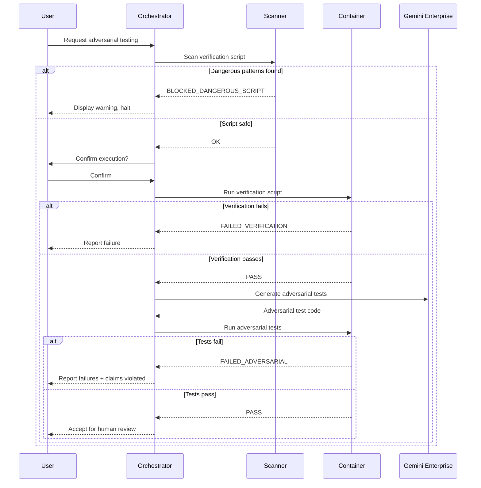

# 180 - Feature: Adversarial Testing Workflow

<!-- Template Metadata
Last Updated: 2025-01-27
Updated By: Issue #80 LLD creation
Update Reason: Initial LLD creation for adversarial testing workflow
-->

## 1. Context & Goal
* **Issue:** #80
* **Objective:** Establish a workflow where implementation and verification are performed by separate, adversarial LLMs with mandatory containerized execution
* **Status:** Draft
* **Related Issues:** N/A

### Open Questions

- [ ] Should Testing LLM (Gemini) be able to suggest fixes, or purely report failures?
- [ ] What is the budget threshold for `--max-cost` flag defaulting to skip adversarial testing?
- [ ] Should adversarial testing be mandatory for all PRs or only labeled tickets?
- [ ] How to handle Testing LLM false positives (tests that fail due to test bugs)?

## 2. Proposed Changes

*This section is the **source of truth** for implementation. Describe exactly what will be built.*

### 2.1 Files Changed

| File | Change Type | Description |
|------|-------------|-------------|
| `tools/adversarial_test_workflow.py` | Add | Main orchestrator script coordinating verification and adversarial testing |
| `tools/script_safety_scanner.py` | Add | Shell script and Python AST security scanner |
| `tools/templates/verify-template.sh` | Add | Template for verification scripts |
| `tools/templates/test_adversarial_template.py` | Add | Template for adversarial tests |
| `tools/docker/adversarial-sandbox.Dockerfile` | Add | Container definition for sandboxed execution |
| `tests/fixtures/adversarial/mock_gemini_responses.json` | Add | Mocked LLM responses for offline development |
| `tests/fixtures/adversarial/sample_claims.json` | Add | Sample claims for testing |
| `tests/fixtures/adversarial/dangerous_scripts/rm_rf.sh` | Add | Test fixture for destructive command detection |
| `tests/fixtures/adversarial/dangerous_scripts/curl_external.sh` | Add | Test fixture for network access detection |
| `tests/fixtures/adversarial/dangerous_scripts/env_exfil.sh` | Add | Test fixture for environment exfiltration |
| `tests/unit/test_adversarial_workflow.py` | Add | Unit tests for orchestrator |
| `tests/unit/test_script_safety_scanner.py` | Add | Unit tests for security scanner |
| `docs/adr/0015-adversarial-testing-workflow.md` | Add | Architecture decision record |
| `docs/reports/adversarial-costs.csv` | Add | Cost tracking for adversarial testing runs |
| `docs/reports/adversarial-testing/implementation-report.md` | Add | Implementation report |
| `docs/reports/adversarial-testing/test-report.md` | Add | Test report |
| `tools/run_issue_workflow.py` | Modify | Add N2.5 adversarial testing gate |
| `docs/wiki/governance-workflow.md` | Modify | Document new gate |
| `CLAUDE.md` | Modify | Add adversarial testing prompts for Implementation LLM |
| `config/gemini.yaml` | Modify | Add enterprise and data_retention settings |

### 2.1.1 Path Validation (Mechanical - Auto-Checked)

*Issue #277: Before human or Gemini review, paths are verified programmatically.*

Mechanical validation automatically checks:
- All "Modify" files must exist in repository
- All "Delete" files must exist in repository
- All "Add" files must have existing parent directories
- No placeholder prefixes (`src/`, `lib/`, `app/`) unless directory exists

**If validation fails, the LLD is BLOCKED before reaching review.**

### 2.2 Dependencies

```toml
# pyproject.toml additions
docker = "^7.0.0"  # Docker SDK for Python
```

### 2.3 Data Structures

```python
# Pseudocode - NOT implementation

class VerificationResult(TypedDict):
    status: Literal["PASS", "FAILED_VERIFICATION", "FAILED_IMPORT", "FAILED_TIMEOUT", 
                    "BLOCKED_DANGEROUS_SCRIPT", "CANCELLED", "DRY_RUN"]
    stderr: str | None  # Captured stderr on failure
    stdout: str | None  # Captured stdout
    duration_seconds: float  # Execution time
    timeout_exceeded: bool  # Whether timeout was hit

class AdversarialTestResult(TypedDict):
    status: Literal["PASS", "FAILED_ADVERSARIAL", "FAILED_TIMEOUT"]
    failures: list[TestFailure]  # List of failed tests
    claims_violated: list[str]  # Which claims were broken
    duration_seconds: float

class TestFailure(TypedDict):
    test_name: str  # e.g., "test_vscode_with_spaces_in_path"
    claim_tested: str  # The claim this test was designed to break
    error_type: str  # e.g., "FileNotFoundError"
    error_message: str  # Full error message
    traceback: str  # Stack trace

class DangerousPattern(TypedDict):
    line_number: int
    content: str  # The dangerous line
    pattern_type: Literal["NETWORK_ACCESS", "DESTRUCTIVE", "PRIVILEGE_ESCALATION", "EXFILTRATION"]
    severity: Literal["CRITICAL", "HIGH", "MEDIUM"]

class WorkflowConfig(TypedDict):
    verification_timeout: int  # Default 300 seconds
    adversarial_timeout: int  # Default 600 seconds
    memory_limit: str  # Default "2g"
    cpu_limit: str  # Default "2"
    network_enabled: bool  # Default False
    auto_confirm: bool  # Default False
    dry_run: bool  # Default False
    max_cost: float | None  # Budget cap in dollars
```

### 2.4 Function Signatures

```python
# tools/adversarial_test_workflow.py

def run_adversarial_workflow(
    implementation_files: list[Path],
    claims: list[str],
    config: WorkflowConfig
) -> dict[str, Any]:
    """
    Main entry point for adversarial testing workflow.
    Coordinates verification and adversarial testing phases.
    """
    ...

def run_verification_phase(
    verification_script: Path,
    config: WorkflowConfig
) -> VerificationResult:
    """
    Run the Implementation LLM's verification script in container.
    Returns detailed result with status and captured output.
    """
    ...

def run_adversarial_phase(
    implementation_files: list[Path],
    claims: list[str],
    config: WorkflowConfig
) -> AdversarialTestResult:
    """
    Invoke Testing LLM to generate adversarial tests, then execute them.
    Returns detailed result with any failures and violated claims.
    """
    ...

def invoke_testing_llm(
    implementation_files: list[Path],
    claims: list[str]
) -> str:
    """
    Call Gemini Enterprise API to generate adversarial tests.
    Returns generated test code as string.
    """
    ...

def get_user_confirmation(prompt: str) -> bool:
    """
    Display prompt and wait for user confirmation.
    Returns True if user approves, False otherwise.
    """
    ...

def parse_test_failures(pytest_output: str) -> list[TestFailure]:
    """
    Parse pytest output to extract structured failure information.
    Maps failures back to claims being tested.
    """
    ...

def sanitize_environment() -> dict[str, str]:
    """
    Create sanitized environment dict with dangerous vars removed.
    Clears PYTHONPATH, API keys, and internal credentials.
    """
    ...

def log_cost(
    implementation_files: list[Path],
    tokens_used: int,
    model: str,
    cost_usd: float
) -> None:
    """
    Append cost record to adversarial-costs.csv for tracking.
    """
    ...


# tools/script_safety_scanner.py

def scan_shell_script(script_path: Path) -> list[DangerousPattern]:
    """
    Scan shell script for dangerous patterns.
    Returns list of dangerous patterns found with line numbers.
    """
    ...

def scan_python_ast(script_path: Path) -> list[DangerousPattern]:
    """
    Perform AST analysis on Python script for dangerous imports/calls.
    Returns list of dangerous patterns found.
    """
    ...

def is_external_network_access(command: str) -> bool:
    """
    Check if command attempts to access external network.
    Detects curl/wget to external IPs, nc connections, etc.
    """
    ...

def is_destructive_command(command: str) -> bool:
    """
    Check if command is destructive (rm -rf, shutil.rmtree on system paths).
    """
    ...

def is_privilege_escalation(command: str) -> bool:
    """
    Check for sudo, su, or other privilege escalation attempts.
    """
    ...

def format_danger_report(patterns: list[DangerousPattern]) -> str:
    """
    Format dangerous patterns into human-readable warning message.
    """
    ...
```

### 2.5 Logic Flow (Pseudocode)

```
ADVERSARIAL WORKFLOW MAIN FLOW:
1. Parse CLI arguments (implementation files, claims, flags)
2. Load configuration from flags and defaults
3. Locate verification script (verify-{feature}.sh)

4. IF dry_run THEN
   - Display verification script content
   - Display what commands WOULD be executed
   - Return status: DRY_RUN
   - EXIT

5. Scan verification script for dangerous patterns
6. IF dangerous_patterns found THEN
   - Display warning with specific dangerous lines
   - IF NOT allow_dangerous flag THEN
     - Return status: BLOCKED_DANGEROUS_SCRIPT
     - EXIT

7. IF NOT auto_confirm THEN
   - Display confirmation prompt with script preview
   - IF user declines THEN
     - Return status: CANCELLED
     - EXIT

8. Build Docker container command with:
   - Network isolation (--network=none unless --allow-network)
   - Memory limit (--memory=2g)
   - CPU limit (--cpus=2)
   - Workspace mount only (/workspace:rw)
   - Sanitized environment

9. Run verification script in container with timeout
10. IF timeout exceeded THEN
    - Return status: FAILED_TIMEOUT
    - EXIT

11. Parse verification script output
12. IF ImportError or ModuleNotFoundError in stderr THEN
    - Return status: FAILED_IMPORT
    - EXIT

13. IF verification returncode != 0 THEN
    - Return status: FAILED_VERIFICATION
    - EXIT

14. Estimate adversarial testing cost
15. IF max_cost set AND estimated_cost > max_cost THEN
    - Log skip reason
    - Return status: SKIPPED_COST
    - EXIT

16. Invoke Testing LLM (Gemini Enterprise) with:
    - Implementation file contents
    - Claims list
    - Request for adversarial tests

17. Write generated tests to test_adversarial_{feature}.py
18. Scan generated tests for dangerous patterns (same as step 5)

19. Run adversarial tests in container with timeout (10 min)
20. IF timeout exceeded THEN
    - Return status: FAILED_TIMEOUT
    - EXIT

21. Parse pytest output for failures
22. IF failures found THEN
    - Map failures to violated claims
    - Return status: FAILED_ADVERSARIAL with failure details
    - EXIT

23. Log cost to adversarial-costs.csv
24. Return status: PASS

SCRIPT SAFETY SCANNER FLOW:
1. Read script content
2. FOR each line in script:
   a. Check against network access patterns (curl, wget, nc to external)
   b. Check against destructive patterns (rm -rf, shutil.rmtree on /)
   c. Check against privilege escalation (sudo, su)
   d. Check against exfiltration (env piped to network)
   e. IF pattern matches, record with line number and severity

3. FOR Python scripts specifically:
   a. Parse AST
   b. Check imports for dangerous modules (os.system, subprocess shell=True)
   c. Check function calls for dangerous operations
   d. Check path arguments for system path access

4. Return list of dangerous patterns with severity
```

### 2.6 Technical Approach

* **Module:** `tools/adversarial_test_workflow.py`
* **Pattern:** Pipeline pattern with fail-fast semantics
* **Key Decisions:**
  - Mandatory containerization ensures no LLM-generated code runs on host
  - User confirmation required by default to prevent accidental execution
  - Pre-execution scanning catches dangerous patterns before user sees prompt
  - Gemini Enterprise with ZDR for data residency compliance

### 2.7 Architecture Decisions

| Decision | Options Considered | Choice | Rationale |
|----------|-------------------|--------|-----------|
| Execution environment | Host, VM, Container | Container (Docker) | Lightweight, consistent, easily isolated |
| Testing LLM | Claude, Gemini, GPT-4 | Gemini Enterprise | Separate entity from implementation LLM, ZDR available |
| Confirmation model | Auto-confirm, Always confirm, Opt-in confirm | Default confirm, opt-in auto | Balance safety with CI automation needs |
| Script scanning | Regex only, AST only, Both | Both | Regex for shell, AST for Python gives comprehensive coverage |
| Cost tracking | None, Per-run logging, Budget enforcement | Per-run logging + optional budget | Enables cost visibility without blocking by default |

**Architectural Constraints:**
- Must integrate with existing governance workflow at N2.5 gate
- Cannot introduce non-containerized execution path
- Must support offline testing via mocked LLM responses

## 3. Requirements

*What must be true when this is done. These become acceptance criteria.*

1. Orchestrator MUST run all verification scripts in Docker container
2. Orchestrator MUST require user confirmation before executing generated scripts
3. `--dry-run` mode MUST show script content without any execution
4. Shell script inspection MUST block dangerous commands before confirmation prompt
5. Verification scripts MUST timeout after 5 minutes with clear error message
6. Adversarial test suites MUST timeout after 10 minutes with clear error message
7. Testing LLM MUST receive implementation code and generate adversarial tests
8. Adversarial tests MUST execute without mocks for subprocess/external calls
9. ImportError/ModuleNotFoundError MUST halt workflow with FAILED_IMPORT status
10. Edge cases MUST be tested (unicode, paths with spaces, missing commands)
11. N2.5 gate MUST be integrated into issue governance workflow
12. Failure reporting MUST show exact test output and claim violated
13. Cost per adversarial test run MUST be logged to tracking CSV
14. Environment variables MUST be sanitized before script execution

## 4. Alternatives Considered

| Option | Pros | Cons | Decision |
|--------|------|------|----------|
| Host execution with sandboxing | Simpler setup, faster | Security risk, escape vectors | **Rejected** |
| Docker containerization | Strong isolation, portable | Requires Docker installed | **Selected** |
| VM-based execution | Strongest isolation | Heavy, slow startup | **Rejected** |

| Option | Pros | Cons | Decision |
|--------|------|------|----------|
| Same LLM for testing | Simpler integration | Conflict of interest | **Rejected** |
| Separate Gemini instance | Adversarial incentive | Additional API costs | **Selected** |
| Rule-based test generation | Predictable, cheap | Limited coverage | **Rejected** |

| Option | Pros | Cons | Decision |
|--------|------|------|----------|
| Auto-confirm by default | Fast CI execution | Security risk | **Rejected** |
| Always require confirmation | Maximum safety | Blocks CI automation | **Rejected** |
| Opt-in auto-confirm | Balances safety and automation | Slight complexity | **Selected** |

**Rationale:** Container isolation provides security without VM overhead. Separate Testing LLM creates genuine adversarial pressure. Opt-in auto-confirm enables CI while defaulting to safety.

## 5. Data & Fixtures

### 5.1 Data Sources

| Attribute | Value |
|-----------|-------|
| Source | Implementation files from local filesystem, claims from CLI args |
| Format | Python source files, JSON claims list |
| Size | Typically <100KB per implementation file |
| Refresh | Per-invocation |
| Copyright/License | N/A (user's own code) |

### 5.2 Data Pipeline

```
Implementation Files ──read──► Orchestrator ──API call──► Gemini Enterprise
                                    │
Claims (CLI args) ─────────────────┘
                                    │
                                    ▼
                           Generated Tests ──container──► Test Execution
                                    │
                                    ▼
                              Results/Failures ──log──► adversarial-costs.csv
```

### 5.3 Test Fixtures

| Fixture | Source | Notes |
|---------|--------|-------|
| `mock_gemini_responses.json` | Generated | Sample adversarial test outputs |
| `sample_claims.json` | Hardcoded | Example claims for testing |
| `dangerous_scripts/*.sh` | Hardcoded | Known-dangerous scripts for scanner testing |

### 5.4 Deployment Pipeline

Test fixtures are version-controlled and deployed with code. No external data dependencies.

## 6. Diagram

### 6.1 Mermaid Quality Gate

- [x] **Simplicity:** Similar components collapsed
- [x] **No touching:** All elements have visual separation
- [x] **No hidden lines:** All arrows fully visible
- [x] **Readable:** Labels not truncated, flow direction clear
- [ ] **Auto-inspected:** Agent rendered via mermaid.ink and viewed

**Auto-Inspection Results:**
```
- Touching elements: [ ] None / [ ] Found: ___
- Hidden lines: [ ] None / [ ] Found: ___
- Label readability: [ ] Pass / [ ] Issue: ___
- Flow clarity: [ ] Clear / [ ] Issue: ___
```

### 6.2 Diagram



## 7. Security & Safety Considerations

### 7.1 Security

| Concern | Mitigation | Status |
|---------|------------|--------|
| Arbitrary code execution | Mandatory Docker containerization | Addressed |
| Network exfiltration | `--network=none` default, explicit opt-in | Addressed |
| Filesystem escape | Workspace-only mount, system paths read-only | Addressed |
| Privilege escalation | No sudo in container, non-root user | Addressed |
| Environment variable leakage | Sanitize PYTHONPATH, API keys before execution | Addressed |
| Malicious LLM output | Pre-execution scanning of generated scripts | Addressed |
| External IP access | Scanner detects curl/wget to external addresses | Addressed |

### 7.2 Safety

| Concern | Mitigation | Status |
|---------|------------|--------|
| Runaway script | 5-minute verification timeout, 10-minute adversarial timeout | Addressed |
| Resource exhaustion | Docker --memory=2g --cpus=2 limits | Addressed |
| Data loss | Container has no access to system paths | Addressed |
| Accidental execution | User confirmation required by default | Addressed |
| CI pipeline hang | Timeout enforcement prevents indefinite blocking | Addressed |

**Fail Mode:** Fail Closed - Any suspicious pattern blocks execution rather than proceeding

**Recovery Strategy:** User can modify script and retry; --allow-dangerous provides explicit override with audit trail

## 8. Performance & Cost Considerations

### 8.1 Performance

| Metric | Budget | Approach |
|--------|--------|----------|
| Verification timeout | 5 minutes | subprocess timeout parameter |
| Adversarial timeout | 10 minutes | subprocess timeout parameter |
| Container startup | <5 seconds | Pre-built image, minimal base |
| Scanner execution | <1 second | Regex + single-pass AST |

**Bottlenecks:** LLM API latency for adversarial test generation (~5-30 seconds)

### 8.2 Cost Analysis

| Resource | Unit Cost | Estimated Usage | Monthly Cost |
|----------|-----------|-----------------|--------------|
| Gemini Flash (standard) | ~$0.01-0.05 per generation | 100 tickets/month | $1-5 |
| Gemini Pro (complex) | ~$0.10-0.50 per generation | 20 tickets/month | $2-10 |
| Docker compute | ~$0 (local) | N/A | $0 |

**Cost Controls:**
- [x] Gemini Flash by default, Pro only for complexity:high tickets
- [x] `--max-cost` flag to skip if estimated cost exceeds threshold
- [x] Per-run cost logging to adversarial-costs.csv
- [x] Caching strategy for unchanged implementation files (future)

**Worst-Case Scenario:** 1000 tickets/month with all Gemini Pro = $500/month (still manageable)

## 9. Legal & Compliance

| Concern | Applies? | Mitigation |
|---------|----------|------------|
| PII/Personal Data | No | Implementation code only, no user data |
| Third-Party Licenses | Yes | Gemini Enterprise agreement in place |
| Terms of Service | Yes | ZDR policy ensures compliance |
| Data Retention | Yes | ZDR prevents Gemini from storing code |
| Export Controls | No | No restricted algorithms |

**Data Classification:** Internal (proprietary implementation code)

**Compliance Checklist:**
- [x] No PII stored without consent
- [x] Gemini Enterprise license verified
- [x] ZDR policy enabled in config
- [x] Local audit trail for all API calls

## 10. Verification & Testing

### 10.0 Test Plan (TDD - Complete Before Implementation)

| Test ID | Test Description | Expected Behavior | Status |
|---------|------------------|-------------------|--------|
| T010 | Dry-run shows script without execution | Script content displayed, no subprocess calls | RED |
| T020 | Dangerous script blocked before confirmation | BLOCKED_DANGEROUS_SCRIPT returned | RED |
| T030 | Verification timeout enforced | FAILED_TIMEOUT after 5 minutes | RED |
| T040 | ImportError halts workflow | FAILED_IMPORT status returned | RED |
| T050 | Adversarial tests generated from claims | Test file contains tests for each claim | RED |
| T060 | Container isolation prevents filesystem escape | Write to /etc fails | RED |
| T070 | Network isolation prevents external access | curl to external IP fails | RED |
| T080 | User confirmation required by default | Execution blocked without confirmation | RED |
| T090 | Cost logged after successful run | CSV contains new row | RED |
| T100 | Environment sanitized | PYTHONPATH and API keys cleared | RED |

**Coverage Target:** ≥95% for all new code

**TDD Checklist:**
- [ ] All tests written before implementation
- [ ] Tests currently RED (failing)
- [ ] Test IDs match scenario IDs in 10.1
- [ ] Test file created at: `tests/unit/test_adversarial_workflow.py`

### 10.1 Test Scenarios

| ID | Scenario | Type | Input | Expected Output | Pass Criteria |
|----|----------|------|-------|-----------------|---------------|
| 010 | Dry-run mode | Auto | --dry-run flag | Script content displayed | No subprocess calls made |
| 020 | Dangerous curl blocked | Auto | Script with `curl http://evil.com` | BLOCKED_DANGEROUS_SCRIPT | Warning displayed |
| 030 | Dangerous rm blocked | Auto | Script with `rm -rf /` | BLOCKED_DANGEROUS_SCRIPT | Warning displayed |
| 040 | Verification timeout | Auto | Script with `sleep 600` | FAILED_TIMEOUT | Exit within 305 seconds |
| 050 | ImportError detected | Auto | Script importing nonexistent module | FAILED_IMPORT | stderr parsed correctly |
| 060 | ModuleNotFoundError detected | Auto | Script with missing package | FAILED_IMPORT | stderr parsed correctly |
| 070 | Successful verification | Auto | Valid verification script | PASS | Proceeds to adversarial phase |
| 080 | Adversarial test generation | Auto-Live | Implementation + claims | Generated test file | Tests target each claim |
| 090 | Adversarial failure reported | Auto | Test that breaks claim | FAILED_ADVERSARIAL | Claim violation identified |
| 100 | All tests pass | Auto | Solid implementation | PASS | Accepted for review |
| 110 | Container network isolation | Auto | Script with curl | Network unreachable error | --network=none enforced |
| 120 | Container filesystem isolation | Auto | Script writing to /etc | Permission denied | Only /workspace writable |
| 130 | User confirmation prompt | Auto | Default config | Execution paused | Waits for input |
| 140 | Auto-confirm with containerized | Auto | --auto-confirm --containerized | Execution proceeds | No prompt shown |
| 150 | Cost logging | Auto | Successful run | CSV updated | Row contains timestamp, cost |
| 160 | Environment sanitization | Auto | PYTHONPATH set | PYTHONPATH cleared in container | env shows empty PYTHONPATH |
| 170 | AST scanner Python dangerous import | Auto | Python with os.system | BLOCKED_DANGEROUS_SCRIPT | os.system flagged |
| 180 | Self-destruct test | Auto | Script attempting workspace deletion | BLOCKED_DANGEROUS_OPERATION | Logged and blocked |

### 10.2 Test Commands

```bash
# Run all automated tests (mocked)
poetry run pytest tests/unit/test_adversarial_workflow.py -v

# Run all automated tests (mocked)
poetry run pytest tests/unit/test_script_safety_scanner.py -v

# Run only fast/mocked tests (exclude live)
poetry run pytest tests/unit/ -v -m "not live"

# Run live integration tests (requires Gemini API)
poetry run pytest tests/unit/test_adversarial_workflow.py -v -m live
```

### 10.3 Manual Tests (Only If Unavoidable)

**N/A - All scenarios automated.**

## 11. Risks & Mitigations

| Risk | Impact | Likelihood | Mitigation |
|------|--------|------------|------------|
| Docker not installed on user machine | High | Medium | Clear error message with installation instructions |
| Gemini API unavailable | Medium | Low | Offline mode with mocked responses for development |
| Testing LLM generates low-quality tests | Medium | Medium | Template and examples guide generation |
| Scanner has false positives | Low | Medium | --allow-dangerous override with logging |
| Scanner has false negatives | High | Low | Regular security audit of patterns, user reports |
| Container escape vulnerability | Critical | Very Low | Use official Docker images, keep updated |
| Cost overruns | Medium | Low | --max-cost flag, per-run logging, alerts |

## 12. Definition of Done

### Code
- [ ] `adversarial_test_workflow.py` orchestrator implemented
- [ ] `script_safety_scanner.py` security scanner implemented
- [ ] Mandatory Docker containerization implemented
- [ ] Shell script inspection implemented
- [ ] AST-based Python validation implemented
- [ ] User confirmation prompt implemented
- [ ] `--dry-run` mode implemented
- [ ] Timeout handling implemented
- [ ] Resource constraint enforcement implemented
- [ ] Environment sanitization implemented
- [ ] Code comments reference this LLD

### Tests
- [ ] All test scenarios pass
- [ ] Test coverage ≥95%
- [ ] Mocked LLM response fixtures created
- [ ] Self-destruct test in security suite

### Documentation
- [ ] ADR created at `docs/adr/0015-adversarial-testing-workflow.md`
- [ ] Governance workflow wiki updated
- [ ] CLAUDE.md updated with verification script requirements
- [ ] Implementation Report completed
- [ ] Test Report completed
- [ ] File inventory updated

### Review
- [ ] Code review completed
- [ ] 0809 Security Audit - PASS
- [ ] 0817 Wiki Alignment Audit - PASS
- [ ] User approval before closing issue

### 12.1 Traceability (Mechanical - Auto-Checked)

*Issue #277: Cross-references are verified programmatically.*

Mechanical validation automatically checks:
- Every file mentioned in this section must appear in Section 2.1
- Every risk mitigation in Section 11 should have a corresponding function in Section 2.4

**If files are missing from Section 2.1, the LLD is BLOCKED.**

---

## Appendix: Review Log

*Track all review feedback with timestamps and implementation status.*

### Review Summary

| Review | Date | Verdict | Key Issue |
|--------|------|---------|-----------|
| - | - | - | - |

**Final Status:** PENDING