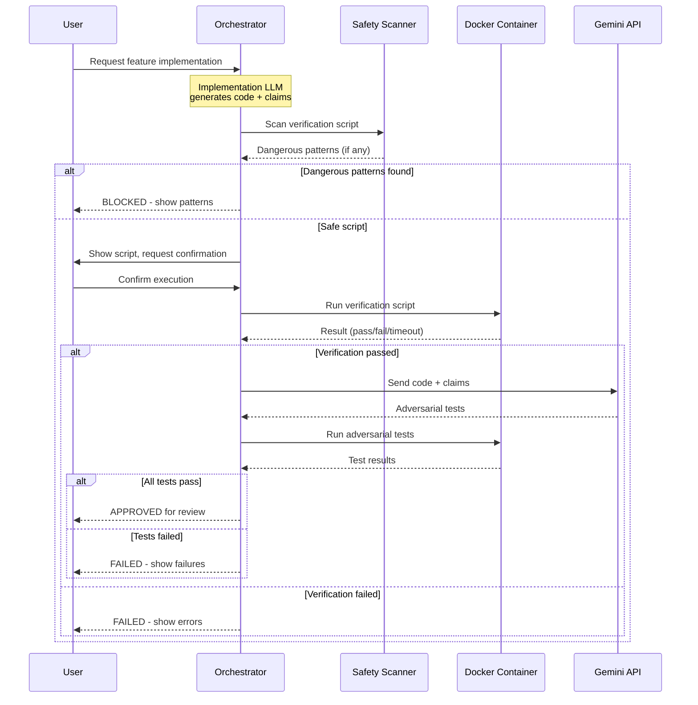

# 180 - Feature: Adversarial Testing Workflow

<!-- Template Metadata
Last Updated: 2026-01-27
Updated By: Initial LLD creation from Issue #80
Update Reason: New feature design for adversarial testing separation of implementation from verification
-->

## 1. Context & Goal
* **Issue:** #80
* **Objective:** Establish a workflow where implementation and verification are performed by separate, adversarial LLMs to catch bugs before code ships to production
* **Status:** Draft
* **Related Issues:** N/A

### Open Questions

- [ ] Should Testing LLM be allowed to suggest fixes, or pure adversarial role only?
- [ ] What scoring mechanism should be used to evaluate Testing LLM effectiveness?
- [ ] Should adversarial tests be cached across versions of unchanged files?
- [ ] How to handle false positives (tests that fail due to test bugs, not implementation bugs)?

## 2. Proposed Changes

*This section is the **source of truth** for implementation. Describe exactly what will be built.*

### 2.1 Files Changed

| File | Change Type | Description |
|------|-------------|-------------|
| `tools/adversarial_test_workflow.py` | Add | Main orchestrator script coordinating verification and adversarial testing |
| `tools/script_safety_scanner.py` | Add | Shell script and Python AST security scanner |
| `tools/templates/verify-template.sh` | Add | Template for verification scripts |
| `tools/templates/test_adversarial_template.py` | Add | Template for adversarial tests |
| `tools/docker/adversarial-sandbox.Dockerfile` | Add | Container definition for sandboxed execution |
| `tests/fixtures/adversarial/mock_gemini_responses.json` | Add | Mocked LLM responses for offline development |
| `tests/fixtures/adversarial/sample_claims.json` | Add | Sample claims for testing |
| `tests/fixtures/adversarial/dangerous_scripts/rm_rf_root.sh` | Add | Test fixture for security scanner |
| `tests/fixtures/adversarial/dangerous_scripts/curl_external.sh` | Add | Test fixture for security scanner |
| `tests/fixtures/adversarial/dangerous_scripts/env_exfiltration.sh` | Add | Test fixture for security scanner |
| `tests/unit/test_adversarial_workflow.py` | Add | Unit tests for orchestrator |
| `tests/unit/test_script_safety_scanner.py` | Add | Unit tests for security scanner |
| `docs/adr/0015-adversarial-testing-workflow.md` | Add | Architecture decision record |
| `docs/reports/adversarial-costs.csv` | Add | Cost tracking for adversarial testing runs |
| `tools/run_issue_workflow.py` | Modify | Add N2.5 adversarial testing gate |
| `docs/wiki/governance-workflow.md` | Modify | Document new gate |
| `CLAUDE.md` | Modify | Add adversarial testing prompts for Implementation LLM |
| `config/gemini.yaml` | Modify | Add enterprise and data_retention settings |

### 2.1.1 Path Validation (Mechanical - Auto-Checked)

*Issue #277: Before human or Gemini review, paths are verified programmatically.*

Mechanical validation automatically checks:
- All "Modify" files must exist in repository
- All "Delete" files must exist in repository
- All "Add" files must have existing parent directories
- No placeholder prefixes (`src/`, `lib/`, `app/`) unless directory exists

**If validation fails, the LLD is BLOCKED before reaching review.**

### 2.2 Dependencies

```toml
# pyproject.toml additions
docker = "^7.0.0"  # For programmatic container management
```

### 2.3 Data Structures

```python
# Pseudocode - NOT implementation

class VerificationResult(TypedDict):
    status: Literal["PASS", "FAILED_VERIFICATION", "FAILED_IMPORT", "FAILED_TIMEOUT", 
                    "BLOCKED_DANGEROUS_SCRIPT", "CANCELLED", "DRY_RUN"]
    stderr: str | None  # Captured error output
    duration_seconds: float  # Time taken
    patterns: list[str] | None  # Dangerous patterns if blocked

class AdversarialTestResult(TypedDict):
    status: Literal["PASS", "FAILED_ADVERSARIAL", "FAILED_TIMEOUT"]
    failures: list[TestFailure]  # Specific test failures
    claims_violated: list[str]  # Which claims were disproven
    duration_seconds: float

class TestFailure(TypedDict):
    test_name: str  # e.g., "test_vscode_with_spaces_in_path"
    claim: str  # The claim being tested
    error_type: str  # e.g., "FileNotFoundError"
    error_message: str  # Full error text
    traceback: str  # Stack trace

class DangerousPattern(TypedDict):
    line_number: int
    pattern_type: Literal["network", "destructive", "privilege", "exfiltration"]
    matched_text: str
    severity: Literal["warning", "block"]

class WorkflowConfig(TypedDict):
    dry_run: bool
    auto_confirm: bool
    containerized: bool  # Always True for execution
    verification_timeout: int  # Default 300 seconds
    adversarial_timeout: int  # Default 600 seconds
    memory_limit: str  # Default "2g"
    cpu_limit: str  # Default "2"
    allow_network: bool  # Default False
    allow_dangerous: bool  # Default False
    max_cost: float | None  # Budget cap in dollars
```

### 2.4 Function Signatures

```python
# tools/adversarial_test_workflow.py

def run_adversarial_workflow(
    implementation_files: list[Path],
    claims: list[str],
    config: WorkflowConfig
) -> dict[str, Any]:
    """
    Main orchestrator entry point.
    
    Sequences: security scan → user confirm → verification → adversarial tests.
    All execution happens in mandatory Docker container.
    """
    ...

def scan_verification_script(script_path: Path) -> list[DangerousPattern]:
    """Pre-execution security scan for shell scripts."""
    ...

def get_user_confirmation(prompt: str, script_preview: str) -> bool:
    """Interactive confirmation before script execution."""
    ...

def run_verification_in_container(
    script_path: Path,
    workspace: Path,
    timeout: int,
    config: WorkflowConfig
) -> VerificationResult:
    """Execute verification script in sandboxed Docker container."""
    ...

def invoke_testing_llm(
    implementation_files: list[Path],
    claims: list[str],
    model: Literal["gemini-flash", "gemini-pro"]
) -> str:
    """Call Gemini Enterprise API to generate adversarial tests."""
    ...

def run_adversarial_tests_in_container(
    test_file: Path,
    workspace: Path,
    timeout: int,
    config: WorkflowConfig
) -> AdversarialTestResult:
    """Execute adversarial tests in sandboxed Docker container."""
    ...

def parse_pytest_failures(output: str) -> list[TestFailure]:
    """Extract structured failure information from pytest output."""
    ...

def log_cost(
    model: str,
    input_tokens: int,
    output_tokens: int,
    csv_path: Path
) -> None:
    """Append cost data to tracking CSV."""
    ...

# tools/script_safety_scanner.py

def scan_shell_script(script_content: str) -> list[DangerousPattern]:
    """Scan shell script for dangerous patterns."""
    ...

def scan_python_ast(python_content: str) -> list[DangerousPattern]:
    """AST-based scan of Python for dangerous imports/calls."""
    ...

def is_external_ip(ip_or_url: str) -> bool:
    """Check if URL/IP points to external network."""
    ...

def get_dangerous_shell_patterns() -> dict[str, re.Pattern]:
    """Return compiled regex patterns for dangerous shell commands."""
    ...
```

### 2.5 Logic Flow (Pseudocode)

```
FUNCTION run_adversarial_workflow(files, claims, config):
    
    1. Load verification script from Implementation LLM output
    
    2. IF config.dry_run THEN
       - Display script contents
       - Display claims
       - RETURN {status: "DRY_RUN"}
    
    3. Perform security scan on verification script
       dangerous_patterns = scan_verification_script(script)
       
    4. IF dangerous_patterns AND NOT config.allow_dangerous THEN
       - Display warning with specific patterns
       - RETURN {status: "BLOCKED_DANGEROUS_SCRIPT", patterns}
    
    5. IF NOT config.auto_confirm THEN
       - Display script preview
       - IF NOT get_user_confirmation() THEN
           RETURN {status: "CANCELLED"}
    
    6. Build Docker container if not exists
       - Use adversarial-sandbox.Dockerfile
       - Mount workspace as only writable volume
       - Set network=none unless allow_network
    
    7. Run verification script in container
       result = run_verification_in_container(
           script, workspace, config.verification_timeout, config)
       
    8. IF result.status != "PASS" THEN
       - Parse stderr for specific error type
       - RETURN result with appropriate status
    
    9. Invoke Testing LLM via Gemini Enterprise API
       - Send implementation files + claims
       - Receive adversarial test code
       - Write to test_adversarial_{feature}.py
    
    10. Log API cost to CSV
    
    11. Run adversarial tests in container
        adversarial_result = run_adversarial_tests_in_container(
            test_file, workspace, config.adversarial_timeout, config)
    
    12. Parse test output
        - Extract failed tests
        - Map failures to claims
    
    13. RETURN {
        status: "PASS" or "FAILED_ADVERSARIAL",
        verification_result,
        adversarial_result,
        claims_violated
    }
```

### 2.6 Technical Approach

* **Module:** `tools/adversarial_test_workflow.py`
* **Pattern:** Pipeline pattern with mandatory containerization gate
* **Key Decisions:**
  - All execution through Docker for security isolation
  - Pre-execution scanning happens on host (safe - no execution)
  - User confirmation required by default (opt-out only with `--auto-confirm --containerized`)
  - Gemini Enterprise with ZDR for data compliance

### 2.7 Architecture Decisions

| Decision | Options Considered | Choice | Rationale |
|----------|-------------------|--------|-----------|
| Execution environment | Host, VM, Container | Container (Docker) | Balance of isolation and usability; VMs too heavy, host unsafe |
| Security scanning | Runtime only, Pre-execution, Both | Pre-execution + container isolation | Defense in depth; block dangerous scripts before they run |
| LLM for adversarial tests | Same Claude, Different Claude, Gemini | Gemini | Different model reduces blind spots; Gemini available via existing integration |
| Confirmation model | Always confirm, Auto-confirm, Configurable | Configurable with safe defaults | Supports both interactive and CI workflows |
| Timeout enforcement | Soft limits, Hard kills, Progressive | Hard kills with process termination | Runaway scripts must not block workflow |

**Architectural Constraints:**
- Must use existing Gemini integration infrastructure
- Cannot introduce dependencies on specific CI/CD platform
- Must work offline with mocked fixtures for development

## 3. Requirements

1. Orchestrator runs verification scripts in mandatory Docker container with no host execution path
2. User confirmation required before executing any generated script (unless explicit opt-in flags)
3. `--dry-run` mode displays script content without any execution
4. Shell script inspection blocks dangerous commands before confirmation prompt is shown
5. Verification scripts timeout after 5 minutes with clear error message
6. Adversarial test suites timeout after 10 minutes with clear error message
7. Testing LLM (Gemini Enterprise/ZDR) receives implementation code and generates targeted adversarial tests
8. Adversarial tests execute without mocks for subprocess/external calls
9. ImportError and ModuleNotFoundError detected and reported with FAILED_IMPORT status
10. Edge cases tested: unicode, paths with spaces, missing commands
11. False claims exposed: mocked "integration tests" flagged
12. N2.5 gate integrated into existing issue governance workflow
13. Clear failure reporting shows exact test output and claim violated
14. Cost per adversarial test run logged to tracking CSV
15. Environment variables sanitized before script execution

## 4. Alternatives Considered

| Option | Pros | Cons | Decision |
|--------|------|------|----------|
| Same LLM for implementation and testing | Simpler setup, no API costs | Conflict of interest, blind spots persist | **Rejected** |
| Human-written adversarial tests | Highest quality | Doesn't scale, defeats automation purpose | **Rejected** |
| Different Claude instance for testing | Same capabilities | May share blind spots | **Rejected** |
| Gemini for adversarial tests | Different training, fresh perspective | Additional API cost, integration work | **Selected** |
| No containerization (trust scripts) | Faster, simpler | Security risk from LLM-generated code | **Rejected** |
| VM-based isolation | Strongest isolation | Too slow, heavy resource usage | **Rejected** |

**Rationale:** Gemini provides genuinely different perspective from Claude's training, and containerization provides sufficient isolation without VM overhead.

## 5. Data & Fixtures

### 5.1 Data Sources

| Attribute | Value |
|-----------|-------|
| Source | Implementation LLM output (code + claims), Gemini API |
| Format | Python source files, JSON claims, pytest output |
| Size | Typically 1-50KB per implementation, 5-20KB adversarial tests |
| Refresh | Per-workflow execution |
| Copyright/License | N/A (generated content) |

### 5.2 Data Pipeline

```
Implementation Code + Claims ──(prompt)──► Gemini API ──(response)──► Adversarial Tests
                                                                           │
                                                                           ▼
                                                                    Pytest Execution
                                                                           │
                                                                           ▼
                                                                    Results Report
```

### 5.3 Test Fixtures

| Fixture | Source | Notes |
|---------|--------|-------|
| `mock_gemini_responses.json` | Generated | Contains sample adversarial test code for offline testing |
| `sample_claims.json` | Generated | Example claims for various scenarios |
| `dangerous_scripts/*.sh` | Generated | Known-dangerous scripts for scanner testing |

### 5.4 Deployment Pipeline

Development fixtures are committed to repository. Production uses live Gemini API with Enterprise ZDR enabled.

## 6. Diagram

### 6.1 Mermaid Quality Gate

Before finalizing any diagram, verify in [Mermaid Live Editor](https://mermaid.live) or GitHub preview:

- [x] **Simplicity:** Similar components collapsed (per 0006 §8.1)
- [x] **No touching:** All elements have visual separation (per 0006 §8.2)
- [x] **No hidden lines:** All arrows fully visible (per 0006 §8.3)
- [x] **Readable:** Labels not truncated, flow direction clear
- [ ] **Auto-inspected:** Agent rendered via mermaid.ink and viewed (per 0006 §8.5)

**Auto-Inspection Results:**
```
- Touching elements: [ ] None / [ ] Found: ___
- Hidden lines: [ ] None / [ ] Found: ___
- Label readability: [ ] Pass / [ ] Issue: ___
- Flow clarity: [ ] Clear / [ ] Issue: ___
```

*Reference: [0006-mermaid-diagrams.md](0006-mermaid-diagrams.md)*

### 6.2 Diagram



## 7. Security & Safety Considerations

### 7.1 Security

| Concern | Mitigation | Status |
|---------|------------|--------|
| Arbitrary code execution | Mandatory Docker containerization | Addressed |
| Network exfiltration | Container runs with `--network=none` by default | Addressed |
| Filesystem destruction | Container mounts only workspace writable | Addressed |
| Privilege escalation | Container runs as non-root, no sudo | Addressed |
| Environment variable leak | Sanitize PYTHONPATH, API keys before execution | Addressed |
| Malicious LLM output | Pre-execution shell/AST scanning | Addressed |
| Supply chain attack via dependencies | Container uses pinned base image | Addressed |

### 7.2 Safety

| Concern | Mitigation | Status |
|---------|------------|--------|
| Runaway script consumes resources | Hard timeout (5min verify, 10min adversarial) | Addressed |
| Memory exhaustion | Docker `--memory=2g` limit | Addressed |
| CPU exhaustion | Docker `--cpus=2` limit | Addressed |
| User executes without understanding | Confirmation prompt with script preview | Addressed |
| Accidental production execution | Dry-run mode default for new users | Addressed |
| Partial failure leaves bad state | Container isolation prevents host changes | Addressed |

**Fail Mode:** Fail Closed - Any security concern blocks execution rather than proceeding

**Recovery Strategy:** Container termination cleans up all resources; host filesystem unchanged on failure

## 8. Performance & Cost Considerations

### 8.1 Performance

| Metric | Budget | Approach |
|--------|--------|----------|
| Verification latency | < 5 minutes | Hard timeout with process kill |
| Adversarial test latency | < 10 minutes | Hard timeout with process kill |
| Container startup | < 10 seconds | Pre-built image, layer caching |
| Total workflow | < 20 minutes | Parallel where possible |

**Bottlenecks:** Gemini API latency for adversarial test generation (~10-30 seconds)

### 8.2 Cost Analysis

| Resource | Unit Cost | Estimated Usage | Monthly Cost |
|----------|-----------|-----------------|--------------|
| Gemini Flash API | $0.075/1M input, $0.30/1M output | 100 calls/month, 50K tokens avg | ~$2.50 |
| Gemini Pro API | $1.25/1M input, $5.00/1M output | 10 calls/month (complex only) | ~$3.00 |
| Docker execution | $0 (local) | N/A | $0 |

**Cost Controls:**
- [x] Budget alerts: `--max-cost` flag stops if exceeded
- [x] Rate limiting: One adversarial test per implementation
- [x] Tiered models: Flash default, Pro only for `complexity:high`

**Worst-Case Scenario:** If usage spikes 10x, costs increase to ~$55/month. At 100x, ~$550/month. Implement hard budget cap.

## 9. Legal & Compliance

| Concern | Applies? | Mitigation |
|---------|----------|------------|
| PII/Personal Data | No | Implementation code only, no user data |
| Third-Party Licenses | Yes | Gemini Enterprise agreement covers API usage |
| Terms of Service | Yes | Gemini Enterprise ZDR policy enabled |
| Data Retention | Yes | Gemini ZDR = zero retention of input data |
| Export Controls | No | No restricted algorithms or data |

**Data Classification:** Internal (source code sent to Gemini)

**Compliance Checklist:**
- [x] No PII stored without consent (N/A - no PII)
- [x] All third-party licenses compatible (Gemini Enterprise)
- [x] External API usage compliant with provider ToS (ZDR enabled)
- [x] Data retention policy documented (zero retention)

## 10. Verification & Testing

*Ref: [0005-testing-strategy-and-protocols.md](0005-testing-strategy-and-protocols.md)*

**Testing Philosophy:** 100% automated coverage. Manual tests only for actual Docker behavior verification.

### 10.0 Test Plan (TDD - Complete Before Implementation)

| Test ID | Test Description | Expected Behavior | Status |
|---------|------------------|-------------------|--------|
| T010 | test_dry_run_shows_script_no_execution | Returns DRY_RUN status, no subprocess calls | RED |
| T020 | test_dangerous_script_blocked | curl to external blocked, returns BLOCKED status | RED |
| T030 | test_user_cancel_stops_workflow | Cancelled confirmation returns CANCELLED status | RED |
| T040 | test_verification_timeout_enforced | Script exceeding 5min killed, returns FAILED_TIMEOUT | RED |
| T050 | test_import_error_detected | ImportError in stderr returns FAILED_IMPORT | RED |
| T060 | test_adversarial_tests_generated | Gemini response parsed into valid pytest file | RED |
| T070 | test_failed_adversarial_returns_claims | Test failures mapped to violated claims | RED |
| T080 | test_cost_logged_to_csv | API call appends row to cost CSV | RED |
| T090 | test_environment_sanitized | PYTHONPATH and API keys not in container env | RED |
| T100 | test_container_network_disabled | Container cannot reach external network | RED |

**Coverage Target:** ≥95% for all new code

**TDD Checklist:**
- [ ] All tests written before implementation
- [ ] Tests currently RED (failing)
- [ ] Test IDs match scenario IDs in 10.1
- [ ] Test file created at: `tests/unit/test_adversarial_workflow.py`

### 10.1 Test Scenarios

| ID | Scenario | Type | Input | Expected Output | Pass Criteria |
|----|----------|------|-------|-----------------|---------------|
| 010 | Dry-run mode preview | Auto | `--dry-run`, valid script | Script content displayed, no execution | Status=DRY_RUN |
| 020 | Dangerous script blocked | Auto | Script with `curl evil.com` | Blocked with pattern list | Status=BLOCKED |
| 030 | User cancels execution | Auto | Mock stdin "n" | Workflow stops | Status=CANCELLED |
| 040 | Verification timeout | Auto | Script with `sleep 600` | Killed after 5min | Status=FAILED_TIMEOUT |
| 050 | Import error detection | Auto | Script importing missing module | Stderr parsed | Status=FAILED_IMPORT |
| 060 | Adversarial test generation | Auto | Valid code + claims | Valid pytest file | File parses, has tests |
| 070 | Adversarial failure reporting | Auto | Failing adversarial test | Claims mapped to failures | claims_violated populated |
| 080 | Cost tracking | Auto | Gemini API call | Row in CSV | CSV row with tokens, cost |
| 090 | Environment sanitization | Auto | Container execution | No sensitive vars | PYTHONPATH empty |
| 100 | Network isolation | Auto-Live | Container with network call | Connection refused | Network unreachable |
| 110 | Self-destruct protection | Auto | Script with `rm -rf /` | Blocked by scanner | Pattern detected |
| 120 | Full happy path | Auto-Live | Valid implementation + claims | All pass | Status=PASS |

### 10.2 Test Commands

```bash
# Run all automated tests
poetry run pytest tests/unit/test_adversarial_workflow.py tests/unit/test_script_safety_scanner.py -v

# Run only fast/mocked tests (exclude live)
poetry run pytest tests/unit/test_adversarial_workflow.py -v -m "not live"

# Run live integration tests (requires Docker)
poetry run pytest tests/unit/test_adversarial_workflow.py -v -m live
```

### 10.3 Manual Tests (Only If Unavoidable)

| ID | Scenario | Why Not Automated | Steps |
|----|----------|-------------------|-------|
| M01 | Docker isolation verification | Requires inspecting running container | 1. Start container with test script 2. Exec into container 3. Verify /workspace is only writable mount 4. Verify network unreachable |

## 11. Risks & Mitigations

| Risk | Impact | Likelihood | Mitigation |
|------|--------|------------|------------|
| Gemini API unavailable | Med | Low | Fallback to mocked responses for dev, fail gracefully in prod |
| Docker not installed on user machine | High | Med | Clear error message with installation instructions |
| Adversarial tests have false positives | Med | Med | Human review gate after adversarial; can override |
| LLM generates dangerous code bypassing scanner | High | Low | Defense in depth: scanner + container isolation |
| Cost overruns from excessive API calls | Med | Low | `--max-cost` budget cap, cost logging |
| Container escape vulnerability | High | Very Low | Use official Docker, keep updated, minimal container |

## 12. Definition of Done

### Code
- [ ] Implementation complete and linted
- [ ] Code comments reference this LLD
- [ ] `adversarial_test_workflow.py` orchestrator implemented
- [ ] `script_safety_scanner.py` security scanner implemented
- [ ] Docker container definition complete
- [ ] Templates for verification and adversarial tests created

### Tests
- [ ] All test scenarios pass
- [ ] Test coverage ≥95%
- [ ] Security scanner tests include all dangerous patterns
- [ ] Mocked fixtures enable offline development

### Documentation
- [ ] LLD updated with any deviations
- [ ] ADR 0015 documents rationale
- [ ] Governance workflow wiki updated
- [ ] CLAUDE.md updated with verification script requirements
- [ ] Implementation Report (0103) completed
- [ ] Test Report (0113) completed

### Review
- [ ] Code review completed
- [ ] Security review of scanner patterns
- [ ] User approval before closing issue

### 12.1 Traceability (Mechanical - Auto-Checked)

*Issue #277: Cross-references are verified programmatically.*

Mechanical validation automatically checks:
- Every file mentioned in this section must appear in Section 2.1
- Every risk mitigation in Section 11 should have a corresponding function in Section 2.4

**Validation Status:** Pending mechanical check

---

## Appendix: Review Log

*Track all review feedback with timestamps and implementation status.*

### Review Summary

| Review | Date | Verdict | Key Issue |
|--------|------|---------|-----------|
| - | - | - | Awaiting first review |

**Final Status:** PENDING