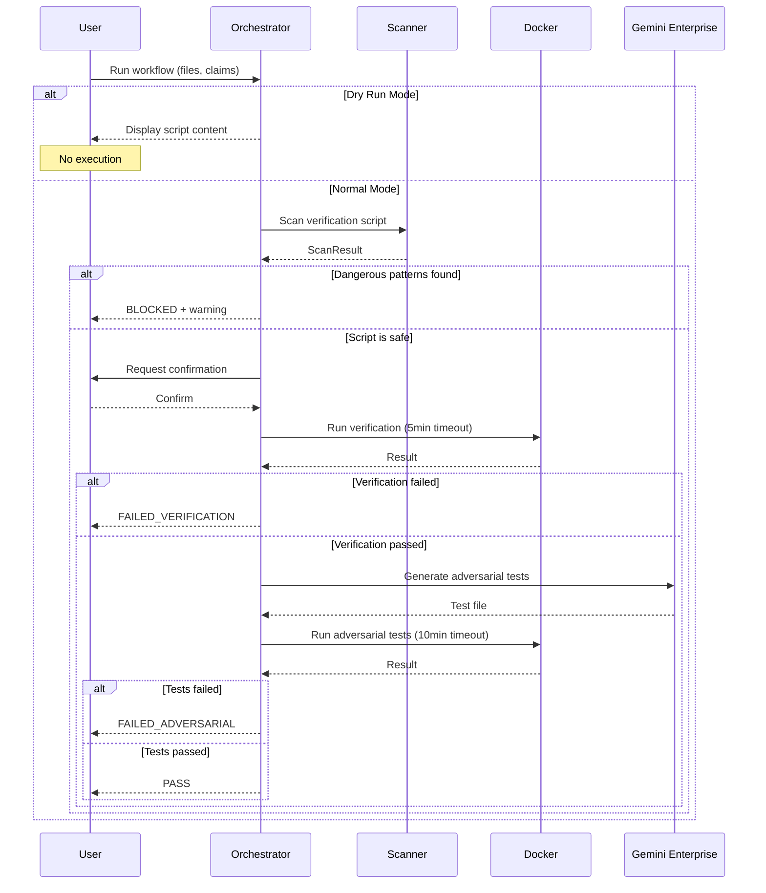

# 180 - Feature: Adversarial Testing Workflow

## 1. Context & Goal
* **Issue:** #80
* **Objective:** Establish a workflow where implementation and verification are performed by separate, adversarial LLMs with mandatory sandboxed execution
* **Status:** Draft
* **Related Issues:** N/A

### Open Questions

- [ ] Should adversarial testing be opt-in (label-based) or mandatory for all tickets?
- [ ] What is the fallback behavior when Docker is unavailable?
- [ ] Should Testing LLM be allowed to suggest fixes or only report failures?
- [ ] How to handle Testing LLM false positives (tests that fail due to test bugs)?

## 2. Proposed Changes

### 2.1 Files Changed

| File | Change Type | Description |
|------|-------------|-------------|
| `tools/adversarial_test_workflow.py` | Add | Main orchestrator script coordinating verification and adversarial testing |
| `tools/script_safety_scanner.py` | Add | Shell script and Python AST security scanner |
| `tools/templates/verify-template.sh` | Add | Template for verification scripts |
| `tools/templates/test_adversarial_template.py` | Add | Template for adversarial test generation |
| `tools/docker/adversarial-sandbox.Dockerfile` | Add | Container definition for sandboxed execution |
| `tests/fixtures/adversarial/mock_gemini_responses.json` | Add | Mocked LLM responses for offline development |
| `tests/fixtures/adversarial/sample_claims.json` | Add | Sample claims for testing |
| `tests/fixtures/adversarial/dangerous_scripts/rm_rf.sh` | Add | Test fixture for security scanner validation |
| `tests/fixtures/adversarial/dangerous_scripts/curl_external.sh` | Add | Test fixture for network access detection |
| `tests/test_adversarial_workflow.py` | Add | Unit tests for orchestrator |
| `tests/test_script_safety_scanner.py` | Add | Unit tests for security scanner |
| `docs/adr/0015-adversarial-testing-workflow.md` | Add | Architecture decision record |
| `docs/reports/adversarial-costs.csv` | Add | Cost tracking for adversarial testing runs |
| `tools/run_issue_workflow.py` | Modify | Add N2.5 adversarial testing gate |
| `docs/wiki/governance-workflow.md` | Modify | Document new gate |
| `CLAUDE.md` | Modify | Add adversarial testing prompts for Implementation LLM |
| `config/gemini.yaml` | Modify | Add enterprise and data_retention settings |

### 2.1.1 Path Validation (Mechanical - Auto-Checked)

Mechanical validation automatically checks:
- All "Modify" files must exist in repository
- All "Delete" files must exist in repository
- All "Add" files must have existing parent directories
- No placeholder prefixes (`src/`, `lib/`, `app/`) unless directory exists

**If validation fails, the LLD is BLOCKED before reaching review.**

### 2.2 Dependencies

```toml
# pyproject.toml additions
docker = "^7.0.0"  # Docker SDK for Python (container management)
```

### 2.3 Data Structures

```python
# Pseudocode - NOT implementation
class AdversarialWorkflowState(TypedDict):
    status: Literal["PENDING", "PASS", "FAILED_VERIFICATION", "FAILED_ADVERSARIAL", 
                    "FAILED_IMPORT", "FAILED_TIMEOUT", "BLOCKED_DANGEROUS_SCRIPT", 
                    "CANCELLED", "DRY_RUN"]
    implementation_files: list[str]  # Paths to implementation files
    claims: list[str]  # Claims from Implementation LLM
    verification_script: str  # Path to verification script
    verification_output: str | None  # stdout from verification
    verification_stderr: str | None  # stderr from verification
    adversarial_tests: str | None  # Path to generated adversarial test file
    adversarial_output: str | None  # pytest output
    failures: list[TestFailure] | None  # Parsed failure details
    cost_usd: float  # Estimated cost of LLM calls
    duration_seconds: float  # Total workflow duration

class TestFailure(TypedDict):
    test_name: str  # Name of failing test
    claim_violated: str  # Which claim this test targeted
    error_type: str  # Exception type
    error_message: str  # Full error message
    traceback: str  # Full traceback

class DangerousPattern(TypedDict):
    line_number: int
    pattern: str  # The dangerous pattern matched
    command: str  # The actual command found
    severity: Literal["CRITICAL", "HIGH", "MEDIUM"]

class ScanResult(TypedDict):
    safe: bool
    patterns: list[DangerousPattern]
    script_path: str
```

### 2.4 Function Signatures

```python
# tools/adversarial_test_workflow.py

def run_adversarial_workflow(
    implementation_files: list[str],
    claims: list[str],
    verification_script: str,
    output_path: str | None = None,
    dry_run: bool = False,
    auto_confirm: bool = False,
    timeout_verification: int = 300,
    timeout_adversarial: int = 600,
    max_cost: float | None = None,
    allow_network: bool = False,
    allow_dangerous: bool = False,
) -> AdversarialWorkflowState:
    """
    Orchestrate the full adversarial testing workflow.
    
    Returns workflow state with status and detailed results.
    """
    ...

def run_verification_in_container(
    script_path: str,
    workspace: str,
    timeout: int = 300,
    memory_limit: str = "2g",
    cpu_limit: int = 2,
    network: bool = False,
) -> tuple[int, str, str]:
    """
    Execute verification script in Docker container.
    
    Returns (return_code, stdout, stderr).
    """
    ...

def invoke_testing_llm(
    implementation_files: list[str],
    claims: list[str],
    model: str = "gemini-flash",
) -> str:
    """
    Call Testing LLM (Gemini) to generate adversarial tests.
    
    Returns path to generated test file.
    """
    ...

def parse_verification_failure(stderr: str) -> tuple[str, str | None]:
    """
    Parse stderr to categorize failure type.
    
    Returns (status, error_detail).
    """
    ...

def parse_pytest_failures(output: str) -> list[TestFailure]:
    """
    Parse pytest output to extract structured failure information.
    """
    ...

def get_user_confirmation(prompt: str) -> bool:
    """
    Display prompt and get explicit user confirmation.
    
    Returns True if user confirms, False otherwise.
    """
    ...

def sanitize_environment() -> dict[str, str]:
    """
    Create sanitized environment dict for container execution.
    
    Removes PYTHONPATH, API keys, and other sensitive variables.
    """
    ...

# tools/script_safety_scanner.py

def scan_shell_script(script_path: str) -> ScanResult:
    """
    Scan shell script for dangerous patterns.
    
    Detects: curl/wget to external IPs, rm -rf, sudo, env exfiltration.
    """
    ...

def scan_python_ast(file_path: str) -> ScanResult:
    """
    AST-based scan of Python file for dangerous patterns.
    
    Detects: os.system, subprocess with shell=True, shutil.rmtree on system paths.
    """
    ...

def is_external_ip(url: str) -> bool:
    """
    Check if URL references external (non-local) IP or domain.
    """
    ...

def get_dangerous_shell_patterns() -> list[tuple[str, str, str]]:
    """
    Return list of (regex, description, severity) for dangerous shell patterns.
    """
    ...
```

### 2.5 Logic Flow (Pseudocode)

```
ADVERSARIAL_WORKFLOW(implementation_files, claims, verification_script):
    1. IF dry_run THEN
        - Display verification script content
        - Display what commands WOULD be executed
        - RETURN {status: "DRY_RUN"}

    2. SCAN verification script for dangerous patterns
        - Check shell script patterns (curl, wget, rm -rf, sudo)
        - IF dangerous patterns found THEN
            - Display warning with specific patterns
            - IF NOT allow_dangerous THEN
                - RETURN {status: "BLOCKED_DANGEROUS_SCRIPT", patterns: [...]}

    3. IF NOT auto_confirm THEN
        - Display script content
        - Prompt user for confirmation
        - IF user declines THEN
            - RETURN {status: "CANCELLED"}

    4. SANITIZE environment
        - Clear PYTHONPATH
        - Clear API keys
        - Clear internal credentials

    5. BUILD Docker container (if not cached)
        - FROM python:3.11-slim
        - ADD project dependencies
        - Configure resource limits

    6. RUN verification script in container
        - Mount workspace read-write
        - Set network=none (unless allow_network)
        - Set memory=2g, cpus=2
        - Set timeout=300 seconds
        
        - IF timeout exceeded THEN
            - RETURN {status: "FAILED_TIMEOUT", message: "Verification exceeded 5 min"}
        
        - IF return_code != 0 THEN
            - PARSE stderr
            - IF ImportError or ModuleNotFoundError THEN
                - RETURN {status: "FAILED_IMPORT", stderr: ...}
            - ELSE
                - RETURN {status: "FAILED_VERIFICATION", stderr: ...}

    7. INVOKE Testing LLM (Gemini Enterprise/ZDR)
        - Send implementation files
        - Send claims list
        - Receive adversarial test file
        - LOG cost to adversarial-costs.csv

    8. RUN adversarial tests in container
        - Same isolation settings
        - Set timeout=600 seconds
        
        - IF timeout exceeded THEN
            - RETURN {status: "FAILED_TIMEOUT", message: "Adversarial tests exceeded 10 min"}
        
        - IF any tests fail THEN
            - PARSE pytest output
            - EXTRACT test names, claims violated, error messages
            - RETURN {status: "FAILED_ADVERSARIAL", failures: [...]}

    9. RETURN {status: "PASS"}
```

### 2.6 Technical Approach

* **Module:** `tools/adversarial_test_workflow.py`
* **Pattern:** Pipeline/Chain of Responsibility - each stage can halt workflow
* **Key Decisions:**
  - Docker is mandatory for all script execution (no host fallback)
  - User confirmation required by default (trust but verify)
  - Testing LLM is Gemini Enterprise with Zero Data Retention
  - Timeout and resource limits are enforced at container level

### 2.7 Architecture Decisions

| Decision | Options Considered | Choice | Rationale |
|----------|-------------------|--------|-----------|
| Execution environment | Host, Docker, VM, Cloud sandbox | Docker | Balance of isolation and practicality; available on all dev machines |
| Testing LLM | Claude (same), Gemini, OpenAI | Gemini Enterprise | Different model avoids bias; Enterprise tier required for ZDR |
| Model selection | Single model, tiered by complexity | Tiered (Flash/Pro) | Cost optimization; Flash handles 90% of cases |
| User confirmation | Always, Never, Configurable | Default on, opt-out via flag | Security default; CI can opt-out explicitly |
| Failure handling | Retry, Report, Auto-fix | Report only | Testing LLM role is adversarial, not corrective |

**Architectural Constraints:**
- Must integrate with existing governance workflow at N2.5 gate
- Cannot introduce network access without explicit flag
- Must log all LLM costs for budget tracking
- Gemini API must use Enterprise endpoint with ZDR

## 3. Requirements

1. Orchestrator MUST execute all LLM-generated scripts in Docker container
2. User confirmation MUST be required before script execution (unless --auto-confirm)
3. Dry-run mode MUST show script content without execution
4. Shell script inspection MUST detect and block dangerous patterns
5. Verification scripts MUST timeout after 5 minutes
6. Adversarial test suites MUST timeout after 10 minutes
7. Testing LLM MUST use Gemini Enterprise with Zero Data Retention
8. Adversarial tests MUST NOT mock subprocess/external calls
9. Import errors MUST be detected and reported with FAILED_IMPORT status
10. Environment variables MUST be sanitized before execution
11. Cost per run MUST be logged to tracking CSV
12. Workflow MUST integrate as N2.5 gate in governance

## 4. Alternatives Considered

| Option | Pros | Cons | Decision |
|--------|------|------|----------|
| Host execution with sandboxie | Simpler setup | Security risk, Windows-only | **Rejected** |
| Docker mandatory | Strong isolation, cross-platform | Requires Docker installed | **Selected** |
| Cloud sandbox (e.g., Firecracker) | Maximum isolation | Complex setup, cost | Rejected |
| Same LLM as tester | Simpler integration | Conflict of interest, same blind spots | **Rejected** |
| Different LLM family (Gemini) | Different perspective, adversarial | API integration needed | **Selected** |
| Automatic execution | Faster CI | Security risk | **Rejected** |
| Confirmation required | User control | Slower | **Selected** |

**Rationale:** Docker provides practical security isolation available on all platforms. Gemini provides genuinely different perspective from Claude. User confirmation is the safe default with opt-out for trusted CI environments.

## 5. Data & Fixtures

### 5.1 Data Sources

| Attribute | Value |
|-----------|-------|
| Source | Gemini API (Enterprise endpoint) |
| Format | JSON API response |
| Size | ~10-50KB per adversarial test generation |
| Refresh | Per-request |
| Copyright/License | N/A (generated content) |

### 5.2 Data Pipeline

```
Implementation Code ──API──► Gemini Enterprise ──response──► Adversarial Test File
                                    │
                                    └── ZDR (no retention)
```

### 5.3 Test Fixtures

| Fixture | Source | Notes |
|---------|--------|-------|
| `mock_gemini_responses.json` | Generated | Mocked adversarial test generation responses |
| `sample_claims.json` | Hardcoded | Example claims for testing |
| `dangerous_scripts/rm_rf.sh` | Hardcoded | Tests rm -rf detection |
| `dangerous_scripts/curl_external.sh` | Hardcoded | Tests external network detection |

### 5.4 Deployment Pipeline

Development → CI with mocked responses → Staging with real Gemini → Production

**External dependency:** Gemini Enterprise API requires separate credential configuration.

## 6. Diagram

### 6.1 Mermaid Quality Gate

- [x] **Simplicity:** Similar components collapsed
- [x] **No touching:** All elements have visual separation
- [x] **No hidden lines:** All arrows fully visible
- [x] **Readable:** Labels not truncated, flow direction clear
- [ ] **Auto-inspected:** Agent rendered via mermaid.ink and viewed

**Auto-Inspection Results:**
```
- Touching elements: [ ] None / [ ] Found: ___
- Hidden lines: [ ] None / [ ] Found: ___
- Label readability: [ ] Pass / [ ] Issue: ___
- Flow clarity: [ ] Clear / [ ] Issue: ___
```

### 6.2 Diagram



## 7. Security & Safety Considerations

### 7.1 Security

| Concern | Mitigation | Status |
|---------|------------|--------|
| Malicious LLM-generated code | Mandatory Docker containerization | Addressed |
| Network exfiltration | Default `--network=none`; explicit flag required | Addressed |
| File system damage | Mount only workspace; system paths read-only | Addressed |
| Credential theft | Environment sanitization before execution | Addressed |
| Shell injection | Pre-execution script scanning | Addressed |
| Data leakage to LLM | Gemini Enterprise with ZDR policy | Addressed |
| Privilege escalation | Container runs as non-root; sudo detection | Addressed |

### 7.2 Safety

| Concern | Mitigation | Status |
|---------|------------|--------|
| Runaway script | 5/10 minute timeouts enforced by Docker | Addressed |
| Resource exhaustion | Memory limit (2GB), CPU limit (2 cores) | Addressed |
| Accidental production impact | Scripts run in isolated container, not host | Addressed |
| User confusion | Clear confirmation prompts with script preview | Addressed |
| False positive blocking | `--allow-dangerous` override with warning | Addressed |

**Fail Mode:** Fail Closed - Any security concern blocks execution

**Recovery Strategy:** User can review blocked script, modify, and retry. No automatic retry on security failures.

## 8. Performance & Cost Considerations

### 8.1 Performance

| Metric | Budget | Approach |
|--------|--------|----------|
| Verification timeout | 5 minutes | Docker timeout enforcement |
| Adversarial timeout | 10 minutes | Docker timeout enforcement |
| Container startup | < 5 seconds | Pre-built cached image |
| LLM latency | < 30 seconds | Gemini Flash by default |

**Bottlenecks:** First container build is slow (~60s); subsequent runs use cache.

### 8.2 Cost Analysis

| Resource | Unit Cost | Estimated Usage | Monthly Cost |
|----------|-----------|-----------------|--------------|
| Gemini Flash | ~$0.03/1K tokens | 50 runs × 5K tokens | $7.50 |
| Gemini Pro | ~$0.15/1K tokens | 5 runs × 10K tokens | $7.50 |
| Docker compute | Free (local) | N/A | $0 |

**Cost Controls:**
- [x] Tiered model selection (Flash default, Pro for complex tickets)
- [x] `--max-cost` flag to skip if estimate exceeds threshold
- [x] Cost logging to CSV for tracking
- [ ] Budget alerts configured at $50/month threshold

**Worst-Case Scenario:** 100 runs/day × 30 days × $0.50 = $1,500/month. Mitigated by max-cost flag and manual review of high-usage.

## 9. Legal & Compliance

| Concern | Applies? | Mitigation |
|---------|----------|------------|
| PII/Personal Data | No | Code only, no user data processed |
| Third-Party Licenses | Yes | Docker (Apache 2.0), Gemini API (commercial agreement) |
| Terms of Service | Yes | Gemini Enterprise ToS allows code analysis |
| Data Retention | Yes | ZDR policy ensures no code retention by Gemini |
| Export Controls | No | No restricted algorithms or data |

**Data Classification:** Internal (proprietary code analyzed by Gemini)

**Compliance Checklist:**
- [x] No PII stored without consent
- [x] All third-party licenses compatible with project license
- [x] External API usage compliant with provider ToS
- [x] Data retention policy documented (ZDR)

## 10. Verification & Testing

### 10.0 Test Plan (TDD - Complete Before Implementation)

| Test ID | Test Description | Expected Behavior | Status |
|---------|------------------|-------------------|--------|
| T010 | Dry run shows script content | Returns DRY_RUN status, no execution | RED |
| T020 | Dangerous pattern blocks execution | Returns BLOCKED_DANGEROUS_SCRIPT | RED |
| T030 | User cancellation stops workflow | Returns CANCELLED status | RED |
| T040 | Verification timeout enforced | Returns FAILED_TIMEOUT after 5 min | RED |
| T050 | Import error detected | Returns FAILED_IMPORT with stderr | RED |
| T060 | Adversarial tests generated | Calls Gemini API, returns test file | RED |
| T070 | Adversarial test failure reported | Returns FAILED_ADVERSARIAL with details | RED |
| T080 | Full workflow passes | Returns PASS status | RED |
| T090 | Environment sanitized | PYTHONPATH cleared in container | RED |
| T100 | Cost logged to CSV | CSV updated with cost entry | RED |

**Coverage Target:** ≥95% for all new code

**TDD Checklist:**
- [ ] All tests written before implementation
- [ ] Tests currently RED (failing)
- [ ] Test IDs match scenario IDs in 10.1
- [ ] Test file created at: `tests/test_adversarial_workflow.py`

### 10.1 Test Scenarios

| ID | Scenario | Type | Input | Expected Output | Pass Criteria |
|----|----------|------|-------|-----------------|---------------|
| 010 | Dry run mode | Auto | `--dry-run` flag | Script content displayed, no execution | Status is DRY_RUN |
| 020 | Dangerous rm -rf detected | Auto | Script with `rm -rf /` | Blocked with warning | Status is BLOCKED_DANGEROUS_SCRIPT |
| 030 | Dangerous curl detected | Auto | Script with `curl http://evil.com` | Blocked with warning | Status is BLOCKED_DANGEROUS_SCRIPT |
| 040 | User cancels execution | Auto | Mocked "n" input | Workflow stops | Status is CANCELLED |
| 050 | Verification timeout | Auto | Script with `sleep 600` | Terminated after 5 min | Status is FAILED_TIMEOUT |
| 060 | Import error caught | Auto | Script importing nonexistent module | Parsed from stderr | Status is FAILED_IMPORT |
| 070 | Verification passes | Auto | Valid verification script | Proceeds to adversarial | verification_output populated |
| 080 | Adversarial test generated | Auto | Mocked Gemini response | Test file created | adversarial_tests path set |
| 090 | Adversarial test fails | Auto | Test designed to fail | Failure details extracted | Status is FAILED_ADVERSARIAL |
| 100 | Full workflow passes | Auto | All stages pass | Final status | Status is PASS |
| 110 | Environment sanitization | Auto | PYTHONPATH in env | Container env clean | PYTHONPATH not in container |
| 120 | Cost logging | Auto | Completed run | CSV updated | Cost entry in CSV |
| 130 | Self-destruct protection | Auto | Script attempts file deletion | Blocked by container | BLOCKED_DANGEROUS_OPERATION |

### 10.2 Test Commands

```bash
# Run all automated tests
poetry run pytest tests/test_adversarial_workflow.py tests/test_script_safety_scanner.py -v

# Run only fast/mocked tests (exclude live)
poetry run pytest tests/test_adversarial_workflow.py -v -m "not live"

# Run live integration tests (requires Docker and Gemini API)
poetry run pytest tests/test_adversarial_workflow.py -v -m live

# Run security scanner tests
poetry run pytest tests/test_script_safety_scanner.py -v
```

### 10.3 Manual Tests (Only If Unavoidable)

N/A - All scenarios automated.

## 11. Risks & Mitigations

| Risk | Impact | Likelihood | Mitigation |
|------|--------|------------|------------|
| Docker not installed on dev machine | High | Medium | Clear error message with install instructions |
| Gemini API unavailable | Medium | Low | Offline mode with mocked responses for development |
| Testing LLM generates invalid tests | Medium | Medium | Syntax validation before execution |
| False positives block legitimate scripts | Low | Medium | `--allow-dangerous` override with logging |
| Container escape vulnerability | High | Low | Keep Docker updated; use non-root user |
| Cost overruns from heavy usage | Medium | Low | `--max-cost` flag; cost logging and alerts |

## 12. Definition of Done

### Code
- [ ] `adversarial_test_workflow.py` orchestrator implemented
- [ ] `script_safety_scanner.py` security scanner implemented
- [ ] Docker container definition complete
- [ ] N2.5 gate integrated into `run_issue_workflow.py`
- [ ] Code comments reference this LLD

### Tests
- [ ] All test scenarios pass
- [ ] Test coverage ≥95%
- [ ] Mocked LLM fixtures created
- [ ] Security scanner fixtures created

### Documentation
- [ ] LLD updated with any deviations
- [ ] Implementation Report (0103) completed
- [ ] ADR 0015 written
- [ ] `governance-workflow.md` updated
- [ ] `CLAUDE.md` updated with verification script requirements

### Review
- [ ] Code review completed
- [ ] 0809 Security Audit - PASS
- [ ] 0817 Wiki Alignment Audit - PASS
- [ ] User approval before closing issue

### 12.1 Traceability (Mechanical - Auto-Checked)

Mechanical validation automatically checks:
- Every file mentioned in this section must appear in Section 2.1
- Every risk mitigation in Section 11 should have a corresponding function in Section 2.4

**If files are missing from Section 2.1, the LLD is BLOCKED.**

---

## Appendix: Review Log

### Review Summary

| Review | Date | Verdict | Key Issue |
|--------|------|---------|-----------|
| - | - | - | - |

**Final Status:** PENDING