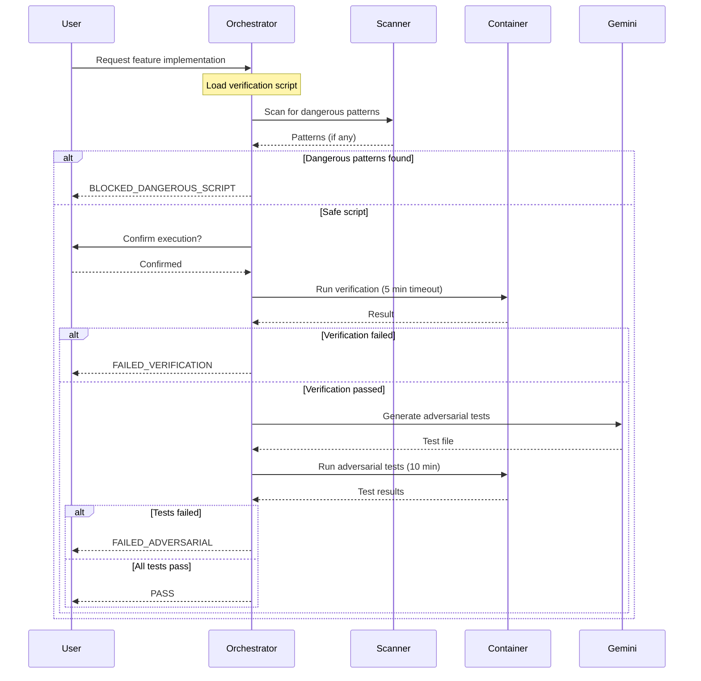

# 180 - Feature: Adversarial Testing Workflow

## 1. Context & Goal
* **Issue:** #80
* **Objective:** Establish a workflow where implementation and verification are performed by separate, adversarial LLMs to catch bugs, import errors, and false claims before code ships to production.
* **Status:** Draft
* **Related Issues:** N/A

### Open Questions
*Questions that need clarification before or during implementation. Remove when resolved.*

- [ ] Should adversarial testing be opt-in per ticket or mandatory for certain directories?
- [ ] What is the budget cap per ticket for LLM API costs?
- [ ] Should Testing LLM be allowed to suggest fixes, or only report failures?
- [ ] What is the escalation path when adversarial tests repeatedly fail?

## 2. Proposed Changes

*This section is the **source of truth** for implementation. Describe exactly what will be built.*

### 2.1 Files Changed

| File | Change Type | Description |
|------|-------------|-------------|
| `tools/adversarial_test_workflow.py` | Add | Main orchestrator coordinating verification and adversarial testing |
| `tools/script_safety_scanner.py` | Add | Shell script and Python AST security scanner |
| `tools/templates/verify-template.sh` | Add | Template for verification scripts |
| `tools/templates/test_adversarial_template.py` | Add | Template for adversarial tests |
| `tools/docker/adversarial-sandbox.Dockerfile` | Add | Container definition for sandboxed execution |
| `tests/fixtures/adversarial/mock_gemini_responses.json` | Add | Mocked LLM responses for offline development |
| `tests/fixtures/adversarial/sample_claims.json` | Add | Sample claims for testing |
| `tests/fixtures/adversarial/dangerous_scripts/rm_rf.sh` | Add | Test fixture for security scanner validation |
| `tests/fixtures/adversarial/dangerous_scripts/curl_external.sh` | Add | Test fixture for network access detection |
| `tests/unit/test_adversarial_workflow.py` | Add | Unit tests for orchestrator |
| `tests/unit/test_script_safety_scanner.py` | Add | Unit tests for security scanner |
| `docs/adr/0015-adversarial-testing-workflow.md` | Add | Architecture decision record |
| `docs/reports/adversarial-costs.csv` | Add | Cost tracking for adversarial testing runs |
| `tools/run_issue_workflow.py` | Modify | Add N2.5 adversarial testing gate |
| `docs/wiki/governance-workflow.md` | Modify | Document new gate |
| `CLAUDE.md` | Modify | Add adversarial testing prompts for Implementation LLM |
| `config/gemini.yaml` | Modify | Add enterprise and data_retention settings |

### 2.1.1 Path Validation (Mechanical - Auto-Checked)

*Issue #277: Before human or Gemini review, paths are verified programmatically.*

Mechanical validation automatically checks:
- All "Modify" files must exist in repository
- All "Delete" files must exist in repository
- All "Add" files must have existing parent directories
- No placeholder prefixes (`src/`, `lib/`, `app/`) unless directory exists

**If validation fails, the LLD is BLOCKED before reaching review.**

### 2.2 Dependencies

*New packages, APIs, or services required.*

```toml
# pyproject.toml additions
docker = "^7.0.0"  # Docker SDK for Python
```

**External Dependencies:**
- Docker or Podman (must be installed on host)
- Gemini Enterprise API with ZDR enabled

### 2.3 Data Structures

```python
# Pseudocode - NOT implementation
from typing import TypedDict, Literal

class WorkflowResult(TypedDict):
    status: Literal[
        "PASS", 
        "FAILED_IMPORT", 
        "FAILED_VERIFICATION", 
        "FAILED_ADVERSARIAL",
        "FAILED_TIMEOUT",
        "BLOCKED_DANGEROUS_SCRIPT",
        "CANCELLED",
        "DRY_RUN"
    ]
    stderr: str | None  # Error output if failed
    message: str | None  # Human-readable explanation
    failures: list[TestFailure] | None  # Specific test failures
    patterns: list[str] | None  # Dangerous patterns if blocked

class TestFailure(TypedDict):
    test_name: str  # e.g., "test_vscode_with_spaces_in_path"
    claim_violated: str  # e.g., "VS Code launches successfully"
    error: str  # Stack trace or error message

class DangerousPattern(TypedDict):
    line_number: int
    pattern_type: Literal["network", "destructive", "privilege", "exfiltration"]
    content: str  # The matched line
    severity: Literal["warning", "block"]

class VerificationScript(TypedDict):
    path: str  # Path to script file
    claims: list[str]  # Claims being verified
    timeout_seconds: int  # Default 300

class AdversarialTestResult(TypedDict):
    test_file: str  # Path to generated test file
    claims_tested: list[str]
    tests_run: int
    tests_passed: int
    tests_failed: int
    failures: list[TestFailure]
```

### 2.4 Function Signatures

```python
# tools/adversarial_test_workflow.py

def run_adversarial_testing(
    implementation_files: list[str],
    claims: list[str],
    dry_run: bool = False,
    auto_confirm: bool = False,
    timeout_verification: int = 300,
    timeout_adversarial: int = 600,
    max_cost: float | None = None,
    allow_network: bool = False,
    allow_dangerous: bool = False
) -> WorkflowResult:
    """
    Main orchestrator for adversarial testing workflow.
    
    Sequences: verification → adversarial testing → reporting.
    All script execution occurs in mandatory Docker container.
    """
    ...

def run_verification_in_container(
    script_path: str,
    workspace: str,
    timeout: int = 300,
    memory_limit: str = "2g",
    cpu_limit: str = "2"
) -> tuple[int, str, str]:
    """
    Execute verification script in Docker container.
    
    Returns: (return_code, stdout, stderr)
    """
    ...

def invoke_testing_llm(
    implementation_files: list[str],
    claims: list[str],
    model: Literal["flash", "pro"] = "flash"
) -> str:
    """
    Call Gemini to generate adversarial tests.
    
    Returns: Generated test file content.
    """
    ...

def parse_verification_failures(stderr: str) -> WorkflowResult:
    """
    Parse stderr to detect ImportError, ModuleNotFoundError, etc.
    """
    ...

def parse_pytest_failures(output: str) -> list[TestFailure]:
    """
    Parse pytest output to extract specific test failures.
    """
    ...

def get_user_confirmation(prompt: str) -> bool:
    """
    Display prompt and wait for user confirmation (y/n).
    """
    ...

def sanitize_environment() -> dict[str, str]:
    """
    Return sanitized environment variables for container execution.
    Removes PYTHONPATH, API keys, and other sensitive variables.
    """
    ...

# tools/script_safety_scanner.py

def scan_shell_script(script_path: str) -> list[DangerousPattern]:
    """
    Scan shell script for dangerous patterns.
    
    Checks for:
    - Network access (curl, wget, nc to external IPs)
    - Destructive commands (rm -rf, shutil.rmtree)
    - Privilege escalation (sudo, su)
    - Environment exfiltration (env piped to network)
    """
    ...

def scan_python_script(script_path: str) -> list[DangerousPattern]:
    """
    AST-based analysis of Python scripts.
    
    Rejects:
    - os.system with untrusted input
    - subprocess.call with shell=True on untrusted input
    - shutil.rmtree on non-workspace paths
    """
    ...

def is_external_ip(ip_or_host: str) -> bool:
    """
    Determine if IP/hostname is external (not localhost/internal).
    """
    ...

def scan_script_for_dangers(
    script_path: str
) -> list[DangerousPattern]:
    """
    Main entry point - routes to shell or Python scanner.
    """
    ...
```

### 2.5 Logic Flow (Pseudocode)

```
1. RECEIVE implementation files and claims list
2. IF dry_run THEN
   - Display verification script contents
   - Display what would be executed
   - RETURN {status: "DRY_RUN"}

3. LOAD verification script
4. CALL scan_script_for_dangers(script)
5. IF dangerous patterns found AND NOT allow_dangerous THEN
   - Display warning with specific patterns
   - RETURN {status: "BLOCKED_DANGEROUS_SCRIPT", patterns}

6. IF NOT auto_confirm THEN
   - Display script content
   - CALL get_user_confirmation()
   - IF NOT confirmed THEN RETURN {status: "CANCELLED"}

7. BUILD Docker container command with:
   - --network=none (unless allow_network)
   - --memory=2g
   - --cpus=2
   - Workspace mounted at /workspace

8. RUN verification script in container with timeout
9. IF timeout exceeded THEN
   - RETURN {status: "FAILED_TIMEOUT", message}
10. IF return_code != 0 THEN
    - CALL parse_verification_failures(stderr)
    - IF ImportError or ModuleNotFoundError detected THEN
      - RETURN {status: "FAILED_IMPORT", stderr}
    - ELSE RETURN {status: "FAILED_VERIFICATION", stderr}

11. CALL invoke_testing_llm(implementation_files, claims)
12. RECEIVE adversarial test file content
13. WRITE test file to workspace

14. RUN adversarial tests in container with timeout (10 min)
15. IF timeout exceeded THEN
    - RETURN {status: "FAILED_TIMEOUT", message}
16. IF tests failed THEN
    - CALL parse_pytest_failures(output)
    - RETURN {status: "FAILED_ADVERSARIAL", failures}

17. LOG cost to adversarial-costs.csv
18. RETURN {status: "PASS"}
```

### 2.6 Technical Approach

* **Module:** `tools/adversarial_test_workflow.py`
* **Pattern:** Pipeline orchestration with fail-fast behavior
* **Key Decisions:**
  - Mandatory containerization (no host execution path exists)
  - Pre-execution security scanning before user sees confirmation prompt
  - Gemini Flash as default, Pro for complex/security-critical tickets
  - Timeout-based circuit breaker pattern

### 2.7 Architecture Decisions

| Decision | Options Considered | Choice | Rationale |
|----------|-------------------|--------|-----------|
| Container runtime | Docker, Podman, gVisor | Docker (with Podman fallback) | Docker most widely available; Podman API-compatible |
| LLM for adversarial tests | Claude, Gemini, GPT-4 | Gemini | Separation of concerns - different vendor than implementation |
| Script validation | Runtime-only, Static analysis, Both | Both (static + container) | Defense in depth - catch dangerous patterns before execution |
| Timeout handling | Signal-based, Container-based | Container-based | More reliable; container runtime handles cleanup |

**Architectural Constraints:**
- Must integrate with existing governance workflow at N2.5 gate
- Cannot introduce non-Python dependencies beyond Docker
- Must work offline with mocked fixtures for development

## 3. Requirements

*What must be true when this is done. These become acceptance criteria.*

1. Orchestrator runs all verification scripts in mandatory Docker container
2. Orchestrator requires user confirmation before executing generated scripts
3. `--dry-run` mode shows script content without execution
4. Shell script inspection blocks dangerous commands before confirmation prompt
5. Verification scripts timeout after 5 minutes with clear error message
6. Adversarial test suites timeout after 10 minutes with clear error message
7. Testing LLM (Gemini Enterprise/ZDR) receives implementation code and generates adversarial tests
8. Adversarial tests execute without mocks for subprocess/external calls
9. Orchestrator parses `stderr`; if `ImportError` or `ModuleNotFoundError` detected, workflow halts with status `FAILED_IMPORT`
10. Edge cases are tested (unicode, paths with spaces, missing commands)
11. False claims are exposed (mocked "integration tests" flagged)
12. N2.5 gate integrated into issue governance workflow
13. Clear failure reporting shows exact test output and claim violated
14. Cost per adversarial test run is logged to tracking CSV
15. Environment variables sanitized (PYTHONPATH, API keys cleared) before script execution

## 4. Alternatives Considered

| Option | Pros | Cons | Decision |
|--------|------|------|----------|
| Same LLM for implementation and testing | Simpler setup, no API costs | Conflict of interest, no adversarial pressure | **Rejected** |
| Host execution with sandboxing | Faster, no Docker dependency | Security risk, harder to enforce resource limits | **Rejected** |
| Separate VM per test run | Maximum isolation | Slow startup, expensive, overkill | **Rejected** |
| Docker container with resource limits | Good isolation, fast, well-understood | Requires Docker installed | **Selected** |
| Gemini Flash only | Cheaper | May miss complex bugs | **Rejected** |
| Gemini Pro only | Better quality | Too expensive for all tickets | **Rejected** |
| Tiered Gemini (Flash default, Pro for complex) | Balance cost and quality | Slightly more complex logic | **Selected** |

**Rationale:** Docker provides the best balance of security, performance, and developer experience. Tiered Gemini usage optimizes cost while ensuring quality for critical tickets.

## 5. Data & Fixtures

### 5.1 Data Sources

| Attribute | Value |
|-----------|-------|
| Source | Implementation code files from local repository |
| Format | Python source files, shell scripts |
| Size | Typically < 100KB per implementation |
| Refresh | On-demand per workflow run |
| Copyright/License | Project license (internal) |

| Attribute | Value |
|-----------|-------|
| Source | Gemini Enterprise API |
| Format | Text (generated test code) |
| Size | Typically 2-10KB per response |
| Refresh | Generated fresh per run |
| Copyright/License | Gemini Enterprise ToS (ZDR policy) |

### 5.2 Data Pipeline

```
Implementation Files ──read──► Orchestrator ──API call──► Gemini
                                    │
                                    ▼
                          Adversarial Tests ──write──► Workspace
                                    │
                                    ▼
                          Container Execution ──output──► Results
```

### 5.3 Test Fixtures

| Fixture | Source | Notes |
|---------|--------|-------|
| `mock_gemini_responses.json` | Manually created | Contains sample adversarial test generation responses |
| `sample_claims.json` | Manually created | Contains example claims for testing |
| `dangerous_scripts/rm_rf.sh` | Manually created | Script containing `rm -rf /` for scanner testing |
| `dangerous_scripts/curl_external.sh` | Manually created | Script with external network calls |

### 5.4 Deployment Pipeline

Development → Test (offline with fixtures) → Integration (with real Gemini) → Production

**External Data:** Gemini API responses are not cached; each run generates fresh adversarial tests to ensure no stale test logic.

## 6. Diagram

### 6.1 Mermaid Quality Gate

Before finalizing any diagram, verify in [Mermaid Live Editor](https://mermaid.live) or GitHub preview:

- [x] **Simplicity:** Similar components collapsed (per 0006 §8.1)
- [x] **No touching:** All elements have visual separation (per 0006 §8.2)
- [x] **No hidden lines:** All arrows fully visible (per 0006 §8.3)
- [x] **Readable:** Labels not truncated, flow direction clear
- [ ] **Auto-inspected:** Agent rendered via mermaid.ink and viewed (per 0006 §8.5)

**Agent Auto-Inspection (MANDATORY):**

AI agents MUST render and view the diagram before committing:
1. Base64 encode diagram → fetch PNG from `https://mermaid.ink/img/{base64}`
2. Read the PNG file (multimodal inspection)
3. Document results below

**Auto-Inspection Results:**
```
- Touching elements: [ ] None / [ ] Found: ___
- Hidden lines: [ ] None / [ ] Found: ___
- Label readability: [ ] Pass / [ ] Issue: ___
- Flow clarity: [ ] Clear / [ ] Issue: ___
```

*Reference: [0006-mermaid-diagrams.md](0006-mermaid-diagrams.md)*

### 6.2 Diagram



## 7. Security & Safety Considerations

### 7.1 Security

| Concern | Mitigation | Status |
|---------|------------|--------|
| Arbitrary code execution | Mandatory Docker containerization | Addressed |
| Network exfiltration | Container runs with `--network=none` by default | Addressed |
| Destructive commands | Pre-execution shell script scanning | Addressed |
| Python code injection | AST-based validation before execution | Addressed |
| Privilege escalation | Container runs as non-root, no sudo | Addressed |
| Environment variable leakage | Sanitize environment before container execution | Addressed |
| Supply chain attacks | Pin Docker image versions | Addressed |
| Gemini data retention | Require Enterprise endpoint with ZDR | Addressed |

### 7.2 Safety

| Concern | Mitigation | Status |
|---------|------------|--------|
| Runaway scripts | 5-minute verification timeout, 10-minute adversarial timeout | Addressed |
| Resource exhaustion | Docker `--memory=2g --cpus=2` limits | Addressed |
| Infinite loops | Container timeout enforcement | Addressed |
| Data loss from test | Container workspace isolation; only project dir mounted | Addressed |
| Corrupted test results | Transaction-like behavior; no partial writes | Addressed |

**Fail Mode:** Fail Closed - Any security concern blocks execution and requires explicit override.

**Recovery Strategy:** Failed runs leave no side effects; workspace can be retried immediately.

## 8. Performance & Cost Considerations

### 8.1 Performance

| Metric | Budget | Approach |
|--------|--------|----------|
| Verification latency | < 5 min | Hard timeout, optimized Docker images |
| Adversarial generation | < 30 sec | Gemini Flash by default |
| Adversarial execution | < 10 min | Hard timeout, parallel test execution |
| Container startup | < 5 sec | Pre-built image, Docker caching |

**Bottlenecks:** 
- Gemini API latency for test generation
- Docker cold start on first run (mitigated by image caching)

### 8.2 Cost Analysis

| Resource | Unit Cost | Estimated Usage | Monthly Cost |
|----------|-----------|-----------------|--------------|
| Gemini Flash API | $0.075/1M input, $0.30/1M output | ~50 tickets/month, ~5K tokens each | ~$2 |
| Gemini Pro API | $1.25/1M input, $5.00/1M output | ~5 complex tickets/month | ~$3 |
| Docker compute | $0 (local) | N/A | $0 |

**Total Estimated Monthly Cost:** ~$5-10 for typical usage

**Cost Controls:**
- [x] Budget alerts configured at $20/month threshold
- [x] Rate limiting prevents runaway costs (max 10 adversarial runs/day)
- [x] Fallback to Gemini Flash when Pro quota exceeded
- [x] `--max-cost` flag to skip if estimated cost exceeds threshold

**Worst-Case Scenario:** 100x usage spike = ~$500/month. Mitigated by daily rate limits.

## 9. Legal & Compliance

| Concern | Applies? | Mitigation |
|---------|----------|------------|
| PII/Personal Data | No | No user data processed; only source code |
| Third-Party Licenses | Yes | Docker SDK is Apache 2.0 compatible |
| Terms of Service | Yes | Gemini Enterprise ToS allows code analysis with ZDR |
| Data Retention | Yes | ZDR policy ensures no code retained by Gemini |
| Export Controls | No | No restricted algorithms |

**Data Classification:** Internal (source code only, no customer data)

**Compliance Checklist:**
- [x] No PII stored without consent
- [x] All third-party licenses compatible with project license
- [x] External API usage compliant with provider ToS
- [x] Data retention policy documented (ZDR required)

## 10. Verification & Testing

### 10.0 Test Plan (TDD - Complete Before Implementation)

**TDD Requirement:** Tests MUST be written and failing BEFORE implementation begins.

| Test ID | Test Description | Expected Behavior | Status |
|---------|------------------|-------------------|--------|
| T010 | test_dry_run_shows_script_without_execution | Displays script, returns DRY_RUN status | RED |
| T020 | test_dangerous_script_blocked | Scanner detects rm -rf, returns BLOCKED | RED |
| T030 | test_user_confirmation_required | Without auto_confirm, waits for input | RED |
| T040 | test_verification_timeout | Script exceeding 5 min returns FAILED_TIMEOUT | RED |
| T050 | test_import_error_detected | ImportError in stderr returns FAILED_IMPORT | RED |
| T060 | test_adversarial_tests_generated | Gemini called with correct payload | RED |
| T070 | test_adversarial_failure_reported | Failed tests return FAILED_ADVERSARIAL with details | RED |
| T080 | test_environment_sanitized | PYTHONPATH and API keys removed | RED |
| T090 | test_container_network_disabled | Container created with --network=none | RED |
| T100 | test_cost_logged_to_csv | Successful run appends to adversarial-costs.csv | RED |

**Coverage Target:** ≥95% for all new code

**TDD Checklist:**
- [ ] All tests written before implementation
- [ ] Tests currently RED (failing)
- [ ] Test IDs match scenario IDs in 10.1
- [ ] Test file created at: `tests/unit/test_adversarial_workflow.py`

### 10.1 Test Scenarios

| ID | Scenario | Type | Input | Expected Output | Pass Criteria |
|----|----------|------|-------|-----------------|---------------|
| 010 | Dry-run mode | Auto | `--dry-run` flag | Script content displayed | Status is DRY_RUN, no execution |
| 020 | Dangerous script detection | Auto | Script with `rm -rf /` | Blocked | Status is BLOCKED_DANGEROUS_SCRIPT |
| 030 | User confirmation flow | Auto | Mock stdin "n" | Cancelled | Status is CANCELLED |
| 040 | Verification timeout | Auto | Script with `sleep 600` | Timeout error | Status is FAILED_TIMEOUT |
| 050 | Import error handling | Auto | Script importing nonexistent module | Import error | Status is FAILED_IMPORT |
| 060 | Successful verification | Auto | Valid verification script | Pass | Proceeds to adversarial |
| 070 | Adversarial test generation | Auto-Live | Implementation + claims | Test file | Valid pytest file generated |
| 080 | Adversarial test failure | Auto | Failing test fixture | Failure report | Status is FAILED_ADVERSARIAL |
| 090 | Full happy path | Auto-Live | Valid implementation | Success | Status is PASS |
| 100 | Network isolation | Auto | Container inspection | No network | `--network=none` in command |
| 110 | Environment sanitization | Auto | Check container env | Clean env | No PYTHONPATH, no API keys |
| 120 | Cost logging | Auto | Successful run | CSV entry | New row in adversarial-costs.csv |
| 130 | Self-destruct protection | Auto | Script deleting /tmp | Blocked in container | BLOCKED_DANGEROUS_OPERATION |

### 10.2 Test Commands

```bash
# Run all automated tests
poetry run pytest tests/unit/test_adversarial_workflow.py -v

# Run only fast/mocked tests (exclude live)
poetry run pytest tests/unit/test_adversarial_workflow.py -v -m "not live"

# Run live integration tests (requires Gemini API)
poetry run pytest tests/unit/test_adversarial_workflow.py -v -m live

# Run security scanner tests
poetry run pytest tests/unit/test_script_safety_scanner.py -v
```

### 10.3 Manual Tests (Only If Unavoidable)

**N/A - All scenarios automated.**

## 11. Risks & Mitigations

| Risk | Impact | Likelihood | Mitigation |
|------|--------|------------|------------|
| Docker not installed on developer machine | High | Medium | Clear error message with installation instructions; document in README |
| Gemini API unavailable | Medium | Low | Offline mode with mocked fixtures for development |
| Container escape vulnerability | High | Low | Keep Docker updated; use minimal base image; no privileged mode |
| False positives in security scanner | Medium | Medium | Allow `--allow-dangerous` override with explicit confirmation |
| Gemini generates invalid tests | Medium | Medium | Validate generated code syntax before execution |
| Cost overruns from heavy usage | Medium | Low | Daily rate limits; `--max-cost` flag; budget alerts |

## 12. Definition of Done

### Code
- [ ] Implementation complete and linted
- [ ] Code comments reference this LLD
- [ ] All functions have docstrings with examples

### Tests
- [ ] All test scenarios pass
- [ ] Test coverage ≥95% for new code
- [ ] Security scanner tests include all dangerous patterns

### Documentation
- [ ] LLD updated with any deviations
- [ ] Implementation Report (0103) completed
- [ ] Test Report (0113) completed
- [ ] ADR 0015 created with rationale
- [ ] governance-workflow.md updated with N2.5 gate
- [ ] CLAUDE.md updated with verification script requirements

### Review
- [ ] Code review completed
- [ ] 0809 Security Audit PASS
- [ ] 0817 Wiki Alignment Audit PASS
- [ ] User approval before closing issue

### 12.1 Traceability (Mechanical - Auto-Checked)

*Issue #277: Cross-references are verified programmatically.*

Mechanical validation automatically checks:
- Every file mentioned in this section must appear in Section 2.1
- Every risk mitigation in Section 11 should have a corresponding function in Section 2.4 (warning if not)

**If files are missing from Section 2.1, the LLD is BLOCKED.**

---

## Appendix: Review Log

*Track all review feedback with timestamps and implementation status.*

### Review Summary

| Review | Date | Verdict | Key Issue |
|--------|------|---------|-----------|
| - | - | - | - |

**Final Status:** PENDING