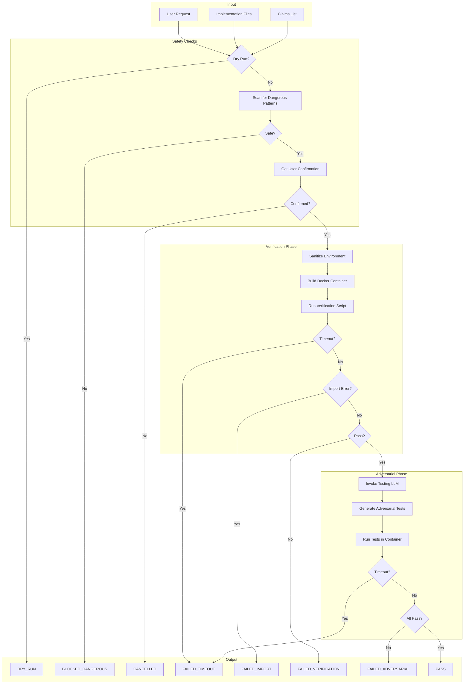

# 180 - Feature: Adversarial Testing Workflow

<!-- Template Metadata
Last Updated: 2026-02-02
Updated By: Issue #80 LLD creation
Update Reason: Initial LLD for adversarial testing workflow separating implementation from verification
-->

## 1. Context & Goal
* **Issue:** #80
* **Objective:** Establish a workflow where implementation and verification are performed by separate, adversarial LLMs with mandatory containerized execution
* **Status:** Draft
* **Related Issues:** N/A

### Open Questions

- [ ] Should adversarial testing run on every commit or only before PR?
- [ ] How should Testing LLM performance be scored (bugs found vs false positives)?
- [ ] Can Testing LLM suggest fixes or should it remain purely adversarial?
- [ ] What is the threshold for `complexity:high` label triggering Gemini Pro?

## 2. Proposed Changes

*This section is the **source of truth** for implementation. Describe exactly what will be built.*

### 2.1 Files Changed

| File | Change Type | Description |
|------|-------------|-------------|
| `tools/adversarial_test_workflow.py` | Add | Main orchestrator coordinating verification and adversarial testing |
| `tools/script_safety_scanner.py` | Add | Shell script and Python AST security scanner |
| `tools/templates/verify-template.sh` | Add | Template for verification scripts |
| `tools/templates/test_adversarial_template.py` | Add | Template for adversarial tests |
| `tools/docker/adversarial-sandbox.Dockerfile` | Add | Container definition for sandboxed execution |
| `tests/fixtures/adversarial/mock_gemini_responses.json` | Add | Mocked LLM responses for offline testing |
| `tests/fixtures/adversarial/sample_claims.json` | Add | Sample claims for testing |
| `tests/fixtures/adversarial/dangerous_scripts/rm_rf.sh` | Add | Test fixture: destructive command |
| `tests/fixtures/adversarial/dangerous_scripts/curl_external.sh` | Add | Test fixture: network exfiltration |
| `tests/fixtures/adversarial/dangerous_scripts/env_leak.sh` | Add | Test fixture: environment variable leak |
| `tests/unit/test_adversarial_workflow.py` | Add | Unit tests for orchestrator |
| `tests/unit/test_script_safety_scanner.py` | Add | Unit tests for security scanner |
| `docs/adr/0015-adversarial-testing-workflow.md` | Add | Architecture decision record |
| `docs/reports/adversarial-costs.csv` | Add | Cost tracking for adversarial testing runs |
| `tools/run_issue_workflow.py` | Modify | Add N2.5 adversarial testing gate |
| `docs/wiki/governance-workflow.md` | Modify | Document new gate |
| `CLAUDE.md` | Modify | Add adversarial testing prompts for Implementation LLM |
| `config/gemini.yaml` | Modify | Add enterprise and data retention settings |

### 2.1.1 Path Validation (Mechanical - Auto-Checked)

*Issue #277: Before human or Gemini review, paths are verified programmatically.*

Mechanical validation automatically checks:
- All "Modify" files must exist in repository
- All "Delete" files must exist in repository
- All "Add" files must have existing parent directories
- No placeholder prefixes (`src/`, `lib/`, `app/`) unless directory exists

**If validation fails, the LLD is BLOCKED before reaching review.**

### 2.2 Dependencies

```toml
# pyproject.toml additions
docker = "^7.0.0"  # Docker SDK for container management
```

### 2.3 Data Structures

```python
# Pseudocode - NOT implementation

class WorkflowStatus(Enum):
    """Possible states for adversarial testing workflow."""
    DRY_RUN = "DRY_RUN"
    CANCELLED = "CANCELLED"
    BLOCKED_DANGEROUS_SCRIPT = "BLOCKED_DANGEROUS_SCRIPT"
    FAILED_TIMEOUT = "FAILED_TIMEOUT"
    FAILED_IMPORT = "FAILED_IMPORT"
    FAILED_VERIFICATION = "FAILED_VERIFICATION"
    FAILED_ADVERSARIAL = "FAILED_ADVERSARIAL"
    BLOCKED_DANGEROUS_OPERATION = "BLOCKED_DANGEROUS_OPERATION"
    PASS = "PASS"

class WorkflowResult(TypedDict):
    """Result from adversarial testing workflow."""
    status: WorkflowStatus  # Final status of workflow
    message: str | None  # Human-readable message
    stderr: str | None  # Captured stderr on failure
    failures: list[TestFailure] | None  # Parsed test failures
    patterns: list[str] | None  # Dangerous patterns if blocked
    cost_usd: float | None  # Estimated cost of LLM calls

class TestFailure(TypedDict):
    """Parsed test failure from pytest output."""
    test_name: str  # Fully qualified test name
    claim_violated: str  # Which claim this test was targeting
    error_type: str  # Exception class name
    error_message: str  # Exception message
    traceback: str  # Full traceback

class DangerousPattern(TypedDict):
    """Detected dangerous pattern in script."""
    line_number: int  # Line where pattern found
    pattern_type: str  # Category: 'network', 'destructive', 'privilege', 'exfiltration'
    matched_text: str  # The actual dangerous code
    severity: str  # 'critical', 'high', 'medium'

class ScannerResult(TypedDict):
    """Result from script safety scanner."""
    safe: bool  # Whether script passed safety check
    patterns: list[DangerousPattern]  # All dangerous patterns found
    recommendations: list[str]  # Suggested fixes
```

### 2.4 Function Signatures

```python
# tools/adversarial_test_workflow.py

def run_adversarial_testing(
    implementation_files: list[Path],
    claims: list[str],
    verification_script: Path,
    dry_run: bool = False,
    auto_confirm: bool = False,
    containerized: bool = True,
    timeout_verification: int = 300,
    timeout_adversarial: int = 600,
    max_cost: float | None = None,
    allow_network: bool = False,
    allow_dangerous: bool = False,
) -> WorkflowResult:
    """
    Execute adversarial testing workflow.
    
    Coordinates verification script execution, Testing LLM invocation,
    and adversarial test execution with mandatory containerization.
    """
    ...

def get_user_confirmation(prompt: str) -> bool:
    """
    Prompt user for explicit confirmation before script execution.
    
    Returns True if user confirms, False otherwise.
    """
    ...

def invoke_testing_llm(
    implementation_files: list[Path],
    claims: list[str],
    model: str = "gemini-flash",
) -> str:
    """
    Invoke Testing LLM (Gemini) to generate adversarial tests.
    
    Uses Enterprise endpoint with ZDR policy.
    Returns generated Python test code.
    """
    ...

def parse_pytest_failures(output: str) -> list[TestFailure]:
    """
    Parse pytest output to extract structured failure information.
    
    Identifies which claims were violated by matching test names
    to claim documentation.
    """
    ...

def run_in_container(
    command: list[str],
    workspace: Path,
    timeout: int,
    memory_limit: str = "2g",
    cpu_limit: str = "2",
    network: bool = False,
) -> subprocess.CompletedProcess:
    """
    Execute command in Docker container with resource limits.
    
    Mandatory containerization - no host execution path.
    """
    ...

def sanitize_environment() -> dict[str, str]:
    """
    Create sanitized environment for script execution.
    
    Clears PYTHONPATH, API keys, and other sensitive variables.
    """
    ...

def log_cost(
    issue_id: int,
    model: str,
    input_tokens: int,
    output_tokens: int,
    cost_usd: float,
) -> None:
    """
    Log adversarial testing cost to tracking CSV.
    """
    ...


# tools/script_safety_scanner.py

def scan_shell_script(script_path: Path) -> ScannerResult:
    """
    Scan shell script for dangerous patterns.
    
    Checks for network access, destructive commands, privilege
    escalation, and environment exfiltration.
    """
    ...

def scan_python_script(script_path: Path) -> ScannerResult:
    """
    Perform AST-based analysis of Python script.
    
    Rejects dangerous imports and function calls.
    """
    ...

def is_external_ip(url: str) -> bool:
    """
    Check if URL references external (non-localhost) IP.
    """
    ...

def check_destructive_commands(line: str) -> DangerousPattern | None:
    """
    Check if line contains destructive commands like rm -rf.
    """
    ...

def analyze_python_ast(code: str) -> list[DangerousPattern]:
    """
    Perform AST analysis to find dangerous Python constructs.
    
    Flags: os.system, subprocess with shell=True, shutil.rmtree
    on system paths.
    """
    ...
```

### 2.5 Logic Flow (Pseudocode)

```
ADVERSARIAL TESTING WORKFLOW
============================

1. RECEIVE inputs: implementation_files, claims, verification_script, flags

2. IF dry_run THEN
   - Display verification script content
   - Display what commands WOULD be executed
   - RETURN {status: DRY_RUN}

3. SCAN verification_script for dangerous patterns
   - Check shell commands: curl, wget, rm -rf, sudo, env
   - Check network access to external IPs
   
4. IF dangerous_patterns found AND NOT allow_dangerous THEN
   - Display warning with specific patterns
   - RETURN {status: BLOCKED_DANGEROUS_SCRIPT, patterns: [...]}

5. IF NOT auto_confirm THEN
   - Display script content for review
   - Prompt user: "Execute verification script? [y/N]"
   - IF NOT confirmed THEN RETURN {status: CANCELLED}

6. SANITIZE environment variables
   - Clear PYTHONPATH
   - Clear API keys
   - Preserve only essential vars

7. BUILD Docker container command
   - Mount workspace as /workspace (writable)
   - Set --network=none (unless allow_network)
   - Set --memory=2g --cpus=2
   - Set timeout

8. RUN verification_script in container
   - TRY with timeout_verification seconds
   - CATCH TimeoutExpired:
     - RETURN {status: FAILED_TIMEOUT, message: "exceeded 5 min"}

9. PARSE verification stderr
   - IF "ImportError" OR "ModuleNotFoundError" detected THEN
     - RETURN {status: FAILED_IMPORT, stderr: ...}
   - IF returncode != 0 THEN
     - RETURN {status: FAILED_VERIFICATION, stderr: ...}

10. INVOKE Testing LLM (Gemini Enterprise/ZDR)
    - Send implementation_files content
    - Send claims list
    - Request adversarial test generation
    - LOG cost to CSV

11. WRITE adversarial tests to workspace
    - Save as test_adversarial_{feature}.py

12. RUN adversarial tests in container
    - TRY with timeout_adversarial seconds
    - CATCH TimeoutExpired:
      - RETURN {status: FAILED_TIMEOUT, message: "exceeded 10 min"}

13. PARSE pytest output
    - Extract test failures
    - Match failures to claims
    - Build TestFailure objects

14. IF any tests failed THEN
    - RETURN {status: FAILED_ADVERSARIAL, failures: [...]}

15. RETURN {status: PASS}


SCRIPT SAFETY SCANNER
=====================

1. RECEIVE script_path

2. DETERMINE script type (shell or Python)

3. IF shell script THEN
   - READ line by line
   - CHECK each line against patterns:
     - /curl.*http[^s]/ → network access (http, not https internal)
     - /wget/ → network download
     - /rm\s+-rf\s+[^.\/]/ → destructive (rm -rf not starting with ./)
     - /sudo|su\s/ → privilege escalation
     - /env|printenv.*\|/ → environment leak
   - RECORD line number, pattern type, matched text

4. IF Python script THEN
   - PARSE AST
   - WALK tree looking for:
     - Import of os, subprocess, shutil
     - Call to os.system(), os.popen()
     - subprocess.call/run with shell=True
     - shutil.rmtree on non-workspace path
   - RECORD node location, pattern type

5. CLASSIFY patterns by severity:
   - critical: rm -rf /, sudo, privilege escalation
   - high: network access, environment exfiltration
   - medium: potentially dangerous imports

6. RETURN {safe: len(critical + high) == 0, patterns: [...]}
```

### 2.6 Technical Approach

* **Module:** `tools/adversarial_test_workflow.py`
* **Pattern:** Pipeline with circuit breaker (fail fast on dangerous scripts)
* **Key Decisions:**
  - Mandatory containerization ensures no LLM-generated code runs on host
  - User confirmation required before any execution
  - Pre-execution scanning catches dangerous patterns before user prompt
  - Separate timeouts for verification (5 min) and adversarial (10 min)
  - Cost tracking enables budget management

### 2.7 Architecture Decisions

| Decision | Options Considered | Choice | Rationale |
|----------|-------------------|--------|-----------|
| Execution environment | Host, VM, Container | Container (Docker) | Best isolation/overhead tradeoff; industry standard |
| Safety scanner approach | Regex only, AST only, Both | Both | Regex catches shell; AST catches Python semantic issues |
| LLM model selection | Single model, Tiered | Tiered (Flash/Pro) | Cost control for simple cases; quality for complex |
| User confirmation | Always, Never, Configurable | Always (with opt-out) | Security-first; CI can opt-in to auto-confirm |
| Network isolation | Block all, Allow all, Configurable | Block by default | Prevent exfiltration; explicit opt-in for legitimate use |

**Architectural Constraints:**
- Must integrate with existing governance workflow (N2.5 gate)
- Cannot rely on host-installed tools beyond Docker
- Must support offline development via mocked fixtures

## 3. Requirements

1. Orchestrator MUST run all verification scripts in Docker container
2. Orchestrator MUST require user confirmation before executing generated scripts
3. `--dry-run` mode MUST show script content without execution
4. Shell script inspection MUST block dangerous commands before confirmation prompt
5. Verification scripts MUST timeout after 5 minutes with clear error message
6. Adversarial test suites MUST timeout after 10 minutes with clear error message
7. Testing LLM (Gemini Enterprise/ZDR) MUST receive implementation code and generate adversarial tests
8. Adversarial tests MUST execute without mocks for subprocess/external calls
9. Orchestrator MUST parse stderr and halt with FAILED_IMPORT on import errors
10. Edge cases MUST be tested (unicode, paths with spaces, missing commands)
11. False claims MUST be exposed (mocked "integration tests" flagged)
12. N2.5 gate MUST be integrated into issue governance workflow
13. Failure reporting MUST show exact test output and claim violated
14. Cost per adversarial test run MUST be logged to tracking CSV
15. Environment variables MUST be sanitized before script execution

## 4. Alternatives Considered

| Option | Pros | Cons | Decision |
|--------|------|------|----------|
| Host execution with sandboxie | Faster startup, no Docker dependency | Security risk, Windows-only | **Rejected** |
| Docker-based sandboxing | Strong isolation, cross-platform, well-understood | Requires Docker installation | **Selected** |
| Podman-based sandboxing | Rootless, OCI-compatible | Less ubiquitous than Docker | Rejected (future option) |
| VM-based isolation | Strongest isolation | Slow startup, resource heavy | Rejected |
| No safety scanner, trust container | Simpler implementation | Defense in depth lost | Rejected |
| Regex-only scanner | Simple, fast | Misses semantic issues | Rejected |
| AST-only scanner | Semantic understanding | Can't scan shell scripts | Rejected |
| Combined regex + AST | Best coverage | More complex | **Selected** |

**Rationale:** Docker provides the best balance of security, performance, and ubiquity. Combined scanning catches both syntactic patterns (shell) and semantic issues (Python AST).

## 5. Data & Fixtures

### 5.1 Data Sources

| Attribute | Value |
|-----------|-------|
| Source | Gemini API (Enterprise endpoint) |
| Format | JSON API response |
| Size | ~2-10KB per request |
| Refresh | Per-invocation |
| Copyright/License | Gemini Enterprise DPA |

### 5.2 Data Pipeline

```
Implementation Files ──read──► Orchestrator ──API──► Gemini Enterprise
                                    │
Claims List ────────────────────────┘
                                    │
                              ◄─────┘
                                    │
Generated Tests ◄───parse───────────┘
```

### 5.3 Test Fixtures

| Fixture | Source | Notes |
|---------|--------|-------|
| `mock_gemini_responses.json` | Handcrafted | Representative adversarial test outputs |
| `sample_claims.json` | Handcrafted | Standard claims for testing |
| `dangerous_scripts/*.sh` | Handcrafted | Known-bad scripts for scanner validation |

### 5.4 Deployment Pipeline

1. Development: Use mocked fixtures (`--offline` flag)
2. Testing: Run against mocked fixtures in CI
3. Integration: Test against Gemini Enterprise with ZDR
4. Production: Full workflow with live Gemini calls

**External utility needed?** No - Gemini integration exists

## 6. Diagram

### 6.1 Mermaid Quality Gate

Before finalizing any diagram, verify in [Mermaid Live Editor](https://mermaid.live) or GitHub preview:

- [x] **Simplicity:** Similar components collapsed (per 0006 §8.1)
- [x] **No touching:** All elements have visual separation (per 0006 §8.2)
- [x] **No hidden lines:** All arrows fully visible (per 0006 §8.3)
- [x] **Readable:** Labels not truncated, flow direction clear
- [ ] **Auto-inspected:** Agent rendered via mermaid.ink and viewed (per 0006 §8.5)

**Agent Auto-Inspection (MANDATORY):**

AI agents MUST render and view the diagram before committing:
1. Base64 encode diagram → fetch PNG from `https://mermaid.ink/img/{base64}`
2. Read the PNG file (multimodal inspection)
3. Document results below

**Auto-Inspection Results:**
```
- Touching elements: [ ] None / [ ] Found: ___
- Hidden lines: [ ] None / [ ] Found: ___
- Label readability: [ ] Pass / [ ] Issue: ___
- Flow clarity: [ ] Clear / [ ] Issue: ___
```

*Reference: [0006-mermaid-diagrams.md](0006-mermaid-diagrams.md)*

### 6.2 Diagram



## 7. Security & Safety Considerations

### 7.1 Security

| Concern | Mitigation | Status |
|---------|------------|--------|
| LLM-generated code execution | Mandatory Docker containerization | Addressed |
| Network exfiltration | Container runs with `--network=none` by default | Addressed |
| Destructive commands | Pre-execution shell scanner blocks rm -rf, etc. | Addressed |
| Privilege escalation | Container runs unprivileged; sudo blocked | Addressed |
| Environment variable leak | Sanitize PYTHONPATH, API keys before execution | Addressed |
| Malicious Python imports | AST analysis rejects os.system, subprocess shell=True | Addressed |
| External data residency | Gemini Enterprise with ZDR policy required | Addressed |

### 7.2 Safety

| Concern | Mitigation | Status |
|---------|------------|--------|
| Runaway scripts | 5-minute (verification) / 10-minute (adversarial) timeouts | Addressed |
| Resource exhaustion | Docker --memory=2g --cpus=2 limits | Addressed |
| Infinite loops | Timeout enforcement terminates container | Addressed |
| Accidental file deletion | Workspace-only mount; system paths read-only | Addressed |
| User executing unknown code | Explicit confirmation required; dry-run mode available | Addressed |

**Fail Mode:** Fail Closed - Any scanner detection or timeout results in workflow halt

**Recovery Strategy:** On failure, orchestrator returns detailed error with stderr and specific failure cause. Implementation LLM receives failure context to fix and resubmit.

## 8. Performance & Cost Considerations

### 8.1 Performance

| Metric | Budget | Approach |
|--------|--------|----------|
| Container startup | < 5s | Pre-built image, cached layers |
| Verification timeout | 5 min | subprocess timeout parameter |
| Adversarial timeout | 10 min | subprocess timeout parameter |
| Memory per container | 2GB | Docker --memory limit |
| CPU per container | 2 cores | Docker --cpus limit |

**Bottlenecks:** Container cold-start (~3-5s), LLM API latency (~5-15s for test generation)

### 8.2 Cost Analysis

| Resource | Unit Cost | Estimated Usage | Monthly Cost |
|----------|-----------|-----------------|--------------|
| Gemini Flash API | $0.01/1K tokens | 50 tickets × 5K tokens | $2.50 |
| Gemini Pro API | $0.05/1K tokens | 10 tickets × 10K tokens | $5.00 |
| Docker compute | $0 (local) | N/A | $0 |

**Cost Controls:**
- [x] Budget alerts: `--max-cost` flag terminates if threshold exceeded
- [x] Rate limiting: Single concurrent adversarial test per workflow
- [x] Tiered models: Gemini Flash default, Pro only for `complexity:high`

**Worst-Case Scenario:** 100x usage spike = $750/month for Flash; mitigated by `--max-cost` flag and manual review of cost CSV.

## 9. Legal & Compliance

| Concern | Applies? | Mitigation |
|---------|----------|------------|
| PII/Personal Data | No | Implementation code only; no user data processed |
| Third-Party Licenses | Yes | Gemini Enterprise DPA covers code analysis |
| Terms of Service | Yes | Enterprise endpoint with ZDR per Gemini ToS |
| Data Retention | Yes | ZDR policy = no data retained by Gemini |
| Export Controls | No | No restricted algorithms |

**Data Classification:** Internal (source code)

**Compliance Checklist:**
- [x] No PII stored without consent (N/A - no PII)
- [x] All third-party licenses compatible with project license
- [x] External API usage compliant with provider ToS (Enterprise/ZDR)
- [x] Data retention policy documented (ZDR = none)

## 10. Verification & Testing

*Ref: [0005-testing-strategy-and-protocols.md](0005-testing-strategy-and-protocols.md)*

**Testing Philosophy:** Strive for 100% automated test coverage. Manual tests are a last resort for scenarios that genuinely cannot be automated.

### 10.0 Test Plan (TDD - Complete Before Implementation)

**TDD Requirement:** Tests MUST be written and failing BEFORE implementation begins.

| Test ID | Test Description | Expected Behavior | Status |
|---------|------------------|-------------------|--------|
| T010 | test_dry_run_shows_script_no_execution | Returns DRY_RUN, no subprocess calls | RED |
| T020 | test_dangerous_script_blocked | Returns BLOCKED_DANGEROUS_SCRIPT with patterns | RED |
| T030 | test_user_cancellation_stops_workflow | Returns CANCELLED when user declines | RED |
| T040 | test_verification_timeout_enforced | Returns FAILED_TIMEOUT after 5 min | RED |
| T050 | test_import_error_detected | Returns FAILED_IMPORT when ModuleNotFoundError in stderr | RED |
| T060 | test_verification_failure_halts | Returns FAILED_VERIFICATION on non-zero exit | RED |
| T070 | test_adversarial_tests_generated | Testing LLM produces valid pytest code | RED |
| T080 | test_adversarial_failure_reported | Returns FAILED_ADVERSARIAL with specific failures | RED |
| T090 | test_full_workflow_pass | Returns PASS when all stages succeed | RED |
| T100 | test_container_network_isolated | Container cannot reach external IPs | RED |
| T110 | test_environment_sanitized | PYTHONPATH and API keys cleared | RED |
| T120 | test_cost_logged_to_csv | Cost entry appears in tracking file | RED |

**Coverage Target:** ≥95% for all new code

**TDD Checklist:**
- [ ] All tests written before implementation
- [ ] Tests currently RED (failing)
- [ ] Test IDs match scenario IDs in 10.1
- [ ] Test file created at: `tests/unit/test_adversarial_workflow.py`

### 10.1 Test Scenarios

| ID | Scenario | Type | Input | Expected Output | Pass Criteria |
|----|----------|------|-------|-----------------|---------------|
| 010 | Dry-run mode | Auto | `--dry-run` flag | DRY_RUN status | Script content displayed, no execution |
| 020 | Dangerous shell script (curl) | Auto | Script with `curl external-ip` | BLOCKED_DANGEROUS_SCRIPT | Pattern detected, execution prevented |
| 030 | Dangerous shell script (rm -rf) | Auto | Script with `rm -rf /` | BLOCKED_DANGEROUS_SCRIPT | Pattern detected, execution prevented |
| 040 | User cancellation | Auto | Mocked "n" input | CANCELLED | Workflow halts gracefully |
| 050 | Verification timeout | Auto | Script with `sleep 600` | FAILED_TIMEOUT | Terminates after 5 min |
| 060 | Import error detection | Auto | Script importing nonexistent module | FAILED_IMPORT | ImportError in stderr triggers status |
| 070 | Verification non-zero exit | Auto | Script with `exit 1` | FAILED_VERIFICATION | Halts before adversarial phase |
| 080 | Adversarial test generation | Auto-Live | Valid implementation + claims | Python test file | Valid pytest syntax, targets claims |
| 090 | Adversarial test failure | Auto | Implementation with known bug | FAILED_ADVERSARIAL | Specific failure details returned |
| 100 | Full workflow success | Auto | Working implementation | PASS | All stages complete |
| 110 | Container network isolation | Auto | Script with `curl google.com` | Network error | Container cannot reach external |
| 120 | Environment sanitization | Auto | Script echoing $PYTHONPATH | Empty output | Variables cleared |
| 130 | Cost tracking | Auto | Any LLM invocation | CSV entry | File, model, tokens, cost logged |
| 140 | AST scanner: os.system | Auto | Python with `os.system()` | BLOCKED_DANGEROUS_SCRIPT | Pattern detected |
| 150 | AST scanner: subprocess shell | Auto | Python with `subprocess.run(..., shell=True)` | BLOCKED_DANGEROUS_SCRIPT | Pattern detected |
| 160 | Allow-dangerous override | Auto | Dangerous script + `--allow-dangerous` | Proceeds with warning | User override respected |

### 10.2 Test Commands

```bash
# Run all automated tests
poetry run pytest tests/unit/test_adversarial_workflow.py tests/unit/test_script_safety_scanner.py -v

# Run only fast/mocked tests (exclude live)
poetry run pytest tests/unit/test_adversarial_workflow.py -v -m "not live"

# Run live integration tests (requires Docker)
poetry run pytest tests/unit/test_adversarial_workflow.py -v -m live

# Run with offline mocked LLM responses
poetry run pytest tests/unit/test_adversarial_workflow.py -v --offline
```

### 10.3 Manual Tests (Only If Unavoidable)

**N/A - All scenarios automated.**

## 11. Risks & Mitigations

| Risk | Impact | Likelihood | Mitigation |
|------|--------|------------|------------|
| Docker not installed on developer machine | High | Medium | Clear error message with installation instructions; document in prerequisites |
| Gemini API unavailable | Medium | Low | Offline mode with mocked fixtures for development |
| Container escape vulnerability | Critical | Very Low | Keep Docker updated; use minimal base image; no privileged mode |
| False positive in safety scanner | Medium | Medium | Provide `--allow-dangerous` override with audit log |
| Testing LLM generates invalid tests | Medium | Medium | Validate pytest syntax before execution; report parse errors |
| Cost overrun from excessive LLM calls | Low | Low | `--max-cost` flag; per-ticket cost logging; alerts on threshold |
| Scanner bypass via obfuscation | Medium | Low | Defense in depth: container isolation catches what scanner misses |

## 12. Definition of Done

### Code
- [ ] `adversarial_test_workflow.py` orchestrator implemented
- [ ] `script_safety_scanner.py` security scanner implemented
- [ ] Mandatory Docker containerization implemented
- [ ] Shell script inspection for dangerous patterns implemented
- [ ] AST-based Python validation implemented
- [ ] User confirmation prompt implemented
- [ ] `--dry-run` mode implemented
- [ ] Timeout handling (5 min / 10 min) implemented
- [ ] Resource constraint enforcement implemented
- [ ] Environment sanitization implemented
- [ ] Code comments reference this LLD

### Tests
- [ ] All 16 test scenarios pass
- [ ] Test coverage ≥95% for new code
- [ ] Mocked LLM response fixtures created
- [ ] Self-destruct test validates container isolation

### Documentation
- [ ] ADR `0015-adversarial-testing-workflow.md` created
- [ ] `governance-workflow.md` updated with N2.5 gate
- [ ] `CLAUDE.md` updated with verification script requirements
- [ ] `docs/reports/adversarial-costs.csv` initialized
- [ ] Implementation Report (0103) completed
- [ ] Test Report (0113) completed

### Review
- [ ] Run 0809 Security Audit - PASS
- [ ] Run 0817 Wiki Alignment Audit - PASS
- [ ] Code review completed
- [ ] User approval before closing issue

### 12.1 Traceability (Mechanical - Auto-Checked)

*Issue #277: Cross-references are verified programmatically.*

Mechanical validation automatically checks:
- Every file mentioned in this section must appear in Section 2.1
- Every risk mitigation in Section 11 should have a corresponding function in Section 2.4 (warning if not)

**If files are missing from Section 2.1, the LLD is BLOCKED.**

---

## Appendix: Review Log

*Track all review feedback with timestamps and implementation status.*

### Review Summary

| Review | Date | Verdict | Key Issue |
|--------|------|---------|-----------|
| - | - | - | Awaiting initial review |

**Final Status:** PENDING