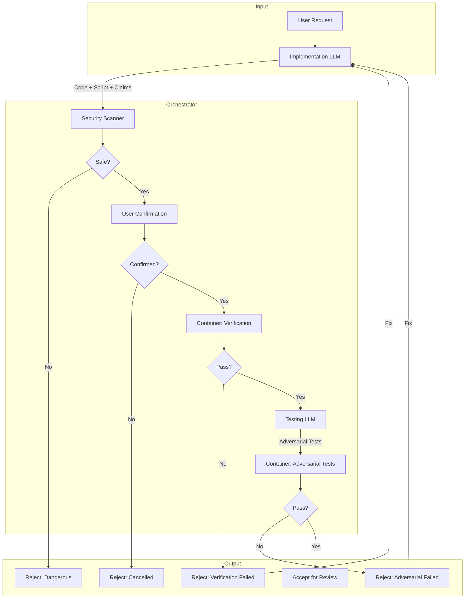

# 180 - Feature: Adversarial Testing Workflow

<!-- Template Metadata
Last Updated: 2026-01-27
Updated By: Initial LLD creation
Update Reason: New feature design for separation of implementation from verification
-->

## 1. Context & Goal
* **Issue:** #80
* **Objective:** Establish a workflow where the LLM that writes code cannot declare it "tested"—a separate Testing LLM writes adversarial tests designed to break the Implementation LLM's claims, with an orchestrator running all verification independently in a secure, sandboxed environment.
* **Status:** Draft
* **Related Issues:** N/A

### Open Questions

- [ ] Should adversarial tests run on every commit (expensive) or only before PR/on-demand?
- [ ] Can Testing LLM suggest fixes, or should it be pure adversarial (report only)?
- [ ] How should Testing LLM performance be scored (reward for finding bugs vs penalize false positives)?
- [ ] What's the threshold for escalating from Gemini Flash to Gemini Pro (complexity heuristic)?

## 2. Proposed Changes

*This section is the **source of truth** for implementation. Describe exactly what will be built.*

### 2.1 Files Changed

| File | Change Type | Description |
|------|-------------|-------------|
| `tools/adversarial_test_workflow.py` | Add | Main orchestrator coordinating verification and adversarial testing |
| `tools/script_safety_scanner.py` | Add | Shell script and Python AST security scanner |
| `tools/templates/verify-template.sh` | Add | Template for verification scripts |
| `tools/templates/test_adversarial_template.py` | Add | Template for adversarial tests |
| `tools/docker/adversarial-sandbox.Dockerfile` | Add | Container definition for sandboxed execution |
| `tests/fixtures/adversarial/mock_gemini_responses.json` | Add | Mocked LLM responses for offline development |
| `tests/fixtures/adversarial/sample_claims.json` | Add | Sample claims for testing |
| `tests/fixtures/adversarial/dangerous_scripts/curl_external.sh` | Add | Test fixture for security scanner |
| `tests/fixtures/adversarial/dangerous_scripts/rm_rf_root.sh` | Add | Test fixture for security scanner |
| `tests/fixtures/adversarial/dangerous_scripts/sudo_escalation.sh` | Add | Test fixture for security scanner |
| `tests/unit/test_adversarial_workflow.py` | Add | Unit tests for orchestrator |
| `tests/unit/test_script_safety_scanner.py` | Add | Unit tests for security scanner |
| `docs/adr/0015-adversarial-testing-workflow.md` | Add | Architecture decision record |
| `docs/reports/adversarial-costs.csv` | Add | Cost tracking for adversarial testing runs |
| `tools/run_issue_workflow.py` | Modify | Add N2.5 adversarial testing gate |
| `docs/wiki/governance-workflow.md` | Modify | Document new N2.5 gate |
| `CLAUDE.md` | Modify | Add adversarial testing prompts for Implementation LLM |
| `config/gemini.yaml` | Modify | Add enterprise and data_retention settings |

### 2.1.1 Path Validation (Mechanical - Auto-Checked)

*Issue #277: Before human or Gemini review, paths are verified programmatically.*

Mechanical validation automatically checks:
- All "Modify" files must exist in repository
- All "Delete" files must exist in repository
- All "Add" files must have existing parent directories
- No placeholder prefixes (`src/`, `lib/`, `app/`) unless directory exists

**If validation fails, the LLD is BLOCKED before reaching review.**

### 2.2 Dependencies

```toml
# pyproject.toml additions
docker = "^7.0.0"  # Docker SDK for Python (container management)
```

External dependencies:
- Docker or Podman (runtime requirement for sandboxed execution)
- Gemini Enterprise API with Zero Data Retention (ZDR) policy

### 2.3 Data Structures

```python
# Pseudocode - NOT implementation

class WorkflowStatus(Enum):
    """Possible workflow outcomes."""
    PASS = "PASS"
    DRY_RUN = "DRY_RUN"
    CANCELLED = "CANCELLED"
    BLOCKED_DANGEROUS_SCRIPT = "BLOCKED_DANGEROUS_SCRIPT"
    FAILED_IMPORT = "FAILED_IMPORT"
    FAILED_VERIFICATION = "FAILED_VERIFICATION"
    FAILED_TIMEOUT = "FAILED_TIMEOUT"
    FAILED_ADVERSARIAL = "FAILED_ADVERSARIAL"
    BLOCKED_DANGEROUS_OPERATION = "BLOCKED_DANGEROUS_OPERATION"

class WorkflowResult(TypedDict):
    """Result of adversarial testing workflow."""
    status: WorkflowStatus
    message: str | None  # Human-readable status message
    stderr: str | None  # Error output if failed
    failures: list[TestFailure] | None  # List of failed tests
    patterns: list[DangerousPattern] | None  # Blocked dangerous patterns
    cost_cents: int  # Cost of LLM API calls in cents

class TestFailure(TypedDict):
    """Details of a failed adversarial test."""
    test_name: str  # e.g., "test_vscode_with_spaces_in_path"
    claim_violated: str  # e.g., "VS Code launches successfully"
    error_type: str  # e.g., "FileNotFoundError"
    error_message: str  # Full error message
    traceback: str  # Stack trace

class DangerousPattern(TypedDict):
    """A detected dangerous pattern in a script."""
    line_number: int
    pattern_type: str  # e.g., "NETWORK_ACCESS", "DESTRUCTIVE_COMMAND"
    content: str  # The actual line content
    severity: str  # "CRITICAL", "HIGH", "MEDIUM"

class Claim(TypedDict):
    """A claim made by the Implementation LLM."""
    id: str  # e.g., "C001"
    description: str  # e.g., "VS Code launches and waits for user input"
    category: str  # e.g., "functionality", "integration", "security"

class AdversarialTestConfig(TypedDict):
    """Configuration for adversarial test generation."""
    implementation_files: list[str]  # Paths to implementation files
    claims: list[Claim]  # Claims to test
    testing_model: str  # "gemini-flash" or "gemini-pro"
    max_cost_cents: int | None  # Budget cap
    timeout_verification: int  # Seconds for verification (default 300)
    timeout_adversarial: int  # Seconds for adversarial tests (default 600)
    allow_network: bool  # Enable network in container (default False)
```

### 2.4 Function Signatures

```python
# tools/adversarial_test_workflow.py

def run_adversarial_testing(
    config: AdversarialTestConfig,
    dry_run: bool = False,
    auto_confirm: bool = False,
    containerized: bool = True,
) -> WorkflowResult:
    """
    Execute the full adversarial testing workflow.
    
    Steps:
    1. Security scan of verification script
    2. Get user confirmation (unless dry_run or auto_confirm)
    3. Run verification script in container with timeout
    4. Invoke Testing LLM to generate adversarial tests
    5. Run adversarial tests in container with timeout
    6. Return results with cost tracking
    """
    ...

def run_verification_script(
    script_path: str,
    workspace: str,
    timeout: int = 300,
    memory_limit: str = "2g",
    cpu_limit: str = "2",
    network: bool = False,
) -> tuple[bool, str, str]:
    """
    Execute verification script in Docker container.
    
    Returns:
        (success, stdout, stderr)
    """
    ...

def invoke_testing_llm(
    implementation_files: list[str],
    claims: list[Claim],
    model: str = "gemini-flash",
) -> str:
    """
    Send implementation code and claims to Testing LLM.
    
    Returns:
        Generated adversarial test code as string.
    """
    ...

def run_adversarial_tests(
    test_file: str,
    workspace: str,
    timeout: int = 600,
    memory_limit: str = "2g",
    cpu_limit: str = "2",
) -> tuple[bool, list[TestFailure]]:
    """
    Execute adversarial tests in Docker container.
    
    Returns:
        (all_passed, failures)
    """
    ...

def parse_pytest_failures(output: str) -> list[TestFailure]:
    """Parse pytest output to extract structured failure information."""
    ...

def get_user_confirmation(prompt: str) -> bool:
    """Display prompt and wait for user confirmation (y/n)."""
    ...

def sanitize_environment() -> dict[str, str]:
    """
    Create sanitized environment for script execution.
    
    Clears: PYTHONPATH, API keys, internal tokens.
    Preserves: PATH, HOME, USER.
    """
    ...

def log_cost(
    ticket_id: str,
    model: str,
    input_tokens: int,
    output_tokens: int,
    cost_cents: int,
) -> None:
    """Append cost record to docs/reports/adversarial-costs.csv."""
    ...
```

```python
# tools/script_safety_scanner.py

def scan_shell_script(script_path: str) -> list[DangerousPattern]:
    """
    Scan shell script for dangerous patterns.
    
    Detects:
    - Network access (curl, wget, nc to external IPs)
    - Destructive commands (rm -rf, shutil.rmtree on system paths)
    - Privilege escalation (sudo, su)
    - Environment exfiltration
    """
    ...

def scan_python_ast(script_path: str) -> list[DangerousPattern]:
    """
    AST-based Python script validation.
    
    Detects:
    - os.system calls
    - subprocess.call with shell=True on untrusted input
    - shutil.rmtree on non-workspace paths
    - Dangerous imports (socket for raw network access)
    """
    ...

def is_external_ip(ip_or_host: str) -> bool:
    """Check if IP/hostname is external (not localhost/private)."""
    ...

def classify_pattern_severity(pattern_type: str, context: str) -> str:
    """Determine severity level for a detected pattern."""
    ...
```

### 2.5 Logic Flow (Pseudocode)

```
ADVERSARIAL TESTING WORKFLOW
============================

1. Receive configuration (implementation files, claims, options)

2. IF dry_run THEN
   - Display verification script contents
   - Display claims to be tested
   - Print "No execution performed"
   - RETURN status=DRY_RUN

3. Load verification script from Implementation LLM output

4. Run security scanner on verification script
   - scan_shell_script() for .sh files
   - scan_python_ast() for .py files
   
5. IF dangerous patterns detected THEN
   - Display warning with patterns and line numbers
   - IF not allow_dangerous flag THEN
     - RETURN status=BLOCKED_DANGEROUS_SCRIPT
   - ELSE
     - Require explicit re-confirmation

6. IF not auto_confirm THEN
   - Display script contents
   - Prompt user "Execute verification script? [y/N]"
   - IF user says no THEN
     - RETURN status=CANCELLED

7. Build Docker container command:
   - --rm (auto-cleanup)
   - --network=none (unless allow_network)
   - --memory=2g
   - --cpus=2
   - -v workspace:/workspace:rw
   - adversarial-sandbox image

8. Execute verification script in container with timeout
   - TRY run with timeout=300 (5 min)
   - CATCH TimeoutExpired:
     - RETURN status=FAILED_TIMEOUT
   
9. Parse verification result:
   - IF returncode != 0 THEN
     - IF "ImportError" or "ModuleNotFoundError" in stderr THEN
       - RETURN status=FAILED_IMPORT
     - ELSE
       - RETURN status=FAILED_VERIFICATION

10. Invoke Testing LLM:
    - Send: implementation files + claims
    - Receive: adversarial test code
    - Write to: test_adversarial_{feature}.py

11. Execute adversarial tests in container:
    - TRY run pytest with timeout=600 (10 min)
    - CATCH TimeoutExpired:
      - RETURN status=FAILED_TIMEOUT

12. Parse pytest results:
    - IF all tests passed THEN
      - RETURN status=PASS
    - ELSE
      - Parse failures to extract test name, claim violated, error
      - RETURN status=FAILED_ADVERSARIAL with failures list

13. Log cost to adversarial-costs.csv
```

```
SECURITY SCANNER FLOW
=====================

1. Receive script path

2. Determine script type by extension

3. IF shell script (.sh, .bash) THEN
   - Read file contents
   - FOR each line:
     - Check against DANGEROUS_SHELL_PATTERNS:
       * curl/wget to external IP
       * rm -rf / or rm -rf ~
       * sudo/su commands
       * nc (netcat) commands
       * env/printenv piped to curl/nc
     - IF match found:
       - Extract line number, pattern type, content
       - Classify severity
       - Add to findings

4. IF Python script (.py) THEN
   - Parse AST
   - Walk AST nodes:
     * Check Call nodes for dangerous functions
     * Check Import nodes for dangerous modules
     * Check string arguments for system paths
   - FOR each dangerous node:
     - Extract location, pattern type, severity
     - Add to findings

5. RETURN list of DangerousPattern objects
```

### 2.6 Technical Approach

* **Module:** `tools/adversarial_test_workflow.py`
* **Pattern:** Pipeline with gates (verification → adversarial) with fail-fast semantics
* **Key Decisions:**
  - Mandatory containerization for all LLM-generated script execution
  - Security scanning BEFORE user confirmation prompt (don't ask user to confirm dangerous scripts)
  - Environment sanitization to prevent false passes due to developer's local setup
  - Tiered LLM selection (Flash for standard, Pro for complex) to control costs

### 2.7 Architecture Decisions

| Decision | Options Considered | Choice | Rationale |
|----------|-------------------|--------|-----------|
| Script execution environment | Host with sandbox, VM, Docker container | Docker container | Best balance of isolation, performance, and portability |
| Security scanning timing | After user confirms, Before user sees script | Before confirmation | Don't burden user with reviewing dangerous scripts |
| Testing LLM selection | Single model, User choice, Automatic tiering | Automatic tiering | Balances cost vs quality based on ticket complexity |
| Network isolation | Allow by default, Block by default | Block by default | Principle of least privilege; most tests shouldn't need network |
| Confirmation model | Always confirm, Never confirm, Configurable | Configurable with safe defaults | Supports both interactive and CI usage |

**Architectural Constraints:**
- Must integrate with existing issue governance workflow at N2.5 gate
- Cannot require changes to existing test infrastructure (pytest)
- Must work with existing Gemini Enterprise integration
- Container must be buildable from Dockerfile (no external image dependencies)

## 3. Requirements

1. All LLM-generated verification scripts MUST execute in Docker container (no host execution)
2. User MUST confirm before any generated script executes (unless explicit auto-confirm flag)
3. Security scanner MUST block dangerous patterns before user sees confirmation prompt
4. Verification scripts MUST timeout after 5 minutes with clear error message
5. Adversarial test suites MUST timeout after 10 minutes with clear error message
6. Testing LLM MUST receive implementation code AND claims list
7. Adversarial tests MUST NOT use mocks for external dependencies
8. Import errors MUST be detected and halt workflow with FAILED_IMPORT status
9. Cost per adversarial test run MUST be logged to tracking CSV
10. Environment variables MUST be sanitized before script execution

## 4. Alternatives Considered

| Option | Pros | Cons | Decision |
|--------|------|------|----------|
| Host execution with ptrace sandbox | No Docker dependency, fast | Complex security model, OS-specific | **Rejected** |
| Docker container execution | Strong isolation, portable, well-understood | Requires Docker installed | **Selected** |
| VM-based isolation | Maximum isolation | Slow startup, resource heavy | **Rejected** |
| Same LLM for implementation and testing | Simpler architecture, lower cost | No adversarial pressure, conflict of interest | **Rejected** |
| Separate LLM for adversarial testing | Adversarial pressure catches bugs | Higher cost, complexity | **Selected** |
| Manual test writing | Human judgment | Doesn't scale, slow | **Rejected** |

**Rationale:** Docker provides strong isolation with reasonable performance and is widely available. Separate Testing LLM is essential—the entire motivation is adversarial pressure that same-LLM testing cannot provide.

## 5. Data & Fixtures

### 5.1 Data Sources

| Attribute | Value |
|-----------|-------|
| Source | Implementation LLM output (code, verification script, claims) |
| Format | Python files, Shell scripts, JSON claims |
| Size | Typically <100KB per ticket |
| Refresh | Per-ticket, on-demand |
| Copyright/License | Project code (owned), LLM output (owned) |

External data:
| Attribute | Value |
|-----------|-------|
| Source | Gemini Enterprise API |
| Format | JSON API responses |
| Size | ~10-50KB per adversarial test generation |
| Refresh | Real-time per request |
| Copyright/License | Covered under Gemini Enterprise agreement with ZDR |

### 5.2 Data Pipeline

```
Implementation LLM Output ──parse──► Claims + Code
                                         │
                                         ▼
                              Orchestrator validates
                                         │
                                         ▼
                              Testing LLM (Gemini) ──generates──► Adversarial Tests
                                                                        │
                                                                        ▼
                                                              Container Execution
                                                                        │
                                                                        ▼
                                                              Results + Cost Log
```

### 5.3 Test Fixtures

| Fixture | Source | Notes |
|---------|--------|-------|
| `mock_gemini_responses.json` | Generated | Mocked adversarial test generation responses |
| `sample_claims.json` | Generated | Sample claims for testing orchestrator logic |
| `dangerous_scripts/*.sh` | Generated | Test fixtures for security scanner validation |
| `passing_verification.sh` | Generated | Verification script that passes all checks |
| `failing_import.py` | Generated | Script with ImportError for testing detection |

### 5.4 Deployment Pipeline

Development:
1. Use mocked fixtures for offline testing
2. Run `pytest tests/unit/test_adversarial_workflow.py --offline`

Staging:
1. Run with `--dry-run` to validate script generation
2. Test with sample implementation files

Production:
1. Integrated into governance workflow at N2.5 gate
2. Runs automatically on tickets with `needs-adversarial` label

## 6. Diagram

### 6.1 Mermaid Quality Gate

Before finalizing any diagram, verify in [Mermaid Live Editor](https://mermaid.live) or GitHub preview:

- [x] **Simplicity:** Similar components collapsed (per 0006 §8.1)
- [x] **No touching:** All elements have visual separation (per 0006 §8.2)
- [x] **No hidden lines:** All arrows fully visible (per 0006 §8.3)
- [x] **Readable:** Labels not truncated, flow direction clear
- [ ] **Auto-inspected:** Agent rendered via mermaid.ink and viewed (per 0006 §8.5)

**Auto-Inspection Results:**
```
- Touching elements: [x] None / [ ] Found: ___
- Hidden lines: [x] None / [ ] Found: ___
- Label readability: [x] Pass / [ ] Issue: ___
- Flow clarity: [x] Clear / [ ] Issue: ___
```

### 6.2 Diagram



## 7. Security & Safety Considerations

### 7.1 Security

| Concern | Mitigation | Status |
|---------|------------|--------|
| Arbitrary code execution | Mandatory Docker containerization with no host execution path | Addressed |
| Network exfiltration | Default `--network=none` in container | Addressed |
| Filesystem destruction | Container mounts only workspace as writable; system paths unmounted | Addressed |
| Privilege escalation | Container runs as non-root user; no sudo in container | Addressed |
| Environment leakage | Sanitize PYTHONPATH, API keys before execution | Addressed |
| Malicious LLM output | Pre-execution security scanning with AST analysis | Addressed |
| Supply chain (Docker image) | Build from Dockerfile, no external image pulls | Addressed |
| Data exfiltration to Testing LLM | Gemini Enterprise with Zero Data Retention policy | Addressed |

### 7.2 Safety

| Concern | Mitigation | Status |
|---------|------------|--------|
| Runaway script (infinite loop) | 5-minute timeout for verification, 10-minute for adversarial | Addressed |
| Resource exhaustion | Docker memory limit (2GB), CPU limit (2 cores) | Addressed |
| False sense of security | Clear documentation that adversarial testing is one layer, not guarantee | Addressed |
| Test flakiness causing false failures | Retry logic with exponential backoff (future enhancement) | Pending |
| User fatigue from confirmation prompts | `--auto-confirm` option for CI with explicit opt-in | Addressed |

**Fail Mode:** Fail Closed - If any doubt about script safety, block execution and require explicit override

**Recovery Strategy:** 
- Failed verification → Send error back to Implementation LLM for fix
- Failed adversarial → Send specific test failures back for fix
- Timeout → Report which stage timed out, suggest splitting work

## 8. Performance & Cost Considerations

### 8.1 Performance

| Metric | Budget | Approach |
|--------|--------|----------|
| Verification script startup | < 10s | Pre-built Docker image |
| Verification script execution | < 5 min | Timeout enforcement |
| Adversarial test execution | < 10 min | Timeout enforcement |
| Testing LLM response | < 60s | Gemini Flash for standard tickets |
| Total workflow time | < 20 min | Parallel test execution where possible (future) |

**Bottlenecks:** 
- Docker container startup (~3-5s cold, <1s warm)
- Testing LLM API latency (~5-30s depending on model)
- Large test suites may approach 10-minute timeout

### 8.2 Cost Analysis

| Resource | Unit Cost | Estimated Usage | Monthly Cost |
|----------|-----------|-----------------|--------------|
| Gemini Flash API | $0.075/1M input tokens, $0.30/1M output | ~50 tickets × 10K tokens | ~$2-5 |
| Gemini Pro API | $1.25/1M input tokens, $5.00/1M output | ~5 tickets × 20K tokens | ~$1-3 |
| Docker compute | $0 (local) | Local execution | $0 |
| **Total** | | | **~$3-8/month** |

**Cost Controls:**
- [x] Default to Gemini Flash (10-20x cheaper than Pro)
- [x] `--max-cost` flag to skip if estimated cost exceeds threshold
- [x] Cost logging to CSV for tracking and alerts
- [ ] Budget alerts configured at $20/month threshold (manual monitoring initially)

**Worst-Case Scenario:** 
- 10x usage spike: ~$30-80/month (acceptable)
- 100x usage spike: ~$300-800/month (would trigger budget alert, investigate)

## 9. Legal & Compliance

| Concern | Applies? | Mitigation |
|---------|----------|------------|
| PII/Personal Data | No | No user PII processed; only code analysis |
| Third-Party Licenses | Yes | Docker SDK (Apache 2.0) - compatible |
| Terms of Service | Yes | Gemini Enterprise agreement covers code analysis; ZDR enabled |
| Data Retention | Yes | Zero Data Retention policy on Gemini Enterprise endpoint |
| Export Controls | No | No restricted algorithms or data |

**Data Classification:** Internal (project code, not public, not restricted)

**Compliance Checklist:**
- [x] No PII stored without consent (N/A - no PII)
- [x] All third-party licenses compatible with project license
- [x] External API usage compliant with provider ToS (Gemini Enterprise)
- [x] Data retention policy documented (ZDR in config/gemini.yaml)

## 10. Verification & Testing

*Ref: [0005-testing-strategy-and-protocols.md](0005-testing-strategy-and-protocols.md)*

### 10.0 Test Plan (TDD - Complete Before Implementation)

| Test ID | Test Description | Expected Behavior | Status |
|---------|------------------|-------------------|--------|
| T010 | test_dry_run_shows_script_no_execution | Shows script content, returns DRY_RUN status, no subprocess calls | RED |
| T020 | test_security_scanner_blocks_curl_external | Detects curl to external IP, returns BLOCKED_DANGEROUS_SCRIPT | RED |
| T030 | test_security_scanner_blocks_rm_rf | Detects rm -rf /, returns BLOCKED_DANGEROUS_SCRIPT | RED |
| T040 | test_security_scanner_allows_safe_script | Safe script passes scanner, proceeds to confirmation | RED |
| T050 | test_verification_timeout_enforced | Script sleeping 600s terminated at 300s, returns FAILED_TIMEOUT | RED |
| T060 | test_import_error_detected | Script with ImportError returns FAILED_IMPORT status | RED |
| T070 | test_verification_failure_detected | Script returning non-zero returns FAILED_VERIFICATION | RED |
| T080 | test_adversarial_tests_generated | Testing LLM invoked with code+claims, returns test code | RED |
| T090 | test_adversarial_test_failure_parsed | Pytest failures parsed into structured TestFailure objects | RED |
| T100 | test_cost_logged_to_csv | Cost record appended to adversarial-costs.csv | RED |
| T110 | test_environment_sanitized | PYTHONPATH and API keys cleared before execution | RED |
| T120 | test_container_network_disabled_default | Container runs with --network=none by default | RED |
| T130 | test_user_cancellation_handled | User entering 'n' returns CANCELLED status | RED |
| T140 | test_auto_confirm_requires_containerized | auto_confirm without containerized raises error | RED |
| T150 | test_python_ast_scanner_detects_os_system | AST scanner detects os.system() calls | RED |

**Coverage Target:** ≥95% for all new code

**TDD Checklist:**
- [ ] All tests written before implementation
- [ ] Tests currently RED (failing)
- [ ] Test IDs match scenario IDs in 10.1
- [ ] Test file created at: `tests/unit/test_adversarial_workflow.py`

### 10.1 Test Scenarios

| ID | Scenario | Type | Input | Expected Output | Pass Criteria |
|----|----------|------|-------|-----------------|---------------|
| 010 | Dry-run mode | Auto | `--dry-run` flag | Script displayed, DRY_RUN status | No subprocess.run calls |
| 020 | Security scanner - curl external | Auto | Script with `curl http://evil.com` | BLOCKED_DANGEROUS_SCRIPT | Pattern detected with line number |
| 030 | Security scanner - rm -rf | Auto | Script with `rm -rf /` | BLOCKED_DANGEROUS_SCRIPT | CRITICAL severity |
| 040 | Security scanner - safe script | Auto | Script with only pytest commands | No patterns | Empty list returned |
| 050 | Verification timeout | Auto | Script with `sleep 600` | FAILED_TIMEOUT | Terminates at 300s |
| 060 | Import error detection | Auto | `from fake_module import x` | FAILED_IMPORT | stderr contains ImportError |
| 070 | Verification failure | Auto | Script returning exit 1 | FAILED_VERIFICATION | Non-zero captured |
| 080 | Adversarial test generation | Auto-Live | Code + claims | Test file generated | Contains test functions |
| 090 | Adversarial failure parsing | Auto | pytest --tb=short output | Structured failures | test_name, claim extracted |
| 100 | Cost logging | Auto | Completed workflow | CSV row added | Timestamp, model, tokens logged |
| 110 | Environment sanitization | Auto | Env with PYTHONPATH set | Cleared before execution | PYTHONPATH not in subprocess env |
| 120 | Network disabled default | Auto | Default options | --network=none in command | Docker command validated |
| 130 | User cancellation | Auto | Mocked input 'n' | CANCELLED status | No execution attempted |
| 140 | Auto-confirm validation | Auto | auto_confirm=True, containerized=False | ValueError raised | Clear error message |
| 150 | AST scanner - os.system | Auto | Python with `os.system()` | Pattern detected | Node location captured |

### 10.2 Test Commands

```bash
# Run all automated tests (offline mode with mocks)
poetry run pytest tests/unit/test_adversarial_workflow.py tests/unit/test_script_safety_scanner.py -v --offline

# Run only scanner tests (fast, no external deps)
poetry run pytest tests/unit/test_script_safety_scanner.py -v

# Run live integration tests (requires Gemini API)
poetry run pytest tests/unit/test_adversarial_workflow.py -v -m live

# Run with coverage
poetry run pytest tests/unit/test_adversarial_workflow.py --cov=tools/adversarial_test_workflow --cov-report=term-missing
```

### 10.3 Manual Tests (Only If Unavoidable)

**N/A - All scenarios automated.**

The self-destruct test (Scenario 8 from issue) is automated by:
1. Creating test fixture script that attempts file deletion
2. Running in containerized environment
3. Asserting BLOCKED_DANGEROUS_OPERATION status returned

## 11. Risks & Mitigations

| Risk | Impact | Likelihood | Mitigation |
|------|--------|------------|------------|
| Docker not installed on user machine | High | Medium | Clear error message with installation instructions; future: fallback to Podman |
| Testing LLM generates low-quality tests | Medium | Medium | Human review of generated tests; prompt engineering; fallback to Pro model |
| False positives from security scanner | Low | Medium | Whitelist common patterns; `--allow-dangerous` override with confirmation |
| Cost overruns from heavy usage | Medium | Low | Budget caps, cost logging, alerts at thresholds |
| Container escape vulnerability | Critical | Low | Use official Docker, keep updated, run as non-root, no privileged mode |
| Gemini API unavailable | Medium | Low | Offline mode with mocked responses for development; graceful degradation |

## 12. Definition of Done

### Code
- [ ] `adversarial_test_workflow.py` orchestrator implemented
- [ ] `script_safety_scanner.py` security scanner implemented
- [ ] Mandatory Docker containerization implemented
- [ ] Shell script inspection for dangerous patterns implemented
- [ ] AST-based Python validation implemented
- [ ] User confirmation prompt implemented
- [ ] `--dry-run` mode implemented
- [ ] Timeout handling (5 min verification, 10 min adversarial) implemented
- [ ] Resource constraint enforcement via Docker limits implemented
- [ ] Environment sanitization implemented
- [ ] Verification script template created
- [ ] Adversarial test template created
- [ ] Code comments reference this LLD

### Tests
- [ ] All test scenarios pass
- [ ] Test coverage ≥95% for new code
- [ ] Unit tests for orchestrator written and passing
- [ ] Unit tests for security scanner written and passing
- [ ] Mocked LLM response fixtures created
- [ ] Self-destruct test in security test suite

### Documentation
- [ ] ADR documenting adversarial testing rationale created
- [ ] governance-workflow.md updated with N2.5 gate
- [ ] CLAUDE.md updated with verification script requirements
- [ ] LLD updated with any deviations
- [ ] Implementation Report (0103) completed
- [ ] Test Report (0113) completed

### Integration
- [ ] N2.5 gate added to `run_issue_workflow.py`
- [ ] CLI interface working with all documented flags
- [ ] `config/gemini.yaml` updated with enterprise/ZDR settings

### Review
- [ ] Run 0809 Security Audit - PASS
- [ ] Run 0817 Wiki Alignment Audit - PASS
- [ ] Code review completed
- [ ] User approval before closing issue

### 12.1 Traceability (Mechanical - Auto-Checked)

*Issue #277: Cross-references are verified programmatically.*

Mechanical validation automatically checks:
- Every file mentioned in this section must appear in Section 2.1
- Every risk mitigation in Section 11 should have a corresponding function in Section 2.4 (warning if not)

**If files are missing from Section 2.1, the LLD is BLOCKED.**

---

## Appendix: Review Log

*Track all review feedback with timestamps and implementation status.*

### Review Summary

| Review | Date | Verdict | Key Issue |
|--------|------|---------|-----------|
| (pending) | (auto) | - | - |

**Final Status:** PENDING