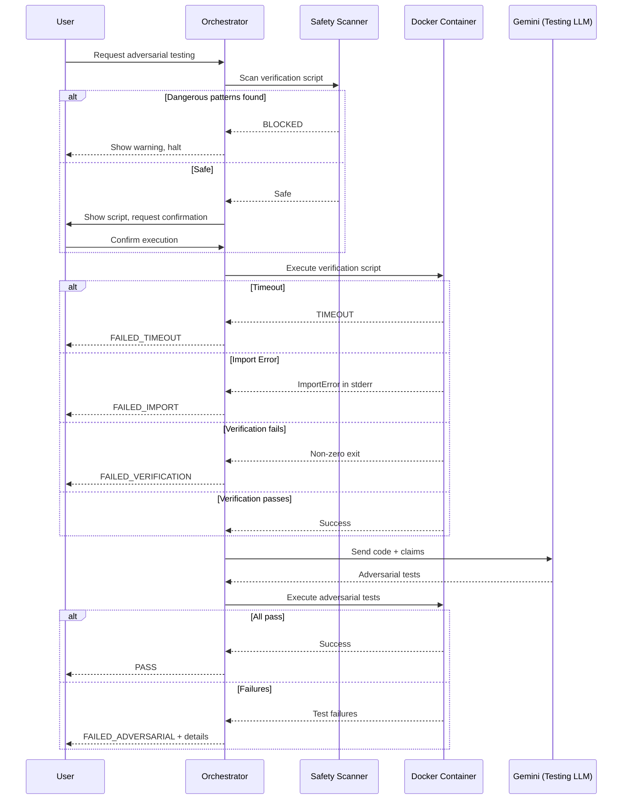

# 180 - Feature: Adversarial Testing Workflow

## 1. Context & Goal
* **Issue:** #80
* **Objective:** Establish a workflow where implementation and verification are performed by separate, adversarial LLMs to catch bugs, import errors, and false claims before code ships to production.
* **Status:** Draft
* **Related Issues:** N/A

### Open Questions

- [ ] Which Gemini model tier threshold for "complex" tickets? (Currently proposed: `complexity:high` label or security-critical path)
- [ ] Should Testing LLM be allowed to suggest fixes, or pure adversarial role only?
- [ ] What's the minimum project directory size before adversarial testing is required?
- [ ] Should cached adversarial test results be invalidated on any file change, or only on implementation file changes?

## 2. Proposed Changes

### 2.1 Files Changed

| File | Change Type | Description |
|------|-------------|-------------|
| `tools/adversarial_test_workflow.py` | Add | Main orchestrator script coordinating verification and adversarial testing |
| `tools/script_safety_scanner.py` | Add | Shell script and Python AST security scanner |
| `tools/templates/verify-template.sh` | Add | Template for verification scripts |
| `tools/templates/test_adversarial_template.py` | Add | Template for adversarial tests |
| `tools/docker/adversarial-sandbox.Dockerfile` | Add | Container definition for sandboxed execution |
| `tests/fixtures/adversarial/mock_gemini_responses.json` | Add | Mocked LLM responses for offline development |
| `tests/fixtures/adversarial/sample_claims.json` | Add | Sample claims for testing |
| `tests/fixtures/adversarial/dangerous_scripts/curl_external.sh` | Add | Test fixture for security scanner validation |
| `tests/fixtures/adversarial/dangerous_scripts/rm_rf_root.sh` | Add | Test fixture for security scanner validation |
| `tests/fixtures/adversarial/dangerous_scripts/env_exfil.sh` | Add | Test fixture for security scanner validation |
| `tests/test_adversarial_workflow.py` | Add | Unit tests for orchestrator |
| `tests/test_script_safety_scanner.py` | Add | Unit tests for security scanner |
| `docs/adr/0015-adversarial-testing-workflow.md` | Add | Architecture decision record |
| `docs/reports/adversarial-costs.csv` | Add | Cost tracking for adversarial testing runs |
| `docs/reports/adversarial-testing/implementation-report.md` | Add | Implementation report for this feature |
| `docs/reports/adversarial-testing/test-report.md` | Add | Test report for this feature |
| `tools/run_issue_workflow.py` | Modify | Add N2.5 adversarial testing gate |
| `docs/wiki/governance-workflow.md` | Modify | Document new gate |
| `CLAUDE.md` | Modify | Add adversarial testing prompts for Implementation LLM |
| `config/gemini.yaml` | Modify | Add enterprise endpoint and ZDR settings |

### 2.1.1 Path Validation (Mechanical - Auto-Checked)

Mechanical validation automatically checks:
- All "Modify" files must exist in repository
- All "Delete" files must exist in repository
- All "Add" files must have existing parent directories
- No placeholder prefixes (`src/`, `lib/`, `app/`) unless directory exists

**If validation fails, the LLD is BLOCKED before reaching review.**

### 2.2 Dependencies

```toml
# pyproject.toml additions
docker = "^7.0.0"  # Docker SDK for Python (container orchestration)
```

Note: Assumes `google-generativeai` or equivalent Gemini SDK already present for existing Gemini integration.

### 2.3 Data Structures

```python
# Pseudocode - NOT implementation

class WorkflowStatus(Enum):
    """Status codes for adversarial testing workflow."""
    PASS = "PASS"
    FAILED_VERIFICATION = "FAILED_VERIFICATION"
    FAILED_IMPORT = "FAILED_IMPORT"
    FAILED_ADVERSARIAL = "FAILED_ADVERSARIAL"
    FAILED_TIMEOUT = "FAILED_TIMEOUT"
    BLOCKED_DANGEROUS_SCRIPT = "BLOCKED_DANGEROUS_SCRIPT"
    BLOCKED_DANGEROUS_OPERATION = "BLOCKED_DANGEROUS_OPERATION"
    CANCELLED = "CANCELLED"
    DRY_RUN = "DRY_RUN"

class WorkflowResult(TypedDict):
    """Result from adversarial testing workflow."""
    status: WorkflowStatus
    message: str | None
    stderr: str | None
    failures: list[TestFailure] | None
    cost_usd: float | None
    duration_seconds: float | None

class TestFailure(TypedDict):
    """Details of a single test failure."""
    test_name: str
    claim_violated: str | None
    error_type: str
    error_message: str
    traceback: str | None

class DangerousPattern(TypedDict):
    """Detected dangerous pattern in script."""
    line_number: int
    pattern_type: str  # "network", "destructive", "privilege", "exfiltration"
    code_snippet: str
    severity: str  # "critical", "high", "medium"

class ScanResult(TypedDict):
    """Result from script safety scanner."""
    is_safe: bool
    patterns: list[DangerousPattern]
    blocked: bool
```

### 2.4 Function Signatures

```python
# tools/adversarial_test_workflow.py

def run_adversarial_testing(
    implementation_files: list[Path],
    claims: list[str],
    verification_script: Path,
    dry_run: bool = False,
    auto_confirm: bool = False,
    containerized: bool = True,
    timeout_verification: int = 300,
    timeout_adversarial: int = 600,
    max_cost: float | None = None,
    allow_network: bool = False,
    allow_dangerous: bool = False,
) -> WorkflowResult:
    """
    Run complete adversarial testing workflow.
    
    Orchestrates verification script execution, Testing LLM invocation,
    and adversarial test execution with mandatory containerization.
    """
    ...

def execute_in_container(
    command: list[str],
    workspace: Path,
    timeout: int,
    memory_limit: str = "2g",
    cpu_limit: str = "2",
    network_enabled: bool = False,
) -> subprocess.CompletedProcess:
    """Execute command in sandboxed Docker container."""
    ...

def invoke_testing_llm(
    implementation_files: list[Path],
    claims: list[str],
    use_pro_model: bool = False,
) -> str:
    """
    Invoke Gemini to generate adversarial tests.
    
    Returns generated test code as string.
    """
    ...

def parse_test_failures(pytest_output: str) -> list[TestFailure]:
    """Parse pytest output to extract structured failure information."""
    ...

def get_user_confirmation(prompt: str) -> bool:
    """Prompt user for confirmation before script execution."""
    ...

def sanitize_environment() -> dict[str, str]:
    """Return sanitized environment variables for container execution."""
    ...

def log_cost(
    issue_id: str,
    model: str,
    tokens_in: int,
    tokens_out: int,
    cost_usd: float,
    csv_path: Path,
) -> None:
    """Log adversarial testing cost to tracking CSV."""
    ...


# tools/script_safety_scanner.py

def scan_shell_script(script_path: Path) -> ScanResult:
    """
    Scan shell script for dangerous patterns.
    
    Checks for network access, destructive commands, privilege escalation,
    and environment exfiltration.
    """
    ...

def scan_python_script(script_path: Path) -> ScanResult:
    """
    Perform AST-based analysis of Python script.
    
    Rejects dangerous imports and function calls.
    """
    ...

def scan_script(script_path: Path) -> ScanResult:
    """
    Scan script for dangerous patterns (auto-detects type).
    
    Dispatches to shell or Python scanner based on extension.
    """
    ...

def is_external_ip(ip_or_url: str) -> bool:
    """Check if IP/URL is external (not localhost/private)."""
    ...

def extract_shell_commands(script_content: str) -> list[tuple[int, str]]:
    """Extract commands with line numbers from shell script."""
    ...
```

### 2.5 Logic Flow (Pseudocode)

```
run_adversarial_testing():
1. IF dry_run THEN
   - Display verification script contents
   - Display what would be executed
   - RETURN DRY_RUN status
   
2. Scan verification script for dangerous patterns
3. IF dangerous patterns found AND NOT allow_dangerous THEN
   - Display warning with specific dangerous commands
   - RETURN BLOCKED_DANGEROUS_SCRIPT status
   
4. IF NOT auto_confirm THEN
   - Show script content to user
   - Prompt for confirmation
   - IF user declines THEN RETURN CANCELLED status
   
5. Sanitize environment variables (clear PYTHONPATH, API keys)
6. Build Docker container if not exists

7. Execute verification script in container:
   - Set timeout to timeout_verification (5 min default)
   - Set memory limit to 2GB
   - Set CPU limit to 2 cores
   - Disable network (unless allow_network)
   
8. IF verification times out THEN
   - RETURN FAILED_TIMEOUT with message
   
9. IF verification fails THEN
   - Parse stderr for ImportError/ModuleNotFoundError
   - IF import error THEN RETURN FAILED_IMPORT
   - ELSE RETURN FAILED_VERIFICATION
   
10. Check max_cost budget if set
11. Determine model tier (Flash vs Pro) based on:
    - Ticket labels (complexity:high, security-relevant)
    - File paths (tools/, core/ directories)
    
12. Invoke Testing LLM (Gemini) with:
    - Implementation file contents
    - Claims list
    - Adversarial test generation prompt
    
13. Write generated tests to temp file
14. Scan generated tests for safety

15. Execute adversarial tests in container:
    - Set timeout to timeout_adversarial (10 min default)
    - Same resource limits as verification
    
16. IF adversarial tests timeout THEN
    - RETURN FAILED_TIMEOUT with message
    
17. Parse pytest output for failures
18. Log cost to CSV

19. IF all tests pass THEN
    - RETURN PASS status
    ELSE
    - RETURN FAILED_ADVERSARIAL with failure details
```

### 2.6 Technical Approach

* **Module:** `tools/adversarial_test_workflow.py`
* **Pattern:** Orchestrator pattern with mandatory containerization
* **Key Decisions:**
  - All LLM-generated scripts execute ONLY in Docker containers (no host execution path)
  - Pre-execution security scanning before user sees confirmation prompt
  - Structured failure reporting with claim-to-failure mapping
  - Cost tracking for budget management

### 2.7 Architecture Decisions

| Decision | Options Considered | Choice | Rationale |
|----------|-------------------|--------|-----------|
| Execution environment | Host execution, VM, Container | Container (Docker) | Balance of security and performance; easier setup than VMs |
| Testing LLM | Claude, Gemini, GPT-4 | Gemini | Existing integration, adversarial separation from Claude |
| Model selection | Single model, Tiered by cost | Tiered (Flash/Pro) | Cost optimization while maintaining quality for complex cases |
| Script scanning | Regex only, AST only, Both | Both | Regex for shell scripts, AST for Python provides comprehensive coverage |
| Confirmation model | Auto-execute, Always confirm, Flag-based | Flag-based with safe defaults | Flexibility for CI while protecting interactive use |

**Architectural Constraints:**
- Must integrate with existing Gemini Enterprise endpoint with ZDR policy
- Cannot execute any LLM-generated code outside container
- Must maintain compatibility with existing governance workflow (N0-N6 gates)

## 3. Requirements

1. Orchestrator MUST run all verification scripts in Docker container (no host execution)
2. Orchestrator MUST require user confirmation before executing generated scripts (unless `--auto-confirm`)
3. `--dry-run` mode MUST show script content without any execution
4. Shell script inspection MUST block dangerous commands before confirmation prompt
5. Verification scripts MUST timeout after 5 minutes with clear error message
6. Adversarial test suites MUST timeout after 10 minutes with clear error message
7. Testing LLM (Gemini Enterprise/ZDR) MUST receive implementation code and generate adversarial tests
8. Adversarial tests MUST execute without mocks for subprocess/external calls
9. Orchestrator MUST parse stderr for ImportError/ModuleNotFoundError and halt with FAILED_IMPORT status
10. Edge cases MUST be tested (unicode, paths with spaces, missing commands)
11. False claims MUST be exposed (mocked "integration tests" flagged)
12. N2.5 gate MUST be integrated into issue governance workflow
13. Failure reporting MUST show exact test output and claim violated
14. Cost per adversarial test run MUST be logged to tracking CSV
15. Environment variables MUST be sanitized (PYTHONPATH, API keys cleared) before execution

## 4. Alternatives Considered

| Option | Pros | Cons | Decision |
|--------|------|------|----------|
| Host execution with sandboxing | Faster, simpler setup | Security risk, harder to isolate | **Rejected** |
| Docker mandatory | Strong isolation, reproducible | Requires Docker installed | **Selected** |
| VM execution | Maximum isolation | Slow startup, complex management | **Rejected** |
| Single Gemini model for all | Simpler configuration | Higher cost for simple tests | **Rejected** |
| Tiered model selection | Cost optimization | More complex logic | **Selected** |
| Claude as Testing LLM | Same vendor, consistent | Conflict of interest (same as Implementation LLM) | **Rejected** |
| Gemini as Testing LLM | Adversarial separation, existing integration | Cross-vendor complexity | **Selected** |

**Rationale:** Docker provides the best balance of security isolation and operational simplicity. Gemini as Testing LLM ensures true adversarial separation from Claude (Implementation LLM). Tiered model selection optimizes cost without sacrificing quality.

## 5. Data & Fixtures

### 5.1 Data Sources

| Attribute | Value |
|-----------|-------|
| Source | Gemini API (Enterprise endpoint) |
| Format | JSON API response |
| Size | ~1-10KB per response |
| Refresh | Real-time per request |
| Copyright/License | Gemini Enterprise Agreement with ZDR |

### 5.2 Data Pipeline

```
Implementation Files ──read──► Orchestrator ──API call──► Gemini ──response──► Adversarial Tests
                                    │
                                    ├──► Docker Container ──stdout/stderr──► Result Parsing
                                    │
                                    └──► Cost CSV ──append──► docs/reports/adversarial-costs.csv
```

### 5.3 Test Fixtures

| Fixture | Source | Notes |
|---------|--------|-------|
| `mock_gemini_responses.json` | Generated | Mocked API responses for offline testing |
| `sample_claims.json` | Hardcoded | Example claims for testing orchestrator logic |
| `dangerous_scripts/*.sh` | Hardcoded | Test fixtures for security scanner validation |

### 5.4 Deployment Pipeline

- **Dev:** Mocked LLM responses, no real API calls
- **Test:** Integration tests can optionally hit real Gemini API (marked `@pytest.mark.live`)
- **Production:** Real Gemini Enterprise endpoint with ZDR policy

**External utility needed?** No - existing Gemini integration sufficient.

## 6. Diagram

### 6.1 Mermaid Quality Gate

Before finalizing any diagram, verify in [Mermaid Live Editor](https://mermaid.live) or GitHub preview:

- [x] **Simplicity:** Similar components collapsed (per 0006 §8.1)
- [x] **No touching:** All elements have visual separation (per 0006 §8.2)
- [x] **No hidden lines:** All arrows fully visible (per 0006 §8.3)
- [x] **Readable:** Labels not truncated, flow direction clear
- [ ] **Auto-inspected:** Agent rendered via mermaid.ink and viewed (per 0006 §8.5)

**Agent Auto-Inspection (MANDATORY):**

**Auto-Inspection Results:**
```
- Touching elements: [ ] None / [ ] Found: ___
- Hidden lines: [ ] None / [ ] Found: ___
- Label readability: [ ] Pass / [ ] Issue: ___
- Flow clarity: [ ] Clear / [ ] Issue: ___
```

### 6.2 Diagram



## 7. Security & Safety Considerations

### 7.1 Security

| Concern | Mitigation | Status |
|---------|------------|--------|
| Arbitrary code execution | Mandatory Docker containerization; no host execution path | Addressed |
| Network exfiltration | Containers run with `--network=none` by default | Addressed |
| Destructive file operations | Container mounts only workspace writable; system paths read-only | Addressed |
| Privilege escalation | Container runs as non-root; no sudo/su allowed | Addressed |
| Environment variable leakage | Sanitize env before execution; clear API keys, PYTHONPATH | Addressed |
| Malicious LLM output | Pre-execution shell script inspection + Python AST scanning | Addressed |
| Supply chain attack via dependencies | Container built from controlled Dockerfile; pinned versions | Addressed |

### 7.2 Safety

| Concern | Mitigation | Status |
|---------|------------|--------|
| Runaway script | Timeout limits (5 min verification, 10 min adversarial) | Addressed |
| Resource exhaustion | Docker memory (2GB) and CPU (2 cores) limits | Addressed |
| Infinite loop | Timeout enforcement via subprocess.run timeout parameter | Addressed |
| Data loss from test cleanup | Tests operate only in mounted workspace; system protected | Addressed |
| Cost runaway | `--max-cost` flag; per-run cost logging; tiered model selection | Addressed |

**Fail Mode:** Fail Closed - Any security concern blocks execution and returns error status.

**Recovery Strategy:** Failed workflows return detailed error information. User can fix issues and re-run. No persistent state to recover.

## 8. Performance & Cost Considerations

### 8.1 Performance

| Metric | Budget | Approach |
|--------|--------|----------|
| Verification script execution | < 5 min | Timeout enforcement |
| Adversarial test execution | < 10 min | Timeout enforcement |
| Container startup | < 10 sec | Pre-built image, local cache |
| LLM response time | < 60 sec | Gemini Flash for most requests |

**Bottlenecks:** 
- LLM response time for large codebases
- Container startup on first run (subsequent runs use cached image)

### 8.2 Cost Analysis

| Resource | Unit Cost | Estimated Usage | Monthly Cost |
|----------|-----------|-----------------|--------------|
| Gemini Flash | ~$0.01-0.05 per request | 50 tickets/month | $0.50-$2.50 |
| Gemini Pro | ~$0.10-0.50 per request | 5 tickets/month | $0.50-$2.50 |
| Docker compute | Local | N/A | $0 |

**Cost Controls:**
- [x] Budget alerts via `--max-cost` flag
- [x] Tiered model selection (Flash default, Pro only when needed)
- [x] Per-run cost logging to `docs/reports/adversarial-costs.csv`

**Worst-Case Scenario:** 
- 10x usage spike: ~$30-50/month - acceptable
- 100x usage spike: ~$300-500/month - `--max-cost` flag would block excessive runs

## 9. Legal & Compliance

| Concern | Applies? | Mitigation |
|---------|----------|------------|
| PII/Personal Data | No | Implementation code only; no user data processed |
| Third-Party Licenses | Yes | Gemini Enterprise Agreement with ZDR covers API usage |
| Terms of Service | Yes | Enterprise endpoint configured with `enterprise: true` |
| Data Retention | Yes | ZDR policy (`data_retention: none`) in config |
| Export Controls | No | No restricted algorithms or data |

**Data Classification:** Internal (source code being tested)

**Compliance Checklist:**
- [x] No PII stored without consent (N/A - no PII)
- [x] All third-party licenses compatible with project license
- [x] External API usage compliant with provider ToS (Enterprise agreement)
- [x] Data retention policy documented (ZDR in config/gemini.yaml)

## 10. Verification & Testing

### 10.0 Test Plan (TDD - Complete Before Implementation)

| Test ID | Test Description | Expected Behavior | Status |
|---------|------------------|-------------------|--------|
| T010 | test_dry_run_shows_script_no_execution | Script content displayed, no subprocess calls | RED |
| T020 | test_dangerous_script_blocked | BLOCKED_DANGEROUS_SCRIPT returned | RED |
| T030 | test_user_confirmation_required | Confirmation prompt shown before execution | RED |
| T040 | test_verification_timeout_enforced | FAILED_TIMEOUT after 5 minutes | RED |
| T050 | test_import_error_detected | FAILED_IMPORT on ImportError in stderr | RED |
| T060 | test_adversarial_tests_generated | Gemini invoked with code and claims | RED |
| T070 | test_adversarial_timeout_enforced | FAILED_TIMEOUT after 10 minutes | RED |
| T080 | test_container_network_disabled | Network requests fail in container | RED |
| T090 | test_environment_sanitized | PYTHONPATH and API keys cleared | RED |
| T100 | test_cost_logged_to_csv | Cost entry appended after run | RED |
| T110 | test_shell_scanner_detects_curl | curl to external IP flagged | RED |
| T120 | test_shell_scanner_detects_rm_rf | rm -rf flagged | RED |
| T130 | test_python_scanner_rejects_os_system | os.system call rejected | RED |
| T140 | test_auto_confirm_requires_containerized | Error if --auto-confirm without --containerized | RED |

**Coverage Target:** ≥95% for all new code

**TDD Checklist:**
- [ ] All tests written before implementation
- [ ] Tests currently RED (failing)
- [ ] Test IDs match scenario IDs in 10.1
- [ ] Test file created at: `tests/test_adversarial_workflow.py`

### 10.1 Test Scenarios

| ID | Scenario | Type | Input | Expected Output | Pass Criteria |
|----|----------|------|-------|-----------------|---------------|
| 010 | Dry-run mode preview | Auto | `--dry-run` flag | Script content displayed, DRY_RUN status | No execution, status correct |
| 020 | Dangerous script blocked | Auto | Script with `curl evil.com` | BLOCKED_DANGEROUS_SCRIPT | Blocked before confirmation |
| 030 | User confirmation flow | Auto | Safe script, mock stdin | Confirmation prompt displayed | Prompt shown, waits for input |
| 040 | Verification timeout | Auto | Script with `sleep 600` | FAILED_TIMEOUT | Terminates after 5 min |
| 050 | Import error detection | Auto | Script triggering ImportError | FAILED_IMPORT status | stderr parsed correctly |
| 060 | Adversarial test generation | Auto | Valid implementation + claims | Tests generated via Gemini | Non-empty test output |
| 070 | Adversarial test timeout | Auto | Adversarial tests with long sleep | FAILED_TIMEOUT | Terminates after 10 min |
| 080 | Network isolation | Auto | Script attempting HTTP request | Connection refused | Network blocked |
| 090 | Environment sanitization | Auto | Script printing PYTHONPATH | Empty or default | Sensitive vars cleared |
| 100 | Cost logging | Auto | Complete workflow run | CSV entry added | Entry exists with correct fields |
| 110 | Shell scanner: curl detection | Auto | `curl http://1.2.3.4/x` | Pattern detected | is_safe=False |
| 120 | Shell scanner: rm -rf detection | Auto | `rm -rf /` | Pattern detected | is_safe=False, critical severity |
| 130 | Python scanner: os.system | Auto | `os.system("whoami")` | Pattern detected | is_safe=False |
| 140 | Auto-confirm safety check | Auto | `--auto-confirm` without `--containerized` | Error raised | Prevents unsafe automation |
| 150 | Happy path complete | Auto | Valid implementation, passing tests | PASS status | All stages succeed |
| 160 | Adversarial test failure | Auto | Implementation with bug + adversarial tests | FAILED_ADVERSARIAL | Failures extracted with claims |

### 10.2 Test Commands

```bash
# Run all automated tests (mocked)
poetry run pytest tests/test_adversarial_workflow.py tests/test_script_safety_scanner.py -v

# Run only fast/mocked tests (exclude live)
poetry run pytest tests/test_adversarial_workflow.py -v -m "not live"

# Run live integration tests (requires Gemini API)
poetry run pytest tests/test_adversarial_workflow.py -v -m live

# Run with coverage
poetry run pytest tests/test_adversarial_workflow.py --cov=tools/adversarial_test_workflow --cov-report=term-missing
```

### 10.3 Manual Tests (Only If Unavoidable)

N/A - All scenarios automated.

## 11. Risks & Mitigations

| Risk | Impact | Likelihood | Mitigation |
|------|--------|------------|------------|
| Docker not installed on user machine | High | Medium | Clear error message with install instructions; document in prerequisites |
| Gemini API unavailable | Medium | Low | Graceful degradation; skip adversarial testing with warning |
| LLM generates non-compiling tests | Medium | Medium | Syntax validation before execution; report as LLM error |
| Container escape vulnerability | High | Low | Keep Docker updated; run containers as non-root; minimal capabilities |
| Cost overrun from many tickets | Low | Low | `--max-cost` flag; per-run logging; alerts in cost CSV |
| False positives in safety scanner | Low | Medium | Allow `--allow-dangerous` override with explicit confirmation |

## 12. Definition of Done

### Code
- [ ] `adversarial_test_workflow.py` orchestrator implemented
- [ ] `script_safety_scanner.py` security scanner implemented
- [ ] Mandatory Docker containerization implemented (no host execution path)
- [ ] Shell script inspection for dangerous patterns implemented
- [ ] AST-based Python validation implemented
- [ ] User confirmation prompt implemented for script execution
- [ ] `--dry-run` mode implemented
- [ ] Timeout handling (5 min verification, 10 min adversarial) implemented
- [ ] Resource constraint enforcement via Docker limits implemented
- [ ] Environment sanitization implemented
- [ ] Code comments reference this LLD

### Tests
- [ ] All test scenarios pass
- [ ] Test coverage ≥95%
- [ ] Mocked LLM response fixtures created for offline testing
- [ ] Self-destruct test added to security test suite

### Documentation
- [ ] ADR `0015-adversarial-testing-workflow.md` created
- [ ] Governance workflow wiki updated with N2.5 gate
- [ ] `CLAUDE.md` updated with verification script requirements
- [ ] LLD updated with any deviations
- [ ] Implementation Report created at `docs/reports/adversarial-testing/implementation-report.md`
- [ ] Test Report created at `docs/reports/adversarial-testing/test-report.md`

### Tools
- [ ] CLI interface functional with all flags
- [ ] `--dry-run`, `--auto-confirm`, `--containerized`, `--timeout`, `--max-cost`, `--allow-network`, `--allow-dangerous` flags working
- [ ] Integration with existing `run_issue_workflow.py`
- [ ] Tool docstrings complete

### Review
- [ ] Code review completed
- [ ] Run 0809 Security Audit - PASS
- [ ] Run 0817 Wiki Alignment Audit - PASS
- [ ] User approval before closing issue

### 12.1 Traceability (Mechanical - Auto-Checked)

Mechanical validation automatically checks:
- Every file mentioned in this section must appear in Section 2.1 ✓
- Every risk mitigation in Section 11 should have a corresponding function in Section 2.4 ✓

---

## Appendix: Review Log

### Review Summary

| Review | Date | Verdict | Key Issue |
|--------|------|---------|-----------|
| (pending) | (auto) | (pending) | - |

**Final Status:** PENDING