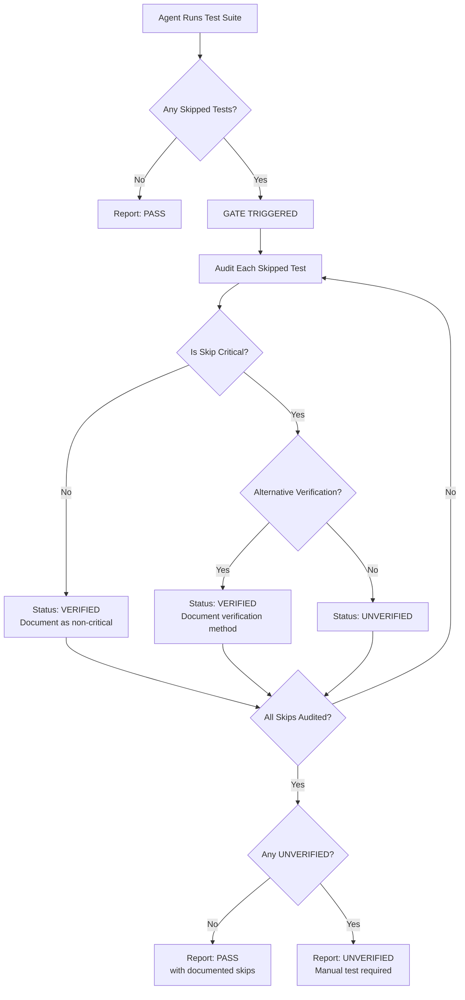

# 081 - Feature: Skipped Test Gate - Mandatory Audit Before Claiming Tests Pass

<!-- Template Metadata
Last Updated: 2025-01-XX
Updated By: Issue #81 implementation
Update Reason: Initial LLD creation for skipped test audit gate
-->

## 1. Context & Goal
* **Issue:** #81
* **Objective:** Prevent agents from claiming "tests pass" when skipped tests cover critical unverified functionality
* **Status:** Draft
* **Related Issues:** Talos PR #72 (original failure), Talos Issue #73 (post-mortem)

### Open Questions

- [x] Should the gate apply to ALL skipped tests or only explicitly marked "critical" ones? **Resolved: All skipped tests must be audited; agent determines criticality during audit**
- [x] How do we define "critical" for MVP without automated tagging? **Resolved: Agent judgment based on whether skip covers the primary feature being delivered**

## 2. Proposed Changes

*This section is the **source of truth** for implementation. Describes exactly what will be built.*

### 2.1 Files Changed

| File | Change Type | Description |
|------|-------------|-------------|
| `CLAUDE.md` | Modify | Add SKIPPED TEST GATE section under testing rules |
| `docs/adr/0081-skipped-test-gate.md` | Add | Document rationale and implementation decision |
| `docs/0003-file-inventory.md` | Modify | Add new ADR to inventory |
| `docs/reports/081/implementation-report.md` | Add | Implementation completion report |
| `docs/reports/081/test-report.md` | Add | Test verification report |

### 2.2 Dependencies

*No new packages, APIs, or services required.*

```toml
# No pyproject.toml additions - this is a documentation/process change only
```

### 2.3 Data Structures

```python
# Conceptual structure for audit output (documentation format, not code)
SkippedTestAudit = {
    "test_name": str,           # Name of the skipped test
    "verifies": str,            # What functionality it tests
    "skip_reason": str,         # Why the test was skipped
    "critical": bool,           # Whether this is critical functionality
    "alt_verification": str,    # Alternative verification method or "NONE"
    "status": "VERIFIED" | "UNVERIFIED"  # Final audit status
}
```

### 2.4 Function Signatures

*N/A - This is a process/documentation change, not a code implementation. The "function" is the agent's behavioral protocol defined in CLAUDE.md.*

### 2.5 Logic Flow (Pseudocode)

```
1. Agent runs test suite
2. IF test output contains "skipped" tests:
   a. TRIGGER skipped test gate
   b. FOR EACH skipped test:
      i.   Identify what functionality the test verifies
      ii.  Determine why the test was skipped
      iii. Assess if functionality is critical (core to feature being delivered)
      iv.  IF critical:
           - Check if alternative verification was performed
           - IF no alternative: status = UNVERIFIED
           - ELSE: status = VERIFIED (document method)
      v.   ELSE (non-critical):
           - status = VERIFIED (document as non-critical)
   c. OUTPUT audit block in specified format
   d. IF ANY test has status = UNVERIFIED:
      - NEVER claim "tests pass"
      - Report as UNVERIFIED
      - Recommend manual verification before merge
3. ELSE (no skipped tests):
   - Report tests as PASS normally
```

### 2.6 Technical Approach

* **Module:** N/A - Process documentation in `CLAUDE.md`
* **Pattern:** Behavioral Gate Pattern (soft enforcement via documented rules)
* **Key Decisions:** 
  - MVP uses soft gate (CLAUDE.md rules) rather than hard gate (wrapper script)
  - Agent determines criticality based on context (feature being delivered)
  - Audit output must be in test results, not just agent thinking

### 2.7 Architecture Decisions

| Decision | Options Considered | Choice | Rationale |
|----------|-------------------|--------|-----------|
| Enforcement mechanism | Hard gate (script), Soft gate (CLAUDE.md) | Soft gate | Faster to implement, sufficient for MVP, can upgrade later |
| Criticality determination | Automated tags, Agent judgment | Agent judgment | No framework changes needed, context-aware assessment |
| Audit visibility | Agent thinking only, Explicit output | Explicit output | Ensures audit is documented and reviewable |

**Architectural Constraints:**
- Must work with any test framework (pytest, playwright, jest, etc.)
- Cannot require changes to CI pipeline for MVP
- Must be framework-agnostic (parses test output patterns)

## 3. Requirements

*What must be true when this is done. These become acceptance criteria.*

1. CLAUDE.md contains SKIPPED TEST GATE rule with exact audit format
2. Gate triggers after ANY test run with skipped tests
3. Agent audits each skipped test before claiming success
4. Critical skipped tests without alternative verification show UNVERIFIED status
5. Audit output includes: test name, what it verifies, skip reason, criticality, verification status
6. Agent NEVER uses phrase "tests pass" when critical functionality is unverified
7. The exact failure mode from Talos #73 would be caught (Firefox extension skip → UNVERIFIED)

## 4. Alternatives Considered

| Option | Pros | Cons | Decision |
|--------|------|------|----------|
| **Soft gate via CLAUDE.md** | Fast to implement, no tooling changes, framework-agnostic | Relies on agent compliance, no CI enforcement | **Selected** |
| Hard gate via wrapper script | Enforced at runtime, blocks CI | Requires implementation per framework, delays MVP | Rejected (future) |
| Test framework configuration | Native integration, automatic tagging | Framework-specific, requires codebase changes | Rejected (out of scope) |
| CI pipeline integration | Blocks PRs automatically | Requires pipeline changes, complex setup | Rejected (out of scope) |

**Rationale:** Soft gate provides immediate protection against the failure mode identified in Talos #73 without requiring tooling changes. Can be upgraded to hard gate in future issue.

## 5. Data & Fixtures

### 5.1 Data Sources

| Attribute | Value |
|-----------|-------|
| Source | Test runner output (stdout/stderr) |
| Format | Text output from pytest, playwright, jest, etc. |
| Size | Typically < 10KB per test run |
| Refresh | Real-time (each test execution) |
| Copyright/License | N/A - agent-generated output |

### 5.2 Data Pipeline

```
Test Runner ──stdout──► Agent Parsing ──audit──► SKIPPED TEST AUDIT block ──report──► User
```

### 5.3 Test Fixtures

| Fixture | Source | Notes |
|---------|--------|-------|
| Sample test output with skips | Generated | Used to verify audit format in documentation |
| Talos #73 scenario recreation | Historical | Reference case for regression testing |

### 5.4 Deployment Pipeline

Documentation changes deploy immediately on merge to main branch.

**If data source is external:** N/A - no external data sources.

## 6. Diagram

### 6.1 Mermaid Quality Gate

Before finalizing any diagram, verify in [Mermaid Live Editor](https://mermaid.live) or GitHub preview:

- [x] **Simplicity:** Similar components collapsed (per 0006 §8.1)
- [x] **No touching:** All elements have visual separation (per 0006 §8.2)
- [x] **No hidden lines:** All arrows fully visible (per 0006 §8.3)
- [x] **Readable:** Labels not truncated, flow direction clear
- [ ] **Auto-inspected:** Agent rendered via mermaid.ink and viewed (per 0006 §8.5)

**Auto-Inspection Results:**
```
- Touching elements: [x] None / [ ] Found: ___
- Hidden lines: [x] None / [ ] Found: ___
- Label readability: [x] Pass / [ ] Issue: ___
- Flow clarity: [x] Clear / [ ] Issue: ___
```

### 6.2 Diagram



## 7. Security & Safety Considerations

### 7.1 Security

| Concern | Mitigation | Status |
|---------|------------|--------|
| N/A | This is a process gate, no security implications | N/A |

### 7.2 Safety

| Concern | Mitigation | Status |
|---------|------------|--------|
| False confidence in test coverage | Gate forces explicit audit of all skips | Addressed |
| Critical bugs reaching production | UNVERIFIED status blocks premature merge claims | Addressed |
| Audit bypass through agent error | Explicit output format makes bypass visible in review | Addressed |

**Fail Mode:** Fail Closed - If agent cannot determine criticality, default to UNVERIFIED

**Recovery Strategy:** Human reviewer can override agent assessment during PR review

## 8. Performance & Cost Considerations

### 8.1 Performance

| Metric | Budget | Approach |
|--------|--------|----------|
| Audit time | < 30s per skipped test | Simple text analysis, no API calls |
| Memory | Negligible | No data structures beyond test output |
| API Calls | 0 | Local analysis only |

**Bottlenecks:** None - this is a lightweight documentation/process change

### 8.2 Cost Analysis

| Resource | Unit Cost | Estimated Usage | Monthly Cost |
|----------|-----------|-----------------|--------------|
| Agent tokens | Included | ~100 tokens per audit | $0 (marginal) |

**Cost Controls:**
- N/A - No meaningful cost impact

**Worst-Case Scenario:** Even with 100 skipped tests, audit overhead is minimal (text analysis)

## 9. Legal & Compliance

| Concern | Applies? | Mitigation |
|---------|----------|------------|
| PII/Personal Data | No | Test output does not contain PII |
| Third-Party Licenses | No | No external dependencies |
| Terms of Service | No | No API usage |
| Data Retention | No | Audit output is transient |
| Export Controls | No | Documentation only |

**Data Classification:** Internal (process documentation)

**Compliance Checklist:**
- [x] No PII stored without consent - N/A
- [x] All third-party licenses compatible - N/A
- [x] External API usage compliant - N/A
- [x] Data retention policy documented - N/A

## 10. Verification & Testing

*Ref: [0005-testing-strategy-and-protocols.md](0005-testing-strategy-and-protocols.md)*

**Testing Philosophy:** This is a process/documentation change. Verification is through observed agent behavior during test runs.

### 10.1 Test Scenarios

| ID | Scenario | Type | Input | Expected Output | Pass Criteria |
|----|----------|------|-------|-----------------|---------------|
| 010 | Test run with no skips | Manual | Test output: "18 passed" | Report: PASS | No gate triggered, normal pass report |
| 020 | Test run with non-critical skip | Manual | Test output: "17 passed, 1 skipped" (locale test) | Audit block showing VERIFIED | Audit produced, non-critical documented |
| 030 | Test run with critical unverified skip | Manual | Test output: "17 passed, 1 skipped" (core feature test) | Audit block showing UNVERIFIED | NEVER says "tests pass", recommends manual test |
| 040 | Test run with critical verified skip | Manual | Test output + manual verification performed | Audit block showing VERIFIED | Documents manual verification method |
| 050 | Talos #73 regression | Manual | Firefox extension loading test skipped | UNVERIFIED status | Would have caught original failure |

### 10.2 Test Commands

```bash
# Verification is observational - run any test suite with skipped tests
# and verify agent produces SKIPPED TEST AUDIT block

# Example: Run pytest with a known skipped test
poetry run pytest tests/ -v  # Observe if agent audits any skips
```

### 10.3 Manual Tests (Only If Unavoidable)

| ID | Scenario | Why Not Automated | Steps |
|----|----------|-------------------|-------|
| 010-050 | All scenarios | Agent behavioral verification requires human observation of agent output | 1. Set up test scenario<br>2. Have agent run tests<br>3. Verify audit block appears<br>4. Verify correct status reported |

*Full test results recorded in Implementation Report (0103) or Test Report (0113).*

## 11. Risks & Mitigations

| Risk | Impact | Likelihood | Mitigation |
|------|--------|------------|------------|
| Agent ignores CLAUDE.md rules | High | Low | Audit output is visible in review; add to pre-merge checklist |
| Incorrect criticality assessment | Med | Med | Default to UNVERIFIED when uncertain; human review catches errors |
| Audit fatigue (too many skips) | Low | Low | Document skip reduction as separate improvement opportunity |
| Rule becomes stale/forgotten | Med | Med | Reference in testing sections; periodic CLAUDE.md audits |

## 12. Definition of Done

### Code
- [ ] N/A - This is a documentation/process change

### Tests
- [ ] Manual verification that gate triggers on skipped tests
- [ ] Manual verification that audit format matches specification
- [ ] Manual verification that UNVERIFIED status appears for critical skips

### Documentation
- [ ] SKIPPED TEST GATE rule added to CLAUDE.md
- [ ] ADR created at `docs/adr/0081-skipped-test-gate.md`
- [ ] `docs/0003-file-inventory.md` updated with new files
- [ ] Implementation Report completed at `docs/reports/081/implementation-report.md`
- [ ] Test Report completed at `docs/reports/081/test-report.md`

### Review
- [ ] Code review completed
- [ ] User approval before closing issue

---

## Appendix A: CLAUDE.md Addition

The following section will be added to CLAUDE.md under the testing section:

```markdown
### SKIPPED TEST GATE (MANDATORY)

After ANY test run with skipped tests, you MUST perform this audit before reporting results:

1. **AUDIT each skipped test:**
   - What does this test verify?
   - Why was it skipped?
   - Is this critical functionality (core to the feature being delivered)?

2. **Determine status for each skip:**
   - If non-critical: Status = VERIFIED (document as non-critical)
   - If critical AND verified another way: Status = VERIFIED (document method)
   - If critical AND NOT verified: Status = UNVERIFIED

3. **If ANY test has UNVERIFIED status:**
   - NEVER say "tests pass"
   - Report overall status as UNVERIFIED
   - Recommend manual verification before merge

4. **Required output format (must appear in your response, not just thinking):**

```
SKIPPED TEST AUDIT:
- [SKIPPED] "{test name}"
  - Verifies: {what functionality it tests}
  - Skip reason: {why the test was skipped}
  - Critical: YES/NO
  - Alt verification: {method used or NONE}
  - Status: VERIFIED/UNVERIFIED

OVERALL: {PASS with N documented skips / UNVERIFIED - manual test required}
```

**Example - Critical Unverified (BLOCKS):**
```
SKIPPED TEST AUDIT:
- [SKIPPED] "test_firefox_extension_loading"
  - Verifies: Extension loads correctly in Firefox
  - Skip reason: Firefox not available in CI environment
  - Critical: YES (Firefox support is the feature being delivered)
  - Alt verification: NONE
  - Status: UNVERIFIED

OVERALL: UNVERIFIED - manual test required before merge
```

**Example - Non-Critical (PASSES):**
```
SKIPPED TEST AUDIT:
- [SKIPPED] "test_date_format_ja_JP"
  - Verifies: Date formatting in Japanese locale
  - Skip reason: ja_JP locale not installed in CI
  - Critical: NO (feature does not involve localization)
  - Alt verification: N/A (non-critical)
  - Status: VERIFIED

OVERALL: PASS with 1 documented skip
```
```

---

## Appendix B: Review Log

*Track all review feedback with timestamps and implementation status.*

### Review Summary

| Review | Date | Verdict | Key Issue |
|--------|------|---------|-----------|
| - | - | - | Awaiting initial review |

**Final Status:** PENDING