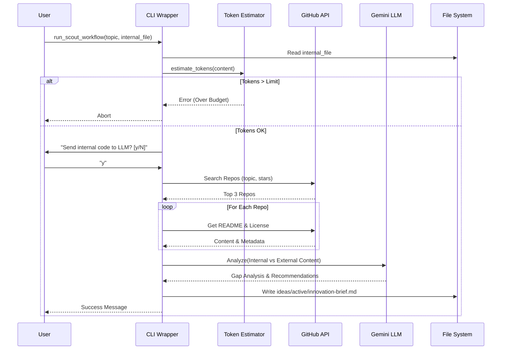

# 193 - Feature: The Scout: External Intelligence Gathering Workflow

## 1. Context & Goal
* **Issue:** #93
* **Objective:** Create a proactive research workflow that searches GitHub for best practices, analyzes top implementations, compares them against internal code, and produces an "Innovation Brief" to identify technical debt.
* **Status:** Draft
* **Related Issues:** N/A (Foundational Feature)

### Open Questions
* **Search Depth:** Should the GitHub search look at file contents or just repository metadata/READMEs initially? *Assumption: Repository metadata + README + file tree for file selection.*
* **Binary Files:** How to handle repositories where core logic is compiled or in binary formats? *Assumption: Focus on Python text files as per "Multi-language support" out-of-scope note.*

## 2. Proposed Changes

### 2.1 Files Changed
| File Path | Description |
|-----------|-------------|
| `agentos/workflows/scout/__init__.py` | Package initialization. |
| `agentos/workflows/scout/graph.py` | Defines the LangGraph state machine (nodes and edges). |
| `agentos/workflows/scout/nodes.py` | Implementation of Explorer, Extractor, Analyst, and Scribe nodes. |
| `agentos/workflows/scout/prompts.py` | Prompts for gap analysis and brief generation. |
| `agentos/workflows/scout/templates.py` | Jinja2 or string templates for the Innovation Brief. |
| `agentos/workflows/scout/token_estimator.py` | Logic for estimating token usage before execution. |
| `tools/run_scout_workflow.py` | CLI entry point handling args, warnings, and graph invocation. |
| `agentos/workflows/__init__.py` | Registration of the scout workflow. |
| `docs/0003-file-inventory.md` | Update file inventory. |

### 2.2 Dependencies
* **PyGithub** (New): For interacting with GitHub Search and Content APIs.
* **tiktoken** (New): For accurate token estimation before LLM calls.
* **langgraph** (Existing): For workflow orchestration.
* **google-generativeai** (Existing): For LLM analysis.

### 2.3 Data Structures

**`agentos/workflows/scout/graph.py`**

```python
from typing import TypedDict, List, Optional

class ExternalRepo(TypedDict):
    name: str
    url: str
    stars: int
    description: str
    license: str  # e.g., "MIT", "Apache-2.0"
    content_summary: str  # Summarized README/Architecture
    key_files_content: str # Concatenated key code snippets

class ScoutState(TypedDict):
    topic: str
    internal_file_path: Optional[str]
    internal_code_content: Optional[str]
    min_stars: int
    found_repos: List[ExternalRepo]
    gap_analysis: Optional[str]
    final_brief: str
    errors: List[str]
```

### 2.4 Function Signatures

**`agentos/workflows/scout/nodes.py`**

```python
def explorer_node(state: ScoutState) -> ScoutState:
    """
    Searches GitHub for repositories matching 'topic' with > min_stars.
    Updates 'found_repos' with metadata (name, url, stars).
    """
    pass

def extractor_node(state: ScoutState) -> ScoutState:
    """
    For top 3 repos in state, fetches README and License via GitHub API.
    Updates 'found_repos' with 'content_summary' and 'license'.
    """
    pass

def gap_analyst_node(state: ScoutState) -> ScoutState:
    """
    Uses LLM to compare 'internal_code_content' vs 'found_repos'.
    Generates 'gap_analysis'. If no internal code, generates a general summary.
    """
    pass

def innovation_scribe_node(state: ScoutState) -> ScoutState:
    """
    Formats 'gap_analysis' and 'found_repos' into Markdown using templates.
    Updates 'final_brief'.
    """
    pass
```

**`agentos/workflows/scout/token_estimator.py`**

```python
def estimate_cost(internal_content: str, max_tokens: int) -> tuple[int, bool]:
    """
    Estimates token count for internal file + projected search results.
    Returns (estimated_count, is_within_budget).
    """
    pass
```

**`tools/run_scout_workflow.py`**

```python
def get_user_confirmation(filepath: str) -> bool:
    """
    Displays warning about sending 'filepath' to external LLM.
    Returns True if user confirms (y/Y), False otherwise.
    """
    pass
```

### 2.5 Logic Flow (Pseudocode)

**CLI Runner (`tools/run_scout_workflow.py`)**

```python
def main():
    args = parse_args() # topic, internal, min_stars, dry_run, format, max_tokens, yes
    
    # 1. Load Internal Code (if provided)
    internal_content = ""
    if args.internal:
        if not file_exists(args.internal):
            print_error("Internal file not found")
            return
        internal_content = read_file(args.internal)
        
        # 2. Token Estimation
        count, ok = estimate_cost(internal_content, args.max_tokens)
        if not ok:
            print_error(f"Estimated tokens {count} exceeds limit {args.max_tokens}")
            return
            
        # 3. Privacy Confirmation
        if not args.yes:
            if not get_user_confirmation(args.internal):
                print("Aborted.")
                return

    # 4. Initialize State
    initial_state = {
        "topic": args.topic,
        "internal_file_path": args.internal,
        "internal_code_content": internal_content,
        "min_stars": args.min_stars,
        "found_repos": [],
        "errors": []
    }

    # 5. Run Workflow
    if args.dry_run:
        print(f"Plan: Search GitHub for '{args.topic}', compare with '{args.internal}'")
        print(f"Estimated Cost: ${calculate_cost(count)}")
        return

    app = compile_scout_graph()
    result = app.invoke(initial_state)

    # 6. Output Generation
    if args.format == "json":
        print(json.dumps(result))
    else:
        filename = f"ideas/active/innovation-{slugify(args.topic)}.md"
        write_file(filename, result["final_brief"])
        print(f"Brief generated: {filename}")
```

**Graph Logic**
1. **Explorer:** `PyGithub.search_repositories(query=f"{topic} stars:>{min_stars}")`. Take top 3.
2. **Extractor:** Loop through repos. `repo.get_contents("README.md")`, `repo.get_license()`. 
3. **Analyst:** Construct Prompt: "Analyze these external patterns [Content]. Compare with internal code [Content]. Identify gaps in Complexity, Performance, Security."
4. **Scribe:** Fill Jinja template. Include "License: {license}" for each repo.

### 2.6 Technical Approach
* **LangGraph:** Selected for state management. Allows future expansion (e.g., "Loop until valid repo found" or "Deep dive" sub-graphs).
* **PyGithub:** Used over raw REST requests for robust handling of pagination and types.
* **Gemini 1.5 Flash:** Selected for high context window (handling large internal files + multiple READMEs) and low cost.
* **Privacy by Default:** The CLI wrapper acts as a gatekeeper, preventing the graph (and thus the LLM) from ever seeing internal code if the user declines.

## 3. Requirements

1.  **Search:** System must successfully query GitHub API and retrieve repos with >N stars.
2.  **License Extraction:** System must extract license type (MIT, GPL, etc.) for every analyzed repository.
3.  **Privacy Gate:** System must halt execution if `--internal` is used, `--yes` is missing, and user inputs 'n' or closes stream.
4.  **Token Budget:** System must calculate tokens via `tiktoken` and abort *before* LLM execution if `estimated > max_tokens`.
5.  **Output:** System must generate a Markdown file in `ideas/active/` containing a comparison and recommendations.
6.  **Accuracy:** Generated brief summary must match a "Golden Fixture" summary within 90% cosine similarity (automated test).
7.  **JSON Mode:** System must output raw state data when `--format json` is specified.

## 4. Alternatives Considered

| Alternative | Pros | Cons | Decision |
|-------------|------|------|----------|
| **Google Search vs GitHub API** | Google finds blogs/articles. | Harder to get structured code/license data. Rate limits on search. | **GitHub API** - Focus is on code implementation patterns. |
| **Local Diff vs LLM** | Cheap, exact. | Cannot compare *architectural patterns*, only text. | **LLM** - We need semantic comparison, not syntax diffs. |
| **Synchronous Script** | Simpler to write. | Hard to retry steps or add complex branching later. | **LangGraph** - Consistency with existing agentos architecture. |

## 5. Data & Fixtures

### 5.1 Data Sources
| Source | Type | Attributes Needed | Access Method |
|--------|------|-------------------|---------------|
| GitHub Search API | External | Name, URL, Stars, Description | `PyGithub` |
| GitHub Content API | External | README content, License metadata | `PyGithub` |
| Internal FS | Internal | Source code content | `open().read()` |

### 5.2 Data Pipeline
```ascii
[User] --(args)--> [CLI Wrapper] --(check)--> [Token/Privacy Gate]
                        |
                  [LangGraph State]
                        |
[Explorer Node] <--(query)--> [GitHub API]
      |
[Extractor Node] <--(fetch)--> [GitHub API]
      |
[Analyst Node] --(prompt)--> [Gemini LLM]
      |
[Scribe Node] --(formatting)--> [Markdown File]
```

### 5.3 Test Fixtures
| Fixture | Description | Usage |
|---------|-------------|-------|
| `tests/fixtures/mock_github_response.json` | JSON dump of PyGithub object attributes. | Unit testing Explorer/Extractor without network. |
| `tests/fixtures/golden-brief-summary.md` | A perfect summary for a known topic. | Cosine similarity testing for Analyst node quality. |

### 5.4 Deployment Pipeline
* **Development Only:** This tool is a developer utility. It does not deploy to production servers.
* **API Keys:** Requires `GITHUB_TOKEN` and `GOOGLE_API_KEY` in environment.

## 6. Diagram

### 6.1 Mermaid Quality Gate
- [x] Diagram exists
- [x] Syntax valid
- [x] Flows clearly defined

### 6.2 Diagram


## 7. Security Considerations

| Concern | Mitigation |
|---------|------------|
| **Source Code Leakage** | Internal code only sent to LLM after explicit user confirmation (interactive or `--yes`). |
| **API Key Exposure** | Keys read from ENV only. Never logged or written to disk. |
| **Prompt Injection** | Input topics are treated as strings, not executable code. Extracted external code is never executed, only analyzed textually. |
| **Path Traversal** | Output filenames are sanitized (slugified) and forced to `ideas/active/` directory. |

## 8. Performance Considerations

| Metric | Budget | Handling Strategy |
|--------|--------|-------------------|
| **Max Tokens** | 30,000 | Hard stop via `TokenEstimator` before LLM call. |
| **Execution Time** | < 60s | Use Gemini Flash (fast). GitHub API timeouts set to 10s. |
| **Rate Limits** | 5000/hr (GH) | Exponential backoff logic in Explorer node. |

## 9. Risks & Mitigations

| Risk | Impact | Likelihood | Mitigation |
|------|--------|------------|------------|
| **LLM Hallucination** | Brief cites non-existent features. | Medium | Prompt instructs to quote specific lines. Links provided to repo. |
| **Empty Search Results** | Workflow fails / useless brief. | Low | Fallback message suggesting broader search terms. |
| **Rate Limit Hit** | Workflow crashes. | Medium | Catch 403 errors, sleep/retry up to 3 times, then degrade gracefully. |

## 10. Verification & Testing

### 10.1 Test Scenarios
| ID | Scenario | Type | Input | Output | Criteria |
|----|----------|------|-------|--------|----------|
| T1 | Happy Path | Integration | Topic="async", Internal="core/state.py" | `.md` file created | File exists, contains external repo links. |
| T2 | Privacy Decline | Unit | `--internal file.py`, Input="n" | Stdout | "Aborted" message, no API calls made. |
| T3 | Token Exceeded | Unit | `--max-tokens 100`, Internal=LargeFile | Stderr | "Estimated tokens X exceeds limit 100". |
| T4 | No Internal | Integration | Topic="patterns" | `.md` file created | Brief contains research but "Gap Analysis" section is generic. |
| T5 | JSON Format | System | `--format json` | JSON to Stdout | Valid JSON structure, no Markdown file. |

### 10.2 Test Commands
```bash
# Unit Tests
pytest tests/workflows/scout/

# Integration Test (Happy Path)
python tools/run_scout_workflow.py --topic "python dependency injection" --internal agentos/container.py --yes --dry-run

# Mocked Similarity Test
pytest tests/workflows/scout/test_brief_similarity.py
```

### 10.3 Manual Tests
| ID | Description |
|----|-------------|
| M1 | Verify colors/formatting of CLI warning prompt. |
| M2 | Verify "License" field appears correctly in generated Markdown for a known MIT repo. |

## 11. Definition of Done

### Code
- [ ] `agentos/workflows/scout/` module created with all nodes.
- [ ] `tools/run_scout_workflow.py` implemented with argparse and warnings.
- [ ] License extraction logic working via PyGithub.
- [ ] Token estimator implemented using `tiktoken`.

### Tests
- [ ] Unit tests for all nodes (>80% coverage).
- [ ] Mocked integration tests for graph flow.
- [ ] Golden fixture test passing for summary quality.

### Documentation
- [ ] `docs/0003-file-inventory.md` updated.
- [ ] Wiki updated with "The Scout" usage guide.
- [ ] README updated.

### Review
- [ ] Security review (Data transmission logic).
- [ ] Code review.

---

## Appendix: Review Log

### Review Summary

| Review | Date | Verdict | Key Issue |
|--------|------|---------|-----------|
| - | - | - | - |

**Final Status:** DRAFT - PENDING REVIEW