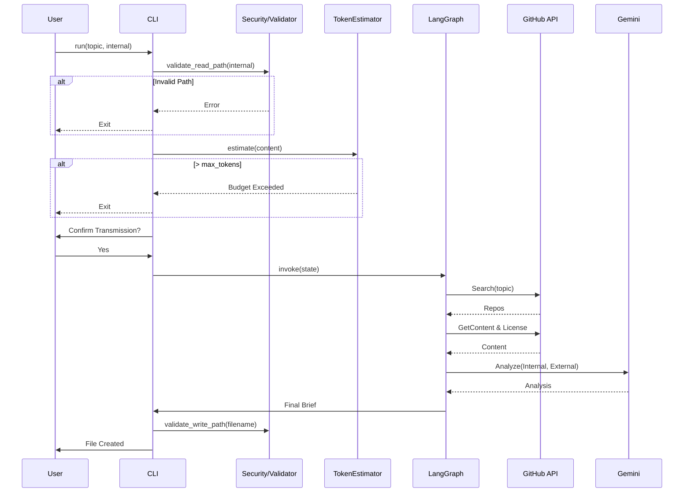

# 93 - Feature: The Scout: External Intelligence Gathering Workflow

## 1. Context & Goal
* **Issue:** #93
* **Objective:** Create a proactive research workflow that searches GitHub for best practices, analyzes top implementations, compares them against internal code, and produces an "Innovation Brief" to identify gaps.
* **Status:** Draft
* **Related Issues:** None - Foundational Feature.

### Open Questions
* **Tokenizer Compatibility:** The issue suggests `tiktoken` (OpenAI-based) for Gemini (Google-based) cost estimation. While `google-generativeai` has a `count_tokens` API, it incurs network latency.
    *   *Decision:* We will use `tiktoken` with the `cl100k_base` encoding as a local, high-speed approximation, applying a 10% safety buffer to the count to account for vocabulary differences before checking against the limit.
* **File System Safety:** How to ensure the tool doesn't read sensitive files outside the source tree or write reports to arbitrary locations?
    *   *Decision:* Implement strict path validation utilities (`validate_read_path`, `validate_write_path`) to enforce confinement to the project root and `ideas/active/` directory respectively.

## 2. Proposed Changes

### 2.1 Files Changed
| File Path | Description |
|-----------|-------------|
| `agentos/workflows/scout/__init__.py` | Package initialization. |
| `agentos/workflows/scout/graph.py` | Defines LangGraph nodes and edges. |
| `agentos/workflows/scout/nodes.py` | Implementation of Explorer, Extractor, Analyst, and Scribe logic. |
| `agentos/workflows/scout/prompts.py` | Prompts for Gemini analysis. |
| `agentos/workflows/scout/templates.py` | Markdown templates for Innovation Briefs. |
| `agentos/workflows/scout/token_estimator.py` | Logic for local token estimation with safety buffers. |
| `agentos/workflows/scout/security.py` | **NEW**: Path validation logic to enforce file system boundaries. |
| `tools/run_scout_workflow.py` | CLI entry point with argument parsing and user confirmation. |
| `agentos/workflows/__init__.py` | Registration of the scout workflow. |
| `docs/0003-file-inventory.md` | Inventory update. |

### 2.2 Dependencies
* **PyGithub**: For GitHub Search and Content API interactions.
* **tiktoken**: For local, offline token estimation.
* **google-generativeai**: Existing dependency for LLM interactions.
* **langgraph**: Existing dependency for workflow orchestration.

### 2.3 Data Structures

**`agentos/workflows/scout/graph.py`**

```python
from typing import TypedDict, List, Optional

class ExternalRepo(TypedDict):
    name: str           # "owner/repo"
    url: str            # html_url
    stars: int
    description: str
    license_type: str   # e.g., "MIT", "Apache-2.0", "Unknown"
    readme_summary: str # Summarized content
    code_snippets: str  # Relevant code content

class ScoutState(TypedDict):
    topic: str
    internal_file_path: Optional[str]
    internal_code_content: Optional[str]
    min_stars: int
    found_repos: List[ExternalRepo]
    gap_analysis: Optional[str]
    final_brief: str
    errors: List[str]
```

### 2.4 Function Signatures

**`agentos/workflows/scout/security.py`**

```python
def validate_read_path(path: str, base_dir: str = ".") -> str:
    """
    Validates that 'path' exists and is strictly within 'base_dir'.
    Prevents path traversal (e.g., ../../../etc/passwd).
    Returns absolute path if valid, raises ValueError otherwise.
    """
    pass

def validate_write_path(filename: str, output_dir: str = "ideas/active") -> str:
    """
    Validates that 'filename' results in a path strictly within 'output_dir'.
    Sanitizes filename to remove dangerous characters.
    Returns absolute path if valid, raises ValueError otherwise.
    """
    pass
```

**`agentos/workflows/scout/token_estimator.py`**

```python
def estimate_tokens(text: str, model: str = "gemini-1.5-flash") -> int:
    """
    Uses tiktoken (cl100k_base) to estimate token count.
    Applies a 1.1x multiplier buffer to account for Gemini tokenizer differences.
    """
    pass

def check_budget(estimated_tokens: int, limit: int) -> bool:
    """Returns True if estimated_tokens <= limit."""
    pass
```

**`agentos/workflows/scout/nodes.py`**

```python
def explorer_node(state: ScoutState) -> ScoutState:
    """
    Queries GitHub API for 'topic' with stars > min_stars.
    Populates state['found_repos'] with metadata (name, url, stars).
    Handles rate limiting with exponential backoff.
    """
    pass

def extractor_node(state: ScoutState) -> ScoutState:
    """
    Fetches README and License for each repo in state['found_repos'].
    Populates 'readme_summary' and 'license_type'.
    """
    pass

def gap_analyst_node(state: ScoutState) -> ScoutState:
    """
    Constructs prompt with internal code (if present) and external summaries.
    Invokes Gemini to generate gap analysis and recommendations.
    """
    pass

def scribe_node(state: ScoutState) -> ScoutState:
    """
    Formats the final Markdown brief using Jinja2 templates.
    Populates state['final_brief'].
    """
    pass
```

### 2.5 Logic Flow (Pseudocode)

**CLI (`tools/run_scout_workflow.py`)**

```python
def main():
    args = parse_arguments()
    
    # 1. Path Safety & Content Loading
    internal_content = None
    if args.internal:
        try:
            safe_path = security.validate_read_path(args.internal)
            internal_content = read_file(safe_path)
        except ValueError as e:
            print_error(f"Security Error: {e}")
            return

    # 2. Token Budget Enforcement
    estimated_cost = token_estimator.estimate_tokens(internal_content or "")
    # Add buffer for search results (approx 5000 tokens per run)
    total_estimate = estimated_cost + 5000 
    
    if args.dry_run:
        print(f"Plan: Search '{args.topic}'")
        print(f"Est. Tokens: {total_estimate} (Limit: {args.max_tokens})")
        return

    if total_estimate > args.max_tokens:
        print_error(f"Budget Exceeded: {total_estimate} > {args.max_tokens}")
        return

    # 3. Privacy Confirmation
    if args.internal and not args.yes:
        warn_user_data_transmission(args.internal)
        if not get_user_confirmation():
            print("Aborted.")
            return

    # 4. Graph Execution
    state = {
        "topic": args.topic,
        "internal_file_path": args.internal,
        "internal_code_content": internal_content,
        "min_stars": args.min_stars or 500,
        ...
    }
    
    final_state = workflow_graph.invoke(state)

    # 5. Output
    if args.format == "json":
        print_json(final_state)
    else:
        filename = f"innovation-{slugify(args.topic)}.md"
        safe_out = security.validate_write_path(filename)
        write_file(safe_out, final_state["final_brief"])
        print(f"Brief written to {safe_out}")
```

### 2.6 Technical Approach
*   **Module Location:** `agentos/workflows/scout/`
*   **Design Pattern:** Chain of Responsibility (implemented via LangGraph state machine).
*   **Safety Handling:**
    *   **File Isolation:** `security.py` strictly enforces that inputs come from the project and outputs go to `ideas/active/`.
    *   **Token Safety:** `token_estimator.py` acts as a pre-flight check to prevent accidental high-cost queries.
    *   **Privacy:** CLI wrapper enforces explicit opt-in for data transmission.

## 3. Requirements
1.  **Repository Search:** Must retrieve repositories > 500 stars matching the topic via GitHub API.
2.  **License Capture:** Must extract the license SPDX identifier (e.g., "MIT") for every external repository.
3.  **Strict Path Validation:** Must reject file paths containing `..` or pointing outside the project root.
4.  **Token Budgeting:** Must estimate tokens using a local tokenizer and abort if `(internal + buffer) > max_tokens`.
5.  **Data Privacy:** Must require interactive confirmation (or `--yes` flag) before sending internal code to LLM.
6.  **Output Generation:** Must produce a valid Markdown file in `ideas/active/` or valid JSON to stdout.
7.  **Rate Limit Handling:** Must automatically retry on GitHub 403 errors (backoff max 3 times).

## 4. Alternatives Considered

| Alternative | Pros | Cons | Decision |
|-------------|------|------|----------|
| **Google `count_tokens` API** | 100% accurate for Gemini. | Adds network latency and dependency on API uptime for pre-checks. | **Local `tiktoken`** - Faster, enables offline checks, sufficient accuracy with buffer. |
| **Direct REST API for GitHub** | Zero dependencies. | Complex pagination, auth, and type handling. | **PyGithub** - Robust, typed, handles pagination automatically. |
| **Output to current dir** | Flexible. | Clutters repo, risk of overwriting code. | **Fixed `ideas/active/`** - Enforces organization and safety. |

## 5. Data & Fixtures

### 5.1 Data Sources
| Source | Type | Attributes |
|--------|------|------------|
| **Internal Code** | File | Content, Path |
| **GitHub Search** | API | Repo Name, Stars, URL |
| **GitHub Content** | API | README.md, LICENSE, File Tree |

### 5.2 Data Pipeline
```ascii
[CLI Input] -> [Path Validator] -> [Token Estimator] -> [Confirmer]
                                         |
                                         v
[LangGraph] -> [GitHub API (Search)] -> [GitHub API (Content)]
                                         |
                                         v
                                  [Gemini LLM]
                                         |
                                         v
[Markdown Generator] -> [Path Validator] -> [File System]
```

### 5.3 Test Fixtures
| Fixture | Description |
|---------|-------------|
| `tests/fixtures/scout/github_search_response.json` | Mocked search results. |
| `tests/fixtures/scout/github_content_response.json` | Mocked README/License. |
| `tests/fixtures/golden-brief-summary.md` | Expected summary for similarity testing. |

### 5.4 Deployment Pipeline
*   **Development Only:** Run via `python tools/run_scout_workflow.py`.
*   **Environment:** Requires `GITHUB_TOKEN` and `GOOGLE_API_KEY`.

## 6. Diagram

### 6.1 Mermaid Quality Gate
- [x] Diagram exists
- [x] Flows clearly defined
- [x] Includes Safety/Security checks

### 6.2 Diagram


## 7. Security Considerations

| Concern | Mitigation |
|---------|------------|
| **Path Traversal** | `security.validate_read_path` and `validate_write_path` ensure operations are confined to project root and `ideas/active/`. |
| **Internal Code Leakage** | Explicit user confirmation required. HTTPS encryption. No external persistence. |
| **Token Exhaustion** | Strict pre-flight estimation checks against `--max-tokens` before any API calls. |
| **API Key Safety** | Keys read from ENV. Not accepted as CLI args. |

## 8. Performance Considerations

| Metric | Budget | Strategy |
|--------|--------|----------|
| **Analysis Latency** | < 60s | Use Gemini 1.5 Flash (fast tier). |
| **Token Usage** | < 30k/run | Filter GitHub READMEs to max 8k chars each. |
| **API Rate Limits** | 5000/hr | Implement exponential backoff for GitHub API calls. |

## 9. Risks & Mitigations

| Risk | Impact | Likelihood | Mitigation |
|------|--------|------------|------------|
| **Tokenizer Mismatch** | Estimate is lower than actual, causing API error. | Low | Apply 1.1x safety buffer to local `tiktoken` estimate. |
| **GitHub API Rate Limit** | Workflow fails mid-research. | Medium | Use authenticated client (`GITHUB_TOKEN`) and retry logic. |
| **Empty Search Results** | Useless report. | Low | CLI warning if < 3 repos found; suggest query refinement. |

## 10. Verification & Testing

### 10.1 Test Scenarios
| ID | Scenario | Type | Input | Output | Criteria |
|----|----------|------|-------|--------|----------|
| T1 | Happy Path | Integ | `topic="async", internal="agentos/core.py"` | `.md` file | File created in `ideas/active/`, contains License info. |
| T2 | Path Attack | Unit | `internal="../../../etc/passwd"` | Error | `ValueError` from validator. |
| T3 | Token Budget | Unit | `max_tokens=100`, `internal=large.py` | Error | "Budget Exceeded" message. |
| T4 | No Confirmation | E2E | `internal=foo.py`, input="n" | Exit | "Aborted" message, no Graph invocation. |
| T5 | JSON Output | System | `--format json` | JSON | Valid JSON to stdout. |

### 10.2 Test Commands
```bash
# Path Validation Test
pytest tests/workflows/scout/test_security.py

# Token Estimator Test
pytest tests/workflows/scout/test_token_estimator.py

# Full Workflow Test
python tools/run_scout_workflow.py --topic "cache patterns" --internal agentos/core/state.py --yes --dry-run
```

### 10.3 Manual Tests (Only If Unavoidable)
| ID | Description |
|----|-------------|
| M1 | Run without `--yes` and manually decline the confirmation prompt to ensure immediate exit. |

## 11. Definition of Done

### Code
- [ ] `agentos/workflows/scout/` package implemented.
- [ ] `security.py` implemented with strict path checking.
- [ ] `token_estimator.py` implemented with `tiktoken` and safety buffer.
- [ ] CLI tool functional with all flags.

### Tests
- [ ] Unit tests for `security.py` cover traversal attempts.
- [ ] Unit tests for `token_estimator.py` cover boundary conditions.
- [ ] Integration tests use mocked GitHub responses.

### Documentation
- [ ] `docs/0003-file-inventory.md` updated.
- [ ] Wiki updated with "The Scout" instructions.

### Review
- [ ] Security Review passed (Path validation).
- [ ] Code Review passed.

---

## Appendix: Review Log

### Review Summary

| Review | Date | Verdict | Key Issue |
|--------|------|---------|-----------|
| - | - | - | - |

**Final Status:** DRAFT - PENDING REVIEW