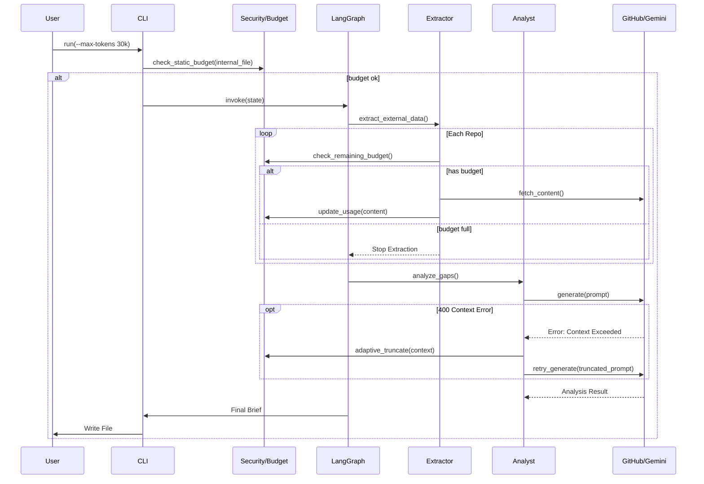

# 93 - Feature: The Scout: External Intelligence Gathering Workflow

## 1. Context & Goal
* **Issue:** #93
* **Objective:** Create a proactive research workflow that searches GitHub for best practices, analyzes top implementations, compares them against internal code, and produces an "Innovation Brief" to identify gaps.
* **Status:** Draft
* **Related Issues:** None - Foundational Feature.

### Open Questions
* **Tokenizer Mismatch Risk:** `tiktoken` (OpenAI) is used for estimation, but Gemini (Google) is the execution model. Vocabulary differences can lead to underestimation and API failures.
    * *Decision:* Implement a **"Pessimistic Estimation + Adaptive Fallback"** strategy. We apply a 20% safety buffer to `tiktoken` counts. Crucially, we wrap the LLM invocation in a retry handler that catches `400 INVALID_ARGUMENT` (Context Length Exceeded), truncates the external context by 50%, and retries once automatically.
* **Observability:** How do we debug logic flows without inspecting massive log files?
    * *Decision:* Integrate **LangSmith** tracing via environment variables if available, and implement structured JSON logging to `logs/scout_execution.log` for local debugging.

## 2. Proposed Changes

### 2.1 Files Changed
| File Path | Description |
|-----------|-------------|
| `agentos/workflows/scout/__init__.py` | Package initialization. |
| `agentos/workflows/scout/graph.py` | Defines LangGraph nodes, edges, and compilation logic. |
| `agentos/workflows/scout/nodes.py` | Implementation of Explorer, Extractor, Analyst, and Scribe logic with dynamic budget checks. |
| `agentos/workflows/scout/prompts.py` | Prompts for Gemini analysis with injection safeguards. |
| `agentos/workflows/scout/templates.py` | Markdown templates for Innovation Briefs. |
| `agentos/workflows/scout/budget.py` | Dynamic token tracking logic and adaptive truncation strategies. |
| `agentos/workflows/scout/security.py` | Path validation logic, file existence checks, and content sanitization. |
| `agentos/workflows/scout/tracing.py` | **NEW**: Logging configuration and LangSmith callback wrappers. |
| `tools/run_scout_workflow.py` | CLI entry point with argument parsing, offline mode, and overwrite protection. |
| `agentos/workflows/__init__.py` | Registration of the scout workflow. |
| `docs/0003-file-inventory.md` | Inventory update. |

### 2.2 Dependencies
* **PyGithub**: For GitHub Search and Content API interactions.
* **tiktoken**: For local, offline token estimation.
* **google-generativeai**: Existing dependency for LLM interactions.
* **langgraph**: Existing dependency for workflow orchestration.
* **langsmith**: For optional trace observability.
* **tenacity**: For robust retry logic on API calls.

### 2.3 Data Structures

**`agentos/workflows/scout/graph.py`**

```python
from typing import TypedDict, List, Optional, Any

class ExternalRepo(TypedDict):
    name: str           # "owner/repo"
    url: str            # html_url
    stars: int
    description: str
    license_type: str   # e.g., "MIT", "Apache-2.0", "Unknown"
    readme_summary: str # Summarized content (truncated)
    code_snippets: str  # Relevant code content (truncated)

class ScoutState(TypedDict):
    topic: str
    internal_file_path: Optional[str]
    internal_code_content: Optional[str]
    min_stars: int
    max_tokens: int     # Budget limit
    current_token_usage: int # Running total
    found_repos: List[ExternalRepo]
    gap_analysis: Optional[str]
    final_brief: str
    errors: List[str]
    offline_mode: bool  # Flag for dev/testing
    trace_id: str       # UUID for observability
```

### 2.4 Function Signatures

**`agentos/workflows/scout/budget.py`**

```python
def check_and_update_budget(current_usage: int, new_text: str, limit: int) -> tuple[int, bool]:
    """
    Calculates token count of new_text using tiktoken.
    Applies 1.2x safety buffer factor internally to account for tokenizer mismatch.
    Returns (new_usage, is_within_limit).
    """
    pass

def adaptive_truncate(text: str, reduction_factor: float = 0.5) -> str:
    """
    Aggressively truncates text by reduction_factor (default 50%) to recover 
    from Context Window errors. Retains the beginning of the text (header/summary).
    """
    pass
```

**`agentos/workflows/scout/nodes.py`**

```python
def gap_analyst_node(state: ScoutState) -> ScoutState:
    """
    Compares internal vs external.
    Implements Adaptive Retry: If LLM raises ContextLengthExceeded, 
    calls budget.adaptive_truncate() on external context and retries once.
    """
    pass
```

**`agentos/workflows/scout/tracing.py`**

```python
def configure_tracing(enable_cloud: bool = False):
    """
    Configures local file logging and optional LangSmith tracing.
    Returns a callback handler list for LangGraph.
    """
    pass
```

### 2.5 Logic Flow (Pseudocode)

**CLI (`tools/run_scout_workflow.py`)**

```python
def main():
    args = parse_arguments() # includes --offline, --force, --verbose
    
    # 0. Observability Setup
    callbacks = tracing.configure_tracing(enable_cloud=os.getenv("LANGCHAIN_TRACING_V2"))

    # 1. Path Safety & Content Loading
    internal_content = None
    if args.internal:
        try:
            safe_path = security.validate_read_path(args.internal)
            internal_content = read_file(safe_path)
        except ValueError as e:
            print_error(f"Security Error: {e}")
            return

    # 2. Pre-flight Token Estimation (Static Check)
    # Using 1.2x buffer in count_tokens
    est_internal = budget.count_tokens(internal_content or "")
    if est_internal > args.max_tokens:
        print_error(f"Budget Exceeded. Internal file uses ~{est_internal} tokens (limit {args.max_tokens}).")
        return

    # 3. Privacy Confirmation
    if args.internal and not args.yes and not args.offline:
        warn_user_data_transmission(args.internal)
        if not get_user_confirmation():
            return

    # 4. Graph Execution
    state = {
        "topic": args.topic,
        "internal_code_content": internal_content,
        "max_tokens": args.max_tokens,
        "current_token_usage": est_internal, # Initial usage
        "offline_mode": args.offline,
        # ... other fields
    }
    
    final_state = workflow_graph.invoke(state, config={"callbacks": callbacks})

    # 5. Output with Overwrite Protection
    if args.format == "json":
        print_json(final_state)
    else:
        base_filename = f"innovation-{slugify(args.topic)}.md"
        safe_out = security.get_safe_write_path(base_filename, overwrite=args.force)
        write_file(safe_out, final_state["final_brief"])
        print(f"Brief written to {safe_out}")
```

**Gap Analyst Node (Adaptive Logic)**

```python
def gap_analyst_node(state):
    prompt = build_prompt(state['internal_code_content'], state['found_repos'])
    
    try:
        # Attempt 1
        analysis = llm.generate(prompt)
    except GoogleAPICallError as e:
        if "400" in str(e) or "INVALID_ARGUMENT" in str(e):
            logger.warning("Token limit hit despite estimation. Retrying with truncated context.")
            
            # Adaptive Fallback: Slash external context by 50%
            for repo in state['found_repos']:
                repo['readme_summary'] = budget.adaptive_truncate(repo['readme_summary'], 0.5)
                
            prompt = build_prompt(state['internal_code_content'], state['found_repos'])
            analysis = llm.generate(prompt) # Retry once, then fail hard
        else:
            raise e

    return {"gap_analysis": analysis}
```

### 2.6 Technical Approach
*   **Module Location:** `agentos/workflows/scout/`
*   **Design Pattern:** Chain of Responsibility (LangGraph).
*   **Observability:**
    *   **Tracing:** Uses `tracing.py` to inject standard logging and LangSmith hooks into the Graph execution config.
    *   **Logs:** All node transitions and API errors logged to `logs/scout.log`.
*   **Budgeting Strategy (Robust):**
    *   **Pessimistic Estimation:** `budget.py` uses a 1.2x multiplier on `tiktoken` counts.
    *   **Dynamic Check:** `Extractor` node stops fetching if budget fills.
    *   **Adaptive Fallback:** `GapAnalyst` node catches actual API 400 errors and retries with decimated context.
*   **Safety:**
    *   **File Isolation:** `security.py` strict boundaries.
    *   **Injection Defense:** XML fencing in prompts + sanitization of external text.

## 3. Requirements
1.  **Repository Search:** Retrieve repositories > 500 stars matching the topic via GitHub API (or fixtures in Offline mode).
2.  **License Capture:** Extract license SPDX identifier (e.g., "MIT") for every external repository.
3.  **Strict Path Validation:** Reject paths containing `..` or pointing outside the project root.
4.  **Overwrite Protection:** Do not overwrite existing briefs unless `--force` is used; otherwise append timestamp.
5.  **Offline Capability:** Support `--offline` flag to run workflow without network/cost using local data.
6.  **Dynamic Budget Enforcement:** Extractor node must stop or truncate content *during* execution if token limit is reached.
7.  **Adaptive Error Handling:** Automatically retry LLM calls with truncated context if a Context Window error (400) occurs.
8.  **Observability:** Support tracing via LangSmith (if env vars set) and structured local logging.
9.  **Data Privacy:** Require interactive confirmation (or `--yes`) before sending internal code to LLM.

## 4. Alternatives Considered

| Alternative | Pros | Cons | Decision |
|-------------|------|------|----------|
| **Gemini Tokenizer API** | Exact token counts. | Requires extra API calls/latency per fetch. | **Tiktoken + Buffer** - Faster, good enough with adaptive retry. |
| **Fail on Overwrite** | Prevents accidental data loss. | Annoying for iterative use. | **Timestamp Suffix** - Preserves history, user friendly. |
| **Mock Object Injection** | Cleanest testing architecture. | High complexity for simple CLI tool. | **Flag-based Logic (`if offline`)** - Sufficient for this scope. |
| **No Tracing** | Simpler implementation. | Hard to debug logic errors or prompt issues. | **Logging + LangSmith** - Best of both worlds. |

## 5. Data & Fixtures

### 5.1 Data Sources
| Source | Type | Attributes |
|--------|------|------------|
| **Internal Code** | File | Content, Path |
| **GitHub Search** | API | Repo Name, Stars, URL |
| **GitHub Content** | API | README.md (Truncated), LICENSE |

### 5.2 Data Pipeline
```ascii
[CLI Input] -> [Path Validator] -> [Static Token Check] -> [Confirmer]
                                         |
                                         v
[LangGraph] -> [Budget Manager] <-> [Extractor Node] <-> [GitHub API / Fixtures]
      |                                  |
      |                          (Stop if Budget Full)
      v
[Gap Analyst Node] <-> [Adaptive Retry Loop] <-> [LLM]
      |
      v
[Scribe Node] -> [Overwrite Protector] -> [File System]
```

### 5.3 Test Fixtures
| Fixture | Description |
|---------|-------------|
| `tests/fixtures/scout/github_search_response.json` | Mocked search results for offline mode. |
| `tests/fixtures/scout/github_content_response.json` | Mocked README/License for offline mode. |
| `tests/fixtures/scout/malicious_readme.md` | README containing fake instructions (Prompt Injection test). |
| `tests/fixtures/golden-brief-summary.md` | Expected summary for similarity testing. |

### 5.4 Deployment Pipeline
*   **Development:** Use `--offline` for logic changes.
*   **Environment:** Requires `GITHUB_TOKEN`, `GOOGLE_API_KEY`, and optional `LANGCHAIN_API_KEY` (for tracing).

## 6. Diagram

### 6.1 Mermaid Quality Gate
- [x] Diagram exists
- [x] Flows clearly defined
- [x] Includes Budget Loop
- [x] Includes Adaptive Retry

### 6.2 Diagram


## 7. Security Considerations

| Concern | Mitigation |
|---------|------------|
| **Path Traversal** | `security.validate_read_path` and `validate_write_path` ensure operations are confined to project root and `ideas/active/`. |
| **Indirect Prompt Injection** | External content is sanitized, truncated, and strictly enclosed in `<external_context>` XML tags within the prompt. |
| **Budget Overrun** | **Pessimistic + Adaptive:** 1.2x buffer on counts + Hard stop in Extractor + Truncation retry on API error. |
| **Data Loss (Overwrite)** | Output filenames are timestamped if collision occurs. |
| **Internal Code Leakage** | Explicit user confirmation required. HTTPS encryption. |

## 8. Performance Considerations

| Metric | Budget | Strategy |
|--------|--------|----------|
| **Analysis Latency** | < 60s | Use Gemini 1.5 Flash. Offline mode skips LLM. |
| **Token Usage** | < 30k/run | Dynamic tracking halts data collection when limit is hit. |
| **API Rate Limits** | 5000/hr | Exponential backoff via `tenacity`. |

## 9. Risks & Mitigations

| Risk | Impact | Likelihood | Mitigation |
|------|--------|------------|------------|
| **Tokenizer Mismatch** | LLM API rejects request (400 Error). | High | **Strong:** 20% Estimation Buffer + Adaptive Retry logic that automatically cuts context by 50% and retries. |
| **Offline Drift** | Fixtures diverge from API. | Medium | Periodic fixture refresh required. |
| **Partial Context** | Budget cuts off useful info. | Medium | Prioritize README header and Architecture sections before truncating. |

## 10. Verification & Testing

### 10.1 Test Scenarios
| ID | Scenario | Type | Input | Output | Criteria |
|----|----------|------|-------|--------|----------|
| T1 | Happy Path (Live) | Integ | `topic="async", internal="agentos/core.py"` | `.md` file | File created, contains License info. |
| T2 | Offline Mode | Unit | `--offline --topic "test"` | `.md` file | Uses fixture data, no API calls. |
| T3 | Dynamic Budget | Unit | `max_tokens=500` | Truncated State | Extractor stops after partial README read. |
| T4 | Overwrite Protect | Unit | Run twice on same topic | `file.md`, `file-timestamp.md` | Second run does not delete first file. |
| T5 | Adaptive Retry | Integ | Mock LLM throwing 400 Error | Analysis Result | System retries with smaller context and succeeds. |

### 10.2 Test Commands
```bash
# Security & Budget Unit Tests
pytest tests/workflows/scout/test_security.py
pytest tests/workflows/scout/test_budget.py

# Offline Workflow Test
python tools/run_scout_workflow.py --topic "offline test" --offline --yes

# Overwrite Protection Test
touch "ideas/active/innovation-test.md"
python tools/run_scout_workflow.py --topic "test" --offline --yes
ls -l ideas/active/innovation-test*
```

### 10.3 Manual Tests (Only If Unavoidable)
| ID | Description |
|----|-------------|
| M1 | Run without `--yes` and manually decline confirmation. |
| M2 | Run with invalid `--internal` path to verify error message. |

## 11. Definition of Done

### Code
- [ ] `agentos/workflows/scout/` package implemented.
- [ ] `budget.py` implemented with pessimistic estimation (1.2x) and adaptive truncation.
- [ ] `security.py` implemented with path validation and overwrite protection.
- [ ] `tracing.py` implemented for observability.
- [ ] `GapAnalyst` node includes try/catch/retry logic for Context Errors.
- [ ] CLI supports `--offline`, `--force`, and `--verbose`.

### Tests
- [ ] Unit tests for `budget.py` cover limits and truncation.
- [ ] Unit tests for `security.py` cover overwrite scenarios.
- [ ] Test scenario T5 (Adaptive Retry) passed with mocked API.

### Documentation
- [ ] `docs/0003-file-inventory.md` updated.
- [ ] Wiki updated with Scout usage, Offline mode, and Troubleshooting (Logs).

### Review
- [ ] Security Review passed.
- [ ] Code Review passed.

---

## Appendix: Review Log

### Review Summary

| Review | Date | Verdict | Key Issue |
|--------|------|---------|-----------|
| - | - | - | - |

**Final Status:** DRAFT - PENDING REVIEW