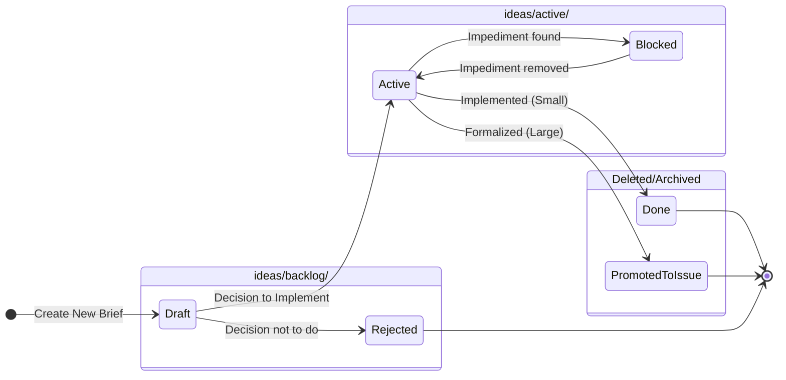

# 98 - Feature: Brief Structure and Placement Standard

## 1. Context & Goal
* **Issue:** #98
* **Objective:** Establish a project-wide standard for brief placement (`ideas/` directory), naming, structure, and lifecycle to separate informal work from formal documentation.
* **Status:** Draft
* **Related Issues:** None

### Open Questions
None - requirements are well-defined from issue.

## 2. Proposed Changes

### 2.1 Files Changed
| File | Change |
|------|--------|
| `docs/standards/0009-canonical-project-structure.md` | Update documentation to include `ideas/` directory hierarchy and rationale. |
| `tools/new-repo-setup.py` | Update script config to generate `ideas/active` and `ideas/backlog`. |
| `docs/templates/0110-brief-template.md` | Create new file containing the standard brief template (Frontmatter, Problem, Proposal). |
| `docs/0003-file-inventory.md` | Register the new template in the inventory. |
| `tests/test_new_repo_setup.py` | Create new automated test to verify the setup script creates the correct directory structure. |

### 2.2 Dependencies
* **Standard Library:** `os`, `pathlib`, `shutil`, `tempfile` (for testing).
* **External:** `pytest` (for running the new automated test).

### 2.3 Data Structures
*   **`OTHER_STRUCTURE` (List[str]):** A list within `new-repo-setup.py` defining the relative paths of directories to create.

### 2.4 Function Signatures

**File:** `tools/new-repo-setup.py`
```python
def create_structure(base_path: str) -> None:
    """
    Creates the canonical directory structure including the new ideas directories.
    
    Args:
        base_path: The root directory where the structure will be created.
    """
    pass
```

**File:** `tests/test_new_repo_setup.py`
```python
def test_create_structure_creates_ideas_dirs() -> None:
    """
    Verifies that create_structure creates 'ideas/active' and 'ideas/backlog' 
    inside a temporary directory.
    """
    pass
```

### 2.5 Logic Flow (Pseudocode)

**Tools Update: `tools/new-repo-setup.py`**
```python
# Configuration
OTHER_STRUCTURE = [
    "docs/standards",
    "docs/templates",
    "docs/reports",
    "tools",
    "src",
    "tests",
    "ideas/active",   # NEW
    "ideas/backlog",  # NEW
]

FUNCTION create_structure(base_path):
    FOR dir_name IN OTHER_STRUCTURE:
        full_path = path.join(base_path, dir_name)
        IF NOT path.exists(full_path):
            os.makedirs(full_path)
            PRINT f"Created: {full_path}"
        ELSE:
            PRINT f"Exists: {full_path}"
```

**Test Logic: `tests/test_new_repo_setup.py`**
```python
IMPORT tempfile, pathlib, create_structure

FUNCTION test_create_structure_creates_ideas_dirs():
    WITH tempfile.TemporaryDirectory() AS temp_dir:
        # Act
        create_structure(temp_dir)
        
        # Assert
        active_path = pathlib.Path(temp_dir) / "ideas/active"
        backlog_path = pathlib.Path(temp_dir) / "ideas/backlog"
        
        ASSERT active_path.exists() IS True
        ASSERT backlog_path.exists() IS True
```

### 2.6 Technical Approach
1.  **Standardization:** Define `ideas/` at the root level to separate "drafting" (ideas) from "archiving" (docs).
2.  **Automation:** Update the existing `new-repo-setup.py` script. This ensures compliance for all future project instantiations.
3.  **Regression Testing:** Instead of relying on manual shell commands, introduce a dedicated Python test file (`tests/test_new_repo_setup.py`) using `tempfile` to create ephemeral directories. This addresses the review feedback regarding manual testing reliance.
4.  **Documentation:** Update the canonical structure document to explain *why* `ideas/` exists and how the lifecycle moves from `backlog` -> `active`.

## 3. Requirements
1.  **Directory Generation:** `new-repo-setup.py` must create `ideas/active/` and `ideas/backlog/`.
2.  **Automated Verification:** A pytest execution must verify the directory creation without side effects on the actual repo.
3.  **Template Content:** `docs/templates/0110-brief-template.md` must contain YAML frontmatter (Status, Effort, Value, Blocked by) and markdown sections (Problem, Proposal).
4.  **Standard Documentation:** `docs/standards/0009-canonical-project-structure.md` must explicitly map the `ideas/` directory in the project tree.

## 4. Alternatives Considered

| Alternative | Pros | Cons | Decision |
|-------------|------|------|----------|
| **`docs/ideas` directory** | Keeps root directory cleaner. | Blurs the line between "working docs" and "formal docs/ADRs". | **Rejected** |
| **Numbered Files (001-idea.md)** | Easy sorting and referencing. | High overhead for scratchpad ideas; collision risk; discourages quick entry. | **Rejected** |
| **Manual Creation only** | No code changes needed. | High risk of drift; inconsistent naming (`idea/` vs `ideas/`). | **Rejected** |

## 5. Data & Fixtures

### 5.1 Data Sources
N/A - Structural change only.

### 5.2 Data Pipeline
N/A

### 5.3 Test Fixtures
| Fixture | Description |
|---------|-------------|
| `tempfile.TemporaryDirectory` | Python context manager used in tests to create a throwaway file system environment. |

### 5.4 Deployment Pipeline
Development environment only.

## 6. Diagram

### 6.1 Mermaid Quality Gate
- [x] Syntax is valid
- [x] Logic represents the Lifecycle rules from the Issue

### 6.2 Diagram



## 7. Security Considerations

| Concern | Mitigation |
|---------|------------|
| **File Overwrites** | The `create_structure` function checks `if not path.exists()` before creating directories to prevent accidental data loss. |
| **Test Side Effects** | Tests use `tempfile.TemporaryDirectory` to ensure no test artifacts persist in the actual file system. |

## 8. Performance Considerations

| Metric | Budget |
|--------|--------|
| **Script Execution Time** | < 100ms (I/O bound) |
| **Test Execution Time** | < 500ms |

## 9. Risks & Mitigations

| Risk | Impact | Likelihood | Mitigation |
|------|--------|------------|------------|
| **Metadata Drift** | Developers change template manually and break consistency. | Low | Template is a guideline; no strict parser currently exists. |
| **Stale Ideas** | `ideas/` fills up with abandoned files. | Medium | Add a "Lifecycle" section to the standard encouraging deletion/archiving. |

## 10. Verification & Testing

### 10.1 Test Scenarios

| ID | Scenario | Type | Input | Output | Criteria |
|----|----------|------|-------|--------|----------|
| T1 | Verify Directory Creation | Automated (Unit) | Run `pytest` on `test_new_repo_setup.py` | Pass/Fail | `ideas/active` and `ideas/backlog` are found in temp dir. |
| T2 | Idempotency Check | Automated (Unit) | Run `create_structure` twice on same dir | No Error | Script handles existing directories gracefully. |
| T3 | Template Verification | Manual | Open `docs/templates/0110-brief-template.md` | Visual check | Contains "Status", "Effort", "Value" fields. |

### 10.2 Test Commands

```bash
# Run the automated regression test
pytest tests/test_new_repo_setup.py

# Manual Check (if needed locally)
python3 tools/new-repo-setup.py
ls -d ideas/active ideas/backlog
```

### 10.3 Manual Tests (Only If Unavoidable)
| ID | Scenario |
|----|----------|
| M1 | Visually inspect `docs/standards/0009-canonical-project-structure.md` to ensure `ideas/` is documented correctly in the tree view. |

## 11. Definition of Done

### Code
- [ ] `tools/new-repo-setup.py` updated to include `ideas/` paths.
- [ ] `tests/test_new_repo_setup.py` created and passing.
- [ ] `docs/templates/0110-brief-template.md` created.

### Tests
- [ ] All unit tests pass (`pytest`).
- [ ] Manual check of the brief template rendering.

### Documentation
- [ ] `docs/standards/0009-canonical-project-structure.md` describes the `ideas/` directory.
- [ ] `docs/0003-file-inventory.md` includes the new template.

### Review
- [ ] Code review confirms test coverage.
- [ ] Architect review confirms standard documentation matches the implementation.

---

## Appendix: Review Log

### Review Summary

| Review | Date | Verdict | Key Issue |
|--------|------|---------|-----------|
| 1 | 2026-01-23 | REJECTED | Manual testing strategy; Metadata mismatch. |

**Final Status:** DRAFT - PENDING REVIEW