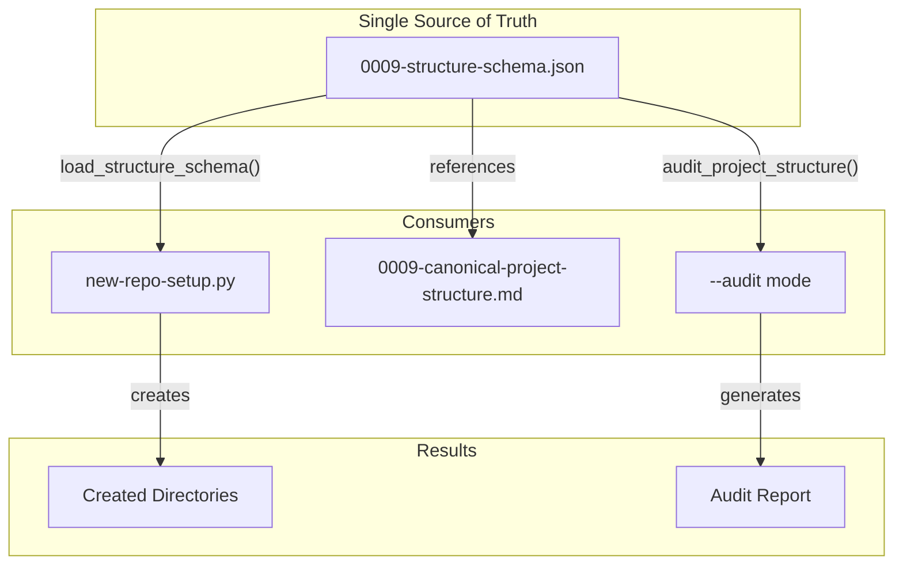

# 199 - Feature: Schema-driven project structure: eliminate tool/standard drift

<!-- Template Metadata
Last Updated: 2026-02-02
Updated By: Issue #117 fix
Update Reason: Moved Verification & Testing to Section 10 (was Section 11) to match 0702c review prompt and testing workflow expectations
Previous: Added sections based on 80 blocking issues from 164 governance verdicts (2026-02-01)
-->

## 1. Context & Goal
* **Issue:** #99
* **Objective:** Create a JSON schema as the single source of truth for project structure, eliminating drift between `new-repo-setup.py` and standard 0009.
* **Status:** Draft
* **Related Issues:** None

### Open Questions
*All questions resolved during Gemini Review #1.*

- [x] ~~Should the schema support conditional directories (e.g., `docs/lineage/` only for certain project types)?~~ **RESOLVED: No.** Keep the schema declarative and simple for v1. Use the `required: false` flag for optional directories. Conditional logic adds unnecessary complexity at this stage.
- [x] ~~Should we version the schema and support migrations between versions?~~ **RESOLVED: Yes to versioning, No to automated migrations.** Include a `version` field (as proposed) to enable future compatibility checks, but do not build automated migration logic (e.g., moving files) in this iteration.

## 2. Proposed Changes

*This section is the **source of truth** for implementation. Describe exactly what will be built.*

### 2.1 Files Changed

| File | Change Type | Description |
|------|-------------|-------------|
| `docs/standards/0009-structure-schema.json` | Add | Canonical JSON schema defining project structure |
| `tools/new-repo-setup.py` | Modify | Remove hardcoded lists, read structure from schema |
| `docs/standards/0009-canonical-project-structure.md` | Modify | Reference schema as authoritative source |
| `tests/unit/test_structure_schema.py` | Add | Tests for schema loading and validation |

### 2.1.1 Path Validation (Mechanical - Auto-Checked)

*Issue #277: Before human or Gemini review, paths are verified programmatically.*

Mechanical validation automatically checks:
- All "Modify" files must exist in repository
- All "Delete" files must exist in repository
- All "Add" files must have existing parent directories
- No placeholder prefixes (`src/`, `lib/`, `app/`) unless directory exists

**If validation fails, the LLD is BLOCKED before reaching review.**

### 2.2 Dependencies

*New packages, APIs, or services required.*

```toml
# pyproject.toml additions (if any)
# No new dependencies - uses stdlib json module
```

### 2.3 Data Structures

```python
# Pseudocode - NOT implementation
class DirectoryNode(TypedDict):
    required: bool  # Whether directory must exist
    description: NotRequired[str]  # Human-readable purpose
    children: NotRequired[dict[str, "DirectoryNode"]]  # Nested directories

class FileNode(TypedDict):
    required: bool  # Whether file must exist
    template: NotRequired[str]  # Template filename for generation
    description: NotRequired[str]  # Human-readable purpose

class ProjectStructureSchema(TypedDict):
    version: str  # Schema version (semver)
    directories: dict[str, DirectoryNode]  # Top-level directories
    files: dict[str, FileNode]  # Top-level files
```

### 2.4 Function Signatures

```python
# Signatures only - implementation in source files
def load_structure_schema(schema_path: Path | None = None) -> ProjectStructureSchema:
    """Load and validate the project structure schema from JSON file.
    
    If schema_path is None, uses default location relative to this module.
    Raises SchemaLoadError if file not found or invalid JSON.
    """
    ...

def flatten_directories(schema: ProjectStructureSchema) -> list[str]:
    """Convert nested directory structure to flat list of paths.
    
    Returns paths like ['docs', 'docs/adrs', 'docs/standards', ...].
    """
    ...

def flatten_files(schema: ProjectStructureSchema) -> list[tuple[str, FileNode]]:
    """Extract flat list of file paths with their metadata.
    
    Returns list of (path, node) tuples for all defined files.
    """
    ...

def get_required_directories(schema: ProjectStructureSchema) -> list[str]:
    """Get only directories marked as required."""
    ...

def get_required_files(schema: ProjectStructureSchema) -> list[str]:
    """Get only files marked as required."""
    ...

def audit_project_structure(root: Path, schema: ProjectStructureSchema) -> AuditResult:
    """Validate a project directory against the schema.
    
    Returns AuditResult with missing_required, missing_optional, and extra items.
    """
    ...

def validate_paths(schema: ProjectStructureSchema) -> list[str]:
    """Validate that no paths contain path traversal sequences.
    
    Returns list of invalid paths (empty if all valid).
    Checks for '..' and absolute paths.
    """
    ...

def create_directories_from_schema(root: Path, schema: ProjectStructureSchema) -> list[Path]:
    """Create all directories defined in schema under root.
    
    Returns list of created directory paths.
    Uses os.makedirs with exist_ok=True for safe creation.
    """
    ...
```

### 2.5 Logic Flow (Pseudocode)

```
1. LOAD SCHEMA:
   1.1 Read JSON file from docs/standards/0009-structure-schema.json
   1.2 Parse JSON
   1.3 Validate required fields exist (version, directories)
   1.4 Validate no path traversal sequences
   1.5 Return typed schema dict

2. FLATTEN DIRECTORIES (recursive):
   2.1 FOR each top-level directory in schema.directories:
       2.1.1 Add directory name to result
       2.1.2 IF has children THEN
             - Recursively flatten children with parent prefix
   2.2 Return sorted list of all paths

3. SETUP PROJECT (in new-repo-setup.py):
   3.1 Load schema via load_structure_schema()
   3.2 Get flat directory list via flatten_directories()
   3.3 Create each directory via create_directories_from_schema()
   3.4 Get file list via flatten_files()
   3.5 Create files from templates as needed

4. AUDIT PROJECT (--audit mode):
   4.1 Load schema
   4.2 Get required directories and files
   4.3 FOR each required item:
       4.3.1 IF not exists THEN add to missing list
   4.4 Report missing required items (error)
   4.5 Report missing optional items (warning)
```

### 2.6 Technical Approach

* **Module:** `tools/new-repo-setup.py` (schema loading functions inline or extracted to utils)
* **Pattern:** Schema-driven configuration with recursive tree traversal
* **Key Decisions:** 
  - Schema stored as JSON (not YAML) for stdlib compatibility
  - Recursive structure allows arbitrary nesting depth
  - `required` flag distinguishes mandatory from optional structure
  - Comment in tool pointing to schema file location for maintainability: `# Schema: docs/standards/0009-structure-schema.json`

### 2.7 Architecture Decisions

*Document key architectural decisions that affect the design. This section addresses the most common category of governance feedback (23 patterns).*

| Decision | Options Considered | Choice | Rationale |
|----------|-------------------|--------|-----------|
| Schema format | JSON, YAML, TOML | JSON | Stdlib support, no new dependencies, GitHub renders it |
| Schema location | In tool, separate file, in standard | Separate JSON file | Clear separation, versionable, reusable by other tools |
| Tree vs flat structure | Flat list of paths, nested tree | Nested tree | Better represents hierarchy, easier to understand relationships |
| Required flag | Implicit (all required), explicit per-item | Explicit per-item | Supports optional structure like `docs/lineage/` |

**Architectural Constraints:**
- Must not introduce new dependencies to `tools/new-repo-setup.py`
- Schema must be valid JSON (parseable by stdlib `json` module)
- Backward compatible with existing project structures

## 3. Requirements

*What must be true when this is done. These become acceptance criteria.*

1. Schema file `docs/standards/0009-structure-schema.json` exists and is valid JSON
2. Schema includes all directories currently in `DOCS_STRUCTURE` list
3. Schema includes `docs/lineage/` with `active/` and `done/` subdirectories
4. `new-repo-setup.py` reads structure from schema (no hardcoded directory lists)
5. `new-repo-setup.py --audit` validates against schema
6. Standard 0009 references the schema as the authoritative source
7. Existing functionality preserved (setup creates same directories as before)

## 4. Alternatives Considered

| Option | Pros | Cons | Decision |
|--------|------|------|----------|
| JSON schema file | No dependencies, stdlib support, GitHub renders | Less readable than YAML | **Selected** |
| YAML schema file | More readable, comments allowed | Requires PyYAML dependency | Rejected |
| Extract structure from markdown | Single source in human doc | Fragile parsing, hard to maintain | Rejected |
| Generate markdown from schema | True single source | Adds build step, more complex | Rejected (future enhancement) |

**Rationale:** JSON provides the best balance of simplicity and tooling support. No new dependencies, parseable by any language, and GitHub's web interface renders it nicely.

## 5. Data & Fixtures

*Per [0108-lld-pre-implementation-review.md](0108-lld-pre-implementation-review.md) - complete this section BEFORE implementation.*

### 5.1 Data Sources

| Attribute | Value |
|-----------|-------|
| Source | Local file: `docs/standards/0009-structure-schema.json` |
| Format | JSON |
| Size | ~2KB estimated |
| Refresh | Manual (updated when structure changes) |
| Copyright/License | Same as repository (internal) |

### 5.2 Data Pipeline

```
Schema JSON file ──json.load()──► Python dict ──flatten_*()──► Path lists ──► Directory creation
```

### 5.3 Test Fixtures

| Fixture | Source | Notes |
|---------|--------|-------|
| Valid schema JSON | Generated in test | Minimal valid schema for testing |
| Invalid schema JSON | Generated in test | Missing required fields |
| Sample project tree | tempfile.mkdtemp | Created/cleaned up per test |
| Golden paths list | Hardcoded in test | Expected paths from DOCS_STRUCTURE for parity check |

### 5.4 Deployment Pipeline

Schema file is committed to repository. No separate deployment needed.

**If data source is external:** N/A - schema is internal.

## 6. Diagram

### 6.1 Mermaid Quality Gate

Before finalizing any diagram, verify in [Mermaid Live Editor](https://mermaid.live) or GitHub preview:

- [x] **Simplicity:** Similar components collapsed (per 0006 §8.1)
- [x] **No touching:** All elements have visual separation (per 0006 §8.2)
- [x] **No hidden lines:** All arrows fully visible (per 0006 §8.3)
- [x] **Readable:** Labels not truncated, flow direction clear
- [ ] **Auto-inspected:** Agent rendered via mermaid.ink and viewed (per 0006 §8.5)

**Agent Auto-Inspection (MANDATORY):**

AI agents MUST render and view the diagram before committing:
1. Base64 encode diagram → fetch PNG from `https://mermaid.ink/img/{base64}`
2. Read the PNG file (multimodal inspection)
3. Document results below

**Auto-Inspection Results:**
```
- Touching elements: [ ] None / [ ] Found: ___
- Hidden lines: [ ] None / [ ] Found: ___
- Label readability: [ ] Pass / [ ] Issue: ___
- Flow clarity: [ ] Clear / [ ] Issue: ___
```

*Reference: [0006-mermaid-diagrams.md](0006-mermaid-diagrams.md)*

### 6.2 Diagram



## 7. Security & Safety Considerations

*This section addresses security (10 patterns) and safety (9 patterns) concerns from governance feedback.*

### 7.1 Security

| Concern | Mitigation | Status |
|---------|------------|--------|
| Path traversal in schema | Validate paths don't contain `..` or absolute paths via `validate_paths()` | Addressed |
| Malicious schema injection | Schema loaded from known location in repo only | Addressed |

### 7.2 Safety

*Safety concerns focus on preventing data loss, ensuring fail-safe behavior, and protecting system integrity.*

| Concern | Mitigation | Status |
|---------|------------|--------|
| Existing directory overwrite | `os.makedirs(exist_ok=True)` - no destructive operations | Addressed |
| Schema file missing | Clear error message, fail fast | Addressed |
| Invalid schema format | JSON parse error caught and reported | Addressed |

**Fail Mode:** Fail Closed - If schema cannot be loaded, tool exits with error rather than using fallback hardcoded structure.

**Recovery Strategy:** If schema is corrupted, restore from git history. No runtime recovery needed.

## 8. Performance & Cost Considerations

*This section addresses performance and cost concerns (6 patterns) from governance feedback.*

### 8.1 Performance

| Metric | Budget | Approach |
|--------|--------|----------|
| Schema load time | < 10ms | Single small JSON file, stdlib parsing |
| Flatten operation | < 1ms | Simple recursive traversal |
| Total overhead vs current | Negligible | One file read replaces inline list |

**Bottlenecks:** None expected - schema is small and operations are simple.

### 8.2 Cost Analysis

| Resource | Unit Cost | Estimated Usage | Monthly Cost |
|----------|-----------|-----------------|--------------|
| Compute | $0 | Local execution | $0 |
| Storage | $0 | ~2KB file | $0 |

**Cost Controls:**
- N/A - No external services or paid resources

**Worst-Case Scenario:** N/A - Local file operations only.

## 9. Legal & Compliance

*This section addresses legal concerns (8 patterns) from governance feedback.*

| Concern | Applies? | Mitigation |
|---------|----------|------------|
| PII/Personal Data | No | Schema contains only directory/file names |
| Third-Party Licenses | No | No external code or data |
| Terms of Service | No | No external services |
| Data Retention | No | No user data involved |
| Export Controls | No | No restricted content |

**Data Classification:** Public - Schema defines open-source project structure.

**Compliance Checklist:**
- [x] No PII stored without consent
- [x] All third-party licenses compatible with project license
- [x] External API usage compliant with provider ToS
- [x] Data retention policy documented

## 10. Verification & Testing

*Ref: [0005-testing-strategy-and-protocols.md](0005-testing-strategy-and-protocols.md)*

**Testing Philosophy:** Strive for 100% automated test coverage. Manual tests are a last resort for scenarios that genuinely cannot be automated (e.g., visual inspection, hardware interaction). Every scenario marked "Manual" requires justification.

### 10.0 Test Plan (TDD - Complete Before Implementation)

**TDD Requirement:** Tests MUST be written and failing BEFORE implementation begins.

| Test ID | Test Description | Expected Behavior | Status |
|---------|------------------|-------------------|--------|
| T010 | test_load_schema_valid | Loads valid schema without error | RED |
| T020 | test_load_schema_missing_file | Raises SchemaLoadError | RED |
| T030 | test_load_schema_invalid_json | Raises SchemaLoadError | RED |
| T040 | test_flatten_directories_simple | Returns flat list of paths | RED |
| T050 | test_flatten_directories_nested | Handles deeply nested structure | RED |
| T060 | test_get_required_directories | Filters to required only | RED |
| T070 | test_audit_missing_required | Reports missing required dirs | RED |
| T080 | test_audit_all_present | Returns clean result | RED |
| T090 | test_schema_includes_lineage | Schema has docs/lineage structure | RED |
| T100 | test_schema_content_parity | Schema contains all DOCS_STRUCTURE paths | RED |
| T110 | test_tool_integration_load | Tool loads schema via load_structure_schema() | RED |
| T120 | test_directory_creation | os.makedirs called for schema paths | RED |

**Coverage Target:** ≥95% for all new code

**TDD Checklist:**
- [ ] All tests written before implementation
- [ ] Tests currently RED (failing)
- [ ] Test IDs match scenario IDs in 10.1
- [ ] Test file created at: `tests/unit/test_structure_schema.py`

*Note: Update Status from RED to GREEN as implementation progresses. All tests should be RED at LLD review time.*

### 10.1 Test Scenarios

| ID | Scenario | Type | Input | Expected Output | Pass Criteria |
|----|----------|------|-------|-----------------|---------------|
| 010 | Load valid schema | Auto | Valid JSON file | Parsed dict | No exceptions, dict has 'version' |
| 020 | Load missing file | Auto | Nonexistent path | SchemaLoadError | Exception raised with clear message |
| 030 | Load invalid JSON | Auto | Malformed JSON | SchemaLoadError | Exception raised |
| 040 | Flatten simple | Auto | `{dirs: {a: {}, b: {}}}` | `['a', 'b']` | Exact match |
| 050 | Flatten nested | Auto | `{dirs: {a: {children: {b: {}}}}}` | `['a', 'a/b']` | Includes nested path |
| 060 | Filter required | Auto | Mix of required/optional | Only required items | Optional excluded |
| 070 | Audit missing | Auto | Empty dir + schema | Missing list populated | Reports missing required |
| 080 | Audit complete | Auto | Complete dir + schema | Empty missing list | All required present |
| 090 | Schema has lineage | Auto | Actual schema file | lineage structure exists | `docs/lineage/active`, `docs/lineage/done` in flatten |
| 100 | Schema content parity | Auto | Actual schema file + golden paths | All golden paths exist | `docs/standards`, `tools`, `docs/adrs`, etc. present in flattened schema |
| 110 | Tool integration load | Auto | Mock sys.argv for tool | load_structure_schema() called | Function invoked during tool execution (verified via mock) |
| 120 | Directory creation | Auto | Test schema + mock os.makedirs | makedirs called for paths | All schema paths passed to os.makedirs with exist_ok=True |

*Note: Use 3-digit IDs with gaps of 10 (010, 020, 030...) to allow insertions.*

**Type values:**
- `Auto` - Fully automated, runs in CI (pytest, playwright, etc.)
- `Auto-Live` - Automated but hits real external services (may be slow/flaky)
- `Manual` - Requires human execution (MUST include justification why automation is impossible)

### 10.2 Test Commands

```bash
# Run all automated tests
poetry run pytest tests/unit/test_structure_schema.py -v

# Run only fast/mocked tests (exclude live)
poetry run pytest tests/unit/test_structure_schema.py -v -m "not live"

# Test new-repo-setup integration
poetry run python tools/new-repo-setup.py --audit --dry-run
```

### 10.3 Manual Tests (Only If Unavoidable)

**N/A - All scenarios automated.**

## 11. Risks & Mitigations

| Risk | Impact | Likelihood | Mitigation |
|------|--------|------------|------------|
| Schema and tool get out of sync | Med | Low | T100 validates schema matches golden paths; T110 validates tool uses schema |
| Breaking change to schema format | High | Low | Version field in schema, migration path documented |
| Performance regression from file I/O | Low | Low | Schema cached after first load within process |

## 12. Definition of Done

### Code
- [ ] Implementation complete and linted
- [ ] Code comments reference this LLD
- [ ] Comment in `new-repo-setup.py` pointing to schema file location: `# Schema: docs/standards/0009-structure-schema.json`

### Tests
- [ ] All test scenarios pass (T010-T120)
- [ ] Test coverage meets threshold (≥95%)

### Documentation
- [ ] LLD updated with any deviations
- [ ] Implementation Report (0103) completed
- [ ] Test Report (0113) completed if applicable

### Review
- [ ] Code review completed
- [ ] User approval before closing issue

### 12.1 Traceability (Mechanical - Auto-Checked)

*Issue #277: Cross-references are verified programmatically.*

Mechanical validation automatically checks:
- Every file mentioned in this section must appear in Section 2.1
- Every risk mitigation in Section 11 should have a corresponding function in Section 2.4 (warning if not)

**If files are missing from Section 2.1, the LLD is BLOCKED.**

---

## Appendix: Review Log

*Track all review feedback with timestamps and implementation status.*

<!-- Note: Timestamps are auto-generated by the workflow. Do not fill in manually. -->

### Gemini Review #1 (REVISE)

**Reviewer:** Gemini 3 Pro
**Verdict:** REVISE

#### Comments

| ID | Comment | Implemented? |
|----|---------|--------------|
| G1.1 | "Open questions resolved" | YES - Section 1 updated with resolutions |
| G1.2 | "Missing test for Req 2 (Parity): test_schema_content_parity" | YES - Added T100 in Sections 10.0 and 10.1 |
| G1.3 | "Missing test for Req 4 (Integration): test_tool_integration_load" | YES - Added T110 in Sections 10.0 and 10.1 |
| G1.4 | "Missing test for Req 7 (Creation): test_directory_creation" | YES - Added T120 in Sections 10.0 and 10.1 |
| G1.5 | "Add comment in new-repo-setup.py pointing to schema file location" | YES - Added to Section 2.6 and Section 12 |

### Review Summary

<!-- Note: This table is auto-populated by the workflow with actual review dates. -->

| Review | Date | Verdict | Key Issue |
|--------|------|---------|-----------|
| Gemini #1 | (auto) | REVISE | Test coverage at 50%, missing integration and parity tests |

**Final Status:** PENDING
<!-- Note: This field is auto-updated to APPROVED by the workflow when finalized -->