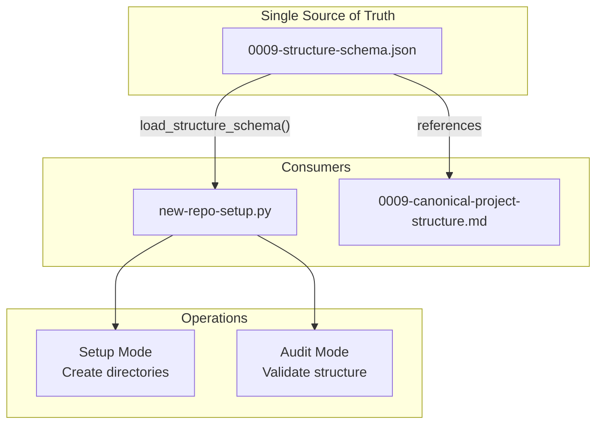

# 199 - Feature: Schema-driven project structure: eliminate tool/standard drift

<!-- Template Metadata
Last Updated: 2026-02-02
Updated By: Issue #117 fix
Update Reason: Moved Verification & Testing to Section 10 (was Section 11) to match 0702c review prompt and testing workflow expectations
Previous: Added sections based on 80 blocking issues from 164 governance verdicts (2026-02-01)
-->

## 1. Context & Goal
* **Issue:** #99
* **Objective:** Create a JSON schema as single source of truth for project structure, eliminating duplication between `new-repo-setup.py` and standard 0009
* **Status:** Draft
* **Related Issues:** None

### Open Questions
*Questions that need clarification before or during implementation. Remove when resolved.*

- [ ] Should the schema support inheritance/extension for project-specific customizations?
- [ ] Should `--audit` mode produce machine-readable output (JSON) in addition to human-readable?

## 2. Proposed Changes

*This section is the **source of truth** for implementation. Describe exactly what will be built.*

### 2.1 Files Changed

| File | Change Type | Description |
|------|-------------|-------------|
| `docs/standards/0009-structure-schema.json` | Add | Canonical JSON schema defining project directory structure |
| `new-repo-setup.py` | Modify | Refactor to read structure from schema instead of hardcoded lists |
| `docs/standards/0009-canonical-project-structure.md` | Modify | Update to reference schema as authoritative source |
| `tests/unit/test_schema_loader.py` | Add | Unit tests for schema loading and validation |

### 2.1.1 Path Validation (Mechanical - Auto-Checked)

*Issue #277: Before human or Gemini review, paths are verified programmatically.*

Mechanical validation automatically checks:
- All "Modify" files must exist in repository
- All "Delete" files must exist in repository
- All "Add" files must have existing parent directories
- No placeholder prefixes (`src/`, `lib/`, `app/`) unless directory exists

**If validation fails, the LLD is BLOCKED before reaching review.**

### 2.2 Dependencies

*New packages, APIs, or services required.*

```toml
# pyproject.toml additions (if any)
# No new dependencies - uses Python standard library (json, pathlib)
```

### 2.3 Data Structures

```python
# Pseudocode - NOT implementation
class DirectorySpec(TypedDict):
    required: bool  # Whether directory must exist
    description: NotRequired[str]  # Human-readable description
    children: NotRequired[dict[str, "DirectorySpec"]]  # Nested directories

class FileSpec(TypedDict):
    required: bool  # Whether file must exist
    template: NotRequired[str]  # Template file name if applicable
    description: NotRequired[str]  # Human-readable description

class ProjectStructureSchema(TypedDict):
    version: str  # Schema version for future compatibility
    directories: dict[str, DirectorySpec]  # Top-level directory specs
    files: dict[str, FileSpec]  # Top-level file specs
```

### 2.4 Function Signatures

```python
# Signatures only - implementation in source files

def load_structure_schema(schema_path: Path | None = None) -> ProjectStructureSchema:
    """Load project structure schema from JSON file.
    
    Args:
        schema_path: Path to schema file. Defaults to standard location.
    
    Returns:
        Parsed and validated schema.
    
    Raises:
        SchemaValidationError: If schema is invalid.
        FileNotFoundError: If schema file doesn't exist.
    """
    ...

def flatten_directories(schema: ProjectStructureSchema) -> list[str]:
    """Convert nested directory spec to flat list of paths.
    
    Args:
        schema: Loaded project structure schema.
    
    Returns:
        List of directory paths (e.g., ['docs', 'docs/adrs', 'docs/standards']).
    """
    ...

def flatten_files(schema: ProjectStructureSchema) -> list[tuple[str, FileSpec]]:
    """Convert file specs to flat list of paths with metadata.
    
    Args:
        schema: Loaded project structure schema.
    
    Returns:
        List of (path, spec) tuples.
    """
    ...

def audit_against_schema(
    project_root: Path, 
    schema: ProjectStructureSchema
) -> AuditResult:
    """Validate project structure against schema.
    
    Args:
        project_root: Root directory of project to audit.
        schema: Expected structure schema.
    
    Returns:
        AuditResult with missing/extra directories and files.
    """
    ...

class AuditResult(TypedDict):
    valid: bool  # Overall pass/fail
    missing_required_dirs: list[str]  # Required dirs that don't exist
    missing_required_files: list[str]  # Required files that don't exist
    missing_optional_dirs: list[str]  # Optional dirs that don't exist (info only)
```

### 2.5 Logic Flow (Pseudocode)

```
=== Schema Loading ===
1. Determine schema path (argument or default location)
2. Read JSON file
3. Validate schema structure (version, required keys)
4. Return parsed schema

=== Directory Flattening ===
1. Initialize empty list
2. FOR each top-level directory in schema.directories:
   a. Add directory path to list
   b. IF has children:
      - Recursively process children, prepending parent path
3. Return sorted list

=== Audit Mode ===
1. Load schema
2. Flatten directories and files from schema
3. FOR each required directory:
   a. IF not exists: add to missing_required_dirs
4. FOR each required file:
   a. IF not exists: add to missing_required_files
5. Return AuditResult with valid=True only if no missing required items

=== Setup Mode (existing refactored) ===
1. Load schema (instead of hardcoded DOCS_STRUCTURE)
2. Flatten directories
3. Create each directory (existing mkdir logic)
4. Process file templates (existing logic)
```

### 2.6 Technical Approach

* **Module:** `new-repo-setup.py` (existing script, refactored)
* **Pattern:** Configuration-as-data - schema file drives behavior
* **Key Decisions:** 
  - JSON chosen over YAML for zero-dependency loading
  - Schema embedded in `docs/standards/` to keep single source with documentation
  - Recursive structure supports arbitrary nesting depth

### 2.7 Architecture Decisions

*Document key architectural decisions that affect the design. This section addresses the most common category of governance feedback (23 patterns).*

| Decision | Options Considered | Choice | Rationale |
|----------|-------------------|--------|-----------|
| Schema format | JSON, YAML, TOML | JSON | Zero dependencies (stdlib), universal tooling support |
| Schema location | Separate config dir, alongside standard | `docs/standards/` | Co-location with 0009 standard maintains single source of truth |
| Nesting approach | Flat list with paths, nested objects | Nested objects | More readable, supports per-directory metadata |
| Schema loading | At import time, on first use | On first use (lazy) | Allows script to be imported without schema present |

**Architectural Constraints:**
- Must work with Python stdlib only (no new dependencies)
- Must not break existing `new-repo-setup.py` CLI interface
- Schema must be human-readable and editable

## 3. Requirements

*What must be true when this is done. These become acceptance criteria.*

1. `docs/standards/0009-structure-schema.json` exists and is valid JSON
2. `new-repo-setup.py` creates directories by reading schema (no hardcoded lists)
3. `new-repo-setup.py --audit` validates against schema
4. Standard 0009 references schema as authoritative source
5. Schema includes `docs/lineage/` structure with `active/` and `done/` subdirectories
6. Existing CLI behavior unchanged (backward compatible)

## 4. Alternatives Considered

| Option | Pros | Cons | Decision |
|--------|------|------|----------|
| JSON schema file | Zero dependencies, universal support, easy validation | Less readable than YAML | **Selected** |
| YAML schema file | More readable, supports comments | Requires PyYAML dependency | Rejected |
| Python dataclass config | Type-safe, IDE autocomplete | Still code duplication, harder to edit | Rejected |
| Generate standard from code | DRY for code | Documentation becomes derived artifact | Rejected |

**Rationale:** JSON provides the best balance of zero dependencies, universal tooling support, and sufficient readability. The nested structure compensates for JSON's lack of comments by supporting `description` fields.

## 5. Data & Fixtures

*Per [0108-lld-pre-implementation-review.md](0108-lld-pre-implementation-review.md) - complete this section BEFORE implementation.*

### 5.1 Data Sources

| Attribute | Value |
|-----------|-------|
| Source | Static JSON schema file in repository |
| Format | JSON |
| Size | ~50-100 lines |
| Refresh | Manual (updated when structure requirements change) |
| Copyright/License | N/A (project-owned) |

### 5.2 Data Pipeline

```
0009-structure-schema.json ──load_structure_schema()──► ProjectStructureSchema ──flatten_*()──► Directory/File lists
```

### 5.3 Test Fixtures

| Fixture | Source | Notes |
|---------|--------|-------|
| Valid minimal schema | Hardcoded in test | Tests basic parsing |
| Valid full schema | Copy of production schema | Tests real-world structure |
| Invalid schema (missing version) | Hardcoded in test | Tests error handling |
| Invalid schema (malformed JSON) | Hardcoded in test | Tests error handling |

### 5.4 Deployment Pipeline

Schema file is committed to repository - no separate deployment needed. Changes to schema take effect immediately for all users when they pull latest.

**If data source is external:** N/A - all data is internal to repository.

## 6. Diagram

### 6.1 Mermaid Quality Gate

Before finalizing any diagram, verify in [Mermaid Live Editor](https://mermaid.live) or GitHub preview:

- [x] **Simplicity:** Similar components collapsed (per 0006 §8.1)
- [x] **No touching:** All elements have visual separation (per 0006 §8.2)
- [x] **No hidden lines:** All arrows fully visible (per 0006 §8.3)
- [x] **Readable:** Labels not truncated, flow direction clear
- [ ] **Auto-inspected:** Agent rendered via mermaid.ink and viewed (per 0006 §8.5)

**Agent Auto-Inspection (MANDATORY):**

AI agents MUST render and view the diagram before committing:
1. Base64 encode diagram → fetch PNG from `https://mermaid.ink/img/{base64}`
2. Read the PNG file (multimodal inspection)
3. Document results below

**Auto-Inspection Results:**
```
- Touching elements: [ ] None / [ ] Found: ___
- Hidden lines: [ ] None / [ ] Found: ___
- Label readability: [ ] Pass / [ ] Issue: ___
- Flow clarity: [ ] Clear / [ ] Issue: ___
```

*Reference: [0006-mermaid-diagrams.md](0006-mermaid-diagrams.md)*

### 6.2 Diagram



## 7. Security & Safety Considerations

*This section addresses security (10 patterns) and safety (9 patterns) concerns from governance feedback.*

### 7.1 Security

| Concern | Mitigation | Status |
|---------|------------|--------|
| Path traversal in schema | Validate all paths are relative, no `..` allowed | Addressed |
| Arbitrary file creation | Schema only defines structure, not content; templates are separate | Addressed |

### 7.2 Safety

*Safety concerns focus on preventing data loss, ensuring fail-safe behavior, and protecting system integrity.*

| Concern | Mitigation | Status |
|---------|------------|--------|
| Overwriting existing directories | `mkdir -p` behavior (no-op if exists) | Addressed |
| Invalid schema crashes tool | Validate schema on load, clear error messages | Addressed |
| Missing schema file | Graceful error with clear message about expected location | Addressed |

**Fail Mode:** Fail Closed - If schema is invalid or missing, tool exits with error rather than using fallback hardcoded values.

**Recovery Strategy:** Fix schema file and re-run. No partial state to clean up since directories are created atomically.

## 8. Performance & Cost Considerations

*This section addresses performance and cost concerns (6 patterns) from governance feedback.*

### 8.1 Performance

| Metric | Budget | Approach |
|--------|--------|----------|
| Schema load time | < 10ms | Single small JSON file, stdlib parser |
| Directory creation | < 100ms total | Minimal I/O, parallel not needed |
| Audit validation | < 50ms | Simple path existence checks |

**Bottlenecks:** None expected - operations are trivial in scale.

### 8.2 Cost Analysis

| Resource | Unit Cost | Estimated Usage | Monthly Cost |
|----------|-----------|-----------------|--------------|
| N/A | N/A | N/A | $0 |

**Cost Controls:** N/A - no external services or paid resources.

**Worst-Case Scenario:** N/A - local file operations only.

## 9. Legal & Compliance

*This section addresses legal concerns (8 patterns) from governance feedback.*

| Concern | Applies? | Mitigation |
|---------|----------|------------|
| PII/Personal Data | No | Schema contains only directory structure definitions |
| Third-Party Licenses | No | Uses only Python stdlib |
| Terms of Service | No | No external APIs |
| Data Retention | No | No user data stored |
| Export Controls | No | No restricted algorithms |

**Data Classification:** Internal (project configuration)

**Compliance Checklist:**
- [x] No PII stored without consent
- [x] All third-party licenses compatible with project license
- [x] External API usage compliant with provider ToS
- [x] Data retention policy documented

## 10. Verification & Testing

*Ref: [0005-testing-strategy-and-protocols.md](0005-testing-strategy-and-protocols.md)*

**Testing Philosophy:** Strive for 100% automated test coverage. Manual tests are a last resort for scenarios that genuinely cannot be automated (e.g., visual inspection, hardware interaction). Every scenario marked "Manual" requires justification.

### 10.0 Test Plan (TDD - Complete Before Implementation)

**TDD Requirement:** Tests MUST be written and failing BEFORE implementation begins.

| Test ID | Test Description | Expected Behavior | Status |
|---------|------------------|-------------------|--------|
| T010 | test_load_valid_schema | Returns parsed ProjectStructureSchema | RED |
| T020 | test_load_missing_file | Raises FileNotFoundError | RED |
| T030 | test_load_invalid_json | Raises SchemaValidationError | RED |
| T040 | test_load_missing_version | Raises SchemaValidationError | RED |
| T050 | test_flatten_directories_simple | Returns flat list from nested structure | RED |
| T060 | test_flatten_directories_deep | Handles 3+ levels of nesting | RED |
| T070 | test_audit_all_present | Returns valid=True when structure complete | RED |
| T080 | test_audit_missing_required | Returns valid=False with missing dirs listed | RED |
| T090 | test_audit_missing_optional | Returns valid=True, lists optional as info | RED |
| T100 | test_path_traversal_rejected | Rejects paths containing `..` | RED |

**Coverage Target:** ≥95% for all new code

**TDD Checklist:**
- [ ] All tests written before implementation
- [ ] Tests currently RED (failing)
- [ ] Test IDs match scenario IDs in 10.1
- [ ] Test file created at: `tests/unit/test_schema_loader.py`

*Note: Update Status from RED to GREEN as implementation progresses. All tests should be RED at LLD review time.*

### 10.1 Test Scenarios

| ID | Scenario | Type | Input | Expected Output | Pass Criteria |
|----|----------|------|-------|-----------------|---------------|
| 010 | Load valid schema | Auto | Valid JSON file | ProjectStructureSchema dict | All required keys present |
| 020 | Load missing file | Auto | Non-existent path | FileNotFoundError | Exception raised |
| 030 | Load invalid JSON | Auto | Malformed JSON | SchemaValidationError | Exception with clear message |
| 040 | Load schema missing version | Auto | JSON without version key | SchemaValidationError | Error mentions "version" |
| 050 | Flatten simple structure | Auto | Schema with 2 levels | ['docs', 'docs/adrs'] | Correct paths in order |
| 060 | Flatten deep structure | Auto | Schema with 4 levels | All paths present | Recursive flattening works |
| 070 | Audit complete project | Auto | Project with all required dirs | valid=True | No missing items |
| 080 | Audit missing required dir | Auto | Project missing docs/adrs | valid=False | 'docs/adrs' in missing list |
| 090 | Audit missing optional dir | Auto | Project missing optional dir | valid=True | Optional listed separately |
| 100 | Reject path traversal | Auto | Schema with '../etc' path | SchemaValidationError | Security error raised |

*Note: Use 3-digit IDs with gaps of 10 (010, 020, 030...) to allow insertions.*

**Type values:**
- `Auto` - Fully automated, runs in CI (pytest, playwright, etc.)
- `Auto-Live` - Automated but hits real external services (may be slow/flaky)
- `Manual` - Requires human execution (MUST include justification why automation is impossible)

### 10.2 Test Commands

```bash
# Run all automated tests
poetry run pytest tests/unit/test_schema_loader.py -v

# Run only fast/mocked tests (exclude live)
poetry run pytest tests/unit/test_schema_loader.py -v -m "not live"

# Run with coverage
poetry run pytest tests/unit/test_schema_loader.py -v --cov=new_repo_setup --cov-report=term-missing
```

### 10.3 Manual Tests (Only If Unavoidable)

**N/A - All scenarios automated.**

## 11. Risks & Mitigations

| Risk | Impact | Likelihood | Mitigation |
|------|--------|------------|------------|
| Schema syntax errors break tool | High | Low | Validate schema on load, clear error messages |
| Schema format changes break consumers | Med | Low | Version field enables migration path |
| Standard 0009 diverges from schema | Med | Med | Document schema as authoritative in standard header |
| Path separator issues (Windows) | Low | Low | Use pathlib throughout for cross-platform support |

## 12. Definition of Done

### Code
- [ ] Implementation complete and linted
- [ ] Code comments reference this LLD

### Tests
- [ ] All test scenarios pass
- [ ] Test coverage meets threshold (≥95%)

### Documentation
- [ ] LLD updated with any deviations
- [ ] Implementation Report (0103) completed
- [ ] Test Report (0113) completed if applicable

### Review
- [ ] Code review completed
- [ ] User approval before closing issue

### 12.1 Traceability (Mechanical - Auto-Checked)

*Issue #277: Cross-references are verified programmatically.*

Mechanical validation automatically checks:
- Every file mentioned in this section must appear in Section 2.1
- Every risk mitigation in Section 11 should have a corresponding function in Section 2.4 (warning if not)

**Traceability Matrix:**

| Risk Mitigation | Corresponding Function |
|-----------------|----------------------|
| Validate schema on load | `load_structure_schema()` |
| Version field enables migration | Schema `version` field |
| Use pathlib for cross-platform | All functions use `Path` types |

**If files are missing from Section 2.1, the LLD is BLOCKED.**

---

## Appendix: Review Log

*Track all review feedback with timestamps and implementation status.*

<!-- Note: Timestamps are auto-generated by the workflow. Do not fill in manually. -->

### Review Summary

<!-- Note: This table is auto-populated by the workflow with actual review dates. -->

| Review | Date | Verdict | Key Issue |
|--------|------|---------|-----------|
| - | - | - | Awaiting first review |

**Final Status:** PENDING
<!-- Note: This field is auto-updated to APPROVED by the workflow when finalized -->