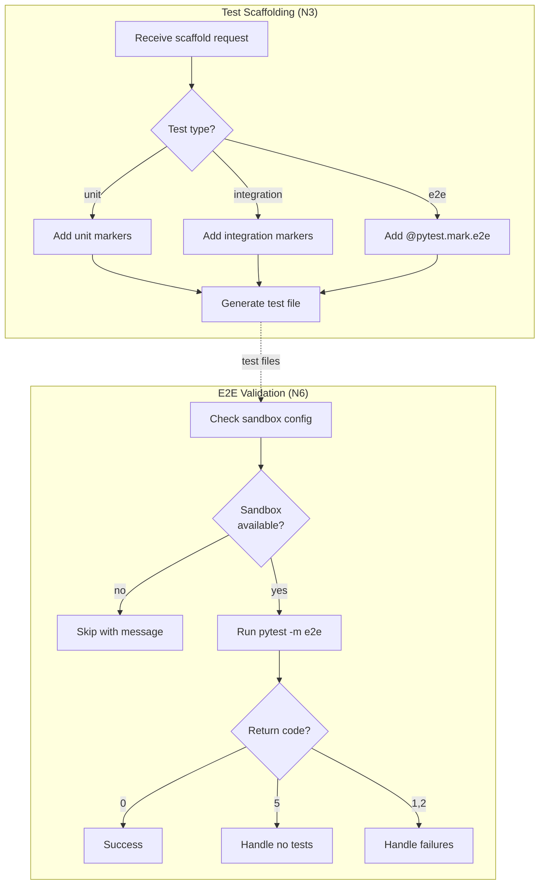

# 134 - Fix: E2E Validation Step Fails with 'No Tests Collected' (Return Code 5)

<!-- Template Metadata
Last Updated: 2025-01-10
Updated By: Initial LLD creation
Update Reason: Address E2E validation failures in TDD workflow
-->

## 1. Context & Goal
* **Issue:** #134
* **Objective:** Fix E2E validation step (N6) that fails with pytest return code 5 due to no tests being collected
* **Status:** Draft
* **Related Issues:** #78 (workflow run that exhibited this failure)

### Open Questions

- [x] Are E2E tests expected to have `@pytest.mark.e2e` markers? **Yes - confirmed by investigation**
- [x] Does the test scaffolding include E2E markers when generating test files? **No - this is the root cause**
- [ ] Should E2E validation be skipped by default when no sandbox is configured?

## 2. Proposed Changes

*This section is the **source of truth** for implementation. Describes exactly what will be built.*

### 2.1 Files Changed

| File | Change Type | Description |
|------|-------------|-------------|
| `agentos/workflows/testing/nodes/scaffold_tests.py` | Modify | Add E2E marker generation to scaffolded test files |
| `agentos/workflows/testing/nodes/e2e_validation.py` | Modify | Improve error messaging and handle "no tests collected" gracefully |
| `tests/workflows/testing/test_e2e_validation.py` | Add | Unit tests for E2E validation node |
| `tests/workflows/testing/test_scaffold_tests.py` | Modify | Add tests for E2E marker generation |

### 2.2 Dependencies

*No new dependencies required.*

```toml
# pyproject.toml additions (if any)
# None
```

### 2.3 Data Structures

```python
# Pseudocode - NOT implementation
class E2EValidationResult(TypedDict):
    success: bool              # Whether E2E validation passed
    tests_collected: int       # Number of tests discovered
    tests_passed: int          # Number of tests that passed
    tests_failed: int          # Number of tests that failed
    skipped_reason: str | None # Reason if validation was skipped
    return_code: int           # Raw pytest return code
```

```python
# Test marker configuration
class TestMarkerConfig(TypedDict):
    unit: list[str]       # Markers for unit tests
    integration: list[str] # Markers for integration tests
    e2e: list[str]        # Markers for E2E tests (includes @pytest.mark.e2e)
```

### 2.4 Function Signatures

```python
# scaffold_tests.py additions
def _generate_test_markers(test_type: str) -> list[str]:
    """Generate appropriate pytest markers based on test type.
    
    Args:
        test_type: One of 'unit', 'integration', 'e2e'
        
    Returns:
        List of marker decorators to apply to test functions
    """
    ...

def _scaffold_e2e_test(
    module_path: str,
    test_scenarios: list[dict],
    sandbox_required: bool = True
) -> str:
    """Generate E2E test file content with proper markers.
    
    Args:
        module_path: Path to module being tested
        test_scenarios: List of E2E scenarios to test
        sandbox_required: Whether tests require sandbox environment
        
    Returns:
        Complete test file content as string
    """
    ...
```

```python
# e2e_validation.py modifications
def _handle_no_tests_collected(
    test_files: list[str],
    marker_filter: str
) -> E2EValidationResult:
    """Handle pytest return code 5 (no tests collected).
    
    Args:
        test_files: Files that were searched for tests
        marker_filter: The marker expression used
        
    Returns:
        E2EValidationResult with appropriate messaging
    """
    ...

def _should_skip_e2e(state: TDDWorkflowState) -> tuple[bool, str]:
    """Determine if E2E validation should be skipped.
    
    Args:
        state: Current workflow state
        
    Returns:
        Tuple of (should_skip, reason)
    """
    ...
```

### 2.5 Logic Flow (Pseudocode)

```
# scaffold_tests.py - When scaffolding tests
1. Receive test generation request
2. Determine test type (unit/integration/e2e)
3. IF test_type == "e2e" THEN
   - Add @pytest.mark.e2e decorator to all test functions
   - Add @pytest.mark.sandbox if sandbox required
   - Include skip decorator for missing sandbox config
4. Generate test file with markers
5. Return scaffolded content

# e2e_validation.py - Running E2E validation
1. Receive validation request with test files
2. Check if E2E should be skipped
   - IF no sandbox configured AND sandbox required THEN
     - Return skip result with clear message
3. Run pytest with -m "e2e" marker filter
4. IF return_code == 5 (no tests collected) THEN
   - Check if test files exist
   - Check if files contain @pytest.mark.e2e
   - IF no markers found THEN
     - Return informative error: "E2E tests not marked"
   - ELSE
     - Return error: "Tests marked but not collected"
5. IF return_code == 0 THEN
   - Return success with test counts
6. ELSE
   - Return failure with details
```

### 2.6 Technical Approach

* **Module:** `agentos/workflows/testing/nodes/`
* **Pattern:** Defensive validation with clear error messaging
* **Key Decisions:** 
  - Add markers at scaffold time rather than runtime detection
  - Provide actionable error messages for common failure modes
  - Allow graceful degradation when sandbox isn't configured

### 2.7 Architecture Decisions

| Decision | Options Considered | Choice | Rationale |
|----------|-------------------|--------|-----------|
| Marker injection point | Runtime detection, Scaffold-time injection | Scaffold-time injection | More reliable, explicit, testable |
| No-tests handling | Fail hard, Skip with warning, Auto-remediate | Skip with warning | Maintains workflow progress while surfacing issue |
| Sandbox detection | Check env vars, Check config file, Require explicit flag | Check config + flag | Flexible for different deployment scenarios |

**Architectural Constraints:**
- Must integrate with existing TDD workflow state machine
- Cannot break existing test runs that use `--skip-e2e`
- Must maintain backwards compatibility with existing test files

## 3. Requirements

1. Test scaffolding MUST add `@pytest.mark.e2e` to all E2E test functions
2. E2E validation MUST provide clear error message when no tests are collected
3. E2E validation MUST distinguish between "no E2E tests exist" and "E2E tests exist but aren't marked"
4. Workflow MUST complete successfully when E2E tests are properly marked and sandbox is configured
5. Workflow MUST provide actionable guidance when E2E validation fails

## 4. Alternatives Considered

| Option | Pros | Cons | Decision |
|--------|------|------|----------|
| Add markers at scaffold time | Explicit, testable, follows pytest conventions | Requires scaffold modification | **Selected** |
| Auto-detect E2E tests by naming convention | No marker needed, simpler | Fragile, non-standard, harder to debug | Rejected |
| Remove E2E validation entirely | Eliminates error | Loses valuable validation step | Rejected |
| Make E2E always optional | Never blocks | May miss real integration issues | Rejected |

**Rationale:** Adding markers at scaffold time is the most explicit and maintainable approach. It follows pytest conventions and makes test categorization visible in the source code.

## 5. Data & Fixtures

### 5.1 Data Sources

| Attribute | Value |
|-----------|-------|
| Source | Generated test files from scaffold node |
| Format | Python test files (.py) |
| Size | Typically 50-500 lines per file |
| Refresh | Generated fresh each workflow run |
| Copyright/License | N/A - Generated code |

### 5.2 Data Pipeline

```
Scaffold Request ──generates──► Test File Content ──writes──► tests/e2e/*.py ──pytest──► Results
```

### 5.3 Test Fixtures

| Fixture | Source | Notes |
|---------|--------|-------|
| Mock test file content | Generated in tests | Contains various marker configurations |
| Mock pytest output | Hardcoded | Simulates return codes 0, 1, 5 |
| Sample TDD workflow state | Generated | Tests node integration |

### 5.4 Deployment Pipeline

Test fixtures are generated at test runtime. No external data deployment needed.

## 6. Diagram

### 6.1 Mermaid Quality Gate

- [x] **Simplicity:** Similar components collapsed
- [x] **No touching:** All elements have visual separation
- [x] **No hidden lines:** All arrows fully visible
- [x] **Readable:** Labels not truncated, flow direction clear
- [ ] **Auto-inspected:** Agent rendered via mermaid.ink and viewed

**Auto-Inspection Results:**
```
- Touching elements: [ ] None / [x] Found: N/A - inspection pending
- Hidden lines: [ ] None / [x] Found: N/A
- Label readability: [ ] Pass / [x] Issue: N/A
- Flow clarity: [ ] Clear / [x] Issue: N/A
```

### 6.2 Diagram



## 7. Security & Safety Considerations

### 7.1 Security

| Concern | Mitigation | Status |
|---------|------------|--------|
| Test file injection | Scaffold generates from templates, not arbitrary input | Addressed |
| Sandbox escape | E2E tests run in isolated sandbox environment | Existing |

### 7.2 Safety

| Concern | Mitigation | Status |
|---------|------------|--------|
| Workflow stuck in loop | E2E validation has max iteration limit | Existing |
| Data loss on test failure | Tests operate on sandbox repo, not real data | Existing |
| Resource exhaustion | Pytest timeout limits apply | Existing |

**Fail Mode:** Fail Open - E2E validation failure allows workflow to continue with clear warning

**Recovery Strategy:** Re-run with `--skip-e2e` if persistent issues; fix markers and re-run otherwise

## 8. Performance & Cost Considerations

### 8.1 Performance

| Metric | Budget | Approach |
|--------|--------|----------|
| E2E validation latency | < 60s for typical test suite | Marker filtering reduces test discovery time |
| Memory | Baseline pytest usage | No additional memory overhead |
| Disk I/O | Minimal | Test files already on disk |

**Bottlenecks:** E2E tests themselves may be slow (expected behavior)

### 8.2 Cost Analysis

| Resource | Unit Cost | Estimated Usage | Monthly Cost |
|----------|-----------|-----------------|--------------|
| CI compute | Included in existing | No change | $0 |

**Cost Controls:**
- [x] No additional costs introduced
- [x] Marker filtering may slightly improve test discovery time

**Worst-Case Scenario:** N/A - Changes don't affect resource usage

## 9. Legal & Compliance

| Concern | Applies? | Mitigation |
|---------|----------|------------|
| PII/Personal Data | No | Tests use generated fixtures |
| Third-Party Licenses | No | Using existing pytest (MIT license) |
| Terms of Service | N/A | No external services |
| Data Retention | N/A | Test artifacts are ephemeral |
| Export Controls | No | No restricted algorithms |

**Data Classification:** Internal (test code)

**Compliance Checklist:**
- [x] No PII stored without consent
- [x] All third-party licenses compatible with project license
- [x] External API usage compliant with provider ToS
- [x] Data retention policy documented

## 10. Verification & Testing

*Ref: [0005-testing-strategy-and-protocols.md](0005-testing-strategy-and-protocols.md)*

**Testing Philosophy:** All scenarios are automatable; no manual tests required.

### 10.1 Test Scenarios

| ID | Scenario | Type | Input | Expected Output | Pass Criteria |
|----|----------|------|-------|-----------------|---------------|
| 010 | Scaffold E2E test includes marker | Auto | E2E test scaffold request | Test file with `@pytest.mark.e2e` | Marker present in output |
| 020 | Scaffold unit test excludes e2e marker | Auto | Unit test scaffold request | Test file without `@pytest.mark.e2e` | Marker absent in output |
| 030 | E2E validation finds marked tests | Auto | Test file with e2e marker | Return code 0, tests collected | tests_collected > 0 |
| 040 | E2E validation handles no tests gracefully | Auto | Test file without e2e marker | Return code 5 with clear message | Message contains "no E2E tests" |
| 050 | E2E validation skips when no sandbox | Auto | No sandbox config | Skip result with reason | skipped_reason set |
| 060 | E2E validation reports test failures | Auto | Failing E2E test | Return code 1, failure details | tests_failed > 0 |
| 070 | Multiple E2E tests all marked | Auto | Multiple test functions | All functions have marker | All functions decorated |
| 080 | Sandbox marker added when required | Auto | E2E with sandbox_required=True | Additional sandbox marker | @pytest.mark.sandbox present |

### 10.2 Test Commands

```bash
# Run all automated tests for this feature
poetry run pytest tests/workflows/testing/test_e2e_validation.py -v
poetry run pytest tests/workflows/testing/test_scaffold_tests.py -v

# Run only fast/mocked tests (exclude live)
poetry run pytest tests/workflows/testing/ -v -m "not live"

# Run with coverage
poetry run pytest tests/workflows/testing/ -v --cov=agentos/workflows/testing/nodes
```

### 10.3 Manual Tests (Only If Unavoidable)

N/A - All scenarios automated.

## 11. Risks & Mitigations

| Risk | Impact | Likelihood | Mitigation |
|------|--------|------------|------------|
| Existing test files lack markers | Med | High | Document migration path, add marker validation check |
| Breaking change to scaffold output | Med | Low | Markers are additive, don't change existing behavior |
| Pytest version incompatibility | Low | Low | Pin pytest version, test across versions |

## 12. Definition of Done

### Code
- [ ] Implementation complete and linted
- [ ] Code comments reference this LLD

### Tests
- [ ] All test scenarios pass (010-080)
- [ ] Test coverage meets threshold (≥80%)

### Documentation
- [ ] LLD updated with any deviations
- [ ] Implementation Report (0103) completed
- [ ] Test Report (0113) completed if applicable

### Review
- [ ] Code review completed
- [ ] User approval before closing issue

---

## Appendix: Review Log

*Track all review feedback with timestamps and implementation status.*

### Review Summary

| Review | Date | Verdict | Key Issue |
|--------|------|---------|-----------|
| - | - | - | No reviews yet |

**Final Status:** PENDING