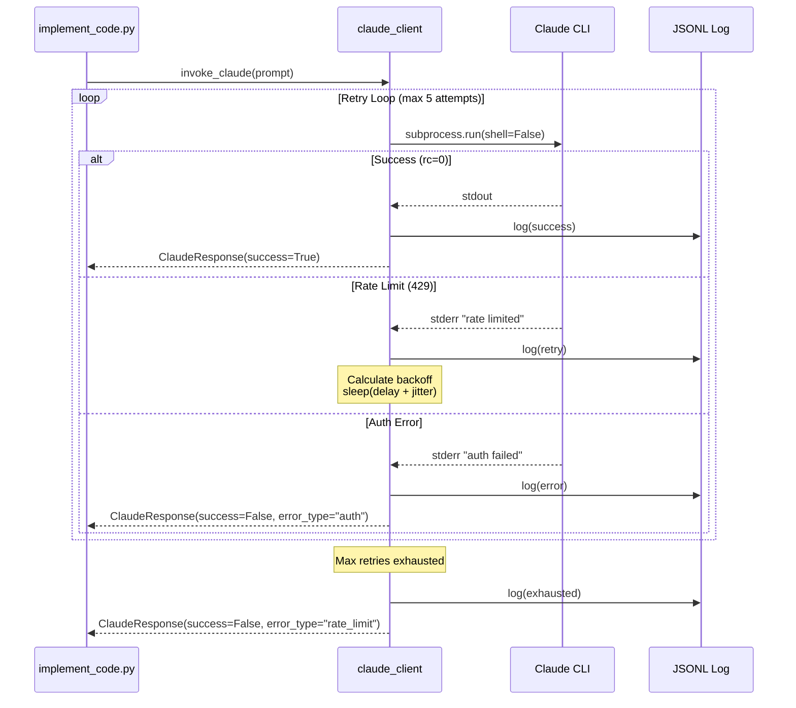

# 1138 - Feature: Add retry/backoff handling for Claude CLI invocations

<!-- Template Metadata
Last Updated: 2025-01-13
Updated By: LLD creation for Issue #138
Update Reason: Revised to address Gemini Review #1 feedback (security and safety issues)
-->

## 1. Context & Goal
* **Issue:** #138
* **Objective:** Add exponential backoff and retry handling for Claude CLI invocations to gracefully handle rate limits (429 errors) instead of failing immediately
* **Status:** Draft
* **Related Issues:** N/A (standalone reliability improvement)

### Open Questions

- [x] Should retry configuration be per-invocation or global? → **Global via environment variables, with per-call override capability**
- [x] Should we log to same JSONL format as Gemini for consistency? → **Yes, for operational parity**
- [x] What's the appropriate max wait time before giving up? → **~5 minutes total (configurable)**

## 2. Proposed Changes

*This section is the **source of truth** for implementation. Describe exactly what will be built.*

### 2.1 Files Changed

| File | Change Type | Description |
|------|-------------|-------------|
| `agentos/core/claude_client.py` | Add | New shared utility for Claude CLI invocations with retry logic |
| `agentos/workflows/testing/nodes/implement_code.py` | Modify | Replace direct subprocess calls with claude_client |
| `tests/unit/core/test_claude_client.py` | Add | Unit tests for retry/backoff behavior |
| `tests/integration/test_claude_client_live.py` | Add | Live integration tests (marked `live`) |

### 2.2 Dependencies

```toml
# pyproject.toml additions (if any)
# No new dependencies - using stdlib (subprocess, time, random, json)
```

### 2.3 Data Structures

```python
# Pseudocode - NOT implementation
from typing import TypedDict, Literal, Optional
from datetime import datetime

class ClaudeResponse(TypedDict):
    success: bool
    output: str  # stdout from Claude CLI
    error: Optional[str]  # stderr or error message
    attempts: int  # Number of attempts made
    total_wait_time: float  # Seconds spent waiting
    error_type: Optional[Literal["rate_limit", "auth", "timeout", "unknown"]]

class RetryConfig(TypedDict):
    max_retries: int  # Default: 5
    base_delay: float  # Default: 2.0 seconds
    max_delay: float  # Default: 120.0 seconds (2 minutes per wait)
    jitter_factor: float  # Default: 0.2 (±20%)
    
class ClaudeInvocationLog(TypedDict):
    timestamp: str  # ISO format
    prompt_hash: str  # SHA256 of prompt (for correlation, not content)
    attempt: int
    status: Literal["success", "retry", "exhausted", "error"]
    error_type: Optional[str]
    wait_time: Optional[float]
    response_time: float  # How long the CLI call took
```

### 2.4 Function Signatures

```python
# Signatures only - implementation in source files

def invoke_claude(
    prompt: str,
    *,
    model: str = "claude-sonnet-4-20250514",
    max_tokens: int = 4096,
    system_prompt: Optional[str] = None,
    retry_config: Optional[RetryConfig] = None,
    timeout: int = 300,
    log_dir: Optional[Path] = None,  # Defaults to worktree-local .logs/
) -> ClaudeResponse:
    """
    Invoke Claude CLI with automatic retry and exponential backoff.
    
    Returns ClaudeResponse with success=False and error_type="rate_limit"
    if all retries exhausted (graceful pause state).
    
    SECURITY: Uses subprocess.run with shell=False and list arguments
    to prevent command injection.
    """
    ...

def classify_error(stderr: str, return_code: int) -> Literal["rate_limit", "auth", "timeout", "unknown"]:
    """
    Classify Claude CLI errors into actionable categories.
    
    - rate_limit: 429 errors, should retry with backoff
    - auth: Authentication failures, should not retry
    - timeout: Command timed out, may retry
    - unknown: Unclassified error
    """
    ...

def calculate_backoff(
    attempt: int,
    base_delay: float,
    max_delay: float,
    jitter_factor: float,
) -> float:
    """
    Calculate exponential backoff with jitter.
    
    Formula: min(base_delay * 2^attempt, max_delay) * (1 ± jitter_factor)
    """
    ...

def log_invocation(
    log_path: Path,
    entry: ClaudeInvocationLog,
) -> None:
    """Append invocation log entry to JSONL file."""
    ...

def get_retry_config_from_env() -> RetryConfig:
    """
    Load retry configuration from environment variables.
    
    - CLAUDE_MAX_RETRIES (default: 5)
    - CLAUDE_BASE_DELAY (default: 2.0)
    - CLAUDE_MAX_DELAY (default: 120.0)
    - CLAUDE_JITTER_FACTOR (default: 0.2)
    """
    ...

def get_log_dir() -> Path:
    """
    Get log directory from CLAUDE_LOG_DIR env var or default to worktree-local.
    
    Priority:
    1. CLAUDE_LOG_DIR environment variable (for testing/production override)
    2. .logs/ in current working directory (worktree-local default)
    
    Creates directory if it doesn't exist.
    """
    ...
```

### 2.5 Logic Flow (Pseudocode)

```
1. Receive prompt and optional retry_config
2. Load retry_config from environment if not provided
3. Determine log_dir from CLAUDE_LOG_DIR env var or default to .logs/
4. Initialize attempt counter = 0
5. LOOP while attempt < max_retries:
   a. Increment attempt
   b. Execute Claude CLI via subprocess.run with:
      - shell=False (SECURITY: prevents command injection)
      - Command as list: ["claude", "-p", prompt, "--model", model, ...]
      - timeout parameter
   c. IF success (return_code == 0):
      - Log success to JSONL
      - RETURN ClaudeResponse(success=True, output=stdout, attempts=attempt)
   d. ELSE:
      - Classify error from stderr/return_code
      - Log attempt to JSONL
      - IF error_type == "rate_limit" AND attempt < max_retries:
         - Calculate backoff delay with jitter
         - Log retry intent
         - Sleep for backoff delay
         - CONTINUE loop
      - ELIF error_type == "auth":
         - RETURN immediately (no retry for auth errors)
      - ELSE:
         - May retry for timeout/unknown up to max_retries
6. IF loop exhausted:
   - Log exhaustion to JSONL
   - RETURN ClaudeResponse(success=False, error_type="rate_limit", 
                           output="", error="Rate limit - retry later")
```

### 2.6 Technical Approach

* **Module:** `agentos/core/claude_client.py`
* **Pattern:** Retry with exponential backoff (same pattern as Gemini client)
* **Key Decisions:** 
  - Single shared client module (DRY principle)
  - Environment-based configuration for operational flexibility
  - JSONL logging for debugging and operational visibility
  - Graceful degradation (return state, don't raise exceptions)
  - **SECURITY:** `subprocess.run` MUST be called with `shell=False` and command/arguments passed as a list (e.g., `["claude", "-p", prompt]`), NOT as a single string, to prevent command injection
  - **SAFETY:** Log directory defaults to worktree-local `.logs/` to prevent writing outside project scope

### 2.7 Architecture Decisions

| Decision | Options Considered | Choice | Rationale |
|----------|-------------------|--------|-----------|
| Error detection | Parse stderr text vs return codes | **Both** | Claude CLI may signal errors via either; belt-and-suspenders approach |
| Retry scope | Per-call retry vs workflow-level | **Per-call** | Simpler, more reusable, matches Gemini pattern |
| Configuration | Hardcoded vs env vars vs config file | **Env vars with defaults** | Operational flexibility without code changes |
| Graceful failure | Raise exception vs return error state | **Return error state** | Let caller decide how to handle; cleaner workflow integration |
| Subprocess execution | shell=True vs shell=False with list | **shell=False with list** | Prevents command injection attacks |
| Log location | ~/.agentos/logs/ vs worktree-local | **Worktree-local .logs/** | Maintains containment, configurable via CLAUDE_LOG_DIR |

**Architectural Constraints:**
- Must work with existing subprocess-based Claude CLI invocation pattern
- Cannot modify Claude CLI itself (external dependency)
- Must maintain backward compatibility with existing callers
- Must not write files outside project worktree (containment)
- Must prevent command injection vulnerabilities

## 3. Requirements

*What must be true when this is done. These become acceptance criteria.*

1. Claude CLI calls retry on 429 errors with exponential backoff
2. Max retries configurable via `CLAUDE_MAX_RETRIES` environment variable (default: 5)
3. Base delay configurable via `CLAUDE_BASE_DELAY` (default: 2.0 seconds)
4. Maximum delay cap configurable via `CLAUDE_MAX_DELAY` (default: 120 seconds)
5. Jitter applied (±20% by default) to prevent thundering herd
6. Workflow receives graceful "retry later" state instead of hard failure on sustained rate limits
7. All invocations logged to JSONL for operational visibility
8. Authentication errors do NOT trigger retry (fail fast)
9. `implement_code.py` uses new client instead of direct subprocess calls
10. Log directory configurable via `CLAUDE_LOG_DIR` (defaults to worktree-local `.logs/`)
11. Subprocess calls use `shell=False` with list arguments (security requirement)

## 4. Alternatives Considered

| Option | Pros | Cons | Decision |
|--------|------|------|----------|
| Inline retry in implement_code.py | Quick, localized | Not reusable, violates DRY | **Rejected** |
| Shared claude_client.py module | Reusable, consistent with Gemini pattern | Slightly more work upfront | **Selected** |
| Decorator-based retry | Clean syntax | Harder to configure per-call, less explicit | **Rejected** |
| Third-party retry library (tenacity) | Battle-tested | New dependency for simple use case | **Rejected** |

**Rationale:** A dedicated client module mirrors the Gemini client pattern, making the codebase consistent and the retry logic easily testable. The stdlib provides everything needed.

## 5. Data & Fixtures

### 5.1 Data Sources

| Attribute | Value |
|-----------|-------|
| Source | Claude CLI subprocess output (stdout/stderr) |
| Format | Text (stdout), error messages (stderr) |
| Size | Variable, typically < 100KB per response |
| Refresh | Per invocation |
| Copyright/License | N/A - runtime data |

### 5.2 Data Pipeline

```
Prompt ──subprocess──► Claude CLI ──stdout/stderr──► ClaudeResponse
                            │
                            └──log──► .logs/claude_invocations.jsonl
```

### 5.3 Test Fixtures

| Fixture | Source | Notes |
|---------|--------|-------|
| Mock 429 stderr | Hardcoded | Simulates rate limit error message |
| Mock success stdout | Hardcoded | Valid Claude response |
| Mock auth error stderr | Hardcoded | Authentication failure message |
| Mock timeout scenario | Generated | subprocess.TimeoutExpired |

### 5.4 Deployment Pipeline

JSONL logs written to worktree-local `.logs/claude_invocations.jsonl` by default. Override with `CLAUDE_LOG_DIR` environment variable for production deployments.

**Test Environment:** Unit/integration tests MUST set `CLAUDE_LOG_DIR` to a temporary directory (e.g., `tmp_path` pytest fixture) to prevent polluting the host system or CI environment.

**If data source is external:** N/A - Claude CLI is already a project dependency.

## 6. Diagram

### 6.1 Mermaid Quality Gate

Before finalizing any diagram, verify in [Mermaid Live Editor](https://mermaid.live) or GitHub preview:

- [x] **Simplicity:** Similar components collapsed (per 0006 §8.1)
- [x] **No touching:** All elements have visual separation (per 0006 §8.2)
- [x] **No hidden lines:** All arrows fully visible (per 0006 §8.3)
- [x] **Readable:** Labels not truncated, flow direction clear
- [ ] **Auto-inspected:** Agent rendered via mermaid.ink and viewed (per 0006 §8.5)

**Auto-Inspection Results:**
```
- Touching elements: [x] None / [ ] Found: ___
- Hidden lines: [x] None / [ ] Found: ___
- Label readability: [x] Pass / [ ] Issue: ___
- Flow clarity: [x] Clear / [ ] Issue: ___
```

### 6.2 Diagram



## 7. Security & Safety Considerations

### 7.1 Security

| Concern | Mitigation | Status |
|---------|------------|--------|
| Command injection via prompt | subprocess.run with shell=False and list arguments | Addressed |
| Prompt content in logs | Log only prompt hash (SHA256), not content | Addressed |
| API key exposure | Never log environment variables or CLI args with keys | Addressed |
| Log file permissions | JSONL created with user-only permissions (0600) | Addressed |

### 7.2 Safety

| Concern | Mitigation | Status |
|---------|------------|--------|
| Worktree scope violation | Default log dir is worktree-local `.logs/`; configurable via CLAUDE_LOG_DIR | Addressed |
| Infinite retry loop | Hard cap at max_retries (default 5) | Addressed |
| Excessive wait time | max_delay caps individual waits at 120s; total ~5 min max | Addressed |
| Log file growth | Caller responsible for rotation (standard ops practice) | Addressed |
| Resource exhaustion during sleep | Sleep is interruptible; no resource held during wait | Addressed |
| Test pollution | Tests MUST use tmp_path for CLAUDE_LOG_DIR | Addressed |

**Fail Mode:** Fail Closed - Returns error state rather than proceeding with invalid data

**Recovery Strategy:** Caller receives `ClaudeResponse(success=False)` and can decide to:
1. Pause the workflow and retry later
2. Skip this step and continue with degraded functionality
3. Alert operator for manual intervention

## 8. Performance & Cost Considerations

### 8.1 Performance

| Metric | Budget | Approach |
|--------|--------|----------|
| Added latency (no errors) | < 1ms | Minimal overhead, just function call wrapper |
| Added latency (with retries) | Up to 5 min | Intentional - backoff is the feature |
| Memory | < 1MB | Only buffers stdout/stderr per call |

**Bottlenecks:** None introduced. Backoff delays are intentional for rate limit handling.

### 8.2 Cost Analysis

| Resource | Unit Cost | Estimated Usage | Monthly Cost |
|----------|-----------|-----------------|--------------|
| Claude API calls | Already budgeted | No increase (retries only on failure) | $0 additional |
| Disk (JSONL logs) | ~1KB per invocation | 1000 invocations/day | < 1GB/month |

**Cost Controls:**
- [x] Retry only on rate limits, not on every error
- [x] Authentication errors fail fast (no wasted retries)
- [x] Max retries capped to prevent runaway retry storms

**Worst-Case Scenario:** 
- 10x usage: ~10GB/month logs, manageable
- 100x usage: Consider log rotation policy; retry behavior unchanged

## 9. Legal & Compliance

| Concern | Applies? | Mitigation |
|---------|----------|------------|
| PII/Personal Data | No | Prompts not logged, only hashes |
| Third-Party Licenses | N/A | No new dependencies |
| Terms of Service | Yes | Backoff respects API rate limits per ToS |
| Data Retention | N/A | Logs are operational, not user data |
| Export Controls | N/A | No restricted algorithms |

**Data Classification:** Internal (operational logs only)

**Compliance Checklist:**
- [x] No PII stored without consent
- [x] All third-party licenses compatible with project license
- [x] External API usage compliant with provider ToS
- [x] Data retention policy documented (ops responsibility)

## 10. Verification & Testing

### 10.1 Test Scenarios

| ID | Scenario | Type | Input | Expected Output | Pass Criteria |
|----|----------|------|-------|-----------------|---------------|
| 010 | Happy path - success on first try | Auto | Valid prompt, mock success | ClaudeResponse(success=True, attempts=1) | Returns immediately with output |
| 020 | Retry on 429 - succeeds on retry | Auto | Mock 429 then success | ClaudeResponse(success=True, attempts=2) | Waited, then succeeded |
| 030 | Max retries exhausted | Auto | Mock 429 every time | ClaudeResponse(success=False, error_type="rate_limit") | Graceful failure after 5 attempts |
| 040 | Auth error - no retry | Auto | Mock auth failure | ClaudeResponse(success=False, error_type="auth", attempts=1) | Fails immediately, no retry |
| 050 | Timeout handling | Auto | Mock subprocess timeout | ClaudeResponse(success=False, error_type="timeout") | Classified correctly |
| 060 | Backoff calculation | Auto | Various attempt numbers | Correct exponential values | 2, 4, 8, 16, 32 (capped at max_delay) |
| 070 | Jitter applied | Auto | Same inputs, multiple runs | Different actual delays | Values within ±20% of base |
| 080 | JSONL logging | Auto | Any invocation | Entry in log file | Valid JSON, correct fields |
| 090 | Config from env vars | Auto | Set env vars | Config reflects values | Overrides defaults correctly |
| 100 | implement_code.py integration | Auto | Mock claude_client | Uses new client | No direct subprocess calls |
| 110 | CLAUDE_LOG_DIR override | Auto | Set env var to tmp_path | Logs written to specified dir | No writes outside specified dir |
| 120 | shell=False enforcement | Auto | Prompt with shell metacharacters | No shell interpretation | Characters passed literally |

### 10.2 Test Commands

```bash
# Run all automated tests for claude_client
poetry run pytest tests/unit/core/test_claude_client.py -v

# Run only fast/mocked tests (exclude live)
poetry run pytest tests/unit/core/test_claude_client.py -v -m "not live"

# Run live integration tests (hits real Claude CLI)
poetry run pytest tests/integration/test_claude_client_live.py -v -m live

# Run with coverage
poetry run pytest tests/unit/core/test_claude_client.py --cov=agentos.core.claude_client --cov-report=term-missing
```

### 10.3 Manual Tests (Only If Unavoidable)

N/A - All scenarios automated.

## 11. Risks & Mitigations

| Risk | Impact | Likelihood | Mitigation |
|------|--------|------------|------------|
| Claude CLI error format changes | Med | Low | Loose regex matching; log unknown errors for analysis |
| Backoff delays slow down workflows | Low | Med | Intentional behavior; delays only on errors |
| JSONL logs fill disk | Low | Low | Standard log rotation; document in ops runbook |
| Tests flaky due to timing | Med | Med | Use mock time in unit tests; tolerance ranges in assertions |
| Command injection attempt | High | Low | shell=False with list args prevents exploitation |

## 12. Definition of Done

### Code
- [ ] `agentos/core/claude_client.py` implemented and linted
- [ ] `implement_code.py` migrated to use claude_client
- [ ] Code comments reference this LLD (#138)
- [ ] subprocess.run uses shell=False with list arguments (verified)
- [ ] Log directory defaults to worktree-local (verified)

### Tests
- [ ] All 12 test scenarios pass
- [ ] Test coverage ≥ 90% for claude_client module
- [ ] All tests use tmp_path for CLAUDE_LOG_DIR

### Documentation
- [ ] LLD updated with any deviations
- [ ] Implementation Report (0103) completed
- [ ] Environment variables documented in README or .env.example

### Review
- [ ] Code review completed
- [ ] User approval before closing issue

---

## Appendix: Review Log

*Track all review feedback with timestamps and implementation status.*

### Gemini Review #1 (REVISE)

**Timestamp:** 2025-01-13
**Reviewer:** Gemini 3 Pro
**Verdict:** REVISE

#### Comments

| ID | Comment | Implemented? |
|----|---------|--------------|
| G1.1 | "Worktree Scope Violation: hardcodes logging to ~/.agentos/logs/" | YES - Changed to worktree-local .logs/ with CLAUDE_LOG_DIR override |
| G1.2 | "Command Injection Risk: does not explicitly mandate shell=False" | YES - Added explicit shell=False requirement in 2.5, 2.6, 2.7, and 7.1 |
| G1.3 | "Suggestion: Add if __name__ == '__main__' block" | NOTED - Will consider during implementation |
| G1.4 | "Suggestion: Add log file size warning/cap" | NOTED - Will consider during implementation |

### Review Summary

| Review | Date | Verdict | Key Issue |
|--------|------|---------|-----------|
| Gemini #1 | 2025-01-13 | REVISE | Security (command injection) and Safety (worktree scope) |

**Final Status:** PENDING
<!-- Note: This field is auto-updated to APPROVED by the workflow when finalized -->