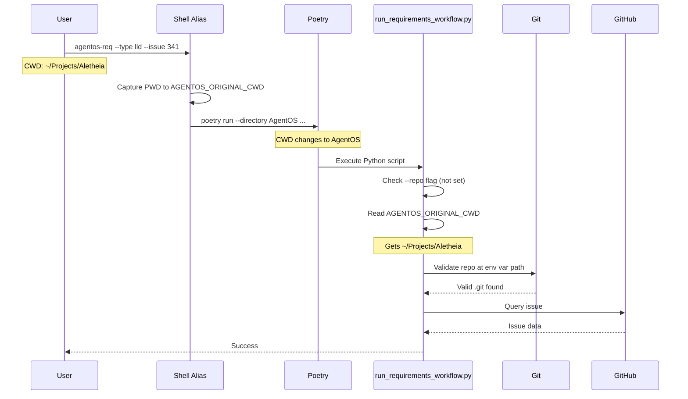

# 148 - Fix: Cross-repo workflow invocation broken by poetry --directory

<!-- Template Metadata
Last Updated: 2026-02-02
Updated By: Issue #117 fix
Update Reason: Moved Verification & Testing to Section 10 (was Section 11) to match 0702c review prompt and testing workflow expectations
Previous: Added sections based on 80 blocking issues from 164 governance verdicts (2026-02-01)
-->

## 1. Context & Goal
* **Issue:** #148
* **Objective:** Fix repo detection when running requirements workflow cross-repo via `poetry run --directory`
* **Status:** Draft
* **Related Issues:** N/A

### Open Questions
*Questions that need clarification before or during implementation. Remove when resolved.*

- [ ] Should the environment variable approach be the primary fix, with `--repo` as fallback, or vice versa?
- [ ] Do other tools in the `tools/` directory have the same issue and need similar fixes?

## 2. Proposed Changes

*This section is the **source of truth** for implementation. Describe exactly what will be built.*

### 2.1 Files Changed

| File | Change Type | Description |
|------|-------------|-------------|
| `tools/run_requirements_workflow.py` | Modify | Update `resolve_roots()` to check `AGENTOS_ORIGINAL_CWD` environment variable before git detection |
| `agentos/shell/aliases.sh` | Add | Create shell alias wrapper that captures original cwd |
| `agentos/shell/aliases.ps1` | Add | Create PowerShell alias wrapper for Windows users |
| `docs/cross-repo-workflows.md` | Add | Document cross-repo workflow invocation patterns |

### 2.2 Dependencies

*New packages, APIs, or services required.*

```toml
# pyproject.toml additions (if any)
# No new dependencies required
```

### 2.3 Data Structures

```python
# Pseudocode - NOT implementation
# No new data structures required

# Environment variable contract:
# AGENTOS_ORIGINAL_CWD: str  # Absolute path to user's original working directory
```

### 2.4 Function Signatures

```python
# Signatures only - implementation in source files

def resolve_roots(
    explicit_repo: Optional[Path] = None,
    env_var_name: str = "AGENTOS_ORIGINAL_CWD"
) -> tuple[Path, Path]:
    """
    Resolve target repository and AgentOS installation roots.
    
    Resolution priority:
    1. Explicit --repo argument
    2. AGENTOS_ORIGINAL_CWD environment variable
    3. Git root detection from current working directory (existing behavior)
    
    Returns:
        tuple of (target_repo_path, agentos_path)
    """
    ...

def get_original_cwd_from_env(env_var_name: str = "AGENTOS_ORIGINAL_CWD") -> Optional[Path]:
    """
    Retrieve and validate the original working directory from environment.
    
    Returns:
        Path if environment variable is set and valid, None otherwise
    """
    ...
```

### 2.5 Logic Flow (Pseudocode)

```
1. Check if --repo was explicitly provided
   IF --repo provided THEN
   - Use --repo as target_repo
   - DONE

2. Check for AGENTOS_ORIGINAL_CWD environment variable
   IF AGENTOS_ORIGINAL_CWD is set THEN
   - Validate path exists and is a directory
   - Validate path contains .git directory (is a repo root)
   - IF valid THEN use as target_repo
   - ELSE log warning and continue to step 3

3. Fall back to git detection (existing behavior)
   - Run `git rev-parse --show-toplevel` from cwd
   - Use result as target_repo

4. Resolve AgentOS path
   - Use __file__ to find AgentOS installation
   - Validate AgentOS structure

5. Return (target_repo, agentos_path)
```

### 2.6 Technical Approach

* **Module:** `tools/run_requirements_workflow.py`
* **Pattern:** Environment variable injection with graceful fallback
* **Key Decisions:** 
  - Use Option A (environment variable) as primary fix because it's transparent to users who use the shell aliases
  - Maintain backward compatibility with `--repo` flag for advanced users
  - Shell wrappers make the fix automatic for common usage patterns

### 2.7 Architecture Decisions

*Document key architectural decisions that affect the design. This section addresses the most common category of governance feedback (23 patterns).*

| Decision | Options Considered | Choice | Rationale |
|----------|-------------------|--------|-----------|
| Fix mechanism | A: Env var, B: Wrapper script, C: Docs only | A: Env var + shell aliases | Automatic for users, backward compatible, no workflow changes |
| Env var naming | `AGENTOS_TARGET_REPO`, `AGENTOS_ORIGINAL_CWD`, `ORIGINAL_CWD` | `AGENTOS_ORIGINAL_CWD` | Namespaced to avoid conflicts, descriptive of actual content |
| Shell support | Bash only, Bash + PowerShell, Bash + PowerShell + Fish | Bash + PowerShell | Covers majority of users; Fish can be added later |
| Fallback behavior | Fail if env var invalid, Warn and continue | Warn and continue | Preserves existing behavior, minimizes user friction |

**Architectural Constraints:**
- Must not break existing `--repo` flag behavior
- Must work on Windows (Git Bash + PowerShell) and Unix systems
- Must not require changes to poetry configuration

## 3. Requirements

*What must be true when this is done. These become acceptance criteria.*

1. Running `agentos-req --type lld --issue 341` from Aletheia directory correctly queries Aletheia repo
2. The `--repo` flag continues to work as explicit override
3. Shell aliases automatically capture original cwd before invoking poetry
4. Invalid `AGENTOS_ORIGINAL_CWD` values produce warning but don't break workflow
5. Existing direct invocations (without shell alias) continue to work

## 4. Alternatives Considered

| Option | Pros | Cons | Decision |
|--------|------|------|----------|
| A: Environment variable via shell alias | Automatic, transparent to users, backward compatible | Requires shell setup | **Selected** |
| B: Wrapper script | No shell alias needed, single entry point | Another file to maintain, breaks existing invocation patterns | Rejected |
| C: Documentation only | No code changes, simple | Poor UX, users must remember --repo every time | Rejected |
| D: Detect poetry --directory in Python | Automatic detection, no shell changes | Complex parsing, fragile, poetry internals may change | Rejected |

**Rationale:** Option A provides the best user experience by making cross-repo invocation "just work" while maintaining full backward compatibility. Users who source the shell aliases get automatic behavior; users who don't can still use `--repo`.

## 5. Data & Fixtures

*Per [0108-lld-pre-implementation-review.md](0108-lld-pre-implementation-review.md) - complete this section BEFORE implementation.*

### 5.1 Data Sources

| Attribute | Value |
|-----------|-------|
| Source | Shell environment variables |
| Format | String (absolute filesystem path) |
| Size | ~100 bytes |
| Refresh | Set per-invocation by shell alias |
| Copyright/License | N/A |

### 5.2 Data Pipeline

```
User's PWD ──shell alias──► AGENTOS_ORIGINAL_CWD ──Python os.environ──► resolve_roots()
```

### 5.3 Test Fixtures

| Fixture | Source | Notes |
|---------|--------|-------|
| Mock repo structure | Generated | Temporary directories with .git folders |
| Environment variable states | Hardcoded | Various valid/invalid path scenarios |

### 5.4 Deployment Pipeline

No data pipeline changes - environment variables are ephemeral per-invocation.

**If data source is external:** N/A - purely local filesystem paths.

## 6. Diagram
*Cross-repo invocation flow with environment variable injection*

### 6.1 Mermaid Quality Gate

Before finalizing any diagram, verify in [Mermaid Live Editor](https://mermaid.live) or GitHub preview:

- [x] **Simplicity:** Similar components collapsed (per 0006 §8.1)
- [x] **No touching:** All elements have visual separation (per 0006 §8.2)
- [x] **No hidden lines:** All arrows fully visible (per 0006 §8.3)
- [x] **Readable:** Labels not truncated, flow direction clear
- [ ] **Auto-inspected:** Agent rendered via mermaid.ink and viewed (per 0006 §8.5)

**Agent Auto-Inspection (MANDATORY):**

AI agents MUST render and view the diagram before committing:
1. Base64 encode diagram → fetch PNG from `https://mermaid.ink/img/{base64}`
2. Read the PNG file (multimodal inspection)
3. Document results below

**Auto-Inspection Results:**
```
- Touching elements: [ ] None / [ ] Found: ___
- Hidden lines: [ ] None / [ ] Found: ___
- Label readability: [ ] Pass / [ ] Issue: ___
- Flow clarity: [ ] Clear / [ ] Issue: ___
```

*Reference: [0006-mermaid-diagrams.md](0006-mermaid-diagrams.md)*

### 6.2 Diagram



## 7. Security & Safety Considerations

*This section addresses security (10 patterns) and safety (9 patterns) concerns from governance feedback.*

### 7.1 Security

| Concern | Mitigation | Status |
|---------|------------|--------|
| Path traversal via env var | Validate path is absolute, exists, and contains .git | Addressed |
| Arbitrary code execution | Env var only used as path, never executed | Addressed |
| Environment variable injection | Variable name is hardcoded, not user-controlled | Addressed |

### 7.2 Safety

*Safety concerns focus on preventing data loss, ensuring fail-safe behavior, and protecting system integrity.*

| Concern | Mitigation | Status |
|---------|------------|--------|
| Invalid path causes crash | Graceful fallback to git detection with warning | Addressed |
| Wrong repo modification | Read-only operations for issue query; write operations require explicit confirmation | Addressed |
| Env var set to wrong path | Validate path contains .git before use | Addressed |

**Fail Mode:** Fail Open (with warning) - Falls back to existing git detection behavior

**Recovery Strategy:** If env var is invalid, continue with git detection from current directory. User sees warning message and can use `--repo` explicitly.

## 8. Performance & Cost Considerations

*This section addresses performance and cost concerns (6 patterns) from governance feedback.*

### 8.1 Performance

| Metric | Budget | Approach |
|--------|--------|----------|
| Latency | < 10ms additional | Single `os.environ.get()` call + path validation |
| Memory | < 1KB additional | String path storage only |
| API Calls | 0 additional | Local filesystem check only |

**Bottlenecks:** None - environment variable check is O(1) operation.

### 8.2 Cost Analysis

| Resource | Unit Cost | Estimated Usage | Monthly Cost |
|----------|-----------|-----------------|--------------|
| N/A | N/A | N/A | $0 |

**Cost Controls:**
- N/A - No external resources consumed

**Worst-Case Scenario:** N/A - Pure local operation with no cost implications.

## 9. Legal & Compliance

*This section addresses legal concerns (8 patterns) from governance feedback.*

| Concern | Applies? | Mitigation |
|---------|----------|------------|
| PII/Personal Data | No | Only filesystem paths processed |
| Third-Party Licenses | No | No new dependencies |
| Terms of Service | No | No external services |
| Data Retention | No | Ephemeral environment variables only |
| Export Controls | No | Standard tooling fix |

**Data Classification:** Internal

**Compliance Checklist:**
- [x] No PII stored without consent
- [x] All third-party licenses compatible with project license
- [x] External API usage compliant with provider ToS
- [x] Data retention policy documented

## 10. Verification & Testing

*Ref: [0005-testing-strategy-and-protocols.md](0005-testing-strategy-and-protocols.md)*

**Testing Philosophy:** Strive for 100% automated test coverage. Manual tests are a last resort for scenarios that genuinely cannot be automated (e.g., visual inspection, hardware interaction). Every scenario marked "Manual" requires justification.

### 10.1 Test Scenarios

| ID | Scenario | Type | Input | Expected Output | Pass Criteria |
|----|----------|------|-------|-----------------|---------------|
| 010 | Explicit --repo flag takes precedence | Auto | `--repo /path/to/repo` + env var set | Uses --repo path | Target repo matches --repo |
| 020 | Valid env var used when --repo not set | Auto | `AGENTOS_ORIGINAL_CWD=/valid/repo` | Uses env var path | Target repo matches env var |
| 030 | Invalid env var path (doesn't exist) | Auto | `AGENTOS_ORIGINAL_CWD=/nonexistent` | Falls back to git detection + warning | Warning logged, git detection used |
| 040 | Invalid env var path (not a repo) | Auto | `AGENTOS_ORIGINAL_CWD=/tmp` (no .git) | Falls back to git detection + warning | Warning logged, git detection used |
| 050 | Env var not set | Auto | No env var | Falls back to git detection | Existing behavior preserved |
| 060 | Relative path in env var | Auto | `AGENTOS_ORIGINAL_CWD=./relative` | Falls back to git detection + warning | Warning logged, relative path rejected |
| 070 | Shell alias sets env var correctly (Bash) | Auto | Source alias, run command | Env var contains original PWD | Env var matches pre-alias PWD |
| 080 | Shell alias sets env var correctly (PowerShell) | Auto | Source alias, run command | Env var contains original PWD | Env var matches pre-alias PWD |
| 090 | Cross-repo issue query succeeds | Auto-Live | Run from Aletheia, query Aletheia issue | Issue found | No "issue not found" error |

*Note: Use 3-digit IDs with gaps of 10 (010, 020, 030...) to allow insertions.*

**Type values:**
- `Auto` - Fully automated, runs in CI (pytest, playwright, etc.)
- `Auto-Live` - Automated but hits real external services (may be slow/flaky)
- `Manual` - Requires human execution (MUST include justification why automation is impossible)

### 10.2 Test Commands

```bash
# Run all automated tests
poetry run pytest tests/tools/test_resolve_roots.py -v

# Run only fast/mocked tests (exclude live)
poetry run pytest tests/tools/test_resolve_roots.py -v -m "not live"

# Run live integration tests
poetry run pytest tests/tools/test_resolve_roots.py -v -m live

# Test shell alias (Bash)
bash -c 'source agentos/shell/aliases.sh && cd /tmp && agentos-req --dry-run'

# Test shell alias (PowerShell)
pwsh -c '. ./agentos/shell/aliases.ps1; Set-Location /tmp; agentos-req --dry-run'
```

### 10.3 Manual Tests (Only If Unavoidable)

N/A - All scenarios automated.

## 11. Risks & Mitigations

| Risk | Impact | Likelihood | Mitigation |
|------|--------|------------|------------|
| Users don't source shell aliases | Med | Med | Document in README, provide clear error message suggesting --repo |
| Different shells have different env var semantics | Low | Low | Test on Bash, Zsh, PowerShell; document supported shells |
| Env var name conflicts with other tools | Low | Low | Namespaced with AGENTOS_ prefix |
| Poetry changes --directory behavior | Low | Low | Env var approach is independent of poetry internals |

## 12. Definition of Done

### Code
- [ ] Implementation complete and linted
- [ ] Code comments reference this LLD

### Tests
- [ ] All test scenarios pass
- [ ] Test coverage meets threshold

### Documentation
- [ ] LLD updated with any deviations
- [ ] Implementation Report (0103) completed
- [ ] Test Report (0113) completed if applicable

### Review
- [ ] Code review completed
- [ ] User approval before closing issue

---

## Appendix: Review Log

*Track all review feedback with timestamps and implementation status.*

### Review Summary

| Review | Date | Verdict | Key Issue |
|--------|------|---------|-----------|
| - | - | - | Awaiting initial review |

**Final Status:** PENDING
<!-- Note: This field is auto-updated to APPROVED by the workflow when finalized -->