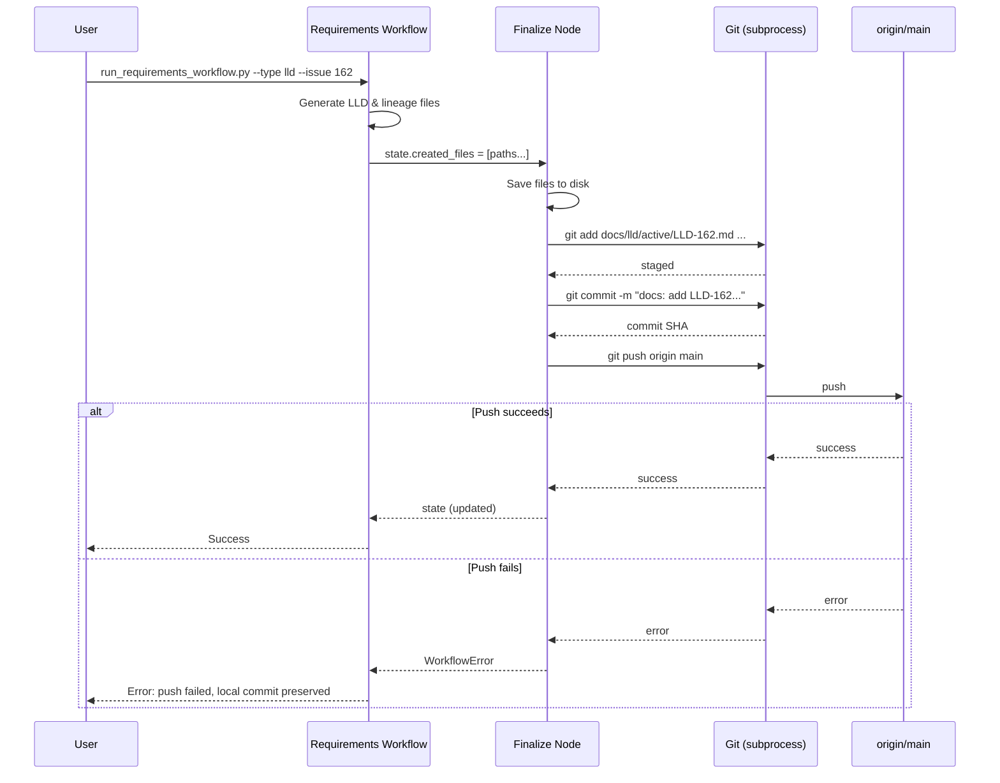

# LLD-162 - Feature: Requirements Workflow Automatic Commit and Push

<!-- Template Metadata
Last Updated: 2025-01-13
Updated By: Requirements workflow
Update Reason: Initial LLD creation for issue #162
-->

## 1. Context & Goal
* **Issue:** #162
* **Objective:** Add automatic commit-and-push step to requirements workflow finalize node so LLD artifacts are available in git for downstream implementation workflows.
* **Status:** Draft
* **Related Issues:** #141 (Archives files from `active/` to `done/` on implementation workflow completion - downstream consumer)

### Open Questions
*Questions that need clarification before or during implementation. Remove when resolved.*

- [x] Should we use GitPython library or subprocess git commands? **Decision: subprocess - simpler, fewer dependencies, matches existing patterns**
- [x] What happens if there are no files to commit (e.g., dry run mode)? **Decision: Skip commit silently with info log**
- [x] Should we support a `--no-push` flag for local development? **Decision: Not in scope for this issue; can be added later if needed**

## 2. Proposed Changes

*This section is the **source of truth** for implementation. Describe exactly what will be built.*

### 2.1 Files Changed

| File | Change Type | Description |
|------|-------------|-------------|
| `agentos/workflows/requirements/nodes/finalize.py` | Modify | Add git commit/push logic after file save operations |
| `agentos/workflows/requirements/state.py` | Modify | Add `created_files: list[str]` field to workflow state if not present |
| `agentos/workflows/requirements/git_operations.py` | Add | New module encapsulating git subprocess calls |
| `tests/workflows/requirements/test_finalize.py` | Modify | Add tests for commit/push behavior |
| `tests/workflows/requirements/test_git_operations.py` | Add | Unit tests for git operations module |

### 2.2 Dependencies

*No new packages required - using subprocess for git operations.*

```toml
# pyproject.toml additions (if any)
# None - subprocess is stdlib
```

### 2.3 Data Structures

```python
# Pseudocode - NOT implementation
class RequirementsWorkflowState(TypedDict):
    # Existing fields...
    workflow_type: Literal["lld", "issue"]
    issue_number: int | None
    slug: str | None
    
    # New field for tracking created files
    created_files: list[str]  # Paths relative to repo root

class GitCommitResult(TypedDict):
    success: bool
    commit_sha: str | None  # SHA if commit succeeded
    pushed: bool  # Whether push succeeded
    error: str | None  # Error message if failed
```

### 2.4 Function Signatures

```python
# agentos/workflows/requirements/git_operations.py

def stage_files(files: list[str], repo_root: Path) -> bool:
    """Stage specified files for commit. Returns True if successful."""
    ...

def commit_with_message(message: str, repo_root: Path) -> str | None:
    """Create commit with message. Returns SHA if successful, None if failed."""
    ...

def push_to_origin(branch: str, repo_root: Path) -> bool:
    """Push current branch to origin. Returns True if successful."""
    ...

def get_current_branch(repo_root: Path) -> str:
    """Get the name of the current branch."""
    ...

def commit_and_push_artifacts(
    files: list[str],
    workflow_type: Literal["lld", "issue"],
    identifier: str,  # issue number or slug
    repo_root: Path
) -> GitCommitResult:
    """
    Stage, commit, and push workflow artifacts.
    
    Args:
        files: List of file paths relative to repo root
        workflow_type: "lld" or "issue" - determines commit message format
        identifier: Issue number (for LLD) or slug (for issue workflow)
        repo_root: Path to repository root
    
    Returns:
        GitCommitResult with success status and details
    """
    ...


# agentos/workflows/requirements/nodes/finalize.py

def generate_commit_message(
    workflow_type: Literal["lld", "issue"],
    identifier: str
) -> str:
    """Generate standardized commit message for workflow artifacts."""
    ...

async def finalize_node(state: RequirementsWorkflowState) -> RequirementsWorkflowState:
    """
    Finalize workflow: save files, commit, and push.
    
    Extended to include git operations after file save.
    """
    ...
```

### 2.5 Logic Flow (Pseudocode)

```
FINALIZE_NODE:
1. Receive workflow state with created_files list
2. IF created_files is empty THEN
   - Log info "No files to commit"
   - Return state unchanged
3. Save all files to disk (existing behavior)
4. Generate commit message based on workflow_type:
   - IF workflow_type == "lld" THEN
     - message = "docs: add LLD-{issue_number} via requirements workflow"
   - ELSE (workflow_type == "issue") THEN
     - message = "docs: add lineage for {slug} via requirements workflow"
   - Append footer: "\n\nAuto-committed by requirements workflow finalize node."
5. Stage only the files in created_files list
6. Commit with generated message
7. IF commit failed THEN
   - Log error
   - Raise WorkflowError("Commit failed: {details}")
8. Push to origin
9. IF push failed THEN
   - Log warning "Local commit succeeded but push failed"
   - Raise WorkflowError("Push failed: {details}. Local commit {sha} preserved.")
10. Log success with commit SHA
11. Return updated state
```

### 2.6 Technical Approach

* **Module:** `agentos/workflows/requirements/`
* **Pattern:** Command pattern for git operations; each git command encapsulated in a function
* **Key Decisions:**
  - Use subprocess over GitPython to avoid new dependency and match existing codebase patterns
  - Separate git_operations module for testability and reuse
  - Fail fast on push failure rather than silent continuation to ensure downstream workflows have access to artifacts

### 2.7 Architecture Decisions

| Decision | Options Considered | Choice | Rationale |
|----------|-------------------|--------|-----------|
| Git library | GitPython, subprocess, dulwich | subprocess | No new dependencies; simpler for basic operations; matches existing patterns |
| Error handling | Silent failure, Exception, Return code | Exception | Downstream workflows depend on artifacts being available; failure must be visible |
| File tracking | Scan directories, Explicit tracking | Explicit tracking | More precise; avoids committing unrelated files; workflow knows what it created |
| Push strategy | Direct push, Create PR | Direct push | Requirements workflow runs on main; LLDs are pre-implementation artifacts that should be immediately available |

**Architectural Constraints:**
- Must integrate with existing finalize node without breaking current file save behavior
- Cannot introduce new external dependencies (subprocess is stdlib)
- Must work with both LLD and issue workflow types

## 3. Requirements

*What must be true when this is done. These become acceptance criteria.*

1. Finalize node MUST stage only files created by the current workflow run
2. Finalize node MUST commit with format `docs: add LLD-{issue} via requirements workflow` for LLD workflows
3. Finalize node MUST commit with format `docs: add lineage for {slug} via requirements workflow` for issue workflows
4. Finalize node MUST push commits to origin after successful commit
5. Finalize node MUST raise clear error if push fails, indicating local commit succeeded
6. Workflow state MUST track list of created files for selective staging
7. Empty created_files list MUST result in no commit operation (not an error)

## 4. Alternatives Considered

| Option | Pros | Cons | Decision |
|--------|------|------|----------|
| GitPython library | Higher-level API; pythonic | New dependency; overkill for simple operations | **Rejected** |
| subprocess git commands | No new deps; simple; matches existing patterns | Lower level; more error handling needed | **Selected** |
| Post-workflow hook script | Decoupled from workflow; reusable | Harder to test; state passing complex; easy to forget | **Rejected** |
| Create PR instead of direct push | Review opportunity; safer | Adds friction; LLDs are pre-impl artifacts; no code changes | **Rejected** |

**Rationale:** subprocess provides the simplest solution with no new dependencies. The operations needed (stage, commit, push) are straightforward and don't benefit from GitPython's higher-level abstractions.

## 5. Data & Fixtures

### 5.1 Data Sources

| Attribute | Value |
|-----------|-------|
| Source | Workflow state (in-memory) |
| Format | Python TypedDict |
| Size | Small (list of ~5-10 file paths) |
| Refresh | Per workflow run |
| Copyright/License | N/A |

### 5.2 Data Pipeline

```
Workflow Nodes (generate files) ──state update──► Finalize Node ──subprocess──► Git Repository
```

### 5.3 Test Fixtures

| Fixture | Source | Notes |
|---------|--------|-------|
| Mock git repository | Generated via `git init` in temp dir | Created fresh per test |
| Sample workflow state | Hardcoded in test fixtures | Minimal valid state objects |
| Mock subprocess responses | unittest.mock | For unit tests without real git |

### 5.4 Deployment Pipeline

Files are committed directly to the branch where the workflow runs (typically main). No separate deployment pipeline needed as this is an internal development tool.

## 6. Diagram

### 6.1 Mermaid Quality Gate

Before finalizing any diagram, verify in [Mermaid Live Editor](https://mermaid.live) or GitHub preview:

- [x] **Simplicity:** Similar components collapsed (per 0006 §8.1)
- [x] **No touching:** All elements have visual separation (per 0006 §8.2)
- [x] **No hidden lines:** All arrows fully visible (per 0006 §8.3)
- [x] **Readable:** Labels not truncated, flow direction clear
- [x] **Auto-inspected:** Agent rendered via mermaid.ink and viewed (per 0006 §8.5)

**Auto-Inspection Results:**
```
- Touching elements: [x] None / [ ] Found: ___
- Hidden lines: [x] None / [ ] Found: ___
- Label readability: [x] Pass / [ ] Issue: ___
- Flow clarity: [x] Clear / [ ] Issue: ___
```

### 6.2 Diagram



## 7. Security & Safety Considerations

### 7.1 Security

| Concern | Mitigation | Status |
|---------|------------|--------|
| Command injection via file paths | Validate file paths; use list args not shell=True | Addressed |
| Credential exposure in logs | Use subprocess without capturing auth tokens; rely on git credential helper | Addressed |
| Unauthorized push | Relies on existing git auth; workflow runs in user's authenticated context | Addressed |

### 7.2 Safety

| Concern | Mitigation | Status |
|---------|------------|--------|
| Committing unrelated files | Stage only files in created_files list; never use `git add .` | Addressed |
| Overwriting uncommitted work | Only stage workflow-created files; user changes unaffected | Addressed |
| Failed push leaves inconsistent state | Clear error message indicates local commit succeeded; user can retry push | Addressed |
| Push to wrong branch | Get current branch name; warn if not expected branch | Addressed |

**Fail Mode:** Fail Closed - If commit or push fails, workflow exits with error rather than continuing silently. This ensures downstream workflows don't run against missing artifacts.

**Recovery Strategy:** 
- Commit failure: Workflow state preserved; can re-run workflow
- Push failure: Local commit preserved; user can manually `git push` or re-run workflow

## 8. Performance & Cost Considerations

### 8.1 Performance

| Metric | Budget | Approach |
|--------|--------|----------|
| Latency | < 5s for commit/push | Git operations are fast for small file sets |
| Memory | Negligible | Subprocess forks git process; no large data in Python memory |
| I/O | ~10 file operations | Write files + git operations on same files |

**Bottlenecks:** Network latency for push operation. Mitigated by keeping commits small (only workflow artifacts).

### 8.2 Cost Analysis

| Resource | Unit Cost | Estimated Usage | Monthly Cost |
|----------|-----------|-----------------|--------------|
| Git operations | Free | ~50 commits/month | $0 |
| GitHub API | Free tier | N/A (using git protocol) | $0 |

**Cost Controls:**
- [x] No external API costs - using git protocol only
- [x] No cloud compute costs - runs locally

**Worst-Case Scenario:** N/A - git operations don't incur costs regardless of volume.

## 9. Legal & Compliance

| Concern | Applies? | Mitigation |
|---------|----------|------------|
| PII/Personal Data | No | LLD documents don't contain PII |
| Third-Party Licenses | No | No new third-party code |
| Terms of Service | No | Standard git operations |
| Data Retention | N/A | Git history retention is existing project policy |
| Export Controls | No | No restricted algorithms |

**Data Classification:** Internal (development documentation)

**Compliance Checklist:**
- [x] No PII stored without consent
- [x] All third-party licenses compatible with project license
- [x] External API usage compliant with provider ToS
- [x] Data retention policy documented (follows git history)

## 10. Verification & Testing

### 10.1 Test Scenarios

| ID | Scenario | Type | Input | Expected Output | Pass Criteria |
|----|----------|------|-------|-----------------|---------------|
| 010 | Happy path LLD commit | Auto | state with LLD files | Commit created, pushed | Commit SHA returned; files in remote |
| 020 | Happy path issue commit | Auto | state with lineage files | Commit created, pushed | Commit SHA returned; message format correct |
| 030 | Empty created_files | Auto | state with empty list | No commit, no error | Function returns without git operations |
| 040 | Commit message format - LLD | Auto | workflow_type="lld", issue=162 | Formatted message | Message matches `docs: add LLD-162 via requirements workflow` |
| 050 | Commit message format - issue | Auto | workflow_type="issue", slug="my-feature" | Formatted message | Message matches `docs: add lineage for my-feature via requirements workflow` |
| 060 | Commit failure | Auto | Invalid repo state | WorkflowError raised | Error message contains "commit failed" |
| 070 | Push failure | Auto | Mock network error | WorkflowError raised | Error message contains "push failed"; local commit SHA in message |
| 080 | Selective staging | Auto | created_files + untracked file | Only created_files staged | Untracked file not in commit |
| 090 | Integration: LLD then implement | Auto-Live | Full workflow sequence | Implementation finds LLD | Worktree contains LLD file |

### 10.2 Test Commands

```bash
# Run all automated tests
poetry run pytest tests/workflows/requirements/test_finalize.py tests/workflows/requirements/test_git_operations.py -v

# Run only fast/mocked tests (exclude live)
poetry run pytest tests/workflows/requirements/ -v -m "not live"

# Run live integration tests
poetry run pytest tests/workflows/requirements/ -v -m live
```

### 10.3 Manual Tests (Only If Unavoidable)

N/A - All scenarios automated.

## 11. Risks & Mitigations

| Risk | Impact | Likelihood | Mitigation |
|------|--------|------------|------------|
| Push fails due to upstream changes | Med | Low | Workflow runs on main typically when no concurrent changes; clear error if occurs |
| Git not installed on system | High | Very Low | Fail fast with clear error message; document git as prerequisite |
| Detached HEAD state | Med | Low | Check for detached HEAD before commit; warn user |
| Large files slow push | Low | Very Low | LLD files are small markdown; not a realistic concern |

## 12. Definition of Done

### Code
- [ ] Implementation complete and linted
- [ ] Code comments reference this LLD

### Tests
- [ ] All test scenarios pass
- [ ] Test coverage meets threshold (>80%)

### Documentation
- [ ] LLD updated with any deviations
- [ ] Implementation Report (0103) completed
- [ ] Test Report (0113) completed if applicable

### Review
- [ ] Code review completed
- [ ] User approval before closing issue

---

## Appendix: Review Log

*Track all review feedback with timestamps and implementation status.*

### Review Summary

| Review | Date | Verdict | Key Issue |
|--------|------|---------|-----------|
| - | - | - | Awaiting initial review |

**Final Status:** PENDING
<!-- Note: This field is auto-updated to APPROVED by the workflow when finalized -->