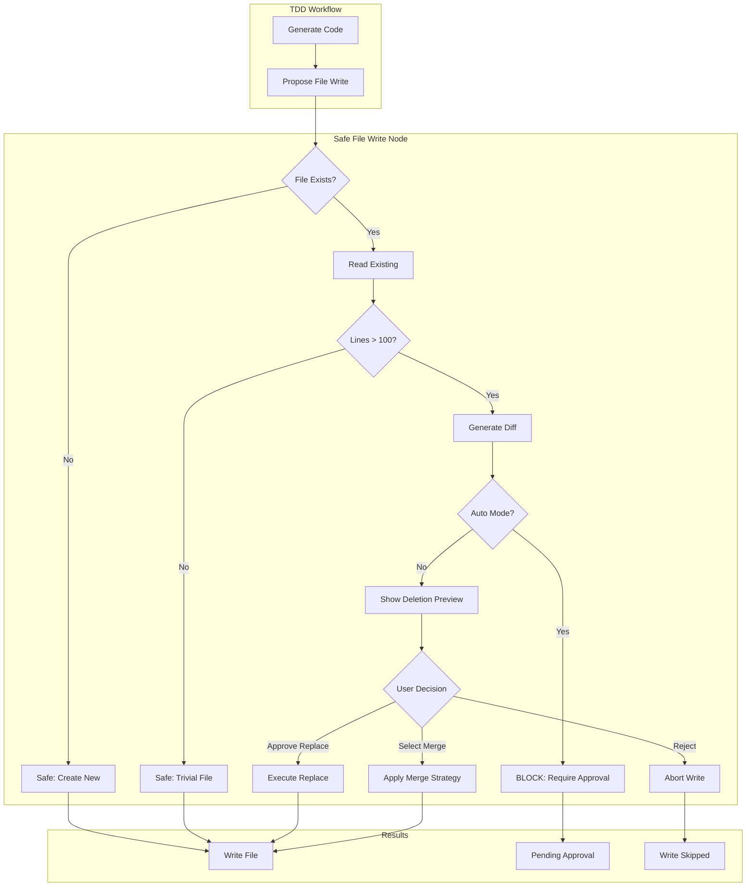

# 173 - Feature: TDD Workflow Safe File Write with Merge Protection

<!-- Template Metadata
Last Updated: 2025-01-XX
Updated By: LLD creation for Issue #173
Update Reason: Initial LLD creation for safe file write functionality
-->

## 1. Context & Goal
* **Issue:** #173
* **Objective:** Prevent TDD workflow from silently overwriting existing files by implementing merge detection and approval requirements
* **Status:** Draft
* **Related Issues:** #168 (Bug caused by silent file replacement), PR #165 (The breaking change)

### Open Questions
*Questions that need clarification before or during implementation. Remove when resolved.*

- [ ] Should the 100-line threshold be configurable via workflow settings?
- [ ] What merge strategy should be the default when multiple are applicable?
- [ ] Should merge history be persisted for audit/rollback purposes?

## 2. Proposed Changes

*This section is the **source of truth** for implementation. Describe exactly what will be built.*

### 2.1 Files Changed

| File | Change Type | Description |
|------|-------------|-------------|
| `src/workflow/nodes/safe_file_write.py` | Add | New node for file write protection |
| `src/workflow/nodes/__init__.py` | Modify | Export new safe_file_write node |
| `src/workflow/merge_strategies.py` | Add | Merge strategy implementations |
| `src/workflow/state.py` | Modify | Add file_write_proposals to state |
| `src/workflow/tdd_workflow.py` | Modify | Insert safe_file_write node before file writes |
| `tests/unit/test_safe_file_write.py` | Add | Unit tests for safe file write |
| `tests/unit/test_merge_strategies.py` | Add | Unit tests for merge strategies |

### 2.2 Dependencies

*No new packages required. Uses existing difflib from standard library.*

```toml
# pyproject.toml additions (if any)
# None - using standard library difflib
```

### 2.3 Data Structures

```python
# Pseudocode - NOT implementation
class FileWriteProposal(TypedDict):
    path: Path                    # Target file path
    new_content: str              # Proposed content to write
    existing_content: str | None  # Current file content if exists
    merge_strategy: MergeStrategy # Proposed strategy
    requires_approval: bool       # True if human must approve
    deletion_preview: list[str]   # Lines that will be deleted

class MergeStrategy(Enum):
    APPEND = "append"       # Add to end of file
    INSERT = "insert"       # Add at specific location
    EXTEND = "extend"       # Add fields/methods to class
    REPLACE = "replace"     # Full replacement

class FileWriteDecision(TypedDict):
    proposal: FileWriteProposal
    approved: bool
    merged_content: str | None    # Result of merge if applicable
    rejection_reason: str | None

class WorkflowState(TypedDict):
    # ... existing fields ...
    file_write_proposals: list[FileWriteProposal]
    file_write_decisions: list[FileWriteDecision]
    pending_approval: bool        # True if awaiting human input
```

### 2.4 Function Signatures

```python
# Signatures only - implementation in source files

# safe_file_write.py
def check_file_write_safety(state: WorkflowState) -> dict:
    """Analyze proposed file writes for merge requirements."""
    ...

def generate_deletion_preview(existing: str, proposed: str) -> list[str]:
    """Generate list of lines that will be deleted."""
    ...

def request_merge_approval(proposal: FileWriteProposal) -> bool:
    """Present diff and request human approval for replacement."""
    ...

def execute_approved_writes(state: WorkflowState) -> dict:
    """Execute only approved file writes."""
    ...

# merge_strategies.py
def merge_append(existing: str, new: str) -> str:
    """Append new content to end of existing file."""
    ...

def merge_insert(existing: str, new: str, location: int) -> str:
    """Insert new content at specific line number."""
    ...

def merge_extend_class(existing: str, new: str, class_name: str) -> str:
    """Add new fields/methods to existing class definition."""
    ...

def detect_merge_strategy(existing: str, new: str) -> MergeStrategy:
    """Analyze content to suggest appropriate merge strategy."""
    ...

def calculate_content_overlap(existing: str, new: str) -> float:
    """Calculate similarity ratio between existing and new content."""
    ...
```

### 2.5 Logic Flow (Pseudocode)

```
1. Receive file write request from TDD workflow
2. FOR each proposed file write:
   a. Check if file exists at path
   b. IF file does not exist:
      - Mark as safe to write (no approval needed)
      - CONTINUE
   c. Read existing content
   d. IF existing content <= 100 lines:
      - Mark as safe to write (trivial file)
      - CONTINUE
   e. Generate deletion preview (lines to be removed)
   f. Detect suggested merge strategy
   g. IF in --auto mode AND strategy == REPLACE:
      - BLOCK write (cannot silently replace in auto mode)
      - Add to pending_approval list
      - CONTINUE
   h. IF interactive mode:
      - Display diff
      - Display deletion count warning
      - Request approval or merge strategy selection
      - Record decision
3. Execute approved writes
4. Return updated state with write results
```

### 2.6 Technical Approach

* **Module:** `src/workflow/nodes/safe_file_write.py`
* **Pattern:** Guard node in LangGraph workflow (interceptor pattern)
* **Key Decisions:** 
  - 100-line threshold chosen to ignore boilerplate/generated files
  - Deletion preview prioritized over full diff for clarity
  - Auto mode blocks replacements entirely (fail-safe)

### 2.7 Architecture Decisions

| Decision | Options Considered | Choice | Rationale |
|----------|-------------------|--------|-----------|
| Threshold trigger | Line count, File size, Content hash | Line count (100) | Simple, predictable, matches human intuition |
| Default behavior | Allow with warning, Block, Require approval | Require approval | Fail-safe prevents data loss |
| Merge detection | AST analysis, Regex patterns, Diff similarity | Diff similarity + heuristics | Works across languages, no parser deps |
| State storage | In workflow state, Temp files, Database | Workflow state | Consistent with LangGraph patterns |

**Architectural Constraints:**
- Must integrate with existing LangGraph workflow structure
- Cannot introduce new external dependencies
- Must work with existing human-in-the-loop patterns

## 3. Requirements

*What must be true when this is done. These become acceptance criteria.*

1. TDD workflow detects existing files before any write operation
2. Files with >100 lines of existing content require explicit merge approval
3. Diff display shows what will be DELETED if replacement occurs
4. Auto mode (--auto) cannot silently replace files with >100 lines
5. Four merge strategies available: Append, Insert, Extend, Replace
6. All file write decisions are recorded in workflow state for audit

## 4. Alternatives Considered

| Option | Pros | Cons | Decision |
|--------|------|------|----------|
| Pre-write backup with rollback | Simple, reversible | Doesn't prevent mistake, reactive | **Rejected** |
| AST-aware merging | Precise, language-aware | Complex, multi-language support needed | **Rejected** |
| Diff-based guard node | Proactive, shows impact | Requires approval flow | **Selected** |
| Git integration (stash/restore) | Familiar, reliable | External dep, not all projects use git | **Rejected** |

**Rationale:** Diff-based guard node is proactive (prevents damage before it happens), shows clear impact to user, and integrates cleanly with existing LangGraph workflow without external dependencies.

## 5. Data & Fixtures

### 5.1 Data Sources

| Attribute | Value |
|-----------|-------|
| Source | Local filesystem (existing files) |
| Format | Text files (Python, JSON, etc.) |
| Size | Varies (test fixtures: 50-500 lines) |
| Refresh | Real-time (read on demand) |
| Copyright/License | N/A - user's own files |

### 5.2 Data Pipeline

```
Workflow State ──reads──► Proposed Writes ──analyze──► Safety Check ──approval──► File System
```

### 5.3 Test Fixtures

| Fixture | Source | Notes |
|---------|--------|-------|
| `large_state.py` (270 lines) | Generated | Simulates the original incident |
| `small_config.py` (50 lines) | Generated | Below threshold, should pass |
| `class_to_extend.py` (150 lines) | Generated | Tests EXTEND merge strategy |
| `proposed_replacement.py` (56 lines) | Generated | The problematic new content |

### 5.4 Deployment Pipeline

Test fixtures are generated during test setup and cleaned up after. No persistent test data required.

## 6. Diagram

### 6.1 Mermaid Quality Gate

Before finalizing any diagram, verify in [Mermaid Live Editor](https://mermaid.live) or GitHub preview:

- [x] **Simplicity:** Similar components collapsed (per 0006 §8.1)
- [x] **No touching:** All elements have visual separation (per 0006 §8.2)
- [x] **No hidden lines:** All arrows fully visible (per 0006 §8.3)
- [x] **Readable:** Labels not truncated, flow direction clear
- [ ] **Auto-inspected:** Agent rendered via mermaid.ink and viewed (per 0006 §8.5)

**Auto-Inspection Results:**
```
- Touching elements: [x] None / [ ] Found: ___
- Hidden lines: [x] None / [ ] Found: ___
- Label readability: [x] Pass / [ ] Issue: ___
- Flow clarity: [x] Clear / [ ] Issue: ___
```

### 6.2 Diagram



## 7. Security & Safety Considerations

### 7.1 Security

| Concern | Mitigation | Status |
|---------|------------|--------|
| Path traversal | Validate paths stay within project directory | TODO |
| Symlink attacks | Resolve symlinks before comparison | TODO |

### 7.2 Safety

| Concern | Mitigation | Status |
|---------|------------|--------|
| Data loss on replacement | Require explicit approval, show deletion count | Addressed |
| Silent overwrites in auto mode | Block all replacements of >100 line files | Addressed |
| Partial write failure | Write to temp file, atomic rename | TODO |
| Race condition on file read | Lock file during check-write cycle | TODO |

**Fail Mode:** Fail Closed - When in doubt, block the write and require human approval

**Recovery Strategy:** All proposed writes are stored in workflow state. If a write fails mid-operation, the state contains the intended content for retry.

## 8. Performance & Cost Considerations

### 8.1 Performance

| Metric | Budget | Approach |
|--------|--------|----------|
| Latency per file check | < 50ms | difflib is fast for typical file sizes |
| Memory | < 10MB additional | Only hold 2 file contents in memory at once |
| I/O operations | 2 per file (read existing, write new) | Minimal overhead |

**Bottlenecks:** Very large files (>10K lines) may slow diff generation. Consider streaming diff for files >5K lines.

### 8.2 Cost Analysis

| Resource | Unit Cost | Estimated Usage | Monthly Cost |
|----------|-----------|-----------------|--------------|
| Local compute | $0 | N/A | $0 |
| No external APIs | $0 | N/A | $0 |

**Cost Controls:**
- N/A - All operations are local

**Worst-Case Scenario:** Large refactoring affecting 100+ files would require 100+ approvals in interactive mode. Consider batch approval UX for this case.

## 9. Legal & Compliance

| Concern | Applies? | Mitigation |
|---------|----------|------------|
| PII/Personal Data | No | Only processes user's own source code |
| Third-Party Licenses | No | No new dependencies |
| Terms of Service | No | Local operation only |
| Data Retention | No | No data persisted beyond session |
| Export Controls | No | Standard text processing |

**Data Classification:** Internal (user's source code)

**Compliance Checklist:**
- [x] No PII stored without consent
- [x] All third-party licenses compatible with project license
- [x] External API usage compliant with provider ToS
- [x] Data retention policy documented

## 10. Verification & Testing

### 10.0 Test Plan (TDD - Complete Before Implementation)

**TDD Requirement:** Tests MUST be written and failing BEFORE implementation begins.

| Test ID | Test Description | Expected Behavior | Status |
|---------|------------------|-------------------|--------|
| T010 | test_new_file_no_approval | New files write without approval | RED |
| T020 | test_small_file_no_approval | Files ≤100 lines write without approval | RED |
| T030 | test_large_file_requires_approval | Files >100 lines require approval | RED |
| T040 | test_auto_mode_blocks_replace | Auto mode blocks large file replacement | RED |
| T050 | test_deletion_preview_accurate | Preview shows correct deleted lines | RED |
| T060 | test_merge_append | Append strategy works correctly | RED |
| T070 | test_merge_insert | Insert strategy works correctly | RED |
| T080 | test_merge_extend | Extend strategy works correctly | RED |
| T090 | test_approval_recorded | Decisions recorded in state | RED |

**Coverage Target:** ≥95% for all new code

**TDD Checklist:**
- [ ] All tests written before implementation
- [ ] Tests currently RED (failing)
- [ ] Test IDs match scenario IDs in 10.1
- [ ] Test file created at: `tests/unit/test_safe_file_write.py`

### 10.1 Test Scenarios

| ID | Scenario | Type | Input | Expected Output | Pass Criteria |
|----|----------|------|-------|-----------------|---------------|
| 010 | New file creation | Auto | Path that doesn't exist | Write proceeds, no approval | File created |
| 020 | Small file replacement | Auto | 50-line existing file | Write proceeds, no approval | File updated |
| 030 | Large file replacement interactive | Auto | 270-line file, interactive mode | Approval prompt shown | Prompt displayed |
| 040 | Large file replacement auto mode | Auto | 270-line file, --auto flag | Write blocked | Error state set |
| 050 | Deletion preview generation | Auto | 270→56 line replacement | 214 lines in preview | Preview accurate |
| 060 | Append merge strategy | Auto | Existing + new content | Combined content | Content appended |
| 070 | Insert merge strategy | Auto | Content, line number | Content inserted | Correct position |
| 080 | Extend class strategy | Auto | Class with new methods | Class extended | Methods added |
| 090 | Decision audit trail | Auto | Approved write | Decision in state | State updated |
| 100 | Rejection flow | Auto | User rejects | Write skipped | No file change |

### 10.2 Test Commands

```bash
# Run all automated tests
poetry run pytest tests/unit/test_safe_file_write.py tests/unit/test_merge_strategies.py -v

# Run only fast/mocked tests (exclude live)
poetry run pytest tests/unit/test_safe_file_write.py -v -m "not live"

# Run with coverage
poetry run pytest tests/unit/test_safe_file_write.py --cov=src/workflow/nodes/safe_file_write --cov-report=term-missing
```

### 10.3 Manual Tests (Only If Unavoidable)

| ID | Scenario | Why Not Automated | Steps |
|----|----------|-------------------|-------|
| M010 | Interactive approval UX | Requires human judgment on clarity | 1. Run TDD workflow on existing file 2. Verify diff is readable 3. Confirm deletion count visible |

## 11. Risks & Mitigations

| Risk | Impact | Likelihood | Mitigation |
|------|--------|------------|------------|
| False positives (blocking valid writes) | Med | Med | Allow user override, log for analysis |
| Merge strategy produces invalid code | High | Low | Validate merged content syntax when possible |
| Performance impact on large codebases | Low | Low | Lazy evaluation, only check files being written |
| User frustration with approval prompts | Med | Med | Batch approval option for multiple files |

## 12. Definition of Done

### Code
- [ ] Implementation complete and linted
- [ ] Code comments reference this LLD (#173)

### Tests
- [ ] All test scenarios pass
- [ ] Test coverage ≥95%

### Documentation
- [ ] LLD updated with any deviations
- [ ] Implementation Report (0103) completed
- [ ] Test Report (0113) completed if applicable

### Review
- [ ] Code review completed
- [ ] User approval before closing issue

---

## Appendix: Review Log

*Track all review feedback with timestamps and implementation status.*

### Review Summary

| Review | Date | Verdict | Key Issue |
|--------|------|---------|-----------|
| - | - | - | Awaiting initial review |

**Final Status:** PENDING