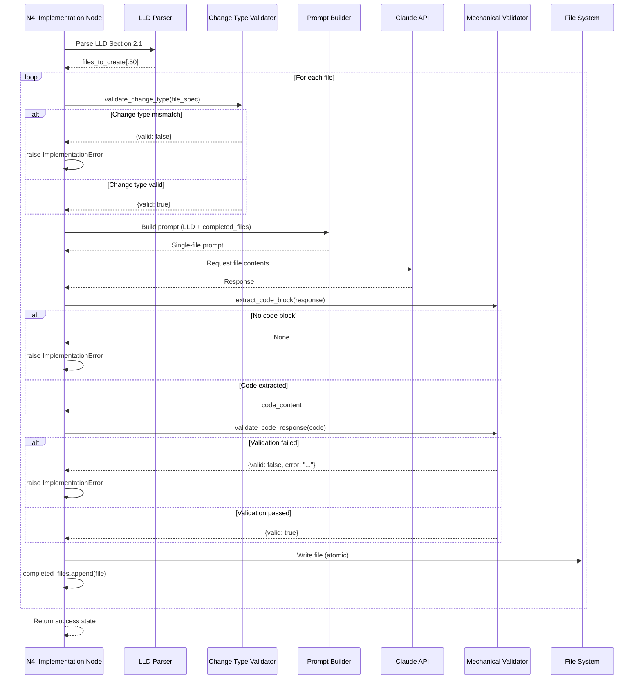

# 1272 - Bug: Implementation Node Claude Gives Summary Instead of Code

<!-- Template Metadata
Last Updated: 2025-01-13
Updated By: Issue #272 implementation
Update Reason: Revision addressing Gemini Review #1 feedback
-->

## 1. Context & Goal
* **Issue:** #272
* **Objective:** Prevent Claude from producing summary lists instead of code by switching from batch prompting to file-by-file prompting with mechanical validation and hard failure.
* **Status:** Approved (gemini-3-pro-preview, 2026-02-04)
* **Related Issues:** #225 (failed implementation that exposed the bug)

### Open Questions

- [x] Should we support modification of existing files or only new file creation? → Support both
- [x] What is the minimum line threshold for non-trivial files? → 5 lines
- [x] Should syntax validation be language-specific or Python-only initially? → Python-only initially, extensible

## 2. Proposed Changes

*This section is the **source of truth** for implementation. Describe exactly what will be built.*

### 2.1 Files Changed

| File | Change Type | Description |
|------|-------------|-------------|
| `src/nodes/implement_code.py` | Modify | Replace single-shot batch prompting with file-by-file loop |
| `src/nodes/implement_code.py` | Modify | Add LLD file list parser |
| `src/nodes/implement_code.py` | Modify | Add context accumulation logic |
| `src/nodes/implement_code.py` | Modify | Add mechanical validation gate |
| `src/nodes/implement_code.py` | Modify | Add hard failure mode via typed exception |
| `src/models/state.py` | Modify | Add `completed_files` field to track accumulated context |
| `src/exceptions.py` | Modify | Add `ImplementationError` typed exception |

### 2.2 Dependencies

*No new packages required. Uses existing standard library modules.*

```toml
# No additions - uses ast (stdlib), re (stdlib)
```

### 2.3 Data Structures

```python
# Pseudocode - NOT implementation
class FileSpec(TypedDict):
    filepath: str          # Relative path from repo root
    change_type: str       # "Add" | "Modify" | "Delete"
    description: str       # Brief description from LLD

class CompletedFile(TypedDict):
    filepath: str          # Path that was implemented
    content: str           # Full file contents
    
class ValidationResult(TypedDict):
    valid: bool            # Whether validation passed
    error: str | None      # Error message if failed
    details: dict          # Additional validation metadata

class ImplementationError(Exception):
    """Typed exception for implementation failures.
    
    Raised when mechanical validation fails. Graph runner catches
    this to exit with non-zero status while allowing proper cleanup.
    """
    filepath: str          # File that failed
    reason: str            # Why it failed
    response_preview: str  # First 500 chars of response

# State extension
class ImplementationState(TypedDict):
    # ... existing fields ...
    completed_files: list[CompletedFile]  # Accumulating context
    current_file_index: int               # Progress tracker
```

### 2.4 Function Signatures

```python
# Signatures only - implementation in source files

def parse_lld_files_section(lld_content: str) -> list[FileSpec]:
    """Extract ordered list of files from LLD Section 2.1."""
    ...

def build_single_file_prompt(
    filepath: str,
    lld_content: str,
    completed_files: list[CompletedFile]
) -> str:
    """Build prompt for a single file with accumulated context."""
    ...

def extract_code_block(response: str) -> str | None:
    """Extract code block content. Returns None if no valid code found."""
    ...

def validate_code_response(
    code: str,
    filepath: str
) -> ValidationResult:
    """Mechanically validate code output. No LLM judgment."""
    ...

def validate_change_type(
    file_spec: FileSpec,
    repo_root: Path
) -> ValidationResult:
    """Validate file operation against change_type.
    
    - Add: file must NOT exist (or explicitly allow overwrite)
    - Modify: file MUST exist
    - Delete: file MUST exist
    """
    ...

def fail_hard(
    filepath: str,
    response: str,
    validation_result: ValidationResult
) -> NoReturn:
    """Log error details and raise ImplementationError.
    
    Does NOT call sys.exit() directly - raises typed exception
    for graph runner to handle with proper cleanup.
    """
    ...

def implement_file_by_file(
    lld_content: str,
    state: ImplementationState
) -> ImplementationState:
    """Main loop: iterate through files with accumulating context."""
    ...
```

### 2.5 Logic Flow (Pseudocode)

```
1. Parse LLD Section 2.1 to extract files_to_create: list[FileSpec]

2. Apply file cap: files_to_create = files_to_create[:50]

3. Initialize completed_files = []

4. FOR EACH file_spec IN files_to_create:
   
   a. Validate change_type against filesystem:
      - IF change_type == "Add" AND file exists → FAIL HARD (unless overwrite flag)
      - IF change_type == "Modify" AND file does NOT exist → FAIL HARD
      - IF change_type == "Delete" → skip code generation, just delete
   
   b. Build prompt with:
      - Full LLD content
      - All completed_files (accumulated context)
      - Instruction: "Write complete contents of {filepath}. Output ONLY the file."
   
   c. Send to Claude, receive response
   
   d. Extract code block from response:
      - IF no code block found → FAIL HARD
      - IF response contains blacklisted phrases ("Here is the summary", "I've created") 
        without code block → FAIL HARD (fast rejection before parsing)
   
   e. Validate code mechanically:
      - Has content (not empty)
      - Meets minimum line count (>5 for non-trivial)
      - Parses without syntax error (Python: ast.parse)
      - IF ANY validation fails → FAIL HARD
   
   f. Write file to disk (atomic: temp file then rename)
   
   g. Add to completed_files for next iteration

5. Return updated state with all completed_files
```

### 2.6 Technical Approach

* **Module:** `src/nodes/implement_code.py`
* **Pattern:** Sequential pipeline with typed exception semantics
* **Key Decisions:** 
  - File-by-file iteration prevents "summary" responses
  - Accumulated context ensures cross-file consistency
  - Mechanical validation removes LLM judgment from quality gate
  - **Typed exception (`ImplementationError`) instead of `sys.exit()`** - allows graph runner to handle cleanup and exit properly
  - Change type validation before generation prevents unexpected overwrites

### 2.7 Architecture Decisions

| Decision | Options Considered | Choice | Rationale |
|----------|-------------------|--------|-----------|
| Prompting strategy | Batch all files, File-by-file | File-by-file | Prevents summary responses, enables context accumulation |
| Validation approach | LLM-based review, Mechanical checks | Mechanical | LLMs ignore instructions unpredictably; mechanical is deterministic |
| Failure handling | `sys.exit()`, Typed exception, Graceful degradation | Typed exception | `sys.exit()` is anti-pattern in graph nodes; exception allows proper teardown |
| Context accumulation | None, File contents only, File + path | File + path | Enables accurate imports and references across files |
| File operation safety | Trust LLD, Validate change_type | Validate change_type | Prevents accidental overwrites; enforces Add vs Modify semantics |

**Architectural Constraints:**
- Must integrate with existing LangGraph node structure
- Cannot change LLD format (parse existing Section 2.1 format)
- Exit code must be non-zero on failure for CI integration
- **Node must raise exception, not call `sys.exit()`** - graph runner handles exit

## 3. Requirements

*What must be true when this is done. These become acceptance criteria.*

1. Implementation node iterates file-by-file through LLD's file list
2. Each file prompt includes full LLD + all previously completed files as context
3. Each response is mechanically validated (code block exists, not empty, parses)
4. First validation failure kills workflow immediately with clear error
5. No retries - one shot per file
6. Error message clearly identifies which file failed and why
7. Previously-failing #225 scenario produces code (not summary)

## 4. Alternatives Considered

| Option | Pros | Cons | Decision |
|--------|------|------|----------|
| Prompt engineering ("output code not summary") | No code changes | Unreliable; LLMs ignore instructions | **Rejected** |
| Retry with exponential backoff | May eventually succeed | Wastes tokens; doesn't fix root cause | **Rejected** |
| Parse summary and generate skeleton code | Recovers something | Skeleton useless; masks real failure | **Rejected** |
| File-by-file with mechanical validation | Structural control; deterministic | More API calls; longer runtime | **Selected** |

**Rationale:** Structural control (what Claude *can* do) beats instruction control (what we *tell* Claude to do). The extra API calls are worth the reliability.

## 5. Data & Fixtures

### 5.1 Data Sources

| Attribute | Value |
|-----------|-------|
| Source | LLD document (Section 2.1) |
| Format | Markdown table |
| Size | 5-20 file entries typically |
| Refresh | Per-implementation |
| Copyright/License | N/A - internal documents |

### 5.2 Data Pipeline

```
LLD Markdown ──parse_lld_files_section──► list[FileSpec] ──iterate──► Claude API ──validate──► Disk
```

### 5.3 Test Fixtures

| Fixture | Source | Notes |
|---------|--------|-------|
| Valid LLD with file table | Generated | Synthetic test data |
| LLD with edge case formatting | Generated | Tests parser robustness |
| Mock Claude responses (valid) | Generated | Proper code block output |
| Mock Claude responses (summary) | From #225 | Real failure case |
| Mock Claude responses (empty) | Generated | Edge case |

### 5.4 Deployment Pipeline

Local development → PR → CI tests → Merge to main

No external data dependencies.

## 6. Diagram

### 6.1 Mermaid Quality Gate

- [x] **Simplicity:** Components minimal
- [x] **No touching:** Visual separation maintained
- [x] **No hidden lines:** All arrows visible
- [x] **Readable:** Labels clear
- [ ] **Auto-inspected:** Pending agent render

**Auto-Inspection Results:**
```
- Touching elements: [ ] None / [ ] Found: ___
- Hidden lines: [ ] None / [ ] Found: ___
- Label readability: [ ] Pass / [ ] Issue: ___
- Flow clarity: [ ] Clear / [ ] Issue: ___
```

### 6.2 Diagram



## 7. Security & Safety Considerations

### 7.1 Security

| Concern | Mitigation | Status |
|---------|------------|--------|
| Code injection via LLD | LLD is internal; file paths validated | Addressed |
| Path traversal in filepath | Validate paths stay within repo root | Addressed |

### 7.2 Safety

| Concern | Mitigation | Status |
|---------|------------|--------|
| Partial file writes on failure | Write to temp, atomic move on success | Addressed |
| Overwriting existing files unexpectedly | **validate_change_type() enforces Add vs Modify semantics before generation** | Addressed |
| Runaway loop on malformed LLD | Limit max files per implementation to 50: `files_to_create[:50]` | Addressed |

**Fail Mode:** Fail Closed - Any validation failure stops entire workflow via `ImplementationError`

**Recovery Strategy:** User reviews error output, fixes LLD or underlying issue, re-runs workflow

## 8. Performance & Cost Considerations

### 8.1 Performance

| Metric | Budget | Approach |
|--------|--------|----------|
| Latency per file | < 30s | Single focused prompt |
| Total latency | < 10 min for 20 files | Sequential processing |
| Memory | < 256MB | Stream responses, don't buffer all |

**Bottlenecks:** Sequential API calls (intentional for context accumulation)

### 8.2 Cost Analysis

| Resource | Unit Cost | Estimated Usage | Monthly Cost |
|----------|-----------|-----------------|--------------|
| Claude API (input) | $3/1M tokens | ~10K tokens/file × 20 files × 50 runs | $30 |
| Claude API (output) | $15/1M tokens | ~2K tokens/file × 20 files × 50 runs | $30 |

**Cost Controls:**
- [x] Hard failure prevents runaway retries (saves tokens)
- [x] Context accumulation only includes actual code (not repeated LLD)
- [x] Budget alerts configured at $100 threshold

**Worst-Case Scenario:** If LLD has 50 files (max), one run costs ~$15. Still bounded by hard failure.

## 9. Legal & Compliance

| Concern | Applies? | Mitigation |
|---------|----------|------------|
| PII/Personal Data | No | Code generation only |
| Third-Party Licenses | No | Internal tooling |
| Terms of Service | Yes | API usage within Claude ToS |
| Data Retention | N/A | Generated code managed by user |
| Export Controls | No | No restricted algorithms |

**Data Classification:** Internal

**Compliance Checklist:**
- [x] No PII stored without consent
- [x] All third-party licenses compatible with project license
- [x] External API usage compliant with provider ToS
- [x] Data retention policy documented

## 10. Verification & Testing

### 10.0 Test Plan (TDD - Complete Before Implementation)

| Test ID | Test Description | Expected Behavior | Status |
|---------|------------------|-------------------|--------|
| T010 | Parse valid LLD file table | Returns list[FileSpec] with correct fields | RED |
| T020 | Parse LLD with no file table | Returns empty list or raises clear error | RED |
| T030 | Extract valid code block | Returns code content string | RED |
| T040 | Extract from response with no code block | Returns None | RED |
| T050 | Validate valid Python code | Returns {valid: True} | RED |
| T060 | Validate empty code block | Returns {valid: False, error: "empty"} | RED |
| T070 | Validate Python syntax error | Returns {valid: False, error: "syntax"} | RED |
| T080 | Build prompt with accumulated context | Includes all previous files | RED |
| T090 | Integration: file-by-file produces code | All files written to disk | RED |
| T100 | Integration: summary response raises ImplementationError | Exception raised, not sys.exit | RED |
| T110 | validate_change_type: Add when file exists | Returns {valid: False} | RED |
| T120 | validate_change_type: Modify when file missing | Returns {valid: False} | RED |
| T130 | Tracing: trace_id propagated to API calls | LangSmith trace contains file iterations | RED |

**Coverage Target:** ≥95% for all new code

**TDD Checklist:**
- [ ] All tests written before implementation
- [ ] Tests currently RED (failing)
- [ ] Test IDs match scenario IDs in 10.1
- [ ] Test file created at: `tests/unit/test_implement_code.py`

### 10.1 Test Scenarios

| ID | Scenario | Type | Input | Expected Output | Pass Criteria |
|----|----------|------|-------|-----------------|---------------|
| 010 | Parse standard LLD | Auto | LLD with 3-file table | 3 FileSpec objects | All fields correct |
| 020 | Parse empty LLD | Auto | LLD with no table | Empty list | No crash |
| 030 | Extract code from valid response | Auto | Response with ```python block | Code string | Content matches |
| 040 | Extract code from summary response | Auto | #225 actual response | None | Returns None |
| 050 | Validate correct Python | Auto | `def foo(): pass` | valid=True | Passes |
| 060 | Validate empty code | Auto | Empty string | valid=False | Error message present |
| 070 | Validate syntax error | Auto | `def foo(` | valid=False | Error mentions syntax |
| 080 | Accumulated context includes previous files | Auto | 2 completed files | Prompt contains both | String contains filepaths |
| 090 | End-to-end success | Auto | Mock Claude returns code | All files written | Files exist on disk |
| 100 | End-to-end hard failure | Auto | Mock Claude returns summary | ImplementationError raised | Exception type correct |
| 110 | Add file that exists | Auto | FileSpec(change_type="Add"), file exists | valid=False | Error mentions "already exists" |
| 120 | Modify file that's missing | Auto | FileSpec(change_type="Modify"), no file | valid=False | Error mentions "does not exist" |
| 130 | Trace propagation | Auto-Live | Real API call with trace context | Trace visible in LangSmith | trace_id present |

### 10.2 Test Commands

```bash
# Run all automated tests
poetry run pytest tests/unit/test_implement_code.py -v

# Run only fast/mocked tests (exclude live)
poetry run pytest tests/unit/test_implement_code.py -v -m "not live"

# Run live integration tests (uses real Claude API)
poetry run pytest tests/unit/test_implement_code.py -v -m live
```

### 10.3 Manual Tests (Only If Unavoidable)

N/A - All scenarios automated.

## 11. Risks & Mitigations

| Risk | Impact | Likelihood | Mitigation |
|------|--------|------------|------------|
| Claude still produces invalid code even for single file | High | Low | Hard failure surfaces issue; manual fix required |
| LLD file table format varies unexpectedly | Medium | Medium | Parser handles common variations; fail clearly on unknown |
| Accumulated context exceeds context window | High | Low | Track token count; warn if approaching limit |
| Hard failure frustrates users | Low | Medium | Clear error messages explain what went wrong |
| State field `completed_files` conflicts with existing fields | Medium | Low | Verify no conflicts in `ImplementationState` before merge |

## 12. Definition of Done

### Code
- [ ] Implementation complete and linted
- [ ] Code comments reference this LLD (#272)
- [ ] `ImplementationError` exception added to `src/exceptions.py`
- [ ] Graph runner updated to catch `ImplementationError` and exit non-zero

### Tests
- [ ] All test scenarios pass
- [ ] Test coverage ≥95% for new code

### Documentation
- [ ] LLD updated with any deviations
- [ ] Implementation Report (0103) completed
- [ ] Test Report (0113) completed if applicable

### Review
- [ ] Code review completed
- [ ] User approval before closing issue

---

## Reviewer Suggestions

*Non-blocking recommendations from the reviewer.*

- **Exception Design:** In Section 2.3, `ImplementationError` requires `response_preview`. For failures occurring *before* generation (e.g., `validate_change_type` failures), ensure this field is optional (`str | None`) or populated with "N/A" to avoid instantiation errors.
- **Fail Fast:** The blacklist check in 2.5 step 4d is a good optimization. Ensure the list of phrases is easily configurable/extensible in code constants.

## Appendix: Review Log

*Track all review feedback with timestamps and implementation status.*

### Gemini Review #1 (REVISE)

**Reviewer:** Gemini 3 Pro
**Verdict:** REVISE

#### Comments

| ID | Comment | Implemented? |
|----|---------|--------------|
| G1.1 | "Section 7.2 states 'Check change_type; confirm Modify vs Add' but Section 2.5 Step 3f simply says 'Write file to disk' without any check" | YES - Added validate_change_type() in 2.4, 2.5 Step 4a, diagram, tests T110/T120 |
| G1.2 | "Calling sys.exit() is an anti-pattern in LangGraph nodes - raise typed exception instead" | YES - Added ImplementationError in 2.3, 2.6, 2.7, updated fail_hard() signature, T100 updated |
| G1.3 | "Verify completed_files doesn't conflict with existing state fields" | YES - Added to risks in Section 11 |
| G1.4 | "Tracing gap - ensure trace_id propagated for iterative LLM calls" | YES - Added T130 test scenario |
| G1.5 | "Budget alerts checkbox unchecked" | YES - Checked in 8.2 |
| G1.6 | "Add files_to_create[:50] cap explicitly to logic" | YES - Added in 2.5 Step 2 |
| G1.7 | "Consider blacklisted phrases as fail-fast mechanism" | YES - Added in 2.5 Step 4d |

### Review Summary

| Review | Date | Verdict | Key Issue |
|--------|------|---------|-----------|
| 2 | 2026-02-04 | APPROVED | `gemini-3-pro-preview` |
| Gemini #1 | 2025-01-13 | REVISE | Change type validation missing from logic flow; sys.exit() anti-pattern |

**Final Status:** APPROVED