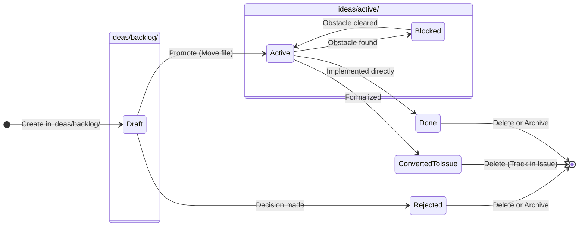

# 198 - Feature: Brief Structure and Placement Standard

## 1. Context & Goal
* **Issue:** #98
* **Objective:** Establish a project-wide standard for brief placement (`ideas/` directory), naming, structure, and lifecycle to separate informal work from formal documentation.
* **Status:** Draft
* **Related Issues:** None

### Open Questions
None - requirements are well-defined from issue.

## 2. Proposed Changes

### 2.1 Files Changed
| File | Change |
|------|--------|
| `docs/standards/0009-canonical-project-structure.md` | Update documentation to include `ideas/` directory hierarchy. |
| `tools/new-repo-setup.py` | Update script to generate `ideas/active` and `ideas/backlog`. |
| `docs/templates/0110-brief-template.md` | Create new file containing the standard brief template. |
| `docs/0003-file-inventory.md` | Register the new template in the inventory. |

### 2.2 Dependencies
* **Standard Library:** `os`, `pathlib` (Existing dependencies in `new-repo-setup.py`).
* **External:** None.

### 2.3 Data Structures
No complex data structures. Configuration is defined as a list of strings within the python script.

### 2.4 Function Signatures

**File:** `tools/new-repo-setup.py`

```python
def create_structure(base_path: str) -> None:
    """
    Creates the canonical directory structure including the new ideas directories.
    
    Args:
        base_path: The root directory where the structure will be created.
    """
    pass
```

### 2.5 Logic Flow (Pseudocode)

**Modifying `tools/new-repo-setup.py`**

```python
# Define the structure constants
OTHER_STRUCTURE = [
    "docs/standards",
    "docs/templates",
    "docs/reports",
    "tools",
    "src",
    "tests",
    # NEW ENTRIES START
    "ideas/active",
    "ideas/backlog",
    # NEW ENTRIES END
]

FUNCTION create_structure(base_path):
    FOR dir_name IN OTHER_STRUCTURE:
        full_path = JOIN(base_path, dir_name)
        IF NOT EXISTS(full_path):
            MAKE_DIRS(full_path)
            PRINT "Created: " + full_path
        ELSE:
            PRINT "Exists: " + full_path
```

### 2.6 Technical Approach
1.  **Standardization:** The `ideas/` folder is placed at the root to conceptually separate "scratchpad" work from "formal documentation" (`docs/`).
2.  **Tooling:** We leverage the existing `new-repo-setup.py` script. By adding the paths to the configuration list, we ensure all future projects adhere to the standard automatically.
3.  **Templating:** The template will use YAML frontmatter to support potential future parsing/automation, even though current usage is manual.

## 3. Requirements
1.  **Directory Creation:** The `new-repo-setup.py` script must create `ideas/`, `ideas/active/`, and `ideas/backlog/` directories.
2.  **Template Existence:** `docs/templates/0110-brief-template.md` must exist.
3.  **Template Content:** The template must include `Status`, `Effort`, `Value`, and `Blocked by` in frontmatter, and `Problem`/`Proposal` sections in the body.
4.  **Documentation:** `docs/standards/0009-canonical-project-structure.md` must explicitly define the purpose of the `ideas/` directory.

## 4. Alternatives Considered

| Alternative | Pros | Cons | Decision |
|-------------|------|------|----------|
| **Place in `docs/ideas`** | Keeps root cleaner. | Implies ideas are formal docs; creates confusion with ADRs. | **Rejected** |
| **Numbered Files (ADR style)** | Easy sorting; unique IDs. | High overhead for throwaway ideas; ID collision risk. | **Rejected** |
| **Single `ideas/` folder** | Simpler structure. | Gets cluttered quickly; hard to distinguish active work from backlog. | **Rejected** |

## 5. Data & Fixtures

### 5.1 Data Sources
N/A - This is a file structure standard.

### 5.2 Data Pipeline
N/A

### 5.3 Test Fixtures
| Fixture | Description |
|---------|-------------|
| `temp_test_dir/` | A temporary directory created during testing to verify the setup script functionality. |

### 5.4 Deployment Pipeline
Development environment only. Changes are applied via git pull and running the setup script on new projects.

## 6. Diagram

### 6.1 Mermaid Quality Gate
- [x] Syntax is valid
- [x] Logic represents the Lifecycle rules from the Issue

### 6.2 Diagram



## 7. Security Considerations

| Concern | Mitigation |
|---------|------------|
| **Script Execution** | `new-repo-setup.py` only performs `mkdir` operations. Ensure it does not overwrite existing files destructively (current logic checks existence first). |

## 8. Performance Considerations

| Metric | Budget |
|--------|--------|
| **Script Runtime** | < 100ms |

## 9. Risks & Mitigations

| Risk | Impact | Likelihood | Mitigation |
|------|--------|------------|------------|
| **Adoption Failure** | Developers continue putting notes in random locations. | Medium | Enforce via code review; referencing the Standard 0009. |
| **Stale Briefs** | `ideas/active` becomes a graveyard of unfinished work. | Low | Periodic cleanup required (process, not software). |

## 10. Verification & Testing

### 10.1 Test Scenarios

| ID | Scenario | Type | Input | Output | Criteria |
|----|----------|------|-------|--------|----------|
| T1 | Run Setup Script | Automated | `python new-repo-setup.py` in empty dir | Directories created | `ideas/active` and `ideas/backlog` exist. |
| T2 | Verify Template | Manual | Open `docs/templates/0110-brief-template.md` | File content | Contains Frontmatter and Problem/Proposal sections. |

### 10.2 Test Commands

```bash
# Test T1: Script Execution
mkdir -p test_env
cp tools/new-repo-setup.py test_env/
cd test_env
python3 new-repo-setup.py
ls -R ideas/
# Expect: active/ backlog/

# Clean up
cd ..
rm -rf test_env
```

### 10.3 Manual Tests (Only If Unavoidable)
N/A - Script test is automated via bash above. Content verification is part of code review.

## 11. Definition of Done

### Code
- [ ] `tools/new-repo-setup.py` updated with new paths.
- [ ] `docs/templates/0110-brief-template.md` created.

### Tests
- [ ] Manual verification that script creates folders.

### Documentation
- [ ] `docs/standards/0009-canonical-project-structure.md` updated.
- [ ] `docs/0003-file-inventory.md` updated.

### Review
- [ ] PR reviewed by Lead Developer.
- [ ] Standard 0009 approved.

---

## Appendix: Review Log

### Review Summary

| Review | Date | Verdict | Key Issue |
|--------|------|---------|-----------|
| - | - | - | - |

**Final Status:** DRAFT - PENDING REVIEW