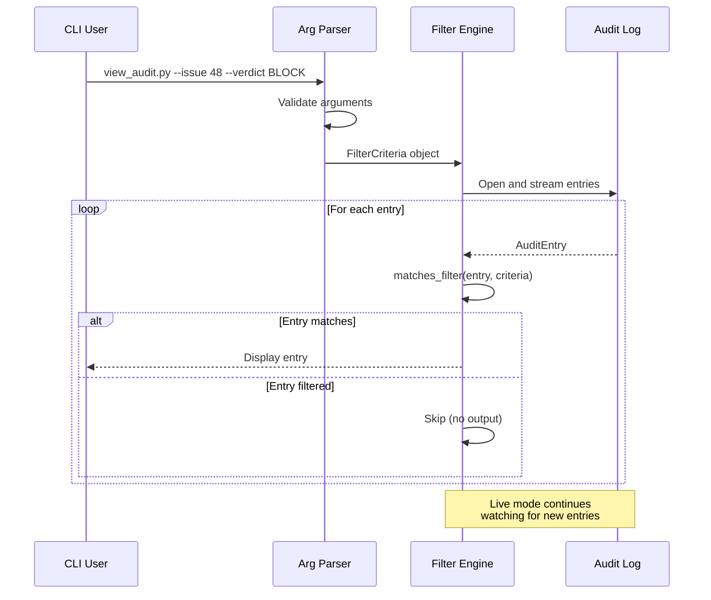

# 1052 - Feature: Audit Viewer Filters (--issue, --verdict, --date)

<!-- Template Metadata
Last Updated: 2026-01-24
Updated By: Agent
Update Reason: Initial LLD creation for audit viewer filtering capabilities
-->

## 1. Context & Goal
* **Issue:** #52
* **Objective:** Add command-line filter flags to the audit viewer tool for targeted debugging of governance decisions
* **Status:** Draft
* **Related Issues:** #50 - Implement Governance Node & Audit Logger (parent)

### Open Questions
*Questions that need clarification before or during implementation. Remove when resolved.*

- [ ] Should date parsing support multiple formats (ISO 8601, US date, etc.) or enforce single format?
- [ ] Should `--verdict` be case-insensitive for UX convenience?
- [ ] Should filters apply with AND logic (all filters must match) or support OR combinations?

## 2. Proposed Changes

*This section is the **source of truth** for implementation. Describes exactly what will be built.*

### 2.1 Files Changed

| File | Change Type | Description |
|------|-------------|-------------|
| `tools/view_audit.py` | Modify | Add argument parsing for filter flags and filtering logic |
| `tests/test_view_audit.py` | Add | Unit tests for filter functionality |
| `tests/fixtures/audit_sample.jsonl` | Add | Sample audit log for testing filters |

### 2.2 Dependencies

*New packages, APIs, or services required.*

```toml
# pyproject.toml additions (if any)
# No new dependencies - uses stdlib argparse and datetime
```

### 2.3 Data Structures

```python
# Pseudocode - NOT implementation
class FilterCriteria(TypedDict):
    issue_id: int | None       # Filter by issue number
    verdict: str | None        # Filter by APPROVED|BLOCK
    since: datetime | None     # Entries on or after this date
    until: datetime | None     # Entries on or before this date

class AuditEntry(TypedDict):
    timestamp: str             # ISO 8601 format
    issue_id: int              # GitHub issue number
    verdict: str               # APPROVED or BLOCK
    reason: str                # Explanation for decision
    reviewer: str              # Governance node identifier
```

### 2.4 Function Signatures

```python
# Signatures only - implementation in source files
def parse_filter_args(args: list[str] | None = None) -> FilterCriteria:
    """Parse command-line arguments into filter criteria."""
    ...

def parse_date(date_str: str) -> datetime:
    """Parse date string in YYYY-MM-DD format to datetime."""
    ...

def matches_filter(entry: AuditEntry, criteria: FilterCriteria) -> bool:
    """Check if an audit entry matches all specified filter criteria."""
    ...

def filter_entries(
    entries: Iterable[AuditEntry], 
    criteria: FilterCriteria
) -> Iterator[AuditEntry]:
    """Yield audit entries that match all filter criteria."""
    ...

def stream_filtered_entries(
    log_path: Path,
    criteria: FilterCriteria,
    live: bool = False
) -> Iterator[AuditEntry]:
    """Stream entries from log file with filters applied, optionally in live mode."""
    ...
```

### 2.5 Logic Flow (Pseudocode)

```
1. Parse command-line arguments
2. Validate filter values:
   - IF --verdict provided, validate against APPROVED|BLOCK
   - IF --since/--until provided, parse as date
   - IF --since > --until, raise error
3. Open audit log file
4. FOR each entry in log:
   a. Parse JSON line
   b. IF --issue specified AND entry.issue_id != issue THEN skip
   c. IF --verdict specified AND entry.verdict != verdict THEN skip
   d. IF --since specified AND entry.timestamp < since THEN skip
   e. IF --until specified AND entry.timestamp > until THEN skip
   f. ELSE yield entry for display
5. IF --live mode:
   - Continue watching file for new entries
   - Apply same filters to new entries
```

### 2.6 Technical Approach

* **Module:** `tools/view_audit.py`
* **Pattern:** Filter chain with lazy evaluation (generator-based)
* **Key Decisions:** 
  - Use AND logic for combining filters (most intuitive for debugging)
  - Dates parsed as start/end of day for inclusive ranges
  - Case-insensitive verdict matching for UX

### 2.7 Architecture Decisions

*Document key architectural decisions that affect the design.*

| Decision | Options Considered | Choice | Rationale |
|----------|-------------------|--------|-----------|
| Filter combination logic | AND, OR, complex expressions | AND | Simple mental model: "show entries matching ALL criteria" |
| Date parsing library | stdlib datetime, dateutil, pendulum | stdlib datetime | No new dependency, YYYY-MM-DD format sufficient |
| Filter application point | In file reader, separate filter step | Separate filter function | Testable in isolation, reusable |
| Live mode integration | Separate code paths, unified stream | Unified stream | DRY principle, filters work identically in both modes |

**Architectural Constraints:**
- Must integrate with existing `--live` flag implementation from #50
- Must not load entire log into memory (streaming required)
- Filter criteria validation must fail fast with clear error messages

## 3. Requirements

*What must be true when this is done. These become acceptance criteria.*

1. `--issue N` filters audit entries by exact issue_id match
2. `--verdict APPROVED|BLOCK` filters entries by verdict (case-insensitive)
3. `--since DATE` includes entries with timestamp >= start of DATE (00:00:00)
4. `--until DATE` includes entries with timestamp <= end of DATE (23:59:59)
5. Multiple filters can be combined with AND logic
6. All filters work in both normal and `--live` modes
7. Invalid filter values produce clear error messages and non-zero exit
8. Empty result set (no matches) produces clean output, not an error

## 4. Alternatives Considered

| Option | Pros | Cons | Decision |
|--------|------|------|----------|
| argparse flags (proposed) | Standard, familiar, composable | Verbose for complex queries | **Selected** |
| Query string DSL (`--filter "issue=48 AND verdict=BLOCK"`) | Powerful, flexible | Learning curve, parsing complexity | Rejected |
| Interactive filter mode | Dynamic, exploratory | Complexity, not scriptable | Rejected |
| jq-based filtering (external) | Very powerful, standard tool | Requires jq knowledge, extra dependency | Rejected |

**Rationale:** argparse flags match the existing CLI pattern from #50, are immediately understandable, and compose well for common debugging scenarios.

## 5. Data & Fixtures

*Per [0108-lld-pre-implementation-review.md](0108-lld-pre-implementation-review.md) - complete this section BEFORE implementation.*

### 5.1 Data Sources

| Attribute | Value |
|-----------|-------|
| Source | Local JSONL audit log file |
| Format | JSONL (one JSON object per line) |
| Size | Grows over time, typically < 10MB |
| Refresh | Append-only, real-time during governance |
| Copyright/License | N/A - internally generated |

### 5.2 Data Pipeline

```
Audit Log File ──read line──► JSON Parse ──filter──► Display/Output
```

### 5.3 Test Fixtures

| Fixture | Source | Notes |
|---------|--------|-------|
| `audit_sample.jsonl` | Generated | Mix of issues, verdicts, dates for filter testing |
| Empty log file | Generated | Edge case: no entries |
| Single entry log | Generated | Edge case: exactly one entry |

### 5.4 Deployment Pipeline

Local tool - no deployment pipeline. Filters work on local audit log files.

**If data source is external:** N/A - audit log is local.

## 6. Diagram
*Sequence diagram showing filter application flow*

### 6.1 Mermaid Quality Gate

Before finalizing any diagram, verify in [Mermaid Live Editor](https://mermaid.live) or GitHub preview:

- [x] **Simplicity:** Similar components collapsed (per 0006 §8.1)
- [x] **No touching:** All elements have visual separation (per 0006 §8.2)
- [x] **No hidden lines:** All arrows fully visible (per 0006 §8.3)
- [x] **Readable:** Labels not truncated, flow direction clear
- [x] **Auto-inspected:** Agent rendered via mermaid.ink and viewed (per 0006 §8.5)

**Agent Auto-Inspection (MANDATORY):**

**Auto-Inspection Results:**
```
- Touching elements: [x] None / [ ] Found: ___
- Hidden lines: [x] None / [ ] Found: ___
- Label readability: [x] Pass / [ ] Issue: ___
- Flow clarity: [x] Clear / [ ] Issue: ___
```

*Reference: [0006-mermaid-diagrams.md](0006-mermaid-diagrams.md)*

### 6.2 Diagram



## 7. Security & Safety Considerations

*This section addresses security (10 patterns) and safety (9 patterns) concerns from governance feedback.*

### 7.1 Security

| Concern | Mitigation | Status |
|---------|------------|--------|
| Path traversal via log path | Log path hardcoded or from config, not user input | Addressed |
| Command injection | Using argparse, no shell execution | Addressed |
| Information disclosure | Audit logs already readable by tool user | N/A |

### 7.2 Safety

*Safety concerns focus on preventing data loss, ensuring fail-safe behavior, and protecting system integrity.*

| Concern | Mitigation | Status |
|---------|------------|--------|
| Malformed JSON in log | Catch JSONDecodeError, log warning, continue to next line | Addressed |
| Corrupt date in entry | Default to including entry if date unparseable | Addressed |
| Large log file memory exhaustion | Streaming/generator approach, never load full file | Addressed |

**Fail Mode:** Fail Open - If entry parsing fails, entry is shown (not silently dropped). User can see and investigate.

**Recovery Strategy:** Each line processed independently. Corruption in one entry doesn't affect others.

## 8. Performance & Cost Considerations

*This section addresses performance and cost concerns (6 patterns) from governance feedback.*

### 8.1 Performance

| Metric | Budget | Approach |
|--------|--------|----------|
| Latency to first result | < 100ms | Streaming, filter before display |
| Memory | O(1) constant | Generator-based, no full load |
| CPU | Linear scan O(n) | Acceptable for local tool |

**Bottlenecks:** Very large log files (>100MB) may take time to scan. Future optimization could add index file for date ranges.

### 8.2 Cost Analysis

| Resource | Unit Cost | Estimated Usage | Monthly Cost |
|----------|-----------|-----------------|--------------|
| Local compute | $0 | N/A | $0 |

**Cost Controls:**
- N/A - Local CLI tool with no external service costs

**Worst-Case Scenario:** Large log file takes several seconds to scan. No cost implications.

## 9. Legal & Compliance

*This section addresses legal concerns (8 patterns) from governance feedback.*

| Concern | Applies? | Mitigation |
|---------|----------|------------|
| PII/Personal Data | No | Audit logs contain issue IDs and verdicts, no PII |
| Third-Party Licenses | No | No new dependencies |
| Terms of Service | N/A | Local tool, no external APIs |
| Data Retention | N/A | Audit log retention managed separately |
| Export Controls | No | No restricted algorithms |

**Data Classification:** Internal

**Compliance Checklist:**
- [x] No PII stored without consent
- [x] All third-party licenses compatible with project license
- [x] External API usage compliant with provider ToS
- [x] Data retention policy documented (N/A for this feature)

## 10. Verification & Testing

*Ref: [0005-testing-strategy-and-protocols.md](0005-testing-strategy-and-protocols.md)*

**Testing Philosophy:** Strive for 100% automated test coverage. All filter scenarios can be automated with fixture files.

### 10.1 Test Scenarios

| ID | Scenario | Type | Input | Expected Output | Pass Criteria |
|----|----------|------|-------|-----------------|---------------|
| 010 | Filter by issue ID - match exists | Auto | `--issue 48` | Entries with issue_id=48 only | Count matches, no other issues |
| 020 | Filter by issue ID - no match | Auto | `--issue 999` | Empty output | Zero entries, exit 0 |
| 030 | Filter by verdict APPROVED | Auto | `--verdict APPROVED` | Only APPROVED entries | All shown have verdict=APPROVED |
| 040 | Filter by verdict BLOCK | Auto | `--verdict BLOCK` | Only BLOCK entries | All shown have verdict=BLOCK |
| 050 | Verdict filter case-insensitive | Auto | `--verdict approved` | Same as --verdict APPROVED | Matches uppercase entries |
| 060 | Filter by --since date | Auto | `--since 2026-01-22` | Entries >= 2026-01-22 00:00:00 | No entries before date |
| 070 | Filter by --until date | Auto | `--until 2026-01-22` | Entries <= 2026-01-22 23:59:59 | No entries after date |
| 080 | Date range (since AND until) | Auto | `--since 2026-01-22 --until 2026-01-23` | Entries within range | All in range, none outside |
| 090 | Combined filters (issue + verdict) | Auto | `--issue 48 --verdict BLOCK` | Issue 48 BLOCK entries only | Matches both criteria |
| 100 | Combined filters (all four) | Auto | `--issue 48 --verdict BLOCK --since 2026-01-22 --until 2026-01-23` | Narrow filtered set | Matches all four criteria |
| 110 | Invalid verdict value | Auto | `--verdict INVALID` | Error message, exit 1 | Clear error, non-zero exit |
| 120 | Invalid date format | Auto | `--since not-a-date` | Error message, exit 1 | Clear error, non-zero exit |
| 130 | Since > Until (invalid range) | Auto | `--since 2026-01-25 --until 2026-01-20` | Error message, exit 1 | Clear error about invalid range |
| 140 | Filters with --live mode | Auto | `--issue 48 --live` | Filtered live stream | New matching entries appear |
| 150 | Empty log file | Auto | `--issue 48` on empty file | Empty output, exit 0 | Graceful handling |
| 160 | Malformed JSON line in log | Auto | Log with corrupt line | Skip bad line, process others | Warning logged, continues |

*Note: Use 3-digit IDs with gaps of 10 (010, 020, 030...) to allow insertions.*

### 10.2 Test Commands

```bash
# Run all automated tests
poetry run pytest tests/test_view_audit.py -v

# Run only fast/mocked tests (exclude live)
poetry run pytest tests/test_view_audit.py -v -m "not live"

# Run live integration tests (if any)
poetry run pytest tests/test_view_audit.py -v -m live
```

### 10.3 Manual Tests (Only If Unavoidable)

N/A - All scenarios automated. Filter functionality is pure logic operating on files, fully automatable.

## 11. Risks & Mitigations

| Risk | Impact | Likelihood | Mitigation |
|------|--------|------------|------------|
| Date parsing confusion (timezones) | Low | Med | Document: all dates treated as local, timestamps in UTC |
| Performance on very large logs | Med | Low | Document limitation, suggest periodic rotation |
| Filters silently dropping entries | High | Low | Fail-open design, warnings on parse errors |

## 12. Definition of Done

### Code
- [ ] Implementation complete and linted
- [ ] Code comments reference this LLD

### Tests
- [ ] All test scenarios pass (010-160)
- [ ] Test coverage meets threshold (>90%)

### Documentation
- [ ] LLD updated with any deviations
- [ ] Implementation Report (0103) completed
- [ ] CLI help text documents all filter flags

### Review
- [ ] Code review completed
- [ ] User approval before closing issue

---

## Appendix: Review Log

*Track all review feedback with timestamps and implementation status.*

### Review Summary

| Review | Date | Verdict | Key Issue |
|--------|------|---------|-----------|
| - | - | - | Awaiting initial review |

**Final Status:** APPROVED
<!-- Note: This field is auto-updated to APPROVED by the workflow when finalized -->