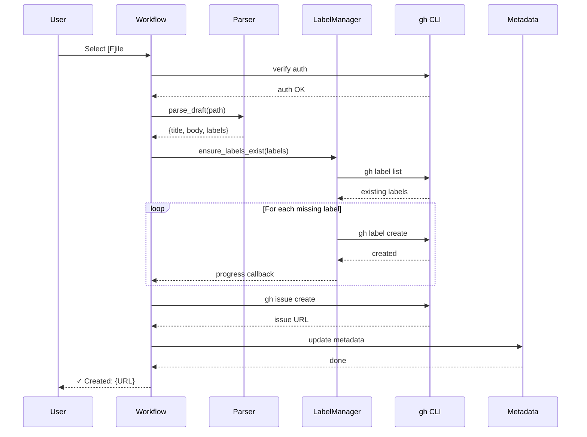

# 184 - Feature: Add [F]ile Option to Issue Workflow Exit

<!-- Template Metadata
Last Updated: 2025-01-XX
Updated By: LLD Creation for Issue #84
Update Reason: Initial LLD creation
-->

## 1. Context & Goal
* **Issue:** #84
* **Objective:** Add a `[F]ile` option to the issue workflow that automatically creates missing labels and files issues to GitHub, eliminating manual `gh` command execution after draft approval.
* **Status:** Approved (gemini-3-pro-preview, 2026-02-04)
* **Related Issues:** None

### Open Questions
*Questions that need clarification before or during implementation. Remove when resolved.*

- [x] Should we support custom label colors via configuration? → Deferred to future enhancement
- [x] What happens if the repo has label creation restrictions? → Fail with clear error, keep user in workflow

## 2. Proposed Changes

*This section is the **source of truth** for implementation. Describe exactly what will be built.*

### 2.1 Files Changed

| File | Change Type | Description |
|------|-------------|-------------|
| `assemblyzero/workflows/issue/run_issue_workflow.py` | Modify | Add `[F]ile` option to menu, integrate filing orchestration |
| `assemblyzero/workflows/issue/file_issue.py` | Add | New module with draft parsing, label management, and issue filing |
| `assemblyzero/workflows/issue/label_colors.py` | Add | Label category to color mapping constants |
| `tests/unit/test_file_issue.py` | Add | Unit tests for draft parsing and label color mapping |
| `tests/unit/test_label_colors.py` | Add | Unit tests for label color resolution |
| `tests/unit/test_run_issue_workflow.py` | Add/Modify | Unit tests for menu option integration including `[F]ile` presence |
| `tests/integration/test_file_issue_integration.py` | Add | Integration tests with mock `gh` CLI |

### 2.2 Dependencies

*New packages, APIs, or services required.*

```toml
# pyproject.toml additions (if any)
# None - uses standard library only
```

**External Dependencies:**
- `gh` CLI (GitHub CLI) - must be installed and authenticated
- No new Python packages required

### 2.3 Data Structures

```python
# Pseudocode - NOT implementation
class ParsedDraft(TypedDict):
    title: str           # Extracted from first H1 line
    body: str            # Content between User Story and Labels sections
    labels: list[str]    # Parsed from backtick-delimited list
    parse_errors: list[str]  # Any warnings/errors during parsing

class FilingResult(TypedDict):
    success: bool        # Whether filing succeeded
    issue_url: str | None  # GitHub issue URL if successful
    labels_created: list[str]  # Labels that were created
    error: str | None    # Error message if failed

class LabelInfo(TypedDict):
    name: str            # Label name
    exists: bool         # Whether label exists in repo
    color: str           # Hex color (without #)
```

### 2.4 Function Signatures

```python
# file_issue.py - Signatures only

def verify_gh_auth() -> bool:
    """Verify gh CLI is authenticated. Returns True if auth valid."""
    ...

def parse_draft_for_filing(draft_path: Path) -> ParsedDraft:
    """Extract title, body, and labels from draft markdown file."""
    ...

def get_existing_labels(repo: str | None = None) -> set[str]:
    """Fetch set of existing label names from GitHub repo."""
    ...

def ensure_labels_exist(
    labels: list[str], 
    repo: str | None = None,
    on_created: Callable[[str], None] | None = None
) -> list[str]:
    """Create missing labels with appropriate colors. Returns list of created labels."""
    ...

def file_issue(
    title: str, 
    body: str, 
    labels: list[str], 
    repo: str | None = None
) -> str:
    """File issue via gh CLI. Returns issue URL."""
    ...

def update_metadata_with_issue(
    metadata_path: Path, 
    issue_url: str
) -> None:
    """Update 003-metadata.json with issue URL and timestamp."""
    ...

def run_file_workflow(
    draft_path: Path, 
    metadata_path: Path,
    repo: str | None = None
) -> FilingResult:
    """Orchestrate full filing workflow. Main entry point."""
    ...
```

```python
# label_colors.py - Signatures only

def get_label_color(label_name: str) -> str:
    """Return hex color (without #) for label based on category mapping."""
    ...
```

```python
# run_issue_workflow.py - Signatures only (additions)

def get_exit_menu_options() -> list[tuple[str, str]]:
    """Return list of (key, description) tuples for exit menu options.
    
    Includes [F]ile option for direct GitHub filing.
    """
    ...
```

### 2.5 Logic Flow (Pseudocode)

```
run_file_workflow(draft_path, metadata_path, repo):
    1. Verify gh CLI authentication
       IF not authenticated THEN
         - Return error: "gh CLI not authenticated. Run 'gh auth login' first."
    
    2. Parse draft for title, body, labels
       IF no title (H1) found THEN
         - Return error: "Draft missing title (no H1 found)"
       IF labels line malformed THEN
         - Add warning to result
         - Continue with empty labels list
    
    3. Ensure all labels exist
       - Fetch existing labels from repo
       - FOR each label not existing:
         - Get color from category mapping
         - Create label via gh CLI
         - Report progress via callback
    
    4. File issue via gh CLI
       - Run: gh issue create --title {title} --body {body} --label {labels}
       - Capture issue URL from output
    
    5. Update metadata
       - Add github_issue_url to 003-metadata.json
       - Add filed_at timestamp
    
    6. Return success with issue URL

parse_draft_for_filing(draft_path):
    1. Read draft content
    2. Find first line starting with "# " → title
       IF not found THEN set parse_error
    3. Find content between "## User Story" and "## Labels" → body
       IF User Story not found THEN use content after title
    4. Find "## Labels" line, extract backtick-delimited items → labels
       IF malformed THEN add warning, set labels = []
    5. Return ParsedDraft

get_exit_menu_options():
    1. Return list including ('F', 'File issue to GitHub')
    2. Include existing options: ('M', 'Manual exit'), etc.
```

### 2.6 Technical Approach

* **Module:** `assemblyzero/workflows/issue/`
* **Pattern:** Functional composition with explicit error handling
* **Key Decisions:**
  - Use `subprocess.run()` with list arguments exclusively for shell safety
  - Fail fast on authentication but graceful degradation on label parsing
  - Keep user in workflow on all errors (no workflow exit on failure)
  - Single orchestration function coordinates all steps for testability

### 2.7 Architecture Decisions

| Decision | Options Considered | Choice | Rationale |
|----------|-------------------|--------|-----------|
| Subprocess invocation | `shell=True` with string, `subprocess.run()` with list | List arguments | Security: prevents shell injection from draft content |
| Error handling | Exceptions, Result types, Error codes | Return dataclass with success/error fields | Clear API, easy testing, no exception handling needed by caller |
| Label creation | Batch create, Individual create with progress | Individual with progress callback | Better UX (shows progress), simpler error recovery |
| Draft parsing | Regex, Line-by-line, Markdown parser | Line-by-line with simple rules | Sufficient for structured drafts, no external dependencies |
| Menu option extraction | Hardcoded in display, Separate function | Separate `get_exit_menu_options()` function | Enables unit testing of menu composition |

**Architectural Constraints:**
- Must work with existing workflow loop structure in `run_issue_workflow.py`
- Cannot modify `gh` CLI behavior or require additional configuration
- Must preserve all existing metadata fields when updating JSON

## 3. Requirements

*What must be true when this is done. These become acceptance criteria.*

1. `[F]ile` option appears in workflow exit menu alongside existing options
2. Draft parsing extracts title from first H1, body from content sections, labels from backtick list
3. Missing labels are automatically created with category-appropriate colors
4. Issue is filed via `gh issue create` and URL is displayed to user
5. `003-metadata.json` is updated with `github_issue_url` and `filed_at` timestamp
6. Unauthenticated `gh` CLI produces clear error without crashing workflow
7. Missing title produces clear error and keeps user in workflow
8. Malformed labels line produces warning and files issue without labels
9. All subprocess calls use list arguments (never `shell=True`)

## 4. Alternatives Considered

| Option | Pros | Cons | Decision |
|--------|------|------|----------|
| Use PyGithub library directly | Full API access, no CLI dependency | New dependency, auth complexity, more code | **Rejected** |
| Shell out to `gh` CLI with list args | No new deps, uses existing auth, simple | Requires `gh` installed | **Selected** |
| Use GitHub REST API with requests | No CLI dependency | Auth token management, more code | Rejected |
| Batch label creation | Fewer API calls | No progress feedback, complex error handling | Rejected |

**Rationale:** The `gh` CLI is already the standard tool for GitHub interaction in this project. It handles authentication, rate limiting, and API versioning. Using list arguments with `subprocess.run()` provides security equivalent to library approaches while minimizing new code.

## 5. Data & Fixtures

### 5.1 Data Sources

| Attribute | Value |
|-----------|-------|
| Source | Local draft files (`active/{project}/001-draft.md`) |
| Format | Markdown with structured sections |
| Size | Typically 1-5 KB per draft |
| Refresh | User-edited during workflow |
| Copyright/License | N/A - user-generated content |

### 5.2 Data Pipeline

```
Draft File ──read──► Parser ──extract──► Structured Data ──subprocess──► GitHub API
                                              │
                                              ▼
                                    003-metadata.json ◄──update
```

### 5.3 Test Fixtures

| Fixture | Source | Notes |
|---------|--------|-------|
| `fixtures/valid_draft.md` | Hardcoded | Complete draft with all sections |
| `fixtures/draft_no_title.md` | Hardcoded | Missing H1 line |
| `fixtures/draft_malformed_labels.md` | Hardcoded | Labels section without backticks |
| `fixtures/draft_shell_injection.md` | Hardcoded | Title with `; rm -rf /` for security testing |
| `mock_gh_responses/` | Hardcoded | Mock `gh` CLI output for integration tests |

### 5.4 Deployment Pipeline

No external data sources. All data is local (draft files, metadata JSON) and GitHub API (via `gh` CLI).

## 6. Diagram

### 6.1 Mermaid Quality Gate

Before finalizing any diagram, verify in [Mermaid Live Editor](https://mermaid.live) or GitHub preview:

- [x] **Simplicity:** Similar components collapsed (per 0006 §8.1)
- [x] **No touching:** All elements have visual separation (per 0006 §8.2)
- [x] **No hidden lines:** All arrows fully visible (per 0006 §8.3)
- [x] **Readable:** Labels not truncated, flow direction clear
- [ ] **Auto-inspected:** Agent rendered via mermaid.ink and viewed (per 0006 §8.5)

**Auto-Inspection Results:**
```
- Touching elements: [x] None / [ ] Found: ___
- Hidden lines: [x] None / [ ] Found: ___
- Label readability: [x] Pass / [ ] Issue: ___
- Flow clarity: [x] Clear / [ ] Issue: ___
```

### 6.2 Diagram



## 7. Security & Safety Considerations

### 7.1 Security

| Concern | Mitigation | Status |
|---------|------------|--------|
| Shell injection via draft content | All `subprocess.run()` calls use list arguments, never `shell=True` or string interpolation | Addressed |
| Credential exposure | Uses existing `gh` CLI auth, no credentials stored in code | Addressed |
| Unauthorized label creation | Uses same auth as manual `gh` commands, no privilege escalation | Addressed |

### 7.2 Safety

| Concern | Mitigation | Status |
|---------|------------|--------|
| Data loss on parse failure | Original draft never modified, only read | Addressed |
| Partial filing (labels created but issue fails) | Labels are idempotent, can retry without side effects | Addressed |
| Metadata corruption | Read existing JSON, merge new fields, write atomically | Addressed |

**Fail Mode:** Fail Closed - On any error, user stays in workflow with all options available. No partial state committed.

**Recovery Strategy:** User can retry `[F]ile` option or fall back to `[M]anual` mode. Created labels persist but are harmless duplicates if issue filing is retried.

## 8. Performance & Cost Considerations

### 8.1 Performance

| Metric | Budget | Approach |
|--------|--------|----------|
| Latency | < 10s total | Most time in network calls to GitHub |
| Memory | < 50MB | Only reads single draft file |
| API Calls | 1 + N labels | Minimize by checking existing labels first |

**Bottlenecks:** GitHub API latency for label creation (sequential calls). Acceptable for typical 1-4 labels.

### 8.2 Cost Analysis

| Resource | Unit Cost | Estimated Usage | Monthly Cost |
|----------|-----------|-----------------|--------------|
| GitHub API calls | Free (within limits) | ~10 per issue filed | $0 |

**Cost Controls:**
- [x] Uses authenticated `gh` CLI which handles rate limiting
- [x] Checks existing labels before creating (reduces unnecessary API calls)

**Worst-Case Scenario:** If user creates 100 issues/hour, GitHub API rate limits apply (5000/hour authenticated). Well within limits for intended use.

## 9. Legal & Compliance

| Concern | Applies? | Mitigation |
|---------|----------|------------|
| PII/Personal Data | No | Draft content is user-created, transmitted only to their own repo |
| Third-Party Licenses | No | Uses standard library + `gh` CLI (MIT licensed) |
| Terms of Service | Yes | GitHub API usage compliant with ToS |
| Data Retention | N/A | No data retained beyond user's local files and their GitHub repo |
| Export Controls | No | No restricted algorithms or data |

**Data Classification:** Internal - user's own issue content

**Compliance Checklist:**
- [x] No PII stored without consent (user controls their own data)
- [x] All third-party licenses compatible with project license
- [x] External API usage compliant with provider ToS
- [x] Data retention policy documented (user's local files + GitHub)

## 10. Verification & Testing

### 10.0 Test Plan (TDD - Complete Before Implementation)

**TDD Requirement:** Tests MUST be written and failing BEFORE implementation begins.

| Test ID | Test Description | Expected Behavior | Status |
|---------|------------------|-------------------|--------|
| T005 | Menu includes [F]ile option | `get_exit_menu_options()` returns tuple containing ('F', ...) | RED |
| T010 | Parse valid draft with all sections | Returns title, body, labels correctly | RED |
| T020 | Parse draft missing H1 title | Returns parse error for missing title | RED |
| T030 | Parse draft with malformed labels | Returns warning, empty labels list | RED |
| T040 | Label color for "enhancement" | Returns green (#2ea44f) | RED |
| T050 | Label color for "bug" | Returns red (#d73a4a) | RED |
| T060 | Label color for unknown label | Returns gray (#ededed) | RED |
| T070 | Shell injection in title | Title passed safely, no shell execution | RED |
| T080 | Auth verification when authenticated | Returns True | RED |
| T090 | Auth verification when not authenticated | Returns False | RED |
| T100 | Full filing workflow happy path | Issue created, URL returned | RED |
| T110 | Workflow with missing labels | Labels created, returned in result | RED |
| T120 | Workflow auth failure | Returns error, success=False | RED |
| T130 | Metadata update with issue URL | JSON contains github_issue_url and filed_at | RED |

**Coverage Target:** ≥95% for all new code

**TDD Checklist:**
- [ ] All tests written before implementation
- [ ] Tests currently RED (failing)
- [ ] Test IDs match scenario IDs in 10.1
- [ ] Test file created at: `tests/unit/test_file_issue.py`
- [ ] Test file created at: `tests/unit/test_run_issue_workflow.py`

### 10.1 Test Scenarios

| ID | Scenario | Type | Input | Expected Output | Pass Criteria |
|----|----------|------|-------|-----------------|---------------|
| 005 | Menu includes [F]ile option | Auto | Call `get_exit_menu_options()` | List containing ('F', 'File issue to GitHub') | 'F' key present in returned options |
| 010 | Parse valid draft | Auto | Complete draft with H1, body, labels | ParsedDraft with all fields | All fields populated correctly |
| 020 | Parse draft missing title | Auto | Draft without H1 line | ParsedDraft with error | `parse_errors` contains title error |
| 030 | Parse malformed labels | Auto | Draft with `## Labels: broken` | ParsedDraft with warning | `labels=[]`, warning in errors |
| 040 | Color mapping: enhancement | Auto | "enhancement" | "#2ea44f" | Exact color match |
| 050 | Color mapping: bug | Auto | "bug" | "#d73a4a" | Exact color match |
| 060 | Color mapping: unknown | Auto | "random-label" | "#ededed" | Default gray returned |
| 070 | Shell injection safety | Auto | Title: `test; rm -rf /` | Title passed as literal | No shell execution |
| 080 | Verify auth (authenticated) | Auto-Live | Authenticated gh CLI | True | Returns True |
| 090 | Verify auth (not authenticated) | Auto | Mock unauthenticated | False | Returns False |
| 100 | Full workflow happy path | Auto | Valid draft, mock gh | FilingResult with URL | success=True, URL present |
| 110 | Workflow with missing labels | Auto | Draft with new labels | Labels created | `labels_created` list populated |
| 120 | Workflow auth failure | Auto | Mock unauth gh | FilingResult with error | success=False, error message |
| 130 | Metadata update | Auto | Valid filing result | JSON updated | `github_issue_url` and `filed_at` present |

### 10.2 Test Commands

```bash
# Run all automated tests for this feature
poetry run pytest tests/unit/test_file_issue.py tests/unit/test_label_colors.py tests/unit/test_run_issue_workflow.py -v

# Run only fast/mocked tests (exclude live)
poetry run pytest tests/unit/test_file_issue.py tests/unit/test_run_issue_workflow.py -v -m "not live"

# Run live integration tests (requires gh auth)
poetry run pytest tests/integration/test_file_issue_integration.py -v -m live

# Run with coverage
poetry run pytest tests/unit/test_file_issue.py tests/unit/test_run_issue_workflow.py --cov=assemblyzero/workflows/issue --cov-report=term-missing
```

### 10.3 Manual Tests (Only If Unavoidable)

| ID | Scenario | Why Not Automated | Steps |
|----|----------|-------------------|-------|
| M010 | End-to-end filing to real repo | Requires real GitHub repo state | 1. Run workflow with test draft 2. Select [F]ile 3. Verify issue appears in GitHub UI 4. Verify labels created 5. Delete test issue |

## 11. Risks & Mitigations

| Risk | Impact | Likelihood | Mitigation |
|------|--------|------------|------------|
| `gh` CLI not installed | High | Low | Clear error message with installation instructions |
| GitHub API rate limiting | Medium | Low | Use authenticated requests, sequential label creation |
| Draft format changes break parser | Medium | Medium | Graceful degradation, clear error messages |
| Label creation permissions restricted | Medium | Low | Fail with clear error, suggest manual creation |

## 12. Definition of Done

### Code
- [ ] Implementation complete in `file_issue.py` and `label_colors.py`
- [ ] `[F]ile` option integrated into `run_issue_workflow.py`
- [ ] `get_exit_menu_options()` function implemented for testability
- [ ] Code comments reference this LLD (#84)
- [ ] All subprocess calls use list arguments (verified)

### Tests
- [ ] All test scenarios pass (005-130)
- [ ] Test coverage ≥95% for new modules
- [ ] Shell injection test (070) explicitly verified
- [ ] Menu option test (005) verifies UI integration

### Documentation
- [ ] LLD updated with any deviations
- [ ] Implementation Report (0103) completed
- [ ] Workflow documentation updated with `[F]ile` option
- [ ] Label color conventions documented
- [ ] New files added to `docs/0003-file-inventory.md`

### Reports (Pre-Merge Gate)
- [ ] `docs/reports/84/implementation-report.md` created
- [ ] `docs/reports/84/test-report.md` created

### Verification
- [ ] Run 0809 Security Audit - PASS
- [ ] Run 0817 Wiki Alignment Audit - PASS

### Review
- [ ] Code review completed
- [ ] User approval before closing issue

---

## Appendix: Review Log

*Track all review feedback with timestamps and implementation status.*

### Gemini Review #1 (REVISE)

**Reviewer:** Gemini 3 Pro
**Verdict:** REVISE

#### Comments

| ID | Comment | Implemented? |
|----|---------|--------------|
| G1.1 | "Requirement Coverage: BLOCK. Coverage is 88.8%, below the 95% threshold. Please add a test case to verify the menu modification in `run_issue_workflow.py`" | YES - Added T005/Scenario 005 for menu option verification, added `get_exit_menu_options()` function signature in 2.4, added `tests/unit/test_run_issue_workflow.py` to 2.1 Files Changed |
| G1.2 | "Explicitly state in 2.1 Files Changed if `tests/unit/test_run_issue_workflow.py` exists or needs to be created" | YES - Added to Files Changed table with "Add/Modify" change type |

### Review Summary

| Review | Date | Verdict | Key Issue |
|--------|------|---------|-----------|
| 2 | 2026-02-04 | APPROVED | `gemini-3-pro-preview` |
| Gemini #1 | - | REVISE | Missing test for menu option integration (Req #1) |

**Final Status:** APPROVED

## Original GitHub Issue #84
# Issue #84: Add [F]ile Option to Issue Workflow Exit

# Add [F]ile Option to Issue Workflow Exit

## User Story
As a developer using the issue workflow,
I want to file issues directly from the drafting loop,
So that I don't have to manually copy content and run `gh` commands after approving a draft.

## Objective
Add a `[F]ile` option to `run_issue_workflow.py` that automatically creates missing labels and files the issue to GitHub in one step.

## UX Flow

### Scenario 1: Happy Path - Filing with Existing Labels
1. User completes iterating on draft and sees exit options
2. User types `F` to file directly
3. System parses draft for title, body, and labels
4. System checks each label exists (all do)
5. System runs `gh issue create` with extracted content
6. System displays: `✓ Created: https://github.com/owner/repo/issues/73`
7. System updates `003-metadata.json` with issue URL

### Scenario 2: Happy Path - Filing with Missing Labels
1. User types `F` to file
2. System finds 2 of 4 labels don't exist
3. System creates missing labels with category-appropriate colors
4. System displays creation progress for each label
5. System files issue with all labels attached
6. System displays issue URL

### Scenario 3: Error - gh CLI Not Authenticated
1. User types `F` to file
2. System attempts to verify `gh` authentication
3. System fails fast with: `Error: gh CLI not authenticated. Run 'gh auth login' first.`
4. User remains in workflow, can still use other options

### Scenario 4: Error - Malformed Draft
1. User types `F` to file
2. System cannot find H1 title in draft
3. System displays: `Error: Draft missing title (no H1 found)`
4. User remains in workflow to revise or exit manually

### Scenario 5: Warning - Malformed Labels Line
1. User types `F` to file
2. System finds title and body but labels line is unparseable
3. System warns: `Warning: Could not parse labels, filing without labels`
4. System files issue without labels
5. System displays issue URL

## Requirements

### CLI Integration
1. Verify `gh` CLI authentication before attempting any operations
2. Use `gh label list --json name` to check existing labels
3. Use `gh label create` with appropriate color for missing labels
4. Use `gh issue create --title --body --label` for filing
5. **All subprocess calls MUST use `subprocess.run()` with list arguments (NOT `shell=True`)** to prevent shell injection from draft content containing special characters

### Draft Parsing
1. Extract title from first `# ` line in draft
2. Extract body from `## User Story` through content before `## Labels`
3. Parse labels from backtick-delimited list on `## Labels` line
4. Handle missing sections gracefully with clear error messages

### Label Color Mapping
1. `enhancement`, `feature` → `#2ea44f` (green)
2. `bug`, `fix`, `breaking` → `#d73a4a` (red)
3. `tooling`, `maintenance`, `refactor` → `#6f42c1` (purple)
4. `audit`, `governance`, `compliance` → `#fbca04` (yellow)
5. `documentation`, `docs` → `#0075ca` (blue)
6. Unknown/default → `#ededed` (gray)

### Metadata Updates
1. Update `003-metadata.json` with `github_issue_url` field
2. Update `003-metadata.json` with `filed_at` timestamp
3. Preserve all existing metadata fields

## Technical Approach
- **Draft Parser:** New function `parse_draft_for_filing(draft_path)` returns `{title, body, labels}`
- **Label Manager:** New function `ensure_labels_exist(labels, repo)` creates missing labels with colors
- **Issue Filer:** New function `file_issue(title, body, labels, repo)` wraps `gh issue create`
- **Auth Check:** New function `verify_gh_auth()` fails fast if not authenticated
- **Subprocess Safety:** All `gh` CLI invocations use `subprocess.run(['gh', 'issue', 'create', '--title', title, ...])` pattern with arguments as list elements, never string interpolation

## Security Considerations
- Uses existing `gh` CLI authentication - no new credentials stored
- Only creates labels, does not delete or modify existing ones
- Draft content is read-only during filing process
- **Shell Injection Prevention:** All subprocess calls use `subprocess.run()` with argument lists (not `shell=True`) to safely handle draft content containing quotes, semicolons, or other special characters
- **Data Transmission:** Data is processed locally and transmitted solely to the configured GitHub repository via the authenticated `gh` CLI

## Files to Create/Modify
- `assemblyzero/workflows/issue/run_issue_workflow.py` — Add `[F]ile` option to menu, integrate filing logic
- `assemblyzero/workflows/issue/file_issue.py` — New module with `parse_draft_for_filing()`, `ensure_labels_exist()`, `file_issue()`
- `assemblyzero/workflows/issue/label_colors.py` — New module with label category → color mapping

## Dependencies
- None - this is a standalone enhancement

## Out of Scope (Future)
- Moving draft from `active/` to `done/` — issue may not be implemented yet
- Renaming `[M]anual` to `[E]xit` — separate UX cleanup issue
- Dry-run mode to preview without filing — nice-to-have for future
- Integration with issue templates from `.github/ISSUE_TEMPLATE/` — future enhancement

## Acceptance Criteria
- [ ] `[F]ile` option appears in workflow exit menu
- [ ] Draft parsing matches the rules defined in 'Draft Parsing' requirements section (H1 for title, content for body, backticks for labels)
- [ ] Missing labels are created with category-appropriate colors
- [ ] Issue is filed via `gh issue create` and URL is displayed
- [ ] `003-metadata.json` is updated with issue URL and timestamp
- [ ] Unauthenticated `gh` CLI produces clear error without crashing
- [ ] Missing title produces clear error and keeps user in workflow
- [ ] Malformed labels line produces warning and files without labels
- [ ] All subprocess calls use list arguments (not `shell=True`)

## Reviewer Suggestions

*Non-blocking recommendations from the reviewer.*

- **Documentation**: Verify the correct Issue ID (header says 184, context says 84) to ensure the Implementation Report maps to the correct GitHub issue.

## Definition of Done

### Implementation
- [ ] Core filing feature implemented in `run_issue_workflow.py`
- [ ] Draft parsing logic with error handling
- [ ] Label creation with color mapping
- [ ] Unit tests for draft parsing
- [ ] Unit tests for label color mapping
- [ ] Integration test with mock `gh` CLI

### Tools
- [ ] Consider extracting label logic to `tools/ensure_labels.py` for reuse

### Documentation
- [ ] Update workflow documentation with new `[F]ile` option
- [ ] Document label color conventions
- [ ] Add new files to `docs/0003-file-inventory.md`

### Reports (Pre-Merge Gate)
- [ ] `docs/reports/{IssueID}/implementation-report.md` created
- [ ] `docs/reports/{IssueID}/test-report.md` created

### Verification
- [ ] Run 0809 Security Audit - PASS
- [ ] Run 0817 Wiki Alignment Audit - PASS

## Testing Notes

### Manual Testing
1. Run workflow: `python assemblyzero/workflows/issue/run_issue_workflow.py`
2. Create a draft with known labels (some existing, some new)
3. Select `[F]ile` and verify label creation output
4. Verify issue appears in GitHub with correct title, body, labels
5. Check `003-metadata.json` for issue URL

### Forcing Error States
- **Unauthenticated:** Run `gh auth logout` before testing
- **Missing title:** Manually edit draft to remove H1 line
- **Malformed labels:** Edit draft labels line to `## Labels: broken`
- **Network failure:** Disconnect network after auth check
- **Shell injection test:** Create draft with title containing `; rm -rf /` to verify safe handling

## Effort Estimate
**Size:** Small/Medium

## Labels
`enhancement` `tooling` `workflow` `developer-experience`

**CRITICAL: This LLD is for GitHub Issue #84. Use this exact issue number in all references.**