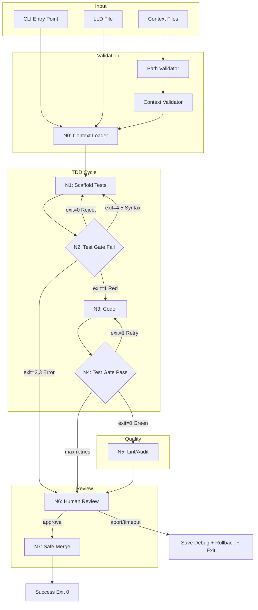

# 187 - Feature: Implementation Workflow: TDD Enforcement & Context-Aware Code Generation

<!-- Template Metadata
Last Updated: 2025-01-XX
Updated By: LLD Creation
Update Reason: Revision addressing Gemini Review #1 feedback
-->

## 1. Context & Goal
* **Issue:** #87
* **Objective:** Create a LangGraph-based implementation workflow that enforces Test-Driven Development, injects architectural context, and safely manages git operations outside of LLM control.
* **Status:** Approved (gemini-3-pro-preview, 2026-02-04)
* **Related Issues:** #003 (LLD Workflow - dependency)

### Open Questions

*All open questions resolved per Gemini Review #1:*

- [x] ~~Should worktree cleanup preserve debug information on failure beyond the rollback state?~~ **RESOLVED: Yes.** The workflow must execute a `git reset --hard` to clean the worktree (Safety), but MUST persist the `ImplementationState` (including diffs/generated code) to a dedicated debug file (e.g., `.assemblyzero/debug/<id>.json`) before cleaning up.
- [x] ~~What is the preferred VS Code command for opening diffs (code --diff vs code -d)?~~ **RESOLVED: `code --diff <left> <right>`** is the explicit, preferred syntax for readability and reliability.
- [x] ~~Should the 30-minute human review timeout auto-abort or auto-preserve state?~~ **RESOLVED: Auto-abort.** To adhere to "Fail Closed" safety principles, a timeout must be treated as a rejection. The workflow must rollback git changes (clean worktree) and exit. Debug state is saved before cleanup as per Q1 resolution.

## 2. Proposed Changes

*This section is the **source of truth** for implementation. Describes exactly what will be built.*

### 2.1 Files Changed

| File | Change Type | Description |
|------|-------------|-------------|
| `assemblyzero/workflows/implementation/__init__.py` | Add | Package init with exports |
| `assemblyzero/workflows/implementation/graph.py` | Add | Main StateGraph definition with all nodes and routing |
| `assemblyzero/workflows/implementation/state.py` | Add | ImplementationState TypedDict definition |
| `assemblyzero/workflows/implementation/nodes/__init__.py` | Add | Nodes subpackage init |
| `assemblyzero/workflows/implementation/nodes/context_loader.py` | Add | N0 node - loads LLD and context files |
| `assemblyzero/workflows/implementation/nodes/scaffold.py` | Add | N1 node - test scaffolding |
| `assemblyzero/workflows/implementation/nodes/test_gates.py` | Add | N2 and N4 nodes - pytest execution and validation |
| `assemblyzero/workflows/implementation/nodes/coder.py` | Add | N3 node - implementation writing |
| `assemblyzero/workflows/implementation/nodes/lint_audit.py` | Add | N5 node - static analysis |
| `assemblyzero/workflows/implementation/nodes/human_review.py` | Add | N6 node - interactive approval/abort |
| `assemblyzero/workflows/implementation/nodes/safe_merge.py` | Add | N7 node - privileged git operations |
| `assemblyzero/workflows/implementation/path_validator.py` | Add | Centralized path security validation |
| `assemblyzero/workflows/implementation/context_validator.py` | Add | File size and token count validation |
| `assemblyzero/workflows/implementation/exit_code_router.py` | Add | Pytest exit code to node routing logic |
| `assemblyzero/workflows/implementation/debug_state.py` | Add | Debug state persistence utilities |
| `assemblyzero/workflows/implementation/mock_llm.py` | Add | Mock LLM responses for offline testing |
| `tools/run_implementation_workflow.py` | Add | CLI entry point |
| `tests/workflows/implementation/__init__.py` | Add | Test package init |
| `tests/workflows/implementation/test_graph.py` | Add | Graph routing tests |
| `tests/workflows/implementation/test_nodes.py` | Add | Individual node unit tests |
| `tests/workflows/implementation/test_path_validator.py` | Add | Path traversal security tests |
| `tests/workflows/implementation/test_context_validator.py` | Add | File size and token limit tests |
| `tests/workflows/implementation/test_exit_code_router.py` | Add | Exit code routing logic tests |
| `tests/workflows/implementation/test_audit_logging.py` | Add | Audit logging verification tests |
| `tests/fixtures/implementation/mock_responses.json` | Add | Static fixtures for mock LLM mode |
| `docs/wiki/workflows.md` | Modify | Add Implementation Workflow section |
| `docs/0003-file-inventory.md` | Modify | Add new files |

### 2.2 Dependencies

```toml
# pyproject.toml additions (if any)
# langgraph already in dependencies
# No new dependencies required
```

### 2.3 Data Structures

```python
# Pseudocode - NOT implementation
class ImplementationState(TypedDict):
    issue_id: str                    # GitHub issue number
    lld_content: str                 # Loaded LLD markdown content
    context_content: str             # Concatenated context files
    test_output: str                 # pytest stdout/stderr
    test_exit_code: int              # pytest exit code (0-5)
    retry_count: int                 # Implementation retry counter (max 3)
    scaffold_retry_count: int        # Test scaffold retry counter
    changed_files: list[str]         # Files modified during workflow
    human_decision: str | None       # "approve" | "abort" | None
    current_node: str                # Current node for logging
    error_history: list[dict]        # Error context for escalation
    audit_logger: GovernanceAuditLog # Logger instance for node transitions
```

```python
class PathValidationResult(TypedDict):
    valid: bool
    resolved_path: str | None
    error: str | None
    rejection_reason: str | None     # "traversal" | "secret" | "size" | "outside_root"
```

```python
class ContextValidationResult(TypedDict):
    valid: bool
    total_size_bytes: int
    estimated_tokens: int
    files_checked: list[str]
    error: str | None
```

```python
class DebugStateRecord(TypedDict):
    """Persisted debug state for post-failure analysis."""
    issue_id: str
    timestamp: str
    final_node: str
    exit_reason: str
    state_snapshot: dict             # Full ImplementationState at failure
    generated_diffs: list[str]       # Diffs of generated code
    error_history: list[dict]
```

### 2.4 Function Signatures

```python
# path_validator.py
def validate_path(path: str, project_root: Path) -> PathValidationResult:
    """Validate a path is safe for context loading."""
    ...

def is_secret_file(filename: str) -> bool:
    """Check if filename matches secret file patterns."""
    ...

# context_validator.py
def validate_file_size(path: Path, max_size_kb: int = 100) -> tuple[bool, str | None]:
    """Check if file is under size limit."""
    ...

def estimate_tokens(content: str) -> int:
    """Estimate token count for content (approx 4 chars per token)."""
    ...

def validate_total_context(files: list[Path], max_tokens: int = 200_000) -> ContextValidationResult:
    """Validate total context size before API call."""
    ...

# debug_state.py
def persist_debug_state(state: ImplementationState, exit_reason: str) -> Path:
    """Save state to .assemblyzero/debug/<issue_id>_<timestamp>.json for debugging."""
    ...

def get_debug_directory() -> Path:
    """Return and ensure .assemblyzero/debug/ directory exists."""
    ...

# exit_code_router.py
def route_by_exit_code(exit_code: int, current_node: str) -> str:
    """Map pytest exit code to next node name."""
    ...

# nodes/context_loader.py
def n0_context_loader(state: ImplementationState) -> ImplementationState:
    """Load and validate LLD and context files."""
    ...

# nodes/scaffold.py
def n1_scaffold(state: ImplementationState) -> ImplementationState:
    """Generate failing test files based on LLD spec."""
    ...

# nodes/test_gates.py
def n2_test_gate_fail(state: ImplementationState) -> ImplementationState:
    """Verify tests fail with exit code 1 (Red phase)."""
    ...

def n4_test_gate_pass(state: ImplementationState) -> ImplementationState:
    """Verify tests pass (Green phase)."""
    ...

def run_pytest(test_paths: list[str], timeout: int = 300) -> tuple[int, str, str]:
    """Execute pytest and return (exit_code, stdout, stderr)."""
    ...

# nodes/coder.py
def n3_coder(state: ImplementationState) -> ImplementationState:
    """Write implementation code using context."""
    ...

# nodes/lint_audit.py
def n5_lint_audit(state: ImplementationState) -> ImplementationState:
    """Run static analysis checks."""
    ...

# nodes/human_review.py
def n6_human_review(state: ImplementationState) -> ImplementationState:
    """Interactive approval/abort with VS Code integration."""
    ...

def open_vscode_diff(left_path: str, right_path: str) -> None:
    """Open VS Code with diff view using 'code --diff <left> <right>'."""
    ...

# nodes/safe_merge.py
def n7_safe_merge(state: ImplementationState) -> ImplementationState:
    """Execute privileged git operations."""
    ...

# graph.py
def build_implementation_graph(audit_logger: GovernanceAuditLog) -> StateGraph:
    """Construct the implementation workflow graph with injected logger."""
    ...

def get_next_node(state: ImplementationState) -> str:
    """Conditional routing based on state."""
    ...

def log_node_transition(audit_logger: GovernanceAuditLog, from_node: str, to_node: str, state: ImplementationState) -> None:
    """Log node transition to GovernanceAuditLog."""
    ...
```

### 2.5 Logic Flow (Pseudocode)

```
1. CLI receives --issue, --lld, --context flags
2. Print data handling policy reminder
3. Initialize GovernanceAuditLog instance
4. IF --dry-run THEN
   - Enable mock LLM mode
   - Print execution path only
5. Initialize ImplementationState with audit_logger

6. N0_ContextLoader:
   a. Log transition: START -> N0
   b. FOR each context file:
      - Validate path (no traversal, not secret, within root)
      - Validate size (<100KB)
      - IF invalid THEN exit with error
   c. Load LLD content
   d. Load and concatenate context files
   e. Validate total tokens (<200k)
   f. IF over limit THEN exit with error

7. N1_Scaffold:
   a. Log transition: N0 -> N1
   b. Call LLM with LLD + context to generate test files
   c. Write test files to disk
   d. Track changed_files

8. N2_TestGate_Fail:
   a. Log transition: N1 -> N2
   b. Run pytest with 300s timeout
   c. Capture exit_code, stdout, stderr
   d. IF exit_code == 1 THEN
      - Proceed to N3_Coder (valid Red state)
   e. ELIF exit_code == 0 THEN
      - Reject: "Tests must fail first"
      - Return to N1_Scaffold
   f. ELIF exit_code in [4, 5] THEN
      - Increment scaffold_retry_count
      - IF scaffold_retry_count > 3 THEN escalate to N6
      - Return to N1_Scaffold
   g. ELIF exit_code in [2, 3] THEN
      - Escalate to N6_Human_Review

9. N3_Coder:
   a. Log transition: N2 -> N3
   b. Inject test_output into context if retry
   c. Call LLM with LLD + context + test errors
   d. Write implementation files to disk
   e. Track changed_files

10. N4_TestGate_Pass:
    a. Log transition: N3 -> N4
    b. Run pytest with 300s timeout
    c. IF exit_code == 0 THEN
       - Proceed to N5_LintAudit
    d. ELSE
       - Increment retry_count
       - Add error to error_history
       - IF retry_count > 3 THEN
          - Escalate to N6_Human_Review
       - ELSE
          - Return to N3_Coder

11. N5_LintAudit:
    a. Log transition: N4 -> N5
    b. Run linting/audit checks
    c. IF pass THEN proceed to N6
    d. ELSE add warnings to state

12. N6_Human_Review:
    a. Log transition: previous -> N6
    b. Display changed files
    c. Open VS Code with diffs using 'code --diff <left> <right>'
    d. Prompt: "Type 'approve' or 'abort'"
    e. IF timeout (30 min) THEN
       - Persist debug state to .assemblyzero/debug/
       - Rollback uncommitted changes (git reset --hard)
       - Exit with code 2
    f. IF "approve" THEN proceed to N7
    g. IF "abort" THEN
       - Persist debug state to .assemblyzero/debug/
       - Rollback uncommitted changes (git reset --hard)
       - Exit with code 2

13. N7_Safe_Merge:
    a. Log transition: N6 -> N7
    b. Commit changes with issue reference
    c. Merge to target branch
    d. Clean up worktree
    e. Exit with code 0
```

### 2.6 Technical Approach

* **Module:** `assemblyzero/workflows/implementation/`
* **Pattern:** LangGraph StateGraph with conditional routing
* **Key Decisions:**
  - Pytest exit codes drive routing, not LLM interpretation
  - Separate retry counters for scaffold vs implementation
  - Human review as explicit gate, not automatic merge
  - Mock LLM mode for testing graph logic without API costs
  - GovernanceAuditLog injected at graph construction time
  - Debug state persisted to `.assemblyzero/debug/` before any cleanup

### 2.7 Architecture Decisions

| Decision | Options Considered | Choice | Rationale |
|----------|-------------------|--------|-----------|
| State Management | Pydantic, TypedDict, dataclass | TypedDict | LangGraph native, simple, typed |
| Pytest Execution | Direct import, subprocess | subprocess | Isolation, real exit codes, timeout support |
| Exit Code Routing | LLM decides, deterministic | Deterministic | Reliability, no hallucination |
| Human Review | Auto-merge, approval gate | Approval gate | Safety, reversibility |
| Mock Mode | Separate mock graph, env flag | Env flag | Single graph, realistic testing |
| Timeout Behavior | Preserve state, Auto-abort | Auto-abort | Fail Closed safety principle |
| Logger Injection | Global singleton, constructor | Constructor injection | Testability, explicit dependency |
| VS Code Diff Command | code -d, code --diff | code --diff | Explicit, readable syntax |

**Architectural Constraints:**
- Must integrate with existing `GovernanceAuditLog` for node transition logging
- Cannot introduce new external dependencies beyond langgraph
- Must preserve existing git worktree patterns from project
- Audit logger must be injected, not globally instantiated

## 3. Requirements

1. Tests MUST be written before implementation code (Red-Green-Refactor)
2. N2_TestGate_Fail MUST verify pytest fails with exit code 1 specifically
3. N2_TestGate_Fail MUST route to N1_Scaffold on exit codes 4 or 5
4. N4_TestGate_Pass MUST route to N3_Coder on pytest failure (retry loop)
5. Maximum 3 retry attempts before human escalation
6. Real subprocess execution—never ask LLM "did tests pass?"
7. Pytest subprocess MUST include 300-second timeout
8. Context files MUST be validated for path traversal attacks
9. Secret file patterns MUST be rejected before transmission
10. Files larger than 100KB MUST be rejected
11. Total context exceeding 200k tokens MUST fail fast before API call
12. Human review MUST support approve/abort interactive flow
13. Git cleanup MUST only execute after successful merge
14. All node transitions MUST be logged via GovernanceAuditLog

## 4. Alternatives Considered

| Option | Pros | Cons | Decision |
|--------|------|------|----------|
| LLM interprets test results | Flexible, can handle edge cases | Hallucination risk, unreliable | **Rejected** |
| Subprocess pytest execution | Reliable, real exit codes | More complex subprocess handling | **Selected** |
| Auto-merge on test pass | Faster workflow | No human safety check | **Rejected** |
| Approval gate before merge | Human oversight, reversible | Adds latency | **Selected** |
| Single retry counter | Simpler state | Can't distinguish scaffold vs code failures | **Rejected** |
| Separate scaffold/code counters | Better error handling | Slightly more complex | **Selected** |
| Timeout preserves state | Less disruptive | Violates Fail Closed principle | **Rejected** |
| Timeout auto-aborts | Consistent safety behavior | May lose work | **Selected** |

**Rationale:** Reliability and safety over speed. TDD enforcement requires real test execution, and human review provides essential safety checkpoint. Fail Closed on timeout ensures consistent safety behavior.

## 5. Data & Fixtures

### 5.1 Data Sources

| Attribute | Value |
|-----------|-------|
| Source | Local filesystem (LLD files, context files) |
| Format | Markdown (.md), Python (.py) |
| Size | Typically <50KB per file, <500KB total |
| Refresh | Manual (user provides paths) |
| Copyright/License | User's project code, no external data |

### 5.2 Data Pipeline

```
User CLI ──--context──► Path Validator ──valid paths──► Context Loader ──content──► LLM API
                                                                                       │
                                                                                       ▼
                                                                              Generated Code
                                                                                       │
                                                                                       ▼
Filesystem ◄──write──────────────────────────────────────────────────────────── Test Files
```

### 5.3 Test Fixtures

| Fixture | Source | Notes |
|---------|--------|-------|
| Mock LLD content | Hardcoded | Minimal valid LLD for graph testing |
| Mock LLM responses | Hardcoded JSON | Deterministic responses per node |
| Mock pytest output | Hardcoded | Sample stdout/stderr for each exit code |
| Traversal paths | Generated | Test vectors for path validation |
| Secret file patterns | Hardcoded | .env, *.key, etc. for rejection tests |
| Mock GovernanceAuditLog | Mock class | Verifies logging calls in tests |

### 5.4 Deployment Pipeline

Local development only - no deployment pipeline. Workflow runs entirely on developer machine.

**If data source is external:** N/A - all data is local filesystem.

## 6. Diagram

### 6.1 Mermaid Quality Gate

- [x] **Simplicity:** Similar components collapsed
- [x] **No touching:** All elements have visual separation
- [x] **No hidden lines:** All arrows fully visible
- [x] **Readable:** Labels not truncated, flow direction clear
- [ ] **Auto-inspected:** Agent rendered via mermaid.ink and viewed

**Auto-Inspection Results:**
```
- Touching elements: [ ] None / [ ] Found: ___
- Hidden lines: [ ] None / [ ] Found: ___
- Label readability: [ ] Pass / [ ] Issue: ___
- Flow clarity: [ ] Clear / [ ] Issue: ___
```

### 6.2 Diagram



## 7. Security & Safety Considerations

### 7.1 Security

| Concern | Mitigation | Status |
|---------|------------|--------|
| Path traversal attack | Resolve paths, validate within project root | Addressed |
| Secret file exposure | Pattern matching rejection (.env, *.key, etc.) | Addressed |
| Code injection via context | Subprocess with arg list, no shell=True | Addressed |
| Token budget attack | File size limits, token estimation | Addressed |
| Symlink escape | Resolve symlinks before validation | Addressed |

### 7.2 Safety

| Concern | Mitigation | Status |
|---------|------------|--------|
| Infinite retry loop | Max 3 retries, then human escalation | Addressed |
| Hanging tests | 300-second subprocess timeout | Addressed |
| Data loss on abort | Debug state saved to `.assemblyzero/debug/` before rollback | Addressed |
| Accidental merge | Human approval required before N7 | Addressed |
| Runaway costs | Token limits, retry caps | Addressed |
| Timeout leaves dirty state | Auto-abort with rollback on timeout | Addressed |

**Fail Mode:** Fail Closed - On any unexpected error or timeout, save debug state, rollback changes, escalate to human review without making permanent changes.

**Recovery Strategy:** On failure, persist `ImplementationState` to `.assemblyzero/debug/<issue_id>_<timestamp>.json`, then `git reset --hard` to clean worktree, exit with code 2 for human intervention. Debug files enable post-mortem analysis.

## 8. Performance & Cost Considerations

### 8.1 Performance

| Metric | Budget | Approach |
|--------|--------|----------|
| Workflow latency | < 10 minutes typical | Parallel-free linear graph |
| Pytest timeout | 300 seconds max | Subprocess timeout parameter |
| Memory | < 512MB | Stream file content, no full repo in memory |
| LLM calls | 2-5 per run | N1 + N3 + retries |

**Bottlenecks:** LLM response time dominates. Pytest execution is secondary.

### 8.2 Cost Analysis

| Resource | Unit Cost | Estimated Usage | Monthly Cost |
|----------|-----------|-----------------|--------------|
| LLM API (input) | ~$3/1M tokens | ~50k tokens/run × 50 runs | ~$7.50 |
| LLM API (output) | ~$15/1M tokens | ~4k tokens/run × 50 runs | ~$3.00 |
| Retry overhead | +20k input/retry | ~1 retry avg × 50 runs | ~$3.00 |

**Estimated monthly cost:** ~$13.50 for 50 feature implementations

**Cost Controls:**
- [x] Retry count capped at 3
- [x] Token estimation before API call
- [x] Context size limits prevent oversized requests

**Worst-Case Scenario:** 3 retries on every run = ~$40/month for 50 runs. Acceptable.

## 9. Legal & Compliance

| Concern | Applies? | Mitigation |
|---------|----------|------------|
| PII/Personal Data | Yes | User responsible for --context content; policy printed on startup |
| Third-Party Licenses | No | No external data sources |
| Terms of Service | Yes | Standard Anthropic API usage |
| Data Retention | N/A | No data persisted beyond session |
| Export Controls | No | No restricted algorithms |

**Data Classification:** Internal (user's own code)

**Compliance Checklist:**
- [x] Data handling policy printed on CLI startup
- [x] User warned about PII/secrets in context
- [x] Basic secret file pattern rejection
- [x] No data persisted to external services

## 10. Verification & Testing

### 10.0 Test Plan (TDD - Complete Before Implementation)

| Test ID | Test Description | Expected Behavior | Status |
|---------|------------------|-------------------|--------|
| T010 | Graph routes N2 to N3 on exit code 1 | Valid Red state proceeds | RED |
| T020 | Graph routes N2 to N1 on exit code 0 | Tests must fail first rejection | RED |
| T030 | Graph routes N2 to N1 on exit code 4 | Syntax error retry | RED |
| T031 | Graph routes N2 to N1 on exit code 5 | No tests collected retry | RED |
| T040 | Graph routes N2 to N6 on exit code 3 | Internal error escalation | RED |
| T050 | Graph routes N4 to N5 on exit code 0 | Valid Green state proceeds | RED |
| T060 | Graph routes N4 to N3 on exit code 1 | Retry implementation | RED |
| T070 | Graph escalates after 3 retries | Human escalation | RED |
| T080 | Path validator rejects traversal | Error on ../ paths | RED |
| T090 | Path validator rejects secrets | Error on .env files | RED |
| T100 | Context validator rejects >100KB | Error with size message | RED |
| T110 | Context validator rejects >200k tokens | Error before API call | RED |
| T120 | Human review accepts approve | Proceeds to N7 | RED |
| T130 | Human review accepts abort | Save debug, rollback, exit 2 | RED |
| T140 | Human review timeout | Save debug, rollback, exit 2 | RED |
| T150 | Pytest subprocess timeout | exit after 300s | RED |
| T160 | Audit logger records transitions | GovernanceAuditLog receives calls | RED |

**Coverage Target:** ≥95% for all new code

**TDD Checklist:**
- [ ] All tests written before implementation
- [ ] Tests currently RED (failing)
- [ ] Test IDs match scenario IDs in 10.1
- [ ] Test file created at: `tests/workflows/implementation/`

### 10.1 Test Scenarios

| ID | Scenario | Type | Input | Expected Output | Pass Criteria |
|----|----------|------|-------|-----------------|---------------|
| 010 | N2 routes to N3 on exit 1 | Auto | state with exit_code=1 | next_node="n3_coder" | Routing correct |
| 020 | N2 rejects on exit 0 | Auto | state with exit_code=0 | next_node="n1_scaffold" | Rejection message |
| 030 | N2 retries scaffold on exit 4 | Auto | state with exit_code=4 | next_node="n1_scaffold" | scaffold_retry_count++ |
| 031 | N2 retries scaffold on exit 5 | Auto | state with exit_code=5 | next_node="n1_scaffold" | scaffold_retry_count++ |
| 040 | N2 escalates on exit 3 | Auto | state with exit_code=3 | next_node="n6_human_review" | Error in history |
| 050 | N4 passes on exit 0 | Auto | state with exit_code=0 | next_node="n5_lint_audit" | Routing correct |
| 060 | N4 retries on exit 1 | Auto | state with exit_code=1 | next_node="n3_coder" | retry_count++ |
| 070 | Max retries escalates | Auto | state with retry_count=3 | next_node="n6_human_review" | Escalation triggered |
| 080 | Traversal path rejected | Auto | path="../../../etc/passwd" | PathValidationResult.valid=False | Error message clear |
| 090 | Secret file rejected | Auto | path=".env" | PathValidationResult.valid=False | rejection_reason="secret" |
| 100 | Large file rejected | Auto | 150KB file | error="exceeds 100KB" | Size in message |
| 110 | Token limit exceeded | Auto | 250k token content | error="exceeds 200k" | Fails before API |
| 120 | Human approves | Auto | human_decision="approve" | next_node="n7_safe_merge" | Proceeds |
| 130 | Human aborts | Auto | human_decision="abort" | debug saved, exit_code=2 | Rollback called, debug file exists |
| 140 | Human review timeout | Auto | 30 min timeout triggered | debug saved, exit_code=2 | Rollback called, debug file exists |
| 150 | Pytest timeout | Auto | hanging test | exit after 300s | Timeout error |
| 160 | Audit log records transitions | Auto | state transitions N0->N1->N2 | logger.log called 2+ times | Mock logger verify |
| 170 | Mock LLM mode | Auto | AGENTOS_MOCK_LLM=1 | No API calls | Fixtures used |
| 180 | Dry run mode | Auto | --dry-run flag | Execution path printed | No API calls |

### 10.2 Test Commands

```bash
# Run all automated tests (uses mock mode)
AGENTOS_MOCK_LLM=1 poetry run pytest tests/workflows/implementation/ -v

# Run path validation tests
poetry run pytest tests/workflows/implementation/test_path_validator.py -v

# Run exit code routing tests
poetry run pytest tests/workflows/implementation/test_exit_code_router.py -v

# Run audit logging tests
AGENTOS_MOCK_LLM=1 poetry run pytest tests/workflows/implementation/test_audit_logging.py -v

# Run graph routing tests
AGENTOS_MOCK_LLM=1 poetry run pytest tests/workflows/implementation/test_graph.py -v

# Run with coverage
AGENTOS_MOCK_LLM=1 poetry run pytest tests/workflows/implementation/ -v --cov=assemblyzero/workflows/implementation
```

### 10.3 Manual Tests (Only If Unavoidable)

| ID | Scenario | Why Not Automated | Steps |
|----|----------|-------------------|-------|
| M010 | VS Code diff opens | Requires GUI verification | 1. Run to N6 2. Verify VS Code opens 3. Verify diff visible |
| M020 | Interactive prompt | Requires stdin interaction | 1. Run to N6 2. Type "approve" 3. Verify proceeds |

## 11. Risks & Mitigations

| Risk | Impact | Likelihood | Mitigation |
|------|--------|------------|------------|
| LLM generates broken test syntax | Med | Med | Exit code 4 routes back to N1 |
| Pytest hangs indefinitely | High | Low | 300s timeout, subprocess kill |
| User passes sensitive file | High | Med | Secret pattern rejection, startup warning |
| Context too large for model | Med | Low | 100KB file limit, 200k token limit |
| Human review timeout | Low | Low | Auto-abort with debug state preservation |
| Infinite scaffold retries | Med | Low | Separate scaffold_retry_count, cap at 3 |
| Audit logger not called | Med | Low | T160 verifies logger integration |

## 12. Definition of Done

### Code
- [ ] All nodes implemented in `assemblyzero/workflows/implementation/nodes/`
- [ ] Graph wired in `graph.py` with conditional routing
- [ ] GovernanceAuditLog injected and used for all transitions
- [ ] Path validator with traversal and secret detection
- [ ] Context validator with size and token limits
- [ ] Exit code router with all pytest codes handled
- [ ] Debug state persistence in `debug_state.py`
- [ ] Mock LLM mode functional
- [ ] CLI with --issue, --lld, --context, --dry-run flags
- [ ] Data handling policy printed on startup
- [ ] VS Code diff uses `code --diff <left> <right>` syntax

### Tests
- [ ] All 18 test scenarios pass (T010-T180)
- [ ] Test coverage ≥95% for new code
- [ ] Mock mode tests run without API calls
- [ ] Path validation security tests comprehensive
- [ ] Audit logging tests verify GovernanceAuditLog integration

### Documentation
- [ ] LLD updated with any deviations
- [ ] `docs/wiki/workflows.md` updated with Implementation Workflow
- [ ] `docs/0003-file-inventory.md` updated with new files
- [ ] Architecture diagram rendered and verified
- [ ] Implementation Report (0103) completed
- [ ] Test Report (0113) completed

### Review
- [ ] Code review completed
- [ ] 0809 Security Audit - PASS
- [ ] 0817 Wiki Alignment Audit - PASS
- [ ] User approval before closing issue

---

## Reviewer Suggestions

*Non-blocking recommendations from the reviewer.*

- **N7 Verification:** While T120 verifies routing to N7, ensure the implementation of N7 (Safe Merge) includes a check to verify the merge was successful before exiting with code 0.
- **Diff Tooling:** Consider adding a fallback if `code` (VS Code) is not in the PATH, though `code --diff` is the specified requirement.

## Appendix: Review Log

*Track all review feedback with timestamps and implementation status.*

### Gemini Review #1 (REVISE)

**Reviewer:** Gemini 3 Pro
**Verdict:** REVISE

#### Comments

| ID | Comment | Implemented? |
|----|---------|--------------|
| G1.1 | "Requirement Coverage Gap: Coverage is 92.8%, below the 95% threshold. Requirement 14 (Audit Logging) is not verified by any test scenario." | YES - Added T160 and scenario 160 for audit logging verification |
| G1.2 | "Logic Flow Contradiction (Timeout): Section 2.5 step 11.d states timeout preserves state, contradicts Fail Closed." | YES - Updated 2.5 step 12.e to save debug then rollback on timeout |
| G1.3 | "Logging Implementation: GovernanceAuditLog not shown in ImplementationState or graph setup." | YES - Added audit_logger field to state, log_node_transition function, injected logger in build_implementation_graph |
| G1.4 | "T030 Expansion: Add coverage for exit code 5." | YES - Added T031 and scenario 031 for exit code 5 |
| G1.5 | "Artifacts Directory: Define where debug information goes." | YES - Added debug_state.py, DebugStateRecord, .assemblyzero/debug/ directory |
| G1.6 | "Open Questions Resolution" | YES - Marked all 3 questions resolved with answers |

### Review Summary

| Review | Date | Verdict | Key Issue |
|--------|------|---------|-----------|
| 2 | 2026-02-04 | APPROVED | `gemini-3-pro-preview` |
| Gemini #1 | (auto) | REVISE | Coverage gap (92.8% < 95%), timeout contradicts Fail Closed |

**Final Status:** APPROVED